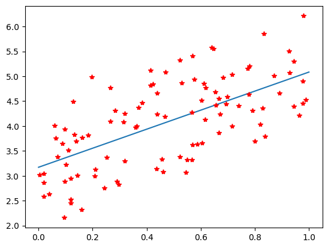

::: {#cell-0 .cell execution_count=8}
``` {.python .cell-code}
import torch
import torch.nn as nn
import numpy as np

# Generate some random data
np.random.seed(0)
X = np.random.rand(100,1)
y = 3 + 2 * X + np.random.randn(100,1) / 1.5
X
```

::: {.cell-output .cell-output-display execution_count=8}
```
array([[0.5488135 ],
       [0.71518937],
       [0.60276338],
       [0.54488318],
       [0.4236548 ],
       [0.64589411],
       [0.43758721],
       [0.891773  ],
       [0.96366276],
       [0.38344152],
       [0.79172504],
       [0.52889492],
       [0.56804456],
       [0.92559664],
       [0.07103606],
       [0.0871293 ],
       [0.0202184 ],
       [0.83261985],
       [0.77815675],
       [0.87001215],
       [0.97861834],
       [0.79915856],
       [0.46147936],
       [0.78052918],
       [0.11827443],
       [0.63992102],
       [0.14335329],
       [0.94466892],
       [0.52184832],
       [0.41466194],
       [0.26455561],
       [0.77423369],
       [0.45615033],
       [0.56843395],
       [0.0187898 ],
       [0.6176355 ],
       [0.61209572],
       [0.616934  ],
       [0.94374808],
       [0.6818203 ],
       [0.3595079 ],
       [0.43703195],
       [0.6976312 ],
       [0.06022547],
       [0.66676672],
       [0.67063787],
       [0.21038256],
       [0.1289263 ],
       [0.31542835],
       [0.36371077],
       [0.57019677],
       [0.43860151],
       [0.98837384],
       [0.10204481],
       [0.20887676],
       [0.16130952],
       [0.65310833],
       [0.2532916 ],
       [0.46631077],
       [0.24442559],
       [0.15896958],
       [0.11037514],
       [0.65632959],
       [0.13818295],
       [0.19658236],
       [0.36872517],
       [0.82099323],
       [0.09710128],
       [0.83794491],
       [0.09609841],
       [0.97645947],
       [0.4686512 ],
       [0.97676109],
       [0.60484552],
       [0.73926358],
       [0.03918779],
       [0.28280696],
       [0.12019656],
       [0.2961402 ],
       [0.11872772],
       [0.31798318],
       [0.41426299],
       [0.0641475 ],
       [0.69247212],
       [0.56660145],
       [0.26538949],
       [0.52324805],
       [0.09394051],
       [0.5759465 ],
       [0.9292962 ],
       [0.31856895],
       [0.66741038],
       [0.13179786],
       [0.7163272 ],
       [0.28940609],
       [0.18319136],
       [0.58651293],
       [0.02010755],
       [0.82894003],
       [0.00469548]])
```
:::
:::


::: {#cell-1 .cell execution_count=9}
``` {.python .cell-code}

# Convert data to PyTorch tensors
X_tensor = torch.from_numpy(X.astype(np.float32))
y_tensor = torch.from_numpy(y.astype(np.float32))


# Define the linear regression model
class LinearRegression(nn.Module):
    def __init__(self):
        super(LinearRegression, self).__init__()
        self.linear = nn.Linear(1, 1)

    def forward(self, x):
        return self.linear(x)


# Initialize the model, loss function, and optimizer
model = LinearRegression()
criterion = nn.MSELoss()
optimizer = torch.optim.SGD(model.parameters(), lr=0.01)

# Train the model
for epoch in range(1000):
    optimizer.zero_grad()
    outputs = model(X_tensor)
    loss = criterion(outputs, y_tensor)
    loss.backward()
    optimizer.step()

    if epoch % 100 == 0:
        print(f"Epoch {epoch+1}, Loss: {loss.item()}")

# Print the learned parameters

m = model.linear.weight.item()
b = model.linear.bias.item()

print("Learned parameters:")
print("Weight:", m)
print("Bias:", b )
```

::: {.cell-output .cell-output-stdout}
```
Epoch 1, Loss: 17.11027717590332
Epoch 101, Loss: 0.5529825687408447
Epoch 201, Loss: 0.4432789981365204
Epoch 301, Loss: 0.44221213459968567
Epoch 401, Loss: 0.4419429302215576
Epoch 501, Loss: 0.4417407214641571
Epoch 601, Loss: 0.44158604741096497
Epoch 701, Loss: 0.44146785140037537
Epoch 801, Loss: 0.4413774013519287
Epoch 901, Loss: 0.4413083791732788
Learned parameters:
Weight: 1.91282320022583
Bias: 3.170973062515259
```
:::
:::


::: {#cell-2 .cell execution_count=10}
``` {.python .cell-code}
import matplotlib.pyplot as plt

t = np.linspace(0 , 1, 200)
fig001 = plt.figure()
plt.plot(t, m*t+b)
plt.plot(X, y, 'r*')
```

::: {.cell-output .cell-output-display}
{}
:::
:::


