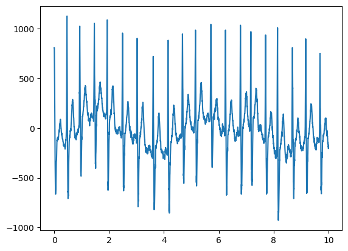
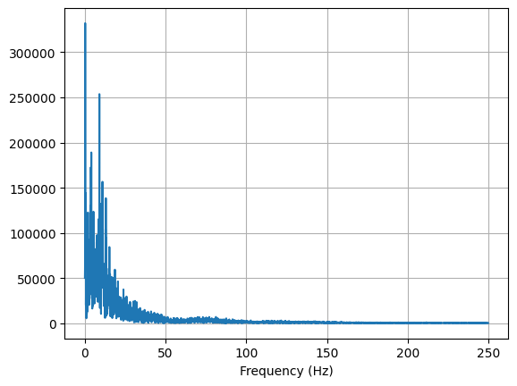
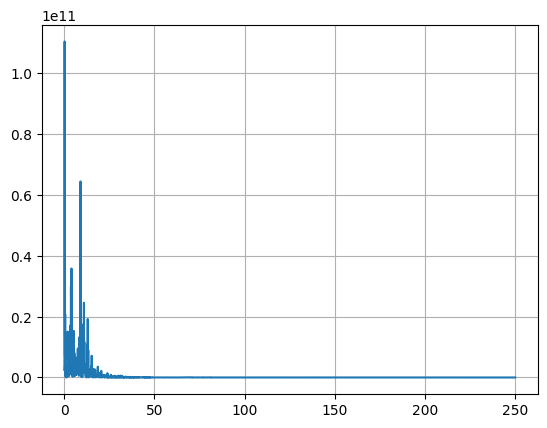
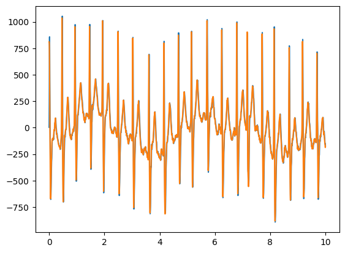
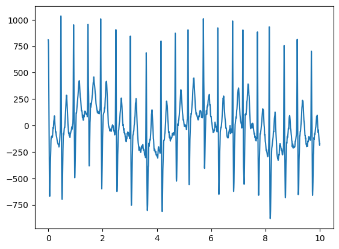
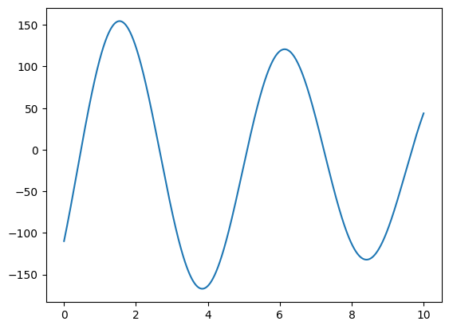
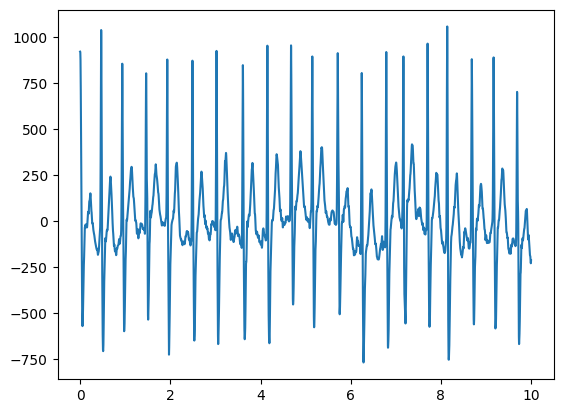

https://www.nature.com/articles/s41597-020-0386-x
https://physionet.org/content/ecg-arrhythmia/1.0.0/


# Estudio de arritmia cardíaca

::: {#cell-3 .cell outputId='c7108cb9-d3e1-4019-bbb2-eb1f8bc5e135'}
``` {.python .cell-code}
from google.colab import drive
drive.mount('/content/drive')
```

::: {.cell-output .cell-output-stdout}
```
Mounted at /content/drive
```
:::
:::


## Carga de librerías

* __numpy:__ Para manipulación numérica y funciones estadísticas básicas
* __matplotlib.pyplot:__ Para generación de gráficos.
* __scipy.io:__ Para carga de datos provenientes de archivos _.mat_
* __scipy.signal:__ Para análisis de señales de la librería SCIPY
* __scipy.optimize:__ Para realizar el ajuste de curva

::: {#cell-5 .cell}
``` {.python .cell-code}
import numpy as np
import matplotlib.pyplot as plt
import scipy.io as sio
import scipy.signal as signal
from scipy.signal import freqz, butter, cheby1, firwin
from scipy.optimize import curve_fit
```
:::


## Configuración de carpetas

::: {#cell-7 .cell}
``` {.python .cell-code}
data_path = "/content/drive/MyDrive/ECG_Dataset/"
```
:::


## Carga de datos

[Archivo de descarga](../../data/JS00001.mat)

::: {#cell-9 .cell}
``` {.python .cell-code}
data = sio.loadmat(data_path+"JS00001.mat")
```
:::


::: {#cell-10 .cell outputId='80c90fd5-2cf8-427a-9039-e2511a18ebf3'}
``` {.python .cell-code}
print(type(data))

```

::: {.cell-output .cell-output-stdout}
```
<class 'dict'>
```
:::
:::


::: {#cell-11 .cell outputId='3ee7556c-7676-4547-84c9-5fae5583d2a3'}
``` {.python .cell-code}
print(data.keys())

```

::: {.cell-output .cell-output-stdout}
```
dict_keys(['val'])
```
:::
:::


::: {#cell-12 .cell outputId='3027772a-db71-4b0c-a756-0c1ea1a36e0b'}
``` {.python .cell-code}
print(type(data["val"]))

```

::: {.cell-output .cell-output-stdout}
```
<class 'numpy.ndarray'>
```
:::
:::


::: {#cell-13 .cell outputId='2c4ad2d3-f1de-452b-df95-8c9956687a34'}
``` {.python .cell-code}
print(data["val"].shape)
```

::: {.cell-output .cell-output-stdout}
```
(12, 5000)
```
:::
:::


::: {#cell-14 .cell}
``` {.python .cell-code}
lead_10 = data["val"][9, :]
```
:::


::: {#cell-15 .cell}
``` {.python .cell-code}
t0 = 0
tf = 10
t = np.linspace(t0, tf, 5000)
```
:::


::: {#cell-16 .cell outputId='e5cd0638-cc00-4a19-e1cb-15c17f3efbfc'}
``` {.python .cell-code}
fig01 = plt.figure()
plt.plot(t,lead_10)
```

::: {.cell-output .cell-output-display}
{}
:::
:::


::: {#cell-17 .cell outputId='9af30764-3e1f-4d36-f34a-f29d0a002b5c'}
``` {.python .cell-code}
ecg_fft = np.fft.fft(lead_10)
ecg_fft
```

::: {.cell-output .cell-output-display execution_count=13}
```
array([ -50343.             +0.j        ,
        -44427.87292792 -48118.33430899j,
        -14003.60280291-331886.8477886j , ...,
       -134619.87742102 -46991.97629606j,
        -14003.60280291+331886.8477886j ,
        -44427.87292792 +48118.33430899j])
```
:::
:::


::: {#cell-18 .cell}
``` {.python .cell-code}
mag_ecg_fft = np.abs(ecg_fft)
f_vect = np.fft.fftfreq(len(mag_ecg_fft))
```
:::


::: {#cell-19 .cell outputId='1811670d-46b3-4e78-ba66-2b292a820671'}
``` {.python .cell-code}
plt.plot(mag_ecg_fft)
```

::: {.cell-output .cell-output-display}
{}
:::
:::


::: {#cell-20 .cell}
``` {.python .cell-code}
N = len(mag_ecg_fft)
f_vect1 = 500*f_vect[:np.uint(N/2)]
mag_ecg_fft1 = mag_ecg_fft[:np.uint(N/2)]
```
:::


::: {#cell-21 .cell outputId='1e509f4b-796a-4c6c-8e2d-e26709e17524'}
``` {.python .cell-code}
plt.plot(f_vect1, mag_ecg_fft1)
plt.grid()
plt.xlabel("Frequency (Hz)")
```

::: {.cell-output .cell-output-display execution_count=19}
```
Text(0.5, 0, 'Frequency (Hz)')
```
:::

::: {.cell-output .cell-output-display}
{}
:::
:::


::: {#cell-22 .cell outputId='b805ed67-b267-4ccd-ed01-d69c4567280f'}
``` {.python .cell-code}
plt.plot(f_vect1, mag_ecg_fft1**2)
plt.grid()
```

::: {.cell-output .cell-output-display}
{}
:::
:::


::: {#cell-23 .cell}
``` {.python .cell-code}
fs = 500
fcut = 50
order = 4

f_corte = fcut/(fs/2)

b, a = signal.butter(order, f_corte, "lowpass")
```
:::


::: {#cell-24 .cell}
``` {.python .cell-code}
def plot_filter_response(b, a=1, fs=1.0):
    """Grafica la respuesta en frecuencia de un filtro dado."""
    w, h = freqz(b, a, worN=2048, fs=fs)  # Calcula la respuesta en frecuencia

    # Magnitud de la respuesta en frecuencia
    plt.figure(figsize=(10, 6))

    plt.subplot(2, 1, 1)
    plt.plot(w, 20 * np.log10(abs(h)), "b")
    plt.title("Respuesta en Frecuencia del Filtro")
    plt.xlabel("Frecuencia [Hz]")
    plt.ylabel("Magnitud [dB]")
    plt.grid()

    # Fase de la respuesta en frecuencia
    plt.subplot(2, 1, 2)
    plt.plot(w, np.angle(h), "g")
    plt.xlabel("Frecuencia [Hz]")
    plt.ylabel("Fase [radianes]")
    plt.grid()

    plt.tight_layout()
    plt.show()


# Parámetros del filtro
fs = 1000  # Frecuencia de muestreo en Hz
cutoff = 200  # Frecuencia de corte en Hz
order = 4  # Orden del filtro

# Filtro IIR Butterworth
b_iir, a_iir = butter(order, cutoff, fs=fs, btype="low", analog=False)
print("Filtro IIR Butterworth")
plot_filter_response(b_iir, a_iir, fs=fs)

# Filtro FIR (ventana de Hamming)
numtaps = 50  # Número de coeficientes del FIR
b_fir = firwin(numtaps, cutoff, fs=fs, window="hamming")
print("Filtro FIR (Ventana de Hamming)")
plot_filter_response(b_fir, fs=fs)
```
:::


::: {#cell-25 .cell}
``` {.python .cell-code}
ecg_filt_1 = signal.lfilter(b, a, lead_10)
ecg_filt_2 = signal.filtfilt(b, a, lead_10) # No causal.
```
:::


::: {#cell-26 .cell outputId='de7b7d73-5f8d-498a-fbfd-e92bec07bd46'}
``` {.python .cell-code}
plt.plot(t, ecg_filt_1)
plt.plot(t, ecg_filt_2)
```

::: {.cell-output .cell-output-display}
{}
:::
:::


::: {#cell-27 .cell outputId='32bb944d-68bd-4488-f522-06a360a754cf'}
``` {.python .cell-code}
plt.plot(t, ecg_filt_2)
```

::: {.cell-output .cell-output-display}
{}
:::
:::


::: {#cell-28 .cell outputId='9f97576b-1311-4410-831f-8a2b5c6832ea'}
``` {.python .cell-code}
mag_ecg_filt = np.abs(np.fft.fft(ecg_filt_2))[:np.uint(N/2)]

plt.plot(f_vect1, mag_ecg_fft1)
plt.plot(f_vect1, mag_ecg_filt)
plt.grid()
plt.xlabel("Frequency (Hz)")
```

::: {.cell-output .cell-output-display execution_count=40}
```
Text(0.5, 0, 'Frequency (Hz)')
```
:::

::: {.cell-output .cell-output-display}
{}
:::
:::


::: {#cell-29 .cell}
``` {.python .cell-code}
def modelo_artefacto(time, p0, p1, p2, p3, p4):
  return p0+p1*np.sin(p2*time)+p3*np.cos(p4*time)
```
:::


::: {#cell-30 .cell}
``` {.python .cell-code}
popt, pcov = curve_fit(modelo_artefacto, t, ecg_filt_2)
```
:::


::: {#cell-31 .cell outputId='56f198d8-0fec-4d98-ccee-60aa528ee316'}
``` {.python .cell-code}
popt[1]
```

::: {.cell-output .cell-output-display execution_count=60}
```
152.2437794044702
```
:::
:::


::: {#cell-32 .cell outputId='3e66ad85-ad3d-430b-d0ea-1489b1a644a7'}
``` {.python .cell-code}
plt.plot(t, modelo_artefacto(t, *popt))
```

::: {.cell-output .cell-output-display}
{}
:::
:::


::: {#cell-33 .cell outputId='4fc167ff-ee1f-48dc-ee94-d64018708e8b'}
``` {.python .cell-code}
plt.plot(t, ecg_filt_2-modelo_artefacto(t, *popt))
```

::: {.cell-output .cell-output-display}
{}
:::
:::


