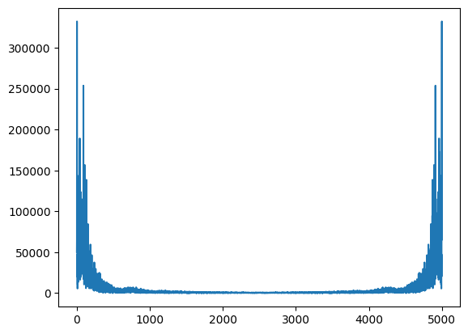
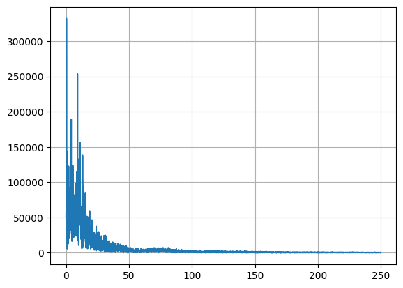
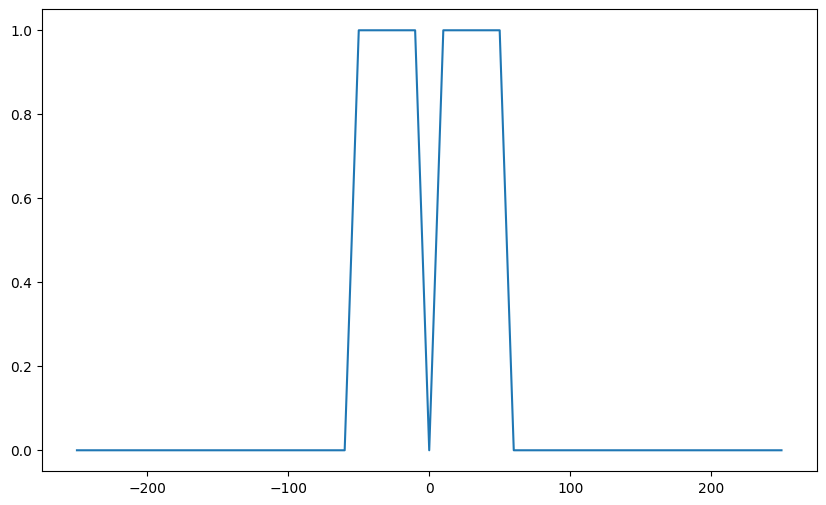
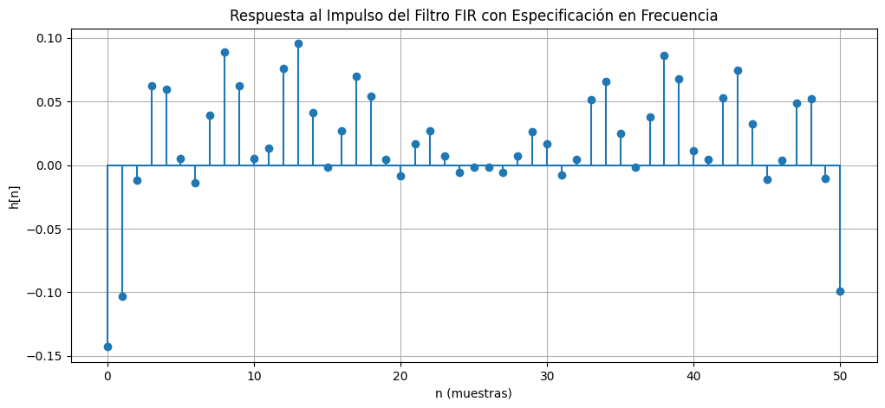
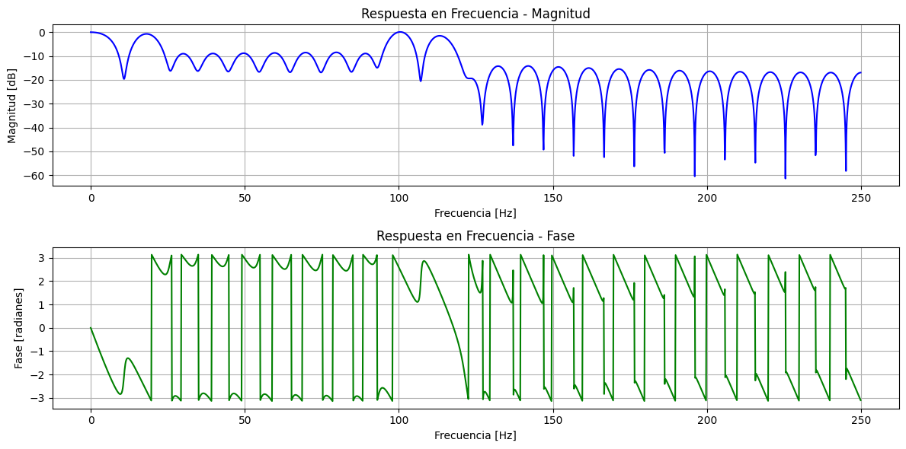
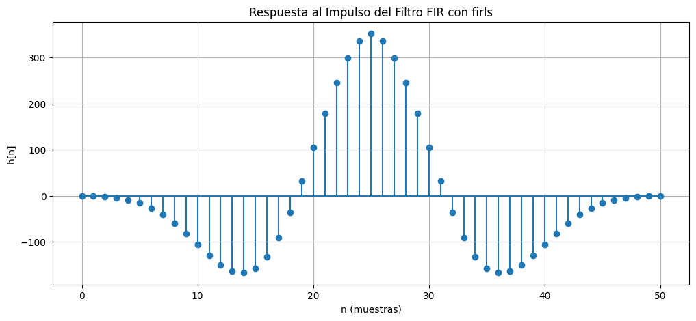
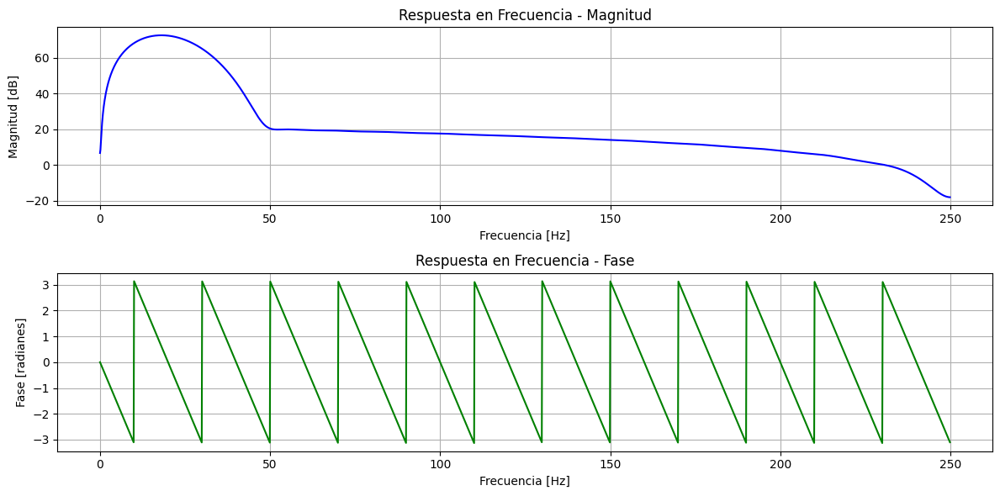

::: {#cell-2 .cell outputId='6da1a0f7-861f-4024-8994-53b01a1c7c2e' execution_count=1}
``` {.python .cell-code}
#from google.colab import drive
#drive.mount('/content/drive')
```
:::


## Carga de librerías

* __numpy:__ Para manipulación numérica y funciones estadísticas básicas
* __matplotlib.pyplot:__ Para generación de gráficos.
* __scipy.io:__ Para carga de datos provenientes de archivos _.mat_

::: {#cell-4 .cell execution_count=17}
``` {.python .cell-code}
import numpy as np
import matplotlib.pyplot as plt
import scipy.io as sio
import scipy.signal as sig
```
:::


## Configuración de carpetas

::: {#cell-6 .cell execution_count=3}
``` {.python .cell-code}
# data_path = "/content/drive/MyDrive/ECG_Dataset/"#Datapath de colab
data_path = "../../data/"
```
:::


## Carga de datos

[Archivo de descarga](../../data/JS00001.mat)

::: {#cell-8 .cell execution_count=4}
``` {.python .cell-code}
data = sio.loadmat(data_path+"JS00001.mat")
```
:::


::: {#cell-9 .cell outputId='cf4cc60b-f9b7-4328-c0e0-95fb01aa4081' execution_count=5}
``` {.python .cell-code}
print(type(data))

```

::: {.cell-output .cell-output-stdout}
```
<class 'dict'>
```
:::
:::


::: {#cell-10 .cell outputId='d0a7f202-0916-4d85-e8fd-bafe3cc4fa6f' execution_count=6}
``` {.python .cell-code}
print(data.keys())

```

::: {.cell-output .cell-output-stdout}
```
dict_keys(['val'])
```
:::
:::


::: {#cell-11 .cell outputId='01f5ffe1-c7ab-4766-edba-62d706c26d7d' execution_count=7}
``` {.python .cell-code}
print(type(data["val"]))

```

::: {.cell-output .cell-output-stdout}
```
<class 'numpy.ndarray'>
```
:::
:::


::: {#cell-12 .cell outputId='98893e73-675b-4b40-e2e5-80a78f50e569' execution_count=8}
``` {.python .cell-code}
print(data["val"].shape)
```

::: {.cell-output .cell-output-stdout}
```
(12, 5000)
```
:::
:::


::: {#cell-13 .cell execution_count=9}
``` {.python .cell-code}
lead_10 = data["val"][9, :]
```
:::


::: {#cell-14 .cell execution_count=10}
``` {.python .cell-code}
t0 = 0
tf = 10
t = np.linspace(t0, tf, 5000)
```
:::


::: {#cell-15 .cell outputId='8e4829ab-69ae-44f5-a631-e0aa00122273' execution_count=11}
``` {.python .cell-code}
fig01 = plt.figure()
plt.plot(t,lead_10)
```

::: {.cell-output .cell-output-display}
{}
:::
:::


::: {#cell-16 .cell outputId='ed245769-ab58-4fb2-801b-d5c5f43fcad2' execution_count=12}
``` {.python .cell-code}
ecg_fft = np.fft.fft(lead_10)
ecg_fft
```

::: {.cell-output .cell-output-display execution_count=12}
```
array([ -50343.             +0.j        ,
        -44427.87292792 -48118.33430899j,
        -14003.60280291-331886.8477886j , ...,
       -134619.87742102 -46991.97629606j,
        -14003.60280291+331886.8477886j ,
        -44427.87292792 +48118.33430899j])
```
:::
:::


::: {#cell-17 .cell execution_count=13}
``` {.python .cell-code}
mag_ecg_fft = np.abs(ecg_fft)
f_vect = np.fft.fftfreq(len(mag_ecg_fft))
```
:::


::: {#cell-18 .cell outputId='01102638-17e2-4d01-8312-655243ea452b' execution_count=14}
``` {.python .cell-code}
plt.plot(mag_ecg_fft)
```

::: {.cell-output .cell-output-display}
{}
:::
:::


::: {#cell-19 .cell execution_count=15}
``` {.python .cell-code}
N = len(mag_ecg_fft)
f_vect1 = 500*f_vect[:np.uint(N/2)]
mag_ecg_fft1 = mag_ecg_fft[:np.uint(N/2)]
```
:::


::: {#cell-20 .cell outputId='8ee5164b-1e02-45ae-a20b-7850d3ba4224' execution_count=16}
``` {.python .cell-code}
plt.plot(f_vect1, mag_ecg_fft1)
plt.grid()
```

::: {.cell-output .cell-output-display}
{}
:::
:::


::: {#cell-21 .cell execution_count=43}
``` {.python .cell-code}
fs =  500

fc1 = 0.5
fc2 = 50
order_fir = 51
```
:::


::: {#cell-22 .cell execution_count=44}
``` {.python .cell-code}
import numpy as np
import matplotlib.pyplot as plt
from scipy.signal import freqz, windows


# Definir el vector de frecuencias
f_vect = np.linspace(-fs//2, fs//2, order_fir)

# Definir la respuesta en frecuencia deseada
H1 = np.zeros(len(f_vect))
H1[(((f_vect >= 0.5) & (f_vect <= 50)) | ((f_vect <= -0.5) & (f_vect >= -50)))] =  1  # Banda de paso entre 0.5 y 50 Hz

plt.figure(figsize=(10,6))
plt.plot(f_vect, H1)

# Normalizar las frecuencias con respecto a Nyquist (fs/2)
normalized_frequencies = f_vect / (fs / 2)

# Interpolación de la respuesta deseada
H_interp = np.interp(np.linspace(0, 1, order_fir), normalized_frequencies, H1)

# Transformada Inversa de Fourier para obtener la respuesta al impulso
h = np.fft.ifft(H_interp, order_fir).real  # Solo tomamos la parte real

# Aplicar ventana de Hamming
window = windows.hamming(order_fir)
h_windowed = h * window

# Normalizar la energía del filtro
h_windowed /= np.sum(h_windowed)

# Calcular la respuesta en frecuencia
w, H_fir = freqz(h_windowed, worN=2048, fs=fs)

# Graficar la respuesta al impulso
plt.figure(figsize=(12, 5))
plt.stem(h_windowed, basefmt="C0")
plt.title("Respuesta al Impulso del Filtro FIR con Especificación en Frecuencia")
plt.xlabel("n (muestras)")
plt.ylabel("h[n]")
plt.grid()
plt.show()

# Graficar la respuesta en frecuencia
plt.figure(figsize=(12, 6))
plt.subplot(2, 1, 1)
plt.plot(w, 20 * np.log10(abs(H_fir)), "b")
plt.title("Respuesta en Frecuencia - Magnitud")
plt.xlabel("Frecuencia [Hz]")
plt.ylabel("Magnitud [dB]")
plt.grid()

plt.subplot(2, 1, 2)
plt.plot(w, np.angle(H_fir), "g")
plt.title("Respuesta en Frecuencia - Fase")
plt.xlabel("Frecuencia [Hz]")
plt.ylabel("Fase [radianes]")
plt.grid()

plt.tight_layout()
plt.show()
```

::: {.cell-output .cell-output-display}
{}
:::

::: {.cell-output .cell-output-display}
{}
:::

::: {.cell-output .cell-output-display}
{}
:::
:::


::: {#cell-23 .cell execution_count=49}
``` {.python .cell-code}
import numpy as np
import matplotlib.pyplot as plt
from scipy.signal import firls, freqz

# Parámetros del filtro
fs = 500  # Frecuencia de muestreo en Hz
N = 51  # Número de coeficientes del filtro (impar para centrar en cero)

# Definir las bandas y la respuesta deseada
bands = [0, 0.5, 50, fs / 2]  # Frecuencias en Hz
desired = [0, 10, 10, 0]  # Pasa-banda de 0.5 Hz a 50 Hz

# Diseñar el filtro FIR con firls
h_firls = firls(N, bands, desired, fs=fs)

# Calcular la respuesta en frecuencia
w, H_fir = freqz(h_firls, worN=2048, fs=fs)

# Graficar la respuesta al impulso
plt.figure(figsize=(12, 5))
plt.stem(h_firls, basefmt="C0")
plt.title("Respuesta al Impulso del Filtro FIR con firls")
plt.xlabel("n (muestras)")
plt.ylabel("h[n]")
plt.grid()
plt.show()

# Graficar la respuesta en frecuencia
plt.figure(figsize=(12, 6))
plt.subplot(2, 1, 1)
plt.plot(w, 20 * np.log10(abs(H_fir)), "b")
plt.title("Respuesta en Frecuencia - Magnitud")
plt.xlabel("Frecuencia [Hz]")
plt.ylabel("Magnitud [dB]")
plt.grid()

plt.subplot(2, 1, 2)
plt.plot(w, np.angle(H_fir), "g")
plt.title("Respuesta en Frecuencia - Fase")
plt.xlabel("Frecuencia [Hz]")
plt.ylabel("Fase [radianes]")
plt.grid()

plt.tight_layout()
plt.show()
```

::: {.cell-output .cell-output-display}
{}
:::

::: {.cell-output .cell-output-display}
{}
:::
:::


