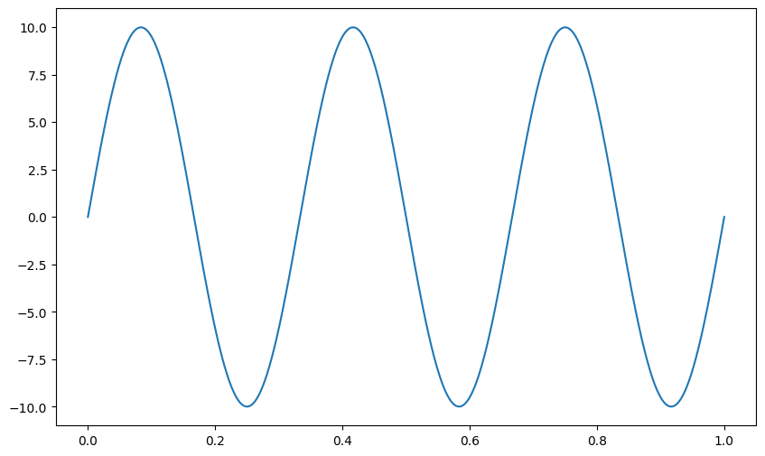
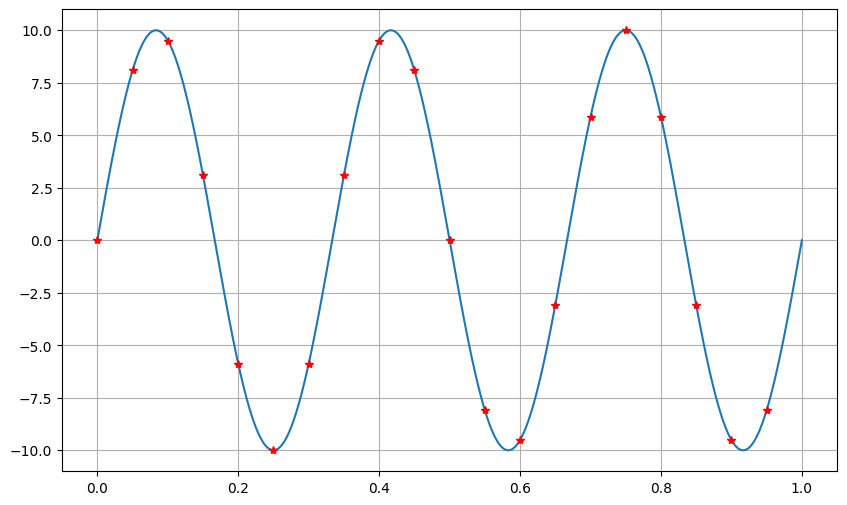
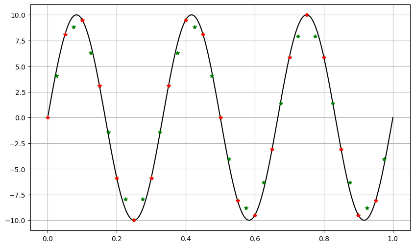

::: {#cell-1 .cell execution_count=1}
``` {.python .cell-code}
import numpy as np
import matplotlib.pyplot as plt
```
:::


$$x\left(t\right) = 10\sin\left(2\pi3t\right)$$
$$t\in\left[0, 5\right]$$
$$f_{s_1} = 20Hz$$
$$f_{s_2} = 100Hz$$


::: {#cell-3 .cell execution_count=2}
``` {.python .cell-code}
t0 = 0
tf = 1
```
:::


## Gráficas iniciales

::: {#cell-5 .cell execution_count=3}
``` {.python .cell-code}
t_graph = np.linspace(t0, tf, 1000)
x = 10*np.sin(2*np.pi*3*t_graph)
plt.figure(figsize=(10,6))
plt.plot(t_graph, x)

```

::: {.cell-output .cell-output-display}
{}
:::
:::


::: {#cell-6 .cell execution_count=4}
``` {.python .cell-code}
fs1 = 20
t_1 = np.linspace(t0, tf, fs1*(tf-t0), endpoint=False)
x_1 = 10 * np.sin(2 * np.pi * 3 * t_1)
plt.figure(figsize=(10, 6))
plt.plot(t_graph, x)
plt.plot(t_1, x_1, 'r*')
plt.grid()
```

::: {.cell-output .cell-output-display}
{}
:::
:::


::: {#cell-7 .cell execution_count=11}
``` {.python .cell-code}
t_oversample = [t0]
x_1_over = [x_1[0]]

delta_t1 = np.mean(np.diff(t_1))

t_oversample = np.empty(len(t_1)+len(t_1))
t_oversample[0::2] = t_1
t_oversample[1::2] = t_1 + (delta_t1/2)

x_1_over = np.empty(len(t_1) + len(t_1))
x_1_over[0::2] = x_1
x_1_over[1::2] = (x_1+np.roll(x_1,-1))/2

plt.figure(figsize=(10, 6))
plt.plot(t_graph, x, "k")
plt.plot(t_oversample, x_1_over, "g*")
plt.plot(t_1, x_1, "r*")
plt.grid()
```

::: {.cell-output .cell-output-display}
{}
:::
:::


::: {#cell-8 .cell execution_count=6}
``` {.python .cell-code}
4//2
```

::: {.cell-output .cell-output-display execution_count=6}
```
2
```
:::
:::


::: {#cell-9 .cell execution_count=7}
``` {.python .cell-code}
4%3
```

::: {.cell-output .cell-output-display execution_count=7}
```
1
```
:::
:::


