::: {#cell-0 .cell}
``` {.python .cell-code}
import numpy as np
import pywt
import matplotlib.pyplot as plt
import imageio
from scipy import signal

# 1. Generate a sample noisy signal
np.random.seed(0)
t = np.linspace(0, 1, 500)
original_signal = signal.sawtooth(2 * np.pi * 5 * t)  # Original signal
noise = np.random.normal(0, 0.5, t.shape)
noisy_signal = original_signal + noise  # Noisy signal

# 2. Define wavelet and apply wavelet transform
wavelet = "db4"  # Daubechies wavelet
coeffs = pywt.wavedec(noisy_signal, wavelet, level=5)

# 3. Denoising by thresholding coefficients
threshold = 0.3  # Set threshold for denoising
coeffs_thresholded = [pywt.threshold(c, threshold * max(c)) for c in coeffs]

# 4. Initialize list for frames
frames = []

# 5. Reconstruct the signal at each thresholding level and save each frame
for i in range(1, len(coeffs_thresholded) + 1):
    # Zero out coefficients above level i
    coeffs_temp = coeffs_thresholded[:i] + [
        np.zeros_like(c) for c in coeffs_thresholded[i:]
    ]
    denoised_signal = pywt.waverec(coeffs_temp, wavelet)

    # Plot the original, noisy, and partially denoised signal
    fig, ax = plt.subplots(figsize=(8, 4))
    ax.plot(t, noisy_signal, label="Noisy Signal", color="gray", alpha=0.6)
    ax.plot(t, original_signal, label="Original Signal", color="black", linestyle="--")
    ax.plot(t, denoised_signal, label=f"Wavelet Denoising (Level {i})", color="blue")
    ax.legend()
    ax.set_title(f"Wavelet Denoising Progression - Level {i}")
    ax.set_xlabel("Time")
    ax.set_ylabel("Amplitude")

    # Save frame as image in memory
    fig.canvas.draw()
    image = np.frombuffer(fig.canvas.tostring_rgb(), dtype="uint8")
    image = image.reshape(fig.canvas.get_width_height()[::-1] + (3,))
    frames.append(image)
    plt.close(fig)  # Close figure to save memory

# 6. Save frames as a GIF
imageio.mimsave("wavelet_transform_denoising.gif", frames, fps=2)
print("GIF saved as 'wavelet_transform_denoising.gif'")
```
:::


::: {#cell-1 .cell}
``` {.python .cell-code}
import numpy as np
import pywt
import matplotlib.pyplot as plt

# Generate a synthetic signal with features
np.random.seed(0)
t = np.linspace(0, 1, 500)
signal = np.sin(2 * np.pi * 5 * t)  # Base signal (5 Hz)
signal[100:120] += 2  # Add a spike (feature at t=0.2)
signal[300:320] -= 1.5  # Add another feature (t=0.6)

# Perform wavelet decomposition (using Daubechies 4 wavelet)
wavelet = "db4"
max_level = 5  # Maximum decomposition level
coeffs = pywt.wavedec(signal, wavelet, level=max_level)

# Plot the original signal with features
plt.figure(figsize=(10, 6))
plt.subplot(3, 1, 1)
plt.plot(t, signal, label="Original Signal with Features", color="black")
plt.title("Original Signal")
plt.xlim(0, 1)
plt.xlabel("Time")
plt.ylabel("Amplitude")
plt.legend()

# Plot the wavelet transform coefficients at different levels
for i in range(1, max_level + 1):
    plt.subplot(3, 2, i + 1)
    # Plot detail coefficients for the current level
    # Zero out other levels to highlight the current level's detail coefficients
    coeffs_temp = [
        coeffs[0] if j == 0 else np.zeros_like(coeff) for j, coeff in enumerate(coeffs)
    ]
    coeffs_temp[i] = coeffs[i]  # Keep the detail coefficients for level i

    # Reconstruct the signal using only the current level's details
    feature_detection = pywt.waverec(coeffs_temp, wavelet)
    plt.plot(
        t,
        feature_detection[: len(signal)],
        label=f"Level {i} Feature Detection",
        color="red",
    )
    plt.title(f"Detected Features - Level {i}")
    plt.xlim(0, 1)
    plt.xlabel("Time")
    plt.ylabel("Amplitude")
    plt.legend()

plt.tight_layout()
plt.show()
```
:::


::: {#cell-2 .cell}
``` {.python .cell-code}
import matplotlib.pyplot as plt
import numpy as np

# Configuración del vector
vx, vy = 4, 3  # Componentes del vector

# Crear la figura y los ejes
fig, ax = plt.subplots()

# Dibujar los ejes
ax.axhline(0, color="black", linewidth=0.5)
ax.axvline(0, color="black", linewidth=0.5)

# Dibujar el vector
ax.quiver(
    0,
    0,
    vx,
    vy,
    angles="xy",
    scale_units="xy",
    scale=1,
    color="blue",
)

# Dibujar el vector con estilo de línea punteada
ax.plot([0, vx], [0, 0], "k--")  # Línea punteada para el vector
ax.plot(vx, 0, "ko")  # Punto en el extremo del vector
ax.plot([0, 0], [0, vy], "k--")  # Línea punteada para el vector
ax.plot(0, vy, "ko")  # Punto en el extremo del vector

# Dibujar las proyecciones en los ejes
ax.plot([vx, vx], [0, vy], "r:")
ax.plot([0, vx], [vy, vy], "g:")

# Etiquetas para las proyecciones
ax.text(vx, -0.1, r"$X_1$", ha="center", va="top")
ax.text(-0.1, vy, r"$Y_1$", ha="right", va="center")
ax.text(vx, vy, r"$(X_1, Y_1)$", ha="left", va="bottom")
ax.text(-0.3, -0.3, "O", ha="center", va="center")

# Configurar los límites de la gráfica
ax.set_xlim(-1, vx + 2)
ax.set_ylim(-1, vy + 2)

# Añadir etiquetas y leyendas
ax.set_xlabel("x")
ax.set_ylabel("y")
ax.legend()

# Configurar la cuadrícula
ax.grid(True)
ax.set_aspect("equal")

# Mostrar el gráfico
plt.show()
```
:::


::: {#cell-3 .cell}
``` {.python .cell-code}
import numpy as np
import matplotlib.pyplot as plt

# Time vector
t = np.linspace(-3, 3, 500)

# Define the original function and its components
f_t = np.exp(t)  # Original function: e^t
f_even = (np.exp(t) + np.exp(-t)) / 2  # Even part: cosh(t)
f_odd = (np.exp(t) - np.exp(-t)) / 2  # Odd part: sinh(t)

# Create the subplots
fig, axs = plt.subplots(3, 1, figsize=(10, 12), sharex=True)

# Plot the original function
axs[0].plot(t, f_t, label=r"$f(t) = e^t$", color="blue", linewidth=2)
axs[0].set_title("Original Function", fontsize=14)
axs[0].set_ylabel("Amplitude", fontsize=12)
axs[0].legend(fontsize=12)
axs[0].grid(True)

# Plot the even part
axs[1].plot(
    t, f_even, label=r"$f_{\text{even}}(t) = \cosh(t)$", color="green", linewidth=2
)
axs[1].set_title("Even Part of the Function", fontsize=14)
axs[1].set_ylabel("Amplitude", fontsize=12)
axs[1].legend(fontsize=12)
axs[1].grid(True)

# Plot the odd part
axs[2].plot(t, f_odd, label=r"$f_{\text{odd}}(t) = \sinh(t)$", color="red", linewidth=2)
axs[2].set_title("Odd Part of the Function", fontsize=14)
axs[2].set_xlabel("Time (s)", fontsize=12)
axs[2].set_ylabel("Amplitude", fontsize=12)
axs[2].legend(fontsize=12)
axs[2].grid(True)

# Adjust layout
plt.tight_layout()
plt.show()
```
:::


::: {#cell-5 .cell}
``` {.python .cell-code}
import requests

response = requests.get(
    "https://charts-spotify-com-service.spotify.com/public/v0/charts"
)

data = response.json()

for entry in response.json()["chartEntryViewResponses"][0]["entries"]:
    meta = entry["trackMetadata"]
    entry = entry["chartEntryData"]

    track = meta["trackName"]
    artists = ", ".join([artist["name"] for artist in meta["artists"]])

    print(f"{entry['currentRank']:3} | {track:50} | {artists}")
```
:::


::: {#cell-6 .cell}
``` {.python .cell-code}
import numpy as np
import matplotlib.pyplot as plt

beta = 2  # Amplitude scaling factor
t = np.linspace(-5, 5, 400)

# Scaled functions
u_t = beta * np.heaviside(t, 1)  # Amplitude-Scaled Unit Step
r_t = beta * np.maximum(t, 0)  # Amplitude-Scaled Unit Ramp
sinc_t = beta * np.sinc(t)  # Amplitude-Scaled Sinc
delta_t = beta * np.exp(-100 * t**2)  # Amplitude-Scaled Dirac Delta (approximated)

# Plot all functions in a single figure
fig, axes = plt.subplots(2, 2, figsize=(12, 8))

# Unit Step Function
axes[0, 0].plot(t, u_t, label="Amplitude-Scaled Unit Step", linewidth=2)
axes[0, 0].set_title("Amplitude-Scaled Unit Step Function")
axes[0, 0].set_xlabel("Time (t)")
axes[0, 0].set_ylabel("Amplitude")
axes[0, 0].grid(True)
axes[0, 0].legend()

# Unit Ramp Function
axes[0, 1].plot(t, r_t, label="Amplitude-Scaled Unit Ramp", linewidth=2)
axes[0, 1].set_title("Amplitude-Scaled Unit Ramp Function")
axes[0, 1].set_xlabel("Time (t)")
axes[0, 1].set_ylabel("Amplitude")
axes[0, 1].grid(True)
axes[0, 1].legend()

# Sinc Function
axes[1, 0].plot(t, sinc_t, label="Amplitude-Scaled Sinc Function", linewidth=2)
axes[1, 0].set_title("Amplitude-Scaled Sinc Function")
axes[1, 0].set_xlabel("Time (t)")
axes[1, 0].set_ylabel("Amplitude")
axes[1, 0].grid(True)
axes[1, 0].legend()

# Dirac Delta Function
axes[1, 1].plot(t, delta_t, label="Amplitude-Scaled Dirac Delta (Approx.)", linewidth=2)
axes[1, 1].set_title("Amplitude-Scaled Dirac Delta Function (Approx.)")
axes[1, 1].set_xlabel("Time (t)")
axes[1, 1].set_ylabel("Amplitude")
axes[1, 1].grid(True)
axes[1, 1].legend()

# Adjust layout and show the plot
plt.tight_layout()
plt.show()
```
:::


::: {#cell-7 .cell}
``` {.python .cell-code}
t = np.linspace(-10,10,1000)
x = np.zeros(t.shape)

x = (
    np.maximum(t + 5, 0)
    - np.maximum(t + 0, 0)
    - 3 * np.heaviside(t - 5, 1)
    - np.maximum(t - 7.5, 0)
    + np.maximum(t-9.5, 0)
)
plt.figure(figsize=(16,6.75))
plt.plot(t,x)
plt.grid()
plt.xlabel("Time(s)")
plt.ylabel("Amplitude")
```
:::


::: {#cell-8 .cell}
``` {.python .cell-code}
# Re-import necessary libraries after execution state reset
import numpy as np
import matplotlib.pyplot as plt

# Define time range for three periods
T = 2 * np.pi  # Period of sine function
t = np.linspace(-T, 2 * T, 1000)  # Three periods
y = np.sin(t)

# Define one period to highlight in blue
t_highlight = np.linspace(0, T, 300)
y_highlight = np.sin(t_highlight)

# Plot the sine function
plt.figure(figsize=(12, 6))
plt.plot(t, y, label="Sine Function", linewidth=2, color="black")
plt.plot(
    t_highlight, y_highlight, linewidth=3, color="blue", label="Highlighted Period"
)

# Labels and grid
plt.xlabel("Time (t)")
plt.ylabel("Amplitude")
plt.title("Sine Function Over Three Periods")
plt.axhline(0, color="black", linewidth=0.8)
plt.axvline(T, color="gray", linestyle="--", linewidth=1)  # Marking one period end
plt.axvline(
    2 * T, color="gray", linestyle="--", linewidth=1
)  # Marking second period end
plt.grid(True, linestyle="--", alpha=0.6)
plt.legend()

# Show the plot
plt.show()
```
:::


::: {#cell-9 .cell}
``` {.python .cell-code}
# Define fundamental periods
T1 = 10  # Period of first signal
T2 = 3  # Period of second signal

# Time range covering multiple periods
t = np.linspace(0, 20, 1000)

# Define two periodic signals
x1 = np.sin((2 * np.pi / T1) * t)  # First periodic signal
x2 = np.cos((2 * np.pi / T2) * t)  # Second periodic signal

# Sum of both signals
x_sum = x1 + x2

# Plot signals
plt.figure(figsize=(12, 6))

plt.plot(t, x1, label=f"Signal 1: Period {T1}", linestyle="dashed")
plt.plot(t, x2, label=f"Signal 2: Period {T2}", linestyle="dotted")
plt.plot(t, x_sum, label="Sum of Signals", linewidth=2, color="black")

plt.xlabel("Time (t)")
plt.ylabel("Amplitude")
plt.title("Sum of Two Periodic Signals")
plt.axhline(0, color="gray", linewidth=0.8)
plt.grid(True, linestyle="--", alpha=0.6)
plt.legend()

plt.show()
```
:::


::: {#cell-10 .cell}
``` {.python .cell-code}
import numpy as np
import matplotlib.pyplot as plt

# Parámetros de la señal
duration = 2  # Duración en segundos
fs = 1000  # Frecuencia de muestreo en Hz
t = np.linspace(0, duration, duration * fs, endpoint=False)  # Vector de tiempo

# Señal senoidal de 10 Hz
freq = 10
sine_wave = np.sin(2 * np.pi * freq * t)

# Señal de ruido aleatorio con distribución normal
noise_normal = np.random.normal(0, 1, len(t))

# Señal con ruido aleatorio de 2 a 5 Hz
low_freq_noise = np.sin(2 * np.pi * np.random.uniform(2, 5) * t)
signal_with_low_freq_noise = sine_wave + low_freq_noise

# Señal con ruido aleatorio uniforme sumado
uniform_noise = np.random.uniform(-0.5, 0.5, len(t))
signal_with_uniform_noise = sine_wave + uniform_noise

# Señal con ruido aleatorio uniforme multiplicado
multiplicative_noise = np.random.uniform(0.5, 1.5, len(t))
signal_with_mult_noise = sine_wave * multiplicative_noise

# Graficamos las señales
fig, axes = plt.subplots(5, 1, figsize=(10, 10), sharex=True)

axes[0].plot(t, sine_wave, label="Sine wave (10 Hz)")
axes[0].set_title("Sine Wave (10 Hz)")
axes[0].legend()

axes[1].plot(
    t, noise_normal, label="Random Noise (Normal Distribution)", color="orange"
)
axes[1].set_title("Random Noise (Normal Distribution)")
axes[1].legend()

axes[2].plot(
    t, signal_with_low_freq_noise, label="Sine + Low Freq Noise (2-5 Hz)", color="green"
)
axes[2].set_title("Sine + Low Freq Noise (2-5 Hz)")
axes[2].legend()

axes[3].plot(t, signal_with_uniform_noise, label="Sine + Uniform Noise", color="red")
axes[3].set_title("Sine + Uniform Noise")
axes[3].legend()

axes[4].plot(t, signal_with_mult_noise, label="Sine * Uniform Noise", color="purple")
axes[4].set_title("Sine * Uniform Noise")
axes[4].legend()

plt.xlabel("Time [s]")
plt.tight_layout()
plt.show()
```
:::


::: {#cell-11 .cell}
``` {.python .cell-code}
import numpy as np
import matplotlib.pyplot as plt

# Parámetros
Fs = 10  # Frecuencia de muestreo (Hz)
F1 = 3  # Frecuencia de la primera señal (Hz)
F2 = F1 + Fs  # Frecuencia de la segunda señal (F1 + Fs) - Produce aliasing

T = 1  # Duración en segundos
t_continuo = np.linspace(0, T, 1000)  # Tiempo continuo para la señal original
n_discreto = np.arange(0, T, 1 / Fs)  # Instantes de muestreo

# Generar señales en tiempo continuo
x_continuo1 = np.cos(2 * np.pi * F1 * t_continuo)
x_continuo2 = np.cos(2 * np.pi * F2 * t_continuo)

# Generar señales muestreadas
x_discreto1 = np.cos(2 * np.pi * F1 * n_discreto)
x_discreto2 = np.cos(2 * np.pi * F2 * n_discreto)

# Crear figura con ejes alineados
fig, axs = plt.subplots(2, 1, figsize=(10, 6), sharex=True)

# Graficar señales continuas
axs[0].plot(t_continuo, x_continuo1, label=f"Frequency {F1} Hz", linestyle="dashed")
axs[0].plot(t_continuo, x_continuo2, label=f"Frequency {F2} Hz", linestyle="dotted")
axs[0].set_title("Continous-Time Signals")
axs[0].set_ylabel("Amplitude")
axs[0].legend()
axs[0].grid()

# Graficar señales muestreadas con puntos diferenciados
axs[1].stem(
    n_discreto,
    x_discreto1,
    linefmt="k-",
    markerfmt="ko",
    basefmt="g-",
    label=f"Samples {F1} Hz",
)

# Añadir puntos sin relleno para diferenciar la segunda señal
axs[1].scatter(
    n_discreto,
    x_discreto2,
    facecolors="none",
    edgecolors="r",
    s=80,
    label=f"Samples {F2} Hz",
)

axs[1].set_title("Discrete Signals (Sampled)")
axs[1].set_xlabel("Time(s)")
axs[1].set_ylabel("Amplitude")
axs[1].legend()
axs[1].grid()

plt.tight_layout()
plt.show()
```
:::


::: {#cell-12 .cell}
``` {.python .cell-code}
import numpy as np
import matplotlib.pyplot as plt

# Parámetros
Fs = 10  # Frecuencia de muestreo (Hz)
F1 = 3  # Frecuencia de la primera señal (Hz)
F2 = F1 + Fs  # Frecuencia de la segunda señal (F1 + Fs) - Produce aliasing

T = 1  # Duración en segundos
t_continuo = np.linspace(0, T, 1000)  # Tiempo continuo para la señal original
n_discreto = np.arange(0, T, 1 / Fs)  # Instantes de muestreo

# Generar señales en tiempo continuo
x_continuo1 = np.cos(2 * np.pi * F1 * t_continuo)
x_continuo2 = np.cos(2 * np.pi * F2 * t_continuo)

# Generar señales muestreadas
x_discreto1 = np.cos(2 * np.pi * F1 * n_discreto)
x_discreto2 = np.cos(2 * np.pi * F2 * n_discreto)

plt.figure(figsize=(10, 6))
plt.plot(t_continuo, x_continuo1, label=f"Frecuencia {F1} Hz", linestyle="dashed", color="brown")
plt.plot(t_continuo, x_continuo2, label=f"Frecuencia {F2} Hz", linestyle="dotted", color="black")
plt.scatter(
    n_discreto,
    x_discreto1,
    facecolors='none',
    edgecolors='red',
    s=100,
    label=f"Muestras {F1} Hz",
)
plt.scatter(
    n_discreto,
    x_discreto2,
    facecolors="blue",
    edgecolors="blue",
    label=f"Muestras {F2} Hz",
)

plt.title("Discrete Signals (Sampled)")
plt.xlabel("Time (s)")
plt.ylabel("Amplitude")

plt.legend()
plt.grid()
plt.show()
```
:::


::: {#cell-13 .cell}
``` {.python .cell-code}
import numpy as np
import matplotlib.pyplot as plt
from scipy.signal import freqz, butter, cheby1, firwin


def plot_filter_response(b, a=1, fs=1.0):
    """Grafica la respuesta en frecuencia de un filtro dado."""
    w, h = freqz(b, a, worN=2048, fs=fs)  # Calcula la respuesta en frecuencia

    # Magnitud de la respuesta en frecuencia
    plt.figure(figsize=(10, 6))

    plt.subplot(2, 1, 1)
    plt.plot(w, 20 * np.log10(abs(h)), "b")
    plt.title("Respuesta en Frecuencia del Filtro")
    plt.xlabel("Frecuencia [Hz]")
    plt.ylabel("Magnitud [dB]")
    plt.grid()

    # Fase de la respuesta en frecuencia
    plt.subplot(2, 1, 2)
    plt.plot(w, np.angle(h), "g")
    plt.xlabel("Frecuencia [Hz]")
    plt.ylabel("Fase [radianes]")
    plt.grid()

    plt.tight_layout()
    plt.show()


# Parámetros del filtro
fs = 1000  # Frecuencia de muestreo en Hz
cutoff = 200  # Frecuencia de corte en Hz
order = 4  # Orden del filtro

# Filtro IIR Butterworth
b_iir, a_iir = butter(order, cutoff, fs=fs, btype="low", analog=False)
print("Filtro IIR Butterworth")
plot_filter_response(b_iir, a_iir, fs=fs)

# Filtro FIR (ventana de Hamming)
numtaps = 51  # Número de coeficientes del FIR
b_fir = firwin(numtaps, cutoff, fs=fs, window="hamming")
print("Filtro FIR (Ventana de Hamming)")
plot_filter_response(b_fir, fs=fs)
```
:::


::: {#cell-14 .cell}
``` {.python .cell-code}
import numpy as np
import matplotlib.pyplot as plt


# Función para generar la respuesta ideal en el dominio del tiempo
def ideal_impulse_response(filter_type, fc1, fc2=None, fs=1.0, N=51):
    """
    Calcula la respuesta al impulso ideal de un filtro FIR.

    Parámetros:
    - filter_type: Tipo de filtro ('lowpass', 'highpass', 'bandpass', 'bandstop')
    - fc1: Frecuencia de corte (Hz) para LPF y HPF, Frecuencia baja para BPF y BSF
    - fc2: Frecuencia alta (Hz) para BPF y BSF (no usada en LPF y HPF)
    - fs: Frecuencia de muestreo (Hz)
    - N: Tamaño del filtro (debe ser impar para centrado en cero)

    Retorna:
    - h: Respuesta al impulso en el dominio del tiempo
    - n: Índices del tiempo
    """
    n = np.arange(-(N // 2), (N // 2) + 1)  # Centrado en n=0

    # Filtro Pasa-Bajas (LPF)
    if filter_type == "lowpass":
        h = np.sinc(2 * fc1 * n / fs)

    # Filtro Pasa-Altas (HPF)
    elif filter_type == "highpass":
        h = np.sinc(n) - np.sinc(2 * fc1 * n / fs)

    # Filtro Pasa-Banda (BPF)
    elif filter_type == "bandpass":
        if fc2 is None:
            raise ValueError("Se necesita fc2 para un filtro pasa-banda")
        h = np.sinc(2 * fc2 * n / fs) - np.sinc(2 * fc1 * n / fs)

    # Filtro Rechaza-Banda (BSF)
    elif filter_type == "bandstop":
        if fc2 is None:
            raise ValueError("Se necesita fc2 para un filtro rechaza-banda")
        h = np.sinc(n) - (np.sinc(2 * fc2 * n / fs) - np.sinc(2 * fc1 * n / fs))

    else:
        raise ValueError("Tipo de filtro no válido")

    return h, n


# Parámetros
fs = 1000  # Frecuencia de muestreo (Hz)
fc1 = 100  # Frecuencia de corte (Hz) para LPF y HPF
fc2 = 300  # Frecuencia de corte superior para BPF y BSF
N = 51  # Orden del filtro (impar para centrado en 0)

# Calcular respuestas al impulso
filters = ["lowpass", "highpass", "bandpass", "bandstop"]
responses = {f: ideal_impulse_response(f, fc1, fc2, fs, N) for f in filters}

# Graficar respuestas
fig, axs = plt.subplots(2, 2, figsize=(12, 8))

for ax, (key, (h, n)) in zip(axs.flatten(), responses.items()):
    ax.stem(n, h)
    ax.set_title(f"{key.upper()} Ideal")
    ax.set_xlabel("n (muestras)")
    ax.set_ylabel("h[n]")
    ax.grid()

plt.tight_layout()
plt.show()
```
:::


::: {#cell-15 .cell}
``` {.python .cell-code}
import numpy as np
import matplotlib.pyplot as plt
from scipy.signal import chirp

# Generate a synthetic ECG-like signal (chirp function as approximation)
fs_original = 10000  # High sampling rate (Hz) - "continuous" signal
t = np.linspace(0, 1, fs_original, endpoint=False)  # 1-second signal
signal = np.sin(2 * np.pi * 1.7 * (t**2))  # Simulated chirp (similar to ECG waves)

# Downsample (Sampling Process)
fs_sampled = 200  # Sampling frequency in Hz (e.g., ECG sampled at 200 Hz)
t_sampled = np.arange(0, 1, 1 / fs_sampled)
signal_sampled = np.sin(2 * np.pi * 1.7 * (t_sampled**2))


# Quantization (8-bit and 4-bit)
def quantize(signal, bits):
    levels = 2**bits
    min_val, max_val = signal.min(), signal.max()
    step = (max_val - min_val) / levels
    quantized_signal = np.round((signal - min_val) / step) * step + min_val
    return quantized_signal


signal_quantized_8bit = quantize(signal_sampled, 8)
signal_quantized_4bit = quantize(signal_sampled, 4)

# Plot Results
plt.figure(figsize=(12, 6))

# Original vs Sampled Signal
plt.subplot(2, 1, 1)
plt.plot(t, signal, "k", alpha=0.3, label="Original Signal (High Resolution)")
plt.plot(t_sampled, signal_sampled, "ro-", label=f"Sampled Signal ({fs_sampled} Hz)")
plt.xlabel("Time (s)")
plt.ylabel("Amplitude")
plt.legend()
plt.title("Sampling Process")

# Quantized Signals
plt.subplot(2, 1, 2)
plt.plot(t_sampled, signal_quantized_4bit, "ro-", alpha=0.5, label="Quantized 4-bit")
plt.plot(t_sampled, signal_quantized_8bit, "go-", alpha=0.5, label="Quantized 8-bit")
plt.plot(t_sampled, signal_sampled, "b-", alpha=0.5, label="Original Sampled")
plt.xlabel("Time (s)")
plt.ylabel("Amplitude")
plt.legend()
plt.title("Quantization Effect")

plt.tight_layout()
plt.show()
```
:::


::: {#cell-16 .cell}
``` {.python .cell-code}
import numpy as np
import matplotlib.pyplot as plt
from scipy.signal import resample, butter, filtfilt

# --- Parámetros de la Señal ---
fs_original = 20  # Frecuencia de muestreo baja (Hz)
t_original = np.linspace(0, 1, fs_original, endpoint=False)  # 1 segundo de duración
freq_signal = 3  # Frecuencia de la señal en Hz
signal_original = np.sin(2 * np.pi * freq_signal * t_original)  # Señal senoidal

# --- Añadir Ruido ---
noise_amplitude = 0.5
noise = noise_amplitude * np.random.randn(len(t_original))  # Ruido gaussiano
signal_noisy = signal_original + noise  # Señal con ruido

# --- Aplicar Sobremuestreo ---
oversampling_factor = 5  # Aumentamos la frecuencia de muestreo 5 veces
fs_oversampled = fs_original * oversampling_factor  # Nueva frecuencia de muestreo
t_oversampled = np.linspace(0, 1, fs_oversampled, endpoint=False)  # Nuevo eje de tiempo
signal_oversampled = np.interp(
    t_oversampled, t_original, signal_noisy
)  # Interpolación lineal


# --- Filtrado de Ruido después del Sobremuestreo ---
def butter_lowpass_filter(data, cutoff, fs, order=4):
    nyquist = 0.5 * fs  # Frecuencia de Nyquist
    normal_cutoff = cutoff / nyquist  # Normalización
    b, a = butter(order, normal_cutoff, btype="low", analog=False)
    filtered_data = filtfilt(b, a, data)  # Filtrado sin desfase
    return filtered_data


cutoff_freq = (
    freq_signal * 1.5
)  # Frecuencia de corte del filtro (ligeramente mayor a la señal)
signal_filtered = butter_lowpass_filter(signal_oversampled, cutoff_freq, fs_oversampled)

# --- Visualización ---
plt.figure(figsize=(12, 6))

# Señal original con ruido
plt.subplot(3, 1, 1)
plt.plot(t_original, signal_noisy, "bo-", label="Señal con ruido (Baja Fs)")
plt.xlabel("Tiempo (s)")
plt.ylabel("Amplitud")
plt.legend()
plt.title("Señal Original con Ruido")

# Señal sobremuestreada con ruido
plt.subplot(3, 1, 2)
plt.plot(
    t_oversampled,
    signal_oversampled,
    "r-",
    alpha=0.7,
    label=f"Sobremuestreada ({fs_oversampled} Hz)",
)
plt.xlabel("Tiempo (s)")
plt.ylabel("Amplitud")
plt.legend()
plt.title("Señal Sobremuestreada con Ruido")

# Señal sobremuestreada y filtrada
plt.subplot(3, 1, 3)
plt.plot(
    t_oversampled, signal_filtered, "g-", label="Señal Filtrada (Reducción de Ruido)"
)
plt.xlabel("Tiempo (s)")
plt.ylabel("Amplitud")
plt.legend()
plt.title("Señal Filtrada después del Sobremuestreo")

plt.tight_layout()
plt.show()
```
:::


::: {#cell-17 .cell}
``` {.python .cell-code}
import random
lista = [
    "a",
    "b",
    "c",
    "d",
    "e",
    "f",
    "g",
    "h",
    "i"
]
random.shuffle(lista)
print(lista)
```
:::


::: {#cell-18 .cell execution_count=1}
``` {.python .cell-code}
import numpy as np
import matplotlib.pyplot as plt

# Parámetros de la simulación
fs = 1000  # Frecuencia de muestreo (Hz)
T = 2  # Duración total de la simulación (s)
t = np.linspace(0, T, T * fs)  # Vector de tiempo
f_emg = 50  # Frecuencia típica de la señal EMG

# Función de activación para simular el ciclo de marcha (aproximado)
def activation_pattern(t, phase_shift=0):
    """Función que simula la activación del músculo durante el ciclo de marcha."""
    return np.abs(np.sin(2 * np.pi * 1 * t + phase_shift))  # 1 Hz ciclo de marcha

# Señales de EMG simuladas
np.random.seed(42)
emg_agonista = activation_pattern(t) * (np.sin(2 * np.pi * f_emg * t) + 0.3 * np.random.randn(len(t)))
emg_antagonista = activation_pattern(t, phase_shift=np.pi) * (np.sin(2 * np.pi * f_emg * t) + 0.3 * np.random.randn(len(t)))

# Graficar la señal EMG simulada
plt.figure(figsize=(10, 5))
plt.plot(t, emg_agonista, label="Músculo Agonista (Cuádriceps)", color='b')
plt.plot(t, emg_antagonista, label="Músculo Antagonista (Isquiotibiales)", color='r', alpha=0.7)
plt.xlabel("Tiempo (s)")
plt.ylabel("Amplitud EMG (mV)")
plt.title("Simulación de señal EMG durante la marcha")
plt.legend()
plt.grid()
plt.show()

```

::: {.cell-output .cell-output-display}
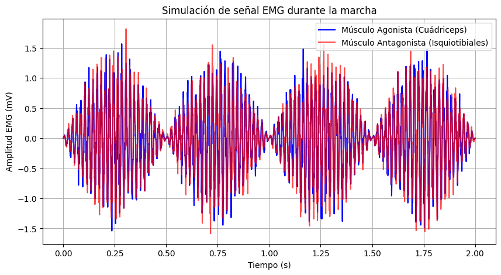{}
:::
:::


::: {#cell-19 .cell execution_count=3}
``` {.python .cell-code}
# Aplicar FFT a las señales
N = len(t)  # Número de puntos en la FFT
frequencies = np.fft.fftfreq(N, d=1 / fs)  # Vector de frecuencias
fft_agonista = np.fft.fft(emg_agonista)
fft_antagonista = np.fft.fft(emg_antagonista)

# Magnitud y fase de la FFT (solo tomamos la parte positiva)
pos_mask = frequencies >= 0
freqs_pos = frequencies[pos_mask]
mag_agonista = np.abs(fft_agonista[pos_mask])
phase_agonista = np.angle(fft_agonista[pos_mask])
mag_antagonista = np.abs(fft_antagonista[pos_mask])
phase_antagonista = np.angle(fft_antagonista[pos_mask])

# Graficar el espectro de magnitud
plt.figure(figsize=(12, 5))

plt.subplot(2, 1, 1)
plt.plot(freqs_pos, mag_agonista, label="EMG Agonista", color="b")
plt.plot(
    freqs_pos, mag_antagonista, label="EMG Antagonista", color="r", linestyle="dashed"
)
plt.xlabel("Frecuencia (Hz)")
plt.ylabel("Magnitud")
plt.title("Espectro de Magnitud de la Señal EMG")
plt.legend()
plt.grid()

# Graficar el espectro de fase
plt.subplot(2, 1, 2)
plt.plot(freqs_pos, phase_agonista, label="Fase EMG Agonista", color="b")
plt.plot(
    freqs_pos,
    phase_antagonista,
    label="Fase EMG Antagonista",
    color="r",
    linestyle="dashed",
)
plt.xlabel("Frecuencia (Hz)")
plt.ylabel("Fase (radianes)")
plt.title("Espectro de Fase de la Señal EMG")
plt.legend()
plt.grid()

plt.tight_layout()
plt.show()
```

::: {.cell-output .cell-output-display}
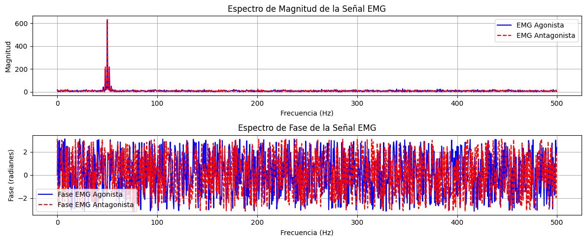{}
:::
:::


::: {#cell-20 .cell execution_count=9}
``` {.python .cell-code}
mag_agonista.max()
```

::: {.cell-output .cell-output-display execution_count=9}
```
np.float64(623.9382421708299)
```
:::
:::


::: {#cell-21 .cell execution_count=5}
``` {.python .cell-code}
from scipy.signal import butter, filtfilt, firwin, lfilter

# Frecuencia de corte
fc = 100  # Hz

# Diseño del filtro IIR Butterworth de orden 6
order_iir = 6
b_iir, a_iir = butter(order_iir, fc / (fs / 2), btype="low", analog=False)

# Diseño del filtro FIR con 81 coeficientes (taps)
num_taps = 81
fir_coeff = firwin(num_taps, fc / (fs / 2), window="hamming")

# Filtrado de la señal EMG
emg_agonista_iir = filtfilt(b_iir, a_iir, emg_agonista)
emg_antagonista_iir = filtfilt(b_iir, a_iir, emg_antagonista)

emg_agonista_fir = lfilter(fir_coeff, 1.0, emg_agonista)
emg_antagonista_fir = lfilter(fir_coeff, 1.0, emg_antagonista)

# Graficar las señales filtradas
plt.figure(figsize=(12, 6))

plt.subplot(2, 1, 1)
plt.plot(t, emg_agonista, label="Original Agonista", color="gray", alpha=0.5)
plt.plot(t, emg_agonista_iir, label="Filtrado IIR", color="b")
plt.plot(t, emg_agonista_fir, label="Filtrado FIR", color="r", linestyle="dashed")
plt.xlabel("Tiempo (s)")
plt.ylabel("Amplitud EMG")
plt.title("Filtrado de EMG Agonista - IIR vs FIR")
plt.legend()
plt.grid()

plt.subplot(2, 1, 2)
plt.plot(t, emg_antagonista, label="Original Antagonista", color="gray", alpha=0.5)
plt.plot(t, emg_antagonista_iir, label="Filtrado IIR", color="b")
plt.plot(t, emg_antagonista_fir, label="Filtrado FIR", color="r", linestyle="dashed")
plt.xlabel("Tiempo (s)")
plt.ylabel("Amplitud EMG")
plt.title("Filtrado de EMG Antagonista - IIR vs FIR")
plt.legend()
plt.grid()

plt.tight_layout()
plt.show()
```

::: {.cell-output .cell-output-display}
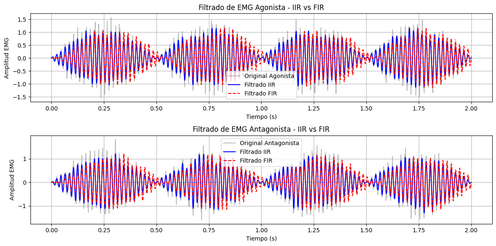{}
:::
:::


::: {#cell-22 .cell execution_count=8}
``` {.python .cell-code}
from scipy.signal import freqz

# Obtener la respuesta en frecuencia de ambos filtros
w_iir, h_iir = freqz(b_iir, a_iir, worN=1024, fs=fs)
w_fir, h_fir = freqz(fir_coeff, 1, worN=1024, fs=fs)

# Graficar la respuesta en magnitud con las especificaciones solicitadas
plt.figure(figsize=(10, 5))

# Filtro IIR
plt.plot(w_iir, 20 * np.log10(abs(h_iir)), label="Filtro IIR Butterworth (Orden 6)", 
         color='black', linewidth=3)

# Filtro FIR
plt.plot(w_fir, 20 * np.log10(abs(h_fir)), label="Filtro FIR (81 taps, Hamming)", 
         color='black', linestyle='dashed', linewidth=1)


# Configuración de etiquetas y título
plt.xlabel("Frecuencia (Hz)")
plt.ylabel("Magnitud (dB)")
plt.title("Comparación de la Respuesta en Magnitud de los Filtros IIR y FIR")
plt.legend()
plt.grid()

# Mostrar la gráfica
plt.show()
```

::: {.cell-output .cell-output-display}
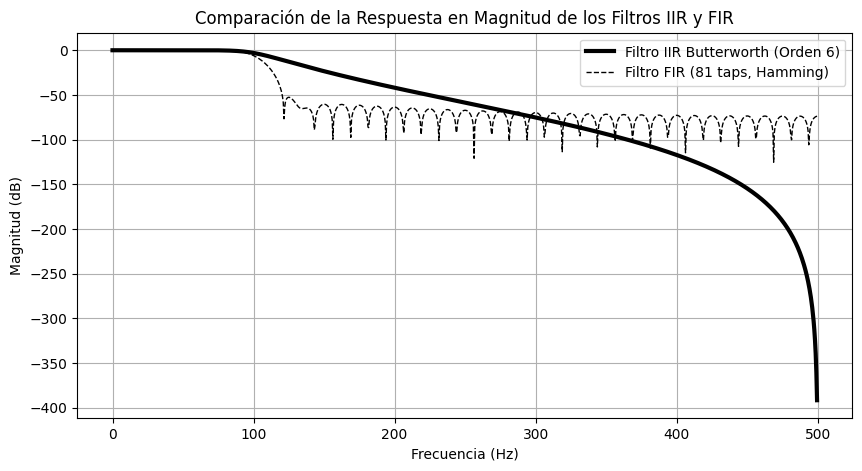{}
:::
:::


::: {#cell-23 .cell execution_count=2}
``` {.python .cell-code}
import numpy as np
import matplotlib.pyplot as plt
import matplotlib.animation as animation

# Define the input signal x[n] (example waveform)
x = np.array([0, 1, 2, 3, 2, 1, 0])
n_x = np.arange(len(x))

# Define the impulse response h[n] (example filter)
h = np.array([0.2, 0.5, 0.2])
n_h = np.arange(len(h))

# Compute the full convolution result
y = np.convolve(x, h, mode="full")
n_y = np.arange(len(y))

# Create the figure and axis
fig, ax = plt.subplots(figsize=(6, 4))

ax.set_xlim(-1, len(y))
ax.set_ylim(-0.5, max(y) + 1)
ax.set_xlabel("n (Time Index)")
ax.set_ylabel("Amplitude")
ax.set_title("Convolution Process Animation")
ax.grid(True)

# Initialize the plot elements
(line_x,) = ax.plot([], [], "bo-", label="Input Signal x[n]")
(line_h,) = ax.plot([], [], "go-", label="Impulse Response h[n]")
(line_y,) = ax.plot([], [], "mo-", label="Output Signal y[n]")

ax.legend()


# Animation function
def update(frame):
    if frame < len(x):
        line_x.set_data(n_x[: frame + 1], x[: frame + 1])
    if frame < len(h):
        line_h.set_data(n_h[: frame + 1], h[: frame + 1])
    if frame < len(y):
        line_y.set_data(n_y[: frame + 1], y[: frame + 1])
    return line_x, line_h, line_y


# Create animation
ani = animation.FuncAnimation(fig, update, frames=len(y), interval=500, blit=True)

# Save animation as GIF
gif_path = "./convolution_animation.gif"
ani.save(gif_path, writer="pillow", fps=2)

# Return the file path
gif_path
```

::: {.cell-output .cell-output-display execution_count=2}
```
'./convolution_animation.gif'
```
:::

::: {.cell-output .cell-output-display}
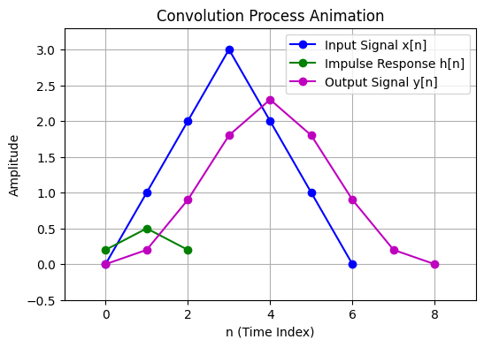{}
:::
:::


::: {#cell-24 .cell execution_count=6}
``` {.python .cell-code}
import numpy as np
import matplotlib.pyplot as plt

# Define signal parameters
fs = 10  # Sampling frequency in Hz
T = 1  # Signal duration in seconds
n = np.arange(0, T, 1 / fs)  # Discrete time vector
x = np.random.randint(n)  # Discrete signal of ones

# Plot the discrete signal
plt.figure(figsize=(8, 4))
plt.stem(n, x, linefmt="b-", markerfmt="bo", basefmt="r-", label="Discrete Signal")
plt.xlabel("Time (s)")
plt.ylabel("Amplitude")
plt.title("Discrete Signal (1s duration, 10 Hz Sampling Frequency)")
plt.grid(True)
plt.legend()
plt.show()
```

::: {.cell-output .cell-output-error}

::: {.ansi-escaped-output}

```{=html}
<pre><span class="ansi-red-fg">---------------------------------------------------------------------------</span>
<span class="ansi-red-fg">ValueError</span>                                Traceback (most recent call last)
Cell <span class="ansi-green-fg">In[6], line 8</span>
<span class="ansi-green-fg ansi-bold">      6</span> T <span style="color:rgb(98,98,98)">=</span> <span style="color:rgb(98,98,98)">1</span>  <span style="font-style:italic;color:rgb(95,135,135)"># Signal duration in seconds</span>
<span class="ansi-green-fg ansi-bold">      7</span> n <span style="color:rgb(98,98,98)">=</span> np<span style="color:rgb(98,98,98)">.</span>arange(<span style="color:rgb(98,98,98)">0</span>, T, <span style="color:rgb(98,98,98)">1</span> <span style="color:rgb(98,98,98)">/</span> fs)  <span style="font-style:italic;color:rgb(95,135,135)"># Discrete time vector</span>
<span class="ansi-green-fg">----&gt; 8</span> x <span style="color:rgb(98,98,98)">=</span> <span class="ansi-yellow-bg">np</span><span style="color:rgb(98,98,98)" class="ansi-yellow-bg">.</span><span class="ansi-yellow-bg">random</span><span style="color:rgb(98,98,98)" class="ansi-yellow-bg">.</span><span class="ansi-yellow-bg">randint</span><span class="ansi-yellow-bg">(</span><span class="ansi-yellow-bg">n</span><span class="ansi-yellow-bg">)</span>  <span style="font-style:italic;color:rgb(95,135,135)"># Discrete signal of ones</span>
<span class="ansi-green-fg ansi-bold">     10</span> <span style="font-style:italic;color:rgb(95,135,135)"># Plot the discrete signal</span>
<span class="ansi-green-fg ansi-bold">     11</span> plt<span style="color:rgb(98,98,98)">.</span>figure(figsize<span style="color:rgb(98,98,98)">=</span>(<span style="color:rgb(98,98,98)">8</span>, <span style="color:rgb(98,98,98)">4</span>))

File <span class="ansi-green-fg">numpy/random/mtrand.pyx:798</span>, in <span class="ansi-cyan-fg">numpy.random.mtrand.RandomState.randint</span><span class="ansi-blue-fg">()</span>

File <span class="ansi-green-fg">numpy/random/_bounded_integers.pyx:1349</span>, in <span class="ansi-cyan-fg">numpy.random._bounded_integers._rand_int64</span><span class="ansi-blue-fg">()</span>

File <span class="ansi-green-fg">numpy/random/_bounded_integers.pyx:776</span>, in <span class="ansi-cyan-fg">numpy.random._bounded_integers._rand_int64_broadcast</span><span class="ansi-blue-fg">()</span>

<span class="ansi-red-fg">ValueError</span>: high &lt;= 0</pre>
```

:::

:::
:::


::: {#cell-25 .cell}
``` {.python .cell-code}
import pandas as pd
import numpy as np
import matplotlib.pyplot as plt
import seaborn as sns

# Define the data path
data_path = "../data/"  # Change this to the correct path if needed
data = pd.read_csv(data_path + "diabetes.csv")

# Identify variable types
discrete_vars = ["Pregnancies"]  # Discrete numerical variable
categorical_vars = ["Outcome"]  # Class label
continuous_vars = [
    col
    for col in data.select_dtypes(include=[np.number]).columns
    if col not in discrete_vars + ["Outcome"]
]

# Basic dataset information
print("Dataset Information:\n", data.info())
print("\nSummary Statistics:\n", data.describe())
print("\nMissing Values:\n", data.isnull().sum())

# Ensure numeric data and handle NaN or infinite values
numeric_data = data.select_dtypes(include=[np.number]).dropna()
numeric_data = numeric_data.replace([np.inf, -np.inf], np.nan).dropna()

# Dynamically determine the number of rows for subplots
num_cont_vars = len(continuous_vars)
rows = (num_cont_vars // 3) + (num_cont_vars % 3 > 0)  # Ensures proper grid layout

# Plot distributions for continuous variables
plt.figure(figsize=(12, 4 * rows))
for i, column in enumerate(continuous_vars, 1):
    plt.subplot(rows, 3, i)
    sns.histplot(numeric_data[column], kde=True, bins=20, color="skyblue")
    plt.title(f"Distribution of {column}")
plt.tight_layout()
plt.show()

# Plot distribution for discrete variable (Pregnancies) using a countplot
plt.figure(figsize=(8, 4))
sns.countplot(x="Pregnancies", data=numeric_data, palette="viridis")
plt.title("Count of Pregnancies")
plt.show()

# Plot class distribution for Outcome
plt.figure(figsize=(6, 4))
sns.countplot(x="Outcome", data=data, palette="coolwarm")
plt.title("Class Distribution of Outcome")
plt.xlabel("Diabetes Diagnosis (0: No, 1: Yes)")
plt.ylabel("Count")
plt.show()

# Correlation heatmap to check relationships
plt.figure(figsize=(10, 6))
sns.heatmap(numeric_data.corr(), annot=True, cmap="coolwarm", fmt=".2f", linewidths=0.5)
plt.title("Feature Correlation Heatmap")
plt.show()
```

::: {.cell-output .cell-output-stdout}
```
<class 'pandas.core.frame.DataFrame'>
RangeIndex: 768 entries, 0 to 767
Data columns (total 9 columns):
 #   Column                    Non-Null Count  Dtype  
---  ------                    --------------  -----  
 0   Pregnancies               768 non-null    int64  
 1   Glucose                   768 non-null    int64  
 2   BloodPressure             768 non-null    int64  
 3   SkinThickness             768 non-null    int64  
 4   Insulin                   768 non-null    int64  
 5   BMI                       768 non-null    float64
 6   DiabetesPedigreeFunction  768 non-null    float64
 7   Age                       768 non-null    int64  
 8   Outcome                   768 non-null    int64  
dtypes: float64(2), int64(7)
memory usage: 54.1 KB
Dataset Information:
 None

Summary Statistics:
        Pregnancies     Glucose  BloodPressure  SkinThickness     Insulin  \
count   768.000000  768.000000     768.000000     768.000000  768.000000   
mean      3.845052  120.894531      69.105469      20.536458   79.799479   
std       3.369578   31.972618      19.355807      15.952218  115.244002   
min       0.000000    0.000000       0.000000       0.000000    0.000000   
25%       1.000000   99.000000      62.000000       0.000000    0.000000   
50%       3.000000  117.000000      72.000000      23.000000   30.500000   
75%       6.000000  140.250000      80.000000      32.000000  127.250000   
max      17.000000  199.000000     122.000000      99.000000  846.000000   

              BMI  DiabetesPedigreeFunction         Age     Outcome  
count  768.000000                768.000000  768.000000  768.000000  
mean    31.992578                  0.471876   33.240885    0.348958  
std      7.884160                  0.331329   11.760232    0.476951  
min      0.000000                  0.078000   21.000000    0.000000  
25%     27.300000                  0.243750   24.000000    0.000000  
50%     32.000000                  0.372500   29.000000    0.000000  
75%     36.600000                  0.626250   41.000000    1.000000  
max     67.100000                  2.420000   81.000000    1.000000  

Missing Values:
 Pregnancies                 0
Glucose                     0
BloodPressure               0
SkinThickness               0
Insulin                     0
BMI                         0
DiabetesPedigreeFunction    0
Age                         0
Outcome                     0
dtype: int64
```
:::

::: {.cell-output .cell-output-display}
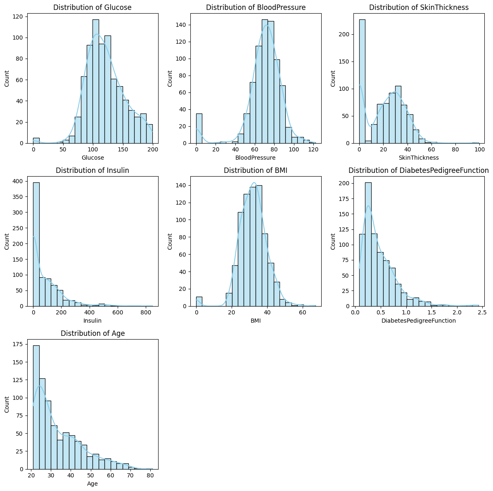{}
:::

::: {.cell-output .cell-output-stderr}
```
/tmp/ipykernel_94704/900495043.py:43: FutureWarning: 

Passing `palette` without assigning `hue` is deprecated and will be removed in v0.14.0. Assign the `x` variable to `hue` and set `legend=False` for the same effect.

  sns.countplot(x="Pregnancies", data=numeric_data, palette="viridis")
```
:::

::: {.cell-output .cell-output-display}
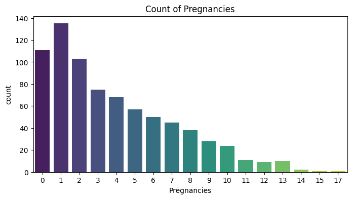{}
:::

::: {.cell-output .cell-output-stderr}
```
/tmp/ipykernel_94704/900495043.py:49: FutureWarning: 

Passing `palette` without assigning `hue` is deprecated and will be removed in v0.14.0. Assign the `x` variable to `hue` and set `legend=False` for the same effect.

  sns.countplot(x="Outcome", data=data, palette="coolwarm")
```
:::

::: {.cell-output .cell-output-display}
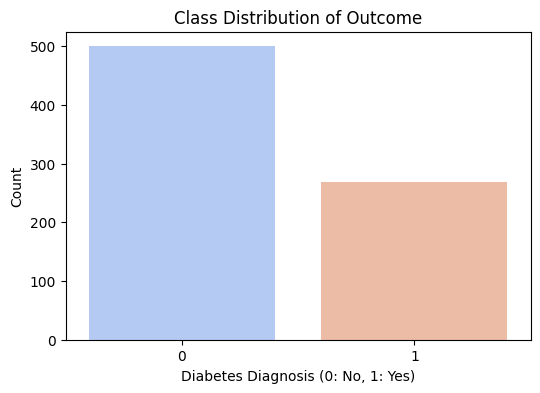{}
:::

::: {.cell-output .cell-output-display}
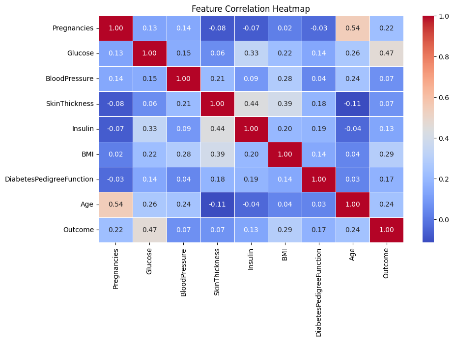{}
:::
:::


::: {#cell-26 .cell execution_count=6}
``` {.python .cell-code}
import numpy as np
import matplotlib.pyplot as plt

# Define two orthogonal vectors
v1 = np.array([1, 0])  # X-axis unit vector
v2 = np.array([0, 1])  # Y-axis unit vector

# Define a third vector
v3 = np.array([2, 3])  # Arbitrary vector

# Compute projections of v3 onto v1 and v2
proj_v1 = (np.dot(v3, v1) / np.dot(v1, v1)) * v1
proj_v2 = (np.dot(v3, v2) / np.dot(v2, v2)) * v2

# Create a figure
fig, ax = plt.subplots(figsize=(6, 6))

# Plot the orthogonal vectors
ax.quiver(
    0, 0, *v1, color="r", angles="xy", scale_units="xy", scale=1, label="v1 (X-axis)"
)
ax.quiver(
    0, 0, *v2, color="g", angles="xy", scale_units="xy", scale=1, label="v2 (Y-axis)"
)

# Plot the third vector
ax.quiver(0, 0, *v3, color="b", angles="xy", scale_units="xy", scale=1, label="v3")

# Plot projections using quiver
ax.quiver(
    0,
    0,
    *proj_v1,
    color="purple",
    angles="xy",
    scale_units="xy",
    scale=1,
    label="Projection on v1"
)
ax.quiver(
    0,
    0,
    *proj_v2,
    color="orange",
    angles="xy",
    scale_units="xy",
    scale=1,
    label="Projection on v2"
)

# Plot dashed lines to show projection points
ax.plot([proj_v1[0], v3[0]], [proj_v1[1], v3[1]], "k--", alpha=0.5)  # Projection to v1
ax.plot([proj_v2[0], v3[0]], [proj_v2[1], v3[1]], "k--", alpha=0.5)  # Projection to v2

# Set grid and limits
ax.set_xlim(-1, 4)
ax.set_ylim(-1, 4)
ax.set_xlabel("X-axis")
ax.set_ylabel("Y-axis")
ax.set_title("Two Orthogonal Vectors & Projection of a Third Vector")
ax.axhline(0, color="black", linewidth=1)
ax.axvline(0, color="black", linewidth=1)
ax.grid()
ax.legend()

# Show the plot
plt.show()
```

::: {.cell-output .cell-output-display}
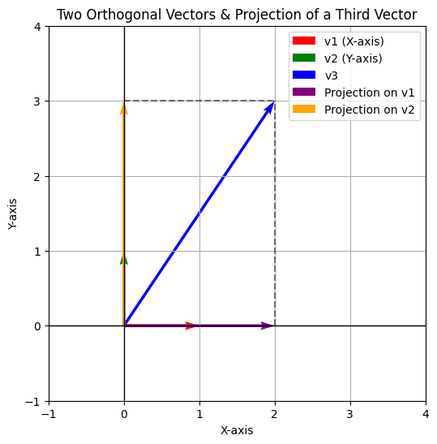{}
:::
:::


::: {#cell-27 .cell}
``` {.python .cell-code}
import matplotlib.pyplot as plt

# Datos del gráfico
t = [0, 5, 10, 15, 15, 20, 25, 30]
a = [8, 8, 5, 5, 8, 8, 5, 5]

# Crear la figura y el eje
plt.figure(figsize=(8, 5))
plt.plot(t, a, marker="o", linestyle="-", color="black")

# Etiquetas de los ejes
plt.xlabel("t", fontsize=18)
plt.ylabel("A", fontsize=18)

# Configurar tamaño de fuente para los ticks
printf = 18
plt.xticks(fontsize=printf)
plt.yticks(fontsize=printf)

# Agregar rejilla para mejor visualización
plt.grid(True, linestyle="--", alpha=0.6)

# Mostrar el gráfico
plt.show()
```

::: {.cell-output .cell-output-display}
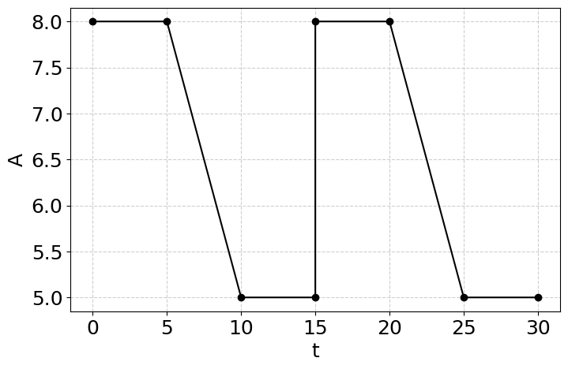{}
:::
:::


::: {#cell-28 .cell execution_count=13}
``` {.python .cell-code}
import numpy as np


# Definir la función periódica por partes con periodo 15
def A(t):
    t = t % 15  # Hacer la función periódica con periodo 15
    if 0 <= t < 5:
        return 8
    elif 5 <= t < 10:
        m = -3 / 5
        return m * t + 11
    elif 10 <= t <= 15:
        return 5
    else:
        return None  # Fuera del dominio especificado


# Crear valores de t
t_values = np.linspace(-30, 30, 200)  # Extender para ver la periodicidad
a_values = [A(t) for t in t_values]

# Crear la figura y el eje
plt.figure(figsize=(8, 5))
plt.plot(t_values, a_values, linestyle="-", color="black")

# Etiquetas de los ejes
plt.xlabel("t", fontsize=18)
plt.ylabel("A", fontsize=18)

# Configurar tamaño de fuente para los ticks
printf = 18
plt.xticks(fontsize=printf)
plt.yticks(fontsize=printf)

# Agregar rejilla para mejor visualización
plt.grid(True, linestyle="--", alpha=0.6)

# Mostrar el gráfico
plt.show()
```

::: {.cell-output .cell-output-display}
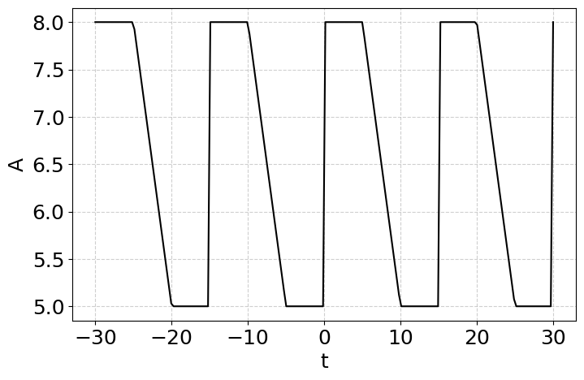{}
:::
:::


::: {#cell-29 .cell}
``` {.python .cell-code}
import sympy as sp

t = sp.symbols('t')
n = sp.symbols('n', integer=True, positive=True)
A_sym = sp.Piecewise(
    (8, (t >= 0) & (t < 5)),  # A(t) = 8 en [0,5)
    (-3 / 5 * t + 11, (t >= 5) & (t < 10)),  # A(t) = -3/5 * t + 11 en [5,10)
    (5, (t >= 10) & (t <= 15)),  # A(t) = 5 en [10,15]
)
sp.pprint(A_sym)
# Calcular a0
integral_A = (2/15)*sp.integrate(A_sym, (t, 0, 15))

# Calcular an 
integral_B = (2/15)*sp.integrate(A_sym*sp.cos(2*sp.pi*n*t/15), (t, 0, 15))
```

::: {.cell-output .cell-output-stdout}
```
⎧    8        for t ≥ 0 ∧ t < 5 
⎪                               
⎨11 - 0.6⋅t  for t ≥ 5 ∧ t < 10 
⎪                               
⎩    5       for t ≥ 10 ∧ t ≤ 15
```
:::
:::


::: {#cell-30 .cell execution_count=26}
``` {.python .cell-code}
integral_B
```

::: {.cell-output .cell-output-display .cell-output-markdown execution_count=26}
$\displaystyle \frac{4.5 \cos{\left(\frac{2 \pi n}{3} \right)}}{\pi^{2} n^{2}} - \frac{4.5 \cos{\left(\frac{4 \pi n}{3} \right)}}{\pi^{2} n^{2}}$
:::
:::


::: {#cell-31 .cell execution_count=30}
``` {.python .cell-code}
integral_B.subs(n,2)
```

::: {.cell-output .cell-output-display .cell-output-markdown execution_count=30}
$\displaystyle 0$
:::
:::


