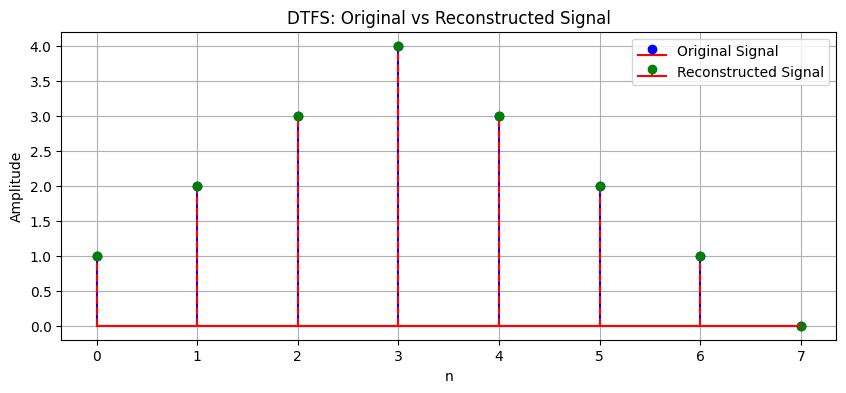
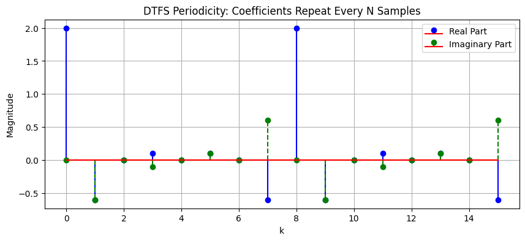

::: {#cell-0 .cell execution_count=6}
``` {.python .cell-code}
import numpy as np
import matplotlib.pyplot as plt

# Define a periodic discrete signal
N = 8  # Period of the signal
n = np.arange(N)
x_n = np.array([1, 2, 3, 4, 3, 2, 1, 0])  # Example discrete signal

# Compute DTFS coefficients
C_k = np.fft.fft(x_n) / N  # Normalized Discrete Fourier Transform

# Reconstruct the signal using DTFS
x_reconstructed = np.zeros(N, dtype=complex)
for k in range(N):
    x_reconstructed += C_k[k] * np.exp(1j * 2 * np.pi * k * n / N)

# Plot original and reconstructed signals
plt.figure(figsize=(10, 4))
plt.stem(n, x_n, linefmt='b-', markerfmt='bo', basefmt='r-', label='Original Signal')
plt.stem(n, np.real(x_reconstructed), linefmt='r--', markerfmt='go', basefmt='r-', label='Reconstructed Signal')
plt.xlabel("n")
plt.ylabel("Amplitude")
plt.title("DTFS: Original vs Reconstructed Signal")
plt.legend()
plt.grid()
plt.show()

# Print DTFS Coefficients
print("DTFS Coefficients:")
for k in range(N):
    print(f"C[{k}] = {C_k[k]:.4f}")
```

::: {.cell-output .cell-output-display}
{}
:::

::: {.cell-output .cell-output-stdout}
```
DTFS Coefficients:
C[0] = 2.0000+0.0000j
C[1] = -0.6036-0.6036j
C[2] = 0.0000+0.0000j
C[3] = 0.1036-0.1036j
C[4] = 0.0000+0.0000j
C[5] = 0.1036+0.1036j
C[6] = 0.0000+0.0000j
C[7] = -0.6036+0.6036j
```
:::
:::


::: {#cell-1 .cell}
``` {.python .cell-code}
import numpy as np
import matplotlib.pyplot as plt

# Define a periodic discrete signal
N = 8  # Period of the signal
n = np.arange(N)
x_n = np.array([1, 2, 3, 4, 3, 2, 1, 0])  # Example discrete signal

# Compute DTFS coefficients
C_k = np.fft.fft(x_n) / N  # Normalized Discrete Fourier Transform

# Verify periodicity property: C[k] repeats every N
C_k_extended = np.tile(C_k, 2)  # Extend coefficients to see repetition
k_extended = np.arange(2 * N)

# Plot DTFS coefficients and their periodic repetition
plt.figure(figsize=(10, 4))
plt.stem(
    k_extended,
    np.real(C_k_extended),
    linefmt="b-",
    markerfmt="bo",
    basefmt="r-",
    label="Real Part",
)
plt.stem(
    k_extended,
    np.imag(C_k_extended),
    linefmt="g--",
    markerfmt="go",
    basefmt="r-",
    label="Imaginary Part",
)
plt.xlabel("n")
plt.ylabel("Magnitude")
plt.title("DTFS Periodicity: Coefficients Repeat Every N Samples")
plt.legend()
plt.grid()
plt.show()

# Print DTFS Coefficients to observe periodicity
print("DTFS Coefficients (showing periodicity):")
for k in range(2 * N):
    print(f"C[{k}] = {C_k_extended[k]:.4f}")
```

::: {.cell-output .cell-output-display}
{}
:::

::: {.cell-output .cell-output-stdout}
```
DTFS Coefficients (showing periodicity):
C[0] = 2.0000+0.0000j
C[1] = -0.6036-0.6036j
C[2] = 0.0000+0.0000j
C[3] = 0.1036-0.1036j
C[4] = 0.0000+0.0000j
C[5] = 0.1036+0.1036j
C[6] = 0.0000+0.0000j
C[7] = -0.6036+0.6036j
C[8] = 2.0000+0.0000j
C[9] = -0.6036-0.6036j
C[10] = 0.0000+0.0000j
C[11] = 0.1036-0.1036j
C[12] = 0.0000+0.0000j
C[13] = 0.1036+0.1036j
C[14] = 0.0000+0.0000j
C[15] = -0.6036+0.6036j
```
:::
:::


