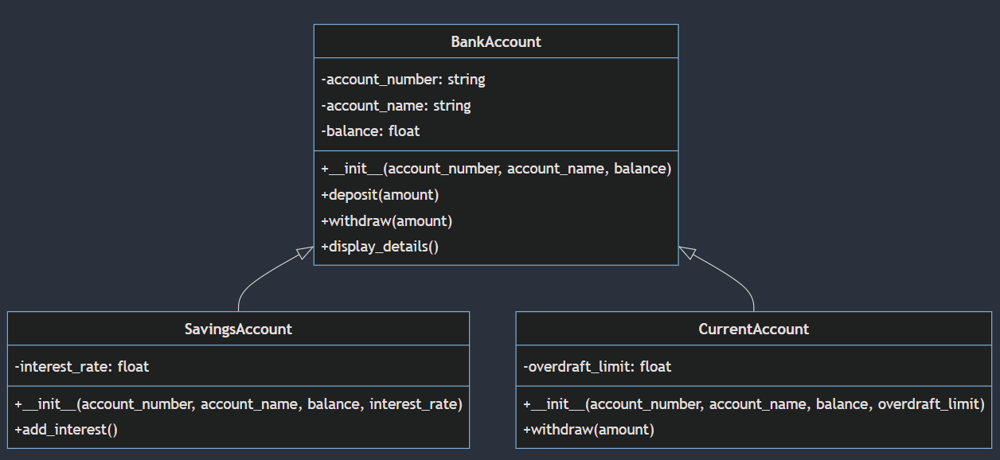

## Classes and Objects

* A class is a blueprint or template that defines the characteristics and behavior of an object.

* An object is an instance of a class, and it has its own set of attributes (data) and methods (functions).

## Encapsulation

* Encapsulation is the concept of bundling data and methods that operate on that data within a single unit (class).

* It helps to hide the implementation details and expose only the necessary information to the outside world.

## Inheritance

* Inheritance is the mechanism by which one class can inherit the attributes and methods of another class.

* It promotes code reuse and facilitates the creation of a hierarchy of classes.

## Polymorphism

* Polymorphism is the ability of an object to take on multiple forms.

* It can be achieved through method overriding (where a subclass provides a different implementation of a method) or method overloading (where multiple methods with the same name can be defined with different parameters).

## Abstraction

* Abstraction is the concept of showing only the necessary information to the outside world while hiding the implementation details.

* It helps to reduce complexity and improve code readability.

::: {#cell-7 .cell execution_count=1}
``` {.python .cell-code}
class BankAccount:
    def __init__(self, account_number, account_name, balance):
        self.account_number = account_number
        self.account_name = account_name
        self.balance = balance

    def deposit(self, amount):
        self.balance += amount

    def withdraw(self, amount):
        if amount > self.balance:
            print("Insufficient funds")
        else:
            self.balance -= amount

    def display_details(self):
        print(f"Account Number: {self.account_number}")
        print(f"Account Name: {self.account_name}")
        print(f"Balance: {self.balance}")
```
:::


* The BankAccount class encapsulates the account_number, account_name, and balance attributes, as well as the deposit, withdraw, and display_details methods.

* The **\_\_init\_\_** method is a special method that is called when an object is created, and it initializes the attributes.

* The deposit and withdraw methods modify the balance attribute, demonstrating encapsulation.

* The display_details method provides a way to access the attributes without exposing them directly, demonstrating abstraction.

::: {#cell-9 .cell execution_count=2}
``` {.python .cell-code}
class SavingsAccount(BankAccount):
    def __init__(self, account_number, account_name, balance, interest_rate):
        super().__init__(account_number, account_name, balance)
        self.interest_rate = interest_rate

    def add_interest(self):
        interest = self.balance * self.interest_rate
        self.deposit(interest)
```
:::


* The SavingsAccount class inherits the attributes and methods of BankAccount using the super() function.

* It adds an additional attribute interest_rate and a method add_interest that calculates and deposits interest.

::: {#cell-11 .cell execution_count=3}
``` {.python .cell-code}
class CurrentAccount(BankAccount):
    def __init__(self, account_number, account_name, balance, overdraft_limit):
        super().__init__(account_number, account_name, balance)
        self.overdraft_limit = overdraft_limit

    def withdraw(self, amount):
        if amount > self.balance + self.overdraft_limit:
            print("Transaction declined")
        else:
            super().withdraw(amount)
```
:::





### "Designing a Comprehensive Hospital Management System in Python"

#### Introduction

In this task, we aim to develop a straightforward hospital management system that efficiently manages patients, doctors, and appointments. Leveraging Python's object-oriented programming capabilities, we will create a robust framework to streamline hospital operations.

#### System Components

The hospital management system comprises four primary classes: Person, Patient, Doctor, Appointment, and Hospital.

#### Person Class

The Person class serves as the foundation for both Patient and Doctor classes, encapsulating essential attributes:

* name

* age

* gender

#### Patient Class

Inheriting from Person, the Patient class introduces additional attributes:

* patient_id

* illness

#### Doctor Class

Similarly, the Doctor class inherits from Person and includes:

* doctor_id

* specialization

####  Appointment Class

The Appointment class encompasses:

* appointment_id
* patient (a Patient object)
* doctor (a Doctor object)
* date
* time

#### Hospital Class

The Hospital class is the central hub, managing:

* patients (a list of Patient objects)

* doctors (a list of Doctor objects)

* appointments (a list of Appointment objects)

* Hospital Class Methods: The Hospital class features the following methods:

    - add_patient(name, age, gender, patient_id, illness): Adds a new patient to the hospital.
    - add_doctor(name, age, gender, doctor_id, specialization): Adds a new doctor to the hospital.
    - schedule_appointment(appointment_id, patient_id, doctor_id, date, time): Schedules a new appointment.
    - list_appointments(): Lists all appointments.

#### Implementation

By utilizing these classes and methods, the hospital management system provides a structured approach to managing patients, doctors, and appointments, ensuring efficient and organized hospital operations.

