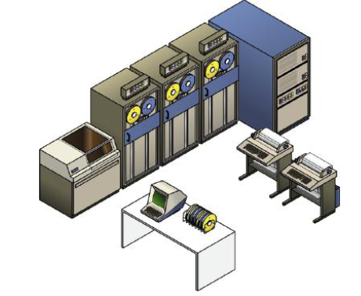
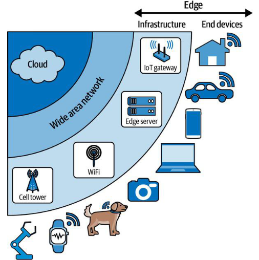
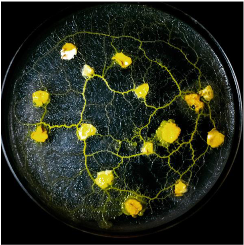

::: {.cell}

:::

::: {.cell}

:::

# Adquisición y Procesamiento de Señales Biomédicas en Tecnologías de Borde - APSB

## A Brief Introduction to Edge AI

::: {.callout-note title="Key Term"}
The term edge AI is a union of two buzzwords, fused together into one mighty term. It’s often heard alongside its siblings, embedded machine learning and TinyML.
:::

::: {.callout-note title="Embedded"}
- Embedded systems are the computers that control the electronics of all sorts of physical devices.

- In contrast to general-purpose computers, embedded systems are usually meant to perform one specific, dedicated task.

- It’s common for embedded systems to reflect the constraints of the environments into which they are deployed. For example, many embedded systems are required to run on battery power, so they’re designed with energy efficiency in mind—perhaps with limited memory or an extremely slow clock rate.

- Programming embedded systems is the art of navigating these constraints, writing software that performs the task required while making the most out of limited resources.
:::

## A Brief Introduction to Edge AI

::: {.callout-note title="The Edge"}
- The history of computer networks has been a gigantic tug of war.
- In the first systems—individual computers the size of a room—computation was inherently centralized.
- Computers were connected to terminals that took over some of their responsibilities. Example the terminal renders the letters in an monitor.
:::
{fig-align="center"}

## A Brief Introduction to Edge AI

::: {.callout-note title="The Edge"}
- Over time, terminals became more and more sophisticated, taking over more and more functions that were previously the job of the central computer. The personal computer was invented.

- Small computers could do useful work without even being connected to another machine.

- The growth of the internet, along with web applications and services, made it possible to do some really cool stuff

- Over the past decade, most of our computing has become centralized again—this time in the “cloud.”
:::

## A Brief Introduction to Edge AI

{fig-align="center"}

## A Brief Introduction to Edge AI

::: {.callout-note title="The Edge"}
- The Internet of Things (IoT) includes everything you can think of: industrial sensors, smart refrigerators, internet-connected security cameras, personal automobiles, shipping containers, fitness trackers, and coffee machines.
- All of these devices are embedded systems.
- Since they’re at the edge of the network, we can also call them edge devices.
- The edge isn’t a single place; it’s more like a broad region.
- The edge is where all the data comes from!
- Edge devices are our link between the internet and the physical world
:::

## A Brief Introduction to Edge AI

:::: {.columns}

::: {.column width="45%"}

::: {.callout-note title="AI"}
- Since the dawn of time, humans have dreamed of creating intelligent entities that can help us in our struggle to survive.
- In the modern world we dream of robot sidekicks who assist us.
- To define AI, we have to define intelligence
:::

:::

::: {.column width="45%"}

{fig-align="center"}

:::
::::

## A Brief Introduction to Edge AI

{fig-align="center"}