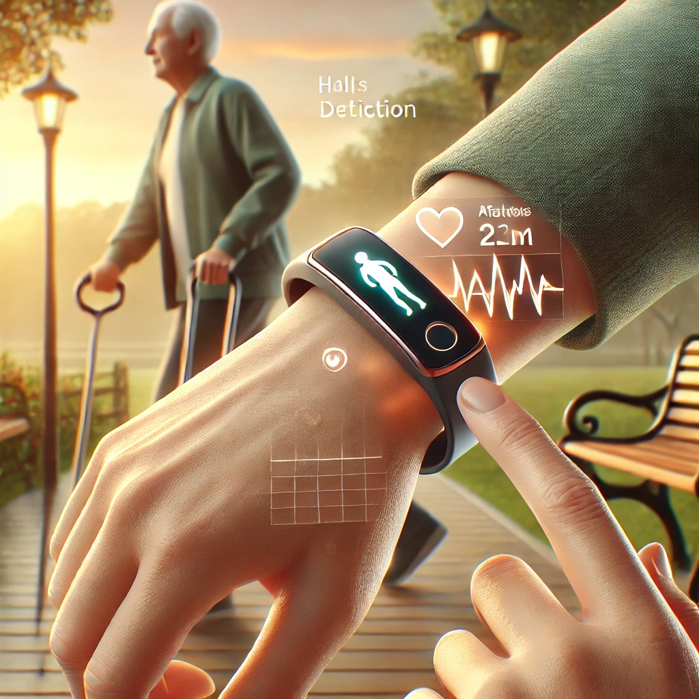
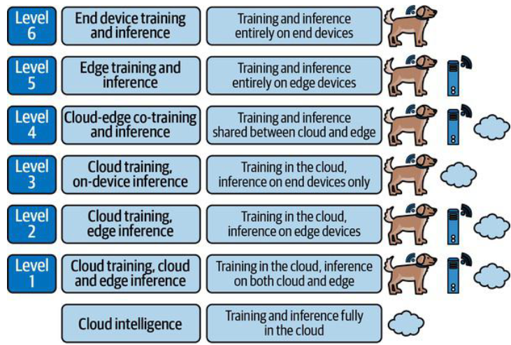

::: {.cell}

:::

::: {.cell}

:::


# Adquisición y Procesamiento de Señales Biomédicas en Tecnologías de Borde - APSB

## Edge AI

::: {.callout-note title="Definition"}
Edge AI Is the combination of EDGE devices and Artificial Intelligence Algorithms
:::

::: {.callout-note title="Example"}
The accelerometer-based wristband sensor.

:::: {.columns}

::: {.column width="45%"}


:::

::: {.column width="45%"}




:::
::::
:::

## EDGE AI



## EDGE AI

::: {.callout-note title="Embedded ML"}

- Embedded ML is the art and science of running machine learning models on embedded systems.
- Embedded ML, we’re usually refers to machine learning inference.
- The training part usually still takes place on a conventional computer.
- High requirements of ROM(Model Storing), RAM(Storing intermediate results), computer capabilities(computational intensive tasks).
- Embedded machine learning is often deployed alongside digital signal processing algorithms
- Tiny machine learning, or TinyML, is the concept of doing this on the most constrained embedded hardware available.

:::

## EDGE AI


::: {.cell}
::: {.cell-output-display}


```{=html}
<div class="DiagrammeR html-widget html-fill-item" id="htmlwidget-6afb191a71f302732d58" style="width:960px;height:480px;"></div>
<script type="application/json" data-for="htmlwidget-6afb191a71f302732d58">{"x":{"diagram":"\ngraph LR\n    A[Artificial Intelligence]\n    B[Edge Computing]\n    C[Machine Learning]\n    D[Edge AI]\n    E[Embedded ML]\n    F[Tiny ML]\n    A --> D\n    A --> C\n    B --> D\n    C --> E\n    D --> E\n    E --> F\n"},"evals":[],"jsHooks":[]}</script>
```


:::
:::


## BLERP

:::: {.columns}

::: {.column width="45%"}

::: {.callout-note title="Bandwith"}
It's related to the quantity of information you could send via some kind of connection. More bandwith it's needed to send more data. Example: *Imagine a smart sensor that monitors the vibration of an magnetic resonator to determine if it is operating correctly. It might use a simple thresholding algorithm to understand when the machine is vibrating too much, or not enough, and then communicate this information via a low bandwidth radio connection.*
:::

::: {.callout-note title="Latency"}
It's related to the time you must wait for the reponse of the sensor. Example: *Edge AI solves this problem by removing the round-trip time altogether. A great example of this is a self-driving car. The car’s AI systems run on onboard computers. This allows it to react nearly instantly to changing conditions, like the driver in front slamming on their brakes.*
:::

:::

::: {.column width="45%"}

::: {.callout-note title="Economy"}
Connectivity costs a lot of money. By processing data on-device, edge AI systems reduce or avoid the costs of transmitting data over a network and processing it in the cloud. Example: *Edge AI enables healthcare providers to monitor patients in real time without sending data to the cloud for processing. For example, wearable devices with built-in AI algorithms can analyze physiological signals such as heart rate, oxygen levels, and ECG data locally. This reduces the reliance on cloud services for data transmission and processing.*
:::

::: {.callout-note title="Reliability"}
Systems controlled by on-device AI are potentially more reliable than those that depend on a connection to the cloud. When you add wireless connectivity to a device, you’re adding a vast, overwhelmingly complex web of dependencies, from link-layer communications technologies to the internet servers that may run your application. Example: *Traditional Cloud-Based Systems: Data collected by wearable devices must be transmitted to a cloud server, analyzed, and then results are sent back to caregivers or emergency responders. This can introduce delays due to network latency or connectivity issues. Edge AI Systems: Processes the sensor data locally in real time, enabling instant detection of falls or other anomalies.Improvement: Reduces detection and response time from minutes to milliseconds, ensuring immediate action during emergencies.*
:::

:::
::::

::: {.callout-note title="Privacy"}
Edge AI provides an alternative. Rather than streaming live video and audio to a remote server, a security camera could use some onboard intelligence to identify that an intruder is present when the owners are out at work. It could then alert the owners in an appropriate way. When data is processed on an embedded system and is never transmitted to the cloud, user privacy is protected and there is less chance of abuse.
:::