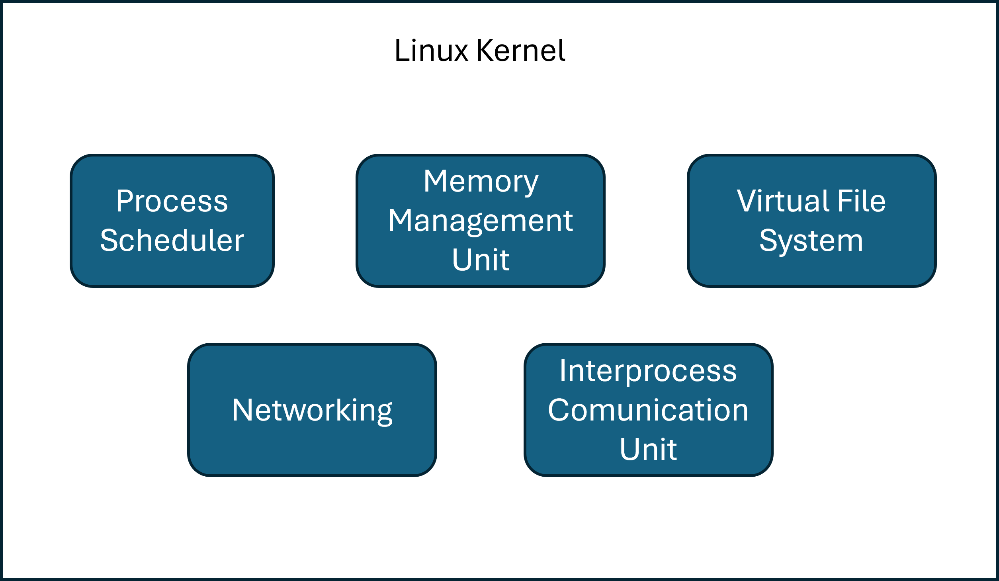

::: {.cell}

:::

::: {.cell}

:::

# Adquisición y Procesamiento de Señales Biomédicas en Tecnologías de Borde - APSB

## What is Linux

- **Definition**: Linux is a free, open-source operating system (OS) based on Unix, created by Linus Torvalds in 1991.
- **Key Features**:
  - Open-source: Anyone can view, modify, and distribute the source code.
  - Free to use: No licensing fees.
  - Multi-user and multitasking.
- **Structure**: Comprises a **kernel** (core of the OS) and various utilities.

## The linux structure

:::: {.columns}

::: {.column width="45%"}

:::

::: {.column width="45%"}

::: {.callout-note title="Kernel"}
- Controls the hardware.
- Types of linux kernel
  - *Monolithic kernel:* All the concurrent processes are executed simultaneously in the kernel itself. All the processes share same memory recourses.
  - *Micro kernel:* user services and kernel services are executed in separate address spaces. User services are kept in user address space and kernel services are kept in kernel address space.
  - *Hybrid kernel:* this kernel has the monolithic speed and the stability of the micro.
:::

:::
::::
[Adapted from Geeksforgeeks](https://www.geeksforgeeks.org/architecture-of-linux-operating-system/)

## The linux structure

:::: {.columns}

::: {.column width="45%"}

:::

::: {.column width="45%"}

::: {.callout-note title="Kernel"}

:::

:::
::::
[Adapted from Geeksforgeeks](https://www.geeksforgeeks.org/architecture-of-linux-operating-system/)

## The linux structure

:::: {.columns}

::: {.column width="45%"}

:::

::: {.column width="45%"}

::: {.callout-note title="Shell"}

The shell serves as an interface to the kernel, acting as a bridge between the user and the system's core operations. It hides the internal workings of the kernel, allowing users to perform tasks without needing to understand the underlying processes. Users simply enter a command, and the shell leverages the kernel's functions to execute the specified task.

:::

:::
::::
[Adapted from Geeksforgeeks](https://www.geeksforgeeks.org/architecture-of-linux-operating-system/)

## Why is Linux Popular?

- **Flexibility**: Runs on a wide range of devices (PCs, servers, smartphones, embedded systems).
- **Security**: Highly secure and less vulnerable to malware.
- **Community Support**: Strong open-source community for development and troubleshooting.
- **Customization**: Highly configurable; users can tailor it to specific needs.
- **Performance**: Efficient resource utilization, ideal for servers and low-end devices.

## Linux vs Other Operating Systems

| Feature            | Linux                  | Windows                | macOS               |
|--------------------|------------------------|------------------------|---------------------|
| **Cost**          | Free                   | Paid                   | Paid                |
| **Source Code**   | Open-source            | Proprietary            | Proprietary         |
| **Security**      | Highly secure          | Vulnerable to malware  | Secure              |
| **Customization** | High                   | Low                    | Low                 |
| **Usage**         | Servers, DevOps, IoT   | Desktop, Gaming        | Creative industries |

## Linux Distributions

- **What are Distributions (Distros)?**  
  Variants of Linux tailored for specific purposes.

- **Popular Distros**:
  - **Ubuntu**: User-friendly, great for beginners.
  - **Debian**: Stable and widely supported.
  - **Fedora**: Cutting-edge technologies.
  - **CentOS/Red Hat**: Enterprise-level stability.
  - **Kali Linux**: Security and penetration testing.

## Applications of Linux

- **Everyday Use**: Desktops and laptops (e.g., Ubuntu, Mint).
- **Servers**: Powers most web servers, databases, and cloud infrastructure.
- **Embedded Systems**: Used in IoT devices, routers, and automotive systems.
- **Supercomputers**: Runs on 100% of the top 500 supercomputers.
- **Programming & Development**: Preferred OS for software developers.