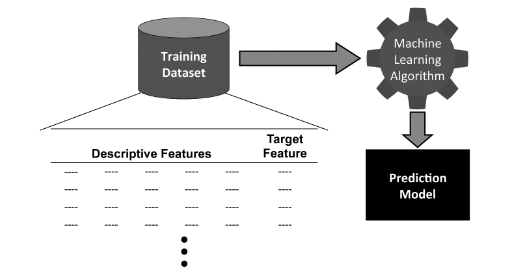
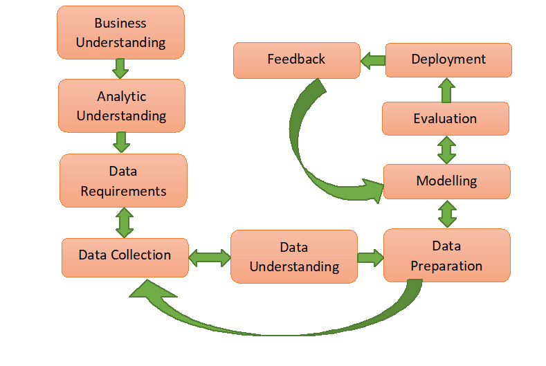
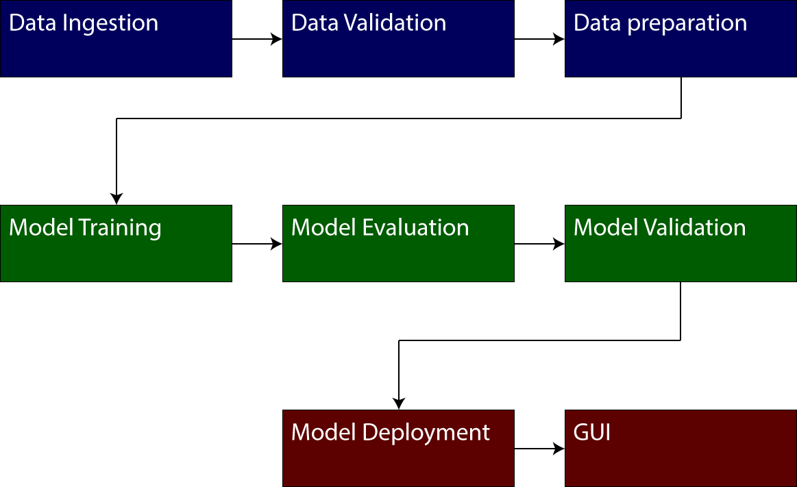

::: {.cell}

:::

::: {.cell}

:::


# Aprendizaje automático para el procesamiento de señales e imágenes médicas[^1]


::: {.class="x_small_font"}
[^1]: Diapositivas basadas en el texto: J. D. Kelleher, B. Mac Namee, y A. D’Arcy, Fundamentals of machine learning for predictive data analytics: algorithms, worked examples, and case studies, 2nd ed. Cambridge: The MIT press, 2020.
:::

##  Introduction

:::: {.columns}

::: {.column width="45%"}

::: {.callout-important title="Definitions"}

**Machine Learning:**  is defined as an automated process that extracts patterns from data.

:::

:::

::: {.column width="5%"}


:::


::: {.column width="45%"}



:::
::::

::: {.callout-note title="Important \"free\" sources of data"}

* [Kaggle](https://www.kaggle.com/)
* [Physionet](https://physionet.org/)
* [Decathlon Dataset](https://medicaldecathlon.com/)
* [UCI Machine Learning Repository](https://archive.ics.uci.edu/ml/index.php)
* [Scientific Data](https://www.nature.com/sdata/)
* [Mendeley Data](https://data.mendeley.com/)
* [IEEE Dataport](https://ieee-dataport.org/)
* [OpenI](https://openi.nlm.nih.gov/)
* [Open Access Journals](https://www.doaj.org/)
* [Google Dataset Search](https://datasetsearch.research.google.com/)
* [Data.gov](https://www.data.gov/)
* [World Bank Open Data](https://data.worldbank.org/)

:::

## Introduction 

### How machine learning works?    
Machine learning algorithms work by searching through a set of possible prediction models for the model that best captures the relationship between the descriptive features and target feature in a dataset.


::: {.cell}
::: {.cell-output .cell-output-stdout}

```
   Pregnancies  Glucose  BloodPressure  ...  DiabetesPedigreeFunction  Age  Outcome
0            6      148             72  ...                     0.627   50        1
1            1       85             66  ...                     0.351   31        0
2            8      183             64  ...                     0.672   32        1
3            1       89             66  ...                     0.167   21        0
4            0      137             40  ...                     2.288   33        1

[5 rows x 9 columns]
```


:::
:::


## Introduction

::: {.callout-caution title="What can be wrong???"}
* When we are dealing with large datasets, it is likely that there is noise.
* When we are dealing with large datasets, it is likely that there is missing data.
* When we are dealing with large datasets, it is likely that there is data leakage.
:::

::: {.callout-important title="Ill-posed problem"}
Ill-posed problem, that is, a problem for which a unique solution cannot be determined using only the information that is available
:::

## Introduction



## Introduction

