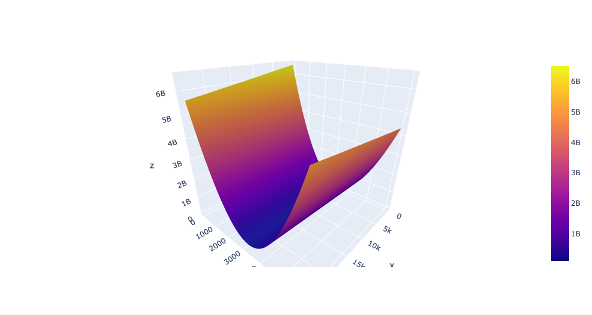

::: {.cell}

:::

::: {.cell}

:::

# Aprendizaje automático para el procesamiento de señales e imágenes médicas

## Linear Regression

::: {.cell}
::: {.cell-output-display}
{width=960}
:::
:::

## Linear Regression

In the example, in previous slide, data was modelled as a linear function. The difference (error) between the modelled data $\left( \hat{y}_n \right)$ and actual data $\left( y_n \right)$ can be written as

::: {.callout-warning title="Cost function" collapsible="false"}

$$E = \frac{1}{N} \sum_{n=1}^{N}{\left( \hat{y}_n - y_n \right)^2}$$

:::

## Some other examples of cost function

$$E = \sqrt{\frac{1}{N} \sum_{n=1}^{N}{\left( \hat{y}_n - y_n \right)^2}}$$

$$E = \frac{1}{N} \sum_{n=1}^{N}{\left| \hat{y}_n - y_n \right| }$$

## Gradient Descent algorithm

Looking the cost surface, we notices that this surface has a global minimum. If we could have an algorithm which automatically finds it.

## Gradient Descent algorithm

Indeed, there are multiples algorithms for minima searching. The most famous is the one named as _least squares_ but in this course we will use the _gradient descent algorithm._

Assuming that the data model is a function $f\left(\theta_i, x_n, y_n\right)$, where $\theta$ is known as model parameter.

::: {.callout-important title="The gradient descent algorithm" collapsible="false"}

$$\boldsymbol{\theta}_{i,j+1} =  \boldsymbol{\theta}_{i,j} - \eta \frac{\partial E}{\partial \boldsymbol{\theta}_{i}}$$
  

:::

## Gradient Descent algorithm

::: {.callout-warning title="Assumptions" collapsible="false"}

- Linear model for the Regression 
- Mean square error as cost function
- $\eta = 1$

:::

$$\boldsymbol{\theta}_i = \left[ \theta_1, \theta_0 \right]^T$$

$$\hat{y}_n  = \theta_1 x_n + \theta_0$$

$$E = \frac{1}{N} \sum_{n=1}^{N}{\left( \theta_1 x_n + \theta_0 - y_n \right)^2}$$

## Gradient Descent algorithm

:::{.small_font}

::: {.callout-note title="For $\theta_1$ estimation" collapsible="false"}
$$\boldsymbol{\theta}_{1,j+1} = \boldsymbol{\theta}_{1,j} - \eta \frac{\partial E}{\partial \boldsymbol{\theta}_{1}}$$

$$\frac{\partial E}{\partial \boldsymbol{\theta}_{1}} = \frac{\partial}{\partial \boldsymbol{\theta}_{1}} \left( \frac{1}{N} \sum_{n=1}^{N}{\left( \theta_1 x_n + \theta_0 - y_n \right)^2} \right) $$

$$\frac{\partial E}{\partial \boldsymbol{\theta}_{1}}= \frac{1}{N} \frac{\partial}{\partial \boldsymbol{\theta}_{1}} \left(  \sum_{n=1}^{N}{\left( \theta_1 x_n + \theta_0 - y_n \right)^2} \right) $$

$$\frac{\partial E}{\partial \boldsymbol{\theta}_{1}}= \frac{1}{N}  \sum_{n=1}^{N}{\frac{\partial}{\partial \boldsymbol{\theta}_{1}} \left( \left( \theta_1 x_n + \theta_0 - y_n \right)^2\right)}$$

$$\frac{\partial E}{\partial \boldsymbol{\theta}_{1}}= \frac{1}{N}  \sum_{n=1}^{N}{2 \left( \theta_1 x_n + \theta_0 - y_n \right) x_n}$$

:::

:::

## Gradient Descent algorithm

:::{.small_font}

::: {.callout-note title="For $\theta_0$ estimation" collapsible="false"}
$$\boldsymbol{\theta}_{0,j+1} = \boldsymbol{\theta}_{0,j} - \eta \frac{\partial E}{\partial \boldsymbol{\theta}_{1}}$$

$$\frac{\partial E}{\partial \boldsymbol{\theta}_{0}} = \frac{\partial}{\partial \boldsymbol{\theta}_{0}} \left( \frac{1}{N} \sum_{n=1}^{N}{\left( \theta_1 x_n + \theta_0 - y_n \right)^2} \right) $$

$$\frac{\partial E}{\partial \boldsymbol{\theta}_{0}}= \frac{1}{N} \frac{\partial}{\partial \boldsymbol{\theta}_{0}} \left(  \sum_{n=1}^{N}{\left( \theta_1 x_n + \theta_0 - y_n \right)^2} \right) $$

$$\frac{\partial E}{\partial \boldsymbol{\theta}_{0}}= \frac{1}{N}  \sum_{n=1}^{N}{\frac{\partial}{\partial \boldsymbol{\theta}_{0}} \left( \left( \theta_1 x_n + \theta_0 - y_n \right)^2\right)}$$

$$\frac{\partial E}{\partial \boldsymbol{\theta}_{0}}= \frac{1}{N}  \sum_{n=1}^{N}{2 \left( \theta_1 x_n + \theta_0 - y_n \right)}$$

:::

:::

## Changing the cost function and the data model

$$
 \begin{eqnarray}
  E & = & \frac{1}{N} \sqrt{u}\\
  \frac{\partial E}{\partial \boldsymbol{\theta}_{0}} &=& \frac{1}{2 N \sqrt{u}} \frac{\partial u}{\partial \boldsymbol{\theta}_{0}}\\
  \frac{\partial u}{\partial \boldsymbol{\theta}_{0}} &=& 2\sum_{n=1}^{N}{\left( \theta_2 x_{n}^{2} + \theta_1 x_n + \theta_0 - y_n \right)}\\
  \frac{\partial E}{\partial \boldsymbol{\theta}_{0}} &=& \frac{2\sum_{n=1}^{N}{\left( \theta_2 x_{n}^{2} + \theta_1 x_n + \theta_0 - y_n \right)}}{2 N \sqrt{u}}
 \end{eqnarray}
$$

## Changing the cost function and the data model

$$
\begin{eqnarray}
  \frac{\partial E}{\partial \boldsymbol{\theta}_{0}} &=& \frac{\sum_{n=1}^{N}{\left( \theta_2 x_{n}^{2} + \theta_1 x_n + \theta_0 - y_n \right)}}{N \sqrt{\sum_{n=1}^{N}{\left( \theta_2 x_{n}^{2} + \theta_1 x_n + \theta_0 - y_n \right)^2}}}\\
  \frac{\partial E}{\partial \boldsymbol{\theta}_{1}} &=& \frac{\sum_{n=1}^{N}{x_n \left( \theta_2 x_{n}^{2} + \theta_1 x_n + \theta_0 - y_n \right)}}{N \sqrt{\sum_{n=1}^{N}{\left( \theta_2 x_{n}^{2} + \theta_1 x_n + \theta_0 - y_n \right)^2}}}\\
  \frac{\partial E}{\partial \boldsymbol{\theta}_{2}} &=& \frac{\sum_{n=1}^{N}{x_n^2 \left( \theta_2 x_{n}^{2} + \theta_1 x_n + \theta_0 - y_n \right)}}{N \sqrt{\sum_{n=1}^{N}{\left( \theta_2 x_{n}^{2} + \theta_1 x_n + \theta_0 - y_n \right)^2}}}
\end{eqnarray}
$$