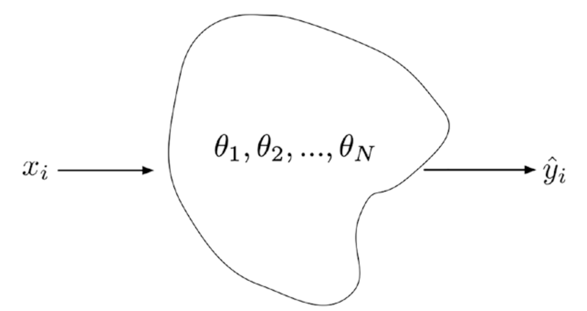
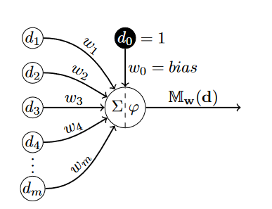
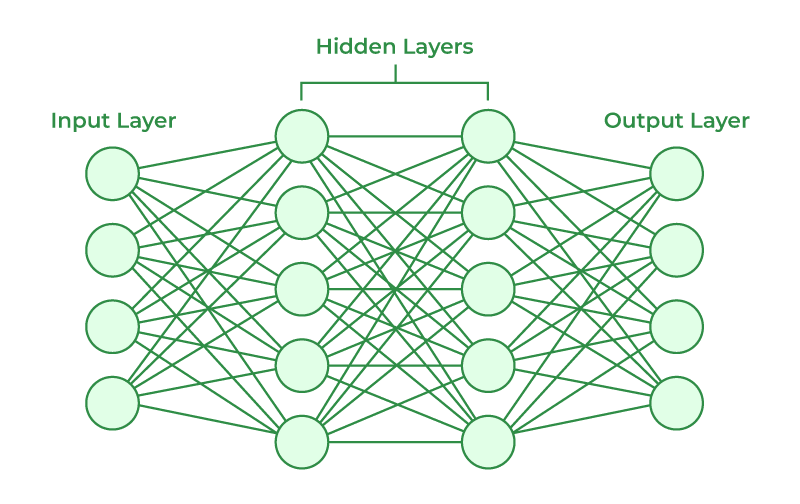
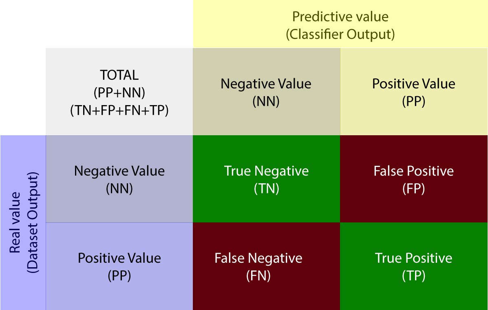
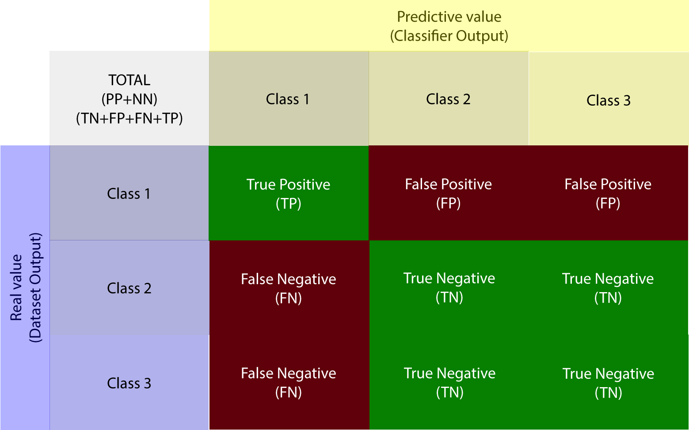
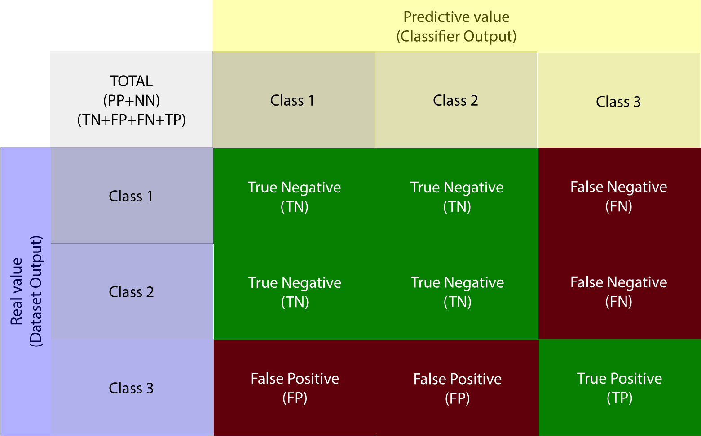

::: {.cell}

:::

::: {.cell}

:::

# Aprendizaje automático para el procesamiento de señales e imágenes médicas

## Introduction

::: {.callout-note title="Suposse..."}

A dataset of M tuples $(\mathbf{x}_i, \mathbf{y}_i)$ with i = 1, …, M. 

- $\mathbf{x}_i$: Inputs
- $\mathbf{y}_i$: Outputs

:::

::: {.callout-note title="What it is a neural network"}

Is a mathematical function (sometimes called a network function) that takes some kind of input (typically multi-dimensional) called x iand generate some output.

:::

## Introduction

::: {.callout-note title="Network function"}

- The output generated by the network function is called $\hat{y}_i$
- The network function normally depends on a certain number N of parameters, which we will indicate with $\mathbf{\theta}_k$ $$ \mathbf{\hat{y}}_i = f \left( \mathbf{\theta}_k, \mathbf{x}_i  \right), where, k=0,1,2,\ldots,N $$

:::

## Introduction

## Introduction

::: {.callout-important title=""}
A neural network is nothing more than a mathematical function that depends on a set of parameters that are tuned, hopefully in some smart way, to make the network output as close as possible to some expected output.
:::

:::: {.columns}

::: {.column width="45%"}

  - $\mathbf{x}_i \in \mathbb{R}^n$
  - $\mathbf{y}_i \in \mathbb{R}^k$
  - $i = 0,1,2,\ldots,M$
  - $\mathbf{\theta}_k \in \mathbb{R}^N$
  - $k = 0,1,2,\ldots,N$

:::

::: {.column width="45%"}

  - Loss function $L \left( \mathbf{\hat{y}}_i, \mathbf{y}_i \right) = L \left( f \left( \mathbf{\theta}_k, \mathbf{x}_i  \right), \mathbf{y}_i \right)$
  - Loss function measures how close are $\mathbf{\hat{y}}_i$ and $\mathbf{y}_i$

:::
::::

## Introduction

::: {.callout-note title="Learning"}

- $ \min_{\mathbf{\theta}_k \in \mathbb{R}^N} L \left( f \left( \mathbf{\theta}_k, \mathbf{x}_i  \right), \mathbf{y}_i \right) $

- $\min_{\mathbf{\theta}_k \in \mathbb{R}^N} L \left( f \left( \mathbf{\theta}_k, \mathbf{x}_i  \right), \mathbf{y}_i \right)$ subject to $c_q, q=1,2,3,\ldots,Q$ with $Q \in \mathbb{N}$

- The learning process is the search of a minima. However, most of the algorithms can search only a "local" minima.
  
- In principle, we want to find the global minimum or, in other words, the point for which the function value is the smallest between all possible points.

:::

  - Identifying if the minimum is a local or a global minimum is impossible, due to the network function complexity.
  - This is one (albeit not the only one) of the reasons that training large neural networks is such a challenging numerical problem.

## A single neuron

{fig-align="center" width=150%}

## Neural Network
{fig-align="center" width=150%}

## Neural Network

](../../recursos/imagenes/Presentaciones/ASIM/image003.png){fig-align="center" width=80%}

## Regularization

Neural Networks have a great number of internal parameters for learning; which varying in a vast range of values.

This number of parameters is fundamental for neural network knowledge representation 

::: {.callout-important title="Problem"}

But if this number increases too much the neural network is prone to overfitting

:::

## Regularization

::: {.callout-tip title="Definition"}
Regularization techniques reduce the possibility of a neural network overfitting by constraining the range of values that the weight values within the network hold.

:::

$$\begin{eqnarray}
 L(\mathbf{x},\mathbf{y}) = \sum_{k=1}^N \left( y_k - f \left( x_k \right) \right)^2 \\
 f \left( x \right) = \theta_0+\theta_1 x + \theta_2 x^2 + \theta_3 x^3 + \theta_4 x^4 \\
 f \left( x \right) = \theta_0+\theta_1 x + \theta_2 x^2
\end{eqnarray}$$

## Regularization

- Regularization works on assumption that smaller weights generate simpler model and thus helps avoid overfitting.
- The simpler model is less prone to overfitting.
- Adding the regularization term to the sum of squared differences between the actual value and predicted value.

## Regularization
 
$$\begin{eqnarray}
L(\mathbf{x},\mathbf{y}) = \sum_{k=1}^N \left( y_k - f \left( x_k \right) \right)^2  + \lambda \sum_{k=1}^N \theta_k
\end{eqnarray}$$

::: {.callout-note title=""}

$\lambda$ is the penalty term or regularization parameter which determines how much to penalizes the weights.

:::

## Types of Regularization{.smaller}

:::: {.columns}

::: {.column width="45%"}

**L1 Regularization or Lasso or L1 norm**

- L1 penalizes sum of absolute value of weights.

- L1 has a sparse solution.

- L1 has multiple solutions.

- L1 has built in feature selection.

- L1 is robust to outliers.

- L1 generates model that are simple and interpretable but cannot learn complex patterns.

$$\begin{eqnarray}
L(\mathbf{x},\mathbf{y}) = \sum_{k=1}^N \left( y_k - f \left( x_k \right) \right)^2  + \lambda \sum_{k=1}^N \lvert \theta_k \rvert
\end{eqnarray}$$

:::

::: {.column width="45%"}

**L2 Regularization or Ridge Regularization**

- L2 regularization penalizes sum of square weights.

- L2 has a non sparse solution

- L2 has one solution

- L2 has no feature selection

- L2 is not robust to outliers

- L2 gives better prediction when output variable is a function of all input features

- L2 regularization is able to learn complex data patterns

$$\begin{eqnarray}
L(\mathbf{x},\mathbf{y}) = \sum_{k=1}^N \left( y_k - f \left( x_k \right) \right)^2  + \lambda \sum_{k=1}^N \theta_k^2
\end{eqnarray}$$
:::

::::

## Evaluation

::: {.callout-note title="Regression"}

- $R^2$
- Residual graph
- Autocorrelation analysis

:::

::: {.callout-note title="Classification"}

- Confusion Matrix(Matriz de Confusión)
- Precision(Precisión)
- Recall(Exhaustividad)
- F1-score(Valor-F)
- Accuracy(Exactitud)
- True Positive(Positivos Verdaderos)
- True Negative(Negativos Verdaderos)
- False Positive(Positivos Falsos)
- False Negative(Negativos Falsos)

:::

## Evaluation of a classification model

::: {.callout-important title="Confusion Matrix\footnote{Taken from Wikipedia}"}

"Also known as an error matrix, is a specific table layout that allows visualization of the performance of an algorithm, typically a supervised learning one."

:::

{fig-align="center"}

## Evaluation of a classification model

::: {.callout-note title="True Negative"}

Values that being negative have been classified as negative

:::

::: {.callout-note title="True Positive"}

Values that being positive have been classified as positive

:::

::: {.callout-note title="False Positive"}

Values that being negative have been classified as positive

:::

::: {.callout-note title="False Negative"}

Values that being negative have been classified as positive

:::

## Evaluation of a classification model

:::: {.columns}

::: {.column width="45%"}

::: {.callout-note title="Sensitivity"}

How good is my classifier at detecting positive cases?
$$ \frac{TP}{TP+FN} $$

:::

::: {.callout-note title="Specificity"}

How good is my classifier at avoiding negative cases?
$$ \frac{TN}{TN+FP} $$

:::

:::

::: {.column width="45%"}

::: {.callout-note title="Precision"}

How credible is my classifier when it detects a positive case?
$$\frac{TP}{TP+FP}$$

:::

::: {.callout-note title="Accuracy and Balance Accuracy"}

How many cases the classifier correctly identifies?
$$Accuracy = \frac{TP+TN}{TP+FP+FN+TN}$$
$$BalancedAccuracy = \frac{Specificity+Sensitivity}{2}$$

:::

:::
::::

## Evaluation of a classification model

:::: {.columns}

::: {.column width="45%"}

::: {.callout-note title="Prevalence"}

How often does the positive condition actually occur in our sample?
$$\frac{TP+FN}{TP+FP+FN+TN}$$

:::

::: {.callout-note title="Detection Rate"}

Percentage of true positives
$$\frac{TP}{TP+FP+FN+TN}$$

:::

:::

::: {.column width="45%"}

::: {.callout-note title="Detection Prevalence"}

Percentage of positives
$$\frac{TP+FP}{TP+FP+FN+TN}$$

:::

::: {.callout-note title="Harmonic mean of recall and precision."}

$$2\frac{\left( Precision \right) \left( Sensitivity \right)}{Precision+Sensitivity}$$

:::

:::
::::

## Multiclass Confusion Matrix

{width=90% fig-align="center"}

## Multiclass Confusion Matrix

{width=90% fig-align="center"}

## Multiclass Confusion Matrix

{width=90% fig-align="center"}