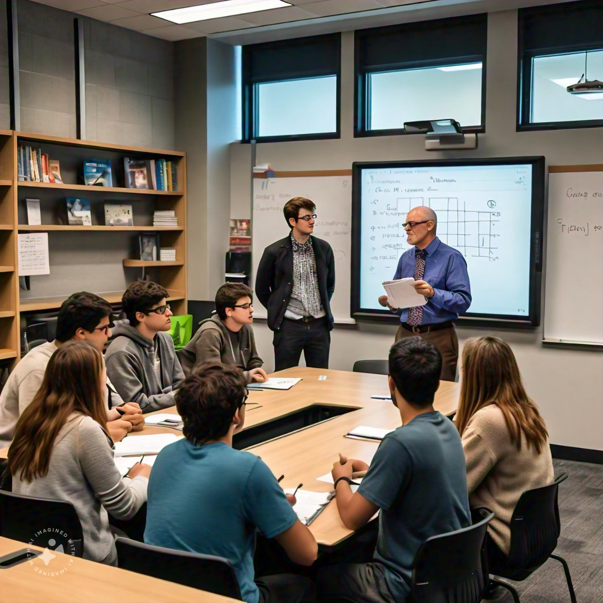

# Procesado de Señales e Imágenes Médicas - PSIM

## El Profesor{.scrollable .smaller}
:::: {.columns}

::: {.column width="45%"}

### Educación

Doctor en Ciencias de la Electrónica.
Magister en Ingeniería Electrónica y Telecomunicaciones
Ingeniero en Electrónica y Telecomunicaciones

### Intereses

Procesamiento de Imágenes, Dispositivos para el análisis de movimiento humano, ciencia de los datos, IA.

:::

::: {.column width="45%"}

### Desempeño

Profesor del Centro de Estudios en Biomédica y Biotecnogía

Profesor en la línea de Procesmiento de Señales e Imágenes

\centering

### Contacto:

pablo.caicedo@escuelaing.edu.co

:::
::::

## Contenido del curso

:::: {.columns}

::: {.column width="45%"}

:::

::: {.column width="45%"}

1. Introducción al procesado de señales e imágenes biomédicas.
2. Fundamentos procesado de señales e imágenes biomédicas
3. Extracción de características de señales biomédicas.
4. Extracción de características de imágenes biomédicas.

:::
::::

## Estrategías de Aprendizaje{.scrollable}

-	Clases magistrales
-	Desarrollo de ejercicios en clase
-	Evaluaciones parciales y una evaluación final
-	Prácticas de laboratorio, donde se utilizarán herramientas computacionales y se aplicarán conocimientos y destrezas adquiridas en otros cursos
-	Lecturas de la temática a tratar, previas a las clases magistrales
-	Lecturas de artículos científicos de interés para el área de procesamiento de señales e imágenes
-	Desarrollo de talleres fuera de la clase
-	Proyecto práctico de fin de curso

## Evaluación {.scrollable}

:::: {.columns}

::: {.column width="45%"}

-	Examen parcial 1 (15%)
-	Examen parcial 2 (15%)
-	Examen final (20%)
-	Laboratorios (30%) 
-	Proyecto Final (20%)
:::

::: {.column width="45%"}

:::
::::

## Evaluación

|     __Primer tercio (30%)__       |     __Segundo tercio (30%)__       |     __Tercer tercio (40%)__     |
|-------------------------------|--------------------------------|-----------------------------|
|     Laboratorios (15%)         |     Laboratorios (15%)          |     Proyecto final (20%)    |
|     Examen Parcial 1 (15%)    |     Examen Parcial 2 (15%)     |     Examen final (20%)      |

## Recursos

:::: {.columns}

::: {.column width="45%"}

### Clases

**Lunes** 2:30pm-4:00pm F-105. **Martes** 2:30pm-4:00pm  D-201.

### Laboratorio

 **JUEVES** 2:30pm-4:00pm. I1-304

:::

::: {.column width="45%"}

**Interpretes:** [R](https://cran.r-project.org/) y [python](https://www.python.org/).

**IDE:** [Visual Studio Code](https://code.visualstudio.com/Download), Google Colaboratory, RStudio, PyCharm, Dataspell

:::
::::

## Bibliografía{.scrollable}

[1] «Medical Image Analysis and Informatics».

[2] S. K. Zhou, D. Rueckert, y G. Fichtinger, Handbook of medical image computing and computer assisted intervention. en The Elsevier and MICCAI society book series. London: Academic press, 2020.

[3] W. Zhao, Technology-Enabled Motion Sensing and Activity Tracking for Rehabilitation. Institution of Engineering and Technology, 2022. doi: 10.1049/PBHE037E.

[4] S. K. Vasudevan, A. Baskar, M. Rajappa, y T. S. Murugesh, Digital Image Processing, 1.ª ed. Boca Raton: Chapman and Hall/CRC, 2023. doi: 10.1201/9781003217428.

[5] J. Valente, J. António, C. Mora, y S. Jardim, «Developments in Image Processing Using Deep Learning and Reinforcement Learning», J. Imaging, vol. 9, n.º 10, p. 207, sep. 2023, doi: 10.3390/jimaging9100207.

[6] T. T. Teoh, Convolutional Neural Networks for Medical Applications. en SpringerBriefs in Computer Science. Singapore: Springer Nature Singapore, 2023. doi: 10.1007/978-981-19-8814-1.

[7] J. S. Suri, D. L. Wilson, y S. Laxminarayan, Eds., Handbook of biomedical image analysis. en Biomedical engineering international book series. New York: Kluwer Academic/Plenum Publishers, 2005.

[8] J. S. Suri, D. L. Wilson, y S. Laxminarayan, Eds., Handbook of biomedical image analysis. en Biomedical engineering international book series. New York: Kluwer Academic/Plenum Publishers, 2005.

[9] R. Splinter y K. Najarian, «Biomedical Signal and Image Processing, Second Edition».

[10] P. Singhal, A. Verma, P. K. Srivastava, V. Ranga, y R. Kumar, Image Processing and Intelligent Computing Systems, 1.ª ed. Boca Raton: CRC Press, 2022. doi: 10.1201/9781003267782.

[11] H. Singh, Practical Machine Learning and Image Processing: For Facial Recognition, Object Detection, and Pattern Recognition Using Python. Berkeley, CA: Apress, 2019. doi: 10.1007/978-1-4842-4149-3.

[12] J. L. Semmlow y B. Griffel, Biosignal and medical image processing, Third edition. Boca Raton: CRC Press, Taylor & Francis Group, CRC Press is an imprint of the Taylor & Francis Group, an Informa business, 2014.

[13] S. Saxena y S. Paul, Eds., High-performance medical image processing, First edition. Palm Bay, FL, USA, Burlington, ON, Canada: Apple Academic Press ; CRC Press, 2022.

[14] R. Raut, «Intelligent Systems for Rehabilitation Engineering».

[15] R. M. Rangayyan, Biomedical signal analysis: a case-study approach. en IEEE Press series in biomedical engineering. New York, NY: Wiley-Interscience [u.a.], 2002.

[16] R. M. Rangayyan, «Biomedical Signal Analysis».

[17] K. Rabie, C. Karthik, S. Chowdhury, y P. K. Dutta, Eds., Deep learning in medical image processing and analysis. London, United Kingdom: Institution of Engineering and Technology, 2023.

[18] C. Paunwala et al., Eds., Biomedical Signal and Image Processing with Artificial Intelligence. en EAI/Springer Innovations in Communication and Computing. Cham: Springer International Publishing, 2023. doi: 10.1007/978-3-031-15816-2.

[19] C. Paunwala et al., Eds., Biomedical Signal and Image Processing with Artificial Intelligence. en EAI/Springer Innovations in Communication and Computing. Cham: Springer International Publishing, 2023. doi: 10.1007/978-3-031-15816-2.

[20] L. Panigrahi, S. Biswal, A. K. Bhoi, A. Kalam, y P. Barsocchi, Eds., Machine Learning and AI Techniques in Interactive Medical Image Analysis: en Advances in Medical Technologies and Clinical Practice. IGI Global, 2022. doi: 10.4018/978-1-6684-4671-3.

[21] G. R. Naik y W. P. D. Santos, Biomedical Signal Processing: A Modern Approach, 1.ª ed. Boca Raton: CRC Press, 2023. doi: 10.1201/9781003201137.

[22] M. Morioka, «Artificial Intelligence, Robots, and Philosophy».

[23] L. N. McKinnis, «Fundamentals of Musculoskeletal Imaging, Fifth Edition».

[24] T. Malone, C. Hazle, y M. L. Grey, Imaging in rehabilitation. New York: McGraw-Hill Medical, 2008.

[25] X. Liu et al., «Advances in Deep Learning-Based Medical Image Analysis», Health Data Sci, vol. 2021, p. 8786793, ene. 2021, doi: 10.34133/2021/8786793.

[26] C.-P. Lim, A. Vaidya, Y.-W. Chen, T. Jain, y L. C. Jain, Eds., Artificial Intelligence and Machine Learning for Healthcare: Vol. 1: Image and Data Analytics, vol. 228. en Intelligent Systems Reference Library, vol. 228. Cham: Springer International Publishing, 2023. doi: 10.1007/978-3-031-11154-9.

[27] A. Kulkarni, A. Shivananda, y N. R. Sharma, Computer Vision Projects with PyTorch: Design and Develop Production-Grade Models. Berkeley, CA: Apress, 2022. doi: 10.1007/978-1-4842-8273-1.

[28] F. A. Gonzalez y E. Romero, Eds., Biomedical Image Analysis and Machine Learning Technologies: Applications and Techniques. en Advances in Bioinformatics and Biomedical Engineering. IGI Global, 2010. doi: 10.4018/978-1-60566-956-4.

[29] T. M. Deserno, Ed., Biomedical Image Processing. en Biological and Medical Physics, Biomedical Engineering. Berlin, Heidelberg: Springer Berlin Heidelberg, 2011. doi: 10.1007/978-3-642-15816-2.

[30] D. Cudihins, Hands-on computer vision with Julia: build complex applications with advanced Julia packages for image processing, neural networks, and artificial intelligence. Birmingham, UK: Packt Publishing, 2018.

[31] M. Charbit, Digital signal processing with Python programming. London, UK : Hoboken, NJ: ISTE ; Wiley, 2017.

[32] M. Chappell, Principles of Medical Imaging for Engineers: From Signals to Images. Cham: Springer International Publishing, 2019. doi: 10.1007/978-3-030-30511-6.

[33] L. Cai, J. Gao, y D. Zhao, «A review of the application of deep learning in medical image classification and segmentation», Ann Transl Med, vol. 8, n.º 11, pp. 713-713, jun. 2020, doi: 10.21037/atm.2020.02.44.

[34] J. D. Bronzino, Ed., The biomedical engineering handbook, 3rd ed. en The electrical engineering handbook series. Boca Raton: CRC/Taylor & Francis, 2006.

[35] J. D. Gibson, Fourier Transforms, Filtering, Probability and Random Processes: Introduction to Communication Systems. en Synthesis Lectures on Communications. Cham: Springer International Publishing, 2023. doi: 10.1007/978-3-031-19580-8.

[36] G. R. Grimmett y D. R. Stirzaker, Probability and random processes fourth edition, 4.ª ed. NEW YORK: OXFORD UNIVERSITY PRESS, 2020.

[37] Probability and Random Processes With Applications to Signal Processing and Communications. San Diego, CA, USA: Elsevier Science & Technology Books, 2012.

[39] L. Wasserman, All of Statistics: A Concise Course in Statistical Inference. en Springer Texts in Statistics. New York, NY: Springer New York, 2004. doi: 10.1007/978-0-387-21736-9.

[40] R. C. Gonzalez y R. E. Woods, Digital image processing. New York, NY: Pearson, 2018.

[41] T. M. Apostol, Calculus. 1: One-variable calculus, with an introduction to linear algebra. New York: Wiley, 1980.
