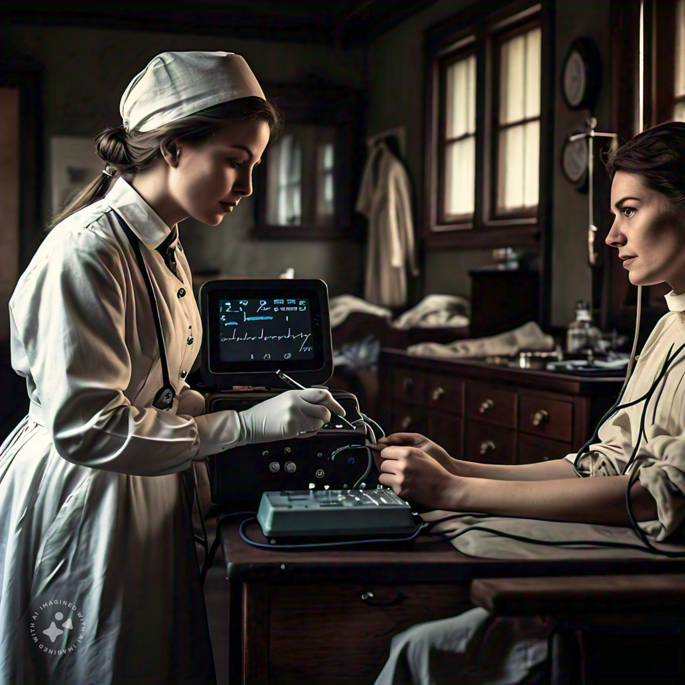
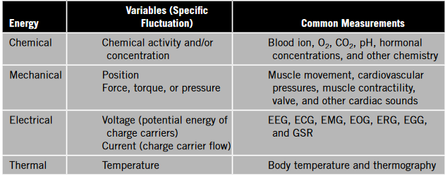

::: {.cell}

:::

::: {.cell}

:::


# Procesado de Señales e Imágenes Médicas - PSIM

## Introduction

:::: {.columns}

::: {.column width="45%"}

::: {.callout-note title="Biosignals"}
* Bio - That came from a biological being
* Signal - A signal is a function that conveys information about a physical phenomenon.
* Biosignals - The search for information from living systems to know its health state
:::

:::


::: {.column width="45%"}


:::
::::

## Introduction

:::: {.columns}


::: {.column width="45%"}



:::


::: {.column width="45%"}

::: {.callout-note title="Biosignals"}
The codification of biosignals into variations:
* Electrical
* Mechanical
* Chemical
* Thermal

:::

:::
::::

## Introduction



## Introduction


## Time line

### Biomedical Signals:
* 1791: Luigi Galvani discovers electrical signals in living tissues (frog legs)

* 1830s: Carlo Matteucci studies electrical signals in the heart

* 1887: Willem Einthoven invents the first electrocardiograph (ECG)

* 1900s: James Mackenzie develops the first clinical ECG machine

## Time line

### Biomedical Signals:

* 1920s: Electroencephalography (EEG) is developed by Hans Berger

* 1930s: Electromyography (EMG) is developed by John Humphrey and others

* 1940s: Development of the first commercial ECG machines

* 1950s: Signal processing techniques are applied to biomedical signals

## Time line

### Biomedical Signals:

* 1960s: Digital signal processing and computer analysis of biomedical signals emerge

* 1970s: Biomedical signal processing becomes a recognized field

* 1980s: Development of Holter monitoring (24-hour ECG)

* 1990s: Advances in signal processing and machine learning applied to biomedical signals

## Time line

### Biomedical Signals:

* 2000s: Development of wearable devices and mobile health (mHealth) technologies

* 2010s: Emergence of big data analytics and cloud computing in biomedical signal processing

* 2020s: Integration of artificial intelligence (AI) and machine learning (ML) in biomedical signal processing

## Time line

### Biomedical Images:

* 1895: Wilhelm Roentgen discovers X-rays, leading to medical imaging

* 1900s: X-ray technology improves with development of modern X-ray tubes

* 1913: Albert Salomon develops mammography

* 1920s: Ultrasound technology is developed by Karl Dussik and others

## Time line

### Biomedical Images:

* 1930s: Nuclear medicine emerges with development of radioactive tracers

* 1950s: Computed Tomography (CT) scans are developed by Godfrey Hounsfield and Allan McLeod Cormack

* 1960s: Development of medical ultrasound imaging

* 1970s: Magnetic Resonance Imaging (MRI) is developed by Richard Ernst and others

## Time line

### Biomedical Images:

* 1980s: Digital image processing and analysis techniques are applied to biomedical images

* 1990s: Advances in MRI and CT scan technology, including 3D imaging

* 2000s: Development of functional MRI (fMRI), diffusion tensor imaging (DTI), and other advanced MRI techniques

* 2010s: Emergence of artificial intelligence (AI) and machine learning in medical imaging


## Time line

### Additional Milestones:

* 1950s: Development of medical electronics and instrumentation
* 1960s: First medical imaging computers are developed
* 1970s: Development of digital image processing and analysis software
* 1980s: Emergence of medical imaging informatics and PACS (Picture Archiving and Communication Systems)
* 1990s: Development of telemedicine and teleradiology
* 2000s: Emergence of electronic health records (EHRs) and health information exchanges (HIEs)
* 2010s: Development of personalized medicine and precision health initiatives
<!-- Key Figures:
Luigi Galvani
Willem Einthoven
Hans Berger
John Humphrey
Godfrey Hounsfield
Allan McLeod Cormack
Richard Ernst
Karl Dussik
Albert Salomon
Wilhelm Roentgen
James Mackenzie
Carlo Matteucci
Key Events:
1896: First X-ray image taken by Wilhelm Roentgen
1924: First ECG recording taken by Willem Einthoven
1957: First commercial ECG machine released
1971: First CT scan taken by Godfrey Hounsfield and Allan McLeod Cormack
1984: First MRI scan taken by Richard Ernst and others -->


# Part I: Probability and Statistics (Repaso)

## Events, Sample Space, Experiments 

::: {.callout-tip title="Definition" collapsible="false"}

An __experiment__ is a physical procedure that produces some kind of result.

:::

::: {.callout-tip title="Definition" collapsible="false"}

An __event__ is a set of experiment's possible results.

:::

::: {.callout-tip title="Consejo" collapsible="false"}

A __sample space__ is the set of ALL possibles results of an experiment.

:::


## Events, Sample Space, Experiments 

::: {.panel-tabset group="Example"}

## Graph


::: {.cell}
::: {.cell-output-display}
{width=960}
:::
:::


## Code


::: {.cell}

```{.python .cell-code}
data = np.genfromtxt("../../data/mitbih_train.csv", delimiter=",")
ecg1 = data[1, :-1]
time = np.array(range(0,len(ecg1)))/125
fig = plt.figure()
plt.plot(time, ecg1)
plt.xlabel("Time (s)")
plt.ylabel("Normalized ECG")
```
:::


## Sample Space


::: {.cell}

```{.python .cell-code}
print("Maximun Value: "+ str(ecg1.max()))
```

::: {.cell-output .cell-output-stdout}

```
Maximun Value: 1.0
```


:::

```{.python .cell-code}
print("Minimun Value: "+ str(ecg1.min()))
```

::: {.cell-output .cell-output-stdout}

```
Minimun Value: 0.0
```


:::
:::


## Result


::: {.cell}

```{.python .cell-code}
print(ecg1[np.random.choice(ecg1.shape[0], 1, replace=False)])
```

::: {.cell-output .cell-output-stdout}

```
[0.01139601]
```


:::
:::


## Dataset

__Name:__ ECG Heartbeat Categorization Dataset.

__URL:__ https://www.kaggle.com/datasets/shayanfazeli/heartbeat?resource=download

:::

## Probability Axioms

For the given events _A_ and _B_ that are in a sample space _S_:

::: {.callout-tip title="Axioms" collapsible="false"}

- $0 \leq P_r \left(A\right) \leq 1$
- $P_r\left(S\right) = 1$
- If $A \cap B = \emptyset$ then $P_r\left(A \cup B \right) = P_r \left(A\right) + P_r \left(B\right)$
- If $A \cap B \neq \emptyset$ then $P_r\left(A \cup B \right) = P_r \left(A\right) + P_r \left(B\right) - P_r\left(A \cap B \right)$
- $P_r\left(\bar{A}\right) = 1-P_r \left(A\right)$
- If $A\subset B$ then $P_r \left(A\right)\leq P_r \left(B\right)$
- $P_r \left(A|B\right)=\frac{P_r \left(A\cap B\right)}{P_r \left(B\right)}$

:::


## Random Variable

::: {.callout-tip title="Definition" collapsible="false"}

A random variable is a real valued function of the elements of a sample space, _S_ . Given an experiment, _E_ , with sample space, _S_, the random variable maps each possible outcome of _E_.

:::

::: {.callout-tip title="Definition" collapsible="false"}

The probability mass function (PMF), $P_X\left(x\right)$, of a random variable, _X_, is a function that assigns a probability to each possible value of the random variable, _X_.

:::

## Random Variable


## Random Variables

### Conditions

::: columns

:::{.column width="50%"}

::: {.callout-tip title="Discrete" collapsible="false"}

$$\sum_{\chi \in X}P_X\left(\chi \right) = 1$$

:::


:::

:::{.column width="50%"}

::: {.callout-tip title="Continuous" collapsible="false"}

$$\int_{-\infty}^{\infty}P_X\left(\chi \right)d\chi = 1$$

:::

:::

:::


## Random Variables

### Expected Values

::: columns

:::{.column width="50%"}

::: {.callout-tip title="Discrete" collapsible="false"}

$$\mu = \sum_{\chi \in X}\chi P_X\left(\chi \right)$$

:::


:::

:::{.column width="50%"}

::: {.callout-tip title="Continuous" collapsible="false"}

$$\mu=\int_{-\infty}^{\infty}\chi P_X\left(\chi \right)d\chi$$

:::

:::

:::

## Random Variables

### Variance

::: columns

:::{.column width="50%"}

::: {.callout-tip title="Discrete" collapsible="false"}

$$\sigma^2 = \sum_{\chi \in X}\left(\chi - \mu \right)^2 P_X\left(\chi \right)$$

:::


:::

:::{.column width="50%"}

::: {.callout-tip title="Continuous" collapsible="false"}

$$\sigma^2 = \int_{-\infty}^{\infty}\left(\chi - \mu \right)^2 P_X\left(\chi \right)d\chi$$

:::

:::

:::

## PDF Estimation

::: {.panel-tabset group="Example"}


## Graph


::: {.cell}
::: {.cell-output-display}
{width=960}
:::
:::


## Code


::: {.cell}

```{.python .cell-code}
counts01, bin_edges01 = np.histogram(ecg1, bins=10, density=True)
counts02, bin_edges02 = np.histogram(ecg1, bins=50, density=True)
counts03, bin_edges03 = np.histogram(ecg1, bins=100, density=True)
fig01=plt.figure()
plt.plot(bin_edges01[1:], counts01/sum(counts01), label="Estimation with 10 bins")
plt.plot(bin_edges02[1:], counts02/sum(counts02), label="Estimation with 50 bins")
plt.plot(bin_edges03[1:], counts03/sum(counts03), label="Estimation with 100 bins")
plt.legend()
plt.grid()
plt.xlabel("Normalised ECG Value")
plt.ylabel("Estimated PDF Value")
```
:::


## Exp. Value


::: {.cell}
::: {.cell-output .cell-output-stdout}

```
0.09001020772910533
```


:::
:::


## Variance


::: {.cell}
::: {.cell-output .cell-output-stdout}

```
0.02551116143316462
```


:::
:::


:::