::: {.cell}

:::

::: {.cell}

:::


# Procesamiento de imágenes

## Basic Mathematic - Element-Wise Operation

::: {.callout-tip title="Definition" collapsible="false"}

Operation involving one or more images is carried out on a pixel-bypixel basis

:::

$$ 
\begin{bmatrix}
a_{11} & a_{12} \\
a_{21} & a_{22}  
\end{bmatrix} \oplus \begin{bmatrix} b_{11} & b_{12} \\  b_{21} & b_{22}\end{bmatrix} = \begin{bmatrix} a_{11}+b_{11} & a_{12}+b_{12} \\  a_{21}+b_{21} & a_{22}+b_{22}\end{bmatrix} $$

$$ 
\begin{bmatrix}
a_{11} & a_{12} \\
a_{21} & a_{22}  
\end{bmatrix} \odot \begin{bmatrix} b_{11} & b_{12} \\  b_{21} & b_{22}\end{bmatrix} = \begin{bmatrix} a_{11}.b_{11} & a_{12}.b_{12} \\  a_{21}.b_{21} & a_{22}.b_{22}\end{bmatrix} $$

## Basic Mathematic - Linear Operations{.scrollable}

::: {.callout-tip title="Definition" collapsible="false"}

Given two arbitrary constants, $\alpha_1$ and $\alpha_2$, and two arbitrary images $f_1\left(x,y\right)$ and $f_2\left(x,y\right)$, $\varkappa$ is said to be a linear operator if:

$$ \begin{equation}\begin{split} \varkappa\left[\alpha_1 f_1\left(x,y\right) + \alpha_2 f_2\left(x,y\right)\right] & =  \alpha_1 \varkappa\left[ f_1\left(x,y\right)\right] + \alpha_2 \varkappa\left[f_2\left(x,y\right)\right] \\ & = \alpha_1 g_1\left(x,y\right) + \alpha_2 g_2\left(x,y\right) \end{split}\end{equation} $$

:::

Supose $\alpha_1 = 5$, $\alpha_2 = 2$, $\varkappa = max$ and consider:

$$f_1 = \begin{bmatrix}0 & -1 \\2 & 4\end{bmatrix}$$, $$f_2 = \begin{bmatrix}30 & 4 \\-2 & -3\end{bmatrix}$$

## Basic Mathematic - Adding


 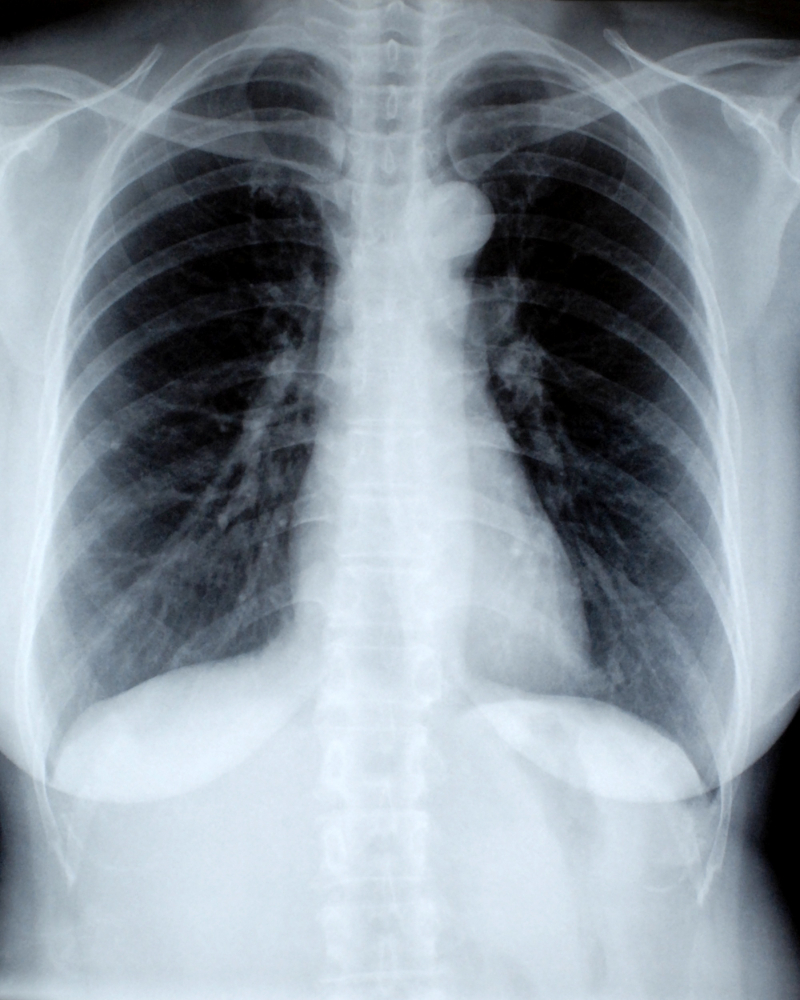{fig-align="center" height=60%} 

## Basic Mathematic - Adding {.scrollable}


::: {.panel-tabset} 

## Images


::: {.cell layout="[[45,-10,45],[100]]" layout-align="center"}
::: {.cell-output-display}
{fig-align='center' width=960}
:::

::: {.cell-output-display}
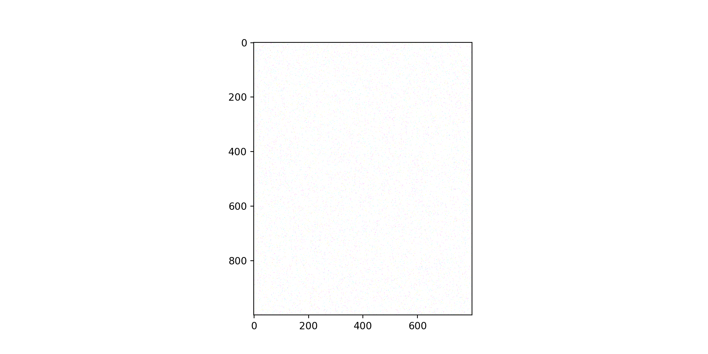{fig-align='center' width=960}
:::

::: {.cell-output-display}
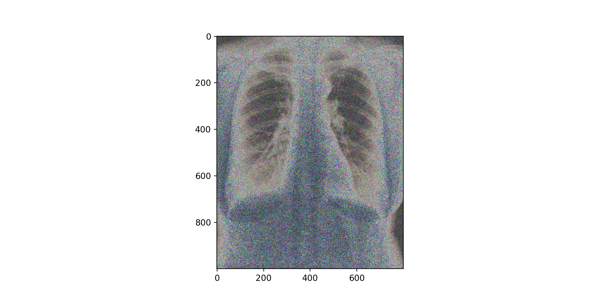{fig-align='center' width=960}
:::
:::


## Code


::: {.cell layout-align="center"}

```{.python .cell-code}
x_ray_chest = cv2.imread("../../recursos/imagenes/Presentaciones/PSIM/female-chest-x-ray.jpg")
plt.imshow(x_ray_chest, cmap="gray")
plt.show()
image_synt1 = 100*np.abs(np.random.normal(0, 1, x_ray_chest.shape))
plt.imshow(image_synt1)
plt.show()
final_image = np.uint8(x_ray_chest+image_synt1)
plt.imshow(final_image)
plt.show()
```
:::


:::

## Basic Mathematic - Multiplying {.scrollable}


::: {.panel-tabset} 

## Images


::: {.cell layout="[[45,-10,45],[100]]" layout-align="center"}
::: {.cell-output-display}
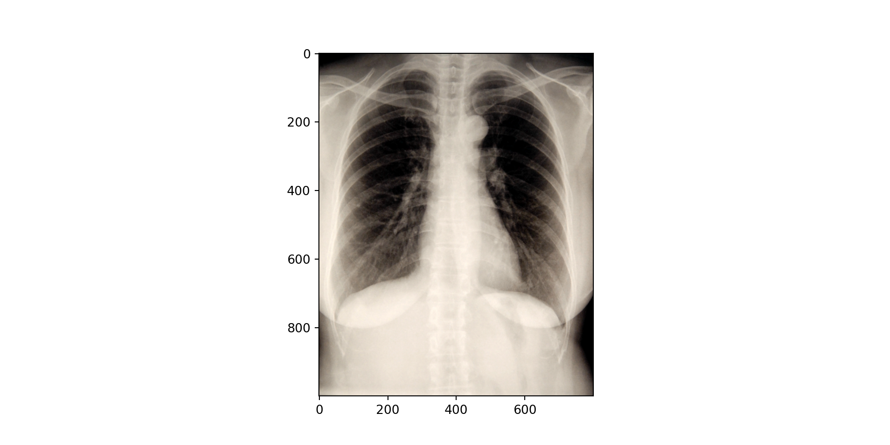{fig-align='center' width=960}
:::

::: {.cell-output-display}
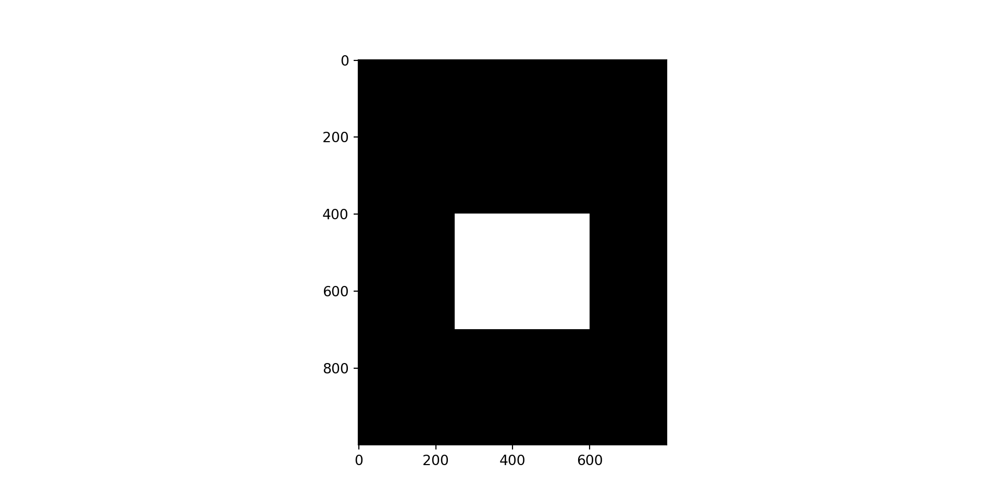{fig-align='center' width=960}
:::

::: {.cell-output-display}
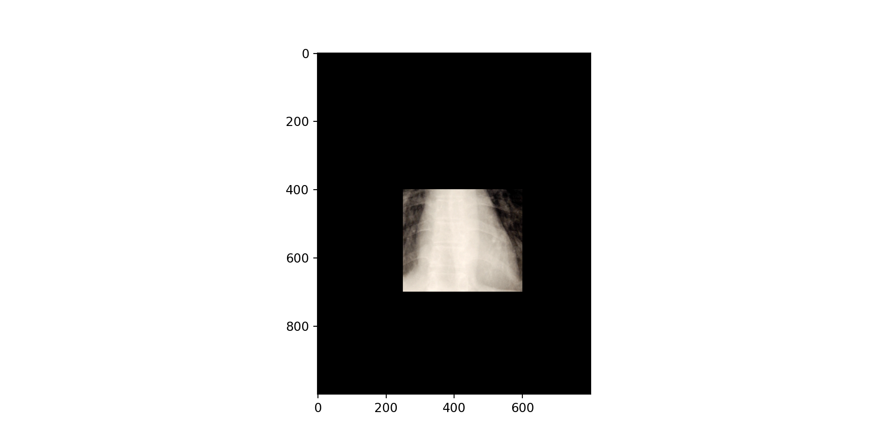{fig-align='center' width=960}
:::
:::


## Code


::: {.cell layout-align="center"}

```{.python .cell-code}
x_ray_chest = cv2.imread("../../recursos/imagenes/Presentaciones/PSIM/female-chest-x-ray.jpg")
mask = np.uint8(np.zeros(x_ray_chest.shape))
mask[400:700, 250:600, :]=1
plt.imshow(x_ray_chest)
plt.show()
plt.imshow(255*mask)
plt.show()
plt.imshow(np.multiply(x_ray_chest,mask))
plt.show()
```
:::


:::

## Basic Mathematic - Pixel intensity {.scrollable}


::: {.panel-tabset} 

## Images


::: {.cell layout-ncol="3" layout-align="center"}
::: {.cell-output-display}
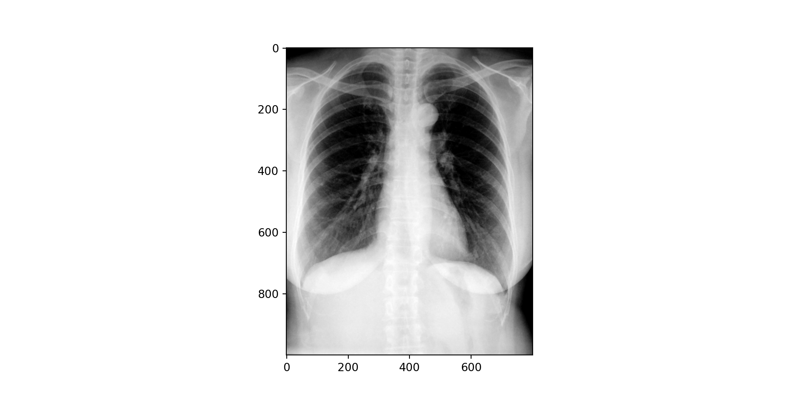{fig-align='center' width=960}
:::

::: {.cell-output-display}
{fig-align='center' width=960}
:::

::: {.cell-output-display}
{fig-align='center' width=960}
:::

::: {.cell-output-display}
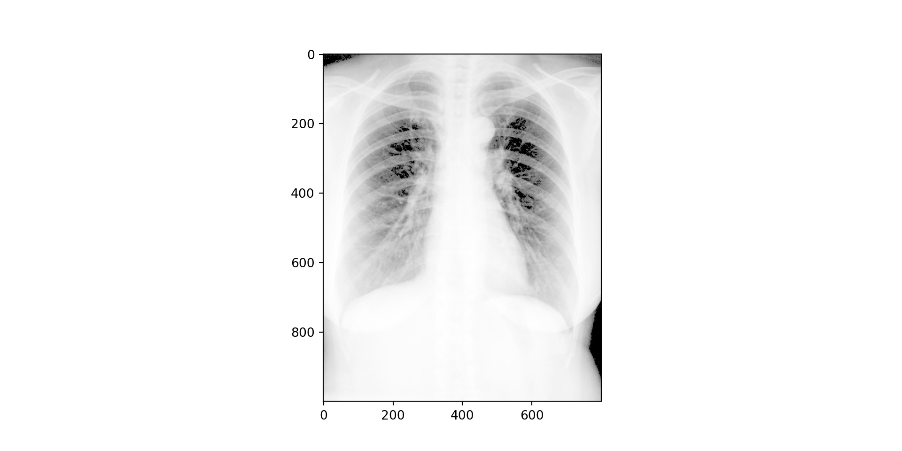{fig-align='center' width=960}
:::

::: {.cell-output-display}
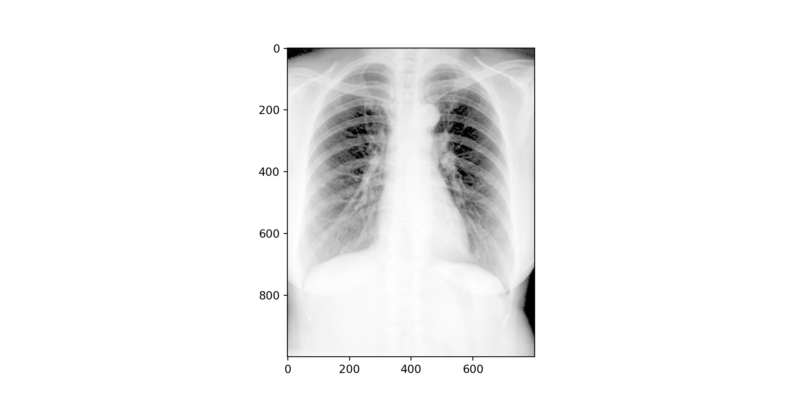{fig-align='center' width=960}
:::

::: {.cell-output-display}
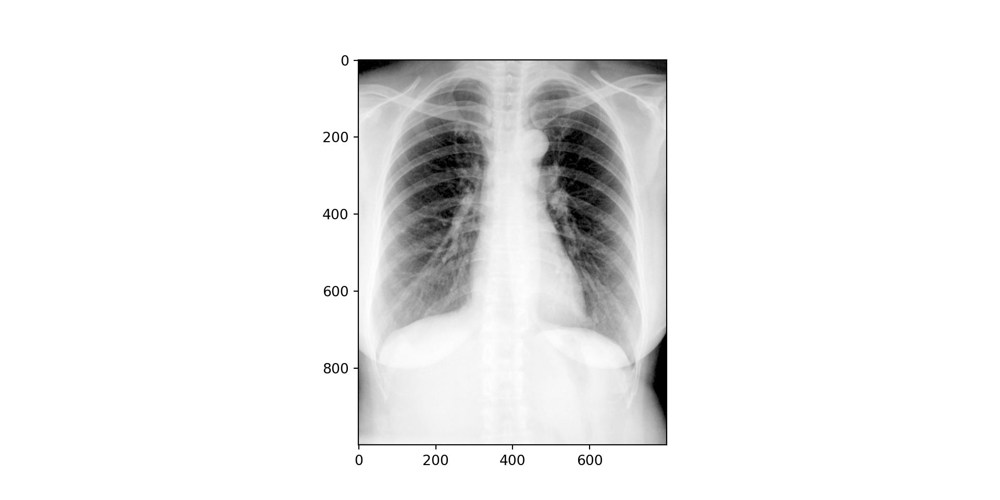{fig-align='center' width=960}
:::
:::


## Code


::: {.cell layout-align="center"}

```{.python .cell-code}
x_ray_chest_gray = cv2.cvtColor(x_ray_chest, cv2.COLOR_BGR2GRAY)
plt.imshow(x_ray_chest_gray, cmap="gray")
plt.show()
plt.imshow(np.power(x_ray_chest_gray,1.1), cmap="gray")
plt.show()
plt.imshow(np.power(x_ray_chest_gray,1.2), cmap="gray")
plt.show()
plt.imshow(np.power(x_ray_chest_gray,0.2), cmap="gray")
plt.show()
plt.imshow(np.power(x_ray_chest_gray,0.3), cmap="gray")
plt.show()
plt.imshow(np.power(x_ray_chest_gray,0.5), cmap="gray")
plt.show()
```
:::


:::


## Basic Mathematic - Pixel intensity {.scrollable}

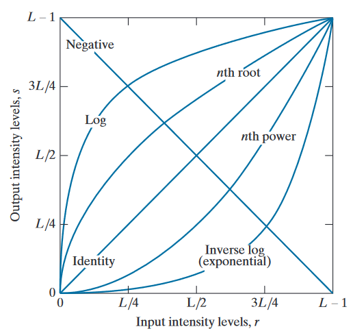

## Basic Mathematic - Pixel intensity {.scrollable}

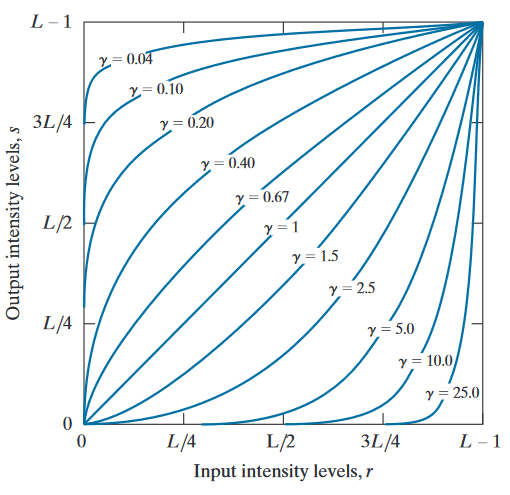

<!-- TODO: FALTAN MAS APLICACIONES DE LA MATEMATICA BASICA -->

## Neighborhood operations

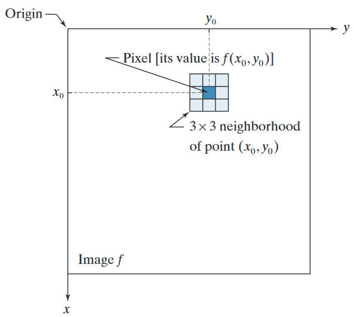

## Neighborhood Operations

:::{.small_font}

  For example, suppose that the specified operation is to compute the average value of the pixels in a rectangular neighborhood of size mn × centered on $\left(x,y\right)$. The coordinates of pixels in this region are the elements of set $S_{xy}$.

:::


::: {.panel-tabset} 

## Images

::: columns

:::{.column width="50%"}


::: {.cell}
::: {.cell-output-display}
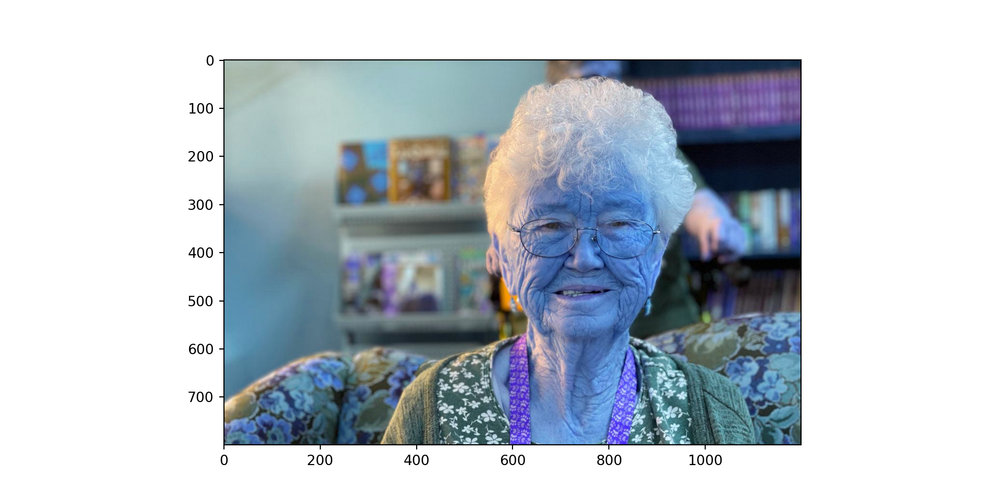{width=960}
:::
:::


:::

:::{.column width="50%"}


::: {.cell}
::: {.cell-output-display}
{width=960}
:::
:::


:::

:::

## code


::: {.cell}

```{.python .cell-code}
elderly = cv2.imread("../../recursos/imagenes/Presentaciones/PSIM/elderly.jpg")
plt.imshow(elderly)
elderly_gray = cv2.cvtColor(elderly, cv2.COLOR_BGR2GRAY)
plt.imshow(elderly_gray, cmap="gray")
```
:::


:::

## Neighborhood operations


::: {.panel-tabset} 

## Original


::: {.cell}
::: {.cell-output-display}
{width=960}
:::
:::


## Averaging


::: {.cell}
::: {.cell-output-display}
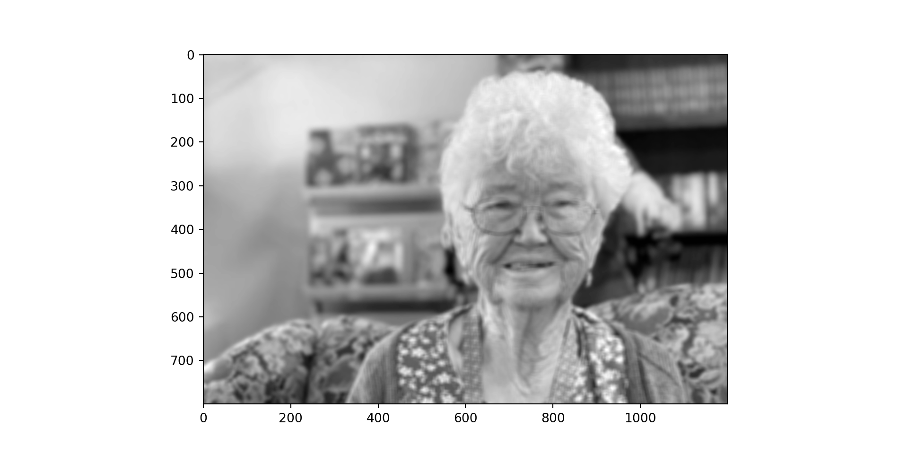{width=960}
:::
:::


## Code


::: {.cell}

```{.python .cell-code}
N = 10
kernel = np.ones((N,N),np.float32)/(N*N)
dst = cv2.filter2D(elderly_gray,-1,kernel)
plt.imshow(dst, cmap="gray")
```
:::


:::


## Neighborhood operations


::: {.panel-tabset} 

## Original


::: {.cell}
::: {.cell-output-display}
{width=960}
:::
:::


## Median


::: {.cell}
::: {.cell-output-display}
{width=960}
:::
:::


## Code


::: {.cell}

```{.python .cell-code}
N=11

dst1 = cv2.medianBlur(elderly_gray, N)
plt.imshow(dst1, cmap="gray")
```
:::


:::

## Neighborhood operations


::: {.panel-tabset} 

## Mean


::: {.cell}
::: {.cell-output-display}
{width=960}
:::
:::


## Median


::: {.cell}
::: {.cell-output-display}
{width=960}
:::
:::


:::

## Neighborhood operations

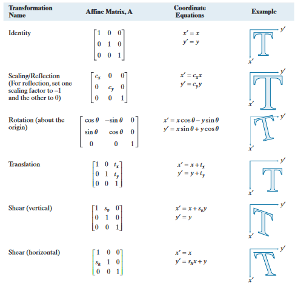

## Neighborhood operations

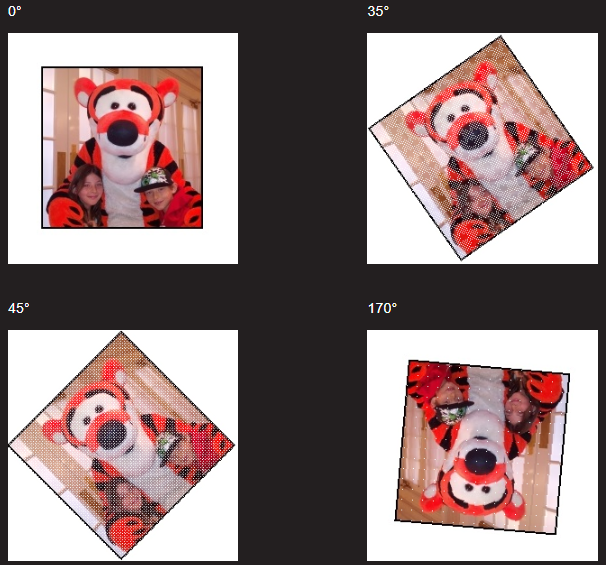


## Edge dection{.scrollable}


::: {.cell}
::: {.cell-output-display}
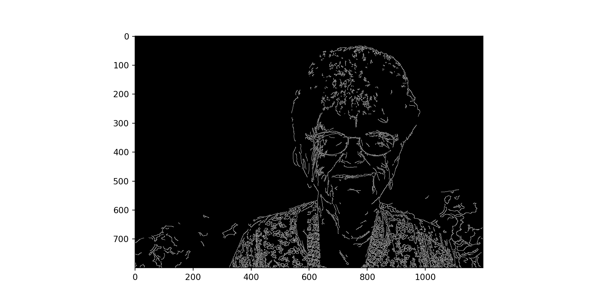{width=960}
:::
:::


## Edge dection{.scrollable}


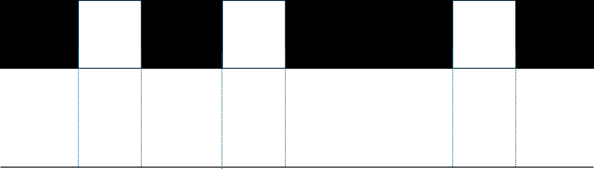{fig-align="center"} 


## Edge dection{.scrollable}


::: {.panel-tabset} 

## Images Grad Y


::: {.cell}
::: {.cell-output-display}
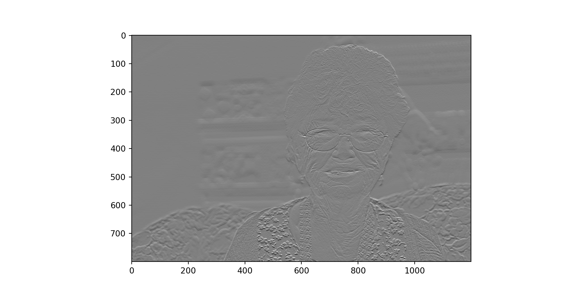{width=960}
:::
:::


## Images Grad X


::: {.cell}
::: {.cell-output-display}
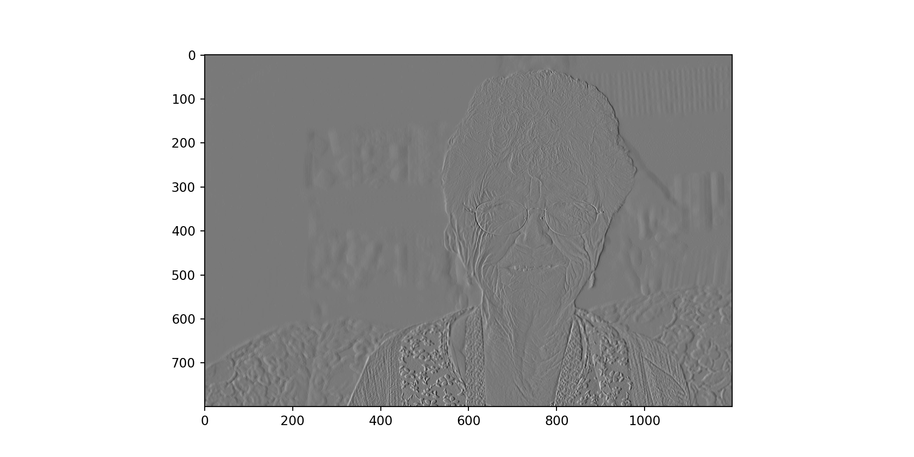{width=960}
:::
:::


## Images Grad Trunc Y


::: {.cell}
::: {.cell-output-display}
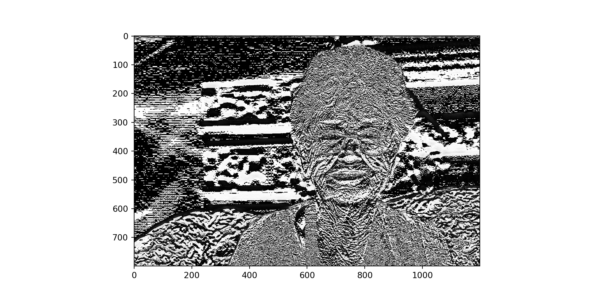{width=960}
:::
:::


## Images Trunc Grad X


::: {.cell}
::: {.cell-output-display}
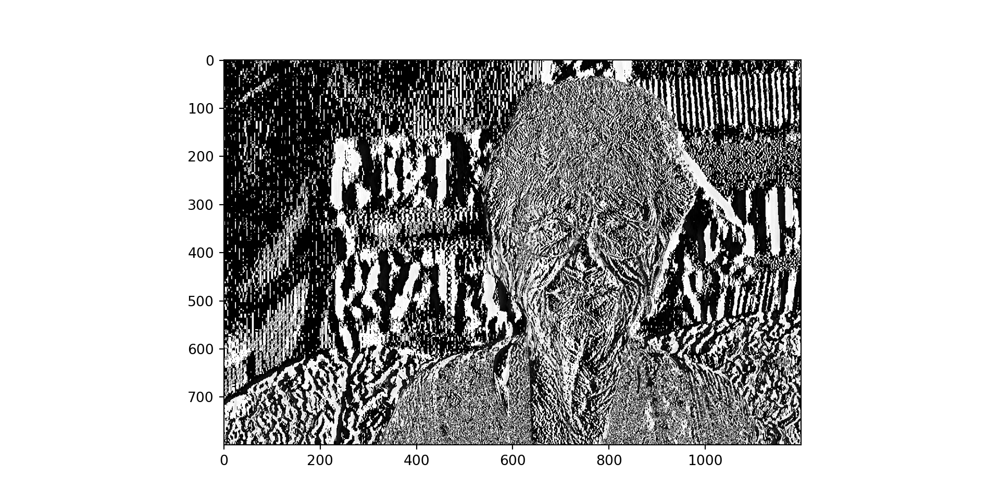{width=960}
:::
:::


## Code


::: {.cell}

```{.python .cell-code}
dst = cv2.Sobel(elderly_gray, cv2.CV_16S, 1, 0,  ksize=3, scale=1, delta=0, borderType= cv2.BORDER_DEFAULT)
dst1 = np.uint8(255*dst/np.max(dst))
plt.imshow(dst1, cmap="gray")
```
:::


:::

## Histogram


::: {.panel-tabset} 

## Histogram


::: {.cell}
::: {.cell-output-display}
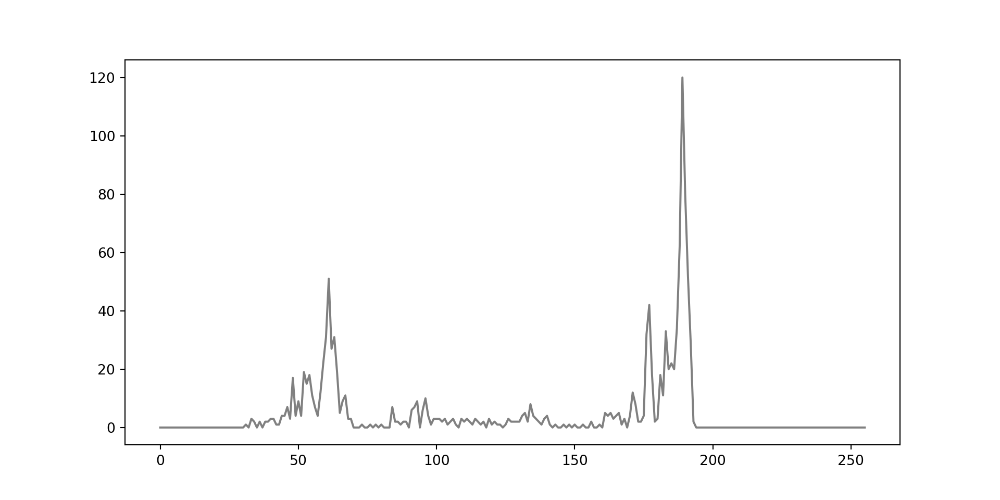{width=960}
:::
:::


## Code


::: {.cell}

```{.python .cell-code}
elderly_hist = cv2.calcHist(elderly_gray, [0], None, [256], [0,256])
plt.plot(elderly_hist, color="gray")
```
:::


:::

## Histogram


::: {.panel-tabset} 

## First thing to do

+---+---+---+---+---+---+---+---+---+---+
| 3 | 3 | 2 | 2 | 1 | 1 | 0 | 3 | 0 | 1 |
+---+---+---+---+---+---+---+---+---+---+
| 2 | 2 | 2 | 3 | 2 | 2 | 0 | 2 | 2 | 1 |
+---+---+---+---+---+---+---+---+---+---+
| 0 | 3 | 2 | 0 | 1 | 1 | 3 | 1 | 1 | 1 |
+---+---+---+---+---+---+---+---+---+---+
| 3 | 0 | 2 | 0 | 2 | 3 | 1 | 0 | 2 | 1 |
+---+---+---+---+---+---+---+---+---+---+
| 2 | 2 | 0 | 0 | 3 | 1 | 3 | 1 | 3 | 1 |
+---+---+---+---+---+---+---+---+---+---+
| 3 | 3 | 2 | 0 | 3 | 0 | 3 | 2 | 0 | 3 |
+---+---+---+---+---+---+---+---+---+---+
| 3 | 3 | 1 | 1 | 2 | 3 | 0 | 3 | 1 | 3 |
+---+---+---+---+---+---+---+---+---+---+
| 3 | 1 | 3 | 3 | 2 | 0 | 3 | 0 | 2 | 1 |
+---+---+---+---+---+---+---+---+---+---+
| 2 | 1 | 1 | 3 | 3 | 1 | 3 | 2 | 2 | 1 |
+---+---+---+---+---+---+---+---+---+---+
| 0 | 3 | 2 | 2 | 1 | 1 | 0 | 0 | 0 | 0 |
+---+---+---+---+---+---+---+---+---+---+


## Image


::: {.cell layout-ncol="2"}
::: {.cell-output-display}
{width=960}
:::

::: {.cell-output-display}
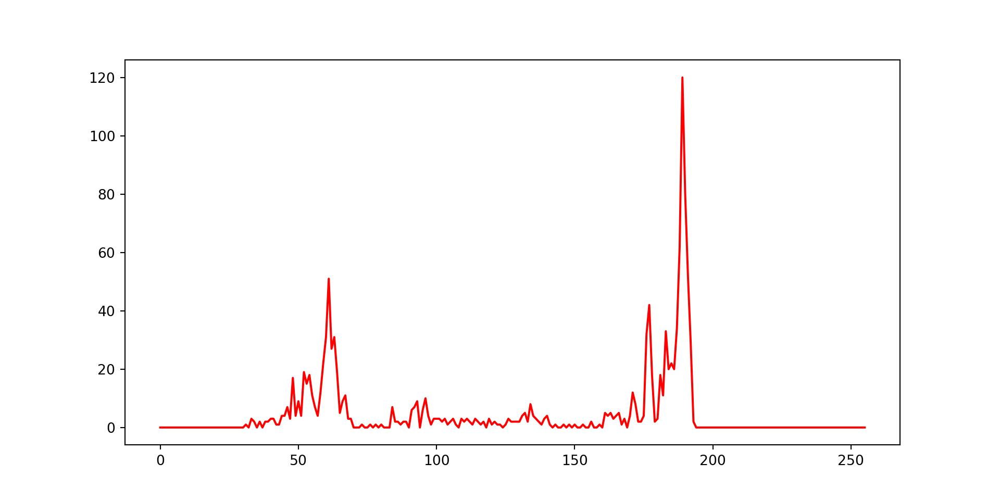{width=960}
:::
:::


## Code


::: {.cell}

```{.python .cell-code}
elderly = cv2.imread("../../recursos/imagenes/Presentaciones/PSIM/elderly.jpg")
elderly_gray = cv2.cvtColor(elderly, cv2.COLOR_BGR2GRAY)
plt.imshow(elderly_gray, cmap="gray", vmin=0, vmax=255)
plt.show()


elderly_hist = cv2.calcHist(elderly_gray, [0], None, [256], [0,256])
plt.plot(elderly_hist, color="red")
plt.show()
```
:::


## Recommended Reading

cv2.calcHist(images, channels, mask, histSize, ranges)

[Help Docs Opencv](https://docs.opencv.org/3.4/d6/dc7/group__imgproc__hist.html#ga4b2b5fd75503ff9e6844cc4dcdaed35d)

:::

## Histogram{.scrollable}


::: {.panel-tabset} 

## Images


::: {.cell layout-ncol="2"}
::: {.cell-output-display}
{width=960}
:::

::: {.cell-output-display}
{width=960}
:::

::: {.cell-output-display}
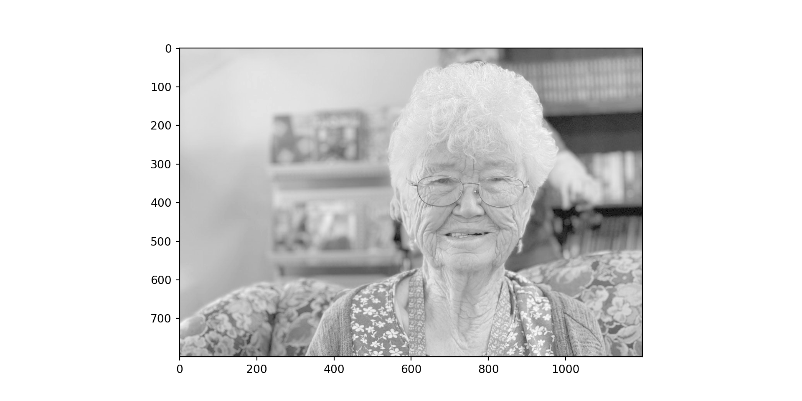{width=960}
:::

::: {.cell-output-display}
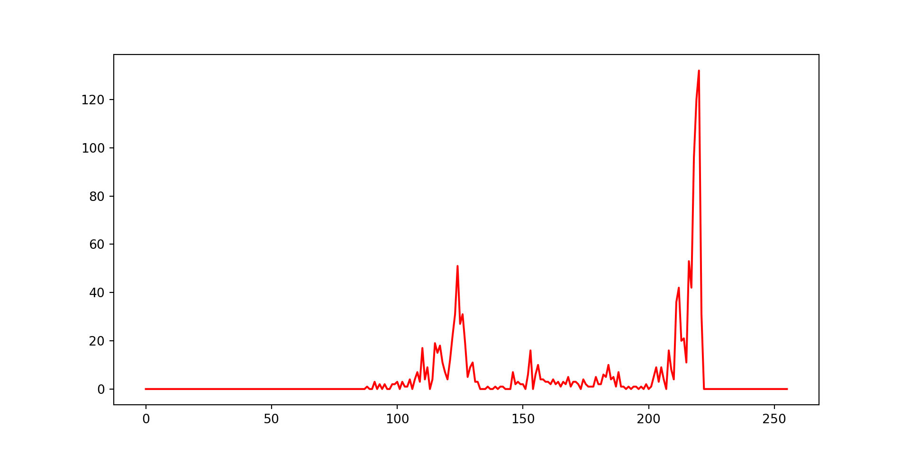{width=960}
:::

::: {.cell-output-display}
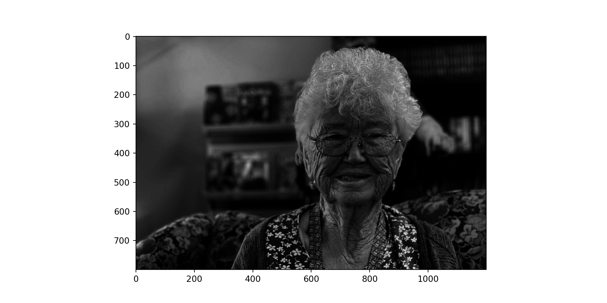{width=960}
:::

::: {.cell-output-display}
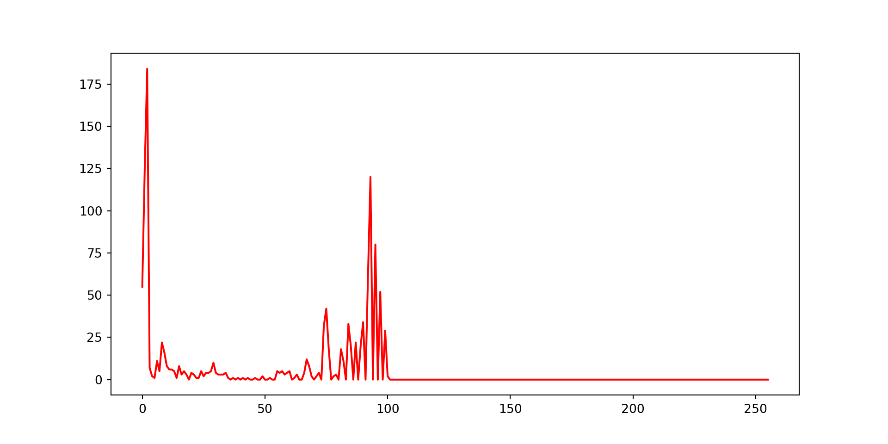{width=960}
:::

::: {.cell-output-display}
{width=960}
:::

::: {.cell-output-display}
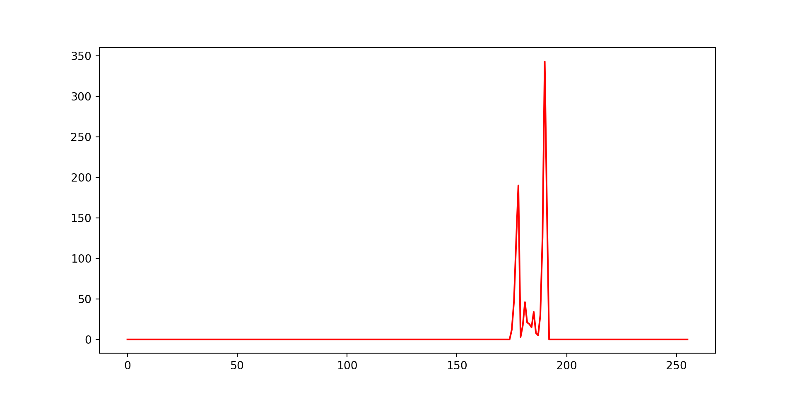{width=960}
:::
:::


## Code 


::: {.cell}

```{.python .cell-code}
def adjust_gamma(image, gamma=1.0):
   invGamma = 1.0 / gamma
   table = np.array([((i / 255.0) ** invGamma) * 255
      for i in np.arange(0, 256)]).astype("uint8")

   return cv2.LUT(image, table)

elderly = cv2.imread("../../recursos/imagenes/Presentaciones/PSIM/elderly.jpg")
elderly_gray = cv2.cvtColor(elderly, cv2.COLOR_BGR2GRAY)
plt.imshow(elderly_gray, cmap="gray", vmin=0, vmax=255)
plt.show()
elderly_hist = cv2.calcHist(elderly_gray, [0], None, [256], [0,256])
plt.plot(elderly_hist, color="red")
plt.show()
elderly_gray_light = adjust_gamma(image=elderly_gray, gamma=2)
plt.imshow(elderly_gray_light, cmap="gray", vmin=0, vmax=255)
plt.show()
elderly_hist_light = cv2.calcHist(elderly_gray_light, [0], None, [256], [0,256])
plt.plot(elderly_hist_light, color="red")
plt.show()
elderly_gray_dark = adjust_gamma(image=elderly_gray, gamma=0.3)
plt.imshow(elderly_gray_dark, cmap="gray", vmin=0, vmax=255)
plt.show()
elderly_hist_dark = cv2.calcHist(elderly_gray_dark, [0], None, [256], [0,256])
plt.plot(elderly_hist_dark, color="red")
plt.show()
elderly_gray_lowcontrast=np.uint8(0.1*elderly_gray)+172
plt.imshow(elderly_gray_lowcontrast, cmap="gray", vmin=0, vmax=255)
plt.show()
elderly_hist_lowcontrast = cv2.calcHist(elderly_gray_lowcontrast, [0], None, [256], [0,256])
plt.plot(elderly_hist_lowcontrast, color="red")
plt.show()
```
:::


:::

## Histogram Equalization

::: {.callout-note title="Algorithm"}

1. Calculate Histogram: Calculate the histogram of the original image, showing the frequency distribution of each intensity level.
2. Calculate Cumulative Distribution Function (CDF): Calculate the cumulative distribution function (CDF) of the histogram. The CDF represents the cumulative sum of frequencies for each intensity level.
3. Equalization: For each pixel in the original image, calculate the new intensity value using the formula:
$$New_value = (CDF(old value) * (L-1))$$
where L is the number of intensity levels (e.g., 256 for an 8-bit image).
4. Assign New Values: Assign the new intensity values calculated in step 3 to the equalized image.

:::


## Histogram Equalization


::: {.panel-tabset} 

## Images


::: {.cell layout-ncol="2"}
::: {.cell-output-display}
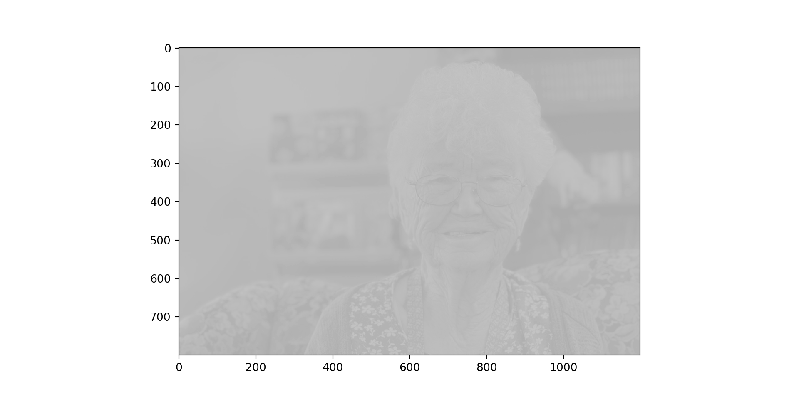{width=960}
:::

::: {.cell-output-display}
{width=960}
:::

::: {.cell-output-display}
{width=960}
:::

::: {.cell-output-display}
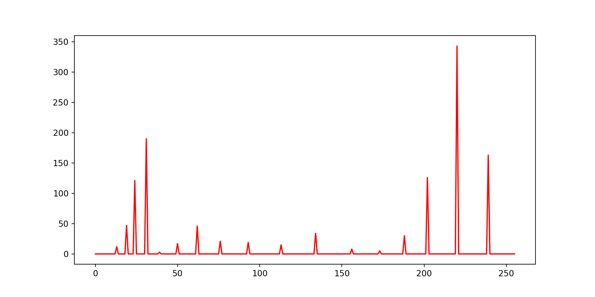{width=960}
:::
:::


## Code 


::: {.cell}

```{.python .cell-code}
plt.imshow(elderly_gray_lowcontrast, cmap="gray", vmin=0, vmax=255)
plt.show()

plt.plot(elderly_hist_lowcontrast, color="red")
plt.show()

elderly_hist_equ = cv2.equalizeHist(elderly_gray_lowcontrast)
plt.imshow(elderly_hist_equ, cmap="gray", vmin=0, vmax=255)
plt.show()

elderly_hist_equ = cv2.calcHist(elderly_hist_equ, [0], None, [256], [0,256])
plt.plot(elderly_hist_equ, color="red")
plt.show()
```
:::


## Recommended Reading

[Histogram Equalization OPENCV tutorial](https://docs.opencv.org/4.x/d5/daf/tutorial_py_histogram_equalization.html)

:::

## Histogram Matching


:::{.panel-tabset}

## Explain

](../../recursos/imagenes/Presentaciones/PSIM/opencv_histogram_matching_cdf.png)

## Algorithm

**Step 1: Calculate Histogram**s
Compute the histograms of the source image (Hs) and target image (Ht) for intensity values (r).

**Step 2: Calculate CDF**s
Compute the cumulative distribution functions (CDFs) for the source image (CDFs) and target image (CDFt).

**Step 3: Establish Correspondenc**e
Find the corresponding intensity values between the source and target images using the inverse CDF of the target image.

**Step 4: Apply Transformatio**n
Apply the intensity transformation to the source image using the established correspondence.

**Step 5: Verify Similarity**
Calculate the mean absolute difference between the transformed source image and the target image to verify their similarity.

## Result


::: {.cell}
::: {.cell-output-display}
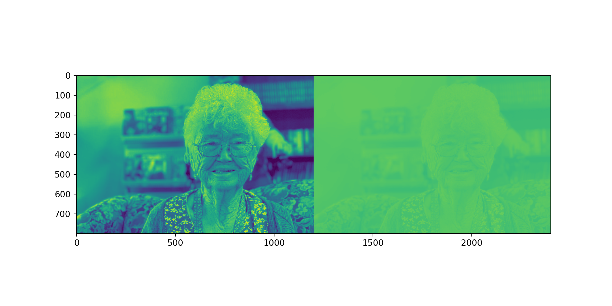{width=960}
:::

::: {.cell-output .cell-output-stdout}

```
(-0.5, 1199.5, 799.5, -0.5)
```


:::

::: {.cell-output-display}
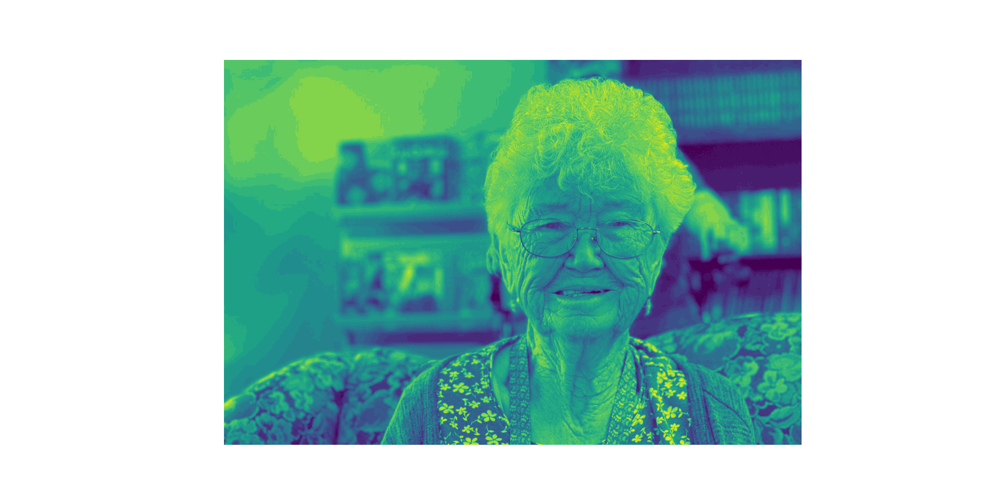{width=960}
:::

::: {.cell-output .cell-output-stdout}

```
Diferencia media absoluta: 4.501011458333333
```


:::
:::


## Code


::: {.cell}

```{.python .cell-code}
# Cargar la imagen fuente y objetivo
img_s = cv2.imread('imagen_fuente.jpg')
img_t = cv2.imread('imagen_objetivo.jpg')

# Calcula los histogramas
hist_s = cv2.calcHist([img_s], [0], None, [256], [0, 256])
hist_t = cv2.calcHist([img_t], [0], None, [256], [0, 256])

# Calcula las CDF
cdf_s = np.cumsum(hist_s)
cdf_t = np.cumsum(hist_t)

# Establece la correspondencia
r_t = np.interp(cdf_s, cdf_t, np.arange(256))

# Aplica la transformación
img_t_match = cv2.LUT(img_s, r_t)

# Verifica la similitud
diff = np.mean(np.abs(img_t_match - img_t))

print(f'Diferencia media absoluta: {diff}')
```
:::


:::

