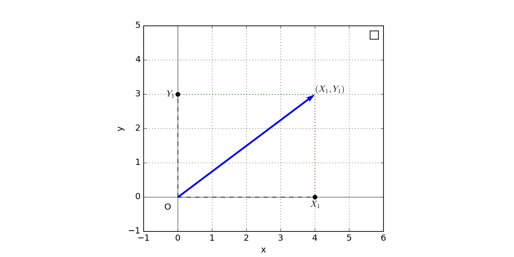
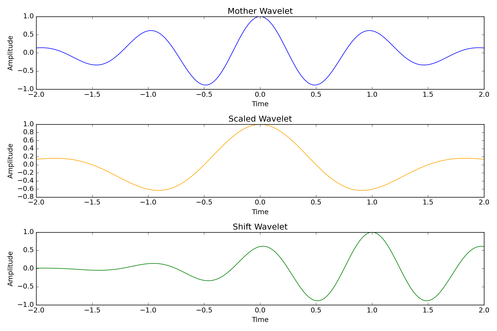
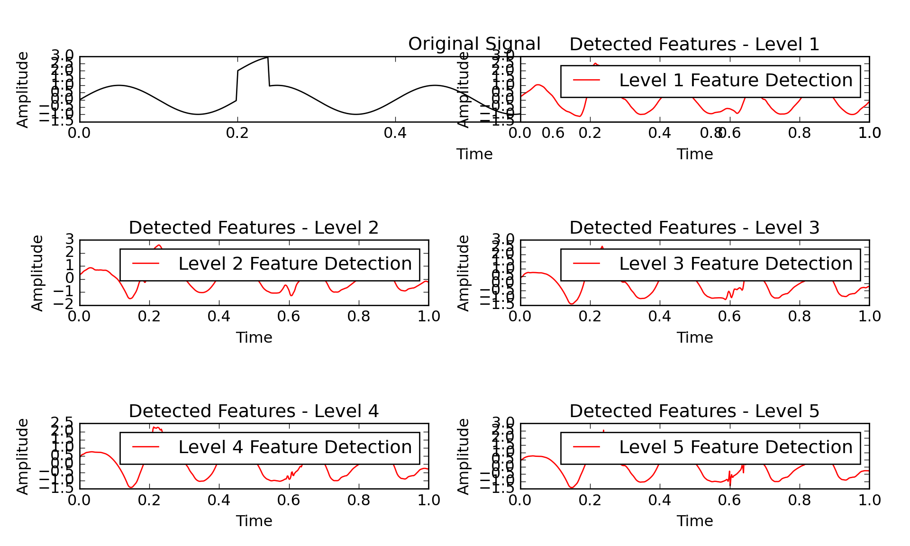

::: {.cell}

:::

::: {.cell}

:::


# Introduction to Wavelet Transform

## Introduction


::: {.cell}
::: {.cell-output .cell-output-stdout}

```
(-1.0, 6.0)
```


:::

::: {.cell-output .cell-output-stdout}

```
(-1.0, 5.0)
```


:::

::: {.cell-output-display}
{width=960}
:::
:::


## Introduction

- It's a mathematical tool for signal decomposition, like Fourier's Transform.
- Just as the Fourier transform decomposes a signal into a series of sine and cosine functions, the wavelet transform does so using a set of functions known as wavelets.
- Wavelets are functions generated by scaling and shifting a base function known as the mother wavelet.

## Introduction


::: {.cell}
::: {.cell-output-display}
{width=1152}
:::
:::


## Introduction

- **Morlet:** Popular for time-frequency analysis in EEG and ECG.
- **Mexican Hat (Ricker):** Often used in spike detection in neural signals.
- **Haar**: Useful in quick decomposition of signals and feature extraction.
- **Daubechies**: Frequently used in ECG signal denoising and compression.
- **Symlet:** Another option for signal processing and feature extraction in EEG.
- **Coiflet:** Useful for denoising and baseline correction in biomedical signals.

## Introduction

::: {.panel-tabset}

## Conditions

- Have a mean of zero (to capture details in the signal).
- Be square integrable (finite energy).
- Satisfy the admissibility condition on its Fourier transform.
- Be oscillatory to capture frequency information.
- (Optionally) have compact support for efficient computation and localization.

## I 
::: {.callout-important title="Zero Mean (Admissibility Condition)"}
The function must have an average value of zero. Mathematically, this is expressed as:

$$\int_{-\infty}^{\infty} \psi(t) \, dt = 0$$

This condition ensures that the wavelet can detect changes or "details" in the signal rather than its average or constant components.
:::

## II

::: {.callout-important title="Square Integrability"}
The function $\psi(t)$  must be square integrable, meaning it has finite energy:

$$\int_{-\infty}^{\infty} |\psi(t)|^2 \, dt < \infty$$

This requirement ensures that the wavelet’s energy is finite, making it possible to localize the function in both time and frequency domains. Functions that satisfy this belong to the $L^2(\rm I\!R)$ space, which is the space of all functions with finite energy.
:::

## III

::: {.callout-important title="Admissibility Constant"}
The wavelet's Fourier transform, $\hat{\psi}(\omega)$, should satisfy the admissibility condition:

$$C_\psi = \int_{-\infty}^{\infty} \frac{|\hat{\psi}(\omega)|^2}{|\omega|} \, d\omega < \infty$$

where $\hat{\psi}(\omega)$ is the Fourier transform of $\psi(t)$, and $\omega$ represents angular frequency. This condition implies that $\hat{\psi}(\omega)$ must approach zero as $\omega \rightarrow 0$ meaning the wavelet has no component at zero frequency (or DC component). This condition is crucial for ensuring that the wavelet transform is invertible.
:::

## IV

::: {.callout-important title="Oscillatory Nature"}
A mother wavelet should generally be oscillatory or "wavelike" (hence the term "wavelet"). This oscillatory behavior allows the wavelet to capture variations in the signal. For example, wavelets like the Morlet wavelet resemble decaying sinusoids. This oscillatory nature helps the wavelet capture both high-frequency and low-frequency components effectively.
:::

## V
::: {.callout-important title="Compact Support"}
Although not strictly necessary, compact support is often a desirable property. Compact support means that the function is non-zero only over a finite interval, making it well-localized in time. This allows for efficient computation and good localization in the time domain. For example, the Haar wavelet has compact support, while others, like the Morlet wavelet, do not have strict compact support but still decay rapidly.
:::


:::

## A wavelet transformation


::: {.cell layout-align="center"}
::: {.cell-output .cell-output-stdout}

```
(0.0, 1.0)
```


:::

::: {.cell-output-display}
{fig-align='center' width=960}
:::
:::


## A wavelet transformation


## Mathematical Expressions

The continuous wavelet transform of a signal $f(t)$ is defined as:

$$W_f(a, b) = \int_{-\infty}^{\infty} f(t) \, \psi^*\left(\frac{t - b}{a}\right) \, dt$$

where:

- $f(t)$ is the input signal,
- $\psi$ is the mother wavelet,
- $a$ is the scale parameter (controls the width of the wavelet),
- $b$ is the translation parameter (controls the position of the wavelet),
- $\psi^*$  denotes the complex conjugate of the mother wavelet.
## Mathematical Expressions

The continuous wavelet transform of a signal $f(t)$ is defined as:

$$W_f(a, b) = \int_{-\infty}^{\infty} f(t) \, \psi^*\left(\frac{t - b}{a}\right) \, dt$$

where:

- $f(t)$ is the input signal,
- $\psi$ is the mother wavelet,
- $a$ is the scale parameter (controls the width of the wavelet),
- $b$ is the translation parameter (controls the position of the wavelet),
- $\psi^*$  denotes the complex conjugate of the mother wavelet.

## Mathematical Expressions

The inverse continuous wavelet transform is given by:

$$f(t) = \frac{1}{C_{\psi}} \int_{0}^{\infty} \int_{-\infty}^{\infty} W_f(a, b) \, \psi\left(\frac{t - b}{a}\right) \frac{db \, da}{a^2}$$

where:

where $C_{\psi}$ is a normalization constant, defined as:

$$C_{\psi} = \int_{0}^{\infty} \frac{|\hat{\psi}(\omega)|^2}{\omega} \, d\omega$$

and $\hat{\psi}(\omega)$  is the Fourier transform of the wavelet $\psi(t)$.

## Mathematical Expressions

The discrete wavelet transform decomposes the signal at discrete levels of scale. For a signal $x[n]$, the wavelet decomposition is defined as:

$$c_{j, k} = \sum_{n} x[n] \, \psi_{j, k}(n)$$

where:

- $\psi_{j, k}(n)= \frac{1}{\sqrt{2}}\psi\left(\frac{n-2^{j}k}{2^{j}}\right)$ represents the scaled and translated versions of the mother wavelet $\psi$ 
- $j$ is the scale index, and $k$ is the translation index.

The decomposition typically consists of approximation and detail coefficients at each scale:

Approximation coefficients $a_j$: capture the low-frequency components.
Detail coefficients $d_j$ capture the high-frequency components.

## Mathematical Expressions

The inverse discrete wavelet transform reconstructs the original signal from its approximation and detail coefficients:
$$x[n] = \sum_{j} \sum_{k} c_{j, k} \, \psi_{j, k}(n)$$

This reconstruction process involves upsampling and filtering of the approximation and detail coefficients at each scale.

## Using CWT

- **Purpose:** The CWT is used when you need a highly detailed, continuous analysis of a signal over all possible scales and positions.
- **Output:** CWT gives you a "heatmap" of wavelet coefficients, showing which frequencies (or scales) are present in the signal at each point in time. This allows for a continuous representation.
- **Applications:** CWT is useful for analyzing signals where you want to see the evolution of frequencies over time, such as:
  - Detecting subtle changes in frequencies over time (like brainwave analysis in EEG).
  - Signals with non-repeating, transient features (like spikes in biomedical signals, e.g., ECG).
- **Trade-Off:** CWT is more computationally expensive because it analyzes all scales and translations continuously. It gives lots of data but is slower and requires more memory.

::: {.callout-important title="Use CWT when:"}
- You need a detailed, continuous representation.
- You want to detect subtle or fast-changing features across time.
- You’re okay with higher computational costs to get very fine-grained analysis.
:::

## Using DWT

- **Purpose:** The DWT is used when you want a compact, efficient representation of a signal, usually for compression or feature extraction. It analyzes only specific scales (powers of two), not continuously.
- **Output:** DWT gives you a set of coefficients at each level (or scale), capturing information at that specific scale. It’s efficient and uses fewer data points.
- **Applications:** DWT is ideal when you want to reduce the size of data or focus on a smaller set of frequencies, such as:
  - Image and audio compression (like JPEG 2000 or MP3 formats).
  - Feature extraction for machine learning (e.g., identifying specific patterns).
  - De-noising signals by discarding certain scales that contain noise.
- **Trade-Off:** DWT is computationally cheaper but less detailed than CWT. It doesn’t give a continuous heatmap but rather a discrete set of scales.

::: {.callout-important title="Use DWT when:"}
- You need a compact and efficient representation.
- You’re focused on data compression, de-noising, or feature extraction.
- You want faster computations with less data storage requirements.
:::