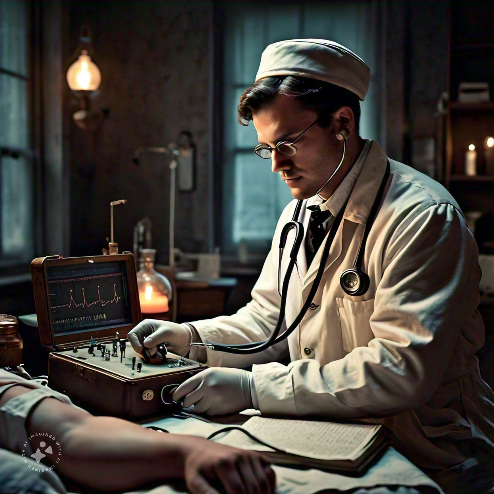
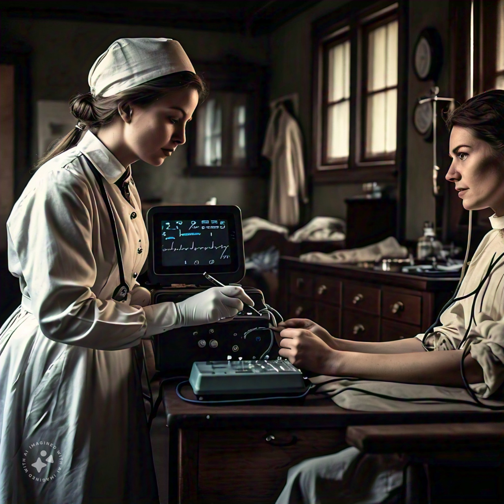
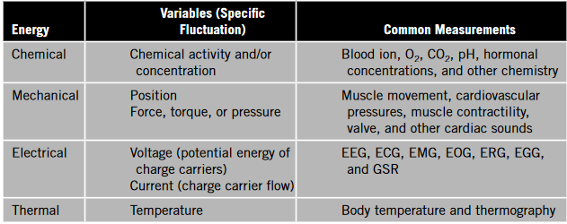
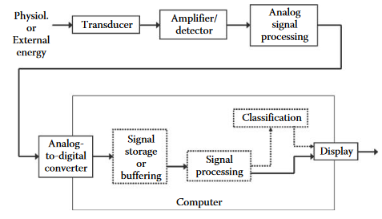

::: {.cell}

:::

::: {.cell}

:::

# Sistemas y Señales Biomedicos - SYSB

## Introduction

:::: {.columns}

::: {.column width="45%"}

::: {.callout-note title="Biosignals"}
* Bio - That came from a biological being
* Signal - A signal is a function that conveys information about a physical phenomenon.
* Biosignals - The search for information from living systems to know its health state
:::

:::

::: {.column width="45%"}

:::
::::

## Introduction

:::: {.columns}

::: {.column width="45%"}

:::

::: {.column width="45%"}

::: {.callout-note title="Biosignals"}
The codification of biosignals into variations:
* Electrical
* Mechanical
* Chemical
* Thermal

:::

:::
::::

## Introduction

## Introduction

## Time line

### Biomedical Signals:
* 1791: Luigi Galvani discovers electrical signals in living tissues (frog legs)

* 1830s: Carlo Matteucci studies electrical signals in the heart

* 1887: Willem Einthoven invents the first electrocardiograph (ECG)

* 1900s: James Mackenzie develops the first clinical ECG machine

## Time line

### Biomedical Signals:

* 1920s: Electroencephalography (EEG) is developed by Hans Berger

* 1930s: Electromyography (EMG) is developed by John Humphrey and others

* 1940s: Development of the first commercial ECG machines

* 1950s: Signal processing techniques are applied to biomedical signals

## Time line

### Biomedical Signals:

* 1960s: Digital signal processing and computer analysis of biomedical signals emerge

* 1970s: Biomedical signal processing becomes a recognized field

* 1980s: Development of Holter monitoring (24-hour ECG)

* 1990s: Advances in signal processing and machine learning applied to biomedical signals

## Time line

### Biomedical Signals:

* 2000s: Development of wearable devices and mobile health (mHealth) technologies

* 2010s: Emergence of big data analytics and cloud computing in biomedical signal processing

* 2020s: Integration of artificial intelligence (AI) and machine learning (ML) in biomedical signal processing

## Time line

### Biomedical Images:

* 1895: Wilhelm Roentgen discovers X-rays, leading to medical imaging

* 1900s: X-ray technology improves with development of modern X-ray tubes

* 1913: Albert Salomon develops mammography

* 1920s: Ultrasound technology is developed by Karl Dussik and others

## Time line

### Biomedical Images:

* 1930s: Nuclear medicine emerges with development of radioactive tracers

* 1950s: Computed Tomography (CT) scans are developed by Godfrey Hounsfield and Allan McLeod Cormack

* 1960s: Development of medical ultrasound imaging

* 1970s: Magnetic Resonance Imaging (MRI) is developed by Richard Ernst and others

## Time line

### Biomedical Images:

* 1980s: Digital image processing and analysis techniques are applied to biomedical images

* 1990s: Advances in MRI and CT scan technology, including 3D imaging

* 2000s: Development of functional MRI (fMRI), diffusion tensor imaging (DTI), and other advanced MRI techniques

* 2010s: Emergence of artificial intelligence (AI) and machine learning in medical imaging

## Time line

### Additional Milestones:

* 1950s: Development of medical electronics and instrumentation
* 1960s: First medical imaging computers are developed
* 1970s: Development of digital image processing and analysis software
* 1980s: Emergence of medical imaging informatics and PACS (Picture Archiving and Communication Systems)
* 1990s: Development of telemedicine and teleradiology
* 2000s: Emergence of electronic health records (EHRs) and health information exchanges (HIEs)
* 2010s: Development of personalized medicine and precision health initiatives
<!-- Key Figures:
Luigi Galvani
Willem Einthoven
Hans Berger
John Humphrey
Godfrey Hounsfield
Allan McLeod Cormack
Richard Ernst
Karl Dussik
Albert Salomon
Wilhelm Roentgen
James Mackenzie
Carlo Matteucci
Key Events:
1896: First X-ray image taken by Wilhelm Roentgen
1924: First ECG recording taken by Willem Einthoven
1957: First commercial ECG machine released
1971: First CT scan taken by Godfrey Hounsfield and Allan McLeod Cormack
1984: First MRI scan taken by Richard Ernst and others -->

