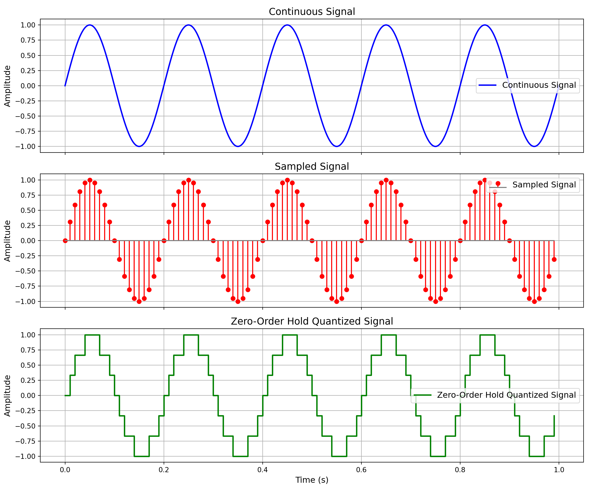
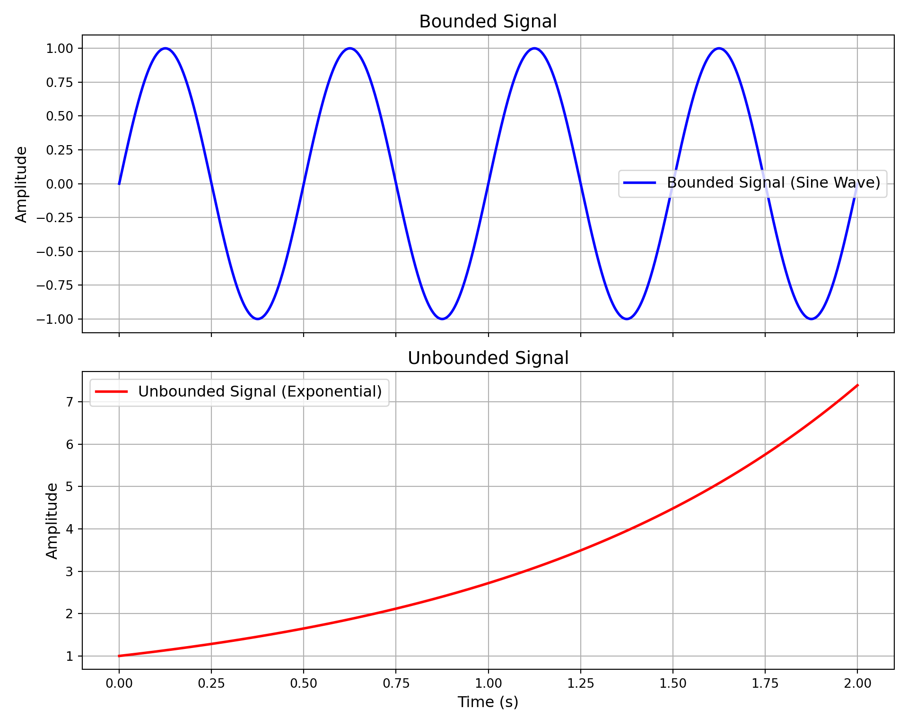
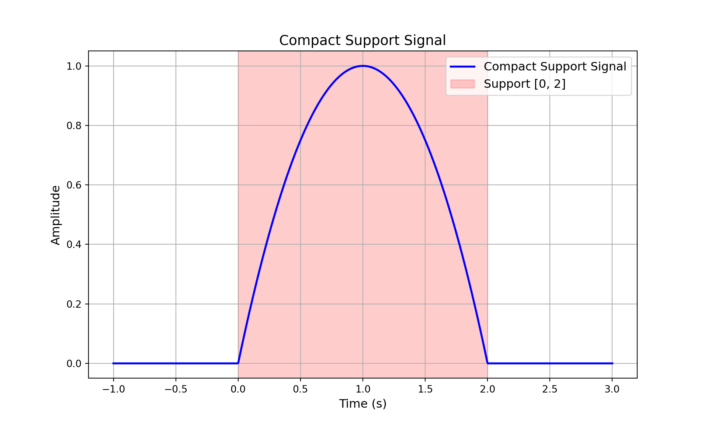
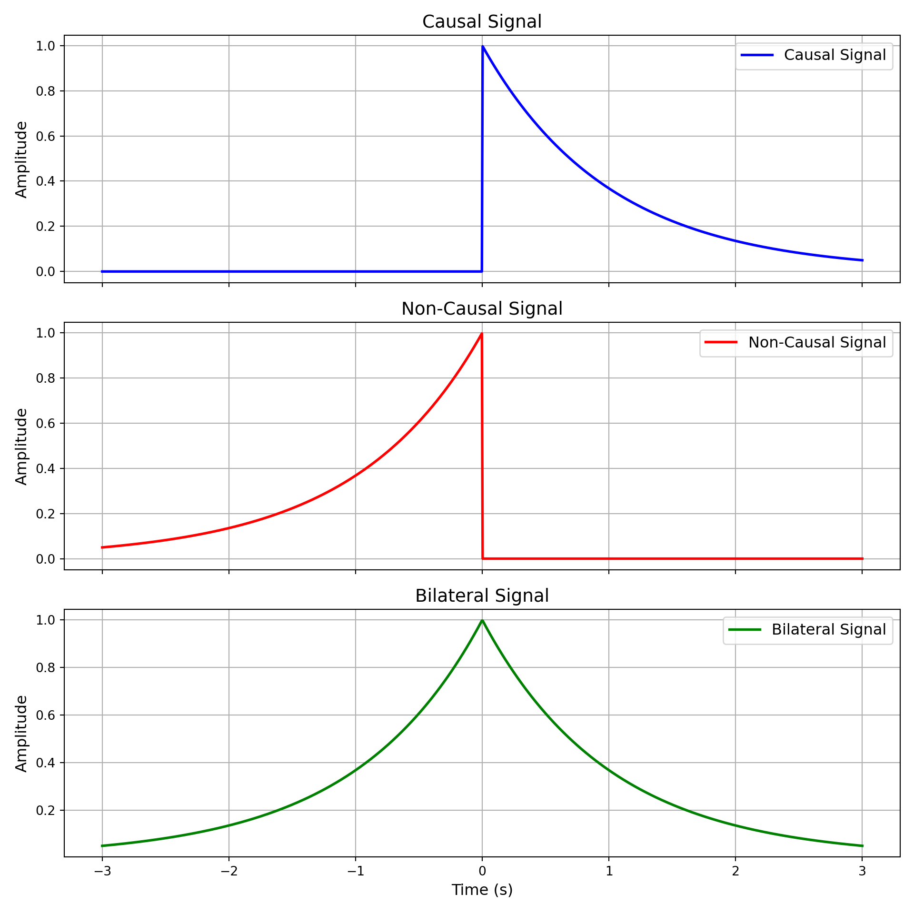
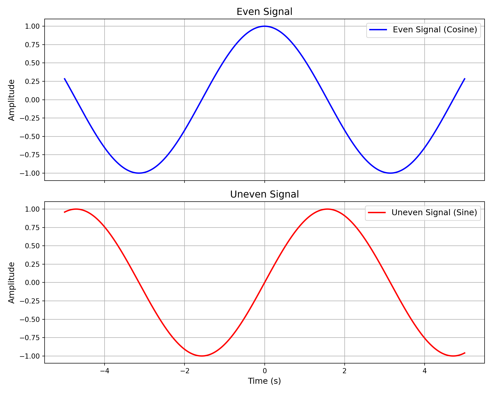
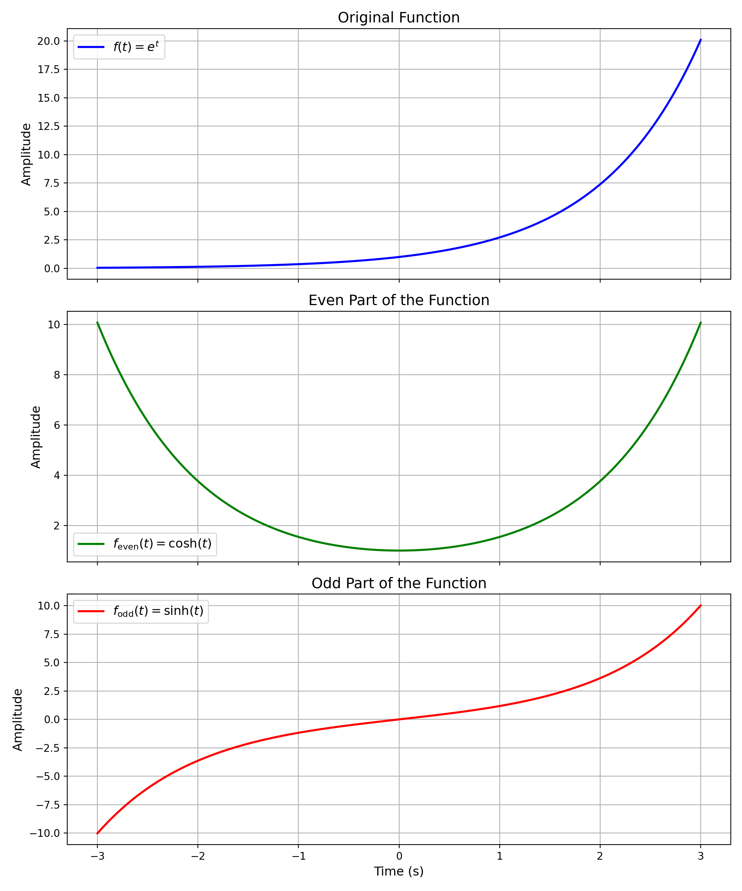
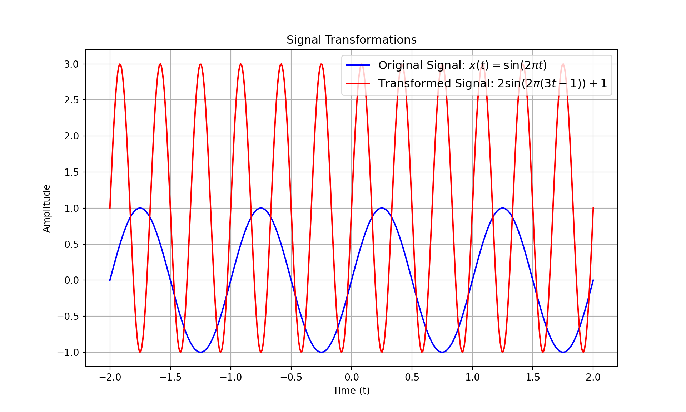

::: {.cell}

:::

::: {.cell}

:::


# Sistemas y Señales Biomedicos - SYSB

## Signal Classification

:::: {.columns}

::: {.column width="45%"}


::: {.cell layout-align="center"}
::: {.cell-output-display}


```{=html}
<div class="DiagrammeR html-widget html-fill-item" id="htmlwidget-709866a12c1d7daae894" style="width:960px;height:480px;"></div>
<script type="application/json" data-for="htmlwidget-709866a12c1d7daae894">{"x":{"diagram":"\ngraph TD\n  A[Signal Classification]\n  B[Time]\n  C[Amplitude]\n  D[Continous]\n  E[Discrete]\n  F[Continous]\n  G[Discrete]\n  A --> B\n  A --> C\n  B --> D\n  B --> E\n  C --> F\n  C --> G\n"},"evals":[],"jsHooks":[]}</script>
```


:::
:::


:::

::: {.column width="45%"}


::: {.cell}
::: {.cell-output-display}
{width=1152}
:::
:::


:::
::::

## Signal Classification -- Bounded


::: {.cell layout-align="center"}
::: {.cell-output-display}
{fig-align='center' width=960}
:::
:::


## Signal Classification -- Compact Support


::: {.cell layout-align="center"}
::: {.cell-output-display}
{fig-align='center' width=960}
:::
:::


## Signal Classification -- Causal


::: {.cell layout-align="center"}
::: {.cell-output-display}
{fig-align='center' width=960}
:::
:::


## Signal Classification - Even/Odd

:::: {.columns}

::: {.column width="45%"}

::: {.callout-note title="Even"}

$$f\left(t\right) = f\left(-t\right)$$
$$f\left[t\right] = f\left[-t\right]$$

:::

::: {.callout-note title="Odd"}

$$f\left(t\right) = -f\left(-t\right)$$
$$f\left[t\right] = -f\left[-t\right]$$

:::

:::

::: {.column width="45%"}


::: {.cell layout-align="center"}
::: {.cell-output-display}
{fig-align='center' width=960}
:::
:::


:::
::::

## Signal Classification

::: {.callout-note title="Decomposition"}
All signal can be decomposed in two signals: one even, one odd.

$$x(t) = x_{even}(t) + x_{odd}(t)$$
:::

Where:

$$x_{even}(t) = \frac{x(t)+x(-t)}{2} $$
$$x_{odd}(t) = \frac{x(t)-x(-t)}{2} $$

## Example

::: {.callout-tip title="Example"}
Decompose the signal $x(t)=e^{t}$ into its even and odd parts
:::

## Example

$$x_{\text{even}}(t) = \frac{x(t) + x(-t)}{2}$$

$$x_{\text{odd}}(t) = \frac{x(t) - x(-t)}{2}$$

$$x(-t) = e^{-t}$$

$$x_{\text{even}}(t) = \frac{e^t + e^{-t}}{2} = \cosh(t)$$

$$x_{\text{odd}}(t) = \frac{e^t - e^{-t}}{2} = \sinh(t)$$

$$x(t) = x_{\text{even}}(t) + x_{\text{odd}}(t)$$

$$e^t = \cosh(t) + \sinh(t)$$
​


## Example


::: {.cell layout-align="center"}
::: {.cell-output-display}
{fig-align='center' width=960}
:::
:::


## Signal Transformations

### Types of Transformations
Signals can undergo two types of transformations:

1. **Independent variable transformations** (affect the time or input axis).
2. **Dependent variable transformations** (affect the amplitude or output axis).

---

## Independent Variable Transformations

### Time Scaling
- Definition: Changes the time scale of the signal.
\[
x(at), \quad a > 1 \text{ (compression)}, \quad 0 < a < 1 \text{ (expansion)}
\]
- Example: If \( x(t) = \sin(t) \), then \( x(2t) \) is compressed.

### Time Shifting
- Definition: Shifts the signal in time.
\[
x(t - t_0) \quad \text{(right shift if \( t_0 > 0 \), left shift if \( t_0 < 0 \))}
\]
- Example: \( x(t - 2) \) shifts the signal 2 units to the right.

### Time Reversal
- Definition: Flips the signal across the vertical axis.
\[
x(-t)
\]
- Example: If \( x(t) = t^2 \), then \( x(-t) = t^2 \) (even signal).

---

## Dependent Variable Transformations

### Amplitude Scaling
- Definition: Multiplies the amplitude by a scalar factor.
\[
a \cdot x(t), \quad a > 1 \text{ (amplification)}, \quad 0 < a < 1 \text{ (attenuation)}
\]
- Example: If \( x(t) = \sin(t) \), then \( 2x(t) \) doubles the amplitude.

### Amplitude Shifting
- Definition: Adds a constant value to the amplitude.
\[
x(t) + c
\]
- Example: If \( x(t) = \cos(t) \), then \( x(t) + 2 \) shifts the signal up by 2 units.

---

## Combined Transformations

### Example
Consider:
\[
y(t) = 2 \cdot x(3t - 1) + 1
\]
1. **Time compression**: \( x(3t) \) compresses the signal.
2. **Time shift**: \( x(3t - 1) \) shifts it to the right by 1 unit.
3. **Amplitude scaling**: \( 2 \cdot x(3t - 1) \) amplifies the signal.
4. **Amplitude shift**: \( +1 \) shifts it upward.

---

## Visualization Example in Python


::: {.cell}
::: {.cell-output-display}
{width=960}
:::
:::