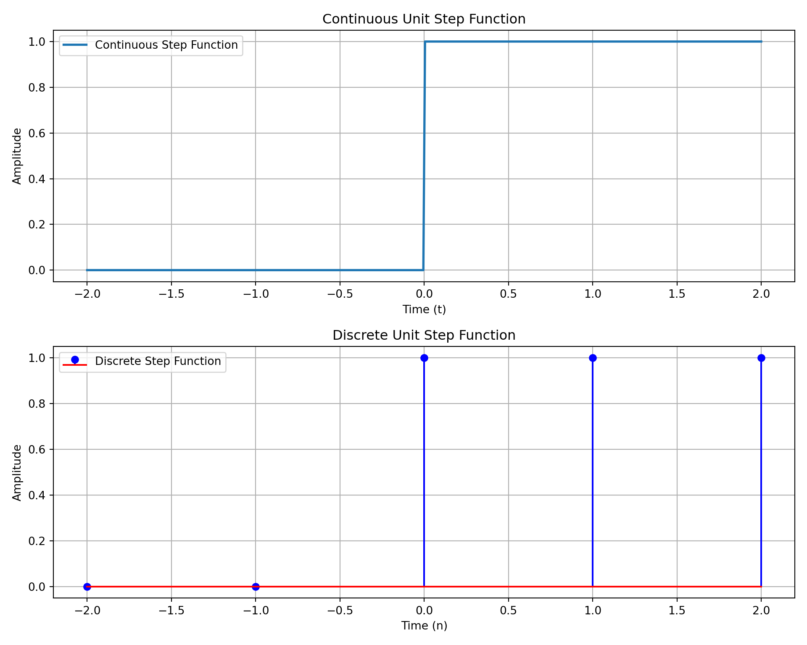
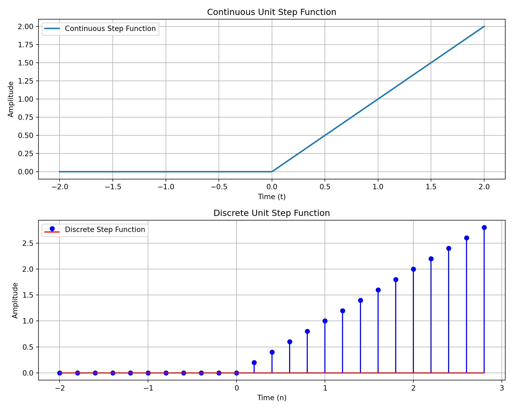
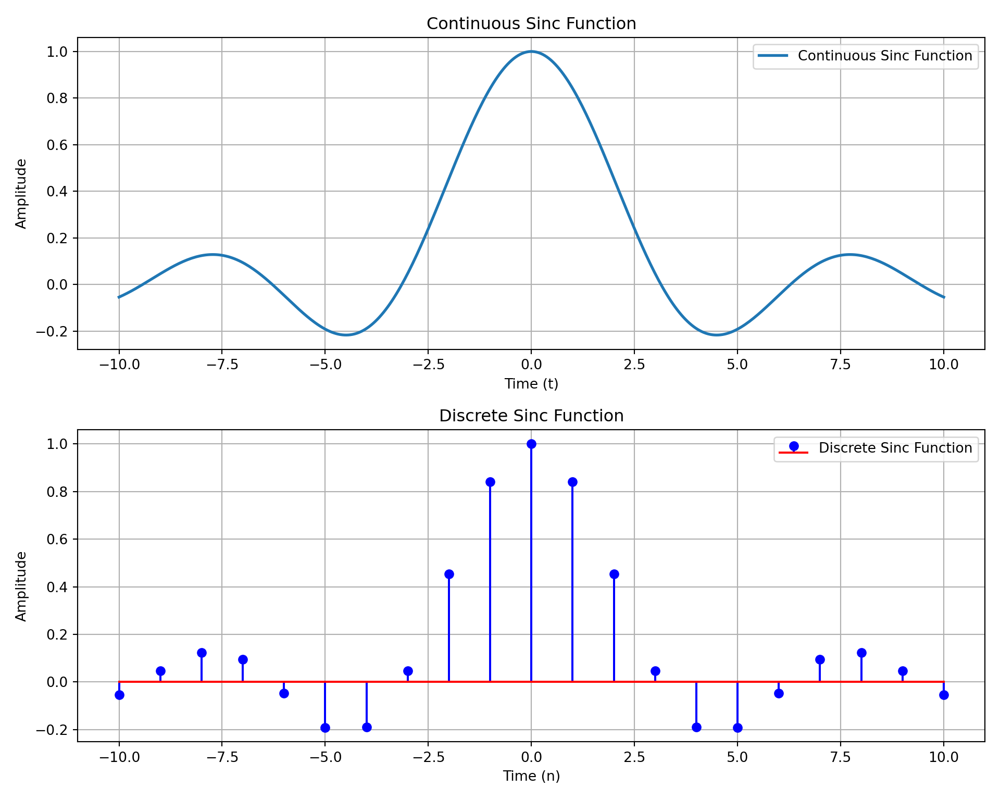
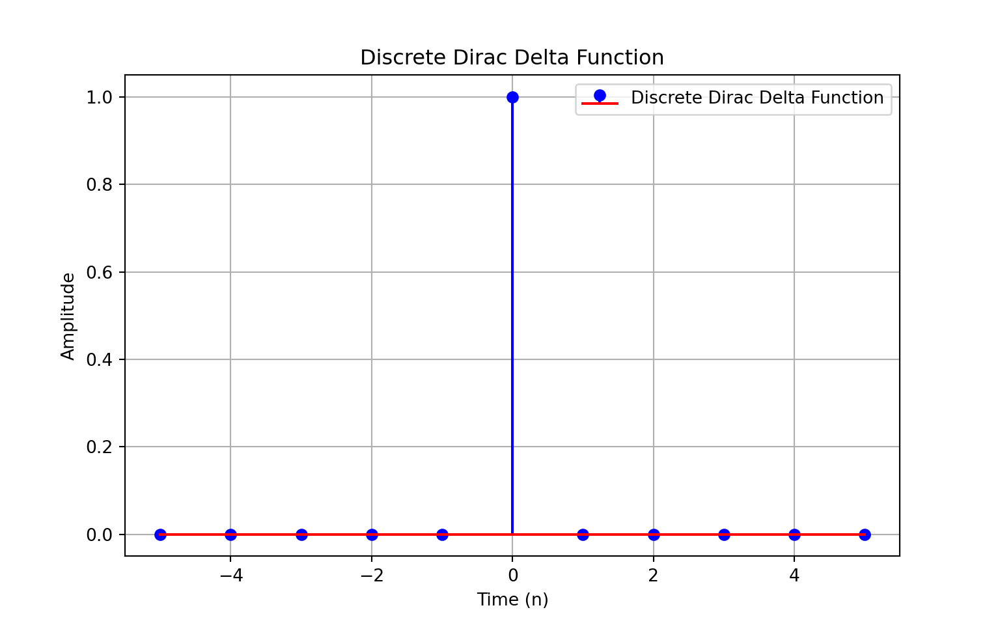
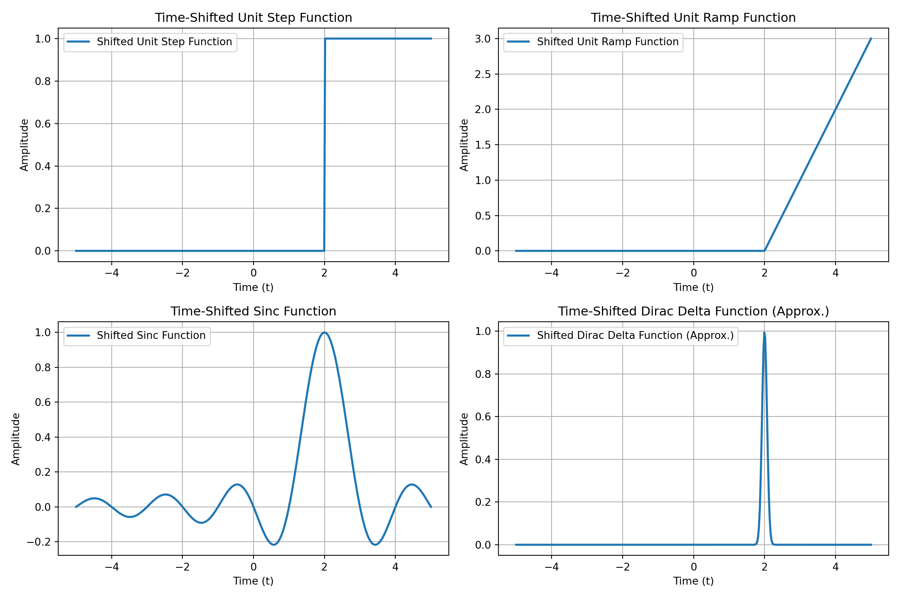
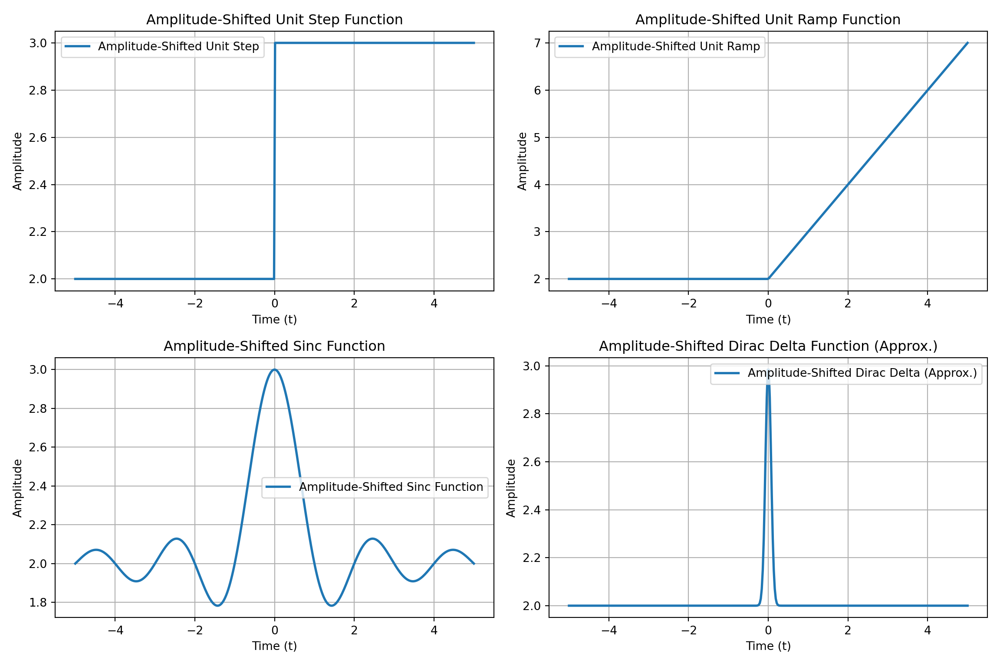
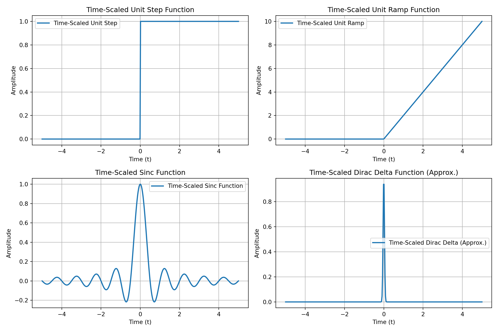
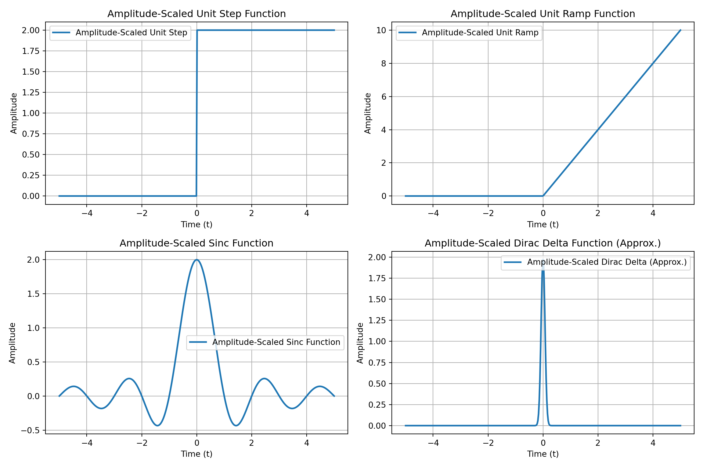
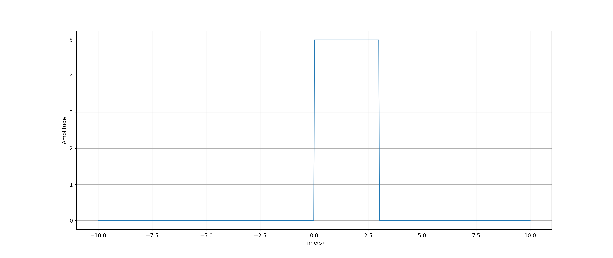
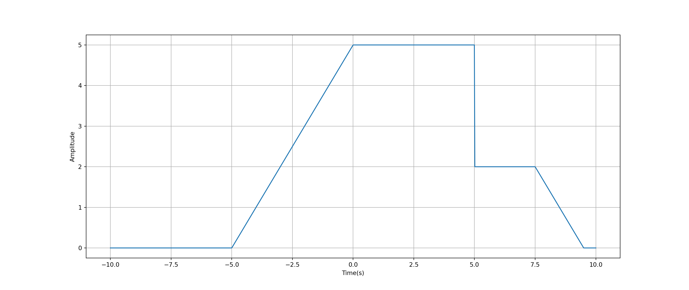

::: {.cell}

:::

::: {.cell}

:::


# Sistemas y Señales Biomedicos - SYSB

## Unit Step

:::: {.columns}

::: {.column width="45%"}

::: {.callout-note title="Continous"}
$$u(t) =
\begin{cases} 
0, & t < 0 \\
1, & t \geq 0
\end{cases}$$
:::

::: {.callout-note title="Discrete"}
$$u[n] =
\begin{cases} 
0, & n < 0 \\
1, & n \geq 0
\end{cases}$$
:::

:::

::: {.column width="45%"}


::: {.cell}
::: {.cell-output-display}
{width=960}
:::
:::


:::
::::

## Unit Ramp

:::: {.columns}

::: {.column width="45%"}

::: {.callout-note title="Continous"}
$$u(t) =
\begin{cases} 
0, & t < 0 \\
t, & t \geq 0
\end{cases}$$
:::

::: {.callout-note title="Discrete"}
$$u[n] =
\begin{cases} 
0, & n < 0 \\
n, & n \geq 0
\end{cases}$$
:::

:::

::: {.column width="45%"}


::: {.cell}
::: {.cell-output-display}
{width=960}
:::
:::


:::
::::

## Sync Function

:::: {.columns}

::: {.column width="45%"}

::: {.callout-note title="Continous"}
$$\text{sinc}(t) =
\begin{cases} 
\frac{\sin(\pi t)}{\pi t}, & t \neq 0 \\
1, & t = 0
\end{cases}$$
:::

::: {.callout-note title="Discrete"}
$$\text{sinc}[n] =
\begin{cases} 
\frac{\sin(\pi n)}{\pi n}, & n \neq 0 \\
1, & n = 0
\end{cases}$$
:::

:::

::: {.column width="45%"}


::: {.cell}
::: {.cell-output-display}
{width=960}
:::
:::


:::
::::

## Dirac's Delta

:::: {.columns}

::: {.column width="45%"}

::: {.callout-note title="Continous"}
$$\delta(t) =
\begin{cases} 
+\infty, & t = 0 \\
0, & t \neq 0
\end{cases}$$

$\int_{-\infty}^{\infty} \delta(t) dt = 1$
:::

::: {.callout-note title="Discrete"}
$$\delta[n] =
\begin{cases} 
1, & n = 0 \\
0, & n \neq 0
\end{cases}$$
:::

:::

::: {.column width="45%"}


::: {.cell}
::: {.cell-output-display}
{width=768}
:::
:::


:::
::::

## Basic Transformations on Singular signals -- Translation in time


::: {.cell layout-align="center"}
::: {.cell-output-display}
{fig-align='center' width=1152}
:::
:::


## Basic Transformations on Singular signals -- Translation in amplitude


::: {.cell layout-align="center"}
::: {.cell-output-display}
{fig-align='center' width=1152}
:::
:::


## Basic Transformations on Singular signals -- scailing in time


::: {.cell layout-align="center"}
::: {.cell-output-display}
{fig-align='center' width=1152}
:::
:::


## Basic Transformations on Singular signals -- scailing in amplitude


::: {.cell layout-align="center"}
::: {.cell-output-display}
{fig-align='center' width=1152}
:::
:::


## Example

::: {.panel-tabset}

## Question

How can i create the following signal using only singular signals


::: {.cell}
::: {.cell-output-display}
{width=1536}
:::
:::


## Solution

$$x(t) = 5u(t) - 5(t-3)$$

## Code for the graph 1/2


::: {.cell}

```{.python .cell-code}
t = np.linspace(-10,10,1000)
x = np.zeros(t.shape)

x[t>=0]=5
x[t>=3]=0

plt.figure(figsize=(16,6.75))
plt.plot(t,x)
plt.grid()
plt.xlabel("Time(s)")
plt.ylabel("Amplitude")
```
:::


## Code for the graph 2/2


::: {.cell}

```{.python .cell-code}
t = np.linspace(-10,10,1000)
x = np.zeros(t.shape)

x=5*np.heaviside(t,1)-5*np.heaviside(t-3,1)

plt.figure(figsize=(16,6.75))
plt.plot(t,x)
plt.grid()
plt.xlabel("Time(s)")
plt.ylabel("Amplitude")
```

::: {.cell-output-display}
{width=1536}
:::
:::


:::

## Exercisae Singular Signals

::: {.panel-tabset}

## Question

How can i create the following signal using only singular signals


::: {.cell}
::: {.cell-output-display}
{width=1536}
:::
:::


:::