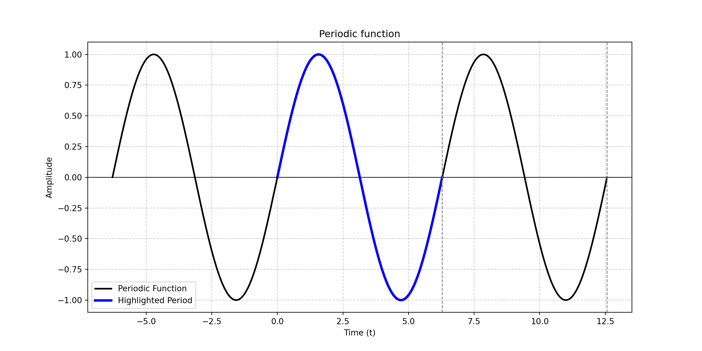
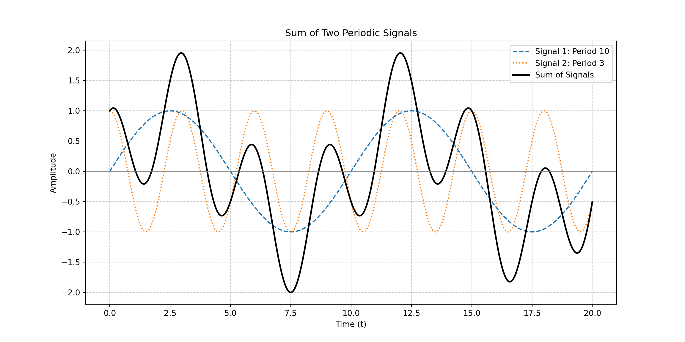

::: {.cell}

:::

::: {.cell}

:::

# Sistemas y Señales Biomedicos - SYSB

## Periodic functions

::: {.cell layout-align="center"}
::: {.cell-output-display}
{fig-align='center' width=1152}
:::
:::

::: {.callout-note title="Definition"}
Any signal that meets any of this conditions
$$x\left(t\right)=x\left(t + kT\right)$$
$$x\left[n\right]=x\left[t + kT\right]$$
:::

Where $k\in\mathbb{z}$ and $T\in\mathbb{R}$

## Sum of Two Periodic Signals

If $\( x_1(t) \)$ and $\( x_2(t) \)$ are periodic with periods $\( T_1 \)$ and $\( T_2 \)$:

$$
x_1(t + T_1) = x_1(t), \quad x_2(t + T_2) = x_2(t)
$$

The sum of both signals is:

$$
x(t) = x_1(t) + x_2(t)
$$

---

## Condition for the Periodicity of the Sum

For $\( x(t) \)$ to be periodic, there must exist a **common period** $\( T \)$ such that:

$$
T = k_1 T_1 = k_2 T_2
$$

where \( k_1, k_2 \) are positive integers.

---

## Common Period and Least Common Multiple

The smallest common period is the **least common multiple (lcm)** of $\( T_1 \)$ and $\( T_2 \)$:

$$
T = \operatorname{lcm}(T_1, T_2)
$$

If the ratio of the periods is a rational number:

$$
\frac{T_1}{T_2} \in \mathbb{Q}
$$

Then, the sum $\( x_1(t) + x_2(t) \)$ will be periodic.

If the ratio is irrational, the resulting signal **will not be periodic**.

## Example

::: {.cell layout-align="center"}
::: {.cell-output-display}
{fig-align='center' width=1152}
:::
:::