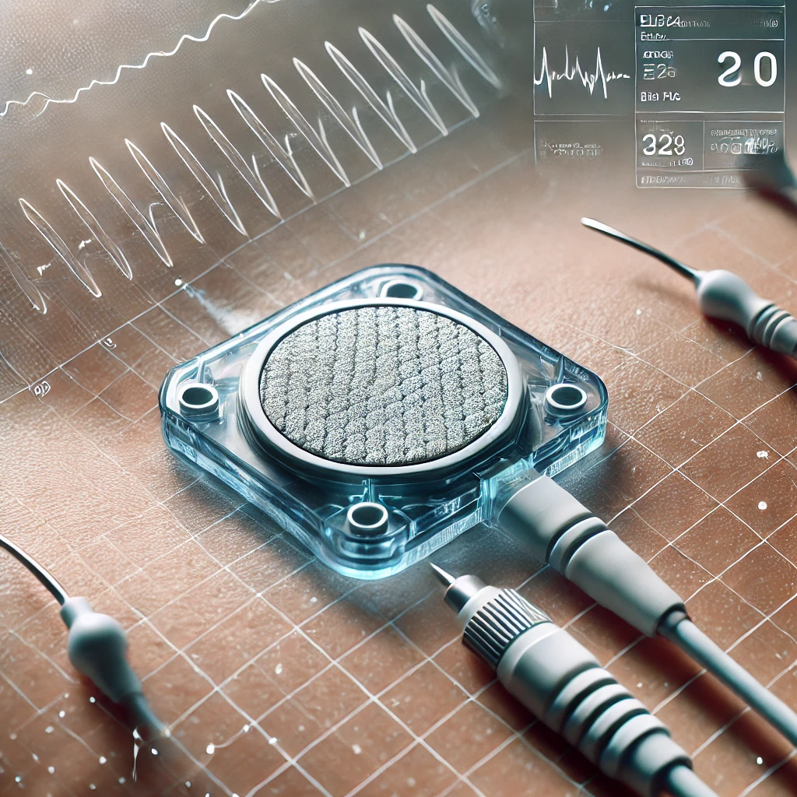

::: {.cell}

:::

::: {.cell}

:::


# Sistemas y Señales Biomedicos - SYSB

## Introduction to data adquisition{.smaller}

:::: {.columns}

::: {.column width="45%"}

- There are two main roles in data: capture the information and encode the data in a form tha machine can process.
- Data adquisition has three stages: 
  - Transduction
  - Signal conditioning
  - Analog-to-digital conversion

:::

::: {.column width="45%"}


:::
::::

## Introduction to data adquisition - Transduction{.smaller}

:::: {.columns}

::: {.column width="45%"}

- Transduction is the conversion from one form of energy to another.
- The only energy suitable for computer processing is the electrical
- Therefore signals need to be converted to analog voltages whose waveforms are ideally the same as those of the original signals.
- Exist two components a captured signal: one component carries the information (signal), the other one is a probabilistic distorsion of the information(noise)

:::

::: {.column width="45%"}



:::
::::

## Introduction to data adquisition - Noise{.smaller}

:::: {.columns}

::: {.column width="45%"}

::: {.callout-important title="Definition"}

Noise refers to any unwanted or random variations in a signal that interfere with the desired information. It is an unpredictable disturbance that can distort or obscure the actual data, making it harder to interpret or analyze.

:::

### Types of noise

- Thermal Noise (Random Noise)
- Electromagnetic Interference (EMI)
- Motion Artifacts
- Physiological Noise
- Quantization Noise

:::

::: {.column width="45%"}


:::
::::

## Introduction to data adquisition - Noise{.smaller}

:::: {.columns}

::: {.column width="45%"}

### Modelling the noise

- Additive White Gaussian Noise (AWGN): Modeled as a random process with a normal distribution.
- Band-limited Noise: Affects only specific frequency ranges and can be removed with filters.
- Additive Noise: Adds directly to the original signal.
- Multiplicative Noise: Multiplies the original signal.

:::

::: {.column width="45%"}


:::
::::

## Introduction to data adquisition - Noise{.smaller}

::: {.panel-tabset}

## Graphs


::: {.cell layout-align="center"}
::: {.cell-output-display}
{fig-align='center' width=960}
:::
:::


## Code


::: {.cell}

```{.python .cell-code}
import numpy as np
import matplotlib.pyplot as plt

# Parámetros de la señal
duration = 2  # Duración en segundos
fs = 1000  # Frecuencia de muestreo en Hz
t = np.linspace(0, duration, duration * fs, endpoint=False)  # Vector de tiempo

# Señal senoidal de 10 Hz
freq = 10
sine_wave = np.sin(2 * np.pi * freq * t)

# Señal de ruido aleatorio con distribución normal
noise_normal = np.random.normal(0, 1, len(t))

# Señal con ruido aleatorio de 2 a 5 Hz
low_freq_noise = np.sin(2 * np.pi * np.random.uniform(2, 5) * t)
signal_with_low_freq_noise = sine_wave + low_freq_noise

# Señal con ruido aleatorio uniforme sumado
uniform_noise = np.random.uniform(-0.5, 0.5, len(t))
signal_with_uniform_noise = sine_wave + uniform_noise

# Señal con ruido aleatorio uniforme multiplicado
multiplicative_noise = np.random.uniform(0.5, 1.5, len(t))
signal_with_mult_noise = sine_wave * multiplicative_noise

# Graficamos las señales
fig, axes = plt.subplots(5, 1, figsize=(10, 10), sharex=True)

axes[0].plot(t, sine_wave, label="Sine wave (10 Hz)")
axes[0].set_title("Sine Wave (10 Hz)")
axes[0].legend()

axes[1].plot(
    t, noise_normal, label="Random Noise (Normal Distribution)", color="orange"
)
axes[1].set_title("Random Noise (Normal Distribution)")
axes[1].legend()

axes[2].plot(
    t, signal_with_low_freq_noise, label="Sine + Low Freq Noise (2-5 Hz)", color="green"
)
axes[2].set_title("Sine + Low Freq Noise (2-5 Hz)")
axes[2].legend()

axes[3].plot(t, signal_with_uniform_noise, label="Sine + Uniform Noise", color="red")
axes[3].set_title("Sine + Uniform Noise")
axes[3].legend()

axes[4].plot(t, signal_with_mult_noise, label="Sine * Uniform Noise", color="purple")
axes[4].set_title("Sine * Uniform Noise")
axes[4].legend()

plt.xlabel("Time [s]")
plt.tight_layout()
plt.show()
```
:::


:::

## Introduction to data adquisition - ASP{.smaller}

:::: {.columns}

::: {.column width="45%"}

::: {.callout-tip title="Definition"}
Analog signal processing (ASP) refers to the manipulation of continuous-time signals after they have been acquired from a transducer but before digital conversion. This type of processing is performed using electronic circuits that modify the signal in the analog domain to enhance its quality, extract useful information, or prepare it for further processing.
:::

::: {.callout-tip title="Common tasks"}
- **Amplification:** Increases the signal strength to match the required voltage levels. *Example*: ECG signals are weak (~1 mV) and need to be amplified before analysis.
- **Filtering:** Removes unwanted frequency components such as noise or interference.
- **Modulation/Demodulation:** Used for communication systems where signals are modulated onto a higher-frequency carrier wave. *Example*: Biomedical telemetry systems use amplitude modulation (AM) or frequency modulation (FM) to transmit patient data wirelessly.
- **Differentiation & Integration:** Differentiation: Highlights rapid changes in the signal. *Example*: Used in QRS detection for ECG signal analysis. Integration: Smooths out signals and accumulates values over time.
*Example*: Used in electromyography (EMG) processing to estimate muscle activation.
- **Signal Conditioning:** Includes impedance matching, offset correction, and dynamic range adjustments. *Example*: Removing DC offsets in biosignals before digitization.
:::

:::

::: {.column width="45%"}


:::
::::

## Introduction to data adquisition - analog-to-digital convertion{.smaller}

::: {.callout-important title="Definition"}
An analog-to-digital converter (ADC) is a device that converts a continuous-time signal, obtained through a transducer, into a digital signal that can be processed by a computer. This process consists of two fundamental operations, which occur simultaneously in practical implementations: sampling and quantization.
:::

### Operations
-  **Sampling** involves converting the continuous-time analog signal into a discrete-time signal, where the amplitude remains unrestricted.
-  **Quantization** then maps this continuous-amplitude signal to a finite set of discrete values, making it fully digital.
  

## Analog to digital convertion

To explain the analog-to-digital conversion process, we will assume that the input signal is a cosine wave with frequency $F$, angular frequency $\Omega$ and amplitude $a$.

$$x\left(t\right) = a \cos\left(\Omega t + \phi\right) = a \cos\left(2\pi F t + \phi\right)$$

Obtaining

$$x\left[n\right] = a \cos\left(\omega n + \phi\right) = a \cos\left(2\pi f n + \phi\right)$$

## Analog to digital convertion


::: {.cell layout-align="center"}
::: {.cell-output-display}
{fig-align='center' width=960}
:::
:::


## Analog to digital convertion

::: {.callout-note title="What?"}

Mathematically, the sampling process is:

$$x[n] = x(nT_s), \quad -\infty < n < \infty$$

:::

Replacing in previous equations, we have the expression:

$$x[n] = x(nT_s) = a \cos\left( 2\pi F n T_s + \phi \right) = a \cos\left( 2\pi n \frac{F}{F_s} + \phi \right)
$$

Where:

$$\omega = \Omega T_s, \quad f = \frac{F}{F_s}$$

## Sample and quantization of an ECG signal

::: {.panel-tabset}

## Task

- Generate a synthetic ECG-like signal.
- Sample it at different rates.
- Apply quantization with different bit depths.

## Graph


::: {.cell layout-align="center"}
::: {.cell-output-display}
{fig-align='center' width=1152}
:::
:::


## Code


::: {.cell}

```{.python .cell-code}
import numpy as np
import matplotlib.pyplot as plt
from scipy.signal import chirp

# Generate a synthetic ECG-like signal (chirp function as approximation)
fs_original = 10000  # High sampling rate (Hz) - "continuous" signal
t = np.linspace(0, 1, fs_original, endpoint=False)  # 1-second signal
signal = np.sin(2 * np.pi * 1.7 * (t**2))  # Simulated chirp (similar to ECG waves)

# Downsample (Sampling Process)
fs_sampled = 200  # Sampling frequency in Hz (e.g., ECG sampled at 200 Hz)
t_sampled = np.arange(0, 1, 1/fs_sampled)
signal_sampled = np.sin(2 * np.pi * 1.7 * (t_sampled**2))

# Quantization (8-bit and 4-bit)
def quantize(signal, bits):
    levels = 2**bits
    min_val, max_val = signal.min(), signal.max()
    step = (max_val - min_val) / levels
    quantized_signal = np.round((signal - min_val) / step) * step + min_val
    return quantized_signal

signal_quantized_8bit = quantize(signal_sampled, 8)
signal_quantized_4bit = quantize(signal_sampled, 4)

# Plot Results
plt.figure(figsize=(12, 6))

# Original vs Sampled Signal
plt.subplot(2, 1, 1)
plt.plot(t, signal, 'k', alpha=0.3, label='Original Signal (High Resolution)')
plt.plot(t_sampled, signal_sampled, 'ro-', label=f'Sampled Signal ({fs_sampled} Hz)')
plt.xlabel("Time (s)")
plt.ylabel("Amplitude")
plt.legend()
plt.title("Sampling Process")

# Quantized Signals
plt.subplot(2, 1, 2)
plt.plot(t_sampled, signal_sampled, 'bo-', alpha=0.5, label="Original Sampled")
plt.plot(t_sampled, signal_quantized_8bit, 'go-', label="Quantized 8-bit")
plt.plot(t_sampled, signal_quantized_4bit, 'ro-', label="Quantized 4-bit")
plt.xlabel("Time (s)")
plt.ylabel("Amplitude")
plt.legend()
plt.title("Quantization Effect")

plt.tight_layout()
plt.show()
```
:::


:::