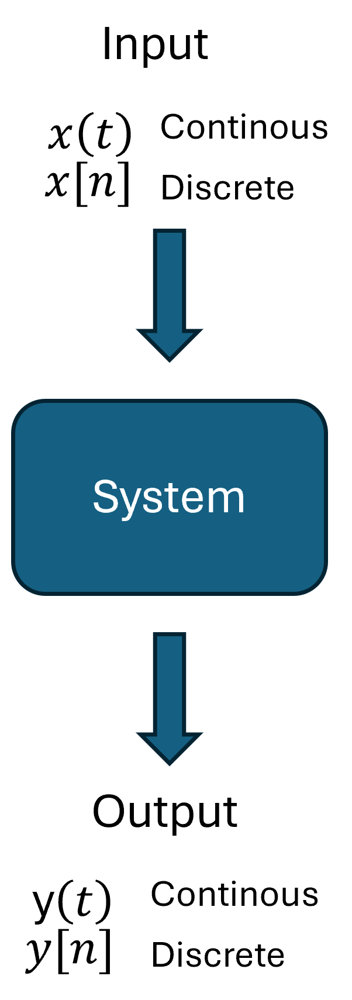
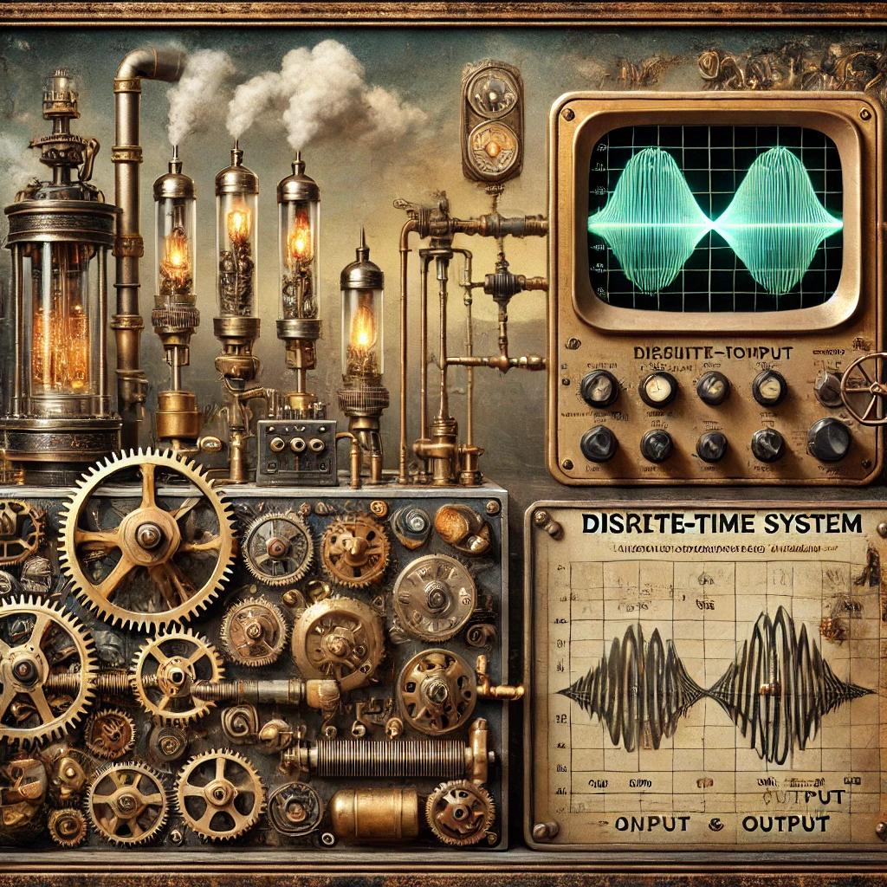
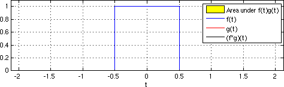

```{r}
#| echo: false
#| eval: true
#| output: false
#| label: Loading R-Libraries
# install.packages(c("DiagrammeR", "reticulate", "kableExtra", "tidyverse", "knitr", "cowplot", "ggfx"))
library("DiagrammeR")
library("reticulate")
library("kableExtra")
library("tidyverse")
library("knitr")
library("cowplot")
library("ggfx")
knitr::opts_chunk$set(echo = FALSE)

def.chunk.hook <- knitr::knit_hooks$get("chunk")
knitr::knit_hooks$set(chunk = function(x, options) {
    x <- def.chunk.hook(x, options)
    ifelse(options$size != "normalsize", paste0("\n \\", options$size, "\n\n", x, "\n\n \\normalsize"), x)
})
```

```{python}
# | echo: false
# | eval: true
# | output: false
# | label: Loading Python-Libraries

import numpy as np
import matplotlib.pyplot as plt

plt.rcParams.update(
    {
        "text.usetex": True,  # usar LaTeX real
        "font.family": "Fira Code",  # familia general
        "mathtext.fontset": "custom",  # fuente personalizada para fórmulas
        "mathtext.rm": "Fira Code",  # texto “roman”
        "mathtext.it": "Fira Code:italic",  # texto itálico
        "mathtext.bf": "Fira Code:bold",  # texto en negrita
        "text.latex.preamble": r"\usepackage{amsmath}",
    }
)

path_ecg = "../../data"

```

# Sistemas y Señales Biomedicos - SYSB

## Digital Filter -- Introduction

:::: {.columns}

::: {.column width="45%"}

- It is a mathematical algorithm or system that processes digital signals.
- They enhance, suppress, or modify specific frequency components.
- These filters are essential for removing noise, extracting relevant information, and improving signal quality.

:::

::: {.column width="45%"}


:::

::::

## What is a *system*?

A **system** is a rule that maps an input signal to an output signal. In continuous time and discrete time we depict and denote:
$$
x(t)\ \longrightarrow\ y(t),\qquad x[n]\ \longrightarrow\ y[n].
$$
These are the standard input–output representations used throughout the text.

## Input–output operator notation

We often write the system as an operator \( \mathcal{T}\{\cdot\} \):
$$
y(t)=\mathcal{T}\{x(t)\},\qquad y[n]=\mathcal{T}\{x[n]\}.
$$
Block diagrams are used to represent systems and **interconnections** (series/cascade and parallel).

## Overview: what is an input–output relation?

A **system** specifies how an input signal produces an output signal:
$$
x(t)\ \longrightarrow\ y(t),\qquad x[n]\ \longrightarrow\ y[n].
$$
We study **types of relations** used in analysis and design:
- Memoryless (static) mappings
- Differential/difference-equation descriptions
- Convolution (LTI)
- Transform-domain forms (frequency, Laplace, \(z\))
- State–space (first-order vector form)
- Time-varying vs time-invariant, linear vs nonlinear

## Memoryless (static) relations

A **memoryless** or **static** system relates input and output at the same instant:
$$
y(t)=F\!\big(x(t)\big),\qquad y[n]=F\!\big(x[n]\big).
$$
Examples: \(y=|x|\), \(y=x^2\), saturation and clipping nonlinearities.
These are common as pointwise nonlinear stages preceding or following LTI blocks.

## Linear constant-coefficient differential equations (CT)

Many continuous-time LTI systems are described by an LCCDE:
$$
\sum_{k=0}^{N} a_k\,\frac{d^{\,k} y(t)}{dt^{\,k}}
\;=\;
\sum_{m=0}^{M} b_m\,\frac{d^{\,m} x(t)}{dt^{\,m}},
\qquad a_0\neq 0.
$$
Coefficients \(a_k,b_m\) are constants for **time invariance**.
This form covers standard electrical/mechanical systems and filters.

## Linear constant-coefficient difference equations (DT)

Discrete-time LTI systems admit an LCCD equation:
$$
\sum_{k=0}^{N} a_k\,y[n-k]\;=\;\sum_{m=0}^{M} b_m\,x[n-m],\qquad a_0\neq 0.
$$
This representation includes IIR/FIR digital filters and many algorithmic recursions.

## Convolution relations (LTI)

For **LTI** systems the input–output relation is convolution with the impulse response:
$$
y(t)=\int_{-\infty}^{\infty} h(\tau)\,x(t-\tau)\,d\tau,\qquad
y[n]=\sum_{k=-\infty}^{\infty} h[k]\;x[n-k].
$$
Here \(h(t)\) or \(h[n]\) is the output to a unit impulse.
Causality for LTI corresponds to \(h(t)=0\) for \(t<0\) (or \(h[n]=0\) for \(n<0\)).

## Frequency-domain input–output (Fourier)

When Fourier transforms exist, convolution becomes multiplication:
$$
Y(\omega)=H(\omega)\,X(\omega),\qquad
Y\!\big(e^{j\omega}\big)=H\!\big(e^{j\omega}\big)\,X\!\big(e^{j\omega}\big).
$$
\(H\) is the **frequency response** (CTFT/DTFT). Magnitude \(|H|\) scales, phase \(\angle H\) shifts/warps timing.

## Laplace and \(z\)-transform forms

With Laplace and \(z\)-transforms (for appropriate regions of convergence):
$$
Y(s)=H(s)\,X(s),\qquad Y(z)=H(z)\,X(z),
$$
and for LCCDE/LCCD systems
$$
H(s)=\frac{b_0+b_1 s+\cdots+b_M s^M}{a_0+a_1 s+\cdots+a_N s^N},\qquad
H(z)=\frac{b_0+b_1 z^{-1}+\cdots+b_M z^{-M}}{a_0+a_1 z^{-1}+\cdots+a_N z^{-N}}.
$$
These rational forms support pole–zero analysis and stability checks.

## State–space (first-order vector) description

An equivalent input–output formulation uses **state variables**:
$$
\dot{\mathbf{s}}(t)=\mathbf{A}\,\mathbf{s}(t)+\mathbf{b}\,x(t),\qquad
y(t)=\mathbf{c}^\top\mathbf{s}(t)+d\,x(t).
$$
Discrete time:
$$
\mathbf{s}[n+1]=\mathbf{A}\,\mathbf{s}[n]+\mathbf{b}\,x[n],\qquad
y[n]=\mathbf{c}^\top\mathbf{s}[n]+d\,x[n].
$$
This first-order form is algebraically equivalent to LCCDE/LCCD for LTI systems.

## Time-varying vs time-invariant relations

- **Time-invariant (TI)**: coefficients and operators do not change with time/index; shifts commute with the system.
- **Time-varying (TV)**: coefficients depend on \(t\) or \(n\):
$$
\sum_{k=0}^{N} a_k(t)\,\frac{d^{\,k} y(t)}{dt^{\,k}}
=\sum_{m=0}^{M} b_m(t)\,\frac{d^{\,m} x(t)}{dt^{\,m}}.
$$
TV models arise in modulated systems and adaptive filtering.

## Linear vs nonlinear relations

- **Linear**: superposition holds — additivity and homogeneity.
- **Nonlinear**: violates superposition; examples include squares, rectifiers, saturators, quantizers.
Nonlinear stages are often analyzed locally or via small-signal linearization around an operating point.

## Stochastic input–output (LTI summary)

For wide-sense stationary (WSS) inputs to an LTI system:
$$
\mu_y=\mu_x\,H(0)\ \text{(when defined)},\qquad
S_{yy}(\omega)=\big|H(\omega)\big|^2\,S_{xx}(\omega).
$$
This links input and output statistics through \(H\), supporting noise and SNR analysis.

## Interconnections (examples)

- **Series (cascade):** output of System 1 feeds System 2.
- **Parallel:** both systems process the same input; outputs are summed.
These patterns are foundational for building complex systems from simpler ones.

## Property: Memoryless vs. with memory

- **Memoryless:** the output at an instant depends only on the input at that same instant.
- **With memory:** the output depends on past/future values (e.g., accumulators, averagers).
Example: the **summer/accumulator** (running sum) and its inverse (first difference) illustrate systems with memory:
$$
y[n]=\sum_{k=-\infty}^{n} x[k],\qquad \text{inverse: } y[n]=x[n]-x[n-1].
$$
Both are causal (see next slide)

## Property: Causality (general and LTI)

**Causal:** output depends only on present/past input values.
For **LTI** systems, causality is characterized by the impulse response:
$$
\text{Discrete time: } h[n]=0\ \text{for } n<0;\qquad
\text{Continuous time: } h(t)=0\ \text{for } t<0.
$$
Under these conditions, the convolution reduces to depend only on past/present input.

## Property: Stability (BIBO)

**Bounded-Input Bounded-Output (BIBO) stability:** bounded input implies bounded output.
For **LTI** systems:
$$
\sum_{k=-\infty}^{\infty} |h[k]| < \infty \quad \Longleftrightarrow \quad \text{discrete-time LTI is stable},
$$
$$
\int_{-\infty}^{\infty} |h(t)|\,dt < \infty \quad \Longleftrightarrow \quad \text{continuous-time LTI is stable}.
$$
These are necessary and sufficient conditions.

## Property: Linearity (superposition)

A system is **linear** if it satisfies **additivity** and **homogeneity**: for any signals \(x_1,x_2\) and scalar \(c\),
$$
\mathcal{T}\{x_1+x_2\}=\mathcal{T}\{x_1\}+\mathcal{T}\{x_2\},\qquad \mathcal{T}\{c\,x\}=c\,\mathcal{T}\{x\}.
$$
(These two conditions together are equivalent to linearity.)

## Property: Time invariance (definition)

A system is **time-invariant** if a shift in the input produces an identical shift in the output:
$$
\mathcal{T}\{x(t-t_0)\}=y(t-t_0),\ \text{whenever}\ y(t)=\mathcal{T}\{x(t)\}.
$$
Analogously in discrete time with shifts by integer indices. (Definition used throughout the text in system properties and LTI analysis.)

## Property: Invertibility

A system is **invertible** if distinct inputs produce distinct outputs; equivalently, there exists an **inverse system** that recovers the input from the output.
Example pair (discrete time): the accumulator and the first-difference operator are inverses:
$$
y[n]=\sum_{k=-\infty}^{n} x[k] \quad \Longleftrightarrow \quad x[n]=y[n]-y[n-1].
$$


## Additional note: Interconnections and LTI analysis

For LTI systems, interconnections admit simple algebraic descriptions via transforms: e.g., in the Laplace domain, series and parallel lead to product and sum of system functions, respectively:
$$
H_{\text{series}}(s)=H_1(s)H_2(s),\qquad H_{\text{parallel}}(s)=H_1(s)+H_2(s).
$$


## Digital Filter -- Introduction

::: {.callout-important title=""}

The digital filter separates the noise and the information of a discrete signal.

:::

{fig-align="center"}

## Digital Filter -- Introduction

:::: {.columns}

::: {.column width="45%"}

{width=35% fig-align="center"}
:::

::: {.column width="45%"}



:::
::::

## Digital Filter -- Introduction{.smaller}

:::: {.columns}

::: {.column width="45%"}

{width=35% fig-align="center"}
:::

::: {.column width="45%"}

Suppose a **discrete** time system
$$ y[n] = \sum_{k=1}^{K} a_k y[n - k] + \sum_{m=0}^{M} b_m x[n - m]$$

- K y M are the order of the filter.

- We must know the initial condition.

:::
::::

## Examples of digital filters{.smaller}

:::: {.columns}

::: {.column width="45%"}

::: {.callout-note title="Gain"}

$$y[n] = G x[n]$$

:::

::: {.callout-note title="Delay of $n_0$ samples"}

$$y[n] = x[n - n_0]$$

:::

::: {.callout-note title="Two points moving average"}

$$y[n] = \frac{1}{2} (x[n] + x[n - 1])$$

:::

::: {.callout-note title="Euler approximation of the derivative"}

$$y[n] = \frac{x[n] - x[n - 1]}{T_s}$$

:::

:::

::: {.column width="45%"}

::: {.callout-note title="Averaging over N consecutive epochs of duration L"}

$$y[n] = \frac{1}{N} \sum_{k=0}^{N-1} x[n - kL]$$

:::

::: {.callout-note title="Trapezoidal integration formula"}

$$y[n] = y[n - 1] + \frac{T_s}{2} (x[n] + x[n - 1])$$

:::

::: {.callout-note title="Digital “leaky integrator” (First-order lowpass filter)"}

$$y[n] = a y[n - 1] + x[n], \quad 0 < a < 1$$

:::

::: {.callout-note title="Digital resonator (Second-order system)"}

$$y[n] = a_1 y[n - 1] + a_2 y[n - 2] + b x[n], \quad a_1^2 + 4a_2 < 0$$

:::

:::
::::

## The impulse response{.smaller}

:::: {.columns}

::: {.column width="45%"}

{width=35% fig-align="center"}
:::

::: {.column width="45%"}

- The impulse response, denoted as $ℎ[n]$, is the output of a digital filter when the input is a unit impulse function $\delta[n]$
- The impulse response fully describes the system. Given $h[n]$, we can determine the output for any input using convolution.
- Different types of filters (low-pass, high-pass, band-pass, etc.) have characteristic impulse responses.
```{python}
#| echo: false
#| eval: true
#| output: true
#| label: impulse response 01

# Define the impulse signal (unit impulse at n=0)
n = np.arange(-5, 10)  # Discrete time axis
x = np.zeros_like(n)
x[n == 0] = 1  # Unit impulse at n=0

# Define the two-point moving average filter impulse response
h = (1/2) * (x + np.roll(x, 1))  # Apply the filter

# Create subplots
fig, axes = plt.subplots(2, 1, figsize=(12, 4))

# Plot the input (Impulse Signal)
axes[0].stem(n, x, linefmt='g-', markerfmt='go', basefmt='r-', label="Input Impulse")
axes[0].set_xlabel("n (Time Index)")
axes[0].set_ylabel("Amplitude")
axes[0].set_title("Input: Unit Impulse")
axes[0].grid(True)
axes[0].legend()

# Plot the impulse response
axes[1].stem(n, h, linefmt='b-', markerfmt='bo', basefmt='r-', label="Impulse Response")
axes[1].set_xlabel("n (Time Index)")
axes[1].set_ylabel("Amplitude")
axes[1].set_title("Impulse Response of Two-Point Moving Average")
axes[1].grid(True)
axes[1].legend()

# Adjust layout and show the plots
plt.tight_layout()
plt.show()


```

:::
::::

## Conditions{.smaller}

For a system's response to be **fully described by its impulse response**, the system must satisfy the following key conditions.

::: {.callout-important title="Linearity"}
If the system responds to $x_1[n]$ with $y_1[n]$ and to $x_2[n]$ with $y_2[n]$, then:

$$y[n] = y_1[n] + y_2[n]$$
:::

::: {.callout-important title="Homogeneity"}
If the input is scaled by a constant $c$, the output is also scaled:

$$\text{If } x[n] \rightarrow y[n], \text{ then } cx[n] \rightarrow cy[n]$$
:::

::: {.callout-important title="Time Invariance"}
A system must be **time-invariant**, meaning a time shift in the input causes the same shift in the output:

$$\text{If } x[n] \rightarrow y[n], \text{ then } x[n - n_0] \rightarrow y[n - n_0]$$
:::

::: {.callout-important title="Causality"}
A **causal system** is one where the output at time $n$ depends only on present and past inputs:

$$h[n] = 0 \quad \forall n < 0$$
:::

::: {.callout-important title="Stability"}
If the impulse response does not satisfy this condition, the system may produce unbounded outputs.

$$\sum_{n=-\infty}^{\infty} |h[n]| < \infty$$
:::
::: {.callout-important title="Convolution Representation"}
If all condition met then
$$y[n] = x[n] * h[n] = \sum_{m=-\infty}^{\infty} x[m] h[n - m]$$
:::

## Convolution



## Example: RC Low-Pass Filter Response

Consider a first-order RC circuit with impulse response $h(t) = \frac{1}{RC} e^{-t/RC} u(t)$. If the input is a rectangular pulse $x(t) = u(t) - u(t-T)$, the output $y(t)$ is:

$$y(t) = \int_{0}^{t} x(\tau) \frac{1}{RC} e^{-(t-\tau)/RC} d\tau$$

For $0 \le t \le T$:
$$y(t) = 1 - e^{-t/RC}$$

For $t > T$:
$$y(t) = (1 - e^{-T/RC}) e^{-(t-T)/RC}$$

---

## RC Filter: Impulse Response Derivation

The voltage across a capacitor in an RC circuit is governed by the first-order differential equation:
$$RC \frac{dy(t)}{dt} + y(t) = x(t)$$

Applying the Laplace Transform with zero initial conditions:
$$Y(s)(RCs + 1) = X(s) \implies H(s) = \frac{Y(s)}{X(s)} = \frac{1/RC}{s + 1/RC}$$

The impulse response $h(t)$ is the inverse Laplace Transform $\mathcal{L}^{-1}\{H(s)\}$:
$$h(t) = \frac{1}{RC} e^{-\frac{t}{RC}} u(t)$$

---

## Time instants

```{python}
# | echo: false
# | eval: true
# | output: false
# | warning: false
# | fig-align: center
# | label: time_instants

import numpy as np
import matplotlib.pyplot as plt

# Parámetros del sistema
RC = 1.0
alpha = 1 / RC
T = 2.0  # Duración del pulso
t_final = 5.0
tau = np.linspace(-1, t_final, 1000)


def x(t):
    return np.where((t >= 0) & (t <= T), 1.0, 0.0)


def h(t):
    return np.where(t >= 0, alpha * np.exp(-alpha * t), 0.0)


# Instantes de tiempo para Región 1 y Región 2
t1 = 1.0  # 0 < t1 < T
t2 = 3.5  # t2 > T

fig, (ax1, ax2) = plt.subplots(2, 1, figsize=(10, 8))

# --- REGIÓN 1: TRASLAPE PARCIAL (0 < t < T) ---
_ = ax1.fill_between(tau, x(tau), alpha=0.2, color="blue", label="$x(\\tau)$ (Pulso)")
_ = ax1.plot(tau, h(t1 - tau), "r", label=f"$h({t1}-\\tau)$ (Filtro)")
# Área de integración
tau_overlap1 = np.linspace(0, t1, 100)
_ = ax1.fill_between(
    tau_overlap1, h(t1 - tau_overlap1), color="red", alpha=0.4, label="Área: $\int_0^t$"
)
_ = ax1.set_title(f"Región 1: Traslape Parcial ($t={t1}$)", fontsize=12)
_ = ax1.set_ylim(-0.1, 1.2)
_ = ax1.legend(loc="upper right")
_ = ax1.grid(True, linestyle="--")

# --- REGIÓN 2: TRASLAPE TOTAL / DECAIMIENTO (t > T) ---
_ = ax2.fill_between(tau, x(tau), alpha=0.2, color="blue", label="$x(\\tau)$ (Pulso)")
_ = ax2.plot(tau, h(t2 - tau), "r", label=f"$h({t2}-\\tau)$ (Filtro)")
# Área de integración
tau_overlap2 = np.linspace(0, T, 100)
_ = ax2.fill_between(
    tau_overlap2, h(t2 - tau_overlap2), color="red", alpha=0.4, label="Área: $\int_0^T$"
)
_ = ax2.set_title(f"Región 2: Traslape Total y Decaimiento ($t={t2}$)", fontsize=12)
_ = ax2.set_ylim(-0.1, 1.2)
_ = ax2.legend(loc="upper right")
_ = ax2.grid(True, linestyle="--")

plt.tight_layout()
plt.show()
```

___

## Analytical Evaluation: Interval $0 \le t \le T$

For a rectangular pulse $x(t) = 1$ for $0 \le t \le T$, and $h(t) = \alpha e^{-\alpha t} u(t)$ where $\alpha = 1/RC$:

$$y(t) = \int_{0}^{t} (1) \cdot \alpha e^{-\alpha(t-\tau)} d\tau$$

Factoring out terms independent of $\tau$:
$$y(t) = \alpha e^{-\alpha t} \int_{0}^{t} e^{\alpha \tau} d\tau = \alpha e^{-\alpha t} \left[ \frac{1}{\alpha} e^{\alpha \tau} \right]_{0}^{t}$$

Evaluating the limits:
$$y(t) = e^{-\alpha t} (e^{\alpha t} - 1) = 1 - e^{-\alpha t}$$

---

## Analytical Evaluation: Interval $t > T$

When the input pulse ends ($t > T$), the integration limits are constrained by the pulse width $[0, T]$:

$$y(t) = \int_{0}^{T} (1) \cdot \alpha e^{-\alpha(t-\tau)} d\tau = \alpha e^{-\alpha t} \int_{0}^{T} e^{\alpha \tau} d\tau$$

Solving the integral:
$$y(t) = \alpha e^{-\alpha t} \left[ \frac{1}{\alpha} e^{\alpha \tau} \right]_{0}^{T} = e^{-\alpha t} (e^{\alpha T} - 1)$$

Rearranging to show the exponential decay from the value at $t=T$:
$$y(t) = (1 - e^{-\alpha T}) e^{-\alpha(t-T)}$$

---

## Python Implementation: Continuous-Time Emulation

Numerical approximation of the continuous convolution using high-density sampling.

```{python}
#| echo: true
import numpy as np
import matplotlib.pyplot as plt

# Parameters
RC = 0.5
alpha = 1/RC
T = 2.0
dt = 0.01
t = np.arange(0, 5, dt)

# Signals
x = np.where((t >= 0) & (t <= T), 1.0, 0.0)
h = alpha * np.exp(-alpha * t)

# Convolution (scaled by dt to approximate integral)
y = np.convolve(x, h)[:len(t)] * dt

print(f"Peak value at t=T: {y[int(T/dt)]: .4f}")
print(f"Theoretical peak: {1 - np.exp(-alpha*T): .4f}")
```

---

## Visualization: Continuous Convolution

The "Flip-Shift-Integrate" process:

```{tikz}
\begin{tikzpicture}[scale=0.8]
    \draw[->] (-3,0) -- (5,0) node[right] {$\tau$};
    \draw[->] (0,-0.2) -- (0,1.5) node[above] {$f(\tau), g(t-\tau)$};

    % Signal x(tau)
    \draw[blue, thick] (0,0) -- (0,1) -- (2,1) -- (2,0) node[below] {$T$};
    \node[blue] at (1,1.2) {$x(\tau)$};

    % Signal h(t-tau)
    \draw[red, thick] (-2,0) -- (1,0) .. controls (1,0.8) .. (1,1) node[left] {$t$} -- (1,0);
    \draw[red, dashed] (1,1) -- (2.5,0.1);
    \node[red] at (-1,0.5) {$h(t-\tau)$};

    \draw[<->] (0,-0.5) -- (1,-0.5) node[midway, below] {Overlap};
\end{tikzpicture}
```

---

## Discrete-Time Convolution: Definition

In the discrete domain, the convolution sum relates the input $x[n]$ and the impulse response $h[n]$ of a discrete LTI system:

$$y[n] = x[n] * h[n] = \sum_{k=-\infty}^{\infty} x[k] h[n - k]$$

This operation characterizes the system's output as a weighted sum of delayed impulses. For causal signals of finite length $L$ and $M$, the resulting sequence $y[n]$ has length $L + M - 1$.

---

## Example: Moving Average Filter

Let $x[n] = [1, 2, 3, 2, 1]$ and a 3-point causal moving average filter $h[n] = \frac{1}{3}[\delta[n] + \delta[n-1] + \delta[n-2]]$.

**Analytical Calculation:**

* $y[0] = \frac{1}{3}(1) = 0.33$
* $y[1] = \frac{1}{3}(1+2) = 1.0$
* $y[2] = \frac{1}{3}(1+2+3) = 2.0$
* $y[3] = \frac{1}{3}(2+3+2) = 2.33$
* $y[4] = \frac{1}{3}(3+2+1) = 2.0$

---

## Visualization: Discrete Convolution

Mechanism of $h[n-k]$ sliding over $x[k]$ at $n=2$:

```{tikz}
\begin{tikzpicture}[scale=1.0]
    % x[k]
    \foreach \k/\val in {0/1, 1/2, 2/3, 3/2, 4/1} {
        \draw[blue, thick, ->] (\k,0) -- (\k,\val*0.5);
        \fill[blue] (\k,\val*0.5) circle (2pt);
    }
    \node[blue] at (4.5, 1.5) {$x[k]$};

    % h[2-k] (Flipped and shifted by 2)
    % h[k] = [1/3, 1/3, 1/3] for k=0,1,2
    % h[-k] = [1/3, 1/3, 1/3] for k=0,-1,-2
    % h[2-k] = [1/3, 1/3, 1/3] for k=2,1,0
    \foreach \k in {0,1,2} {
        \draw[red, thick, ->] (\k,0) -- (\k,-0.5);
        \fill[red] (\k,-0.5) circle (2pt);
    }
    \node[red] at (0, -1) {$h[2-k]$};

    \draw[->] (-1,0) -- (6,0) node[right] {$k$};
\end{tikzpicture}
```

---

## Numerical Validation in Python

The following code validates the discrete convolution using `numpy.convolve`.

```{python}
#| echo: true
import numpy as np

# Define signals
x = np.array([1, 2, 3, 2, 1])
h = np.array([1/3, 1/3, 1/3])

# Compute convolution
y = np.convolve(x, h, mode='full')

# Display results
print(f"Input x[n]: {x}")
print(f"Impulse response h[n]: {h}")
print(f"Output y[n]: {np.round(y, 2)}")

# Verification of length
expected_len = len(x) + len(h) - 1
print(f"Verified Length: {len(y) == expected_len}")
```

---

## Comparison of Domain Characteristics

| Feature | Continuous Domain ($t$) | Discrete Domain ($n$) |
| :--- | :--- | :--- |
| **Operator** | Integral $\int$ | Summation $\sum$ |
| **Identity** | Dirac Delta $\delta(t)$ | Kronecker Delta $\delta[n]$ |
| **Complexity** | Differential Equations | Difference Equations |
| **Implementation** | Analog Electronics | Digital Processors (DSP/FPGA) |
