```{r}
#| echo: false
#| eval: true
#| output: false
#| label: Loading R-Libraries
# install.packages(c("DiagrammeR", "reticulate", "kableExtra", "tidyverse", "knitr", "cowplot", "ggfx"))
library("DiagrammeR")
library("reticulate")
library("kableExtra")
library("tidyverse")
library("knitr")
library("cowplot")
library("ggfx")
knitr::opts_chunk$set(echo = FALSE)

def.chunk.hook <- knitr::knit_hooks$get("chunk")
knitr::knit_hooks$set(chunk = function(x, options) {
    x <- def.chunk.hook(x, options)
    ifelse(options$size != "normalsize", paste0("\n \\", options$size, "\n\n", x, "\n\n \\normalsize"), x)
})
```

```{python}
# | echo: false
# | eval: true
# | output: false
# | label: Loading Python-Libraries

import numpy as np
import matplotlib.pyplot as plt

plt.rcParams.update(
    {
        "text.usetex": True,  # usar LaTeX real
        "font.family": "Fira Code",  # familia general
        "mathtext.fontset": "custom",  # fuente personalizada para fórmulas
        "mathtext.rm": "Fira Code",  # texto “roman”
        "mathtext.it": "Fira Code:italic",  # texto itálico
        "mathtext.bf": "Fira Code:bold",  # texto en negrita
        "text.latex.preamble": r"\usepackage{amsmath}",
    }
)

path_ecg = "../../data"

```

# Sistemas y Señales Biomedicos - SYSB

## Digital Filter -- Introduction

:::: {.columns}

::: {.column width="45%"}

- It is a mathematical algorithm or system that processes digital signals.
- They enhance, suppress, or modify specific frequency components.
- These filters are essential for removing noise, extracting relevant information, and improving signal quality.

:::

::: {.column width="45%"}


:::

::::

## What is a *system*?

A **system** is a rule that maps an input signal to an output signal. In continuous time and discrete time we depict and denote:
$$
x(t)\ \longrightarrow\ y(t),\qquad x[n]\ \longrightarrow\ y[n].
$$
These are the standard input–output representations used throughout the text.

## Input–output operator notation

We often write the system as an operator \( \mathcal{T}\{\cdot\} \):
$$
y(t)=\mathcal{T}\{x(t)\},\qquad y[n]=\mathcal{T}\{x[n]\}.
$$
Block diagrams are used to represent systems and **interconnections** (series/cascade and parallel).

## Overview: what is an input–output relation?

A **system** specifies how an input signal produces an output signal:
$$
x(t)\ \longrightarrow\ y(t),\qquad x[n]\ \longrightarrow\ y[n].
$$
We study **types of relations** used in analysis and design:
- Memoryless (static) mappings
- Differential/difference-equation descriptions
- Convolution (LTI)
- Transform-domain forms (frequency, Laplace, \(z\))
- State–space (first-order vector form)
- Time-varying vs time-invariant, linear vs nonlinear

## Memoryless (static) relations

A **memoryless** or **static** system relates input and output at the same instant:
$$
y(t)=F\!\big(x(t)\big),\qquad y[n]=F\!\big(x[n]\big).
$$
Examples: \(y=|x|\), \(y=x^2\), saturation and clipping nonlinearities.
These are common as pointwise nonlinear stages preceding or following LTI blocks.

## Linear constant-coefficient differential equations (CT)

Many continuous-time LTI systems are described by an LCCDE:
$$
\sum_{k=0}^{N} a_k\,\frac{d^{\,k} y(t)}{dt^{\,k}}
\;=\;
\sum_{m=0}^{M} b_m\,\frac{d^{\,m} x(t)}{dt^{\,m}},
\qquad a_0\neq 0.
$$
Coefficients \(a_k,b_m\) are constants for **time invariance**.
This form covers standard electrical/mechanical systems and filters.

## Linear constant-coefficient difference equations (DT)

Discrete-time LTI systems admit an LCCD equation:
$$
\sum_{k=0}^{N} a_k\,y[n-k]\;=\;\sum_{m=0}^{M} b_m\,x[n-m],\qquad a_0\neq 0.
$$
This representation includes IIR/FIR digital filters and many algorithmic recursions.

## Convolution relations (LTI)

For **LTI** systems the input–output relation is convolution with the impulse response:
$$
y(t)=\int_{-\infty}^{\infty} h(\tau)\,x(t-\tau)\,d\tau,\qquad
y[n]=\sum_{k=-\infty}^{\infty} h[k]\;x[n-k].
$$
Here \(h(t)\) or \(h[n]\) is the output to a unit impulse.
Causality for LTI corresponds to \(h(t)=0\) for \(t<0\) (or \(h[n]=0\) for \(n<0\)).

## Frequency-domain input–output (Fourier)

When Fourier transforms exist, convolution becomes multiplication:
$$
Y(\omega)=H(\omega)\,X(\omega),\qquad
Y\!\big(e^{j\omega}\big)=H\!\big(e^{j\omega}\big)\,X\!\big(e^{j\omega}\big).
$$
\(H\) is the **frequency response** (CTFT/DTFT). Magnitude \(|H|\) scales, phase \(\angle H\) shifts/warps timing.

## Laplace and \(z\)-transform forms

With Laplace and \(z\)-transforms (for appropriate regions of convergence):
$$
Y(s)=H(s)\,X(s),\qquad Y(z)=H(z)\,X(z),
$$
and for LCCDE/LCCD systems
$$
H(s)=\frac{b_0+b_1 s+\cdots+b_M s^M}{a_0+a_1 s+\cdots+a_N s^N},\qquad
H(z)=\frac{b_0+b_1 z^{-1}+\cdots+b_M z^{-M}}{a_0+a_1 z^{-1}+\cdots+a_N z^{-N}}.
$$
These rational forms support pole–zero analysis and stability checks.

## State–space (first-order vector) description

An equivalent input–output formulation uses **state variables**:
$$
\dot{\mathbf{s}}(t)=\mathbf{A}\,\mathbf{s}(t)+\mathbf{b}\,x(t),\qquad
y(t)=\mathbf{c}^\top\mathbf{s}(t)+d\,x(t).
$$
Discrete time:
$$
\mathbf{s}[n+1]=\mathbf{A}\,\mathbf{s}[n]+\mathbf{b}\,x[n],\qquad
y[n]=\mathbf{c}^\top\mathbf{s}[n]+d\,x[n].
$$
This first-order form is algebraically equivalent to LCCDE/LCCD for LTI systems.

## Time-varying vs time-invariant relations

- **Time-invariant (TI)**: coefficients and operators do not change with time/index; shifts commute with the system.
- **Time-varying (TV)**: coefficients depend on \(t\) or \(n\):
$$
\sum_{k=0}^{N} a_k(t)\,\frac{d^{\,k} y(t)}{dt^{\,k}}
=\sum_{m=0}^{M} b_m(t)\,\frac{d^{\,m} x(t)}{dt^{\,m}}.
$$
TV models arise in modulated systems and adaptive filtering.

## Linear vs nonlinear relations

- **Linear**: superposition holds — additivity and homogeneity.
- **Nonlinear**: violates superposition; examples include squares, rectifiers, saturators, quantizers.
Nonlinear stages are often analyzed locally or via small-signal linearization around an operating point.

## Stochastic input–output (LTI summary)

For wide-sense stationary (WSS) inputs to an LTI system:
$$
\mu_y=\mu_x\,H(0)\ \text{(when defined)},\qquad
S_{yy}(\omega)=\big|H(\omega)\big|^2\,S_{xx}(\omega).
$$
This links input and output statistics through \(H\), supporting noise and SNR analysis.

## Interconnections (examples)

- **Series (cascade):** output of System 1 feeds System 2.
- **Parallel:** both systems process the same input; outputs are summed.
These patterns are foundational for building complex systems from simpler ones.

## Property: Memoryless vs. with memory

- **Memoryless:** the output at an instant depends only on the input at that same instant.
- **With memory:** the output depends on past/future values (e.g., accumulators, averagers).
Example: the **summer/accumulator** (running sum) and its inverse (first difference) illustrate systems with memory:
$$
y[n]=\sum_{k=-\infty}^{n} x[k],\qquad \text{inverse: } y[n]=x[n]-x[n-1].
$$
Both are causal (see next slide)

## Property: Causality (general and LTI)

**Causal:** output depends only on present/past input values.
For **LTI** systems, causality is characterized by the impulse response:
$$
\text{Discrete time: } h[n]=0\ \text{for } n<0;\qquad
\text{Continuous time: } h(t)=0\ \text{for } t<0.
$$
Under these conditions, the convolution reduces to depend only on past/present input.

## Property: Stability (BIBO)

**Bounded-Input Bounded-Output (BIBO) stability:** bounded input implies bounded output.
For **LTI** systems:
$$
\sum_{k=-\infty}^{\infty} |h[k]| < \infty \quad \Longleftrightarrow \quad \text{discrete-time LTI is stable},
$$
$$
\int_{-\infty}^{\infty} |h(t)|\,dt < \infty \quad \Longleftrightarrow \quad \text{continuous-time LTI is stable}.
$$
These are necessary and sufficient conditions.

## Property: Linearity (superposition)

A system is **linear** if it satisfies **additivity** and **homogeneity**: for any signals \(x_1,x_2\) and scalar \(c\),
$$
\mathcal{T}\{x_1+x_2\}=\mathcal{T}\{x_1\}+\mathcal{T}\{x_2\},\qquad \mathcal{T}\{c\,x\}=c\,\mathcal{T}\{x\}.
$$
(These two conditions together are equivalent to linearity.)

## Property: Time invariance (definition)

A system is **time-invariant** if a shift in the input produces an identical shift in the output:
$$
\mathcal{T}\{x(t-t_0)\}=y(t-t_0),\ \text{whenever}\ y(t)=\mathcal{T}\{x(t)\}.
$$
Analogously in discrete time with shifts by integer indices. (Definition used throughout the text in system properties and LTI analysis.)

## Property: Invertibility

A system is **invertible** if distinct inputs produce distinct outputs; equivalently, there exists an **inverse system** that recovers the input from the output.
Example pair (discrete time): the accumulator and the first-difference operator are inverses:
$$
y[n]=\sum_{k=-\infty}^{n} x[k] \quad \Longleftrightarrow \quad x[n]=y[n]-y[n-1].
$$


## Additional note: Interconnections and LTI analysis

For LTI systems, interconnections admit simple algebraic descriptions via transforms: e.g., in the Laplace domain, series and parallel lead to product and sum of system functions, respectively:
$$
H_{\text{series}}(s)=H_1(s)H_2(s),\qquad H_{\text{parallel}}(s)=H_1(s)+H_2(s).
$$


## Digital Filter -- Introduction

::: {.callout-important title=""}

The digital filter separates the noise and the information of a discrete signal.

:::

{fig-align="center"}

## Digital Filter -- Introduction

:::: {.columns}

::: {.column width="45%"}

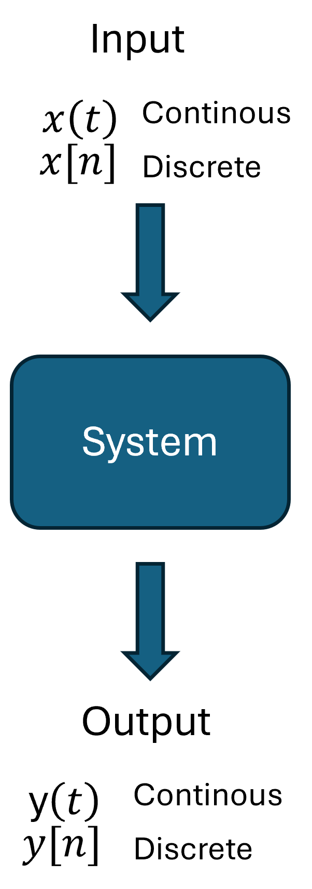{width=35% fig-align="center"}
:::

::: {.column width="45%"}


:::
::::

## Digital Filter -- Introduction{.smaller}

:::: {.columns}

::: {.column width="45%"}

{width=35% fig-align="center"}
:::

::: {.column width="45%"}

Suppose a **discrete** time system
$$ y[n] = \sum_{k=1}^{K} a_k y[n - k] + \sum_{m=0}^{M} b_m x[n - m]$$

- K y M are the order of the filter.

- We must know the initial condition.

:::
::::

## Examples of digital filters{.smaller}

:::: {.columns}

::: {.column width="45%"}

::: {.callout-note title="Gain"}

$$y[n] = G x[n]$$

:::

::: {.callout-note title="Delay of $n_0$ samples"}

$$y[n] = x[n - n_0]$$

:::

::: {.callout-note title="Two points moving average"}

$$y[n] = \frac{1}{2} (x[n] + x[n - 1])$$

:::

::: {.callout-note title="Euler approximation of the derivative"}

$$y[n] = \frac{x[n] - x[n - 1]}{T_s}$$

:::

:::

::: {.column width="45%"}

::: {.callout-note title="Averaging over N consecutive epochs of duration L"}

$$y[n] = \frac{1}{N} \sum_{k=0}^{N-1} x[n - kL]$$

:::

::: {.callout-note title="Trapezoidal integration formula"}

$$y[n] = y[n - 1] + \frac{T_s}{2} (x[n] + x[n - 1])$$

:::

::: {.callout-note title="Digital “leaky integrator” (First-order lowpass filter)"}

$$y[n] = a y[n - 1] + x[n], \quad 0 < a < 1$$

:::

::: {.callout-note title="Digital resonator (Second-order system)"}

$$y[n] = a_1 y[n - 1] + a_2 y[n - 2] + b x[n], \quad a_1^2 + 4a_2 < 0$$

:::

:::
::::

## The impulse response{.smaller}

:::: {.columns}

::: {.column width="45%"}

{width=35% fig-align="center"}
:::

::: {.column width="45%"}

- The impulse response, denoted as $ℎ[n]$, is the output of a digital filter when the input is a unit impulse function $\delta[n]$
- The impulse response fully describes the system. Given $h[n]$, we can determine the output for any input using convolution.
- Different types of filters (low-pass, high-pass, band-pass, etc.) have characteristic impulse responses.
```{python}
#| echo: false
#| eval: true
#| output: true
#| label: impulse response 01

# Define the impulse signal (unit impulse at n=0)
n = np.arange(-5, 10)  # Discrete time axis
x = np.zeros_like(n)
x[n == 0] = 1  # Unit impulse at n=0

# Define the two-point moving average filter impulse response
h = (1/2) * (x + np.roll(x, 1))  # Apply the filter

# Create subplots
fig, axes = plt.subplots(2, 1, figsize=(12, 4))

# Plot the input (Impulse Signal)
axes[0].stem(n, x, linefmt='g-', markerfmt='go', basefmt='r-', label="Input Impulse")
axes[0].set_xlabel("n (Time Index)")
axes[0].set_ylabel("Amplitude")
axes[0].set_title("Input: Unit Impulse")
axes[0].grid(True)
axes[0].legend()

# Plot the impulse response
axes[1].stem(n, h, linefmt='b-', markerfmt='bo', basefmt='r-', label="Impulse Response")
axes[1].set_xlabel("n (Time Index)")
axes[1].set_ylabel("Amplitude")
axes[1].set_title("Impulse Response of Two-Point Moving Average")
axes[1].grid(True)
axes[1].legend()

# Adjust layout and show the plots
plt.tight_layout()
plt.show()


```

:::
::::

## Conditions{.smaller}

For a system's response to be **fully described by its impulse response**, the system must satisfy the following key conditions.

::: {.callout-important title="Linearity"}
If the system responds to $x_1[n]$ with $y_1[n]$ and to $x_2[n]$ with $y_2[n]$, then:

$$y[n] = y_1[n] + y_2[n]$$
:::

::: {.callout-important title="Homogeneity"}
If the input is scaled by a constant $c$, the output is also scaled:

$$\text{If } x[n] \rightarrow y[n], \text{ then } cx[n] \rightarrow cy[n]$$
:::

::: {.callout-important title="Time Invariance"}
A system must be **time-invariant**, meaning a time shift in the input causes the same shift in the output:

$$\text{If } x[n] \rightarrow y[n], \text{ then } x[n - n_0] \rightarrow y[n - n_0]$$
:::

::: {.callout-important title="Causality"}
A **causal system** is one where the output at time $n$ depends only on present and past inputs:

$$h[n] = 0 \quad \forall n < 0$$
:::

::: {.callout-important title="Stability"}
If the impulse response does not satisfy this condition, the system may produce unbounded outputs.

$$\sum_{n=-\infty}^{\infty} |h[n]| < \infty$$
:::
::: {.callout-important title="Convolution Representation"}
If all condition met then
$$y[n] = x[n] * h[n] = \sum_{m=-\infty}^{\infty} x[m] h[n - m]$$
:::

## Convolution

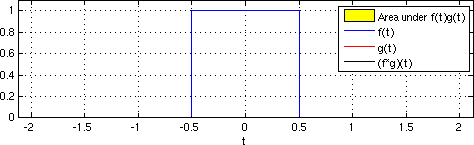

## Continuous example: the original signals

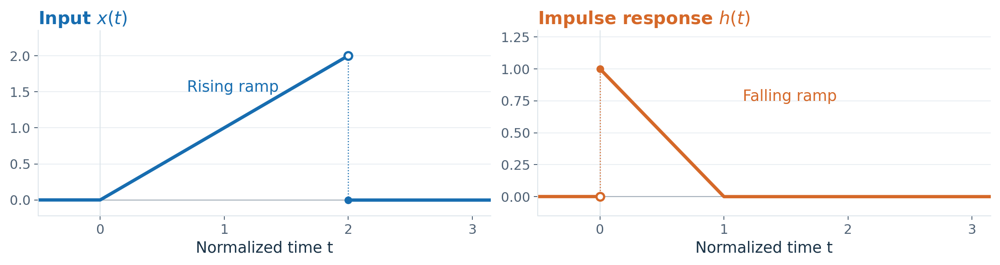{width=100% fig-alt="A rising input ramp from t=0 to t=2 and a falling impulse response from t=0 to t=1. Both are zero elsewhere."}

:::: {.columns}
::: {.column width="50%"}
$$x(t)=\begin{cases}t,&0\leq t<2,\\0,&\text{otherwise.}\end{cases}$$
:::
::: {.column width="50%"}
$$h(t)=\begin{cases}1-t,&0\leq t<1,\\0,&\text{otherwise.}\end{cases}$$
:::
::::

Both ramps have an asymmetric shape within their nonzero interval.

::: notes
Textbook link: Semmlow (2018), Section 5.4, especially Eq. 5.2 on printed p. 218 and manual continuous convolution in Example 5.3, pp. 221-222. The waveforms and values here are original teaching examples, not reproductions of the book. Time and amplitudes use normalized units. Treat x(t) as a finite rising stimulus and h(t) as a simplified causal sensor response. These functions are continuous-time signals. They need not be continuous functions at every endpoint. Hollow circles indicate excluded endpoint values. Changes at isolated endpoints do not change this ordinary convolution integral.
:::


## Time reversal and amplitude inversion

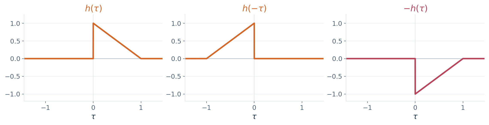{width=100% fig-alt="The original response, its time reversal about the vertical axis, and its amplitude inversion about the horizontal axis."}

| Operation | Expression | Geometric effect |
|:---|:---:|:---|
| Time reversal | $h(-\tau)$ | Reflection across the **vertical** axis |
| Amplitude inversion | $-h(\tau)$ | Reflection across the **horizontal** axis |

::: notes
Textbook link: Semmlow (2018), Section 5.4, Eq. 5.2 and discussion on p. 218. Interpret asymmetry as a shape that visibly changes when reversed in time. A nonzero single-valued signal graph cannot be invariant under reflection about the horizontal axis: that would require h(t)=-h(t) at every t. The pedagogically useful distinction is time reversal versus amplitude inversion. The finite ramps are not mirror-symmetric about the midpoint of their support, and the discrete sequences are not palindromes. Avoid saying that convolution reverses the sign of the impulse response.
:::

## Convolution for an LTI system

For a **linear, time-invariant system at initial rest**, the impulse response determines the output.

:::: {.columns}
::: {.column width="45%"}
**Continuous time**

$$y(t)=\int_{-\infty}^{\infty}x(\tau)h(t-\tau)\,d\tau$$

Fix $t$, then integrate over $\tau$.
:::
::: {.column width="45%"}
**Discrete time**

$$y[n]=\sum_{k=-\infty}^{\infty}x[k]h[n-k]$$

Fix $n$, then sum over $k$.
:::
::::

::: {.callout-note title="The same graphical procedure"}
Reverse $h$, shift it to the output time, multiply aligned amplitudes, then integrate or sum the products.
:::

::: notes
Textbook link: Semmlow (2018), Section 5.4, Eqs. 5.2-5.3, printed pp. 218-220. The impulse response is the output to a unit impulse. Linearity gives scaling and superposition. Time invariance makes the response to a shifted impulse a shifted copy of h. Initial rest excludes an additional zero-input response. Convolution is a mathematical operation on functions or sequences even outside a systems context. The LTI assumption is necessary for using a fixed h to represent an arbitrary system output in this way. Convolution is commutative, so reversing x instead gives the same result when the corresponding variable substitution and shift are consistent.
:::

## Continuous example: reversal and shift

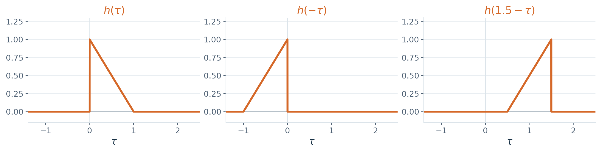{width=100% fig-alt="The falling response h(tau), the reversed rising response h(-tau), and that reversed response shifted right by 1.5."}

$$h(t-\tau)=1-t+\tau\qquad\text{where }0\leq t-\tau<1.$$

Thus the reversed response occupies the interval between $t-1$ and $t$.

At $t=1.5$, its ramp runs from $\tau=0.5$ to $\tau=1.5$.

::: notes
Textbook link: Semmlow (2018), Section 5.4, p. 218 and manual graphical convolution pp. 221-222. Substitute t-tau into every occurrence of the original argument, including the support condition. The exact inequality is t-1 < tau <= t for h(t-tau). The endpoint at t-1 has zero amplitude. For integration limits the endpoints do not affect the result. Write h(t-tau)=h(-(tau-t)): first reflect about tau=0, then translate right by t for positive t. Keep the original input fixed in later plots.
:::

## Continuous example: overlap limits

The product can contribute only where **both** signals are nonzero:

$$a(t)=\max(0,t-1),\qquad b(t)=\min(2,t).$$

$$y(t)=\int_{a(t)}^{b(t)}\tau(1-t+\tau)\,d\tau,
\qquad a(t)<b(t).$$

| Output time | Integration interval | Overlap |
|:---|:---:|:---|
| $t\leq0$ | None | Before contact |
| $0<t\leq1$ | $0$ to $t$ | Entering |
| $1<t\leq2$ | $t-1$ to $t$ | Entire response overlaps |
| $2<t<3$ | $t-1$ to $2$ | Leaving |
| $t\geq3$ | None | After contact |

::: notes
Textbook link: Semmlow (2018), Section 5.4, actual limits set by signal lengths on p. 218, and Example 5.3. The input has support closure [0,2] and the shifted response has support closure [t-1,t]. Their intersection determines the integral. At t=0 and t=3 a possible single contact point has zero integration measure. Do not evaluate an integral with reversed limits when there is no overlap. The three nonzero intervals change at t=1 and t=2. These breakpoints come from support edges, not from arbitrary plotting choices.
:::

## Continuous example: entering overlap

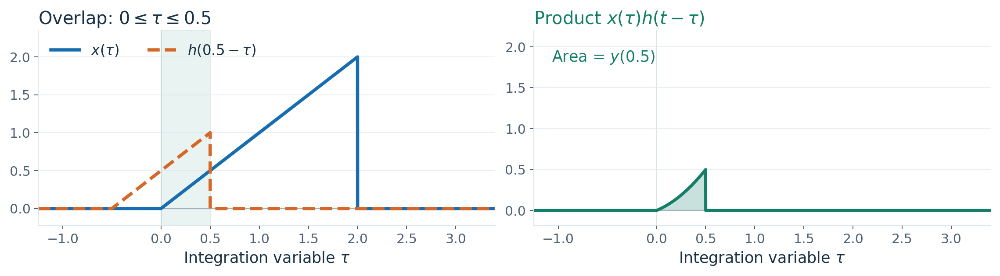{width=100% fig-alt="At t=0.5, the input and shifted response overlap from tau=0 to 0.5. The green product area gives y(0.5)."}

For $0<t\leq1$:
$$y(t)=\int_0^t\tau(1-t+\tau)\,d\tau
=\left[\frac{(1-t)\tau^2}{2}+\frac{\tau^3}{3}\right]_0^t
=\frac{t^2}{2}-\frac{t^3}{6}.$$

At $t=0.5$: **$y(0.5)=5/48\approx0.10417$.**

::: notes
Textbook link: Semmlow (2018), Section 5.4, Eq. 5.2 and manual continuous convolution. Here the green area is the area under the pointwise product, not the geometric area common to the two original curves. Hold t=0.5 fixed. The shifted response is 0.5+tau over -0.5<tau<=0.5, but multiplication by x leaves only 0<=tau<=0.5. The integrand becomes 0.5 tau+tau squared. Its integral gives 1/16+1/24=5/48. The general antiderivative will be reused in the other intervals.
:::

## Continuous example: full response overlap

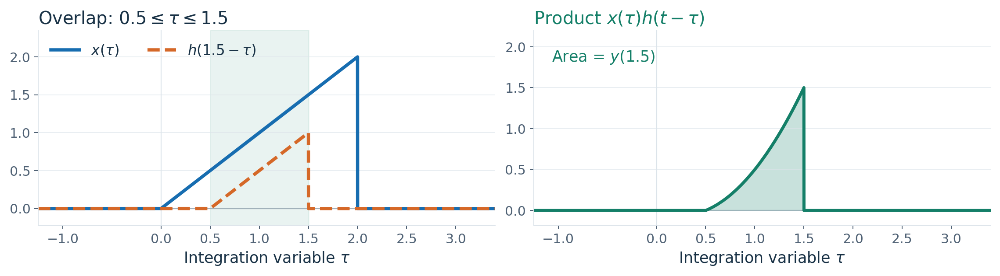{width=100% fig-alt="At t=1.5, the complete shifted impulse response overlaps the input between tau=0.5 and tau=1.5."}

For $1<t\leq2$:
$$y(t)=\int_{t-1}^{t}\tau(1-t+\tau)\,d\tau
=\left[\frac{(1-t)\tau^2}{2}+\frac{\tau^3}{3}\right]_{t-1}^{t}
=\frac{t}{2}-\frac16.$$

At $t=1.5$: **$y(1.5)=7/12\approx0.58333$.**

::: notes
Textbook link: Semmlow (2018), Section 5.4, Eq. 5.2. The overlap interval now moves while keeping width one. Its width alone does not determine y(t): the amplitudes of x under the shifted response keep increasing. For t=1.5 the product is tau(tau-0.5). Substituting 1.5 and 0.5 into the antiderivative gives 9/16-(-1/48)=7/12. The phrase complete response overlap means the entire nonzero part of the shifted impulse response is inside the support of x. It does not mean the supports are identical.
:::

## Continuous example: leaving overlap

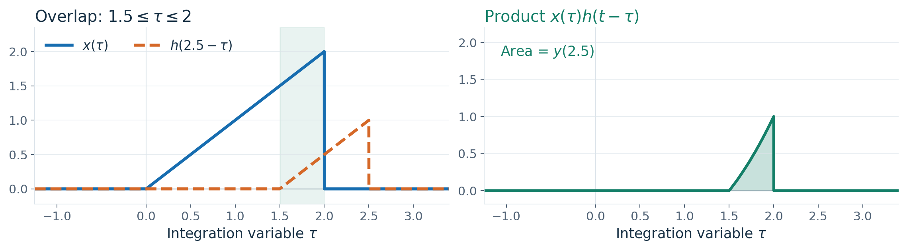{width=100% fig-alt="At t=2.5, only the interval from tau=1.5 to tau=2 contributes. The product area shrinks toward zero."}

For $2<t<3$:
$$y(t)=\int_{t-1}^{2}\tau(1-t+\tau)\,d\tau
=\left[\frac{(1-t)\tau^2}{2}+\frac{\tau^3}{3}\right]_{t-1}^{2}
=\frac{(3-t)^2(t+3)}6.$$

At $t=2.5$: **$y(2.5)=11/48\approx0.22917$.**

::: notes
Textbook link: Semmlow (2018), Section 5.4, Eq. 5.2 and manual finite-support convolution. At t=2.5 the shifted impulse response extends to tau=2.5, but x is zero beyond tau=2, so the upper integration limit stays at 2. The integrand becomes tau(tau-1.5). Its primitive is tau cubed/3-3 tau squared/4. Evaluation gives -1/3-(-9/16)=11/48. The general result may also be written (t-1)^3/6-2t+14/3. Factoring it gives the expression on the slide, which makes y(3)=0 easy to see.
:::

## Continuous example: the complete output

:::: {.columns}
::: {.column width="52%"}
$$y(t)=\begin{cases}
0,&t\leq0,\\
\dfrac{t^2}{2}-\dfrac{t^3}{6},&0<t\leq1,\\
\dfrac{t}{2}-\dfrac16,&1<t\leq2,\\
\dfrac{(3-t)^2(t+3)}6,&2<t<3,\\
0,&t\geq3.
\end{cases}$$
:::
::: {.column width="48%"}
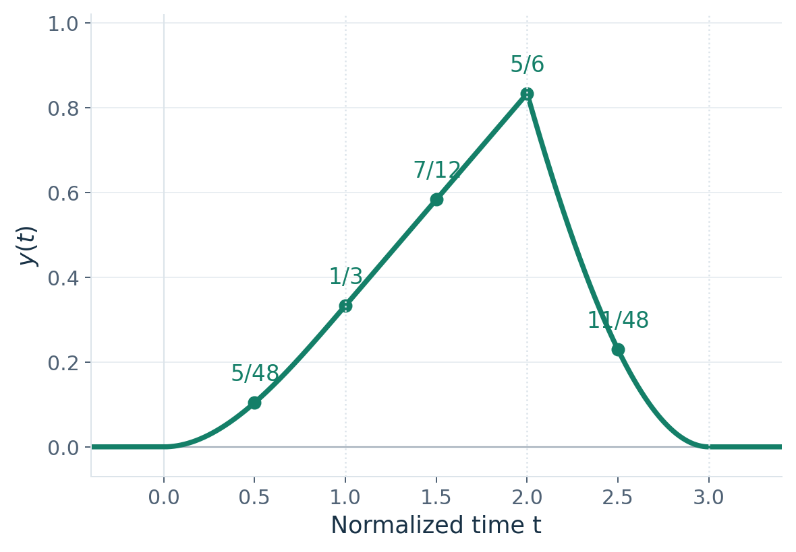{width=100% fig-alt="The convolution rises to 5/6 at t=2 and returns to zero at t=3. Values at 0.5, 1, 1.5, and 2.5 are marked."}
:::
::::

The three branches meet continuously at $t=1$ and $t=2$.

::: notes
Textbook link: Semmlow (2018), Section 5.4. Original derived example. The branches match at 0, 1, 2, and 3: values are 0, 1/3, 5/6, and 0. The output is continuous even though the input has a jump at t=2 and the impulse response jumps at t=0. The derivative has a corner at t=2. Its maximum is 5/6 at t=2. The output support closure is [0,3]. The factored last branch is nonnegative for 2<t<3.
:::

## Continuous example: sensor interpretation

The synthetic model illustrates how a **sensor with memory** combines recent input values.

- The input lasts 2 time units. The response lasts 1 time unit.
- The output continues until $t=3$, after the input has ended.
- Since $x(t)\geq0$ and $h(t)\geq0$, the output stays nonnegative.

$$\int x(t)\,dt=2,\qquad\int h(t)\,dt=\frac12,
\qquad\int y(t)\,dt=2\left(\frac12\right)=1.$$

::: {.callout-note title="Gain and duration are different properties"}
The impulse response has area $1/2$. This filter does not preserve the area of the input.
:::

::: notes
Textbook link: Semmlow (2018), Section 5.4, discussion of memory and impulse response duration on p. 220. These simplified ramps demonstrate temporal spreading in a causal LTI acquisition channel. They are not a measured sensor model or a validated physiological response. Normalized units avoid assigning physical dimensions to the toy functions. In a dimensioned continuous model, h carries output units divided by input units and time. The area identity follows from the convolution integral for these integrable functions. The area of h equals the system's DC gain, 1/2. Causality and finite support do not imply unit gain.
:::

## Continuous example: Python calculation

```python
from scipy.integrate import quad

def y_continuous(t):
    a = max(0.0, t - 1.0)
    b = min(2.0, t)
    if a >= b:
        return 0.0
    return quad(lambda tau: tau * (1 - t + tau), a, b)[0]

for t in (0.5, 1.5, 2.5):
    print(f"y({t}) = {y_continuous(t):.5f}")
```

```text
y(0.5) = 0.10417
y(1.5) = 0.58333
y(2.5) = 0.22917
```

::: notes
Textbook link: Semmlow (2018), Section 5.4, Eq. 5.2. Python adaptation. The integration limits already enforce both supports, so the integrand needs no extra piecewise tests. scipy.integrate.quad numerically integrates over tau for one fixed t. The displayed output comes from this calculation, rounded to five decimal places. If the integral is instead approximated using sampled arrays, multiply their discrete convolution by the time step Delta t. This scale factor approximates d tau. The independent discrete FIR example uses its defined coefficients directly, with no additional time-step factor.
:::

## Discrete example: the original sequences

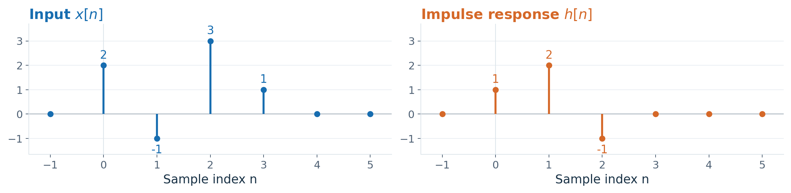{width=100% fig-alt="The input has samples 2, minus 1, 3, 1 at indices 0 to 3. The impulse response has samples 1, 2, minus 1 at indices 0 to 2."}

| Sample index $n$ | $0$ | $1$ | $2$ | $3$ |
|:---|---:|---:|---:|---:|
| Input $x[n]$ | $2$ | $-1$ | $3$ | $1$ |
| Impulse response $h[n]$ | $1$ | $2$ | $-1$ | $0$ |

Both sequences are zero elsewhere and asymmetric in time.

::: notes
Textbook link: Semmlow (2018), Section 5.4, convolution sum Eq. 5.3 on printed p. 220. These are original synthetic examples in normalized amplitude units. The first listed sample has index zero, a convention that will determine every later alignment. The extra h[3]=0 in the table only aligns the two rows. The FIR impulse response has three nonzero samples. These discrete sequences are independent of the continuous example. They are not samples of its ramps. A possible biomedical use is an illustrative finite filter applied to a short segment of a baseline-centered biosignal. No clinical performance claim follows from these toy coefficients.
:::

## Discrete example: reversal and shift

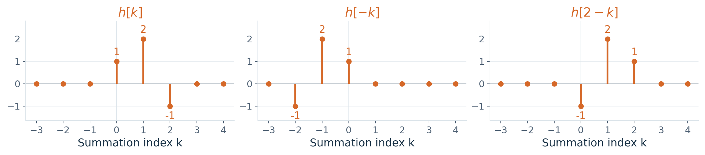{width=100% fig-alt="Original h at indices 0, 1, 2; reversed h at minus 2, minus 1, 0; and h[2-k] at 0, 1, 2 with amplitudes minus 1, 2, 1."}

| Original sample | After reversal | After a shift by $n$ |
|:---|:---|:---|
| $h[0]=1$ | At $k=0$ | At $k=n$ |
| $h[1]=2$ | At $k=-1$ | At $k=n-1$ |
| $h[2]=-1$ | At $k=-2$ | At $k=n-2$ |

The overlap is $\max(0,n-2)\leq k\leq\min(3,n)$, for integer $k$.

::: notes
Textbook link: Semmlow (2018), Section 5.4, Eq. 5.3 and manual discrete convolution in Example 5.4, pp. 222-223. An original index j moves to k=n-j. The original amplitude remains h[j], so the sample -1 stays negative. h[-k] has values -1, 2, 1 when read from k=-2 to k=0. For n=2 it has the same values at k=0,1,2. Never reverse only a printed list and silently keep its old index origin. The support inequality also gives an empty sum before n=0 and after n=5.
:::

## Discrete example: the first two output samples

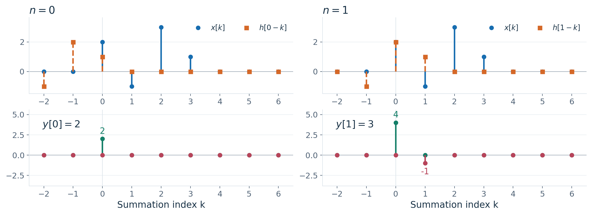{width=100% fig-alt="Aligned sequences and pointwise products at n=0 and n=1. The sums are 2 and 3."}

$$y[0]=(2)(1)=2,\qquad y[1]=(2)(2)+(-1)(1)=3.$$

::: notes
Textbook link: Semmlow (2018), Section 5.4, Eq. 5.3. Upper plots use blue circles for x[k] and orange squares for h[n-k]. Dashed orange stems distinguish overlapping coefficients. Lower plots show the products. At n=0, k=0 is the only shared nonzero index. At n=1, k=0 and k=1 contribute 4 and -1. The zero-valued displayed stems outside the support are only reference positions. Every multiplication pairs values at the same k.
:::

## Discrete example: cancellation at $n=2$

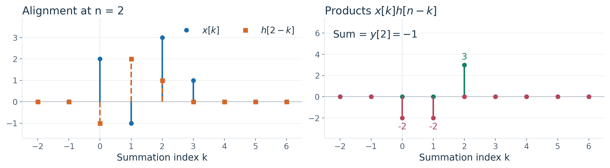{width=100% fig-alt="At n=2 the products at k=0,1,2 are minus 2, minus 2, and 3. Their signed sum is minus 1."}

$$y[2]=(2)(-1)+(-1)(2)+(3)(1)=-2-2+3=\boxed{-1}.$$

::: {.callout-note title="The products add with their signs"}
Negative contributions can outweigh positive contributions, even with full response overlap.
:::

::: notes
Textbook link: Semmlow (2018), Section 5.4, Eq. 5.3. At n=2 all three response coefficients align with available input samples. This does not guarantee a positive or maximal output. The two negative products sum to -4 and the positive product is 3. Red stems indicate negative products. Replacing the signed sum with magnitudes would incorrectly give 7. Omitting reversal would calculate a different operation.
:::

## Discrete example: reinforcement at $n=3$

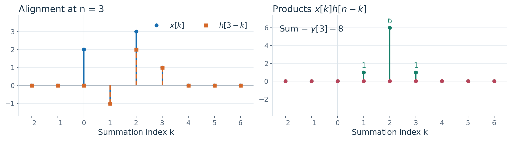{width=100% fig-alt="At n=3 the products at k=1,2,3 are 1, 6, and 1, giving an output of 8."}

$$y[3]=(-1)(-1)+(3)(2)+(1)(1)=1+6+1=\boxed{8}.$$

The negative input sample and the negative coefficient now produce a positive contribution.

::: notes
Textbook link: Semmlow (2018), Section 5.4, Eq. 5.3. The overlap contains k=1,2,3. At k=1 the input -1 aligns with h[2]=-1. At k=2 the input 3 aligns with h[1]=2. At k=3 the input 1 aligns with h[0]=1. All three products are positive. The peak value exceeds every input sample because this filter has coefficients with magnitudes whose sum is four. No rule bounds the output by the maximum input unless the coefficient conditions support that rule.
:::

## Discrete example: the last two output samples

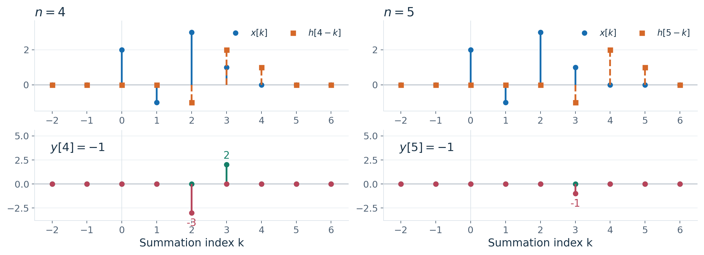{width=100% fig-alt="At n=4 the products are minus 3 and 2. At n=5 the only product is minus 1. Both output samples equal minus 1."}

$$y[4]=(3)(-1)+(1)(2)=-1,\qquad y[5]=(1)(-1)=-1.$$

::: notes
Textbook link: Semmlow (2018), Section 5.4, Eq. 5.3. At n=4, the remaining overlap is k=2,3. At n=5, only k=3 contributes. At n=6 no shared nonzero index remains. Therefore y[n]=0 for every n outside 0 through 5. The nonzero output after the final input sample illustrates the memory of the FIR filter.
:::

## Discrete example: every product and sum

For each output index, $y[n]=\sum_{k=0}^{3}x[k]h[n-k]$.

| $n$ | $x[0]h[n]$ | $x[1]h[n-1]$ | $x[2]h[n-2]$ | $x[3]h[n-3]$ | $y[n]$ |
|---:|---:|---:|---:|---:|---:|
| $0$ | $2$ | $0$ | $0$ | $0$ | **2** |
| $1$ | $4$ | $-1$ | $0$ | $0$ | **3** |
| $2$ | $-2$ | $-2$ | $3$ | $0$ | **-1** |
| $3$ | $0$ | $1$ | $6$ | $1$ | **8** |
| $4$ | $0$ | $0$ | $-3$ | $2$ | **-1** |
| $5$ | $0$ | $0$ | $0$ | $-1$ | **-1** |

Every row fixes the output index $n$. Each column tracks one input sample.

::: notes
Textbook link: Semmlow (2018), Section 5.4, Eq. 5.3. This table contains all 12 nonzero products of the four input samples and three response coefficients, arranged by their output index n=k+j. Row sums reproduce graphical convolution. Column sums offer an alternative superposition interpretation: each input sample scales a shifted impulse response. The h notation in each column includes zeros outside indices 0 to 2.
:::

## Discrete example: the complete output

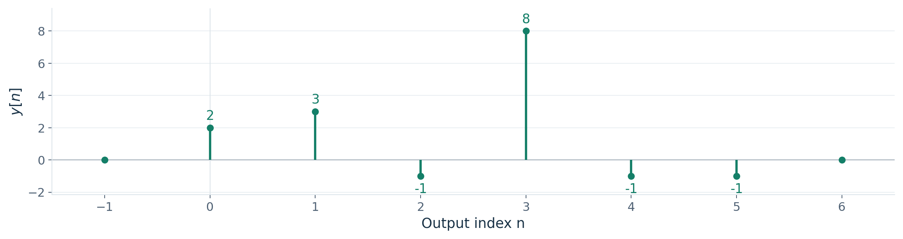{width=100% fig-alt="The output sequence is 2, 3, minus 1, 8, minus 1, minus 1 at n=0 through 5 and zero elsewhere."}

$$\boxed{y[n]=\{2,\ 3,\ -1,\ 8,\ -1,\ -1\},\quad n=0,\ldots,5}$$

Output length: $L_y=L_x+L_h-1=4+3-1=6$ samples.

Sum check: $\sum_n y[n]=10=(\sum_nx[n])(\sum_nh[n])=(5)(2)$.

::: notes
Textbook link: Semmlow (2018), Section 5.4. The length formula describes full linear convolution of the stated finite arrays. The output starts at index 0+0=0 and ends at 3+2=5. A same-length output would omit part of the complete convolution. The sum identity follows from exchanging the finite sums. It gives a useful arithmetic check but does not independently guarantee that every sample or index is correct.
:::

## Discrete example: Python and filter meaning

```python
import numpy as np

x = np.array([2, -1, 3, 1])       # n = 0, ..., 3
h = np.array([1, 2, -1])         # n = 0, ..., 2
y = np.convolve(x, h, mode="full")
print(y.tolist())
```

```text
[2, 3, -1, 8, -1, -1]
```

The same FIR system has the difference equation
$$y[n]=x[n]+2x[n-1]-x[n-2].$$

It combines the current sample with two past samples. Initial rest sets earlier input values to zero.

::: notes
Textbook link: Semmlow (2018), Section 5.4, Eq. 5.3. Python adaptation of direct convolution. The displayed list is the executed result. np.convolve performs the convolution operation internally: pass h in its original order. Passing h[::-1] would undo the required coefficient reversal in the internal operation and produce a different result. Array multiplication x*h is pointwise multiplication, not convolution, and these two arrays also have incompatible lengths. This FIR is causal and stable. Its coefficients sum to 2, so it is neither a unit-gain moving average nor an ideal differentiator. It illustrates waveform reshaping, not a clinically validated ECG/EMG processing method.
:::

## Continuous and discrete convolution

| Feature | Continuous example | Discrete example |
|:---|:---|:---|
| Moving response | $h(t-\tau)$ | $h[n-k]$ |
| Variable to eliminate | $\tau$ | $k$ |
| Accumulation | Integral of the product | Signed sum of products |
| Complete output | $0<t<3$ | $n=0,\ldots,5$ |
| Negative output here? | No: both factors are nonnegative | Yes: signed products can cancel |

::: {.callout-note title="One shift produces one output value"}
Sweeping all shifts constructs the output signal. Reversing time preserves amplitudes and changes their alignment.
:::

::: notes
Textbook link: Semmlow (2018), Section 5.4, Eqs. 5.2-5.3. The nonnegative result in the continuous example is a property of these chosen functions, not of all continuous-time convolutions. Discrete convolution can also stay nonnegative when both sequences are nonnegative. Distinguish a genuine discrete LTI model with coefficients h[k] from a Riemann-sum approximation of a continuous convolution. The latter uses Delta t times the sum of products unless that factor is already incorporated in the discrete coefficients.
:::

## Questions for discussion

1. At $t=2.5$, why does the continuous integral stop at $\tau=2$?
2. Why does $y[2]$ become negative while $y[3]$ becomes positive?
3. Where does the sample $h[2]=-1$ appear in $h[n-k]$?
4. Why must the continuous output vanish after $t=3$ and the discrete output after $n=5$?

::: {.callout-note title="Expected reasoning"}
Identify the overlap limits, preserve signs, and justify each contributing product.
:::

::: notes
Instructor answers: (1) x(tau)=0 for tau>=2, so no later tau can contribute, even though the shifted response continues to 2.5. (2) At n=2 the products are -2,-2,3, with sum -1. At n=3 they are 1,6,1, with sum 8. (3) At k=n-2. Its amplitude remains -1. (4) The support intervals no longer overlap after those limits. At t=3 the contact is at most one point, which has zero area. At n=6 there is no contributing integer index. Ask students to sketch the alignment before evaluating formulas. A satisfactory explanation must use support and signs, not only quote the output numbers.
:::

## Reading and course alignment

**Main reference**

John Semmlow (2018). *Circuits, Signals, and Systems for Bioengineers: A MATLAB-Based Introduction*. 3rd edition. Academic Press.

- Section **5.4**, printed pp. **216-225**: convolution and worked examples.
- Eq. **5.2**, p. **218**: continuous convolution.
- Eq. **5.3**, p. **220**: discrete convolution.

**SYSB course topic**

Time-domain analysis of linear systems: convolution. The supplied program schedules definition and application in week 11.

::: {.small}
Waveforms, figures, worked calculations, and Python examples in this deck are original teaching material. All signals are synthetic.
:::

::: notes
Source files inspected: Circuits, Signals and Systems for Bioengineers.pdf and Programa_SYSB_2027-1.pdf. Book bibliographic data come from its title and copyright pages: third edition, 2018, ISBN 978-0-12-809395-5. No DOI is asserted. Use the textbook's actual section numbering. The uploaded program names convolution in Part II topic 5 and schedules it in week 11, but its numerical cross-references differ from the inspected textbook. The program file's page headers still display SYSB 2022-2 despite its uploaded 2027-1 filename. This deck identifies the course and topic without asserting an academic term. Teacher notes cite the relevant textbook section throughout. The two examples are designed for visible time reversal, rather than reusing symmetric rectangles or palindromic sequences.
<!-- :::

## Example: RC Low-Pass Filter Response

Consider a first-order RC circuit with impulse response $h(t) = \frac{1}{RC} e^{-t/RC} u(t)$. If the input is a rectangular pulse $x(t) = u(t) - u(t-T)$, the output $y(t)$ is:

$$y(t) = \int_{0}^{t} x(\tau) \frac{1}{RC} e^{-(t-\tau)/RC} d\tau$$

For $0 \le t \le T$:
$$y(t) = 1 - e^{-t/RC}$$

For $t > T$:
$$y(t) = (1 - e^{-T/RC}) e^{-(t-T)/RC}$$

---

## RC Filter: Impulse Response Derivation

The voltage across a capacitor in an RC circuit is governed by the first-order differential equation:
$$RC \frac{dy(t)}{dt} + y(t) = x(t)$$

Applying the Laplace Transform with zero initial conditions:
$$Y(s)(RCs + 1) = X(s) \implies H(s) = \frac{Y(s)}{X(s)} = \frac{1/RC}{s + 1/RC}$$

The impulse response $h(t)$ is the inverse Laplace Transform $\mathcal{L}^{-1}\{H(s)\}$:
$$h(t) = \frac{1}{RC} e^{-\frac{t}{RC}} u(t)$$

---

## Time instants

```{python}
# | echo: false
# | eval: true
# | output: false
# | warning: false
# | fig-align: center
# | label: time_instants

import numpy as np
import matplotlib.pyplot as plt

# Parámetros del sistema
RC = 1.0
alpha = 1 / RC
T = 2.0  # Duración del pulso
t_final = 5.0
tau = np.linspace(-1, t_final, 1000)


def x(t):
    return np.where((t >= 0) & (t <= T), 1.0, 0.0)


def h(t):
    return np.where(t >= 0, alpha * np.exp(-alpha * t), 0.0)


# Instantes de tiempo para Región 1 y Región 2
t1 = 1.0  # 0 < t1 < T
t2 = 3.5  # t2 > T

fig, (ax1, ax2) = plt.subplots(2, 1, figsize=(10, 8))

# --- REGIÓN 1: TRASLAPE PARCIAL (0 < t < T) ---
_ = ax1.fill_between(tau, x(tau), alpha=0.2, color="blue", label="$x(\\tau)$ (Pulso)")
_ = ax1.plot(tau, h(t1 - tau), "r", label=f"$h({t1}-\\tau)$ (Filtro)")
# Área de integración
tau_overlap1 = np.linspace(0, t1, 100)
_ = ax1.fill_between(
    tau_overlap1, h(t1 - tau_overlap1), color="red", alpha=0.4, label="Área: $\int_0^t$"
)
_ = ax1.set_title(f"Región 1: Traslape Parcial ($t={t1}$)", fontsize=12)
_ = ax1.set_ylim(-0.1, 1.2)
_ = ax1.legend(loc="upper right")
_ = ax1.grid(True, linestyle="--")

# --- REGIÓN 2: TRASLAPE TOTAL / DECAIMIENTO (t > T) ---
_ = ax2.fill_between(tau, x(tau), alpha=0.2, color="blue", label="$x(\\tau)$ (Pulso)")
_ = ax2.plot(tau, h(t2 - tau), "r", label=f"$h({t2}-\\tau)$ (Filtro)")
# Área de integración
tau_overlap2 = np.linspace(0, T, 100)
_ = ax2.fill_between(
    tau_overlap2, h(t2 - tau_overlap2), color="red", alpha=0.4, label="Área: $\int_0^T$"
)
_ = ax2.set_title(f"Región 2: Traslape Total y Decaimiento ($t={t2}$)", fontsize=12)
_ = ax2.set_ylim(-0.1, 1.2)
_ = ax2.legend(loc="upper right")
_ = ax2.grid(True, linestyle="--")

plt.tight_layout()
plt.show()
```

___

## Analytical Evaluation: Interval $0 \le t \le T$

For a rectangular pulse $x(t) = 1$ for $0 \le t \le T$, and $h(t) = \alpha e^{-\alpha t} u(t)$ where $\alpha = 1/RC$:

$$y(t) = \int_{0}^{t} (1) \cdot \alpha e^{-\alpha(t-\tau)} d\tau$$

Factoring out terms independent of $\tau$:
$$y(t) = \alpha e^{-\alpha t} \int_{0}^{t} e^{\alpha \tau} d\tau = \alpha e^{-\alpha t} \left[ \frac{1}{\alpha} e^{\alpha \tau} \right]_{0}^{t}$$

Evaluating the limits:
$$y(t) = e^{-\alpha t} (e^{\alpha t} - 1) = 1 - e^{-\alpha t}$$

---

## Analytical Evaluation: Interval $t > T$

When the input pulse ends ($t > T$), the integration limits are constrained by the pulse width $[0, T]$:

$$y(t) = \int_{0}^{T} (1) \cdot \alpha e^{-\alpha(t-\tau)} d\tau = \alpha e^{-\alpha t} \int_{0}^{T} e^{\alpha \tau} d\tau$$

Solving the integral:
$$y(t) = \alpha e^{-\alpha t} \left[ \frac{1}{\alpha} e^{\alpha \tau} \right]_{0}^{T} = e^{-\alpha t} (e^{\alpha T} - 1)$$

Rearranging to show the exponential decay from the value at $t=T$:
$$y(t) = (1 - e^{-\alpha T}) e^{-\alpha(t-T)}$$

---

## Python Implementation: Continuous-Time Emulation

Numerical approximation of the continuous convolution using high-density sampling.

```{python}
#| echo: true
import numpy as np
import matplotlib.pyplot as plt

# Parameters
RC = 0.5
alpha = 1/RC
T = 2.0
dt = 0.01
t = np.arange(0, 5, dt)

# Signals
x = np.where((t >= 0) & (t <= T), 1.0, 0.0)
h = alpha * np.exp(-alpha * t)

# Convolution (scaled by dt to approximate integral)
y = np.convolve(x, h)[:len(t)] * dt

print(f"Peak value at t=T: {y[int(T/dt)]: .4f}")
print(f"Theoretical peak: {1 - np.exp(-alpha*T): .4f}")
```

---

## Visualization: Continuous Convolution

The "Flip-Shift-Integrate" process:

```{tikz}
\begin{tikzpicture}[scale=0.8]
    \draw[->] (-3,0) -- (5,0) node[right] {$\tau$};
    \draw[->] (0,-0.2) -- (0,1.5) node[above] {$f(\tau), g(t-\tau)$};

    % Signal x(tau)
    \draw[blue, thick] (0,0) -- (0,1) -- (2,1) -- (2,0) node[below] {$T$};
    \node[blue] at (1,1.2) {$x(\tau)$};

    % Signal h(t-tau)
    \draw[red, thick] (-2,0) -- (1,0) .. controls (1,0.8) .. (1,1) node[left] {$t$} -- (1,0);
    \draw[red, dashed] (1,1) -- (2.5,0.1);
    \node[red] at (-1,0.5) {$h(t-\tau)$};

    \draw[<->] (0,-0.5) -- (1,-0.5) node[midway, below] {Overlap};
\end{tikzpicture}
```

---

## Discrete-Time Convolution: Definition

In the discrete domain, the convolution sum relates the input $x[n]$ and the impulse response $h[n]$ of a discrete LTI system:

$$y[n] = x[n] * h[n] = \sum_{k=-\infty}^{\infty} x[k] h[n - k]$$

This operation characterizes the system's output as a weighted sum of delayed impulses. For causal signals of finite length $L$ and $M$, the resulting sequence $y[n]$ has length $L + M - 1$.

---

## Example: Moving Average Filter

Let $x[n] = [1, 2, 3, 2, 1]$ and a 3-point causal moving average filter $h[n] = \frac{1}{3}[\delta[n] + \delta[n-1] + \delta[n-2]]$.

**Analytical Calculation:**

* $y[0] = \frac{1}{3}(1) = 0.33$
* $y[1] = \frac{1}{3}(1+2) = 1.0$
* $y[2] = \frac{1}{3}(1+2+3) = 2.0$
* $y[3] = \frac{1}{3}(2+3+2) = 2.33$
* $y[4] = \frac{1}{3}(3+2+1) = 2.0$

---

## Visualization: Discrete Convolution

Mechanism of $h[n-k]$ sliding over $x[k]$ at $n=2$:

```{tikz}
\begin{tikzpicture}[scale=1.0]
    % x[k]
    \foreach \k/\val in {0/1, 1/2, 2/3, 3/2, 4/1} {
        \draw[blue, thick, ->] (\k,0) -- (\k,\val*0.5);
        \fill[blue] (\k,\val*0.5) circle (2pt);
    }
    \node[blue] at (4.5, 1.5) {$x[k]$};

    % h[2-k] (Flipped and shifted by 2)
    % h[k] = [1/3, 1/3, 1/3] for k=0,1,2
    % h[-k] = [1/3, 1/3, 1/3] for k=0,-1,-2
    % h[2-k] = [1/3, 1/3, 1/3] for k=2,1,0
    \foreach \k in {0,1,2} {
        \draw[red, thick, ->] (\k,0) -- (\k,-0.5);
        \fill[red] (\k,-0.5) circle (2pt);
    }
    \node[red] at (0, -1) {$h[2-k]$};

    \draw[->] (-1,0) -- (6,0) node[right] {$k$};
\end{tikzpicture}
```

---

## Numerical Validation in Python

The following code validates the discrete convolution using `numpy.convolve`.

```{python}
#| echo: true
import numpy as np

# Define signals
x = np.array([1, 2, 3, 2, 1])
h = np.array([1/3, 1/3, 1/3])

# Compute convolution
y = np.convolve(x, h, mode='full')

# Display results
print(f"Input x[n]: {x}")
print(f"Impulse response h[n]: {h}")
print(f"Output y[n]: {np.round(y, 2)}")

# Verification of length
expected_len = len(x) + len(h) - 1
print(f"Verified Length: {len(y) == expected_len}")
```

---

## Comparison of Domain Characteristics

| Feature | Continuous Domain ($t$) | Discrete Domain ($n$) |
| :--- | :--- | :--- |
| **Operator** | Integral $\int$ | Summation $\sum$ |
| **Identity** | Dirac Delta $\delta(t)$ | Kronecker Delta $\delta[n]$ |
| **Complexity** | Differential Equations | Difference Equations |
| **Implementation** | Analog Electronics | Digital Processors (DSP/FPGA) |


## Ejemplo 1: Convolución Continua (Planteamiento)

Considere señales analógicas definidas por tramos (no simétricas):

**Señal de entrada $x(t)$:**
$$x(t) = \begin{cases} t & 0 \leq t < 1 \\ 1 & 1 \leq t < 2 \\ 0 & \text{otros} \end{cases}$$

**Respuesta al impulso $h(t)$:**
$$h(t) = \begin{cases} 1 & 0 \leq t < 1 \\ -0.5 & 1 \leq t < 1.5 \\ 0 & \text{otros} \end{cases}$$

**Objetivo:** Calcular la respuesta del sistema $y(t) = \int_{-\infty}^{\infty} x(\tau)h(t-\tau)d\tau$.

---

## Definición Formal de las Señales

Para un análisis riguroso, expresamos las señales asimétricas mediante funciones escalón unitario $u(t)$:

**Entrada $x(t)$:**
$$x(t) = t[u(t)-u(t-1)] + 1[u(t-1)-u(t-2)]$$

**Respuesta al impulso $h(t)$:**
$$h(t) = 1[u(t)-u(t-1)] - 0.5[u(t-1)-u(t-1.5)]$$

El soporte de la salida $y(t) = x(t) * h(t)$ es la suma de los soportes:
$$S_y = [0+0, 2+1.5] = [0, 3.5]$$

---

## Metodología: El Kernel Invertido

La integral de convolución es $y(t) = \int_{-\infty}^{\infty} x(\tau)h(t-\tau)d\tau$.
El término $h(t-\tau)$ actúa como una ventana móvil que se desplaza de izquierda a derecha según aumenta $t$:

- **Región de $h=1$:** $\tau \in [t-1, t]$
- **Región de $h=-0.5$:** $\tau \in [t-1.5, t-1]$

La evaluación requiere identificar cada cambio en la intersección de estos intervalos con los tramos de $x(\tau)$ ($[0,1]$ y $[1,2]$).

---

## Análisis por Intervalos (I)

**1. Intervalo $0 \leq t < 1$:**
Solo la parte frontal de $h$ ($h=1$) entra en el soporte de $x$.
$$y(t) = \int_{0}^{t} \tau \cdot (1) d\tau = \frac{t^2}{2}$$

**2. Intervalo $1 \leq t < 1.5$:**
La parte $h=1$ cubre totalmente el primer tramo de $x$ y entra en el segundo. La parte $h=-0.5$ entra en el primer tramo.
$$y(t) = \underbrace{\int_{0}^{t-1} \tau(-0.5) d\tau}_{\text{cola de } h} + \underbrace{\int_{t-1}^{1} \tau(1) d\tau}_{\text{frente } h \text{ en tramo 1}} + \underbrace{\int_{1}^{t} (1)(1) d\tau}_{\text{frente } h \text{ en tramo 2}}$$

---

## Análisis por Intervalos (II)

**3. Intervalo $1.5 \leq t < 2$:**
Ambas partes de $h$ están dentro del soporte de $x$.
$$y(t) = \int_{t-1.5}^{t-1} \tau(-0.5) d\tau + \int_{t-1}^{1} \tau(1) d\tau + \int_{1}^{2} (1)(1) d\tau$$

**4. Intervalo $2 \leq t < 2.5$:**
El frente de $h$ comienza a salir del soporte de $x$ ($t-1 > 1$).
$$y(t) = \int_{t-1.5}^{1} \tau(-0.5) d\tau + \int_{1}^{t-1} 1(-0.5) d\tau + \int_{t-1}^{2} (1)(1) d\tau$$

---

## Análisis por Intervalos (III)

**5. Intervalo $2.5 \leq t < 3$:**
Solo la cola de $h$ ($h=-0.5$) permanece en el segundo tramo de $x$.
$$y(t) = \int_{t-1.5}^{2} (1)(-0.5) d\tau = -0.5(2 - (t - 1.5))$$

**6. Intervalo $t \geq 3.5$:**
$$y(t) = 0$$

---

## Ejemplo 2: Convolución Discreta (Planteamiento)

Sean las secuencias asimétricas compuestas $x[n]$ y $h[n]$:

**Entrada $x[n]$:**
$$x[n] = \{1, 3, 1.5\} \text{ para } n=0, 1, 2$$

**Respuesta al impulso $h[n]$ (Filtro Derivador Asimétrico):**
$$h[n] = \begin{cases} 0.5 & n=0 \\ 1 & n=1 \\ -1 & n=2 \\ 0.2 & n=3 \\ 0 & \text{otros} \end{cases}$$

Determine $y[n] = x[n] * h[n]$ mediante el método de suma directa para sistemas LTI discretos.

---

## Ejemplo 2: Desarrollo y Resultado

Dado que $x[n]$ tiene longitud $N=3$ y $h[n]$ longitud $M=4$, $y[n]$ tendrá $N+M-1 = 6$ muestras significativas ($n=0$ hasta $n=5$).


**Cálculo de muestras:**
* $y[0] = x[0]h[0] = 1(0.5) = \mathbf{0.5}$
* $y[1] = x[1]h[0] + x[0]h[1] = 3(0.5) + 1(1) = \mathbf{2.5}$
* $y[2] = x[2]h[0] + x[1]h[1] + x[0]h[2] = 1.5(0.5) + 3(1) + 1(-1) = \mathbf{2.75}$
* $y[3] = x[2]h[1] + x[1]h[2] + x[0]h[3] = 1.5(1) + 3(-1) + 1(0.2) = \mathbf{-1.3}$
* $y[4] = x[2]h[2] + x[1]h[3] = 1.5(-1) + 3(0.2) = \mathbf{-0.9}$
* $y[5] = x[2]h[3] = 1.5(0.2) = \mathbf{0.3}$

**Resultado:** $y[n] = \{0.5, 2.5, 2.75, -1.3, -0.9, 0.3\}$ -->
