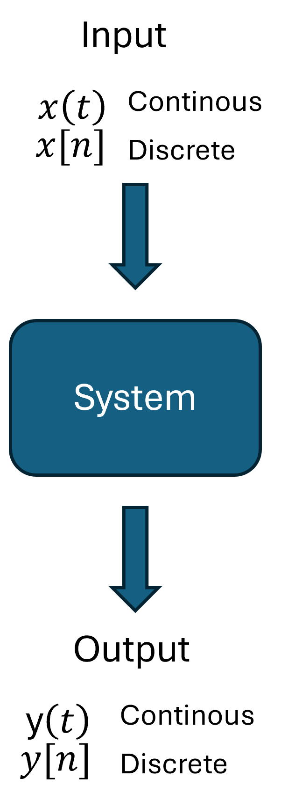
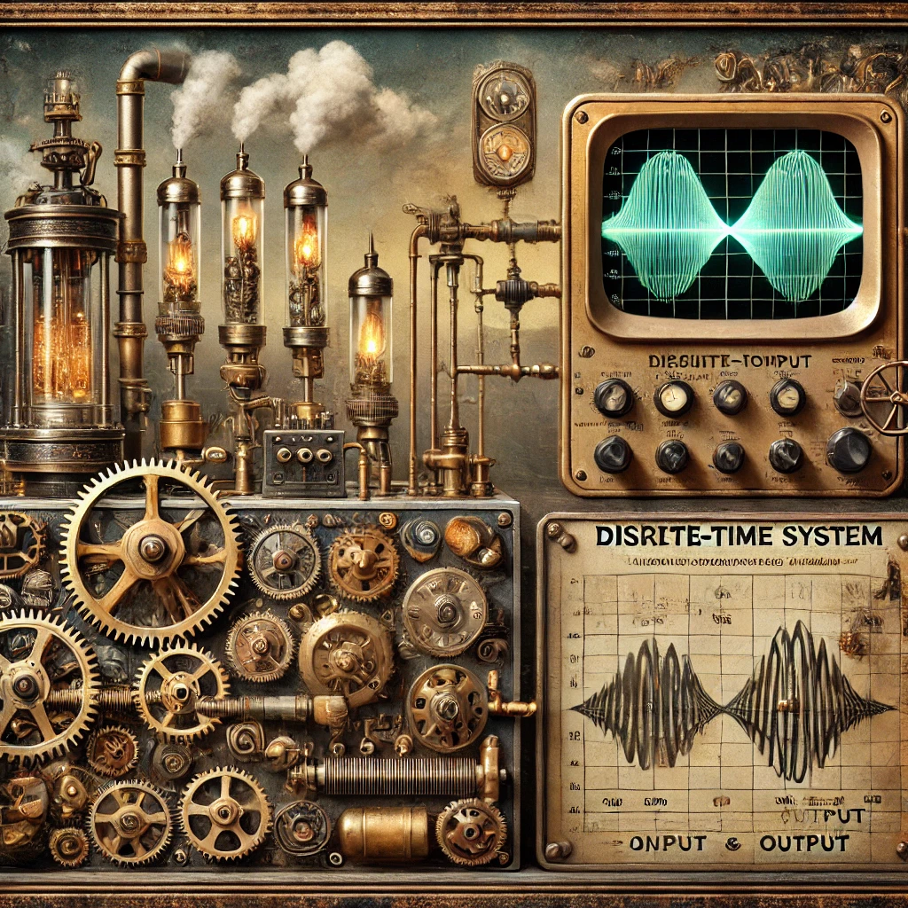
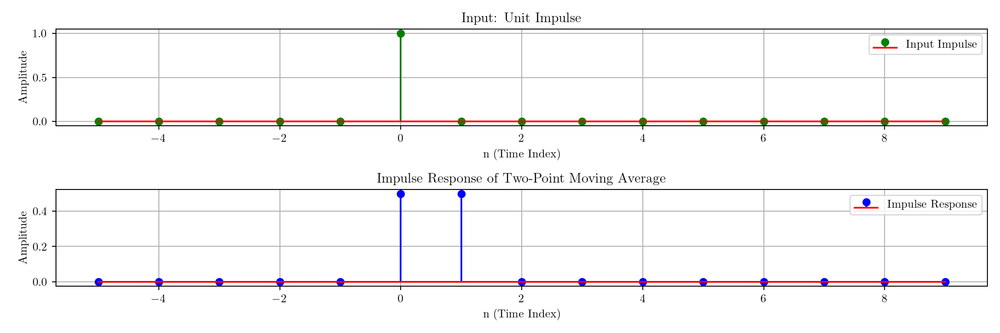

::: {.cell}

:::

::: {.cell}

:::

# Sistemas y Señales Biomedicos - SYSB

## Digital Filter -- Introduction

:::: {.columns}

::: {.column width="45%"}

- It is a mathematical algorithm or system that processes digital signals.
- They enhance, suppress, or modify specific frequency components. 
- These filters are essential for removing noise, extracting relevant information, and improving signal quality.

:::

::: {.column width="45%"}

:::
::::

## Digital Filter -- Introduction

::: {.callout-important title=""}

The digital filter separates the noise and the information of a discrete signal.

:::

{fig-align="center"}

## Digital Filter -- Introduction

:::: {.columns}

::: {.column width="45%"}

{width=35% fig-align="center"}
:::

::: {.column width="45%"}

:::
::::

## Digital Filter -- Introduction{.smaller}

:::: {.columns}

::: {.column width="45%"}

{width=35% fig-align="center"}
:::

::: {.column width="45%"}

Suppose a **discrete** time system
$$ y[n] = \sum_{k=1}^{K} a_k y[n - k] + \sum_{m=0}^{M} b_m x[n - m]$$

- K y M are the order of the filter.

- We must know the initial condition.

:::
::::

## Examples of digital filters{.smaller}

:::: {.columns}

::: {.column width="45%"}

::: {.callout-note title="Gain"}

$$y[n] = G x[n]$$

:::

::: {.callout-note title="Delay of $n_0$ samples"}

$$y[n] = x[n - n_0]$$

:::

::: {.callout-note title="Two points moving average"}

$$y[n] = \frac{1}{2} (x[n] + x[n - 1])$$

:::

::: {.callout-note title="Euler approximation of the derivative"}

$$y[n] = \frac{x[n] - x[n - 1]}{T_s}$$

:::

:::

::: {.column width="45%"}

::: {.callout-note title="Averaging over N consecutive epochs of duration L"}

$$y[n] = \frac{1}{N} \sum_{k=0}^{N-1} x[n - kL]$$

:::

::: {.callout-note title="Trapezoidal integration formula"}

$$y[n] = y[n - 1] + \frac{T_s}{2} (x[n] + x[n - 1])$$

:::

::: {.callout-note title="Digital “leaky integrator” (First-order lowpass filter)"}

$$y[n] = a y[n - 1] + x[n], \quad 0 < a < 1$$

:::

::: {.callout-note title="Digital resonator (Second-order system)"}

$$y[n] = a_1 y[n - 1] + a_2 y[n - 2] + b x[n], \quad a_1^2 + 4a_2 < 0$$

:::

:::
::::

## The impulse response{.smaller}

:::: {.columns}

::: {.column width="45%"}

{width=35% fig-align="center"}
:::

::: {.column width="45%"}

- The impulse response, denoted as $ℎ[n]$, is the output of a digital filter when the input is a unit impulse function $\delta[n]$
- The impulse response fully describes the system. Given $h[n]$, we can determine the output for any input using convolution.
- Different types of filters (low-pass, high-pass, band-pass, etc.) have characteristic impulse responses.

::: {.cell}
::: {.cell-output-display}
{width=1152}
:::
:::

:::
::::

## Conditions{.smaller}

For a system's response to be **fully described by its impulse response**, the system must satisfy the following key conditions.

::: {.callout-important title="Linearity"}
If the system responds to $x_1[n]$ with $y_1[n]$ and to $x_2[n]$ with $y_2[n]$, then:

$$y[n] = y_1[n] + y_2[n]$$
:::

::: {.callout-important title="Homogeneity"}
If the input is scaled by a constant $c$, the output is also scaled:

$$\text{If } x[n] \rightarrow y[n], \text{ then } cx[n] \rightarrow cy[n]$$
:::

::: {.callout-important title="Time Invariance"}
A system must be **time-invariant**, meaning a time shift in the input causes the same shift in the output:

$$\text{If } x[n] \rightarrow y[n], \text{ then } x[n - n_0] \rightarrow y[n - n_0]$$
:::

::: {.callout-important title="Causality"}
A **causal system** is one where the output at time $n$ depends only on present and past inputs:

$$h[n] = 0 \quad \forall n < 0$$
:::

::: {.callout-important title="Stability"}
If the impulse response does not satisfy this condition, the system may produce unbounded outputs.

$$\sum_{n=-\infty}^{\infty} |h[n]| < \infty$$
:::
::: {.callout-important title="Convolution Representation"}
If all condition met then
$$y[n] = x[n] * h[n] = \sum_{m=-\infty}^{\infty} x[m] h[n - m]$$
:::

## Convolution

