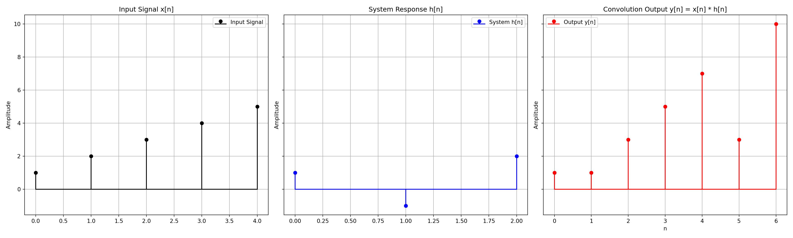
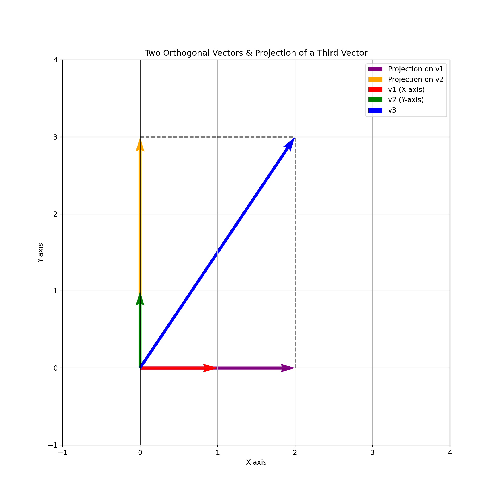
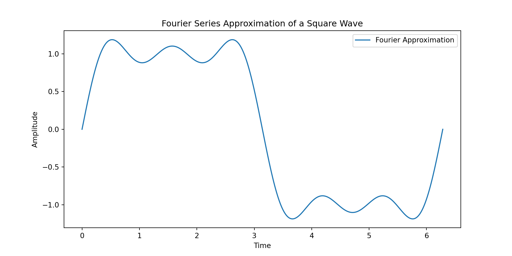
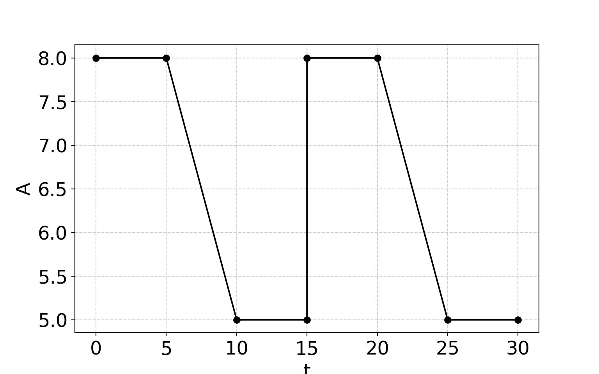
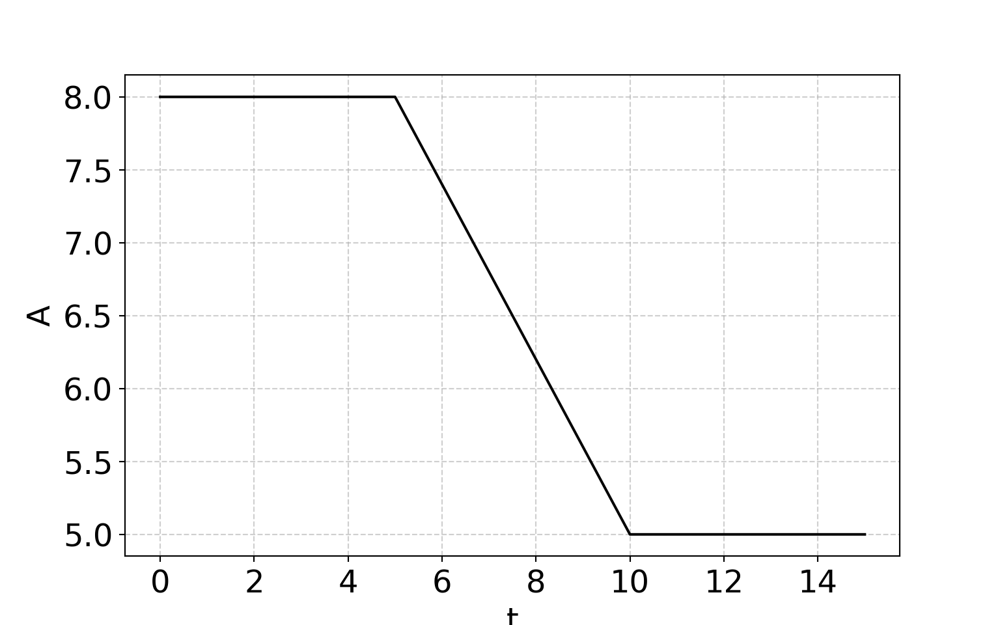
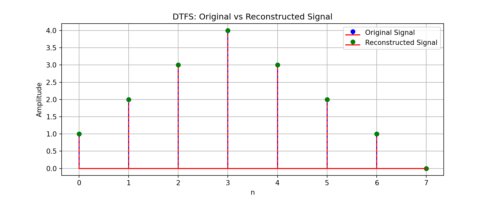
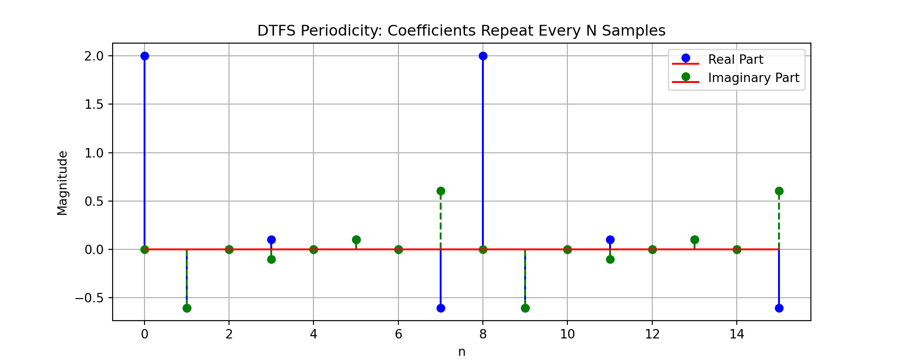

::: {.cell}

:::

::: {.cell}

:::


# Sistemas y Señales Biomedicos - SYSB

# Frequency Content

## Introduction

- Signals can be analyzed in both **time domain** and **frequency domain**.
- The **frequency content** of a signal describes how different frequency components contribute to the overall signal.
- Applications in **biomedical signals, audio processing, communications, and image processing**.

---

## Convolution in Time Domain

- Convolution is a fundamental operation in signal processing.
- Given two signals $x(t)$ and $h(t)$, their convolution is defined as:
  
  $$ y(t) = x(t) * h(t) = \int_{-\infty}^{\infty} x(\tau) h(t - \tau) d\tau $$
  
- In **discrete-time**, convolution is:
  
  $$ y[n] = \sum_{k=-\infty}^{\infty} x[k] h[n-k] $$

---

## Convolution Theorem

- **Convolution in time domain corresponds to multiplication in frequency domain**:
  
  $$ X(f) H(f) = Y(f) $$
  
- This property is crucial in filter design and system analysis.


::: {.cell layout-align="center"}
::: {.cell-output-display}
{fig-align='center' width=1920}
:::
:::


---

## Introduction to Fourier Series


::: {.cell layout-align="center"}
::: {.cell-output .cell-output-stdout}

```
(-1.0, 4.0)
```


:::

::: {.cell-output .cell-output-stdout}

```
(-1.0, 4.0)
```


:::

::: {.cell-output-display}
{fig-align='center' width=960}
:::
:::


---

## Introduction to Fourier Series

- **Convolution** requiere the representation of the signal in a sum of impulse functions.
- **Fourier series** represents periodic signals as a sum of sinusoids:
  
  $$ x(t) = \sum_{n=-\infty}^{\infty} C_n e^{jn\omega_0 t} $$
  
  where $C_n$ are the Fourier coefficients.

- Decomposing a signal into sinusoidal components allows **frequency analysis**.

---

## Fourier Coefficients

- The Fourier coefficients $C_n$ are computed as:
  
  $$ C_n = \frac{1}{T} \int_{0}^{T} x(t) e^{-jn\omega_0 t} dt $$

- Determines how much of each frequency is present in the signal.

---

## Example of Fourier Series Expansion


::: {.cell}
::: {.cell-output-display}
{width=960}
:::
:::


---

## Example 2 of Fourier Series


::: {.cell}
::: {.cell-output .cell-output-stdout}

```
(array([-5.,  0.,  5., 10., 15., 20., 25., 30., 35.]), [Text(-5.0, 0, '−5'), Text(0.0, 0, '0'), Text(5.0, 0, '5'), Text(10.0, 0, '10'), Text(15.0, 0, '15'), Text(20.0, 0, '20'), Text(25.0, 0, '25'), Text(30.0, 0, '30'), Text(35.0, 0, '35')])
```


:::

::: {.cell-output .cell-output-stdout}

```
(array([4.5, 5. , 5.5, 6. , 6.5, 7. , 7.5, 8. , 8.5]), [Text(0, 4.5, '4.5'), Text(0, 5.0, '5.0'), Text(0, 5.5, '5.5'), Text(0, 6.0, '6.0'), Text(0, 6.5, '6.5'), Text(0, 7.0, '7.0'), Text(0, 7.5, '7.5'), Text(0, 8.0, '8.0'), Text(0, 8.5, '8.5')])
```


:::

::: {.cell-output-display}
{width=768}
:::
:::


## Example 2 of Fourier Series


::: {.cell}
::: {.cell-output .cell-output-stdout}

```
(array([-40., -30., -20., -10.,   0.,  10.,  20.,  30.,  40.]), [Text(-40.0, 0, '−40'), Text(-30.0, 0, '−30'), Text(-20.0, 0, '−20'), Text(-10.0, 0, '−10'), Text(0.0, 0, '0'), Text(10.0, 0, '10'), Text(20.0, 0, '20'), Text(30.0, 0, '30'), Text(40.0, 0, '40')])
```


:::

::: {.cell-output .cell-output-stdout}

```
(array([4.5, 5. , 5.5, 6. , 6.5, 7. , 7.5, 8. , 8.5]), [Text(0, 4.5, '4.5'), Text(0, 5.0, '5.0'), Text(0, 5.5, '5.5'), Text(0, 6.0, '6.0'), Text(0, 6.5, '6.5'), Text(0, 7.0, '7.0'), Text(0, 7.5, '7.5'), Text(0, 8.0, '8.0'), Text(0, 8.5, '8.5')])
```


:::

::: {.cell-output-display}
{width=768}
:::
:::


## **Linearity**
- If $f_1(x)$ and $f_2(x)$ have Fourier series,
- Then for any constants $a, b$,
- $a f_1(x) + b f_2(x)$ has a Fourier series,
- With coefficients scaled accordingly.

---

## **Time Shifting**
- If $f(x)$ has Fourier coefficients $a_n, b_n$,
- Then $f(x - x_0)$ has coefficients:
- $a_n \cos(n\omega x_0) + b_n \sin(n\omega x_0)$,
- And $b_n \cos(n\omega x_0) - a_n \sin(n\omega x_0)$.

---

## **Frequency Scaling**
- If $g(x) = f(cx)$,
- Then the period scales by $c$,
- The fundamental frequency changes to $c\omega$,
- Fourier coefficients adjust accordingly.

---

## ** Differentiation Property**
- If $f(x)$ is differentiable,
- Then $f'(x)$ has Fourier series,
- With coefficients scaled as $n a_n, n b_n$,
- Higher frequencies get amplified.

---

## **Integration Property**
- If $f(x)$ has a Fourier series,
- Then $\int f(x) dx$ has a Fourier series,
- With coefficients scaled as $\frac{a_n}{n}, \frac{b_n}{n}$,
- Lower frequencies get emphasized.

---

## **Parseval’s Theorem**
- The total signal energy is conserved,
- Energy in time domain equals energy in frequency domain,
- Given by:
- $\sum (a_n^2 + b_n^2) = \frac{1}{T} \int |f(x)|^2 dx$.

---

## **Convolution Property**
- Convolution in time domain,
- Is multiplication in Fourier series coefficients,
- If $f_1$ and $f_2$ are convoluted,
- Their Fourier coefficients multiply component-wise.

---

## **Discrete Time Fourier Series**
- Represents periodic discrete signals using harmonics.
- Extends Fourier series to discrete-time domain.
- Fundamental in digital signal processing.
- Basis for the Discrete Fourier Transform (DFT).

---

## **Mathematical Expression**
- A periodic sequence $x[n]$ can be expressed as:
- $$x[n] = \sum_{k=0}^{N-1} C_k e^{j(2\pi k n / N)}$$.
- The coefficients $C_k$ are computed as:
- $C_k = \frac{1}{N} \sum_{n=0}^{N-1} x[n] e^{-j(2\pi k n / N)}$.

---

## **Periodicity and Symmetry**
- The coefficients $C_k$ repeat every $N$.
- Ensures correct reconstruction of signals.
- Explains frequency domain representation.
- Basis for spectral analysis.

---

## **Key Properties**
- **Linearity**: Superposition holds.
- **Time Shift**: Causes phase shift in coefficients.
- **Parseval’s Theorem**: Energy conservation.
- **Convolution**: Time convolution → Frequency multiplication.

---

## **Frequency Domain Interpretation**
- $C_k$ represents discrete frequency content.
- The spectrum consists of $N$ harmonics.
- Resolution improves with larger $N$.
- Essential for analyzing periodic discrete signals.

---

## **Comparison with Continuous Case**
- DTFS applies to discrete periodic signals.
- Continuous Fourier series applies to continuous functions.
- Both represent signals as sums of sinusoids.
- DTFS is used in digital communications and audio processing.


## Example of th DTFS


::: {.cell}
::: {.cell-output-display}
{width=960}
:::

::: {.cell-output .cell-output-stdout}

```
DTFS Coefficients:
```


:::

::: {.cell-output .cell-output-stdout}

```
C[0] = 2.0000+0.0000j
C[1] = -0.6036-0.6036j
C[2] = 0.0000+0.0000j
C[3] = 0.1036-0.1036j
C[4] = 0.0000+0.0000j
C[5] = 0.1036+0.1036j
C[6] = 0.0000+0.0000j
C[7] = -0.6036+0.6036j
```


:::
:::


## Example 02


::: {.cell}
::: {.cell-output-display}
{width=960}
:::
:::


## **Conceptual Foundation**
- Fourier Series represents periodic signals in terms of sinusoids.
- As period $T \to \infty$, the signal becomes aperiodic.
- The Fourier Transform generalizes Fourier Series to aperiodic signals.
- Transforms signals from time to frequency domain.

---

## **Mathematical Transition**
- Fourier Series of a periodic signal:
- $$f(x) = \sum_{n=-\infty}^{\infty} C_n e^{j(2\pi n x / T)}$$.
- As $T \to \infty$, frequency spacing $\frac{1}{T}$ → differential.
- Leads to the Fourier Transform:
- $$F(\omega) = \int_{-\infty}^{\infty} f(x) e^{-j\omega x} dx$$.

---

## **Frequency Spectrum Interpretation**
- Fourier Series: discrete frequency spectrum.
- Fourier Transform: continuous frequency spectrum.
- Coefficients $C_n$ become the function $F(\omega)$.
- Allows analysis of arbitrary signals in frequency domain.

---

## **Inverse Fourier Transform**
- Recovers time-domain signal from $F(\omega)$.
- Defined as:
- $$f(x) = \frac{1}{2\pi} \int_{-\infty}^{\infty} F(\omega) e^{j\omega x} d\omega$$.
- Ensures complete information preservation.
- Basis for signal reconstruction in DSP.

---

## **Energy and Parseval’s Theorem**
- Energy conservation in time and frequency domains.
- Parseval’s theorem states:
- $$\int |f(x)|^2 dx = \frac{1}{2\pi} \int |F(\omega)|^2 d\omega$$
- Ensures no energy loss between domains.