```{=html}
<style>
:root {
  --sysb-navy: #123047;
  --sysb-teal: #008c86;
  --sysb-coral: #e76f51;
  --sysb-gold: #d9a441;
  --sysb-light: #eef4f7;
}
.reveal { color: var(--sysb-navy); font-family: "Aptos", "Segoe UI", Arial, sans-serif; }
.reveal .slides { text-align: left; }
.reveal h1, .reveal h2 { color: var(--sysb-navy); letter-spacing: -0.02em; text-transform: none; }
.reveal h1 { color: white; font-size: 2.15em; }
.reveal h2 { border-bottom: 5px solid var(--sysb-teal); padding-bottom: 0.16em; font-size: 1.55em; }
.reveal h3 { color: var(--sysb-teal); text-transform: none; }
.reveal section.level1 { background: linear-gradient(135deg, var(--sysb-navy) 0%, #20556f 68%, var(--sysb-teal) 100%); color: white; padding: 5%; border-radius: 18px; }
.reveal section.level1 h1, .reveal section.level1 h2, .reveal section.level1 p { color: white; }
.reveal .callout { font-size: 0.83em; border-radius: 12px; }
.reveal .callout-title-container { font-weight: 750; }
.reveal table { font-size: 0.72em; }
.reveal pre code { font-size: 0.80em; line-height: 1.25; }
.reveal .small { font-size: 0.72em; }
.reveal .smaller { font-size: 0.64em; }
.reveal .shrink { font-size: 0.82em; }
.reveal .center { text-align: center; }
.reveal .accent { color: var(--sysb-coral); font-weight: 750; }
.reveal .muted { color: #657582; }
.reveal img { max-height: 610px; }
.reveal .quarto-title-author-name { color: var(--sysb-teal); }
.reveal .footer { color: #607583; }
</style>
```

<!-- ## Ruta de aprendizaje de las primeras cinco semanas

1. **Semana 1:** reconocer qué es una bioseñal y por qué medirla es un problema de ingeniería.
2. **Semana 2:** representar señales y cuantificar su comportamiento temporal.
3. **Semana 3:** comprender sinusoides, periodicidad y transformaciones.
4. **Semana 4:** convertir registros temporales en características interpretables.
5. **Semana 5:** explicar por qué Fourier permite observar estructura que no es evidente en el tiempo.

::: {.callout-note icon=false title="Idea conductora"}
Una medición biomédica no es la fisiología misma: es una **representación parcial**, obtenida mediante un sensor y condicionada por el contexto de adquisición.
::: -->

## Cómo estudiar con estas diapositivas

:::: {.columns}

::: {.column width="48%"}
### Antes de cada clase

- Revise los objetivos y conceptos previos.
- Identifique las variables y sus unidades.
- Intente responder la pregunta inicial.
:::

::: {.column width="48%"}
### Después de cada clase

- Reproduzca los ejemplos en Python.
- Interprete los resultados fisiológicamente.
- Resuelva las preguntas de verificación sin consultar las respuestas.
:::

::::

::: {.callout-warning icon=false title="Alcance"}
Las señales usadas en los ejemplos son sintéticas y tienen propósito didáctico. No representan registros clínicos ni permiten realizar diagnósticos.
:::

# Semana 1 · Sesión 1

## ¿Por qué estudiar señales y sistemas biomédicos?

Una observación fisiológica puede responder preguntas diferentes:

- **Descripción:** ¿qué ocurrió durante el registro?
- **Medición:** ¿cuánto cambió una variable?
- **Comparación:** ¿existen diferencias entre condiciones?
- **Monitoreo:** ¿el comportamiento cambia con el tiempo?
- **Decisión:** ¿la evidencia es suficientemente confiable para actuar?

::: {.callout-important icon=false title="Punto central"}
Procesar una bioseñal significa transformar una medición en evidencia interpretable, conservando la relación con el fenómeno fisiológico que la originó.
:::

## Una señal es una función que porta información

Formalmente, una señal puede expresarse como

$$
x:\mathcal{T}\longrightarrow\mathcal{A},
$$

donde:

- $\mathcal{T}$ es el dominio de la variable independiente: tiempo, posición o índice de muestra.
- $\mathcal{A}$ es el conjunto de valores posibles: amplitudes escalares, vectores o matrices.
- $x(t)$ o $x[n]$ relaciona cada instante o muestra con una medición.

::: {.callout-note icon=false title="No confunda dato con señal"}
Un valor aislado es un dato. Una señal conserva una **estructura de dependencia** respecto al tiempo, al espacio o a otra variable independiente.
:::

## Las unidades hacen parte del significado {.shrink}

| Señal | Variable independiente | Amplitud habitual | Pregunta posible |
|---|---|---|---|
| ECG | tiempo (s) | tensión eléctrica (mV) | ¿cómo evoluciona la actividad eléctrica cardiaca? |
| EMG | tiempo (s) | tensión eléctrica ($\mu$V–mV) | ¿cómo cambia la activación muscular? |
| EEG | tiempo (s) | tensión eléctrica ($\mu$V) | ¿qué patrones oscilatorios aparecen? |
| Respiración | tiempo (s) | flujo, volumen o desplazamiento | ¿cómo varía el ciclo respiratorio? |

::: {.callout-warning icon=false title="Error frecuente"}
Comparar amplitudes sin revisar unidades, ganancia, montaje, sensor y condiciones de adquisición conduce a conclusiones inválidas.
:::

## Cuatro familias de bioseñales sintéticas {.shrink}

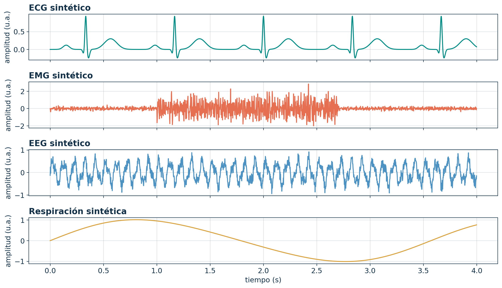{fig-alt="Cuatro señales sintéticas: ECG, EMG, EEG y respiración" width="84%"}

::: {.callout-tip icon=false title="Lectura de la figura"}
Observe cómo cambian la morfología, la escala temporal y el grado de aleatoriedad. Esas diferencias orientan la elección de las herramientas de análisis.
:::

## Del fenómeno fisiológico al dato digital {.shrink}

| Etapa | Pregunta de ingeniería | Ejemplo |
|---|---|---|
| **Fuente** | ¿qué mecanismo genera la variable? | despolarización celular |
| **Propagación** | ¿cómo llega hasta la superficie? | conducción volumétrica |
| **Sensor** | ¿qué magnitud detecta? | diferencia de potencial |
| **Acondicionamiento** | ¿cómo se adapta y protege la medición? | amplificación y filtrado analógico |
| **Digitalización** | ¿cómo se representa numéricamente? | muestras y códigos digitales |
| **Análisis** | ¿qué característica responde la pregunta? | intervalos, potencia o eventos |

::: {.callout-note icon=false title="Modelo conceptual"}
El registro depende tanto de la fuente fisiológica como del trayecto de propagación, del sensor y del sistema de adquisición [@kaniusas2012].
:::

## Bioseñal, variable fisiológica y registro no son sinónimos

:::: {.columns}

::: {.column width="48%"}
### Variable fisiológica

Magnitud asociada con un proceso biológico: presión, temperatura, concentración, actividad eléctrica o movimiento.

### Bioseñal

Evolución observable de una variable que porta información del organismo.
:::

::: {.column width="48%"}
### Registro

Representación producida por un instrumento bajo condiciones específicas.

### Característica

Cantidad extraída del registro: RMS, intervalo, pendiente, energía o frecuencia dominante.
:::

::::

::: {.callout-important icon=false title="Consecuencia"}
Una característica solo tiene sentido si puede vincularse con una pregunta fisiológica y con un procedimiento de medición reproducible.
:::

## El contexto cambia la interpretación

Una misma amplitud puede tener significados distintos según:

- el tipo y la ubicación del sensor;
- la postura, tarea o condición experimental;
- la frecuencia de muestreo y el ancho de banda;
- la referencia empleada y la ganancia instrumental;
- la presencia de artefactos;
- la población y el objetivo del análisis.

::: {.callout-caution icon=false title="Criterio crítico"}
Una forma de onda visualmente plausible no garantiza que el registro sea fisiológicamente válido.
:::

## Caso orientador: una amplitud EMG aumentó

¿Qué explicaciones deben considerarse antes de atribuir el cambio a una mayor activación muscular?

1. Cambio real en el reclutamiento neuromuscular.
2. Modificación de la posición u orientación de los electrodos.
3. Variación de la impedancia de contacto.
4. Diferencia de ganancia o escala.
5. Contaminación por movimiento o actividad de músculos cercanos.

::: {.callout-tip icon=false title="Regla de análisis"}
Antes de interpretar una característica, enumere explicaciones fisiológicas, instrumentales y computacionales alternativas.
:::

## Verificación rápida

Clasifique cada enunciado como **variable fisiológica**, **señal**, **registro** o **característica**:

1. Diferencia de potencial almacenada por un electrocardiógrafo.
2. Actividad eléctrica resultante de la despolarización cardiaca.
3. Intervalo temporal entre dos eventos detectados.
4. Variación temporal del flujo respiratorio.

::: {.callout-note icon=false title="Criterio de respuesta" collapse="true"}
1. Registro. 2. Variable fisiológica. 3. Característica. 4. Señal.
:::

## Cierre de la sesión 1

::: {.callout-important icon=false title="Tres ideas que deben permanecer"}
1. Una señal es una función que representa información respecto a una variable independiente.  
2. Una bioseñal registrada está condicionada por la fisiología y por la cadena de medición.  
3. Ninguna característica debe interpretarse sin unidades, contexto y pregunta de análisis.
:::

**Pregunta para enlazar con la sesión siguiente:** si el registro no contiene únicamente fisiología, ¿cómo distinguimos la información útil de la contaminación?

# Semana 1 · Sesión 2

## Una bioseñal puede codificar distintos fenómenos físicos {.shrink}

| Modalidad | Fenómeno | Ejemplo | Transducción posible |
|---|---|---|---|
| Eléctrica | potenciales y corrientes iónicas | ECG, EMG, EEG | electrodos |
| Mecánica | desplazamiento, fuerza o presión | marcha, pulso arterial | acelerómetro, celda de carga |
| Acústica | vibración y propagación sonora | fonocardiograma | micrófono |
| Óptica | absorción, reflexión o dispersión | fotopletismografía | emisor y fotodetector |
| Química | concentración o actividad molecular | glucosa, pH | biosensor electroquímico |
| Térmica | intercambio y distribución de calor | temperatura cutánea | termistor |

::: {.callout-note icon=false title="Concepto principal"}
El sensor no “ve” directamente el estado de salud: responde a una magnitud física relacionada con un fenómeno biológico.
:::

## Un sistema transforma entradas en salidas

Un sistema puede representarse mediante un operador $\mathcal{H}\{\cdot\}$:

$$
y(t)=\mathcal{H}\{x(t)\}.
$$

- $x(t)$: entrada o estímulo observable.
- $\mathcal{H}$: dinámica, relación o proceso.
- $y(t)$: respuesta medida.

::: {.callout-tip icon=false title="Ejemplo biomédico"}
La actividad neural puede actuar como entrada; la activación muscular y el movimiento articular son respuestas relacionadas, pero no equivalentes.
:::

## Los sistemas biológicos contienen estado, realimentación y variabilidad

Un modelo más realista distingue entrada, estado interno y observación:

$$
\dot{\mathbf{x}}(t)=f\big(\mathbf{x}(t),\mathbf{u}(t),t\big),
\qquad
\mathbf{y}(t)=g\big(\mathbf{x}(t),\mathbf{u}(t),t\big).
$$

- $\mathbf{u}(t)$: estímulos o entradas.
- $\mathbf{x}(t)$: variables internas no siempre observables.
- $\mathbf{y}(t)$: mediciones disponibles.

::: {.callout-warning icon=false title="Limitación del modelo"}
Una salida similar puede ser producida por estados internos diferentes. Este problema de **identificabilidad** impide inferir automáticamente la causa fisiológica.
:::

## Modelo mínimo de una medición contaminada {.shrink}

Una representación útil es

$$
y(t)=\mathcal{M}\{s(t)\}+n(t)+i(t)+a(t),
$$

donde:

- $s(t)$: fenómeno fisiológico de interés;
- $\mathcal{M}$: cadena de medición;
- $n(t)$: ruido aleatorio;
- $i(t)$: interferencia estructurada;
- $a(t)$: artefacto asociado con el procedimiento o el sujeto.

::: {.callout-important icon=false title="Interpretación"}
El procesamiento busca mejorar la utilidad de $y(t)$ sin destruir la información de $s(t)$ ni crear patrones inexistentes.
:::

## La señal observada es una superposición {.shrink}

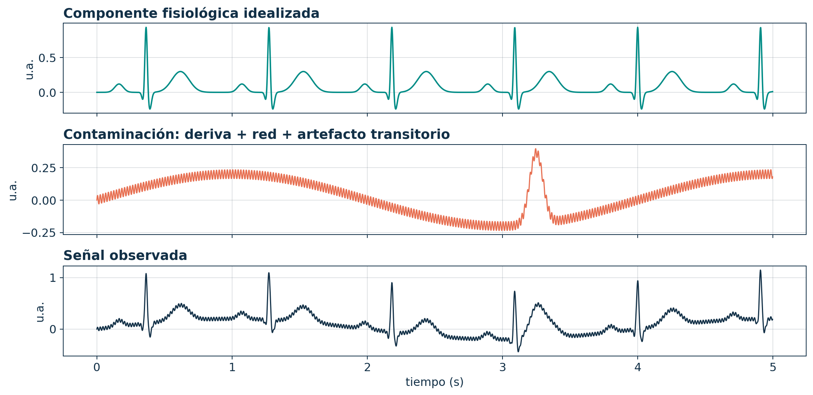{fig-alt="Señal fisiológica, contaminación y señal observada" width="84%"}

::: {.callout-warning icon=false title="No todo lo indeseado es ruido"}
La deriva de línea base, la interferencia de red y un artefacto de movimiento tienen estructura diferente; por tanto, requieren estrategias diferentes.
:::

## Ruido, interferencia y artefacto {.shrink}

| Término | Rasgo dominante | Ejemplo | Pregunta de control |
|---|---|---|---|
| **Ruido** | componente aleatoria | ruido térmico | ¿puede caracterizarse estadísticamente? |
| **Interferencia** | fuente externa estructurada | red eléctrica | ¿su frecuencia o forma es reconocible? |
| **Artefacto** | relación con sujeto o procedimiento | movimiento del electrodo | ¿coincide con una acción o cambio experimental? |
| **Variabilidad fisiológica** | cambio real del organismo | modulación respiratoria | ¿es información que debe conservarse? |

::: {.callout-caution icon=false title="Error frecuente"}
Eliminar toda variabilidad puede suprimir precisamente la información fisiológica que se desea estudiar.
:::

## Relación señal-ruido

Si se conocen las potencias de señal y ruido:

$$
\mathrm{SNR}_{\mathrm{dB}}
=10\log_{10}\left(\frac{P_s}{P_n}\right).
$$

Si se comparan valores RMS bajo supuestos compatibles:

$$
\mathrm{SNR}_{\mathrm{dB}}
=20\log_{10}\left(\frac{x_{\mathrm{RMS}}}{n_{\mathrm{RMS}}}\right).
$$

::: {.callout-note icon=false title="Lectura correcta"}
Una SNR mayor indica mejor separación energética entre señal y ruido; no demuestra por sí sola que la señal conserve significado fisiológico.
:::

## La calidad depende de la pregunta

Una señal puede ser adecuada para una tarea y deficiente para otra:

- Un ECG puede permitir estimar ritmo, pero no medir con precisión segmentos de baja amplitud.
- Un EMG puede detectar el inicio de la contracción, pero no permitir comparar amplitudes entre sesiones.
- Un EEG puede mostrar actividad oscilatoria, pero contener artefactos que alteran conectividad.

::: {.callout-important icon=false title="Definición operativa"}
La calidad de señal es la capacidad del registro para responder de manera válida y reproducible una pregunta concreta.
:::

## Actividad: auditoría de una medición

Seleccione una señal entre ECG, EMG, EEG o respiración y complete:

1. Fuente fisiológica de interés.
2. Magnitud física detectada.
3. Sensor y ubicación.
4. Dos contaminantes plausibles.
5. Una característica que respondería la pregunta.
6. Una conclusión que **no** estaría justificada.

::: {.callout-tip icon=false title="Criterio de calidad"}
Una buena respuesta separa explícitamente fisiología, adquisición y procesamiento.
:::

## Cierre de la semana 1

::: {.callout-important icon=false title="Síntesis"}
La bioseñal es el resultado de una cadena: **fuente fisiológica → propagación → sensor → acondicionamiento → representación digital → análisis**. Cada etapa introduce supuestos y posibles distorsiones [@kaniusas2012; @semmlow2014].
:::

**Preparación para la semana 2:** repase funciones, variables independientes, vectores, media, varianza y notación de sumatoria.

# Semana 2 · Sesión 1

## Representar una señal es decidir qué se conserva

Al finalizar esta sesión podrá:

- distinguir señales continuas y discretas;
- separar continuidad temporal de continuidad en amplitud;
- representar señales escalares y multicanal;
- construir ejes temporales coherentes en Python;
- reconocer cuándo un arreglo numérico todavía carece de contexto físico.

::: {.callout-note icon=false title="Pregunta inicial"}
Si dos archivos contienen exactamente los mismos números, ¿representan necesariamente la misma señal?
:::

## La variable independiente determina el dominio

| Notación | Dominio | Interpretación |
|---|---|---|
| $x(t)$ | $t\in\mathbb{R}$ | modelo en tiempo continuo |
| $x[n]$ | $n\in\mathbb{Z}$ | secuencia indexada por muestras |
| $x(\mathbf{r})$ | $\mathbf{r}\in\mathbb{R}^d$ | señal espacial |
| $x[m,n]$ | $(m,n)\in\mathbb{Z}^2$ | imagen digital |
| $\mathbf{x}(t)$ | vector por cada $t$ | señal multicanal |

::: {.callout-important icon=false title="Concepto principal"}
La notación comunica qué valores puede tomar la variable independiente. Cambiar $t$ por $n$ no es un detalle tipográfico: cambia el modelo matemático.
:::

## Tiempo continuo y tiempo discreto {.shrink}

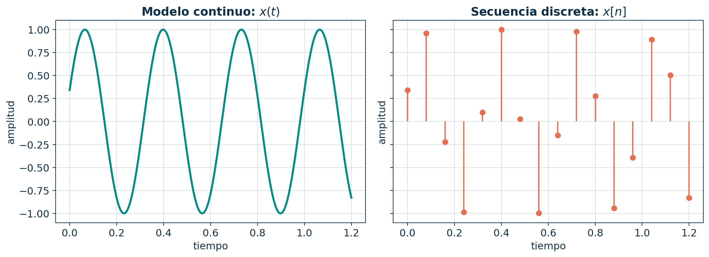{fig-alt="Comparación entre señal continua y secuencia discreta" width="84%"}

::: {.callout-note icon=false title="Interpretación"}
La curva continua representa un valor para todo $t$ del intervalo. La secuencia solo está definida en índices enteros o instantes de muestreo.
:::

## Cuatro combinaciones que suelen confundirse

| Tiempo | Amplitud | Representación | Ejemplo conceptual |
|---|---|---|---|
| continuo | continua | señal analógica ideal | tensión antes del convertidor |
| discreto | continua | muestras sin cuantizar | modelo matemático del muestreo |
| continuo | discreta | cambio entre niveles | señal binaria idealizada |
| discreto | discreta | señal digital | códigos almacenados |

::: {.callout-warning icon=false title="Error frecuente"}
“Discreta” puede referirse al dominio temporal o a los niveles de amplitud. Para evitar ambigüedad, indique cuál de los dos está discretizado.
:::

## Índice de muestra y tiempo físico

Si la frecuencia de muestreo es $f_s$, el intervalo entre muestras es

$$
T_s=\frac{1}{f_s},
$$

y la muestra $n$ corresponde al instante

$$
t_n=nT_s=\frac{n}{f_s}.
$$

::: {.callout-important icon=false title="Consecuencia"}
El arreglo `x` contiene amplitudes; para interpretar duración, latencia o frecuencia también se necesita conocer $f_s$.
:::

## Construir correctamente el eje temporal en Python

```python
import numpy as np

fs = 500                 # muestras por segundo
duration = 4.0           # segundos
n = np.arange(int(fs * duration))
t = n / fs               # tiempo físico de cada muestra

x = np.sin(2 * np.pi * 10 * t)
print(x.shape, t[-1])
```

::: {.callout-warning icon=false title="Detalle importante"}
Con `N = fs*duration`, el último instante es $(N-1)/f_s$, no exactamente `duration`.
:::

## Una señal digital necesita metadatos

Un registro reproducible debería especificar, como mínimo:

- frecuencia de muestreo y unidad temporal;
- unidad de amplitud y factor de escala;
- número, nombre y orden de canales;
- sistema de referencia o montaje;
- fecha, condición y duración de adquisición;
- valores ausentes, saturaciones o segmentos excluidos.

::: {.callout-caution icon=false title="Contrato de datos"}
Sin metadatos, un vector es una secuencia de números; no una medición biomédica interpretable.
:::

## Señales escalares y vectoriales

Una señal escalar asigna un valor a cada instante:

$$x(t)\in\mathbb{R}.$$

Una señal de $M$ canales asigna un vector:

$$
\mathbf{x}(t)=
\begin{bmatrix}
x_1(t)&x_2(t)&\cdots&x_M(t)
\end{bmatrix}^{\mathsf T}.
$$

::: {.callout-note icon=false title="Ejemplos"}
Un ECG de varias derivaciones, un EEG multicanal y una plataforma de fuerza producen observaciones vectoriales.
:::

## Los canales no son repeticiones de la misma señal {.shrink}

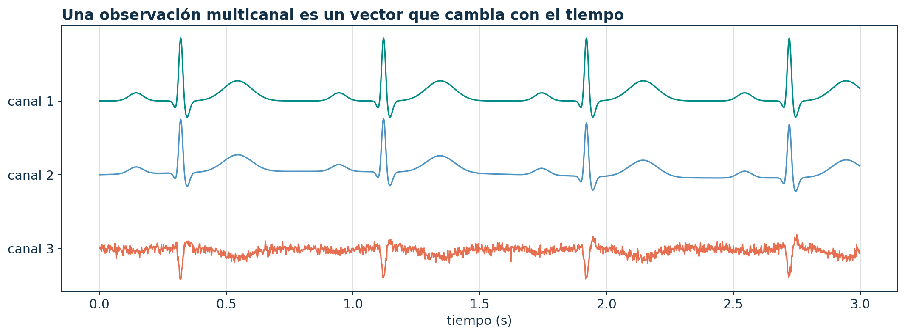{fig-alt="Tres canales sintéticos con morfologías relacionadas" width="85%"}

::: {.callout-tip icon=false title="Lectura"}
Los canales pueden compartir una fuente, pero su amplitud y polaridad dependen de la geometría, la referencia y la sensibilidad del sensor.
:::

## Convenciones para arreglos multicanal {.shrink}

Dos organizaciones comunes son:

$$
\mathbf{X}\in\mathbb{R}^{N\times M}
\quad\text{o}\quad
\mathbf{X}\in\mathbb{R}^{M\times N},
$$

donde $N$ es el número de muestras y $M$ el número de canales.

```python
# muestras por filas, canales por columnas
X = np.column_stack([ecg_I, ecg_II, ecg_III])
N, M = X.shape

# seleccionar canal 2
x2 = X[:, 1]
```

::: {.callout-important icon=false title="Regla práctica"}
Documente la orientación del arreglo. Un error de ejes puede mezclar operaciones temporales con operaciones entre canales.
:::

## Actividad: audite un arreglo

Se recibe `X.shape == (60000, 8)` y solo se informa que corresponde a EEG.

1. Proponga dos interpretaciones posibles de los ejes.
2. Enumere cuatro metadatos indispensables.
3. Si $f_s=250$ Hz y hay 60 000 muestras temporales, calcule la duración.
4. Explique por qué el número de canales no permite inferir el montaje.

::: {.callout-note icon=false title="Respuesta parcial" collapse="true"}
Si las 60 000 posiciones son muestras, la duración nominal es $60000/250=240$ s. La forma del arreglo por sí sola no identifica qué eje corresponde al tiempo.
:::

## Cierre de la sesión 3

::: {.callout-important icon=false title="Síntesis"}
Una representación útil exige conocer el dominio, las unidades, la frecuencia de muestreo y la organización de los canales. Python manipula arreglos; el significado biomédico depende del contrato de datos.
:::

**Conexión:** una vez representada la señal, necesitamos medidas que resuman su comportamiento sin perder de vista el intervalo analizado.

# Semana 2 · Sesión 2

## Medir una señal es resumirla bajo un supuesto

Al finalizar esta sesión podrá:

- calcular medidas de localización, dispersión y magnitud;
- diferenciar energía y potencia promedio;
- interpretar RMS y amplitud pico a pico;
- reconocer la dependencia respecto a la ventana;
- evitar comparaciones inválidas entre registros.

::: {.callout-note icon=false title="Pregunta inicial"}
¿Puede una sola cifra describir adecuadamente una señal con eventos transitorios y oscilaciones sostenidas?
:::

## Media: nivel promedio con signo

Para $N$ muestras,

$$
\bar{x}=\frac{1}{N}\sum_{n=0}^{N-1}x[n].
$$

- Detecta desplazamientos del nivel basal.
- Puede ser cercana a cero aunque la señal tenga amplitud elevada.
- Es sensible a valores extremos.

::: {.callout-warning icon=false title="Error frecuente"}
Media cercana a cero no significa “ausencia de señal”. Una oscilación simétrica puede tener media cero y potencia distinta de cero.
:::

## Varianza y desviación estándar miden dispersión

Varianza poblacional:

$$
\sigma_x^2=\frac{1}{N}\sum_{n=0}^{N-1}\big(x[n]-\bar{x}\big)^2.
$$

Desviación estándar:

$$
\sigma_x=\sqrt{\sigma_x^2}.
$$

::: {.callout-note icon=false title="Interpretación"}
La varianza tiene unidades al cuadrado; la desviación estándar conserva las unidades de amplitud de la señal.
:::

## RMS cuantifica magnitud cuadrática

$$
x_{\mathrm{RMS}}
=\sqrt{\frac{1}{N}\sum_{n=0}^{N-1}x^2[n]}.
$$

- No cancela valores positivos y negativos.
- Aumenta con componentes de gran amplitud.
- Se relaciona con potencia promedio cuando la amplitud representa una magnitud física compatible.

::: {.callout-important icon=false title="Relación útil"}
Si $\bar{x}=0$, entonces $x_{\mathrm{RMS}}=\sigma_x$. En general, $x_{\mathrm{RMS}}^2=\sigma_x^2+\bar{x}^2$.
:::

## Media y RMS responden preguntas diferentes {.shrink}

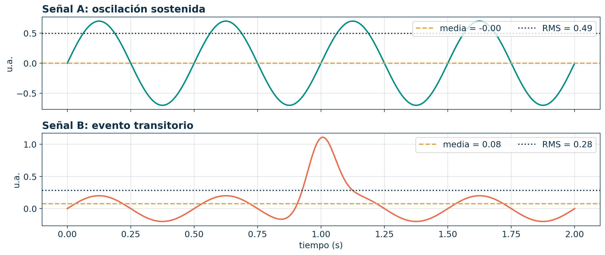{fig-alt="Comparación de media y RMS en dos señales sintéticas" width="84%"}

::: {.callout-tip icon=false title="Observe"}
La señal oscilatoria presenta media casi nula y RMS apreciable. El evento transitorio modifica tanto la media como el RMS, pero su efecto depende de la duración del registro.
:::

## Amplitud pico a pico y factor de cresta {.shrink}

Amplitud pico a pico:

$$x_{pp}=\max(x)-\min(x).$$

Factor de cresta:

$$C=\frac{\max |x[n]|}{x_{\mathrm{RMS}}}.$$

::: {.callout-note icon=false title="Lectura"}
$x_{pp}$ describe el rango observado; el factor de cresta contrasta el máximo con la magnitud típica y ayuda a señalar eventos impulsivos.
:::

::: {.callout-warning icon=false title="Limitación"}
Ambas medidas son sensibles a artefactos y valores extremos. No deben interpretarse sin inspección y control de calidad.
:::

## Energía y potencia promedio

Para una secuencia de energía:

$$
E_x=\sum_{n=-\infty}^{\infty}|x[n]|^2.
$$

Para una señal persistente, la potencia promedio se define como

$$
P_x=\lim_{N\to\infty}\frac{1}{2N+1}
\sum_{n=-N}^{N}|x[n]|^2.
$$

::: {.callout-important icon=false title="Distinción"}
Una señal transitoria puede tener energía finita y potencia promedio nula; una señal periódica no nula suele tener energía infinita y potencia promedio finita.
:::

## La duración de análisis modifica el resultado

Suponga un evento de energía fija dentro de ventanas cada vez más largas:

- la energía acumulada puede permanecer aproximadamente estable;
- el valor RMS disminuye al incluir más muestras sin actividad;
- la media y la varianza cambian con la proporción entre evento y reposo.

::: {.callout-caution icon=false title="Consecuencia metodológica"}
Comparar RMS, media o varianza exige usar ventanas equivalentes y justificar su relación con el fenómeno fisiológico.
:::

## El RMS móvil revela variación temporal {.shrink}

Para una ventana de $L$ muestras:

$$
x_{\mathrm{RMS}}[n]
=\sqrt{\frac{1}{L}\sum_{k=0}^{L-1}x^2[n-k]}.
$$

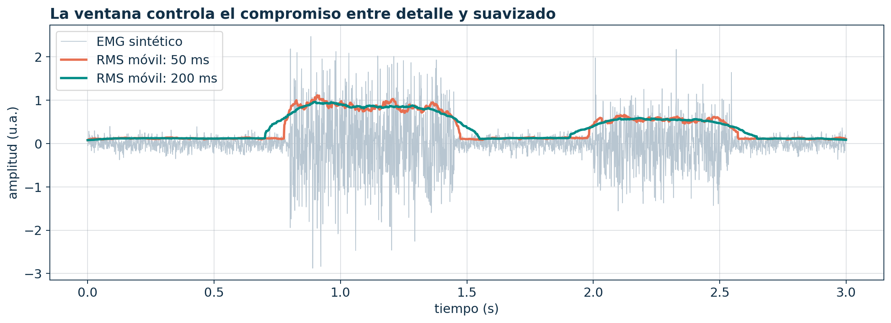{fig-alt="EMG sintético y RMS móvil con dos longitudes de ventana" width="80%"}

::: {.callout-note icon=false title="Compromiso"}
Una ventana corta sigue cambios rápidos, pero fluctúa más. Una ventana larga suaviza, pero reduce la precisión temporal.
:::

## Cálculo reproducible en Python {.shrink}

```python
import numpy as np

def temporal_features(x):
    x = np.asarray(x, dtype=float)
    return {
        "mean": np.mean(x),
        "std": np.std(x, ddof=0),
        "rms": np.sqrt(np.mean(x**2)),
        "peak_to_peak": np.ptp(x),
        "energy": np.sum(x**2),
    }
```

::: {.callout-tip icon=false title="Buena práctica"}
La función calcula números; el reporte debe añadir unidades, ventana, preprocesamiento y significado fisiológico.
:::

## Antes de comparar dos registros

Verifique:

1. misma unidad y factor de escala;
2. misma duración o estrategia de segmentación;
3. mismo ancho de banda y referencia;
4. ausencia de saturación;
5. proporción comparable de actividad y reposo;
6. tratamiento consistente de artefactos;
7. métrica vinculada con la pregunta.

::: {.callout-important icon=false title="Principio de comparabilidad"}
Dos números solo son comparables cuando proceden de definiciones y condiciones equivalentes.
:::

## Actividad: elija una métrica defendible

Para cada objetivo, seleccione una métrica inicial y señale una limitación:

- detectar desplazamiento de línea base;
- cuantificar magnitud de una contracción EMG;
- describir un evento extremo;
- comparar dispersión entre segmentos;
- resumir una oscilación periódica.

::: {.callout-tip icon=false title="No existe una respuesta universal"}
La selección se evalúa por la coherencia entre objetivo, definición matemática y comportamiento esperado de la señal.
:::

## Cierre de la semana 2

::: {.callout-important icon=false title="Síntesis"}
Las métricas temporales son resúmenes dependientes de la ventana. Media, desviación, RMS, energía y amplitud pico a pico describen propiedades diferentes; ninguna reemplaza la inspección ni el contexto biomédico.
:::

**Preparación para la semana 3:** repase trigonometría, radianes, frecuencia, periodo y operaciones sobre funciones.

# Semana 3 · Sesión 1

## La sinusoide es un bloque fundamental

Al finalizar esta sesión podrá:

- interpretar amplitud, periodo, frecuencia y fase;
- convertir entre frecuencia ordinaria y angular;
- establecer periodicidad en tiempo continuo y discreto;
- determinar cuándo la suma de señales periódicas también es periódica;
- generar sinusoides correctamente en Python.

::: {.callout-note icon=false title="Pregunta inicial"}
¿Dos sinusoides con la misma frecuencia, pero diferente fase, contienen la misma información temporal?
:::

## Modelo de una sinusoide continua

$$
x(t)=A\cos(2\pi f_0t+\phi)
=A\cos(\omega_0t+\phi).
$$

| Parámetro | Significado | Unidad |
|---|---|---|
| $A$ | amplitud máxima respecto al nivel cero | unidad de $x$ |
| $f_0$ | ciclos por segundo | Hz |
| $T_0$ | duración de un ciclo | s |
| $\omega_0$ | frecuencia angular | rad/s |
| $\phi$ | desplazamiento angular inicial | rad |

::: {.callout-important icon=false title="Relaciones esenciales"}
$T_0=1/f_0$ y $\omega_0=2\pi f_0$.
:::

## Lea cada parámetro en la forma de onda {.shrink}

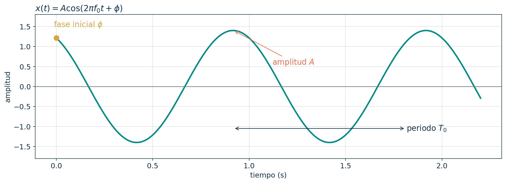{fig-alt="Parámetros de una señal sinusoidal" width="84%"}

::: {.callout-note icon=false title="Interpretación"}
La amplitud escala verticalmente; el periodo controla la repetición horizontal; la fase modifica la posición del ciclo respecto al origen.
:::

## Frecuencia no es rapidez de propagación

- **Frecuencia:** número de ciclos por unidad de tiempo.
- **Periodo:** duración de un ciclo.
- **Fase:** posición dentro del ciclo.
- **Velocidad de propagación:** rapidez con la que una perturbación se desplaza en el espacio.

::: {.callout-warning icon=false title="Error conceptual"}
Una oscilación de mayor frecuencia repite ciclos más rápidamente, pero ello no implica que se propague más rápido por un tejido.
:::

## La fase expresa alineación temporal relativa {.shrink}

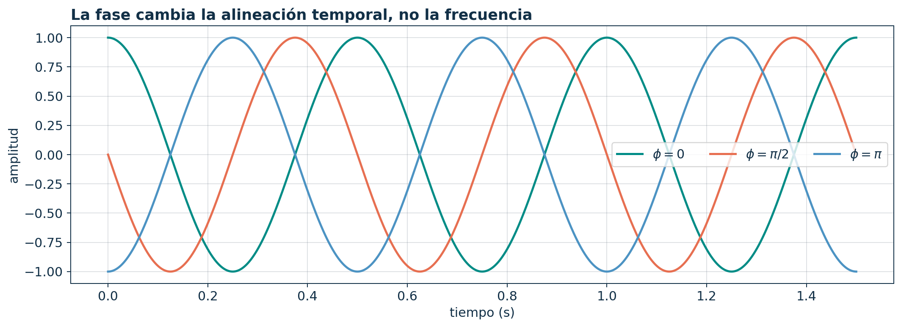{fig-alt="Tres cosenos de igual frecuencia y diferente fase" width="83%"}

Para una frecuencia fija, una fase $\phi$ equivale a un desplazamiento temporal

$$
t_0=-\frac{\phi}{\omega_0},
$$

según la convención $x(t)=A\cos(\omega_0t+\phi)$.

## Periodicidad en tiempo continuo

Una señal es periódica si existe $T>0$ tal que

$$x(t+T)=x(t)\quad\text{para todo }t.$$

El menor valor positivo que satisface la condición se denomina **periodo fundamental** $T_0$.

::: {.callout-warning icon=false title="Precisión matemática"}
No todo valor que satisface la igualdad es fundamental. Si $T_0$ es fundamental, $2T_0$, $3T_0$, … también son periodos.
:::

## Periodicidad en tiempo discreto {.shrink}

Una secuencia es periódica si existe un entero $N>0$ tal que

$$x[n+N]=x[n]\quad\text{para todo }n.$$

Para

$$x[n]=A\cos(\Omega_0n+\phi),$$

la secuencia es periódica si y solo si

$$\frac{\Omega_0}{2\pi}\in\mathbb{Q}.$$

::: {.callout-important icon=false title="Diferencia clave"}
Toda sinusoide continua es periódica. Una sinusoide discreta no necesariamente lo es.
:::

## Ejemplo de periodicidad discreta

Considere

$$x[n]=\cos\left(\frac{3\pi}{5}n\right).$$

Buscamos enteros $N,k>0$ tales que

$$\frac{3\pi}{5}N=2\pi k
\quad\Longrightarrow\quad 3N=10k.$$

El menor $N$ que satisface la igualdad es $N_0=10$.

::: {.callout-tip icon=false title="Procedimiento"}
Iguale $\Omega_0N$ con un múltiplo entero de $2\pi$ y encuentre el menor $N$ positivo.
:::

## ¿Cuándo es periódica la suma?

Si $x_1(t)$ y $x_2(t)$ tienen periodos fundamentales $T_1$ y $T_2$, la suma será periódica cuando

$$
\frac{T_1}{T_2}\in\mathbb{Q}.
$$

El periodo común es un múltiplo simultáneo de $T_1$ y $T_2$.

::: {.callout-note icon=false title="Lectura"}
La existencia de un periodo común exige que los ciclos puedan volver a alinearse exactamente.
:::

## Dos periodos conmensurables vuelven a alinearse {.shrink}

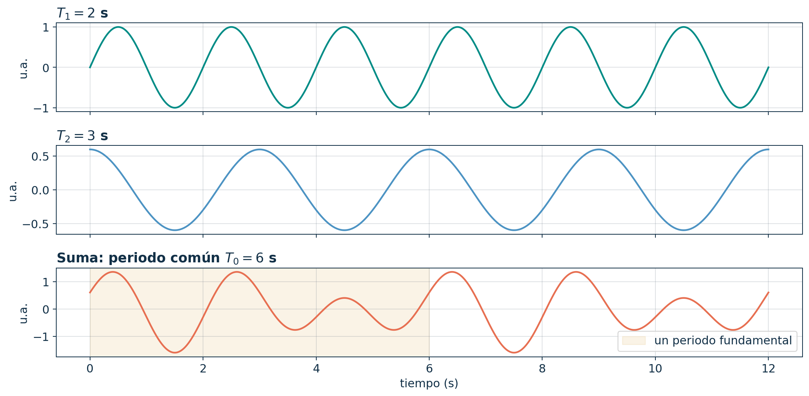{fig-alt="Suma de señales de periodos dos y tres segundos" width="80%"}

::: {.callout-important icon=false title="Resultado"}
Para $T_1=2$ s y $T_2=3$ s, el menor periodo común es $T_0=6$ s.
:::

## Las bioseñales no suelen ser perfectamente periódicas

En fisiología es común observar:

- **cuasiperiodicidad:** ciclos similares, pero no idénticos;
- **variabilidad:** duración o amplitud cambiante;
- **transitorios:** eventos que aparecen y desaparecen;
- **modulación:** una oscilación cambia con otra escala temporal;
- **no estacionariedad:** las propiedades estadísticas evolucionan.

::: {.callout-caution icon=false title="Interpretación biomédica"}
Llamar “periódico” a un ECG o una señal respiratoria real suele ser una aproximación local, no una identidad matemática exacta.
:::

## Generación de sinusoides en Python {.shrink}

```python
import numpy as np
import matplotlib.pyplot as plt

fs = 500
t = np.arange(0, 2, 1/fs)

A = 1.2
f0 = 8
phi = np.pi / 4
x = A * np.cos(2*np.pi*f0*t + phi)

plt.plot(t, x)
plt.xlabel("tiempo (s)")
plt.ylabel("amplitud")
```

::: {.callout-warning icon=false title="Verifique unidades"}
En `np.cos`, el argumento debe estar en radianes. El factor $2\pi$ convierte ciclos a radianes.
:::

## Actividad: periodicidad con justificación

Determine si cada señal es periódica y, cuando corresponda, encuentre su periodo fundamental:

1. $x_1(t)=\cos(6\pi t)$.
2. $x_2[n]=\cos(0.3\pi n)$.
3. $x_3[n]=\cos(n)$.
4. $x_4(t)=\cos(2\pi t)+\sin(3\pi t)$.

::: {.callout-note icon=false title="Pista" collapse="true"}
En tiempo discreto revise si $\Omega_0/(2\pi)$ es racional. Para una suma continua busque una razón racional entre periodos.
:::

## Cierre de la sesión 5

::: {.callout-important icon=false title="Síntesis"}
Amplitud, frecuencia, periodo y fase describen dimensiones diferentes. La periodicidad se demuestra mediante una igualdad; no se decide únicamente por inspección visual.
:::

**Conexión:** ahora modificaremos señales y aprenderemos a predecir qué ocurre con su forma, escala y ubicación.

# Semana 3 · Sesión 2

## Transformar una señal exige transformar su argumento

Al finalizar esta sesión podrá:

- distinguir transformaciones de amplitud y de tiempo;
- aplicar desplazamiento, escalamiento e inversión;
- interpretar transformaciones combinadas;
- descomponer una señal en partes par e impar;
- verificar los resultados mediante Python.

::: {.callout-note icon=false title="Pregunta inicial"}
¿Por qué $x(2t)$ está comprimida y no expandida en el tiempo?
:::

## Transformaciones sobre la amplitud

Para

$$y(t)=A\,x(t)+B,$$

- $A$ escala la amplitud;
- $A<0$ también invierte verticalmente;
- $B$ desplaza el nivel de referencia.

::: {.callout-important icon=false title="Interpretación"}
La transformación externa modifica valores de amplitud, pero no cambia la ubicación temporal de los eventos.
:::

## Desplazamiento temporal

$$y(t)=x(t-t_0).$$

- $t_0>0$: retraso hacia la derecha.
- $t_0<0$: adelanto hacia la izquierda.

Para verificar la dirección, ubique un evento conocido de $x(t)$ y resuelva cuándo aparece en $y(t)$.

::: {.callout-warning icon=false title="Error frecuente"}
El signo dentro del argumento se interpreta de manera opuesta al desplazamiento observado: $x(t-2)$ aparece dos unidades a la derecha.
:::

## Escalamiento e inversión temporal

$$y(t)=x(at).$$

| Valor de $a$ | Efecto |
|---:|---|
| $|a|>1$ | compresión temporal |
| $0<|a|<1$ | expansión temporal |
| $a<0$ | inversión temporal adicional |

::: {.callout-note icon=false title="Razón"}
Para alcanzar el valor que $x(t)$ tenía en $t=t_1$, la señal $x(at)$ solo necesita llegar hasta $t=t_1/a$.
:::

## Compare cuatro transformaciones {.shrink}

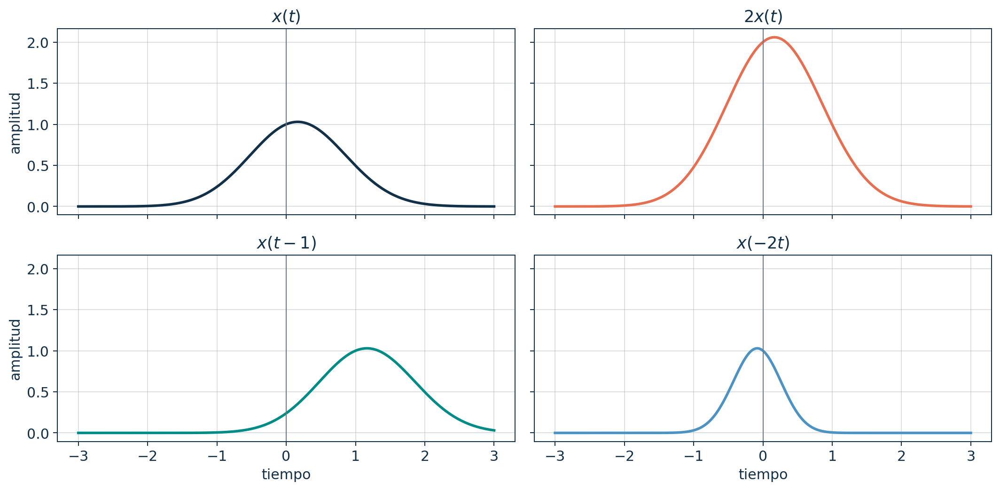{fig-alt="Escalamiento de amplitud, desplazamiento e inversión temporal" width="82%"}

::: {.callout-tip icon=false title="Método visual"}
Identifique primero un punto notable: máximo, inicio o discontinuidad. Después calcule su nueva ubicación y amplitud.
:::

## Transformaciones combinadas {.shrink}

Considere

$$y(t)=A\,x(at-b)+B.$$

Reescriba el argumento:

$$at-b=a\left(t-\frac{b}{a}\right).$$

Esto permite identificar:

1. desplazamiento efectivo $b/a$;
2. escalamiento temporal por $a$;
3. escalamiento vertical por $A$;
4. desplazamiento vertical por $B$.

::: {.callout-caution icon=false title="Orden de trabajo"}
No lea $b$ directamente como desplazamiento. Primero factorice el coeficiente de $t$.
:::

## Procedimiento con puntos notables

Si un evento de $x(t)$ ocurre en $t=t_x$, en $x(at-b)$ aparecerá cuando

$$at-b=t_x,$$

por tanto,

$$t=\frac{t_x+b}{a}.$$

::: {.callout-important icon=false title="Ventaja"}
Transformar coordenadas de puntos notables reduce errores de signo y evita depender únicamente de una regla memorizada.
:::

## Señales pares e impares

Una señal es par cuando

$$x(-t)=x(t),$$

y es impar cuando

$$x(-t)=-x(t).$$

- Las señales pares presentan simetría respecto al eje vertical.
- Las impares presentan simetría rotacional respecto al origen.

::: {.callout-note icon=false title="Ejemplos"}
$\cos(\omega t)$ es par y $\sin(\omega t)$ es impar.
:::

## Toda señal puede descomponerse {.shrink}

Parte par:

$$x_e(t)=\frac{x(t)+x(-t)}{2}.$$

Parte impar:

$$x_o(t)=\frac{x(t)-x(-t)}{2}.$$

Reconstrucción:

$$x(t)=x_e(t)+x_o(t).$$

::: {.callout-important icon=false title="Propósito"}
La descomposición separa simetrías y simplifica análisis posteriores, especialmente en Fourier.
:::

## Descomposición par e impar

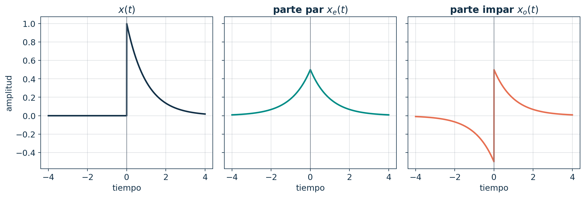{fig-alt="Señal unilateral y sus componentes par e impar" width="94%"}

::: {.callout-tip icon=false title="Verificación"}
Compruebe que $x_e(-t)=x_e(t)$, $x_o(-t)=-x_o(t)$ y que la suma reconstruye $x(t)$.
:::

## Transformaciones mediante interpolación en Python

```python
import numpy as np

# x está muestreada sobre el eje t
def transform_time(t, x, a=1.0, b=0.0):
    argument = a*t - b
    return np.interp(argument, t, x,
                     left=0.0, right=0.0)

y_shift = transform_time(t, x, a=1, b=1)
y_fold  = transform_time(t, x, a=-1, b=0)
```

::: {.callout-warning icon=false title="Limitación numérica"}
La interpolación aproxima valores entre muestras. Su error depende de la frecuencia de muestreo y del método empleado.
:::

## Actividad: prediga antes de graficar

Para una señal $x(t)$ con máximo en $t=1$ y amplitud máxima 2, determine la posición y amplitud del máximo en:

1. $y_1(t)=3x(t-2)$.
2. $y_2(t)=x(2t-4)$.
3. $y_3(t)=-x(-t)$.
4. $y_4(t)=0.5x(0.5t+1)+2$.

::: {.callout-tip icon=false title="Secuencia recomendada"}
Transforme primero la coordenada temporal del máximo; después aplique el cambio de amplitud.
:::

## Cierre de la semana 3

::: {.callout-important icon=false title="Síntesis"}
Las transformaciones internas modifican el eje temporal; las externas modifican amplitud. La factorización del argumento y el seguimiento de puntos notables ofrecen un procedimiento verificable.
:::

**Preparación para la semana 4:** revise media, RMS, ventanas e interpretación de eventos temporales.

# Semana 4 · Sesión 1

## El análisis temporal es una cadena de decisiones

Al finalizar esta sesión podrá:

- construir un flujo de análisis temporal;
- detectar niveles basales, tendencias y eventos;
- interpretar picos y cruces por cero con cautela;
- estimar envolventes y magnitudes locales;
- documentar decisiones de procesamiento.

::: {.callout-note icon=false title="Pregunta inicial"}
¿Cuándo un máximo local representa un evento fisiológico y cuándo es solo una fluctuación?
:::

## Flujo mínimo de análisis

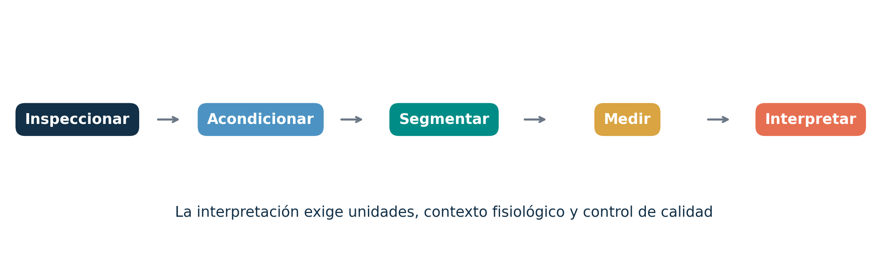{fig-alt="Flujo de análisis temporal desde inspección hasta interpretación" width="95%"}

::: {.callout-important icon=false title="Orden lógico"}
No extraiga características antes de verificar unidades, calidad, valores ausentes, saturación y pertinencia de la ventana.
:::

## Inspección inicial: qué debe buscarse

1. Duración, frecuencia de muestreo y continuidad temporal.
2. Rango de amplitud y unidades.
3. Saturaciones o recortes.
4. Deriva lenta y cambios de nivel.
5. Eventos abruptos o valores aislados.
6. Segmentos faltantes.
7. Coherencia entre canales.

::: {.callout-tip icon=false title="Práctica recomendable"}
Observe primero el registro completo y luego amplíe segmentos representativos. Una sola escala puede ocultar problemas importantes.
:::

## Nivel basal y tendencia

Podemos representar una señal como

$$
x(t)=b(t)+r(t),
$$

donde $b(t)$ es una componente lenta y $r(t)$ contiene variaciones más rápidas.

- El nivel basal puede tener significado fisiológico.
- También puede reflejar desplazamiento instrumental.
- La tendencia puede ser parte del fenómeno o una contaminación.

::: {.callout-warning icon=false title="No elimine sin justificar"}
Restar la media o eliminar una tendencia modifica la señal. La decisión debe corresponder a la pregunta de análisis.
:::

## Detectar picos es aplicar criterios {.shrink}

Un máximo local $x[n]$ satisface, en su forma más simple,

$$x[n]>x[n-1],\qquad x[n]\geq x[n+1].$$

En aplicaciones reales también se requieren criterios como:

- altura mínima;
- prominencia;
- distancia entre picos;
- anchura;
- contexto morfológico.

::: {.callout-important icon=false title="Concepto"}
El detector produce candidatos matemáticos. La validación fisiológica determina cuáles corresponden al evento de interés.
:::

## Un detector puede acertar matemáticamente y fallar fisiológicamente {.shrink}

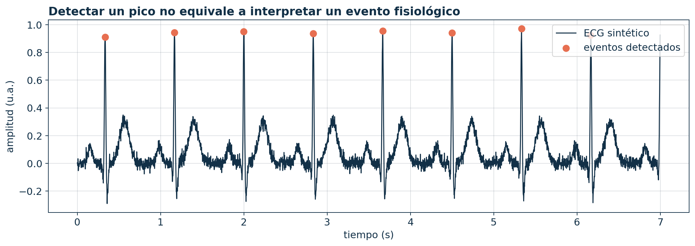{fig-alt="Detección de eventos en un ECG sintético" width="88%"}

::: {.callout-caution icon=false title="Límite de interpretación"}
Una marca sobre un pico no demuestra que sea una onda específica, un latido válido o un hallazgo clínico.
:::

## Detección de picos en Python

```python
from scipy.signal import find_peaks

min_distance = int(0.60 * fs)
peaks, properties = find_peaks(
    x,
    distance=min_distance,
    prominence=0.55,
)

event_times = peaks / fs
```

::: {.callout-tip icon=false title="Parámetros con unidades"}
Convierta duraciones fisiológicamente justificadas a muestras. No copie valores de `distance` entre señales con diferente $f_s$.
:::

## Cruces por cero

Un cruce ocurre cuando cambia el signo:

$$x[n]x[n-1]<0.$$

Conteo simple:

$$
Z=\sum_{n=1}^{N-1}\mathbf{1}\{x[n]x[n-1]<0\}.
$$

::: {.callout-warning icon=false title="Sensibilidad al ruido"}
Pequeñas fluctuaciones alrededor de cero pueden producir muchos cruces. Es habitual usar umbrales, histéresis o preprocesamiento.
:::

## La rectificación cambia la representación

Rectificación de onda completa:

$$x_r[n]=|x[n]|.$$

La rectificación:

- hace no negativas las amplitudes;
- permite resumir magnitud local;
- introduce una componente de baja frecuencia;
- altera el contenido espectral original.

::: {.callout-caution icon=false title="Interpretación"}
Una señal rectificada ya no conserva polaridad. No debe tratarse como si fuera el registro original.
:::

## Envolvente de una señal oscilatoria {.shrink}

Una aproximación frecuente consiste en rectificar y suavizar:

$$e[n]=\mathcal{L}\{|x[n]|\},$$

donde $\mathcal{L}$ representa un filtro pasa bajas.

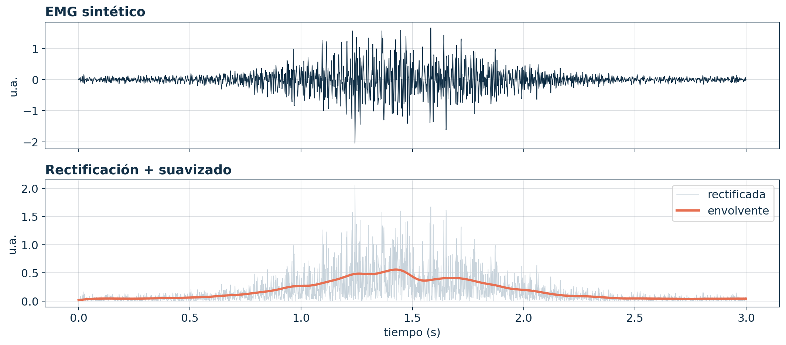{fig-alt="EMG sintético, rectificación y envolvente" width="78%"}

::: {.callout-note icon=false title="Qué representa"}
La envolvente describe cambios lentos de magnitud; no es equivalente a la forma de onda EMG ni a la fuerza muscular.
:::

## RMS móvil y envolvente no son idénticos

| Método | Operación | Ventaja | Precaución |
|---|---|---|---|
| RMS móvil | cuadrado → promedio → raíz | conserva interpretación cuadrática | depende de ventana |
| Rectificación + pasa bajas | valor absoluto → suavizado | intuitivo y continuo | depende del filtro |
| Envolvente de Hilbert | magnitud de señal analítica | útil en señales estrechas en banda | requiere supuestos espectrales |

::: {.callout-important icon=false title="Selección"}
Elija el método según la estructura de la señal y la pregunta, no por costumbre.
:::

## Actividad: diseñe criterios de evento

Se desea detectar el inicio de una contracción en EMG superficial.

Proponga:

1. representación empleada: cruda, rectificada, RMS o envolvente;
2. duración de ventana;
3. umbral y referencia basal;
4. duración mínima del evento;
5. criterio para rechazar artefactos;
6. procedimiento de validación.

::: {.callout-tip icon=false title="Criterio de evaluación"}
La respuesta debe justificar cada parámetro y reconocer que el inicio estimado depende del método.
:::

## Cierre de la sesión 7

::: {.callout-important icon=false title="Síntesis"}
Picos, cruces, RMS y envolventes son construcciones matemáticas. Su validez depende del preprocesamiento, los parámetros y la correspondencia con el evento fisiológico.
:::

**Conexión:** una característica local requiere definir con precisión qué segmento de señal representa cada condición.

# Semana 4 · Sesión 2

## Segmentar es decidir qué observaciones se comparan

Al finalizar esta sesión podrá:

- elegir entre segmentación por eventos y por ventanas;
- comprender longitud y solapamiento;
- normalizar sin perder trazabilidad;
- construir tablas de características;
- evaluar comparabilidad y posibles fugas de información.

::: {.callout-note icon=false title="Pregunta inicial"}
¿Dos ventanas extraídas del mismo sujeto representan dos observaciones independientes?
:::

## Estrategias de segmentación {.shrink}

| Estrategia | Referencia | Ventaja | Riesgo |
|---|---|---|---|
| Por evento | marcador fisiológico o experimental | alineación interpretable | error de detección |
| Ventanas fijas | duración constante | implementación sencilla | mezcla de estados |
| Ventanas deslizantes | longitud y solapamiento | seguimiento temporal | observaciones correlacionadas |
| Ciclos | periodo estimado | comparación morfológica | variabilidad y ciclos inválidos |

::: {.callout-important icon=false title="Concepto"}
La segmentación define la unidad de análisis. Por eso afecta directamente la validez estadística y biomédica.
:::

## Longitud y solapamiento {.shrink}

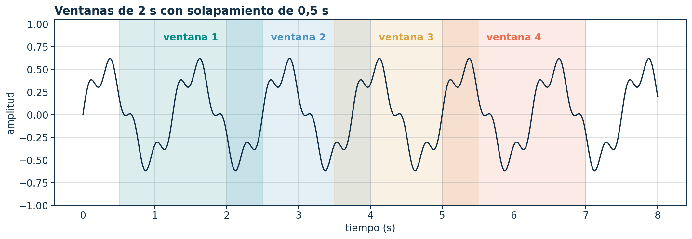{fig-alt="Ventanas deslizantes solapadas" width="82%"}

Si una ventana tiene $L$ muestras y el avance es $R$, el solapamiento es

$$
O=1-\frac{R}{L}.
$$

::: {.callout-warning icon=false title="Dependencia"}
Un solapamiento elevado produce ventanas muy similares. No deben tratarse automáticamente como observaciones independientes.
:::

## La ventana debe contener el fenómeno relevante

Una ventana demasiado corta puede:

- dividir un evento;
- producir métricas inestables;
- perder componentes lentas.

Una ventana demasiado larga puede:

- mezclar estados fisiológicos;
- diluir eventos transitorios;
- ocultar cambios temporales.

::: {.callout-note icon=false title="Criterio de selección"}
La longitud debe justificarse usando la escala temporal del fenómeno y la resolución requerida.
:::

## Normalizar no corrige una adquisición deficiente {.shrink}

Tres transformaciones comunes:

$$
x_c[n]=x[n]-\bar{x},
$$

$$
z[n]=\frac{x[n]-\bar{x}}{\sigma_x},
$$

$$
x_{01}[n]=\frac{x[n]-x_{\min}}{x_{\max}-x_{\min}}.
$$

::: {.callout-warning icon=false title="Pérdida de interpretación"}
Después de estandarizar o escalar, la amplitud deja de conservar las unidades físicas originales.
:::

## Tres escalas, una misma forma relativa {.shrink}

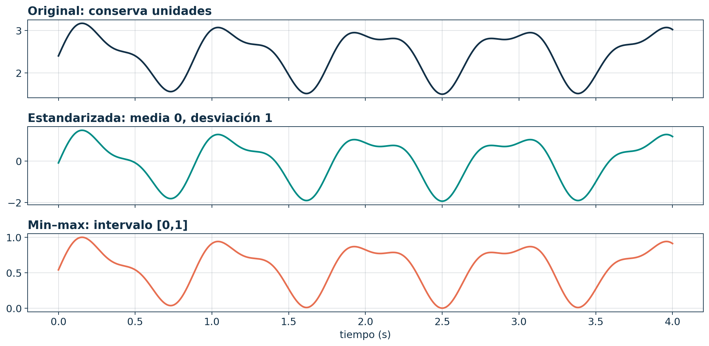{fig-alt="Señal original, estandarizada y escalada entre cero y uno" width="80%"}

::: {.callout-important icon=false title="Distinción"}
La normalización cambia la escala; no elimina ruido, artefactos, sesgo ni falta de comparabilidad experimental.
:::

## Normalización global o local

:::: {.columns}

::: {.column width="48%"}
### Global

Usa parámetros calculados sobre un conjunto amplio.

- Facilita comparación entre ventanas.
- Puede verse afectada por heterogeneidad.
- En aprendizaje automático debe calcularse solo con entrenamiento.
:::

::: {.column width="48%"}
### Local

Usa parámetros de cada ventana o sujeto.

- Reduce diferencias de escala.
- Puede borrar cambios absolutos relevantes.
- Hace que cada segmento tenga una referencia distinta.
:::

::::

::: {.callout-caution icon=false title="Fuga de información"}
Calcular parámetros de normalización usando datos de prueba introduce información futura en el entrenamiento.
:::

## De la señal a una matriz de características {.shrink}

Para $K$ segmentos y $P$ características:

$$
\mathbf{F}=
\begin{bmatrix}
f_{11}&\cdots&f_{1P}\\
\vdots&\ddots&\vdots\\
f_{K1}&\cdots&f_{KP}
\end{bmatrix}.
$$

Cada fila debe conservar identificadores como:

- sujeto;
- sesión y condición;
- canal;
- instante inicial y final;
- versión de procesamiento.

::: {.callout-important icon=false title="Trazabilidad"}
Una característica sin vínculo con su segmento de origen no puede auditarse ni reinterpretarse.
:::

## Ejemplo de tabla analítica

| Sujeto | Sesión | Canal | Inicio (s) | Fin (s) | RMS (mV) | Calidad |
|---|---:|---|---:|---:|---:|---|
| P01 | 1 | EMG-TA | 12.0 | 14.0 | valor calculado | válida |
| P01 | 1 | EMG-TA | 13.5 | 15.5 | valor calculado | revisar |
| P02 | 1 | EMG-TA | 12.0 | 14.0 | valor calculado | válida |

::: {.callout-note icon=false title="Diseño correcto"}
La tabla separa metadatos, características y control de calidad. No reemplaza los segmentos originales.
:::

## Características según el tipo de señal {.shrink}

| Señal | Características temporales iniciales | Precaución |
|---|---|---|
| ECG | intervalos, amplitudes, duración de complejos | detección y referencia |
| EMG | RMS, envolvente, cruces, duración de activación | colocación y normalización |
| EEG | amplitud, estadísticos por época, eventos | artefactos y montaje |
| Respiración | periodo, amplitud, regularidad, pausas | tipo de sensor y deriva |

::: {.callout-warning icon=false title="No universalice"}
La misma característica puede representar fenómenos diferentes según la señal y el protocolo.
:::

## Flujo reproducible en Python {.shrink}

```python
import numpy as np

def sliding_windows(x, length, step):
    for start in range(0, len(x)-length+1, step):
        stop = start + length
        yield start, stop, x[start:stop]

rows = []
for start, stop, segment in sliding_windows(x, 500, 250):
    rows.append({
        "start": start,
        "stop": stop,
        "rms": np.sqrt(np.mean(segment**2)),
    })
```

::: {.callout-tip icon=false title="Reproducibilidad"}
Guarde la longitud y el avance en muestras y segundos, además de la frecuencia de muestreo.
:::

## Actividad integradora de la semana 4

Diseñe un flujo para comparar dos condiciones de una bioseñal:

1. pregunta fisiológica;
2. unidad de análisis;
3. inspección y calidad;
4. segmentación;
5. normalización;
6. dos características;
7. criterio de comparación;
8. limitación principal.

::: {.callout-tip icon=false title="Producto esperado"}
Un esquema defendible, no una lista de funciones de software.
:::

## Cierre de la semana 4

::: {.callout-important icon=false title="Síntesis"}
El análisis temporal convierte segmentos definidos en características trazables. La ventana, la normalización y el control de calidad forman parte del resultado, no son detalles secundarios.
:::

**Preparación para la semana 5:** repase productos internos, números complejos, integración y representación de vectores en bases.

# Semana 5 · Sesión 1

## El tiempo muestra cuándo; la frecuencia muestra cómo oscila

Al finalizar esta sesión podrá:

- explicar por qué se introduce el dominio frecuencial;
- interpretar una señal como combinación de componentes;
- usar exponenciales complejas para representar sinusoides;
- relacionar ortogonalidad y coeficientes;
- distinguir magnitud y fase espectral.

::: {.callout-note icon=false title="Pregunta inicial"}
Si una señal contiene simultáneamente oscilaciones de 8 Hz y 22 Hz, ¿es posible reconocerlas directamente en su gráfica temporal?
:::

## Una señal puede ser difícil de separar en el tiempo {.shrink}

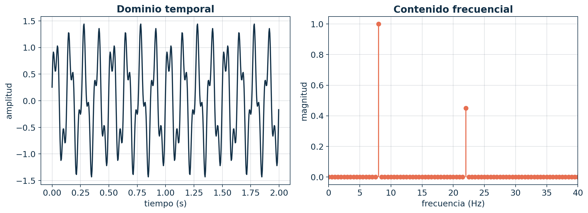{fig-alt="La misma señal en los dominios temporal y frecuencial" width="84%"}

::: {.callout-important icon=false title="Cambio de perspectiva"}
El dominio temporal conserva la localización de los eventos. El dominio frecuencial reorganiza la señal según su contribución oscilatoria.
:::

## El dominio frecuencial responde preguntas específicas

- ¿Qué oscilaciones contribuyen a la señal?
- ¿Cuál componente tiene mayor magnitud?
- ¿Qué ancho de banda ocupa el registro?
- ¿Existen interferencias concentradas en frecuencias particulares?
- ¿Cómo modifica un sistema cada componente?

::: {.callout-warning icon=false title="No es una vista superior"}
Tiempo y frecuencia son representaciones complementarias. El espectro global puede ocultar cuándo ocurrió un cambio.
:::

## Sumar componentes simples produce formas complejas

Considere

$$
x(t)=A_1\cos(2\pi f_1t+\phi_1)
+A_2\cos(2\pi f_2t+\phi_2).
$$

La forma temporal resulta de la interferencia constructiva y destructiva entre componentes.

::: {.callout-note icon=false title="Interpretación"}
El análisis frecuencial busca estimar cuánto aporta cada función base a la señal observada.
:::

## Una base permite describir un objeto mediante coordenadas

En un espacio vectorial:

$$
\mathbf{x}=c_1\mathbf{b}_1+c_2\mathbf{b}_2+\cdots+c_K\mathbf{b}_K.
$$

En señales, las funciones base reemplazan a los vectores geométricos:

$$
x(t)=\sum_k c_k\,\phi_k(t).
$$

::: {.callout-important icon=false title="Idea de Fourier"}
Usamos sinusoides o exponenciales complejas como funciones base y calculamos sus coeficientes.
:::

## Fórmula de Euler

$$
e^{j\alpha}=\cos\alpha+j\sin\alpha.
$$

De ella se obtiene:

$$
\cos\alpha=\frac{e^{j\alpha}+e^{-j\alpha}}{2},
\qquad
\sin\alpha=\frac{e^{j\alpha}-e^{-j\alpha}}{2j}.
$$

::: {.callout-note icon=false title="Utilidad"}
Las exponenciales complejas simplifican derivación, integración y análisis de sistemas lineales.
:::

## La exponencial compleja es una rotación {.shrink}

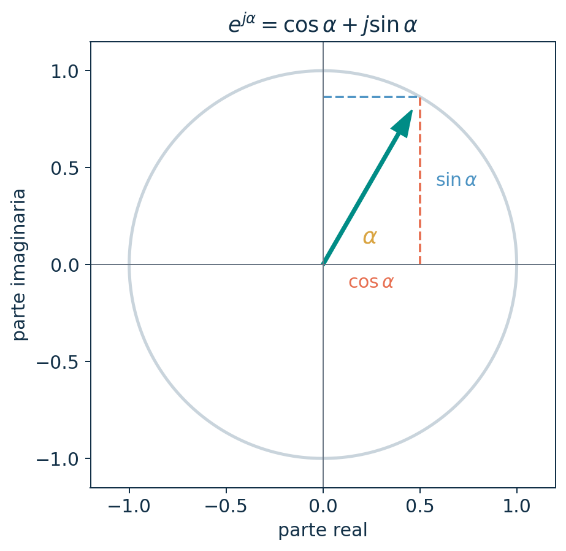{fig-alt="Representación de la fórmula de Euler en el plano complejo" width="50%"}

::: {.callout-tip icon=false title="Lectura geométrica"}
$\cos\alpha$ es la proyección real y $\sin\alpha$ la proyección imaginaria de un punto sobre la circunferencia unitaria.
:::

## Exponenciales complejas y frecuencia

$$
e^{j\omega t}
$$

describe una rotación con velocidad angular $\omega$.

- La parte real es $\cos(\omega t)$.
- La parte imaginaria es $\sin(\omega t)$.
- $e^{-j\omega t}$ rota en dirección contraria.

::: {.callout-important icon=false title="Representación bilateral"}
Una sinusoide real se expresa mediante componentes de frecuencia positiva y negativa.
:::

## Producto interno entre señales

Para funciones definidas en un periodo $T_0$:

$$
\langle x,y\rangle
=\frac{1}{T_0}\int_{t_0}^{t_0+T_0}x(t)y^*(t)\,dt.
$$

Dos funciones son ortogonales cuando

$$\langle x,y\rangle=0.$$

::: {.callout-note icon=false title="Interpretación"}
El producto interno cuantifica semejanza considerando fase y amplitud sobre el intervalo definido.
:::

## Las bases sinusoidales son ortogonales {.shrink}

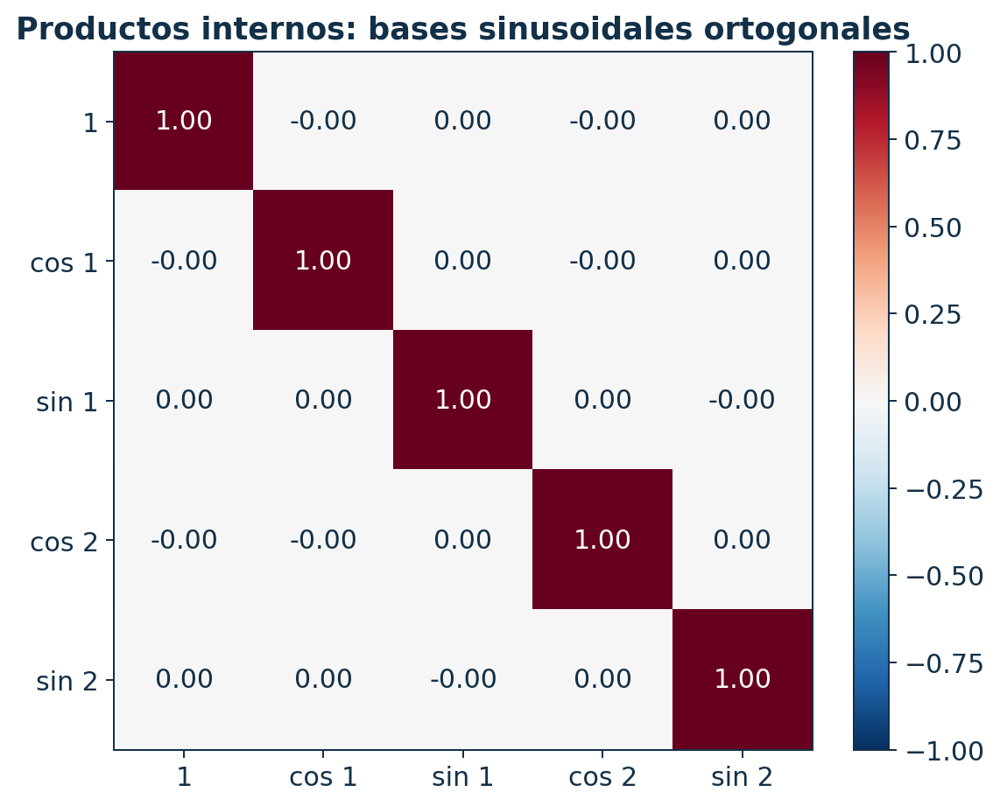{fig-alt="Matriz de productos internos para funciones sinusoidales" width="55%"}

::: {.callout-important icon=false title="Consecuencia"}
La ortogonalidad permite aislar un coeficiente sin que las demás componentes contaminen su estimación ideal.
:::

## Coeficiente como proyección

Si las funciones $\phi_k$ son ortonormales,

$$
c_k=\langle x,\phi_k\rangle.
$$

El coeficiente informa:

- cuánto de la base $k$ está presente;
- qué escala debe aplicarse;
- qué fase relativa tiene la contribución.

::: {.callout-tip icon=false title="Analogía"}
Así como las coordenadas $(x,y)$ proyectan un vector sobre ejes ortogonales, Fourier proyecta una señal sobre oscilaciones ortogonales.
:::

## Magnitud y fase contienen información diferente

Para un coeficiente complejo $C_k$:

$$
C_k=|C_k|e^{j\angle C_k}.
$$

- $|C_k|$: magnitud de la contribución.
- $\angle C_k$: alineación o fase de esa contribución.

::: {.callout-warning icon=false title="Error frecuente"}
Conservar solo magnitud puede ser suficiente para algunas características, pero no permite reconstruir en general la forma temporal original.
:::

## Limitaciones del espectro global

El análisis global supone que el intervalo completo puede resumirse con los mismos componentes.

Esto puede fallar cuando:

- la señal cambia de estado;
- aparecen eventos breves;
- la frecuencia dominante evoluciona;
- las ventanas mezclan condiciones;
- existen discontinuidades artificiales en los bordes.

::: {.callout-caution icon=false title="Señales biomédicas"}
Muchas bioseñales son localmente estacionarias solo durante intervalos limitados. La segmentación precede al análisis espectral.
:::

## Actividad: tiempo, frecuencia o ambas

Seleccione la representación más informativa y justifique:

1. medir la latencia entre dos eventos;
2. identificar una interferencia sinusoidal;
3. estudiar una oscilación que aparece durante un segundo;
4. comparar la amplitud de dos contracciones;
5. describir una señal con componentes simultáneas.

::: {.callout-note icon=false title="Criterio" collapse="true"}
No se busca una etiqueta aislada. La justificación debe indicar qué información conserva y qué información pierde cada representación.
:::

## Cierre de la sesión 9

::: {.callout-important icon=false title="Síntesis"}
Fourier interpreta una señal mediante proyecciones sobre bases oscilatorias ortogonales. Los coeficientes complejos reúnen magnitud y fase; el espectro complementa, pero no reemplaza, al tiempo.
:::

**Conexión:** aplicaremos estas ideas a señales periódicas mediante la serie de Fourier.

# Semana 5 · Sesión 2

## La serie de Fourier representa señales periódicas

Al finalizar esta sesión podrá:

- escribir la serie compleja de Fourier;
- interpretar sus coeficientes;
- relacionar simetría y reducción de términos;
- reconstruir una señal mediante sumas parciales;
- explicar el fenómeno de Gibbs y Parseval.

::: {.callout-note icon=false title="Pregunta inicial"}
¿Cómo puede una suma de funciones suaves aproximar una señal con discontinuidades?
:::

## Serie compleja de Fourier

Para una señal periódica de periodo $T_0$ y frecuencia angular fundamental $\omega_0=2\pi/T_0$:

$$
x(t)=\sum_{k=-\infty}^{\infty}C_k e^{jk\omega_0t}.
$$

Los coeficientes son

$$
C_k=\frac{1}{T_0}\int_{t_0}^{t_0+T_0}
x(t)e^{-jk\omega_0t}\,dt.
$$

::: {.callout-important icon=false title="Significado"}
$C_k$ es la coordenada compleja de $x(t)$ asociada con el armónico $k$.
:::

## ¿Qué representa el índice armónico?

- $k=0$: componente continua o valor medio.
- $k=\pm1$: frecuencia fundamental.
- $k=\pm2$: segundo armónico.
- $k=\pm3$: tercer armónico.
- En general, el armónico $k$ tiene frecuencia $k f_0$.

::: {.callout-note icon=false title="Espectro de líneas"}
Una señal periódica ideal posee componentes en múltiplos enteros de la frecuencia fundamental.
:::

## Forma trigonométrica

Una representación real equivalente es

$$
x(t)=\frac{a_0}{2}
+\sum_{k=1}^{\infty}
\left[a_k\cos(k\omega_0t)+b_k\sin(k\omega_0t)\right].
$$

Los coeficientes $a_k$ y $b_k$ expresan contribuciones cosenoidales y sinusoidales.

::: {.callout-tip icon=false title="Elección de forma"}
La forma trigonométrica facilita visualizar senos y cosenos; la compleja simplifica operaciones algebraicas.
:::

## Las simetrías reducen el cálculo

Para un intervalo simétrico:

- si $x(t)$ es par, los términos sinusoidales se anulan: $b_k=0$;
- si $x(t)$ es impar, los términos cosenoidales y el promedio se anulan: $a_k=0$ y $a_0=0$;
- otras simetrías pueden eliminar armónicos pares o impares.

::: {.callout-important icon=false title="Antes de integrar"}
Inspeccione periodicidad y simetrías. Pueden reducir sustancialmente el número de cálculos.
:::

## Ejemplo: onda cuadrada impar

Para una onda cuadrada ideal de amplitud $\pm1$ y periodo $2\pi$:

$$
x(t)=\frac{4}{\pi}
\sum_{m=0}^{\infty}
\frac{\sin\big((2m+1)t\big)}{2m+1}.
$$

::: {.callout-note icon=false title="Estructura"}
Solo aparecen armónicos impares y su amplitud decrece de manera inversamente proporcional al índice.
:::

## Reconstrucción mediante sumas parciales {.shrink}

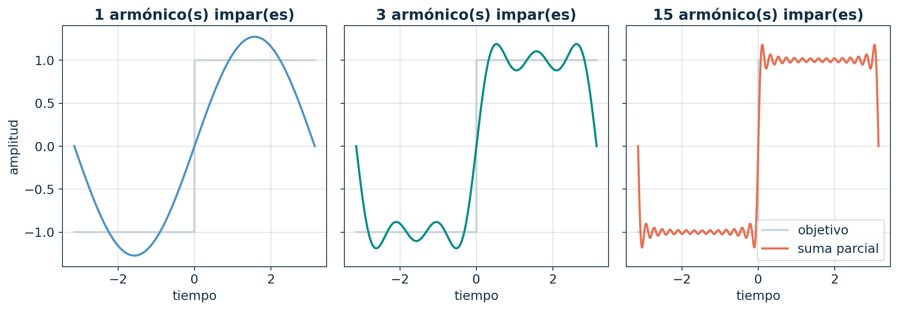{fig-alt="Aproximaciones de Fourier de una onda cuadrada" width="85%"}

::: {.callout-important icon=false title="Lectura"}
Al añadir armónicos se recuperan bordes más rápidos y regiones más planas. La reconstrucción sigue siendo continua para cualquier número finito de términos.
:::

## Fenómeno de Gibbs {.shrink}

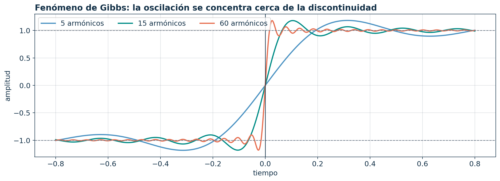{fig-alt="Oscilaciones de Gibbs cerca de una discontinuidad" width="83%"}

::: {.callout-warning icon=false title="Concepto principal"}
Al aumentar el número de armónicos, la oscilación se concentra cerca de la discontinuidad, pero el sobreimpulso no desaparece simplemente en altura.
:::

## Convergencia en una discontinuidad

En condiciones habituales, la serie converge en un salto al promedio lateral:

$$
\lim_{N\to\infty}x_N(t_d)
=\frac{x(t_d^-)+x(t_d^+)}{2}.
$$

::: {.callout-note icon=false title="Interpretación"}
La representación de Fourier aproxima la señal en un sentido global; no obliga a que cada punto discontinuo adopte uno de sus valores laterales.
:::

## Parseval conecta potencia temporal y coeficientes

Para la serie compleja:

$$
\frac{1}{T_0}\int_{t_0}^{t_0+T_0}|x(t)|^2dt
=\sum_{k=-\infty}^{\infty}|C_k|^2.
$$

::: {.callout-important icon=false title="Conservación"}
La potencia promedio calculada en el tiempo coincide con la suma de las contribuciones cuadráticas de los armónicos.
:::

## Reconstrucción en Python

```python
import numpy as np

t = np.linspace(-np.pi, np.pi, 2000)
xN = np.zeros_like(t)

terms = 15
for m in range(terms):
    k = 2*m + 1
    xN += (4/np.pi) * np.sin(k*t) / k
```

::: {.callout-tip icon=false title="Experimento"}
Cambie `terms` y observe qué regiones mejoran, dónde persisten oscilaciones y cómo cambia el error global.
:::

## No confunda serie, transformada y DFT

| Herramienta | Señal idealizada | Resultado |
|---|---|---|
| Serie de Fourier | periódica continua | coeficientes discretos en frecuencia |
| Transformada de Fourier | aperiódica continua | función continua de frecuencia |
| DTFT | secuencia discreta | función periódica y continua en frecuencia |
| DFT | bloque finito de muestras | conjunto finito de coeficientes |

::: {.callout-warning icon=false title="Alcance de estas semanas"}
En esta sesión se introduce la serie de Fourier. La transformada y la DFT requieren desarrollar con cuidado muestreo, ventanas y resolución frecuencial.
:::

## Aplicación biomédica: interpretar componentes, no etiquetas

El contenido armónico puede reflejar:

- repetición morfológica;
- oscilaciones fisiológicas;
- interferencia periódica;
- bordes o transitorios;
- efectos del sensor y del acondicionamiento.

::: {.callout-caution icon=false title="Razonamiento crítico"}
Encontrar una componente frecuencial no identifica automáticamente su causa. La atribución exige contexto fisiológico, instrumental y experimental.
:::

## Actividad de cierre

Una señal periódica es impar y presenta simetría de media onda.

1. ¿Qué familias de coeficientes podrían anularse?
2. ¿Qué información debe verificarse antes de calcular la serie?
3. ¿Qué ocurre en una discontinuidad durante la reconstrucción?
4. ¿Cómo comprobaría numéricamente la relación de Parseval?

::: {.callout-tip icon=false title="Criterio de respuesta"}
Use simetrías para formular hipótesis, pero demuestre qué términos se anulan mediante las definiciones.
:::

## Integración de las semanas 1–5

::: {.callout-important icon=false title="Cadena conceptual"}
**Fisiología y contexto** definen la pregunta → la **medición** produce un registro → la **representación** organiza los datos → la **segmentación** define observaciones → las **características temporales o frecuenciales** construyen evidencia.
:::

Ningún paso es neutral: cada elección determina qué información se conserva, se transforma o se pierde.

## Preguntas de verificación acumulativa

1. ¿Por qué una señal no puede interpretarse sin metadatos?
2. ¿Cuándo RMS y desviación estándar son iguales?
3. ¿Qué condición hace periódica una sinusoide discreta?
4. ¿Cómo se interpreta $x(at-b)$ sin cometer errores de signo?
5. ¿Por qué las ventanas solapadas no son independientes?
6. ¿Qué representa un coeficiente de Fourier?
7. ¿Qué información se pierde al conservar solo la magnitud espectral?

## Criterios de aprendizaje alcanzados

Al completar estas semanas, el estudiante debe poder:

- formular una pregunta de análisis conectada con fisiología y adquisición;
- representar señales escalares y multicanal con unidades;
- calcular e interpretar características temporales;
- demostrar periodicidad y ejecutar transformaciones;
- construir un flujo temporal reproducible;
- explicar Fourier como proyección sobre bases ortogonales;
- reconocer límites metodológicos y evitar inferencias clínicas no justificadas.

::: {.callout-note icon=false title="Siguiente etapa"}
Las semanas posteriores desarrollarán adquisición digital, espectros de potencia, transformada discreta, sistemas lineales y filtrado.
:::

## Referencias principales {.smaller .shrink}

::: {#refs}
:::

## Apéndice: entorno Python recomendado

```bash
uv init sysb
cd sysb
uv add numpy scipy matplotlib pandas jupyter
uv run jupyter lab
```

Bibliotecas principales:

- `NumPy`: arreglos y operaciones numéricas.
- `SciPy.signal`: procesamiento de señales.
- `Matplotlib`: visualización científica.
- `Pandas`: tablas de características y metadatos.

::: {.callout-tip icon=false title="Reproducibilidad"}
Registre versiones del entorno y use una semilla explícita cuando genere señales o ruido aleatorio.
:::

## Apéndice: plantilla mínima de una práctica

1. **Pregunta:** qué se desea medir o comparar.
2. **Datos:** señal, unidades, canales, $f_s$ y condición.
3. **Calidad:** inspección, exclusiones y artefactos.
4. **Método:** ecuaciones, parámetros y código.
5. **Resultado:** figura o tabla sin valores inventados.
6. **Interpretación:** vínculo con fisiología.
7. **Limitaciones:** alternativas y sensibilidad.

::: {.callout-important icon=false title="Estándar esperado"}
El código ejecutable es necesario, pero no suficiente: una práctica válida debe justificar los supuestos y explicar qué significa el resultado.
:::
