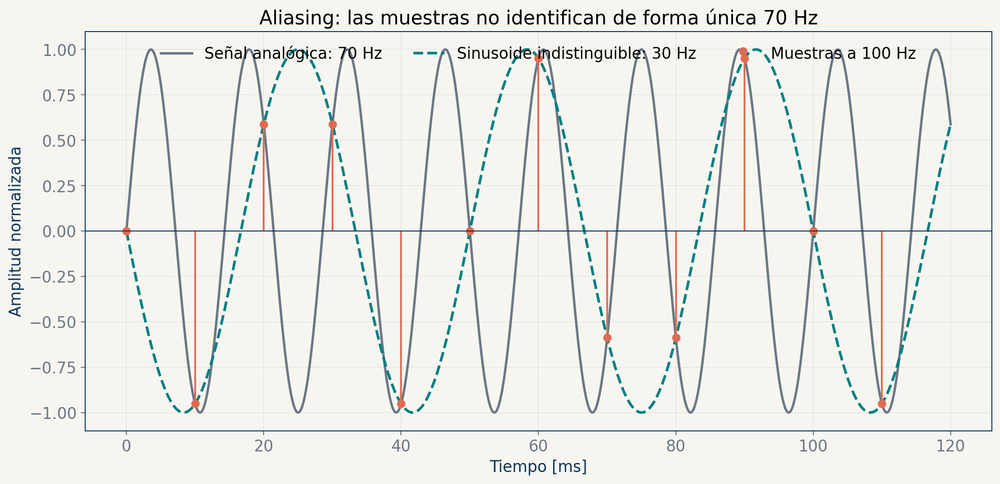
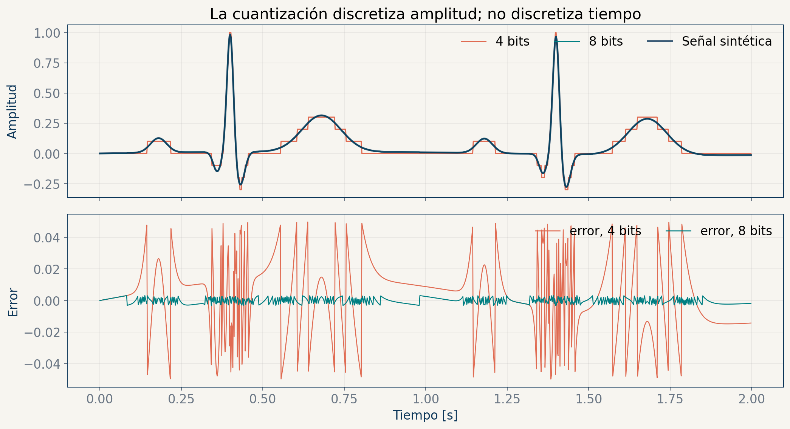
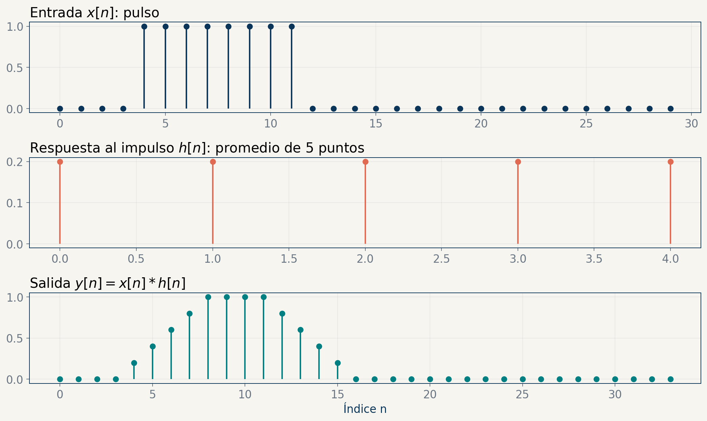
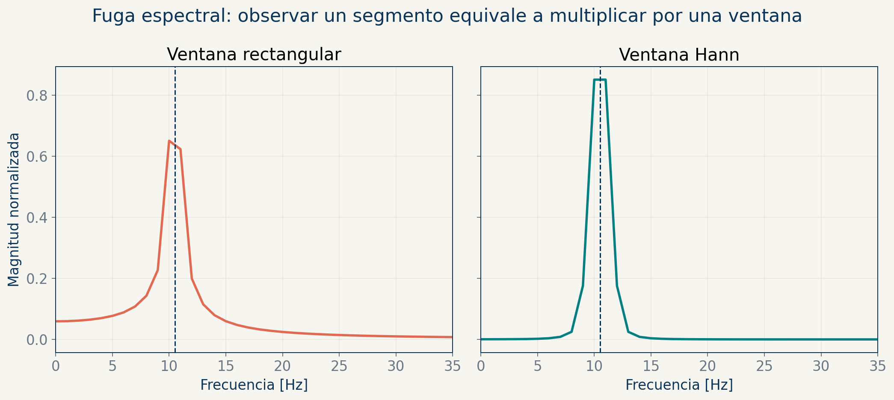
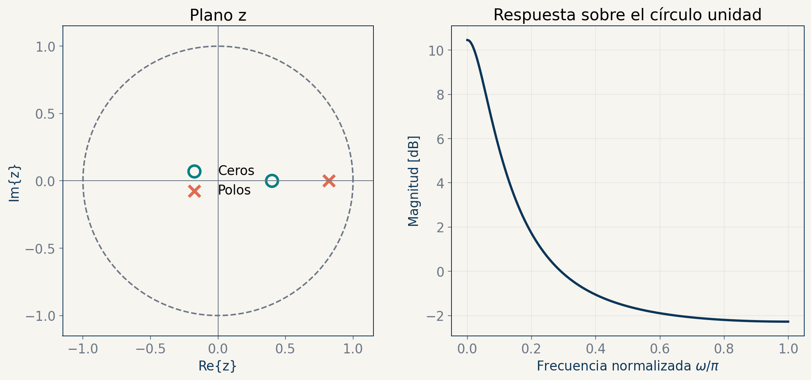
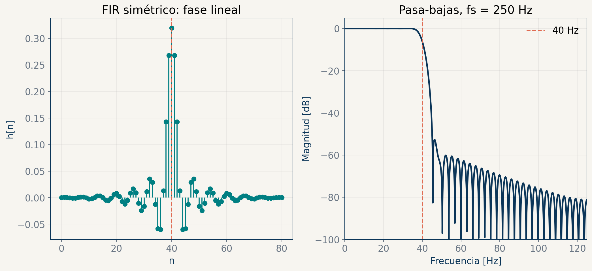
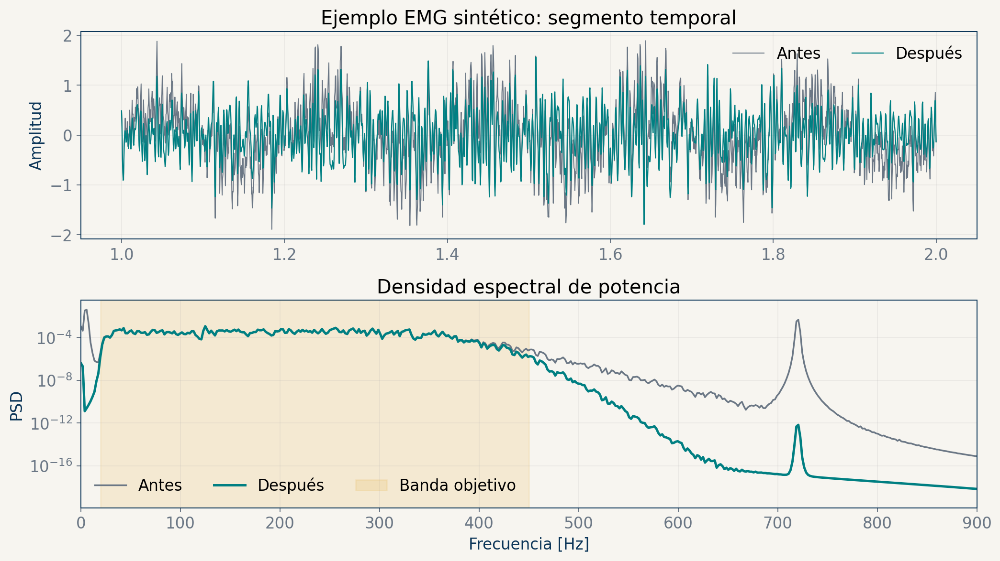
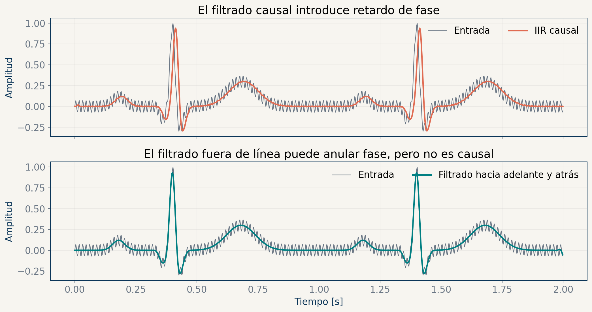

```{=html}
<style>
:root {
  --sysb-navy: #123047;
  --sysb-teal: #008c86;
  --sysb-coral: #e76f51;
  --sysb-gold: #d9a441;
  --sysb-light: #eef4f7;
}
.reveal { color: var(--sysb-navy); font-family: "Aptos", "Segoe UI", Arial, sans-serif; }
.reveal .slides { text-align: left; }
.reveal h1, .reveal h2 { color: var(--sysb-navy); letter-spacing: -0.02em; text-transform: none; }
.reveal h1 { color: white; font-size: 2.15em; }
.reveal h2 { border-bottom: 5px solid var(--sysb-teal); padding-bottom: 0.16em; font-size: 1.55em; }
.reveal h3 { color: var(--sysb-teal); text-transform: none; }
.reveal section.level1 { background: linear-gradient(135deg, var(--sysb-navy) 0%, #20556f 68%, var(--sysb-teal) 100%); color: white; padding: 5%; border-radius: 18px; }
.reveal section.level1 h1, .reveal section.level1 h2, .reveal section.level1 p { color: white; }
.reveal .callout { font-size: 0.83em; border-radius: 12px; }
.reveal .callout-title-container { font-weight: 750; }
.reveal table { font-size: 0.72em; }
.reveal pre code { font-size: 0.80em; line-height: 1.25; }
.reveal .small { font-size: 0.72em; }
.reveal .smaller { font-size: 0.64em; }
.reveal .shrink { font-size: 0.82em; }
.reveal .center { text-align: center; }
.reveal .accent { color: var(--sysb-coral); font-weight: 750; }
.reveal .muted { color: #657582; }
.reveal img { max-height: 610px; }
.reveal .quarto-title-author-name { color: var(--sysb-teal); }
.reveal .footer { color: #607583; }
</style>
```

## Propósito del bloque

Al finalizar la semana 10, el estudiante podrá **trazar una decisión de filtrado** desde la adquisición de una bioseñal hasta su implementación y validación digital.

::: {.callout-important icon=false title="Idea que articula las cinco semanas"}
Un filtro no corrige una adquisición deficiente ni crea información ausente. Solo modifica, de manera cuantificable, el contenido registrado.
:::

## Ruta de aprendizaje {.shrink}

| Semana | Pregunta que guía el estudio | Producto conceptual |
|---:|---|---|
| 6 | ¿Cómo llega un fenómeno fisiológico al computador? | Cadena de adquisición justificable |
| 7 | ¿Cómo se modela la transformación de una señal? | Sistema LTI y convolución |
| 8 | ¿Qué significa que una señal tenga contenido frecuencial? | Representación de Fourier |
| 9 | ¿Cómo se conectan ecuaciones, polos, ceros y FIR? | Modelo en $z$ y diseño FIR |
| 10 | ¿Cómo se diseña y valida un IIR biomédico? | Caso pasabanda para EMG |

## Cómo estudiar con estas diapositivas

1. **Prediga** el resultado antes de ver cada ejemplo.
2. **Explique** la ecuación en términos fisiológicos y de medición.
3. **Reproduzca** el cálculo con Python y cambie un parámetro.
4. **Valide** la salida en tiempo y frecuencia.

::: {.callout-note icon=false title="Criterio de dominio"}
No basta reconocer una fórmula: debe poder indicar sus supuestos, unidades, límites y consecuencias sobre la interpretación biomédica.
:::

# Semana 6 · Sesión 1

## De la fisiología al dato digital

**Resultados de aprendizaje**

- Distinguir fenómeno fisiológico, variable medida y señal eléctrica registrada.
- Descomponer una cadena de adquisición en etapas verificables.
- Identificar fuentes de interferencia antes de proponer filtrado digital.

**Pregunta de entrada:** ¿en qué punto deja de existir la señal fisiológica y empieza el dato?

## La medición es una cadena, no un sensor aislado {.shrink}


| Etapa | Función | Pregunta de diseño |
|---|---|---|
| Fuente | Genera el fenómeno | ¿Qué variable representa la fisiología? |
| Acoplamiento | Lleva energía al sensor | ¿Qué se atenúa o mezcla? |
| Transducción | Convierte energía | ¿Cuál es la sensibilidad? |
| Acondicionamiento | Amplifica y limita banda | ¿Qué evita saturación y aliasing? |
| ADC | Muestrea y cuantiza | ¿Qué resolución temporal y de amplitud resulta? |
| Almacenamiento | Codifica y documenta | ¿Se preservan unidades y metadatos? |

::: {.callout-important icon=false title="Concepto principal"}
El dato almacenado es la salida de toda la cadena. Atribuir cada rasgo al órgano sin evaluar la cadena es un error de inferencia.
:::

## Transducción: convertir no significa copiar perfectamente

Un modelo local útil del sensor es

$$
v(t)=S\,x(t)+b+n(t),
$$

donde $x(t)$ es la variable fisiológica, $S$ la sensibilidad, $b$ el offset y $n(t)$ la perturbación agregada.

- La **sensibilidad** tiene unidades: V/unidad de la magnitud medida.
- La **linealidad** solo suele sostenerse dentro de un intervalo.
- El sensor posee dinámica: retardo, histéresis y ancho de banda.

::: {.callout-warning icon=false title="Error frecuente"}
Confundir el voltaje de salida con la magnitud fisiológica. La conversión requiere una relación de calibración y unidades trazables.
:::

## Señal, interferencia, artefacto y ruido no son sinónimos

| Término | Origen | Ejemplo biomédico | ¿Se elimina siempre? |
|---|---|---|---|
| Señal de interés | Fuente fisiológica objetivo | Actividad ventricular en ECG | No |
| Interferencia fisiológica | Otra fuente biológica | ECG contaminando EMG torácico | Depende del objetivo |
| Artefacto | Interacción sujeto-sensor | Movimiento del electrodo | No siempre por filtrado |
| Ruido instrumental | Electrónica y ambiente | Ruido térmico o de red | Se reduce, no desaparece |

::: {.callout-note icon=false title="Decisión correcta"}
Clasifique primero la fuente de la perturbación. La misma frecuencia puede contener señal útil en un contexto y contaminación en otro.
:::

## El modelo aditivo es útil, pero no universal {.shrink}

Modelo simple:

$$
y(t)=x(t)+n(t).
$$

Modelos que exigen más cuidado:

$$
y(t)=a(t)x(t)+n(t), \qquad
y(t)=g\!\left(x(t)\right)+n(t).
$$

- Un electrodo que pierde contacto puede producir modulación de amplitud.
- La saturación del amplificador es una no linealidad.
- El filtrado lineal no revierte clipping ni recupera muestras perdidas.

::: {.callout-important icon=false title="Límite metodológico"}
Si la distorsión no es aditiva ni lineal, asumir $y=x+n$ puede producir una falsa sensación de limpieza.
:::

## SNR cuantifica contraste, no calidad clínica {.shrink}

Para potencias promedio $P_x$ y $P_n$:

$$
\mathrm{SNR}_{\mathrm{dB}}=10\log_{10}\!\left(\frac{P_x}{P_n}\right).
$$

Si se comparan amplitudes RMS bajo la misma impedancia:

$$
\mathrm{SNR}_{\mathrm{dB}}=20\log_{10}\!\left(\frac{x_{\mathrm{RMS}}}{n_{\mathrm{RMS}}}\right).
$$

**Interpretación:** aumentar 20 dB la SNR multiplica por 10 la razón de amplitudes.

::: {.callout-warning icon=false title="Precaución"}
Una SNR alta no garantiza conservar morfología, sincronía o eventos raros. La métrica debe corresponder al objetivo biomédico.
:::

## Ganancia: usar el rango sin recortar

Si el ADC admite $[-V_{FS},V_{FS}]$ y la entrada acondicionada alcanza $V_{p}$, una condición práctica es

$$
G\,V_p < V_{FS}-M,
$$

donde $M$ es un margen para transitorios y variabilidad.

- Ganancia muy baja: se desaprovechan códigos del ADC.
- Ganancia muy alta: aparece saturación irreversible.
- El margen se justifica con el protocolo, no con un porcentaje universal.

::: {.callout-tip icon=false title="Pregunta de diseño"}
¿Cuál es el mayor valor fisiológico plausible y cuál es el mayor artefacto esperable durante el protocolo?
:::

## Electrodos: la interfaz también filtra

En registros bioeléctricos, la interfaz electrodo-piel puede representarse con una impedancia dependiente de frecuencia.

- Preparación y contacto modifican impedancia y estabilidad.
- Un desbalance entre electrodos degrada el rechazo de modo común.
- Los cables captan interferencia y movimiento.
- La geometría del montaje modifica selectividad espacial.

::: {.callout-important icon=false title="Consecuencia"}
La ubicación, orientación y referencia forman parte del modelo de medición. No son detalles administrativos.
:::

<div class="refline">Referencia de apoyo: Kaniusas (2019), Biomedical Signals and Sensors III, doi:10.1007/978-3-319-74917-4.</div>

## Verificación 6.1

Un ECG presenta segmentos planos exactamente en el límite superior del ADC.

1. ¿Es más probable ruido aleatorio, aliasing o clipping?
2. ¿Puede un filtro digital reconstruir los picos originales?
3. ¿Qué cambios evaluaría primero en la cadena?

::: {.callout-note icon=false title="Respuesta esperada"}
Es clipping. Deben revisarse ganancia, offset, rango del ADC, contacto y artefactos. El filtrado no recupera amplitudes que nunca fueron codificadas.
:::

## Cierre de la sesión 11

::: {.callout-important icon=false title="Síntesis"}
- El registro resulta de toda la cadena de medición.
- Transductor, acoplamiento y acondicionamiento modifican la señal.
- Saturación y pérdida de contacto no son ruido aditivo.
- La calidad debe evaluarse respecto a la pregunta biomédica.
:::

# Semana 6 · Sesión 2

## Muestrear y cuantizar son decisiones diferentes

**Resultados de aprendizaje**

- Relacionar ancho de banda, frecuencia de muestreo y filtro antialias.
- Calcular resolución de cuantización y reconocer saturación.
- Diferenciar error de cuantización, aliasing y ruido analógico.

**Pregunta de entrada:** ¿duplicar los bits compensa una frecuencia de muestreo insuficiente?

## Muestrear es multiplicar por un tren de impulsos

$$
x_s(t)=x(t)\sum_{n=-\infty}^{\infty}\delta(t-nT_s),
\qquad x[n]=x(nT_s),qquad f_s=\frac{1}{T_s}.
$$

En frecuencia, el espectro se replica cada $f_s$:

$$
X_s(f)=\frac{1}{T_s}\sum_{k=-\infty}^{\infty}X(f-kf_s).
$$

::: {.callout-important icon=false title="Teorema de muestreo"}
Si $x(t)$ está limitada a $B$ Hz, $f_s>2B$ evita solapamiento ideal de réplicas. La igualdad $f_s=2B$ no ofrece margen de implementación.
:::

## Aliasing: frecuencias distintas producen las mismas muestras {.shrink}

{width=91%}

::: {.callout-warning icon=false title="Lectura de la figura"}
Con $f_s=100$ Hz, 70 Hz y 30 Hz generan secuencias indistinguibles salvo por fase/signo. Aumentar bits no resuelve esta ambigüedad temporal.
:::

## El filtro antialias debe ser analógico

Antes del ADC se requiere un pasa-bajas que atenúe contenido por encima de la banda admisible.

| Parámetro | Significado |
|---|---|
| $f_p$ | Fin de banda que debe conservarse |
| $f_{st}$ | Inicio de banda que debe rechazarse |
| $A_p$ | Pérdida máxima admisible en banda pasante |
| $A_s$ | Atenuación mínima requerida en rechazo |
| $f_s/2$ | Límite de Nyquist |

::: {.callout-important icon=false title="Orden causal de las operaciones"}
Una componente que ya se plegó dentro de la banda después de muestrear no puede identificarse como alias mediante un filtro digital ordinario.
:::

## Elegir $f_s$: Nyquist es el piso teórico

Ejemplo: si una medición EMG debe conservar hasta 450 Hz:

- $f_s=900$ Hz deja transición nula: no es realizable.
- $f_s=1000$ Hz deja solo 50 Hz entre 450 Hz y Nyquist.
- $f_s=2000$ Hz deja 550 Hz para transición y simplifica el antialias.

La elección también depende de:

- memoria y transmisión;
- sincronización entre canales;
- latencia y carga de cómputo;
- ancho de banda real del sensor.

::: {.callout-note icon=false title="Criterio"}
Justifique $f_s$ con banda útil, transición del filtro analógico y recursos del sistema.
:::

## Cuantizar es discretizar la amplitud

Para un cuantizador uniforme de $N$ bits y rango $V_{max}-V_{min}$:

$$
L=2^N,\qquad \Delta=\frac{V_{max}-V_{min}}{2^N}.
$$

Si no hay sobrecarga y se redondea al nivel más cercano:

$$
-\frac{\Delta}{2}\le e_q < \frac{\Delta}{2}.
$$

::: {.callout-important icon=false title="Distinción"}
La frecuencia de muestreo controla resolución temporal; los bits controlan resolución de amplitud. Son ejes diferentes.
:::

## Más bits reducen el escalón, no evitan clipping {.shrink}

{width=90%}

El ejemplo usa una señal tipo ECG **sintética**. No representa un registro clínico.

::: {.callout-warning icon=false title="Observación"}
Si la señal excede el rango, todos los bits adicionales codifican el mismo límite saturado. Primero se asegura el rango; después se discute resolución.
:::

## El modelo de ruido de cuantización tiene supuestos

Bajo condiciones de señal suficientemente variable y sin sobrecarga:

$$
\sigma_q^2\approx \frac{\Delta^2}{12}.
$$

La regla aproximada para una sinusoide a escala completa es

$$
\mathrm{SQNR}_{\mathrm{dB}}\approx 6.02N+1.76.
$$

No debe extrapolarse sin revisión a señales:

- de muy baja amplitud respecto a $\Delta$;
- periódicas y sincronizadas con el cuantizador;
- recortadas o con offset;
- dominadas por ruido analógico.

## ENOB resume imperfecciones reales del convertidor

El número efectivo de bits puede estimarse desde SINAD:

$$
\mathrm{ENOB}=\frac{\mathrm{SINAD}_{\mathrm{dB}}-1.76}{6.02}.
$$

ENOB incorpora, de forma agregada, ruido y distorsión del sistema de conversión.

::: {.callout-note icon=false title="No confundir"}
Un ADC de 16 bits nominales no garantiza 16 bits efectivos en la banda, ganancia y frecuencia de operación usadas.
:::

## Código mínimo para cuantización uniforme

```python
import numpy as np

def quantize(x, bits, vmin, vmax):
    levels = 2**bits
    delta = (vmax - vmin) / levels
    x_clip = np.clip(x, vmin, vmax - delta)
    codes = np.round((x_clip - vmin) / delta)
    return vmin + codes * delta, delta
```

::: {.callout-tip icon=false title="Verificación computacional"}
Compruebe por separado porcentaje de muestras recortadas, $\Delta$, distribución del error y amplitud de los eventos de interés.
:::

## Checklist de adquisición biomédica

- [ ] Variable fisiológica, unidades y montaje documentados.
- [ ] Rango y ganancia definidos con margen.
- [ ] Banda útil y antialias coherentes con $f_s$.
- [ ] Resolución de amplitud coherente con el evento mínimo.
- [ ] Sincronización, reloj y pérdida de paquetes evaluados.
- [ ] Saturación y desconexiones detectables.
- [ ] Metadatos suficientes para reproducir el protocolo.

::: {.callout-important icon=false title="Principio rector"}
La calidad del análisis digital está acotada por la información que la adquisición logró preservar.
:::

<div class="refline">Apoyo: Esakkirajan, Veerakumar y Subudhi (2024), cap. 2, doi:10.1007/978-981-99-6752-0.</div>

## Cierre de la semana 6

::: {.callout-important icon=false title="Síntesis"}
Muestreo y cuantización limitan dimensiones distintas. El filtro antialias debe actuar antes del ADC, y ningún aumento de bits recupera información plegada o recortada.
:::

# Semana 7 · Sesión 1

## Modelar una transformación exige declarar sus propiedades

**Resultados de aprendizaje**

- Expresar un sistema como operador entrada-salida.
- Evaluar linealidad, invariancia temporal, causalidad, memoria y estabilidad.
- Relacionar propiedades matemáticas con riesgos de interpretación biomédica.

**Pregunta de entrada:** ¿todo algoritmo de procesamiento es un filtro LTI?

## Un sistema es una regla que transforma señales

$$
y=\mathcal{T}\{x\}.
$$

Representaciones habituales:

- ecuación diferencial o en diferencias;
- respuesta al impulso y convolución;
- función de transferencia;
- ecuaciones de estado;
- algoritmo computacional.

::: {.callout-important icon=false title="Concepto principal"}
Dos implementaciones son equivalentes solo si producen la misma relación entrada-salida bajo los mismos supuestos y condiciones iniciales.
:::

## Memoria: ¿la salida usa otras muestras?

Sin memoria:

$$
y[n]=x^2[n].
$$

Con memoria:

$$
y[n]=\frac{x[n]+x[n-1]+x[n-2]}{3}.
$$

En bioseñales, una estimación de RMS móvil, una derivada o un filtro digital tienen memoria.

::: {.callout-note icon=false title="Prueba rápida"}
Si cambiar $x[k]$ para $k\neq n$ puede modificar $y[n]$, el sistema tiene memoria.
:::

## Causalidad: presente y pasado, nunca futuro

Un sistema discreto es causal si $y[n_0]$ depende solo de $x[n]$ con $n\le n_0$.

| Operación | ¿Causal? | Uso típico |
|---|---:|---|
| $y[n]=x[n]-x[n-1]$ | Sí | Tiempo real |
| $y[n]=x[n+1]$ | No | Solo con datos futuros disponibles |
| Promedio centrado | No | Análisis fuera de línea |
| `sosfiltfilt` | No | Corrección de fase fuera de línea |

::: {.callout-warning icon=false title="Implicación"}
Un método no causal puede ser válido para análisis retrospectivo, pero no para monitoreo en tiempo real.
:::

## Linealidad exige aditividad y homogeneidad

$$
\mathcal{T}\{a x_1+b x_2\}=a\mathcal{T}\{x_1\}+b\mathcal{T}\{x_2\}.
$$

- $y[n]=3x[n]$: lineal.
- $y[n]=x[n]+2$: no lineal por el offset.
- $y[n]=|x[n]|$: no lineal.
- Saturación: no lineal.

::: {.callout-important icon=false title="Consecuencia"}
Rectificar EMG cambia su contenido espectral porque la rectificación no es una operación lineal.
:::

## Invariancia temporal: la regla no cambia con el reloj

Si $y[n]=\mathcal{T}\{x[n]\}$, un sistema invariante cumple

$$
\mathcal{T}\{x[n-n_0]\}=y[n-n_0].
$$

Ejemplos:

- Coeficientes fijos: potencialmente invariantes.
- Ganancia dependiente de $n$: variante en el tiempo.
- Filtro adaptativo: deliberadamente variante.

::: {.callout-note icon=false title="Contexto biomédico"}
La fisiología suele ser no estacionaria, aunque el filtro aplicado sea LTI. No confunda propiedad del sistema con propiedad de la señal.
:::

## Estabilidad BIBO evita salidas no acotadas

Un sistema es BIBO estable si toda entrada acotada produce salida acotada.

Para un sistema LTI discreto:

$$
\sum_{n=-\infty}^{\infty}|h[n]|<\infty
\quad \Longrightarrow \quad \text{estabilidad BIBO}.
$$

::: {.callout-warning icon=false title="Importancia práctica"}
Un IIR con polos fuera del círculo unidad puede amplificar errores numéricos y ruido hasta dominar la señal.
:::

## Las propiedades no vienen en paquete

| Sistema | Lineal | Invariante | Causal | Estable |
|---|:---:|:---:|:---:|:---:|
| $y[n]=x[n]+x[n-1]$ | Sí | Sí | Sí | Sí |
| $y[n]=n\,x[n]$ | Sí | No | Sí | No necesariamente |
| $y[n]=x[n+1]$ | Sí | Sí | No | Sí |
| $y[n]=x^2[n]$ | No | Sí | Sí | Sí para entrada acotada |

::: {.callout-tip icon=false title="Método"}
Evalúe cada propiedad con su definición. No concluya causalidad o estabilidad a partir de que el sistema sea lineal.
:::

## Verificación 7.1

Considere $y[n]=0.8y[n-1]+x[n]$.

1. ¿Tiene memoria?
2. ¿Es lineal e invariante si el coeficiente permanece fijo?
3. ¿Es causal?
4. ¿Qué propiedad del polo anticipa la estabilidad?

::: {.callout-note icon=false title="Respuesta esperada"}
Tiene memoria, es LTI y causal. Su polo está en $0.8$, dentro del círculo unidad; para la realización causal resulta BIBO estable.
:::

## Cierre de la sesión 13

::: {.callout-important icon=false title="Síntesis"}
Las propiedades de memoria, causalidad, linealidad, invariancia y estabilidad deben probarse por separado. Juntas determinan qué análisis y qué implementación son válidos.
:::

# Semana 7 · Sesión 2

## La respuesta al impulso determina un sistema LTI

**Resultados de aprendizaje**

- Derivar la convolución desde la descomposición en impulsos.
- Calcular convolución discreta y reconocer soporte y retardo.
- Interpretar suavizado y respuesta transitoria.

**Pregunta de entrada:** ¿por qué conocer $h[n]$ permite predecir cualquier salida?

## Toda secuencia puede escribirse con impulsos desplazados {.shrink}

$$
x[n]=\sum_{k=-\infty}^{\infty}x[k]\,\delta[n-k].
$$

Si el sistema es lineal e invariante:

$$
\mathcal{T}\{\delta[n-k]\}=h[n-k].
$$

Por superposición:

$$
y[n]=\sum_{k=-\infty}^{\infty}x[k]h[n-k]=(x*h)[n].
$$

::: {.callout-important icon=false title="Concepto principal"}
La convolución no es una receta aislada: es la consecuencia de linealidad e invariancia temporal.
:::

## Convolución: invertir, desplazar, multiplicar y sumar

$$
y[n]=\sum_k x[k]h[n-k].
$$

Para un $n$ fijo:

1. Invierta $h[k]\to h[-k]$.
2. Desplace $h[-k]\to h[n-k]$.
3. Multiplique punto a punto por $x[k]$.
4. Sume sobre $k$.

::: {.callout-warning icon=false title="Error frecuente"}
Mover $h[k-n]$ en lugar de $h[n-k]$ cambia el resultado. Verifique siempre el índice dentro de la suma.
:::

## Un promedio móvil ensancha bordes y reduce variación rápida {.shrink}

{width=86%}

::: {.callout-note icon=false title="Lectura"}
La rampa de entrada y salida aparece porque el promedio incluye progresivamente más o menos muestras del pulso.
:::

## Longitud y soporte permiten anticipar la salida

Si $x[n]$ tiene longitud $N$ y $h[n]$ longitud $M$:

$$
L_y=N+M-1.
$$

Si los soportes son $[n_{x0},n_{x1}]$ y $[n_{h0},n_{h1}]$:

$$
\mathrm{supp}(y)=[n_{x0}+n_{h0},\ n_{x1}+n_{h1}].
$$

::: {.callout-tip icon=false title="Control de errores"}
Antes de calcular valores, determine soporte, longitud y posibles simetrías. Son pruebas independientes del código.
:::

## Convolución continua: el área de solapamiento cambia

$$
y(t)=\int_{-\infty}^{\infty}x(\tau)h(t-\tau)\,d\tau.
$$

Para señales por tramos, los límites de integración dependen de $t$.

- Sin solapamiento: $y(t)=0$.
- Solapamiento parcial: el intervalo crece o decrece.
- Solapamiento total: puede aparecer una meseta.

::: {.callout-important icon=false title="Interpretación geométrica"}
La integral suma productos solo donde $x(\tau)$ y $h(t-\tau)$ se superponen.
:::

## El filtro promedio móvil es FIR y LTI

Para $M$ muestras:

$$
h[n]=\begin{cases}
1/M, & 0\le n\le M-1,\\
0, & \text{otro caso}.
\end{cases}
$$

$$
y[n]=\frac{1}{M}\sum_{k=0}^{M-1}x[n-k].
$$

Efectos:

- suaviza cambios rápidos;
- introduce retardo;
- no separa selectivamente bandas cercanas;
- conserva DC porque $\sum h[n]=1$.

## Código y prueba mínima de convolución

```python
import numpy as np

x = np.array([0, 1, 1, 1, 0], dtype=float)
h = np.ones(3) / 3
y = np.convolve(x, h, mode="full")

assert len(y) == len(x) + len(h) - 1
assert np.isclose(h.sum(), 1.0)
```

::: {.callout-note icon=false title="Interpretación"}
La prueba de longitud detecta errores de modo o recorte; la suma unitaria verifica ganancia DC, no toda la respuesta en frecuencia.
:::

## Convolución, correlación y filtrado no son intercambiables

| Operación | Expresión | Pregunta que responde |
|---|---|---|
| Convolución | $\sum x[k]h[n-k]$ | ¿Cuál es la salida del LTI? |
| Correlación | $\sum x[k]y^*[k-n]$ | ¿Qué tan similares son a cierto desfase? |
| Filtrado | Implementación de $H$ | ¿Cómo modificar una señal según una respuesta? |

::: {.callout-warning icon=false title="Convención"}
Las bibliotecas difieren en normalización, conjugación, retardos y modos `full`, `same`, `valid`. Documente la definición usada.
:::

## Cierre de la semana 7 {.shrink}

Puede modelar una operación como LTI cuando:

- cumple superposición;
- su regla no cambia con el tiempo;
- sus condiciones iniciales se tratan coherentemente.

Entonces $h[n]$ permite estudiar:

- causalidad;
- estabilidad;
- respuesta transitoria;
- respuesta en frecuencia.

::: {.callout-important icon=false title="Puente a la semana 8"}
La convolución en tiempo se convierte en multiplicación en frecuencia. Esa equivalencia hace operativo el análisis de Fourier.
:::

# Semana 8 · Sesión 1

## La transformada extiende Fourier a señales aperiódicas

**Resultados de aprendizaje**

- Pasar de la serie de Fourier a la transformada de señales aperiódicas.
- Interpretar magnitud, fase y propiedades de la transformada.
- Usar el teorema de convolución para analizar sistemas LTI.

**Pregunta de entrada:** si una señal no es periódica, ¿cómo puede representarse mediante frecuencias?

## La transformada aparece al llevar el período al infinito

La serie compleja usa líneas separadas por $\omega_0=2\pi/T_0$. Cuando $T_0\to\infty$, esa separación tiende a cero y la suma se convierte en integral:

$$
X(\omega)=\int_{-\infty}^{\infty}x(t)e^{-j\omega t}\,dt.
$$

$$
x(t)=\frac{1}{2\pi}\int_{-\infty}^{\infty}X(\omega)e^{j\omega t}\,d\omega.
$$

::: {.callout-important icon=false title="Continuidad con la semana 5"}
La serie describe espectros de líneas para señales periódicas; la transformada describe un continuo de frecuencias para señales aperiódicas.
:::

## Las exponenciales complejas son autofunciones LTI

Si $x(t)=e^{j\omega t}$, entonces

$$
y(t)=h(t)*e^{j\omega t}
=H(j\omega)e^{j\omega t}.
$$

El sistema no cambia la frecuencia; multiplica por un número complejo:

- $|H(j\omega)|$: escala amplitud;
- $\angle H(j\omega)$: desplaza fase.

::: {.callout-note icon=false title="Por qué importa"}
Si una señal se descompone en frecuencias, basta conocer cómo el sistema modifica cada componente.
:::

## Magnitud y fase responden preguntas diferentes

$$
X(\omega)=|X(\omega)|e^{j\phi(\omega)}.
$$

- La magnitud indica cuánto contribuye una frecuencia.
- La fase indica cómo se alinean sus componentes temporales.
- Dos señales pueden compartir magnitud y tener morfologías distintas por su fase.

::: {.callout-warning icon=false title="Error frecuente"}
Interpretar solo $|X(\omega)|$ como si contuviera toda la estructura temporal. La reconstrucción exige magnitud y fase.
:::

## La simetría conjugada caracteriza señales reales

Si $x(t)$ es real:

$$
X(-\omega)=X^*(\omega).
$$

Por tanto:

- $|X(-\omega)|=|X(\omega)|$;
- $\angle X(-\omega)=-\angle X(\omega)$, salvo ambigüedades de fase;
- el espectro bilateral contiene redundancia para una señal real.

::: {.callout-note icon=false title="Lectura correcta"}
La frecuencia negativa es parte de la representación compleja; no corresponde a una oscilación fisiológica que transcurre hacia atrás.
:::

## Las propiedades permiten predecir sin reintegrar {.shrink}

| Operación temporal | Efecto frecuencial |
|---|---|
| $a x(t)+b y(t)$ | $aX(\omega)+bY(\omega)$ |
| $x(t-t_0)$ | $e^{-j\omega t_0}X(\omega)$ |
| $x(at)$ | $\frac{1}{|a|}X(\omega/a)$ |
| $\frac{d}{dt}x(t)$ | $j\omega X(\omega)$ |
| $x(t)e^{j\omega_0t}$ | $X(\omega-\omega_0)$ |

::: {.callout-tip icon=false title="Método de estudio"}
Explique primero el efecto cualitativo. Luego use la propiedad y verifique dimensiones, signo y factor de escala.
:::

## Convolución en tiempo es multiplicación en frecuencia

$$
y(t)=x(t)*h(t)
\quad\Longleftrightarrow\quad
Y(\omega)=X(\omega)H(\omega).
$$

El teorema permite:

- anticipar qué componentes se atenúan;
- separar respuesta de la señal y respuesta del sistema;
- diseñar $H(\omega)$ desde una especificación;
- validar resultados en dos dominios.

::: {.callout-important icon=false title="Puente hacia filtrado"}
Un filtro LTI no «busca» eventos: pondera cada componente según su respuesta compleja $H(\omega)$.
:::

## Parseval conserva energía entre dominios

Con esta convención de transformada:

$$
\int_{-\infty}^{\infty}|x(t)|^2dt
=\frac{1}{2\pi}\int_{-\infty}^{\infty}|X(\omega)|^2d\omega.
$$

Aplicaciones:

- verificar transformadas y escalamiento;
- comparar energía antes y después de filtrar;
- cuantificar la fracción contenida en una banda.

::: {.callout-caution icon=false title="Convenciones"}
Los factores $2\pi$ cambian según se use $f$ en Hz o $\omega$ en rad/s. Declare el par de transformada.
:::

## Verificación 8.1

Un sistema tiene $|H(j\omega)|\approx 0$ por encima de $40$ Hz y fase no lineal en la banda pasante.

1. ¿Qué componentes atenúa?
2. ¿Puede conservar amplitud y deformar morfología?
3. ¿Qué propiedad explica esa deformación?

::: {.callout-note icon=false title="Criterio de respuesta" collapse="true"}
Atenúa principalmente contenido superior a 40 Hz. Sí puede alterar la forma aunque conserve magnitud en la banda, porque distintos componentes sufren desplazamientos de fase diferentes.
:::

## Cierre de la sesión 15

::: {.callout-important icon=false title="Síntesis"}
- La transformada extiende la serie desde líneas armónicas hacia frecuencia continua.
- Magnitud y fase son necesarias para describir la señal.
- Las propiedades permiten anticipar efectos sin recalcular integrales.
- El teorema de convolución conecta análisis de sistemas y filtrado.
:::

# Semana 8 · Sesión 2

## La DFT convierte un bloque finito en muestras espectrales

**Resultados de aprendizaje**

- Relacionar DTFS, DTFT y DFT sin confundir sus dominios.
- Interpretar resolución frecuencial, fuga y ventanas.
- Construir una lectura espectral que respete el contexto fisiológico.

**Pregunta de entrada:** ¿el pico mayor de la FFT es siempre la frecuencia fisiológica dominante?

## Tres objetos distintos suelen llamarse "Fourier"

| Representación | Señal de entrada | Variable frecuencial | Espectro |
|---|---|---|---|
| DTFS | Discreta y periódica | Índice $k$ | Discreto y periódico |
| DTFT | Discreta aperiódica | $\omega$ continua | Continuo y periódico |
| DFT | Bloque finito de $N$ muestras | $k=0,\ldots,N-1$ | $N$ muestras frecuenciales |

::: {.callout-important icon=false title="Concepto principal"}
La DFT analiza un registro finito como un período de una extensión periódica. Sus resultados dependen de duración y ventana.
:::

## La DFT y su inversa forman un par exacto {.shrink}

$$
X[k]=\sum_{n=0}^{N-1}x[n]e^{-j2\pi kn/N},
$$

$$
x[n]=\frac{1}{N}\sum_{k=0}^{N-1}X[k]e^{j2\pi kn/N}.
$$

La frecuencia del bin $k$ es

$$
f_k=\frac{k f_s}{N},\qquad \Delta f=\frac{f_s}{N}=\frac{1}{T}.
$$

::: {.callout-note icon=false title="Interpretación"}
La resolución entre bins mejora principalmente al aumentar la duración observada $T$, no solo al aumentar $f_s$.
:::

## La FFT acelera el cálculo; no cambia el significado

- DFT directa: orden aproximado $O(N^2)$.
- FFT: explota simetrías y reduce a $O(N\log N)$.
- La salida numérica representa la misma DFT.

::: {.callout-warning icon=false title="Error frecuente"}
Llamar "FFT" al espectro físico. FFT es el algoritmo; unidades, normalización y eje frecuencial dependen de cómo se construya el análisis.
:::

## Fuga espectral: el segmento observado tiene bordes {.shrink}

{width=88%}

::: {.callout-important icon=false title="Compromiso de las ventanas"}
Una ventana reduce lóbulos laterales a costa de ensanchar el lóbulo principal y cambiar la ganancia. No existe una ventana óptima para todo objetivo.
:::

## Zero padding interpola la gráfica, no la información

Agregar ceros aumenta el número de puntos evaluados en frecuencia:

$$
N_{FFT}>N.
$$

Pero la separación física de componentes cercanas sigue limitada por duración, SNR y ventana.

::: {.callout-note icon=false title="Diagnóstico"}
Una curva más suave no implica mayor capacidad para distinguir dos frecuencias próximas.
:::

## Un espectro de amplitud exige normalización explícita

Para una señal real y espectro unilateral:

1. calcule $X=\mathrm{rfft}(xw)$;
2. asocie $f=\mathrm{rfftfreq}(N,1/f_s)$;
3. corrija la ganancia coherente de la ventana;
4. duplique bins interiores, no DC ni Nyquist;
5. declare si muestra amplitud, potencia o PSD.

::: {.callout-warning icon=false title="Unidades"}
Amplitud [unidad], potencia [unidad²] y PSD [unidad²/Hz] no son intercambiables.
:::

## PSD de Welch reduce varianza mediante promediado

Welch divide la señal en segmentos, aplica ventana y promedia periodogramas.

Decisiones que deben reportarse:

- longitud y solapamiento de segmentos;
- ventana;
- detrend;
- $f_s$ y unidades;
- promedio y escalamiento.

::: {.callout-important icon=false title="Compromiso"}
Segmentos largos mejoran resolución frecuencial; más segmentos mejoran estabilidad del estimador. No se maximizan ambos con una duración fija.
:::

## Lectura biomédica: banda no equivale a mecanismo

Un aumento de potencia en una banda puede reflejar:

- cambio fisiológico;
- artefacto de movimiento;
- actividad de otra fuente;
- referencia o montaje;
- ventana y duración;
- filtrado previo.

::: {.callout-important icon=false title="Rigor interpretativo"}
El espectro describe el registro. Vincularlo con un mecanismo fisiológico requiere protocolo, control de artefactos y evidencia externa.
:::

<div class="refline">Apoyo conceptual: Naik y dos Santos (eds., 2024), doi:10.1201/9781003201137.</div>

## Código mínimo de PSD con Welch

```python
from scipy import signal

f, pxx = signal.welch(
    x, fs=fs, window="hann",
    nperseg=1024, noverlap=512,
    detrend="constant", scaling="density"
)
```

**Reporte mínimo:** $f_s$, duración, `nperseg`, `noverlap`, ventana, unidades y preprocesamiento.

::: {.callout-tip icon=false title="Comprobación"}
La integral aproximada de la PSD sobre frecuencia debe ser coherente con la varianza de la señal detrendida.
:::

## Cierre de la semana 8

- Fourier expresa señales en una base de frecuencias.
- La DFT observa un bloque finito bajo una ventana implícita o explícita.
- Resolución, fuga, normalización y unidades determinan la lectura.
- Un pico espectral no es, por sí solo, una conclusión fisiológica.

::: {.callout-important icon=false title="Puente a la semana 9"}
Para filtros discretos, necesitamos una representación que incluya respuesta frecuencial, transitorios y estabilidad: la transformada Z.
:::

# Semana 9 · Sesión 1

## La región de convergencia completa la transformada Z

**Resultados de aprendizaje**

- Calcular transformadas Z simples y su región de convergencia.
- Derivar $H(z)$ desde una ecuación en diferencias.
- Relacionar polos, ceros, causalidad y estabilidad.

**Pregunta de entrada:** ¿dos secuencias pueden tener la misma expresión algebraica en $z$ y ser diferentes?

## La transformada Z incluye una variable radial

$$
X(z)=\sum_{n=-\infty}^{\infty}x[n]z^{-n},
\qquad z=re^{j\omega}.
$$

- El ángulo $\omega$ se relaciona con frecuencia.
- El radio $r$ controla convergencia.
- Sobre $r=1$, la transformada coincide con la DTFT cuando el círculo unidad pertenece a la ROC.

::: {.callout-important icon=false title="Concepto principal"}
Una transformada Z completa requiere expresión algebraica **y región de convergencia**.
:::

## La serie geométrica explica polos y ROC

Para $x[n]=a^n u[n]$:

$$
X(z)=\sum_{n=0}^{\infty}a^n z^{-n}
=\sum_{n=0}^{\infty}(az^{-1})^n
=\frac{1}{1-az^{-1}},
$$

si

$$
|az^{-1}|<1\quad\Longrightarrow\quad |z|>|a|.
$$

::: {.callout-note icon=false title="Lectura"}
El polo está en $z=a$, pero la secuencia causal se identifica por la ROC exterior al polo.
:::

## La misma fracción puede representar otra secuencia

$$
X(z)=\frac{1}{1-az^{-1}}.
$$

| ROC | Secuencia | Lateralidad |
|---|---|---|
| $|z|>|a|$ | $a^n u[n]$ | Derecha, causal |
| $|z|<|a|$ | $-a^n u[-n-1]$ | Izquierda, anticausal |

::: {.callout-warning icon=false title="Error frecuente"}
Invertir una transformada racional sin especificar ROC produce una respuesta ambigua.
:::

## De la ecuación en diferencias a la función de transferencia {.shrink}

Considere condiciones iniciales nulas:

$$
y[n]-0.8y[n-1]=x[n]-0.4x[n-1].
$$

Aplicando transformada Z:

$$
Y(z)(1-0.8z^{-1})=X(z)(1-0.4z^{-1}),
$$

$$
H(z)=\frac{Y(z)}{X(z)}
=\frac{1-0.4z^{-1}}{1-0.8z^{-1}}.
$$

::: {.callout-important icon=false title="Supuesto"}
La función de transferencia se obtiene con condiciones iniciales nulas; la respuesta total puede incluir respuesta de estado inicial.
:::

## Polos y ceros moldean la respuesta {.shrink}

{width=83%}

- Un cero cercano al círculo unidad atenúa frecuencias próximas a su ángulo.
- Un polo cercano al círculo unidad realza y prolonga la respuesta.
- La ganancia fija la escala global.

::: {.callout-note icon=false title="Regla geométrica"}
$|H(e^{j\omega})|$ depende de la razón entre distancias desde $e^{j\omega}$ a ceros y polos.
:::

## Estabilidad causal en sistemas racionales

Para un sistema LTI racional:

- causalidad: ROC exterior al polo de mayor módulo;
- estabilidad: la ROC incluye el círculo unidad;
- causal y estable: todos los polos quedan dentro del círculo unidad.

::: {.callout-warning icon=false title="Matiz"}
"Polos dentro del círculo" implica estabilidad solo después de fijar la realización causal y descartar cancelaciones frágiles.
:::

## Propiedades operativas de la transformada Z

| Operación en tiempo | Transformada |
|---|---|
| $a x_1[n]+b x_2[n]$ | $aX_1(z)+bX_2(z)$ |
| $x[n-n_0]$ | $z^{-n_0}X(z)$ |
| $x[n]*h[n]$ | $X(z)H(z)$ |
| $a^n x[n]$ | $X(z/a)$ |

::: {.callout-important icon=false title="Puente"}
El desplazamiento se vuelve multiplicación por $z^{-1}$; por eso los retardos aparecen directamente en ecuaciones de filtros.
:::

## Verificación 9.1

Para

$$
H(z)=\frac{1+z^{-1}}{1-1.1z^{-1}},
$$

1. ubique cero y polo;
2. evalúe estabilidad si la realización es causal;
3. explique por qué el cero en $-1$ atenúa Nyquist.

::: {.callout-note icon=false title="Respuesta esperada"}
Cero $z=-1$, polo $z=1.1$. La realización causal no es estable. En $z=e^{j\pi}=-1$, el numerador se anula.
:::

## Cierre de la sesión 17

::: {.callout-important icon=false title="Síntesis"}
La transformada Z incorpora convergencia y lateralidad. En sistemas racionales causales, polos, ceros y círculo unidad permiten razonar sobre respuesta frecuencial y estabilidad.
:::

# Semana 9 · Sesión 2

## Diseñar un FIR significa controlar el truncamiento

**Resultados de aprendizaje**

- Traducir un objetivo biomédico a especificaciones de filtro.
- Diseñar un FIR por truncamiento y ventana.
- Verificar magnitud, fase, retardo y efecto temporal.

**Pregunta de entrada:** ¿por qué el filtro ideal no puede implementarse directamente?

## El diseño empieza con una especificación medible

| Símbolo | Decisión |
|---|---|
| $f_p$ | borde de banda pasante |
| $f_{st}$ | borde de banda de rechazo |
| $A_p$ | rizado o pérdida permitida |
| $A_s$ | atenuación requerida |
| $f_s$ | frecuencia de muestreo |
| fase/retardo | distorsión temporal tolerable |

::: {.callout-important icon=false title="Concepto principal"}
"Quitar ruido" no es una especificación. Debe indicar qué frecuencias conservar, cuáles atenuar y cuánto error tolerar.
:::

## El pasa-bajas ideal tiene respuesta infinita y no causal

$$
H_d(e^{j\omega})=
\begin{cases}
1,& |\omega|\le\omega_c,\\
0,& \omega_c<|\omega|\le\pi.
\end{cases}
$$

Su respuesta al impulso es una sinc:

$$
h_d[n]=\frac{\sin(\omega_c n)}{\pi n},
\qquad h_d[0]=\frac{\omega_c}{\pi}.
$$

::: {.callout-warning icon=false title="Limitación"}
$h_d[n]$ se extiende hacia $n=\pm\infty$. Se debe truncar y desplazar para implementarla.
:::

## Ventanar controla el compromiso de truncamiento

$$
h[n]=h_d[n-M/2]w[n],\qquad 0\le n\le M.
$$

| Ventana | Transición | Lóbulos laterales | Uso típico |
|---|---|---|---|
| Rectangular | Más estrecha | Altos | Exploración, poco rechazo |
| Hann/Hamming | Moderada | Menores | Compromiso general |
| Blackman | Más ancha | Mucho menores | Mayor atenuación |
| Kaiser | Ajustable | Ajustable | Diseño por especificaciones |

::: {.callout-note icon=false title="Principio"}
Reducir fuga en rechazo suele ampliar la transición para un orden fijo.
:::

## Un FIR simétrico conserva forma mediante fase lineal

{width=83%}

Para un FIR simétrico de longitud $L$, el retardo de grupo es constante:

$$
\tau_g=\frac{L-1}{2}\ \text{muestras}.
$$

::: {.callout-important icon=false title="Interpretación biomédica"}
La fase lineal preserva relaciones temporales internas, pero desplaza toda la señal. En tiempo real, ese retardo puede ser crítico.
:::

## El orden se paga con transición y latencia

Al aumentar longitud del FIR:

- se estrecha la transición;
- puede aumentar atenuación según ventana;
- crece el costo computacional;
- aumenta retardo lineal;
- crecen efectos de borde.

::: {.callout-warning icon=false title="Decisión"}
No elija el orden por estética de la respuesta. Debe satisfacer especificaciones con la menor complejidad compatible con el uso.
:::

## Diseño FIR en Python

```python
from scipy import signal

fs = 250.0
taps = signal.firwin(
    numtaps=81,
    cutoff=40.0,
    window="hamming",
    pass_zero="lowpass",
    fs=fs,
)
f, h = signal.freqz(taps, worN=4096, fs=fs)
```

::: {.callout-tip icon=false title="Buena práctica"}
Use `fs=` para expresar bordes en Hz y reduzca errores de normalización respecto a Nyquist.
:::

## Aplicar no equivale a validar

Una validación mínima incluye:

1. respuesta en magnitud con $A_p$ y $A_s$;
2. fase y retardo de grupo;
3. respuesta al impulso y estabilidad numérica;
4. señal de prueba con componentes conocidas;
5. inspección temporal del evento biomédico;
6. análisis de bordes y transitorios.

::: {.callout-important icon=false title="Criterio"}
La figura de la señal filtrada es evidencia insuficiente si no se verifica que las especificaciones fueron satisfechas.
:::

## `lfilter`, `filtfilt` y convolución cambian la interpretación

| Método | Causal | Fase | Longitud/efectos |
|---|:---:|---|---|
| `np.convolve(..., full)` | Depende de $h$ | La del FIR | Longitud completa |
| `signal.lfilter` | Sí | La del filtro | Estado inicial y transitorio |
| `signal.filtfilt` | No | Fase neta cero | Orden efectivo y bordes cambian |

::: {.callout-warning icon=false title="Reproducibilidad"}
Documente función, modo, relleno de bordes y si se compensó el retardo. El mismo vector de coeficientes puede producir salidas alineadas de forma distinta.
:::

## Cierre de la semana 9

- La ROC completa el significado de $X(z)$.
- $H(z)$ conecta ecuación en diferencias, polos, ceros e impulso.
- Un FIR puede ofrecer estabilidad inherente y fase lineal.
- La ventana gobierna transición y lóbulos laterales.

::: {.callout-important icon=false title="Puente a la semana 10"}
Los IIR satisfacen transiciones exigentes con menos coeficientes, pero exigen controlar estabilidad, fase y precisión numérica.
:::

<div class="refline">Apoyo: Esakkirajan, Veerakumar y Subudhi (2024), caps. 5 y 7, doi:10.1007/978-981-99-6752-0.</div>

# Semana 10 · Sesión 1

## Un IIR traduce especificaciones en polos y ceros

**Resultados de aprendizaje**

- Comparar FIR e IIR según magnitud, fase, orden y estabilidad.
- Explicar prototipos analógicos y transformación bilineal.
- Diseñar un Butterworth digital con especificaciones explícitas.

**Pregunta de entrada:** ¿un menor orden hace automáticamente mejor a un IIR?

## FIR e IIR resuelven compromisos diferentes

| Criterio | FIR | IIR |
|---|---|---|
| Respuesta al impulso | Finita | Teóricamente infinita |
| Realimentación | No necesaria | Sí |
| Fase lineal exacta | Posible | No, salvo casos triviales |
| Orden para transición dada | Mayor | Menor |
| Estabilidad | Inherente si coeficientes finitos | Depende de polos |
| Sensibilidad numérica | Menor | Mayor, especialmente en orden alto |

::: {.callout-important icon=false title="Decisión"}
La elección depende de fase, latencia, recursos, estabilidad y especificaciones; no de una superioridad universal.
:::

## Un prototipo analógico define la forma de magnitud

Familias clásicas:

- **Butterworth:** magnitud máximamente plana en banda pasante.
- **Chebyshev I:** rizado permitido en pasante, transición más rápida.
- **Chebyshev II:** rizado en rechazo.
- **Elíptico:** rizado en ambas bandas, mínimo orden frecuente.

::: {.callout-note icon=false title="Selección didáctica"}
Butterworth permite estudiar un diseño sin introducir rizado deliberado en la banda de EMG que se desea conservar.
:::

## La transformación bilineal evita aliasing de polos

$$
s=\frac{2f_s(1-z^{-1})}{1+z^{-1}}.
$$

Mapea:

- semiplano izquierdo de $s$ al interior del círculo unidad;
- eje $j\Omega$ al círculo unidad;
- todo el eje analógico en $-\pi<\omega<\pi$.

::: {.callout-important icon=false title="Consecuencia"}
Preserva estabilidad, pero deforma no linealmente el eje de frecuencias.
:::

## Predeformar corrige los bordes críticos

La relación entre frecuencia digital $f_d$ y analógica predeformada es

$$
\Omega=2f_s\tan\left(\pi\frac{f_d}{f_s}\right).
$$

No existe una escala lineal global entre ambos ejes.

::: {.callout-warning icon=false title="Error frecuente"}
Diseñar el prototipo con $\Omega=2\pi f_d$ y aplicar bilineal desplaza los bordes, especialmente cerca de Nyquist.
:::

## Butterworth distribuye polos para una magnitud plana

Para un pasa-bajas normalizado:

$$
|H(j\Omega)|^2=\frac{1}{1+(\Omega/\Omega_c)^{2N}}.
$$

Características:

- sin rizado en pasante;
- pendiente creciente con el orden $N$;
- fase no lineal;
- polos ubicados en el semiplano izquierdo del prototipo estable.

::: {.callout-note icon=false title="Interpretación"}
"Máximamente plano" describe magnitud cerca de DC; no significa fase lineal ni respuesta transitoria óptima.
:::

## El orden se deriva de tolerancias, no se adivina

Para un prototipo pasa-bajas:

$$
N\ge
\frac{
\log_{10}\!\left(\dfrac{10^{A_s/10}-1}{10^{A_p/10}-1}\right)
}{
2\log_{10}(\Omega_s/\Omega_p)
}.
$$

Luego se redondea hacia arriba.

::: {.callout-important icon=false title="Lectura"}
Transición más estrecha o mayor atenuación exigen orden mayor. El costo nace de la especificación.
:::

## Diseñar en SOS mejora robustez numérica

Un IIR de orden alto en forma polinómica directa puede ser sensible al redondeo.

$$
H(z)=\prod_{m=1}^{K}
\frac{b_{0m}+b_{1m}z^{-1}+b_{2m}z^{-2}}
{a_{0m}+a_{1m}z^{-1}+a_{2m}z^{-2}}.
$$

::: {.callout-important icon=false title="Buena práctica"}
Implemente como secciones de segundo orden (SOS), especialmente en pasabandas y órdenes moderados o altos.
:::

## Código de diseño IIR reproducible

```python
from scipy import signal

fs = 2000.0
wp = [20.0, 450.0]
ws = [10.0, 550.0]
gpass, gstop = 1.0, 40.0

order, wn = signal.buttord(wp, ws, gpass, gstop, fs=fs)
sos = signal.butter(order, wn, btype="bandpass", fs=fs,
                    output="sos")
```

::: {.callout-warning icon=false title="Verificación necesaria"}
`wn` es la frecuencia crítica devuelta por el diseño; no debe suponerse idéntica a los bordes iniciales sin revisar la respuesta.
:::

## Verificación 10.1

Un diseñador cambia $f_s$ de 2000 a 1000 Hz y conserva $f_H=450$ Hz.

1. ¿Qué ocurre con el margen hasta Nyquist?
2. ¿Cómo cambia la dificultad de la transición superior?
3. ¿Por qué podría aumentar el orden o fallar la especificación?

::: {.callout-note icon=false title="Respuesta esperada"}
Nyquist baja de 1000 a 500 Hz; solo quedan 50 Hz de margen. La transición se vuelve mucho más exigente y sensible a predeformación y orden.
:::

## Cierre de la sesión 19

::: {.callout-important icon=false title="Síntesis"}
El prototipo fija la forma de magnitud, la transformación bilineal preserva estabilidad y deforma frecuencia, y las SOS reducen sensibilidad numérica.
:::

# Semana 10 · Sesión 2

## Un pasabanda para EMG debe justificarse y validarse

**Resultados de aprendizaje**

- Relacionar fisiología, artefactos y banda de diseño.
- Comparar filtrado causal y de fase neta cero.
- Validar respuesta frecuencial y efecto sobre una señal sintética.

**Pregunta de entrada:** ¿un pasabanda 20-450 Hz es una regla universal para EMG?

## La EMG superficial es una suma interferencial

El registro combina potenciales de acción de múltiples unidades motoras, conducción volumétrica y respuesta del montaje.

- La actividad no es una única sinusoide.
- Tejidos y geometría modifican amplitud y espectro.
- Contracción, fatiga, músculo y protocolo cambian el registro.
- Movimiento y otras fuentes fisiológicas pueden solaparse.

::: {.callout-important icon=false title="Concepto principal"}
La banda útil no es una propiedad universal de "la EMG". Se justifica para un montaje, tarea, sensor, $f_s$ y objetivo de análisis.
:::

<div class="refline">Contexto fisiológico y de medición: Kaniusas (2019), doi:10.1007/978-3-319-74917-4.</div>

## Especificación didáctica del caso

**Objetivo:** conservar actividad muscular útil y atenuar deriva, movimiento y contenido muy alto.

| Región | Borde propuesto | Tolerancia |
|---|---:|---:|
| Rechazo inferior | $0-10$ Hz | al menos 40 dB |
| Transición inferior | $10-20$ Hz | - |
| Pasante | $20-450$ Hz | pérdida menor a 1 dB |
| Transición superior | $450-550$ Hz | - |
| Rechazo superior | $550-1000$ Hz | al menos 40 dB |

::: {.callout-warning icon=false title="Alcance"}
Son especificaciones docentes, no una recomendación clínica ni un estándar universal.
:::

## El resultado debe verse en tiempo y frecuencia

{width=86%}

La señal y las contaminaciones son **sintéticas** y se usan para probar el comportamiento conocido del filtro.

::: {.callout-note icon=false title="Lectura"}
La PSD confirma atenuación de la deriva y de la componente alta. La inspección temporal evalúa si la actividad transitoria sigue siendo reconocible.
:::

## Causal y fase neta cero responden a preguntas distintas

{width=85%}

::: {.callout-important icon=false title="Decisión"}
Use filtrado causal para tiempo real. Use filtrado hacia adelante y atrás solo fuera de línea, declarando efectos de borde y el cambio de magnitud efectiva.
:::

## `filtfilt` no es "el mismo filtro sin retardo"

Al aplicar hacia adelante y atrás:

$$
H_{ff}(e^{j\omega})=H(e^{j\omega})H^*(e^{j\omega})
=|H(e^{j\omega})|^2.
$$

Por tanto:

- la fase neta es cero;
- el orden efectivo en magnitud se duplica;
- la respuesta de magnitud cambia;
- se requieren decisiones de padding y longitud mínima.

::: {.callout-warning icon=false title="Error frecuente"}
Comparar `sosfilt` y `sosfiltfilt` como si solo difirieran en alineación temporal.
:::

## Un notch de red no debe añadirse automáticamente

Antes de usar 50 o 60 Hz:

1. confirme un pico estrecho coherente con interferencia de red;
2. revise puesta a tierra, referencia, cables y contacto;
3. evalúe si la banda contiene información relevante;
4. defina ancho y factor de calidad;
5. mida ringing y distorsión temporal.

::: {.callout-important icon=false title="Jerarquía de intervención"}
Primero reduzca la interferencia en adquisición. El notch es una decisión adicional, no una etapa obligatoria.
:::

## Validación mínima del caso EMG

**Filtro**

- Bordes y atenuaciones medidos con `sosfreqz`.
- Polos estables y SOS documentadas.
- Precisión numérica probada.

**Señal**

- PSD antes/después con parámetros reportados.
- Amplitud RMS y envolvente comparadas.
- Transitorios y bordes inspeccionados.
- Eventos fisiológicos relevantes preservados según el protocolo.

::: {.callout-note icon=false title="Regla"}
Validar el filtro y validar la interpretación son tareas relacionadas, pero no idénticas.
:::

## Función reutilizable con contrato explícito

```python
from scipy import signal

def bandpass_emg(x, fs, low=20.0, high=450.0,
                 order=4, zero_phase=False):
    if not (0 < low < high < fs / 2):
        raise ValueError("Se requiere 0 < low < high < fs/2")
    sos = signal.butter(order, [low, high],
                        btype="bandpass", fs=fs, output="sos")
    fn = signal.sosfiltfilt if zero_phase else signal.sosfilt
    return fn(sos, x), sos
```

::: {.callout-tip icon=false title="Extensión"}
La función implementa un orden dado. Para cumplir $A_p/A_s$, derive primero el orden con `buttord` y verifique la respuesta resultante.
:::

## Pruebas que deberían acompañar el código

```python
import numpy as np
from scipy import signal

w, h = signal.sosfreqz(sos, worN=8192, fs=fs)
assert np.isfinite(h).all()

z, p, k = signal.sos2zpk(sos)
assert np.all(np.abs(p) < 1)

assert len(y) == len(x)
```

::: {.callout-warning icon=false title="Alcance de las pruebas"}
Estas pruebas detectan fallas estructurales; aún faltan tolerancias de magnitud, fase, transitorios y preservación del evento objetivo.
:::

## Actividad integradora

Diseñe un preprocesamiento para una bioseñal elegida y entregue:

1. fenómeno, sensor, unidades y cadena de adquisición;
2. banda útil con fundamento;
3. fuentes de interferencia clasificadas;
4. especificaciones $f_p,f_{st},A_p,A_s,f_s$;
5. comparación FIR/IIR;
6. respuesta en frecuencia y temporal;
7. código reproducible y pruebas;
8. limitaciones de interpretación.

::: {.callout-important icon=false title="Criterio de evaluación"}
Se calificará la coherencia completa de la decisión, no la apariencia visual de una señal "más limpia".
:::

## Errores que deben poder diagnosticar

- Elegir $f_s=2f_{max}$ sin transición antialias.
- Confundir cuantización con muestreo.
- Atribuir clipping a ruido y filtrarlo.
- Usar FFT sin eje, unidades ni ventana.
- Inferir fisiología desde un pico sin controles.
- Omitir ROC en transformada Z.
- Diseñar un filtro sin tolerancias.
- Usar coeficientes IIR de orden alto en forma directa.
- Aplicar fase cero en un problema de tiempo real.
- Validar solo por inspección visual.

## Cierre de la semana 10

$$
\boxed{
\text{Fisiología}
\rightarrow \text{medición}
\rightarrow \text{modelo LTI}
\rightarrow \text{frecuencia}
\rightarrow H(z)
\rightarrow \text{diseño}
\rightarrow \text{validación}
}
$$

::: {.callout-important icon=false title="Resultado de aprendizaje global"}
Una decisión de procesamiento es defendible cuando conecta el fenómeno, la adquisición, el modelo, las especificaciones, la implementación y la evidencia de validación.
:::

## Preguntas de cierre

1. ¿Qué información se perdió antes del procesamiento digital?
2. ¿Qué supuesto permite usar convolución?
3. ¿Qué cambia al observar un registro finito?
4. ¿Qué añade la ROC a una función racional?
5. ¿Cuándo es preferible FIR sobre IIR?
6. ¿Qué evidencia demuestra que el filtro cumple?
7. ¿Qué conclusión fisiológica **no** puede obtenerse solo del filtrado?

## Referencias principales I

- Esakkirajan, S., Veerakumar, T. y Subudhi, B. N. (2024). *Digital Signal Processing: Illustration Using Python*. Springer. <https://doi.org/10.1007/978-981-99-6752-0>
- Kaniusas, E. (2019). *Biomedical Signals and Sensors III: Linking Electric Biosignals and Biomedical Sensors*. Springer. <https://doi.org/10.1007/978-3-319-74917-4>
- Naik, G. R. y dos Santos, W. P. (eds.). (2024). *Biomedical Signal Processing: A Modern Approach*. CRC Press. <https://doi.org/10.1201/9781003201137>

::: {.callout-note icon=false title="Uso de fuentes"}
Las definiciones y ejemplos fueron reorganizados y desarrollados para este curso; no se reproducen figuras de los libros.
:::

## Referencias principales II

Materiales base del curso revisados:

- `Lect006_SignalAdquisition.qmd`
- `Lect007_DigitalFilters.qmd`
- `Lect008_FrequencyContent.qmd`
- `Lect009_DigitalFilters_ztransform.qmd`
- `Lect010_DigitalFilters_IIR_Example.qmd`

Todas las figuras computacionales de estas diapositivas se generaron con señales sintéticas y Python (`NumPy`, `SciPy`, `Matplotlib`).

::: {.callout-important icon=false title="Cierre"}
Antes de aceptar una señal filtrada, pregunte siempre: ¿qué se preservó, qué se atenuó, qué se desplazó y qué evidencia lo demuestra?
:::
