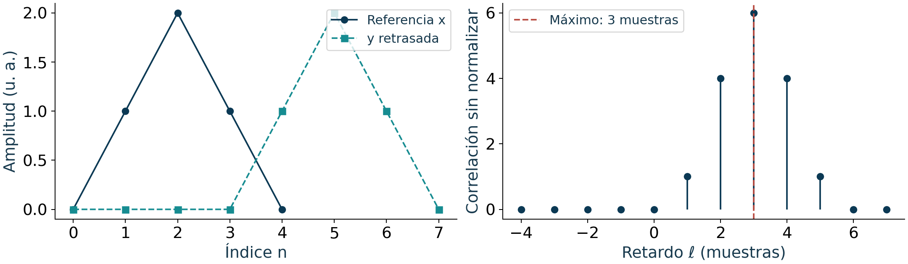
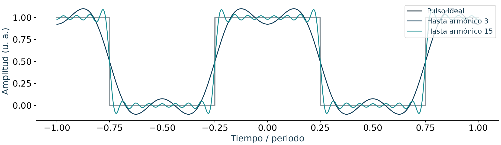

## Sistemas y Señales Biomédicos {.cover #d1-001}

**Semanas 1–5 · Bioseñales y representación**

Ph. D. Pablo Eduardo Caicedo-Rodríguez

Material de clase y estudio · Ingeniería Biomédica

::: {.notes}
**Libro guía:** John Semmlow, *Circuits, Signals, and Systems for Bioengineers*, 3.ª ed., 2018.

§1.1, **Why Biomedical Engineers Need To Analyze Signals And Systems** (página 8 del visor PDF); §2.2, **Time Domain Measurements** (página 57 del visor PDF); §2.4, **Time Domain Analysis** (página 81 del visor PDF); §3.3, **Time–Frequency Transformation Of Continuous Signals** (página 118 del visor PDF).

**Correspondencia:** Síntesis o encuadre que reúne varias secciones; no corresponde a un único apartado del libro. Lectura principal: Semmlow (2018), tercera edición. La correspondencia usa la edición del archivo aportado, que difiere de la segunda edición de 2012 citada en el microcurrículo.

**Lectura:** use estas secciones como ruta de preparación y consulta. La bibliografía aparece al final del bloque.
:::

## Cómo estudiar estas cinco semanas {.week-divider background-color="#0B3954" #d1-002}


::: {.notes}
**Libro guía:** John Semmlow, *Circuits, Signals, and Systems for Bioengineers*, 3.ª ed., 2018.

§1.1, **Why Biomedical Engineers Need To Analyze Signals And Systems** (página 8 del visor PDF); §2.2, **Time Domain Measurements** (página 57 del visor PDF); §2.4, **Time Domain Analysis** (página 81 del visor PDF); §3.3, **Time–Frequency Transformation Of Continuous Signals** (página 118 del visor PDF).

**Correspondencia:** Síntesis o encuadre que reúne varias secciones; no corresponde a un único apartado del libro.

**Lectura:** use estas secciones como ruta de preparación y consulta. La bibliografía aparece al final del bloque.
:::

## Una ruta desde el cuerpo hasta el espectro {#d1-003}

Al terminar la semana 5, el estudiante debe poder:

1. distinguir **fenómeno fisiológico, bioseñal, medición y registro**;
2. representar y transformar señales en tiempo continuo y discreto;
3. calcular e interpretar descriptores temporales;
4. segmentar, normalizar y detectar eventos sin perder el significado biomédico;
5. explicar por qué una señal periódica admite una representación de Fourier;
6. interpretar espectros de magnitud y fase.

::: {.callout-important}
## Idea conductora
Una bioseñal no es solo una secuencia de números: es una **medición imperfecta de un fenómeno fisiológico**, obtenida mediante una cadena física y analizada para responder una pregunta.
:::

::: {.notes}
**Libro guía:** John Semmlow, *Circuits, Signals, and Systems for Bioengineers*, 3.ª ed., 2018.

§1.1, **Why Biomedical Engineers Need To Analyze Signals And Systems** (página 8 del visor PDF); §2.2, **Time Domain Measurements** (página 57 del visor PDF); §2.4, **Time Domain Analysis** (página 81 del visor PDF); §3.3, **Time–Frequency Transformation Of Continuous Signals** (página 118 del visor PDF).

**Correspondencia:** Síntesis o encuadre que reúne varias secciones; no corresponde a un único apartado del libro.

**Lectura:** use estas secciones como ruta de preparación y consulta. La bibliografía aparece al final del bloque.
:::

## Mapa de las diez sesiones {#d1-004}

| Semana | Sesión 1 | Sesión 2 |
|---|---|---|
| 1 | Señal, sistema y bioseñal | Origen, ruido, interferencia y artefacto |
| 2 | Representación y descriptores | Señal sinusoidal |
| 3 | Operaciones con señales | Rasgos y eventos temporales |
| 4 | Segmentación y normalización | Del tiempo a la frecuencia |
| 5 | Series de Fourier | Transformada de Fourier |

Cada sesión combina fundamento, lectura fisiológica, desarrollo matemático, ejemplo computacional y verificación.

::: {.notes}
**Libro guía:** John Semmlow, *Circuits, Signals, and Systems for Bioengineers*, 3.ª ed., 2018.

§1.1, **Why Biomedical Engineers Need To Analyze Signals And Systems** (página 8 del visor PDF); §2.2, **Time Domain Measurements** (página 57 del visor PDF); §2.4, **Time Domain Analysis** (página 81 del visor PDF); §3.3, **Time–Frequency Transformation Of Continuous Signals** (página 118 del visor PDF).

**Correspondencia:** Síntesis o encuadre que reúne varias secciones; no corresponde a un único apartado del libro.

**Lectura:** use estas secciones como ruta de preparación y consulta. La bibliografía aparece al final del bloque.
:::

## Organización de cada sesión y trabajo independiente {#d1-005}

| Momento | Actividad | Tiempo |
|---|---|---:|
| Apertura | Lectura previa y predicción | 10 min |
| Fundamento | Ecuación, supuestos y ejemplo | 30 min |
| Aplicación | Cálculo o código en parejas | 30 min |
| Cierre | Comprobación individual y límites | 20 min |

::: {.callout-note}
Prepare la lectura en inglés indicada en las notas. Use las ampliaciones como consulta y trabajo independiente según los conocimientos previos del grupo.
:::

::: {.notes}
**Libro guía:** John Semmlow, *Circuits, Signals, and Systems for Bioengineers*, 3.ª ed., 2018.

§1.1.1, **Goals Of This Book** (página 10 del visor PDF).

**Correspondencia:** Organización docente basada en las actividades y RAE del microcurrículo. No corresponde a una sección temática del libro. Microcurrículo: actividades de aprendizaje y RAE, PDF 2–3. Distribución docente propuesta para las sesiones de 90 minutos.

**Lectura:** use estas secciones como ruta de preparación y consulta. La bibliografía aparece al final del bloque.
:::

## Evidencias de aprendizaje y criterios de revisión {#d1-006}

| Evidencia | Criterio observable |
|---|---|
| Lectura y explicación oral | Identifica el supuesto del texto y lo explica con sus palabras |
| Cálculo individual | Procedimiento correcto, unidades y caso límite |
| Cuaderno en parejas | Código reproducible, datos trazables y comprobación numérica |
| Informe breve | Interpreta el resultado, cita las fuentes y declara limitaciones |

::: {.callout-important}
Cada entrega debe permitir distinguir aportes individuales y trabajo conjunto. La corrección matemática y la justificación biomédica se revisan por separado. Los porcentajes de evaluación se rigen por el programa que confirme el profesor.
:::

::: {.notes}
**Libro guía:** John Semmlow, *Circuits, Signals, and Systems for Bioengineers*, 3.ª ed., 2018.

§1.1.1, **Goals Of This Book** (página 10 del visor PDF).

**Correspondencia:** Organización docente basada en las actividades y RAE del microcurrículo. No corresponde a una sección temática del libro. Microcurrículo: RAE y actividades de evaluación, PDF 2–3. No se resuelven aquí las inconsistencias administrativas del documento.

**Lectura:** use estas secciones como ruta de preparación y consulta. La bibliografía aparece al final del bloque.
:::

## Convenciones de los ejemplos en Python {#d1-007}

Los fragmentos que usan `x` y `fs` reciben una señal real, unidimensional, finita y uniformemente muestreada. En la actividad, documente unidades y metadatos antes de sustituirla.

```python
import numpy as np
fs = 256.0
t = np.arange(2048)/fs
x = np.cos(2*np.pi*10*t) + .3*np.sin(2*np.pi*23*t)
L, H, Nfft = 256, 128, 512
```

::: {.callout-note}
Este es un ejemplo sintético en unidades arbitrarias. Las variables específicas de una actividad (etiquetas, sujetos, umbrales, referencias) deben definirse para ese problema. Los casos reproducibles están en `codigo/ejemplos_verificados.py`.
:::

::: {.notes}
**Libro guía:** John Semmlow, *Circuits, Signals, and Systems for Bioengineers*, 3.ª ed., 2018.

§1.1.1, **Goals Of This Book** (página 10 del visor PDF).

**Correspondencia:** Ejemplo, figura o implementación de elaboración docente a partir de estos fundamentos. No es una transcripción del código MATLAB del libro. El lenguaje del microcurrículo suministrado es Python. El libro guía utiliza MATLAB; se conservan conceptos y se explicitan diferencias de convenciones.

**Lectura:** use estas secciones como ruta de preparación y consulta. La bibliografía aparece al final del bloque.
:::

## Semana 1 · Señales, sistemas y bioseñales {.week-divider background-color="#0B3954" #d1-008}


::: {.notes}
**Libro guía:** John Semmlow, *Circuits, Signals, and Systems for Bioengineers*, 3.ª ed., 2018.

§1.1, **Why Biomedical Engineers Need To Analyze Signals And Systems** (página 8 del visor PDF); §2.2, **Time Domain Measurements** (página 57 del visor PDF); §2.4, **Time Domain Analysis** (página 81 del visor PDF); §3.3, **Time–Frequency Transformation Of Continuous Signals** (página 118 del visor PDF).

**Correspondencia:** Síntesis o encuadre que reúne varias secciones; no corresponde a un único apartado del libro.

**Lectura:** use estas secciones como ruta de preparación y consulta. La bibliografía aparece al final del bloque.
:::

## Sesión 1 · La pregunta clínica define qué información importa {#d1-009}

Una medición solo adquiere sentido cuando se vincula con una pregunta:

- **ECG:** ¿cómo se propaga la activación eléctrica cardíaca?
- **EMG:** ¿cuándo y con qué patrón se activa un músculo?
- **EEG:** ¿cómo cambia la actividad eléctrica cortical?
- **Respiración:** ¿qué ritmo, amplitud o irregularidad presenta el ciclo ventilatorio?

::: {.callout-warning}
## No confundir
El ECG no es “el corazón” ni representa directamente la fuerza de contracción. Registra diferencias de potencial asociadas con la actividad eléctrica cardíaca, observadas desde una configuración de electrodos.
:::

::: {.notes}
**Libro guía:** John Semmlow, *Circuits, Signals, and Systems for Bioengineers*, 3.ª ed., 2018.

§1.1, **Why Biomedical Engineers Need To Analyze Signals And Systems** (página 8 del visor PDF); §1.2.2, **Biotransducers And Common Physiological Measurements** (página 12 del visor PDF).

**Correspondencia:** El tema se desarrolla en las secciones indicadas. La redacción es una síntesis docente.

**Microcurrículo:** semana 1, sesión 1 (sesión global 1). Los numerales del cronograma son identificadores curriculares; no son los apartados del libro citados arriba.
:::

## Señal: una variable que porta información {#d1-010}

Una señal puede representarse como una función:

$$x: \mathcal{D}\rightarrow\mathcal{C},\qquad x(t)\ \text{o}\ x[n]$$

- $\mathcal{D}$: dominio de la variable independiente, usualmente tiempo.
- $\mathcal{C}$: conjunto de valores de amplitud.
- $x(t)$: señal en tiempo continuo.
- $x[n]$: secuencia indexada en tiempo discreto.

::: {.callout-tip}
## Concepto clave
La señal es una **representación**. La información fisiológica útil depende del fenómeno, del sensor, de la ubicación, del protocolo y del objetivo del análisis.
:::

::: {.notes}
**Libro guía:** John Semmlow, *Circuits, Signals, and Systems for Bioengineers*, 3.ª ed., 2018.

§1.2.3, **Signal Representation: Continuous (Analog) Signals Versus Discrete (Digital) Signals** (página 14 del visor PDF).

**Correspondencia:** El tema se desarrolla en las secciones indicadas. La redacción es una síntesis docente.

**Microcurrículo:** semana 1, sesión 1 (sesión global 1). Los numerales del cronograma son identificadores curriculares; no son los apartados del libro citados arriba.
:::

## Sistema: una transformación con propósito {#d1-011}

Un sistema relaciona una entrada y una salida:

$$y=\mathcal{T}\{x\}$$

Ejemplos biomédicos:

- sistema cardiovascular: control y demanda $\rightarrow$ presión y flujo;
- amplificador: señal pequeña $\rightarrow$ señal medible;
- filtro: registro ruidoso $\rightarrow$ componentes atenuadas;
- detector: ECG $\rightarrow$ instantes R.

::: {.callout-important}
Un sistema puede ser biológico, físico, computacional o híbrido.
:::

::: {.notes}
**Libro guía:** John Semmlow, *Circuits, Signals, and Systems for Bioengineers*, 3.ª ed., 2018.

§1.4, **Biological Systems** (página 34 del visor PDF); §1.4.5, **Biosystems Modeling** (página 46 del visor PDF).

**Correspondencia:** El tema se desarrolla en las secciones indicadas. La redacción es una síntesis docente.

**Microcurrículo:** semana 1, sesión 1 (sesión global 1). Los numerales del cronograma son identificadores curriculares; no son los apartados del libro citados arriba.
:::

## Modelo entrada–sistema–salida {#d1-012}

$$\text{estímulo }x(t)\quad\longrightarrow\quad
\boxed{\text{sistema fisiológico }\mathcal{T}}
\quad\longrightarrow\quad\text{respuesta }y(t)$$

**Ejemplo:** reflejo pupilar.

- Entrada: intensidad luminosa.
- Sistema: retina, vías nerviosas y músculo del iris.
- Salida: diámetro pupilar.
- Perturbaciones: luz ambiental, movimiento, parpadeo y variación autónoma.

::: {.callout-note}
El diagrama es una abstracción. Elegir entradas, salidas y fronteras del sistema es ya una decisión de modelamiento.
:::

::: {.notes}
**Libro guía:** John Semmlow, *Circuits, Signals, and Systems for Bioengineers*, 3.ª ed., 2018.

§1.4, **Biological Systems** (página 34 del visor PDF); §1.4.5, **Biosystems Modeling** (página 46 del visor PDF).

**Correspondencia:** El tema se desarrolla en las secciones indicadas. La redacción es una síntesis docente.

**Microcurrículo:** semana 1, sesión 1 (sesión global 1). Los numerales del cronograma son identificadores curriculares; no son los apartados del libro citados arriba.
:::

## Fuente, estímulo y respuesta {#d1-013}

| Concepto | Pregunta | Ejemplo |
|---|---|---|
| Fuente | ¿El sistema genera actividad observable sin estímulo explícito? | Ritmo cardíaco espontáneo |
| Estímulo | ¿Qué señal externa modifica el sistema? | Luz sobre la retina |
| Respuesta | ¿Qué cambio se observa tras el estímulo? | Constricción pupilar |
| Perturbación | ¿Qué entrada no controlada altera la salida? | Movimiento del sujeto |

::: {.callout-warning}
La correlación temporal no demuestra causalidad: controle retardos y confundidores.
:::

::: {.notes}
**Libro guía:** John Semmlow, *Circuits, Signals, and Systems for Bioengineers*, 3.ª ed., 2018.

§1.4, **Biological Systems** (página 34 del visor PDF); §1.4.5, **Biosystems Modeling** (página 46 del visor PDF).

**Correspondencia:** El tema se desarrolla en las secciones indicadas. La redacción es una síntesis docente.

**Microcurrículo:** semana 1, sesión 1 (sesión global 1). Los numerales del cronograma son identificadores curriculares; no son los apartados del libro citados arriba.
:::

## Jerarquía de una observación biomédica {#d1-014}

1. **Fenómeno:** proceso fisiológico real.
2. **Mensurando:** magnitud que se desea medir.
3. **Transducción:** conversión de energía a señal utilizable.
4. **Registro:** valores almacenados con unidades y tiempo.
5. **Rasgo:** descriptor extraído del registro.
6. **Inferencia:** interpretación fisiológica o clínica.

::: {.callout-important}
Saltar directamente del registro a la inferencia suele ocultar supuestos. La trazabilidad exige declarar cada nivel.
:::

::: {.notes}
**Libro guía:** John Semmlow, *Circuits, Signals, and Systems for Bioengineers*, 3.ª ed., 2018.

§1.2.2, **Biotransducers And Common Physiological Measurements** (página 12 del visor PDF).

**Correspondencia:** Ejemplo, figura o implementación de elaboración docente a partir de estos fundamentos. No es una transcripción del código MATLAB del libro.

**Microcurrículo:** semana 1, sesión 1 (sesión global 1). Los numerales del cronograma son identificadores curriculares; no son los apartados del libro citados arriba.
:::

## Caso integrador: frecuencia cardíaca desde ECG {#d1-015}

El objetivo no es “medir frecuencia cardíaca” de forma directa:

1. electrodos observan diferencias de potencial;
2. el acondicionamiento limita y amplifica la señal;
3. el registro digital conserva muestras $x[n]$;
4. un detector estima instantes $t_{R,k}$;
5. se calculan intervalos $RR_k=t_{R,k}-t_{R,k-1}$;
6. se estima $HR_k=60/RR_k$ si $RR_k$ está en segundos.

::: {.callout-warning}
Un pico alto no es automáticamente una onda R. Artefactos de movimiento o estimulación pueden producir máximos espurios.
:::

::: {.notes}
**Libro guía:** John Semmlow, *Circuits, Signals, and Systems for Bioengineers*, 3.ª ed., 2018.

§1.2.2, **Biotransducers And Common Physiological Measurements** (página 12 del visor PDF).

**Correspondencia:** Ejemplo, figura o implementación de elaboración docente a partir de estos fundamentos. No es una transcripción del código MATLAB del libro.

**Microcurrículo:** semana 1, sesión 1 (sesión global 1). Los numerales del cronograma son identificadores curriculares; no son los apartados del libro citados arriba.
:::

## Verificación de la sesión 1 {#d1-016}

Para un sensor de presión plantar durante la marcha:

1. ¿Cuál es el fenómeno fisiomecánico?
2. ¿Cuál es el mensurando?
3. ¿Cuál es la variable independiente?
4. ¿Qué parte es el sistema?
5. ¿Qué inferencia sería razonable y cuál sería excesiva?

::: {.callout-tip}
## Criterio de logro
La respuesta debe separar explícitamente cuerpo, sensor, señal registrada, procesamiento e interpretación.
:::

::: {.notes}
**Libro guía:** John Semmlow, *Circuits, Signals, and Systems for Bioengineers*, 3.ª ed., 2018.

§1.2.1, **Biological Signal Sources** (página 11 del visor PDF); §1.2.2, **Biotransducers And Common Physiological Measurements** (página 12 del visor PDF).

**Correspondencia:** Actividad o interpretación biomédica de elaboración docente apoyada en las secciones indicadas.

**Microcurrículo:** semana 1, sesión 1 (sesión global 1). Los numerales del cronograma son identificadores curriculares; no son los apartados del libro citados arriba.
:::

## Sesión 2 · Las bioseñales expresan distintas formas de energía {#d1-017}

| Origen | Variable observable | Ejemplos |
|---|---|---|
| Bioeléctrico | potencial o corriente | ECG, EEG, EMG, EOG |
| Biomecánico | fuerza, presión, desplazamiento | presión arterial, marcha |
| Bioacústico | presión sonora | fonocardiograma, voz |
| Bioóptico | absorción o reflexión | fotopletismografía, oximetría |
| Bioquímico | concentración o actividad | glucosa, $\mathrm{pH}$, gases |
| Térmico | temperatura o radiación | termometría, termografía |

::: {.callout-important}
La modalidad de la bioseñal determina sensores, unidades, ancho de banda, fuentes de error y límites de interpretación.
:::

::: {.notes}
**Libro guía:** John Semmlow, *Circuits, Signals, and Systems for Bioengineers*, 3.ª ed., 2018.

§1.2.1, **Biological Signal Sources** (página 11 del visor PDF); §1.2.2, **Biotransducers And Common Physiological Measurements** (página 12 del visor PDF).

**Correspondencia:** El tema se desarrolla en las secciones indicadas. La redacción es una síntesis docente.

**Microcurrículo:** semana 1, sesión 2 (sesión global 2). Los numerales del cronograma son identificadores curriculares; no son los apartados del libro citados arriba.
:::

## Del fenómeno al dato: la cadena de observación {#d1-018}

$$\begin{aligned}
\text{fisiología}&\rightarrow\text{energía}\rightarrow\text{sensor}\\
&\rightarrow\text{acondicionamiento}\rightarrow\text{conversión}\\
&\rightarrow\text{datos}\rightarrow\text{decisión}
\end{aligned}$$

Preguntas de control:

- ¿Qué energía llega realmente al sensor?
- ¿Qué parte de la señal altera cada etapa?
- ¿Qué unidades tiene el dato almacenado?
- ¿Qué calibración permite volver a unidades físicas?

::: {.callout-note}
La adquisición nunca es neutra: introduce sensibilidad, limitación de banda, ruido, retardo y posible distorsión.
:::

::: {.notes}
**Libro guía:** John Semmlow, *Circuits, Signals, and Systems for Bioengineers*, 3.ª ed., 2018.

§1.2.2, **Biotransducers And Common Physiological Measurements** (página 12 del visor PDF); §4.2, **Data Acquisition And Storage** (página 175 del visor PDF).

**Correspondencia:** Ejemplo, figura o implementación de elaboración docente a partir de estos fundamentos. No es una transcripción del código MATLAB del libro.

**Microcurrículo:** semana 1, sesión 2 (sesión global 2). Los numerales del cronograma son identificadores curriculares; no son los apartados del libro citados arriba.
:::

## Un modelo aditivo útil, pero incompleto {#d1-019}

$$x_{obs}(t)=s(t)+n(t)+i(t)+a(t)$$

- $s(t)$: componente fisiológica de interés.
- $n(t)$: ruido aleatorio del sistema de medición.
- $i(t)$: interferencia originada por otra fuente.
- $a(t)$: artefacto asociado con el procedimiento o el sujeto.

::: {.callout-warning}
Este modelo supone suma lineal. En la práctica también existen saturación, deriva, pérdidas de contacto y acoplamientos no lineales.
:::

::: {.notes}
**Libro guía:** John Semmlow, *Circuits, Signals, and Systems for Bioengineers*, 3.ª ed., 2018.

§1.3.1, **Biological Noise Sources** (página 26 del visor PDF); §1.3.2, **Noise Properties: Additive Gaussian Noise** (página 27 del visor PDF).

**Correspondencia:** El tema se desarrolla en las secciones indicadas. La redacción es una síntesis docente.

**Microcurrículo:** semana 1, sesión 2 (sesión global 2). Los numerales del cronograma son identificadores curriculares; no son los apartados del libro citados arriba.
:::

## Ruido, interferencia y artefacto no son sinónimos {#d1-020}

| Término | Rasgo distintivo | Ejemplo |
|---|---|---|
| Ruido | fluctuación aleatoria no informativa para la tarea | ruido electrónico térmico |
| Interferencia | señal estructurada de fuente ajena | red eléctrica de 50/60 Hz |
| Artefacto | distorsión ligada a adquisición o conducta | movimiento de electrodos |
| Variabilidad | cambio fisiológico real | arritmia o modulación respiratoria |

::: {.callout-important}
Eliminar toda variación “irregular” puede destruir información fisiológica. Primero se clasifica la fuente; después se decide cómo tratarla.
:::

::: {.notes}
**Libro guía:** John Semmlow, *Circuits, Signals, and Systems for Bioengineers*, 3.ª ed., 2018.

§1.3.1, **Biological Noise Sources** (página 26 del visor PDF); §1.3.2, **Noise Properties: Additive Gaussian Noise** (página 27 del visor PDF).

**Correspondencia:** El tema se desarrolla en las secciones indicadas. La redacción es una síntesis docente.

**Microcurrículo:** semana 1, sesión 2 (sesión global 2). Los numerales del cronograma son identificadores curriculares; no son los apartados del libro citados arriba.
:::

## La relación señal–ruido necesita contexto {#d1-021}

Una forma basada en potencia es:

$$\mathrm{SNR}_{dB}=10\log_{10}\left(\frac{P_s}{P_n}\right)$$

Si se comparan amplitudes RMS bajo impedancias equivalentes:

$$\mathrm{SNR}_{dB}=20\log_{10}\left(\frac{x_{s,\mathrm{RMS}}}{x_{n,\mathrm{RMS}}}\right)$$

::: {.callout-warning}
No puede calcularse una SNR válida si no existe una definición operacional de “señal” y “ruido” o una referencia razonable.
:::

::: {.notes}
**Libro guía:** John Semmlow, *Circuits, Signals, and Systems for Bioengineers*, 3.ª ed., 2018.

§1.3.1, **Biological Noise Sources** (página 26 del visor PDF); §1.3.2, **Noise Properties: Additive Gaussian Noise** (página 27 del visor PDF).

**Correspondencia:** El tema se desarrolla en las secciones indicadas. La redacción es una síntesis docente.

**Microcurrículo:** semana 1, sesión 2 (sesión global 2). Los numerales del cronograma son identificadores curriculares; no son los apartados del libro citados arriba.
:::

## Artefactos frecuentes por modalidad {#d1-022}

- **ECG:** movimiento, mal contacto, actividad muscular, deriva de línea base.
- **EMG superficial:** desplazamiento de electrodos, crosstalk, cambio de impedancia.
- **EEG:** parpadeo, movimiento ocular, tensión muscular, cableado.
- **PPG:** presión del sensor, movimiento, perfusión periférica variable.
- **Respiración:** cambio de postura, habla, tos y desplazamiento de banda.

::: {.callout-tip}
## Principio de diseño
La prevención experimental suele ser mejor que la corrección digital: fijación, preparación de piel, sincronización y protocolo reducen errores difíciles de revertir.
:::

::: {.notes}
**Libro guía:** John Semmlow, *Circuits, Signals, and Systems for Bioengineers*, 3.ª ed., 2018.

§1.3.1, **Biological Noise Sources** (página 26 del visor PDF).

**Correspondencia:** Actividad o interpretación biomédica de elaboración docente apoyada en las secciones indicadas.

**Microcurrículo:** semana 1, sesión 2 (sesión global 2). Los numerales del cronograma son identificadores curriculares; no son los apartados del libro citados arriba.
:::

## ¿Artefacto o fisiología? {#d1-023}

Evidencias útiles:

1. coherencia con canales auxiliares;
2. simultaneidad con una marca de evento;
3. morfología y duración plausibles;
4. distribución espacial entre sensores;
5. respuesta esperada ante un estímulo;
6. inspección del montaje o video sincronizado.

::: {.callout-important}
La clasificación de un segmento debe sustentarse con evidencia multimodal o experimental, no solo con su apariencia.
:::

::: {.notes}
**Libro guía:** John Semmlow, *Circuits, Signals, and Systems for Bioengineers*, 3.ª ed., 2018.

§1.3.1, **Biological Noise Sources** (página 26 del visor PDF).

**Correspondencia:** Actividad o interpretación biomédica de elaboración docente apoyada en las secciones indicadas.

**Microcurrículo:** semana 1, sesión 2 (sesión global 2). Los numerales del cronograma son identificadores curriculares; no son los apartados del libro citados arriba.
:::

## Cierre de la semana 1 {#d1-024}

- Una señal porta información sobre una variable; un sistema transforma señales.
- La bioseñal observada depende del fenómeno y de la cadena de medición.
- Ruido, interferencia, artefacto y variabilidad fisiológica requieren tratamientos distintos.
- Toda inferencia debe conservar la trazabilidad desde el mensurando.

::: {.callout-note}
## Pregunta de salida
¿Qué error de interpretación aparecería si se tratara una variabilidad fisiológica real como “ruido” y se filtrara agresivamente?
:::

::: {.notes}
**Libro guía:** John Semmlow, *Circuits, Signals, and Systems for Bioengineers*, 3.ª ed., 2018.

§1.2, **Biosignal: Signals Produced By Living Systems** (página 11 del visor PDF); §1.3, **Noise** (página 26 del visor PDF).

**Correspondencia:** Síntesis o encuadre que reúne varias secciones; no corresponde a un único apartado del libro.

**Microcurrículo:** semana 1, sesión 2 (sesión global 2). Los numerales del cronograma son identificadores curriculares; no son los apartados del libro citados arriba.
:::

## Semana 2 · Representación y descripción temporal {.week-divider background-color="#0B3954" #d1-025}


::: {.notes}
**Libro guía:** John Semmlow, *Circuits, Signals, and Systems for Bioengineers*, 3.ª ed., 2018.

§1.1, **Why Biomedical Engineers Need To Analyze Signals And Systems** (página 8 del visor PDF); §2.2, **Time Domain Measurements** (página 57 del visor PDF); §2.4, **Time Domain Analysis** (página 81 del visor PDF); §3.3, **Time–Frequency Transformation Of Continuous Signals** (página 118 del visor PDF).

**Correspondencia:** Síntesis o encuadre que reúne varias secciones; no corresponde a un único apartado del libro.

**Lectura:** use estas secciones como ruta de preparación y consulta. La bibliografía aparece al final del bloque.
:::

## Sesión 3 · Variable independiente y variable dependiente {#d1-026}

Para una señal temporal:

$$x(t):\ t\mapsto\text{amplitud},\qquad x[n]:\ n\mapsto\text{amplitud}$$

- $t$ tiene unidades de tiempo.
- $n$ es un índice entero sin unidades.
- Si el muestreo es uniforme, $t_n=nT_s=n/f_s$.
- La amplitud conserva las unidades de la magnitud medida o del sistema digital.

::: {.callout-warning}
El índice $n$ no es tiempo físico. Para interpretar duración, retardo o frecuencia se necesita conocer $f_s$ o los sellos temporales.
:::

::: {.notes}
**Libro guía:** John Semmlow, *Circuits, Signals, and Systems for Bioengineers*, 3.ª ed., 2018.

§1.2.3, **Signal Representation: Continuous (Analog) Signals Versus Discrete (Digital) Signals** (página 14 del visor PDF).

**Correspondencia:** El tema se desarrolla en las secciones indicadas. La redacción es una síntesis docente.

**Microcurrículo:** semana 2, sesión 1 (sesión global 3). Los numerales del cronograma son identificadores curriculares; no son los apartados del libro citados arriba.
:::

## Continuo, discreto, analógico y digital {#d1-027}

| Propiedad | Pregunta |
|---|---|
| Tiempo continuo | ¿La variable independiente admite cualquier $t$? |
| Tiempo discreto | ¿Solo existen valores para índices $n$? |
| Amplitud continua | ¿La amplitud admite un continuo de valores? |
| Amplitud cuantizada | ¿La amplitud pertenece a niveles finitos? |

::: {.callout-important}
“Discreto” describe el eje independiente; “digital” suele implicar además amplitud cuantizada y una codificación numérica.
:::

::: {.notes}
**Libro guía:** John Semmlow, *Circuits, Signals, and Systems for Bioengineers*, 3.ª ed., 2018.

§1.2.3, **Signal Representation: Continuous (Analog) Signals Versus Discrete (Digital) Signals** (página 14 del visor PDF).

**Correspondencia:** El tema se desarrolla en las secciones indicadas. La redacción es una síntesis docente.

**Microcurrículo:** semana 2, sesión 1 (sesión global 3). Los numerales del cronograma son identificadores curriculares; no son los apartados del libro citados arriba.
:::

## Determinista y aleatoria: una distinción de modelo {#d1-028}

- **Determinista:** una regla permite especificar cada valor, por ejemplo $x(t)=A\cos(2\pi f_0t+\phi)$.
- **Aleatoria:** se modela mediante variables aleatorias y propiedades estadísticas.
- Una bioseñal registrada es una **realización** de un proceso fisiológico variable.

::: {.callout-note}
Que una señal sea reproducible parcialmente no la convierte en determinista. Ritmo, amplitud y morfología cambian intra- e intersujeto.
:::

::: {.notes}
**Libro guía:** John Semmlow, *Circuits, Signals, and Systems for Bioengineers*, 3.ª ed., 2018.

§1.4.1, **Deterministic Versus Stochastic Signals And Systems** (página 34 del visor PDF).

**Correspondencia:** El tema se desarrolla en las secciones indicadas. La redacción es una síntesis docente.

**Microcurrículo:** semana 2, sesión 1 (sesión global 3). Los numerales del cronograma son identificadores curriculares; no son los apartados del libro citados arriba.
:::

## Media y mediana responden preguntas distintas {#d1-029}

Para $N$ muestras:

$$\bar{x}=\frac{1}{N}\sum_{n=0}^{N-1}x[n]$$

- La **media** representa el balance algebraico y es sensible a valores extremos.
- La **mediana** es el percentil 50 y es más robusta a observaciones atípicas.

::: {.callout-warning}
En EMG bipolar con oscilación alrededor de cero, una media cercana a cero no implica ausencia de actividad muscular.
:::

::: {.notes}
**Libro guía:** John Semmlow, *Circuits, Signals, and Systems for Bioengineers*, 3.ª ed., 2018.

§2.2.1, **Mean And Root Mean Squared Signal Measurements** (página 58 del visor PDF).

**Correspondencia:** Las secciones aportan el fundamento. La diapositiva amplía la formulación o precisa condiciones que no se presentan con idéntica notación en el libro. La media se desarrolla en §2.2.1; la mediana es un complemento del cronograma.

**Microcurrículo:** semana 2, sesión 1 (sesión global 3). Los numerales del cronograma son identificadores curriculares; no son los apartados del libro citados arriba.
:::

## Varianza y desviación estándar cuantifican dispersión {#d1-030}

Varianza descriptiva del segmento (denominador $N$):

$$\sigma_x^2=\frac{1}{N}\sum_{n=0}^{N-1}(x[n]-\bar{x})^2$$

Desviación estándar:

$$\sigma_x=\sqrt{\sigma_x^2}$$

::: {.callout-tip}
La desviación estándar conserva las unidades de $x$. El estimador muestral con denominador $N-1$ tiene otro objetivo; la identidad RMS de la siguiente diapositiva usa denominador $N$.
:::

::: {.notes}
**Libro guía:** John Semmlow, *Circuits, Signals, and Systems for Bioengineers*, 3.ª ed., 2018.

§2.2.1, **Mean And Root Mean Squared Signal Measurements** (página 58 del visor PDF); §2.2.2, **Variance And Standard Deviation** (página 64 del visor PDF).

**Correspondencia:** El tema se desarrolla en las secciones indicadas. La redacción es una síntesis docente.

**Microcurrículo:** semana 2, sesión 1 (sesión global 3). Los numerales del cronograma son identificadores curriculares; no son los apartados del libro citados arriba.
:::

## Valor RMS: amplitud efectiva {#d1-031}

$$x_{\mathrm{RMS}}=\sqrt{\frac{1}{N}\sum_{n=0}^{N-1}x^2[n]}$$

Relación útil:

$$x_{\mathrm{RMS}}^2=\sigma_x^2+\bar{x}^{2}$$

- Si $\bar{x}=0$, entonces $x_{\mathrm{RMS}}=\sigma_x$.
- El RMS no elimina el signo arbitrariamente: mide magnitud cuadrática media.

::: {.callout-important}
En EMG, el RMS de una ventana puede describir nivel de actividad, pero depende de colocación, ganancia, tejido, ventana y normalización.
:::

::: {.notes}
**Libro guía:** John Semmlow, *Circuits, Signals, and Systems for Bioengineers*, 3.ª ed., 2018.

§2.2.1, **Mean And Root Mean Squared Signal Measurements** (página 58 del visor PDF); §2.2.2, **Variance And Standard Deviation** (página 64 del visor PDF).

**Correspondencia:** El tema se desarrolla en las secciones indicadas. La redacción es una síntesis docente.

**Microcurrículo:** semana 2, sesión 1 (sesión global 3). Los numerales del cronograma son identificadores curriculares; no son los apartados del libro citados arriba.
:::

## Energía y potencia media {#d1-032}

Para una secuencia, energía y potencia media se definen como:

$$\begin{aligned}
E_x&=\sum_{n=-\infty}^{\infty}|x[n]|^2,\\
P_x&=\lim_{N\to\infty}\frac{1}{2N+1}\sum_{n=-N}^{N}|x[n]|^2.
\end{aligned}$$

En un registro de $N$ muestras: $E_N=\sum_{n=0}^{N-1}|x[n]|^2$ y $P_N=E_N/N$.

::: {.callout-warning}
La integral se aproxima con $T_s\sum|x[n]|^2$, con unidades $[x]^2\,\mathrm{s}$. La suma sola tiene unidades $[x]^2$. Interpretar energía física exige un modelo de conversión.
:::

::: {.notes}
**Libro guía:** John Semmlow, *Circuits, Signals, and Systems for Bioengineers*, 3.ª ed., 2018.

§2.2.1, **Mean And Root Mean Squared Signal Measurements** (página 58 del visor PDF); §4.3, **Power Spectrum** (página 191 del visor PDF).

**Correspondencia:** Las secciones aportan el fundamento. La diapositiva amplía la formulación o precisa condiciones que no se presentan con idéntica notación en el libro.

**Microcurrículo:** semana 2, sesión 1 (sesión global 3). Los numerales del cronograma son identificadores curriculares; no son los apartados del libro citados arriba.
:::

## Ejemplo computacional: descriptores explícitos {#d1-033}

```python
import numpy as np

x = np.asarray(x, dtype=float)
media = np.mean(x)
mediana = np.median(x)
varianza = np.mean((x - media)**2)  # denominador N
desv = np.sqrt(varianza)
rms = np.sqrt(np.mean(x**2))
energia = np.sum(x**2)
```

::: {.callout-note}
Antes de calcular: comprobar unidades, valores faltantes, saturación, longitud del segmento y si el segmento es comparable entre sujetos.
:::

::: {.notes}
**Libro guía:** John Semmlow, *Circuits, Signals, and Systems for Bioengineers*, 3.ª ed., 2018.

§2.2.1, **Mean And Root Mean Squared Signal Measurements** (página 58 del visor PDF); §2.2.2, **Variance And Standard Deviation** (página 64 del visor PDF).

**Correspondencia:** Ejemplo, figura o implementación de elaboración docente a partir de estos fundamentos. No es una transcripción del código MATLAB del libro.

**Microcurrículo:** semana 2, sesión 1 (sesión global 3). Los numerales del cronograma son identificadores curriculares; no son los apartados del libro citados arriba.
:::

## Promediado de realizaciones y reducción de ruido {#d1-034}

Si $x_r[n]=s[n]+v_r[n]$ y los ruidos tienen media cero, varianza $\sigma_v^2$ y son incorrelacionados entre realizaciones:

$$\bar x[n]=\frac1R\sum_{r=1}^{R}x_r[n],\qquad
\operatorname{Var}(\bar v[n])=\frac{\sigma_v^2}{R}.$$

::: {.callout-important}
El promedio conserva la respuesta repetible y reduce la desviación del ruido por $\sqrt R$. Los registros deben estar alineados y corresponder al mismo estado.
:::

En potenciales evocados, variación de latencia o adaptación puede ensanchar y atenuar la respuesta promedio.

::: {.notes}
**Libro guía:** John Semmlow, *Circuits, Signals, and Systems for Bioengineers*, 3.ª ed., 2018.

§2.2.3, **Averaging For Noise Reduction** (página 68 del visor PDF); §2.2.4, **Ensemble Averaging** (página 70 del visor PDF).

**Correspondencia:** El tema se desarrolla en las secciones indicadas. La redacción es una síntesis docente.

**Microcurrículo:** semana 2, sesión 1 (sesión global 3). Los numerales del cronograma son identificadores curriculares; no son los apartados del libro citados arriba.
:::

## Sesión 4 · La sinusoide como coordenada de oscilación {#d1-035}

$$x(t)=A\cos(2\pi f_0t+\phi)=A\cos(\omega_0t+\phi)$$

| Parámetro | Significado | Unidad |
|---|---|---|
| $A$ | amplitud pico | unidad de $x$ |
| $f_0$ | frecuencia | Hz |
| $T_0$ | periodo, $T_0=1/f_0$ | s |
| $\omega_0$ | frecuencia angular, $2\pi f_0$ | rad/s |
| $\phi$ | fase inicial | rad |

::: {.callout-important}
En un sistema LTI con respuesta frecuencial definida, una entrada sinusoidal produce una salida de la misma frecuencia en régimen permanente. Un transitorio inicial puede añadir otros modos.
:::

::: {.notes}
**Libro guía:** John Semmlow, *Circuits, Signals, and Systems for Bioengineers*, 3.ª ed., 2018.

§2.3.1, **Sinusoids As Real-Valued Signals** (página 73 del visor PDF); §6.3, **The Response Of System Elements To Sinusoidal Inputs: Phasor Analysis** (página 251 del visor PDF).

**Correspondencia:** El tema se desarrolla en las secciones indicadas. La redacción es una síntesis docente.

**Microcurrículo:** semana 2, sesión 2 (sesión global 4). Los numerales del cronograma son identificadores curriculares; no son los apartados del libro citados arriba.
:::

## Frecuencia no significa rapidez de muestreo {#d1-036}

- $f_0$: oscilaciones de la señal por segundo.
- $f_s$: muestras adquiridas por segundo.
- $N$: número de muestras del registro.
- $T=N/f_s$: duración del bloque usada por la DFT.
- Entre la primera y la última muestra transcurren $(N-1)/f_s$.

Ejemplo: si $f_s=500$ Hz y $N=2000$, la duración es $4$ s. Una componente de $10$ Hz completa aproximadamente $40$ ciclos en ese intervalo.

::: {.callout-warning}
Confundir $f_0$ con $f_s$ conduce a errores de interpretación y, más adelante, a errores de aliasing y resolución espectral.
:::

::: {.notes}
**Libro guía:** John Semmlow, *Circuits, Signals, and Systems for Bioengineers*, 3.ª ed., 2018.

§1.2.3, **Signal Representation: Continuous (Analog) Signals Versus Discrete (Digital) Signals** (página 14 del visor PDF); §3.4.3, **Details Of The Dft Spectrum** (página 153 del visor PDF).

**Correspondencia:** El tema se desarrolla en las secciones indicadas. La redacción es una síntesis docente.

**Microcurrículo:** semana 2, sesión 2 (sesión global 4). Los numerales del cronograma son identificadores curriculares; no son los apartados del libro citados arriba.
:::

## La fase ubica el ciclo respecto de una referencia {#d1-037}

Dos señales con igual amplitud y frecuencia:

$$x_1(t)=A\cos(\omega_0t),\qquad x_2(t)=A\cos(\omega_0t+\phi)$$

presentan un desplazamiento temporal equivalente:

$$\Delta t=-\frac{\phi}{\omega_0}=-\frac{\phi}{2\pi f_0}$$

::: {.callout-note}
El signo depende de la convención. Una fase positiva en $\cos(\omega t+\phi)$ representa un adelanto respecto de $\cos(\omega t)$.
:::

::: {.notes}
**Libro guía:** John Semmlow, *Circuits, Signals, and Systems for Bioengineers*, 3.ª ed., 2018.

§2.3.1, **Sinusoids As Real-Valued Signals** (página 73 del visor PDF).

**Correspondencia:** El tema se desarrolla en las secciones indicadas. La redacción es una síntesis docente.

**Microcurrículo:** semana 2, sesión 2 (sesión global 4). Los numerales del cronograma son identificadores curriculares; no son los apartados del libro citados arriba.
:::

## Senoides complejas: representación compacta {#d1-038}

Por la identidad de Euler:

$$e^{j\theta}=\cos\theta+j\sin\theta$$

Entonces:

$$A\cos(\omega_0t+\phi)=\Re\{Ae^{j\phi}e^{j\omega_0t}\}$$

::: {.callout-tip}
La exponencial compleja separa la amplitud/fase, contenida en $Ae^{j\phi}$, de la evolución temporal $e^{j\omega_0t}$.
:::

::: {.notes}
**Libro guía:** John Semmlow, *Circuits, Signals, and Systems for Bioengineers*, 3.ª ed., 2018.

§2.3.2, **Complex Representation Of Sinusoids** (página 78 del visor PDF); §3.3.6, **Complex Representation** (página 132 del visor PDF).

**Correspondencia:** El tema se desarrolla en las secciones indicadas. La redacción es una síntesis docente.

**Microcurrículo:** semana 2, sesión 2 (sesión global 4). Los numerales del cronograma son identificadores curriculares; no son los apartados del libro citados arriba.
:::

## Una señal real requiere frecuencias conjugadas {#d1-039}

$$A\cos(\omega_0t+\phi)=\frac{A}{2}e^{j\phi}e^{j\omega_0t}
+\frac{A}{2}e^{-j\phi}e^{-j\omega_0t}$$

Consecuencias:

- el espectro bilateral de una cosenoide tiene componentes en $\pm f_0$;
- para señales reales, la magnitud es simétrica;
- la fase presenta simetría impar cuando se cumplen las condiciones apropiadas.

::: {.callout-important}
Las frecuencias negativas son una consecuencia matemática de la representación compleja; no significan “oscilaciones hacia atrás” en el cuerpo.
:::

::: {.notes}
**Libro guía:** John Semmlow, *Circuits, Signals, and Systems for Bioengineers*, 3.ª ed., 2018.

§2.3.2, **Complex Representation Of Sinusoids** (página 78 del visor PDF); §3.3.6, **Complex Representation** (página 132 del visor PDF).

**Correspondencia:** El tema se desarrolla en las secciones indicadas. La redacción es una síntesis docente.

**Microcurrículo:** semana 2, sesión 2 (sesión global 4). Los numerales del cronograma son identificadores curriculares; no son los apartados del libro citados arriba.
:::

## Verificación de la semana 2 {#d1-040}

Una ventana de EMG tiene media $0.01$ mV, desviación estándar $0.30$ mV y RMS $0.3002$ mV.

1. ¿Es coherente con $x_{RMS}^2=\sigma^2+\bar{x}^2$?
2. ¿Qué descriptor informa mejor sobre magnitud de actividad?
3. ¿Qué datos faltan para comparar con otra persona?
4. Si $f_s=1000$ Hz y hay 250 muestras, ¿cuánto dura la ventana?

::: {.callout-tip}
## Criterio de logro
Debe justificar unidades, ventana, muestreo y significado fisiológico; no basta con sustituir valores.
:::

::: {.notes}
**Libro guía:** John Semmlow, *Circuits, Signals, and Systems for Bioengineers*, 3.ª ed., 2018.

§2.2.1, **Mean And Root Mean Squared Signal Measurements** (página 58 del visor PDF); §2.2.2, **Variance And Standard Deviation** (página 64 del visor PDF); §2.3.1, **Sinusoids As Real-Valued Signals** (página 73 del visor PDF).

**Correspondencia:** Síntesis o encuadre que reúne varias secciones; no corresponde a un único apartado del libro.

**Microcurrículo:** semana 2, sesión 2 (sesión global 4). Los numerales del cronograma son identificadores curriculares; no son los apartados del libro citados arriba.
:::

## Semana 3 · Operaciones y rasgos temporales {.week-divider background-color="#0B3954" #d1-041}


::: {.notes}
**Libro guía:** John Semmlow, *Circuits, Signals, and Systems for Bioengineers*, 3.ª ed., 2018.

§1.1, **Why Biomedical Engineers Need To Analyze Signals And Systems** (página 8 del visor PDF); §2.2, **Time Domain Measurements** (página 57 del visor PDF); §2.4, **Time Domain Analysis** (página 81 del visor PDF); §3.3, **Time–Frequency Transformation Of Continuous Signals** (página 118 del visor PDF).

**Correspondencia:** Síntesis o encuadre que reúne varias secciones; no corresponde a un único apartado del libro.

**Lectura:** use estas secciones como ruta de preparación y consulta. La bibliografía aparece al final del bloque.
:::

## Sesión 5 · Desplazamiento temporal {#d1-042}

Para tiempo continuo:

$$y(t)=x(t-t_0)$$

- $t_0>0$: retraso.
- $t_0<0$: adelanto.

Para tiempo discreto:

$$y[n]=x[n-n_0]$$

::: {.callout-warning}
El signo se interpreta desde el argumento. $x(t-2)$ aparece dos unidades a la derecha; el “menos” no implica adelanto.
:::

::: {.notes}
**Libro guía:** John Semmlow, *Circuits, Signals, and Systems for Bioengineers*, 3.ª ed., 2018.

§1.4.2, **Deterministic Signal Properties: Periodic, Aperiodic, And Transient** (página 37 del visor PDF); §2.4.4, **Shifted Correlations: Cross-Correlation** (página 89 del visor PDF).

**Correspondencia:** Tema previsto en el cronograma, desarrollado como ampliación docente. Las referencias del libro son antecedentes conceptuales. El cronograma prescribe este tema. Las secciones citadas aportan antecedentes; el libro no dedica una sección específica a cada técnica de preprocesamiento o detección presentada aquí.

**Microcurrículo:** semana 3, sesión 1 (sesión global 5). Los numerales del cronograma son identificadores curriculares; no son los apartados del libro citados arriba.
:::

## Escalamiento temporal cambia la velocidad {#d1-043}

$$y(t)=x(at)$$

- $|a|>1$: compresión temporal.
- $0<|a|<1$: expansión temporal.
- $a<0$: incluye inversión temporal.

Si $x(t)$ tiene periodo $T_0$, $x(at)$ tiene periodo $T_0/|a|$.

::: {.callout-important}
Escalar el tiempo modifica frecuencias. No equivale a multiplicar la amplitud por una constante.
:::

::: {.notes}
**Libro guía:** John Semmlow, *Circuits, Signals, and Systems for Bioengineers*, 3.ª ed., 2018.

§1.4.2, **Deterministic Signal Properties: Periodic, Aperiodic, And Transient** (página 37 del visor PDF); §2.4.4, **Shifted Correlations: Cross-Correlation** (página 89 del visor PDF).

**Correspondencia:** Tema previsto en el cronograma, desarrollado como ampliación docente. Las referencias del libro son antecedentes conceptuales. El cronograma prescribe este tema. Las secciones citadas aportan antecedentes; el libro no dedica una sección específica a cada técnica de preprocesamiento o detección presentada aquí.

**Microcurrículo:** semana 3, sesión 1 (sesión global 5). Los numerales del cronograma son identificadores curriculares; no son los apartados del libro citados arriba.
:::

## Inversión temporal: una operación matemática {#d1-044}

$$y(t)=x(-t)$$

Procedimiento gráfico:

1. identificar puntos de quiebre y eventos;
2. cambiar cada coordenada temporal $t_k\mapsto -t_k$;
3. conservar la amplitud;
4. reordenar el trazo.

::: {.callout-note}
Invertir un registro completo requiere disponer de ese registro. Como operación sobre una entrada que llega en tiempo real, usa valores futuros y es no causal.
:::

::: {.notes}
**Libro guía:** John Semmlow, *Circuits, Signals, and Systems for Bioengineers*, 3.ª ed., 2018.

§1.4.2, **Deterministic Signal Properties: Periodic, Aperiodic, And Transient** (página 37 del visor PDF); §2.4.4, **Shifted Correlations: Cross-Correlation** (página 89 del visor PDF).

**Correspondencia:** Tema previsto en el cronograma, desarrollado como ampliación docente. Las referencias del libro son antecedentes conceptuales. El cronograma prescribe este tema. Las secciones citadas aportan antecedentes; el libro no dedica una sección específica a cada técnica de preprocesamiento o detección presentada aquí.

**Microcurrículo:** semana 3, sesión 1 (sesión global 5). Los numerales del cronograma son identificadores curriculares; no son los apartados del libro citados arriba.
:::

## El orden de las transformaciones importa {#d1-045}

Para $a\ne0$:

$$y(t)=x(at-b)=x\!\left(a\left[t-\frac{b}{a}\right]\right).$$

Dos procedimientos equivalentes:

1. formar $g(t)=x(at)$ y luego $g(t-b/a)$;
2. formar $g(t)=x(t-b)$ y luego $g(at)$.

::: {.callout-important}
Un evento ubicado en $t=t_k$ pasa a $t=(t_k+b)/a$. Esta regla comprueba signos y orden, incluso cuando $a<0$.
:::

::: {.notes}
**Libro guía:** John Semmlow, *Circuits, Signals, and Systems for Bioengineers*, 3.ª ed., 2018.

§1.4.2, **Deterministic Signal Properties: Periodic, Aperiodic, And Transient** (página 37 del visor PDF); §2.4.4, **Shifted Correlations: Cross-Correlation** (página 89 del visor PDF).

**Correspondencia:** Tema previsto en el cronograma, desarrollado como ampliación docente. Las referencias del libro son antecedentes conceptuales. El cronograma prescribe este tema. Las secciones citadas aportan antecedentes; el libro no dedica una sección específica a cada técnica de preprocesamiento o detección presentada aquí.

**Microcurrículo:** semana 3, sesión 1 (sesión global 5). Los numerales del cronograma son identificadores curriculares; no son los apartados del libro citados arriba.
:::

## Operaciones de amplitud {#d1-046}

- **Ganancia:** $y(t)=Kx(t)$.
- **Desplazamiento vertical:** $y(t)=x(t)+C$.
- **Suma:** $y(t)=x_1(t)+x_2(t)$.
- **Producto:** $y(t)=x_1(t)x_2(t)$.

Interpretaciones:

- ganancia del amplificador;
- deriva o nivel DC;
- superposición de fuentes;
- modulación o enmascaramiento temporal.

::: {.callout-important}
Sumar señales exige compatibilidad de unidades y referencia. Multiplicarlas cambia las unidades y puede generar nuevas componentes frecuenciales.
:::

::: {.notes}
**Libro guía:** John Semmlow, *Circuits, Signals, and Systems for Bioengineers*, 3.ª ed., 2018.

§1.4.2, **Deterministic Signal Properties: Periodic, Aperiodic, And Transient** (página 37 del visor PDF); §2.4.4, **Shifted Correlations: Cross-Correlation** (página 89 del visor PDF).

**Correspondencia:** Tema previsto en el cronograma, desarrollado como ampliación docente. Las referencias del libro son antecedentes conceptuales. El cronograma prescribe este tema. Las secciones citadas aportan antecedentes; el libro no dedica una sección específica a cada técnica de preprocesamiento o detección presentada aquí.

**Microcurrículo:** semana 3, sesión 1 (sesión global 5). Los numerales del cronograma son identificadores curriculares; no son los apartados del libro citados arriba.
:::

## Ventaneo como multiplicación {#d1-047}

Para seleccionar un intervalo $[t_1,t_2]$:

$$x_w(t)=x(t)w(t),\qquad
w(t)=u(t-t_1)-u(t-t_2)$$

En discreto, una máscara booleana cumple el mismo papel.

::: {.callout-warning}
Recortar en el tiempo no es inocuo: más adelante veremos que una ventana modifica el espectro y puede producir fuga espectral.
:::

::: {.notes}
**Libro guía:** John Semmlow, *Circuits, Signals, and Systems for Bioengineers*, 3.ª ed., 2018.

§4.2.3, **Data Truncation** (página 184 del visor PDF); §4.2.4, **Data Truncation—Window Functions** (página 188 del visor PDF).

**Correspondencia:** Ejemplo, figura o implementación de elaboración docente a partir de estos fundamentos. No es una transcripción del código MATLAB del libro. El cronograma prescribe este tema. Las secciones citadas aportan antecedentes; el libro no dedica una sección específica a cada técnica de preprocesamiento o detección presentada aquí.

**Microcurrículo:** semana 3, sesión 1 (sesión global 5). Los numerales del cronograma son identificadores curriculares; no son los apartados del libro citados arriba.
:::

## Código: tiempo y amplitud no se transforman igual {#d1-048}

```python
import numpy as np

fs = 500
t = np.arange(len(x)) / fs

y_amp = 2.0 * x              # amplitud
y_shift = np.roll(x, 25)      # 50 ms, con efecto circular
mask = (t >= 1.0) & (t < 2.0)
segmento = x[mask]
```

::: {.callout-warning}
`np.roll` realiza un desplazamiento circular: las últimas muestras reaparecen al inicio. Para un retraso físico deben rellenarse las nuevas posiciones.
:::

::: {.notes}
**Libro guía:** John Semmlow, *Circuits, Signals, and Systems for Bioengineers*, 3.ª ed., 2018.

§1.4.2, **Deterministic Signal Properties: Periodic, Aperiodic, And Transient** (página 37 del visor PDF); §2.4.4, **Shifted Correlations: Cross-Correlation** (página 89 del visor PDF).

**Correspondencia:** Tema previsto en el cronograma, desarrollado como ampliación docente. Las referencias del libro son antecedentes conceptuales. El cronograma prescribe este tema. Las secciones citadas aportan antecedentes; el libro no dedica una sección específica a cada técnica de preprocesamiento o detección presentada aquí.

**Microcurrículo:** semana 3, sesión 1 (sesión global 5). Los numerales del cronograma son identificadores curriculares; no son los apartados del libro citados arriba.
:::

## Sesión 6 · Un rasgo temporal comprime información {#d1-049}

Un rasgo $r=F\{x[n]\}$ resume una propiedad del segmento:

- amplitud o dispersión;
- forma o morfología;
- temporalidad de eventos;
- regularidad;
- relación con otro canal.

::: {.callout-important}
Todo rasgo pierde información. Debe seleccionarse porque conserva lo relevante para la pregunta biomédica, no porque sea fácil de calcular.
:::

::: {.notes}
**Libro guía:** John Semmlow, *Circuits, Signals, and Systems for Bioengineers*, 3.ª ed., 2018.

§2.2, **Time Domain Measurements** (página 57 del visor PDF); §2.4, **Time Domain Analysis** (página 81 del visor PDF).

**Correspondencia:** Tema previsto en el cronograma, desarrollado como ampliación docente. Las referencias del libro son antecedentes conceptuales. El cronograma prescribe este tema. Las secciones citadas aportan antecedentes; el libro no dedica una sección específica a cada técnica de preprocesamiento o detección presentada aquí.

**Microcurrículo:** semana 3, sesión 2 (sesión global 6). Los numerales del cronograma son identificadores curriculares; no son los apartados del libro citados arriba.
:::

## Envolvente: describir variaciones lentas de amplitud {#d1-050}

Dos rutas comunes:

1. rectificación + filtro pasa-bajas;
2. módulo de la señal analítica mediante Hilbert.

$$x_a(t)=x(t)+j\,\mathcal{H}\{x(t)\},\qquad e(t)=|x_a(t)|$$

::: {.callout-warning}
El módulo analítico se interpreta como amplitud modulante bajo separación de escalas y condiciones de banda apropiadas. En una señal multicomponente puede mezclar batimientos. La rectificación seguida de pasa bajas tampoco produce automáticamente una medida de fuerza.
:::

::: {.notes}
**Libro guía:** John Semmlow, *Circuits, Signals, and Systems for Bioengineers*, 3.ª ed., 2018.

§2.4, **Time Domain Analysis** (página 81 del visor PDF); §4.6, **Time–Frequency Analysis** (página 205 del visor PDF).

**Correspondencia:** No existe una sección específica del libro guía para el tema completo de esta diapositiva. Las secciones anteriores son antecedentes, no referencias directas. La envolvente de Hilbert no tiene sección propia en el libro guía. Complemento: Semmlow y Griffel (2014), §6.3.3, The Analytic Signal. La interpretación de envolvente exige supuestos adicionales.

**Microcurrículo:** semana 3, sesión 2 (sesión global 6). Los numerales del cronograma son identificadores curriculares; no son los apartados del libro citados arriba.
:::

## Cruces por cero {#d1-051}

Conteo básico:

$$ZC=\sum_{n=1}^{N-1}\mathbf{1}\{x[n]x[n-1]<0\}$$

Problema: ruido pequeño alrededor de cero genera cruces falsos.

Con umbral $\delta$ se exige además:

$$|x[n]-x[n-1]|\geq\delta$$

::: {.callout-tip}
En EMG, el número de cruces puede relacionarse con contenido frecuencial, pero es sensible al umbral, ruido, amplitud y frecuencia de muestreo.
:::

::: {.notes}
**Libro guía:** John Semmlow, *Circuits, Signals, and Systems for Bioengineers*, 3.ª ed., 2018.

§2.2, **Time Domain Measurements** (página 57 del visor PDF); §2.4, **Time Domain Analysis** (página 81 del visor PDF).

**Correspondencia:** Tema previsto en el cronograma, desarrollado como ampliación docente. Las referencias del libro son antecedentes conceptuales. El cronograma prescribe este tema. Las secciones citadas aportan antecedentes; el libro no dedica una sección específica a cada técnica de preprocesamiento o detección presentada aquí.

**Microcurrículo:** semana 3, sesión 2 (sesión global 6). Los numerales del cronograma son identificadores curriculares; no son los apartados del libro citados arriba.
:::

## Máximos y mínimos no equivalen a eventos {#d1-052}

Un pico candidato puede requerir:

- altura mínima;
- prominencia;
- distancia mínima entre picos;
- ancho plausible;
- contexto morfológico;
- consistencia entre canales.

::: {.callout-important}
Detectar eventos es formular restricciones fisiológicas y temporales. `argmax` solo localiza el valor máximo del intervalo.
:::

::: {.notes}
**Libro guía:** John Semmlow, *Circuits, Signals, and Systems for Bioengineers*, 3.ª ed., 2018.

§2.2, **Time Domain Measurements** (página 57 del visor PDF); §2.4, **Time Domain Analysis** (página 81 del visor PDF).

**Correspondencia:** Tema previsto en el cronograma, desarrollado como ampliación docente. Las referencias del libro son antecedentes conceptuales. El cronograma prescribe este tema. Las secciones citadas aportan antecedentes; el libro no dedica una sección específica a cada técnica de preprocesamiento o detección presentada aquí.

**Microcurrículo:** semana 3, sesión 2 (sesión global 6). Los numerales del cronograma son identificadores curriculares; no son los apartados del libro citados arriba.
:::

## Intervalos y tasas {#d1-053}

Si los eventos ocurren en $t_k$:

$$\Delta t_k=t_k-t_{k-1},\qquad r_k=\frac{1}{\Delta t_k}$$

Para frecuencia cardíaca:

$$HR_k=\frac{60}{RR_k}\quad [\mathrm{latidos/min}]$$

::: {.callout-warning}
Promediar tasas instantáneas y calcular la tasa a partir del intervalo promedio no producen exactamente el mismo resultado.
:::

::: {.notes}
**Libro guía:** John Semmlow, *Circuits, Signals, and Systems for Bioengineers*, 3.ª ed., 2018.

§2.2, **Time Domain Measurements** (página 57 del visor PDF); §2.4, **Time Domain Analysis** (página 81 del visor PDF).

**Correspondencia:** Tema previsto en el cronograma, desarrollado como ampliación docente. Las referencias del libro son antecedentes conceptuales. El cronograma prescribe este tema. Las secciones citadas aportan antecedentes; el libro no dedica una sección específica a cada técnica de preprocesamiento o detección presentada aquí.

**Microcurrículo:** semana 3, sesión 2 (sesión global 6). Los numerales del cronograma son identificadores curriculares; no son los apartados del libro citados arriba.
:::

## Código: detección con restricciones {#d1-054}

```python
from scipy.signal import find_peaks

distancia = int(0.30 * fs)
picos, propiedades = find_peaks(
    x,
    distance=distancia,
    prominence=prominencia_minima
)
tiempos = picos / fs
intervalos = np.diff(tiempos)
```

::: {.callout-note}
Los parámetros deben justificarse con fisiología, frecuencia de muestreo y población; no deben copiarse sin validación.
:::

::: {.notes}
**Libro guía:** John Semmlow, *Circuits, Signals, and Systems for Bioengineers*, 3.ª ed., 2018.

§2.2, **Time Domain Measurements** (página 57 del visor PDF); §2.4, **Time Domain Analysis** (página 81 del visor PDF).

**Correspondencia:** Tema previsto en el cronograma, desarrollado como ampliación docente. Las referencias del libro son antecedentes conceptuales. El cronograma prescribe este tema. Las secciones citadas aportan antecedentes; el libro no dedica una sección específica a cada técnica de preprocesamiento o detección presentada aquí.

**Microcurrículo:** semana 3, sesión 2 (sesión global 6). Los numerales del cronograma son identificadores curriculares; no son los apartados del libro citados arriba.
:::

## Validación de un detector de eventos {#d1-055}

Para detectar eventos puntuales se emparejan detecciones y referencias **uno a uno**, dentro de una tolerancia $\pm\Delta t$.

| Resultado | Regla |
|---|---|
| Verdadero positivo (VP) | pareja válida detección–referencia |
| Falso positivo (FP) | detección sin pareja |
| Falso negativo (FN) | referencia sin pareja |

$$\mathrm{Sensibilidad}=\frac{VP}{VP+FN},\qquad
\mathrm{PPV}=\frac{VP}{VP+FP}.$$

::: {.callout-important}
Los verdaderos negativos no tienen un conteo natural en tiempo continuo. Especificidad exige definir previamente ventanas u oportunidades negativas. Informe también el error temporal de las parejas válidas.
:::

::: {.notes}
**Libro guía:** John Semmlow, *Circuits, Signals, and Systems for Bioengineers*, 3.ª ed., 2018.

§2.4.4, **Shifted Correlations: Cross-Correlation** (página 89 del visor PDF).

**Correspondencia:** No existe una sección específica del libro guía para el tema completo de esta diapositiva. Las secciones anteriores son antecedentes, no referencias directas. Antecedente: detección por semejanza. Complemento para métricas: Semmlow y Griffel (2014), §16.3. El emparejamiento temporal uno a uno es la adaptación docente para eventos.

**Microcurrículo:** semana 3, sesión 2 (sesión global 6). Los numerales del cronograma son identificadores curriculares; no son los apartados del libro citados arriba.
:::

## Cierre de la semana 3 {#d1-056}

- Las operaciones en tiempo deben leerse desde el argumento.
- Ventanear es multiplicar; desplazar con arreglos puede ser circular.
- Los rasgos resumen la señal bajo supuestos.
- Un evento requiere criterios fisiológicos, no solo geométricos.
- La validación necesita referencia, tolerancia y métricas adecuadas.

::: {.callout-note}
## Pregunta de salida
¿Por qué un detector con sensibilidad del 99 % puede ser clínicamente poco útil si su valor predictivo positivo es bajo?
:::

::: {.notes}
**Libro guía:** John Semmlow, *Circuits, Signals, and Systems for Bioengineers*, 3.ª ed., 2018.

§2.2, **Time Domain Measurements** (página 57 del visor PDF); §2.4, **Time Domain Analysis** (página 81 del visor PDF).

**Correspondencia:** Tema previsto en el cronograma, desarrollado como ampliación docente. Las referencias del libro son antecedentes conceptuales. El cronograma prescribe este tema. Las secciones citadas aportan antecedentes; el libro no dedica una sección específica a cada técnica de preprocesamiento o detección presentada aquí.

**Microcurrículo:** semana 3, sesión 2 (sesión global 6). Los numerales del cronograma son identificadores curriculares; no son los apartados del libro citados arriba.
:::

## Correlación como comparación de morfologías {#d1-057}

Para dos vectores reales del mismo tamaño:

$$\langle x,y\rangle=\sum_nx[n]y[n],\qquad
\rho=\frac{\sum_n(x[n]-\bar x)(y[n]-\bar y)}
{\sqrt{\sum_n(x[n]-\bar x)^2\sum_n(y[n]-\bar y)^2}}.$$

::: {.callout-important}
El producto interno depende de nivel y amplitud. Pearson compara variaciones centradas y no está definido para un vector constante. Ninguna de estas medidas prueba causalidad.
:::

**Aplicación:** comparar un latido con una plantilla requiere la misma derivación, alineación temporal y calidad del registro.

::: {.notes}
**Libro guía:** John Semmlow, *Circuits, Signals, and Systems for Bioengineers*, 3.ª ed., 2018.

§2.4.1, **Comparison Through Correlation** (página 81 del visor PDF); §2.4.3, **Correlations Between Signals** (página 86 del visor PDF).

**Correspondencia:** El tema se desarrolla en las secciones indicadas. La redacción es una síntesis docente.

**Microcurrículo:** semana 3, sesión 2 (sesión global 6). Los numerales del cronograma son identificadores curriculares; no son los apartados del libro citados arriba.
:::

## Correlación cruzada y retardo entre canales {#d1-058}

Adoptamos la convención:

$$r_{yx}[\ell]=\sum_n y[n+\ell]x^*[n],\qquad
\hat\ell=\arg\max_\ell r_{yx}[\ell].$$

Si $y[n]=x[n-d]$, un máximo en $\ell=d>0$ indica que **$y$ está retrasada** respecto de $x$, cuando la forma y el ruido permiten identificarlo.

::: {.callout-warning}
El signo cambia si se intercambia el orden de las señales. Restrinja los retardos plausibles y pruebe primero un caso sintético conocido. El máximo también depende de bordes y del número de muestras solapadas.
:::

::: {.notes}
**Libro guía:** John Semmlow, *Circuits, Signals, and Systems for Bioengineers*, 3.ª ed., 2018.

§2.4.4, **Shifted Correlations: Cross-Correlation** (página 89 del visor PDF).

**Correspondencia:** El tema se desarrolla en las secciones indicadas. La redacción es una síntesis docente.

**Microcurrículo:** semana 3, sesión 2 (sesión global 6). Los numerales del cronograma son identificadores curriculares; no son los apartados del libro citados arriba.
:::

## Comprobación de un retardo conocido {#d1-059}

```python
import numpy as np
from scipy.signal import correlate, correlation_lags
x_ref = np.array([0., 1., 2., 1., 0.])
y_ret = np.r_[np.zeros(3), x_ref]
r = correlate(y_ret, x_ref, mode="full")
lags = correlation_lags(len(y_ret), len(x_ref), mode="full")
retardo_muestras = lags[np.argmax(r)]
assert retardo_muestras == 3
```

::: {.callout-tip}
Con $f_s=100$ Hz, tres muestras representan 30 ms. En datos experimentales, descuente o mida el retardo instrumental antes de proponer una explicación fisiológica.
:::

::: {.notes}
**Libro guía:** John Semmlow, *Circuits, Signals, and Systems for Bioengineers*, 3.ª ed., 2018.

§2.4.4, **Shifted Correlations: Cross-Correlation** (página 89 del visor PDF).

**Correspondencia:** Ejemplo, figura o implementación de elaboración docente a partir de estos fundamentos. No es una transcripción del código MATLAB del libro. Código original en Python del principio de correlación cruzada.

**Microcurrículo:** semana 3, sesión 2 (sesión global 6). Los numerales del cronograma son identificadores curriculares; no son los apartados del libro citados arriba.
:::

## Retardo y máximo de correlación {#d1-060}

{width=95%}

::: {.notes}
**Libro guía:** John Semmlow, *Circuits, Signals, and Systems for Bioengineers*, 3.ª ed., 2018.

§2.4.4, **Shifted Correlations: Cross-Correlation** (página 89 del visor PDF).

**Correspondencia:** Ejemplo, figura o implementación de elaboración docente a partir de estos fundamentos. No es una transcripción del código MATLAB del libro. Figura de cálculo propio con señales sintéticas. Código reproducible: codigo/ejemplos_verificados.py.

**Microcurrículo:** semana 3, sesión 2 (sesión global 6). Los numerales del cronograma son identificadores curriculares; no son los apartados del libro citados arriba.
:::

## Semana 4 · Segmentación, normalización y límites del tiempo {.week-divider background-color="#0B3954" #d1-061}


::: {.notes}
**Libro guía:** John Semmlow, *Circuits, Signals, and Systems for Bioengineers*, 3.ª ed., 2018.

§1.1, **Why Biomedical Engineers Need To Analyze Signals And Systems** (página 8 del visor PDF); §2.2, **Time Domain Measurements** (página 57 del visor PDF); §2.4, **Time Domain Analysis** (página 81 del visor PDF); §3.3, **Time–Frequency Transformation Of Continuous Signals** (página 118 del visor PDF).

**Correspondencia:** Síntesis o encuadre que reúne varias secciones; no corresponde a un único apartado del libro.

**Lectura:** use estas secciones como ruta de preparación y consulta. La bibliografía aparece al final del bloque.
:::

## Sesión 7 · Segmentar es definir la unidad de análisis {#d1-062}

Formas frecuentes:

- ventanas de longitud fija;
- ventanas solapadas;
- segmentos sincronizados con eventos;
- ciclos fisiológicos completos;
- épocas definidas por el protocolo.

::: {.callout-important}
La segmentación determina qué variación queda dentro del ejemplo y qué variación se compara entre ejemplos. Es una decisión analítica, no un trámite.
:::

::: {.notes}
**Libro guía:** John Semmlow, *Circuits, Signals, and Systems for Bioengineers*, 3.ª ed., 2018.

§2.2.4, **Ensemble Averaging** (página 70 del visor PDF); §2.4.3, **Correlations Between Signals** (página 86 del visor PDF).

**Correspondencia:** Tema previsto en el cronograma, desarrollado como ampliación docente. Las referencias del libro son antecedentes conceptuales. El cronograma prescribe este tema. Las secciones citadas aportan antecedentes; el libro no dedica una sección específica a cada técnica de preprocesamiento o detección presentada aquí.

**Microcurrículo:** semana 4, sesión 1 (sesión global 7). Los numerales del cronograma son identificadores curriculares; no son los apartados del libro citados arriba.
:::

## Longitud de ventana: compromiso fundamental {#d1-063}

Ventanas cortas:

- mejor localización temporal;
- menos ciclos observados;
- descriptores más variables.

Ventanas largas:

- estimaciones más estables;
- mezclan estados fisiológicos;
- reducen localización temporal.

::: {.callout-warning}
No existe una longitud universal. Debe ser compatible con la escala temporal del fenómeno y con la hipótesis de estacionariedad local.
:::

::: {.notes}
**Libro guía:** John Semmlow, *Circuits, Signals, and Systems for Bioengineers*, 3.ª ed., 2018.

§4.2.3, **Data Truncation** (página 184 del visor PDF); §4.6, **Time–Frequency Analysis** (página 205 del visor PDF).

**Correspondencia:** Tema previsto en el cronograma, desarrollado como ampliación docente. Las referencias del libro son antecedentes conceptuales. El cronograma prescribe este tema. Las secciones citadas aportan antecedentes; el libro no dedica una sección específica a cada técnica de preprocesamiento o detección presentada aquí.

**Microcurrículo:** semana 4, sesión 1 (sesión global 7). Los numerales del cronograma son identificadores curriculares; no son los apartados del libro citados arriba.
:::

## Solapamiento aumenta ejemplos, no información independiente {#d1-064}

Con longitud $L$ y avance $H$:

$$\text{solapamiento}=1-\frac{H}{L}$$

Si $H=L/2$, el solapamiento es 50 %.

::: {.callout-warning}
Ventanas vecinas muy solapadas comparten muestras. Si se reparten aleatoriamente entre entrenamiento y prueba, aparece fuga de información.
:::

::: {.notes}
**Libro guía:** John Semmlow, *Circuits, Signals, and Systems for Bioengineers*, 3.ª ed., 2018.

§4.4, **Spectral Averaging** (página 195 del visor PDF).

**Correspondencia:** Las secciones aportan el fundamento. La diapositiva amplía la formulación o precisa condiciones que no se presentan con idéntica notación en el libro. El solapamiento se trata en promediado espectral. La fuga entre entrenamiento y prueba es una ampliación para diseños predictivos.

**Microcurrículo:** semana 4, sesión 1 (sesión global 7). Los numerales del cronograma son identificadores curriculares; no son los apartados del libro citados arriba.
:::

## Segmentar por evento conserva contexto fisiológico {#d1-065}

Para un evento en $t_k$:

$$x_k(\tau)=x(t_k+\tau),\qquad \tau\in[-T_{pre},T_{post}]$$

Ejemplos:

- épocas EEG alrededor de un estímulo;
- latidos ECG alineados por onda R;
- ciclos de marcha alineados por contacto de talón.

::: {.callout-tip}
Alinear permite comparar morfologías, pero transfiere al análisis el error temporal del detector de eventos.
:::

::: {.notes}
**Libro guía:** John Semmlow, *Circuits, Signals, and Systems for Bioengineers*, 3.ª ed., 2018.

§2.2.4, **Ensemble Averaging** (página 70 del visor PDF).

**Correspondencia:** Actividad o interpretación biomédica de elaboración docente apoyada en las secciones indicadas. El cronograma prescribe este tema. Las secciones citadas aportan antecedentes; el libro no dedica una sección específica a cada técnica de preprocesamiento o detección presentada aquí.

**Microcurrículo:** semana 4, sesión 1 (sesión global 7). Los numerales del cronograma son identificadores curriculares; no son los apartados del libro citados arriba.
:::

## Autocorrelación y repetición temporal {#d1-066}

Para un registro real de $N$ muestras centrado, extendido con ceros:

$$r_{xx}[\ell]=\sum_nx_0[n+\ell]x_0[n],\qquad
c_{xx}[\ell]=\frac1N r_{xx}[\ell].$$

Los máximos secundarios pueden sugerir repetición a $T\approx\ell/f_s$. Excluya $\ell=0$ al buscar periodos.

::: {.callout-warning}
La autocorrelación de datos sin centrar contiene el efecto de la media. Dividir por $N$ o por $N-|\ell|$ cambia sesgo y varianza. Periodicidad aparente, autocorrelación y mecanismo fisiológico son afirmaciones distintas.
:::

::: {.notes}
**Libro guía:** John Semmlow, *Circuits, Signals, and Systems for Bioengineers*, 3.ª ed., 2018.

§2.4.5, **Autocorrelation** (página 104 del visor PDF); §2.4.6, **Autocovariance And Cross-Covariance** (página 108 del visor PDF).

**Correspondencia:** El tema se desarrolla en las secciones indicadas. La redacción es una síntesis docente.

**Microcurrículo:** semana 4, sesión 1 (sesión global 7). Los numerales del cronograma son identificadores curriculares; no son los apartados del libro citados arriba.
:::

## Normalización de amplitud {#d1-067}

**Estandarización por segmento:**

$$z[n]=\frac{x[n]-\bar{x}}{s_x}$$

**Escalamiento min–max:**

$$x'[n]=\frac{x[n]-x_{min}}{x_{max}-x_{min}}$$

**Normalización por referencia:** $x'[n]=x[n]/x_{ref}$.

::: {.callout-warning}
La estandarización elimina nivel y escala. Si $s_x=0$, o $x_{max}=x_{min}$, la normalización no está definida: marque el segmento constante. Use una referencia no nula y documente sus unidades.
:::

::: {.notes}
**Libro guía:** John Semmlow, *Circuits, Signals, and Systems for Bioengineers*, 3.ª ed., 2018.

§2.2.4, **Ensemble Averaging** (página 70 del visor PDF); §2.4.3, **Correlations Between Signals** (página 86 del visor PDF).

**Correspondencia:** Tema previsto en el cronograma, desarrollado como ampliación docente. Las referencias del libro son antecedentes conceptuales. El cronograma prescribe este tema. Las secciones citadas aportan antecedentes; el libro no dedica una sección específica a cada técnica de preprocesamiento o detección presentada aquí.

**Microcurrículo:** semana 4, sesión 1 (sesión global 7). Los numerales del cronograma son identificadores curriculares; no son los apartados del libro citados arriba.
:::

## Normalización fisiológica: ventajas y riesgos {#d1-068}

Ejemplos:

- EMG como porcentaje de contracción voluntaria de referencia;
- ciclo de marcha expresado de 0 % a 100 %;
- presión relativa a línea base;
- PPG normalizada por componente lenta.

::: {.callout-important}
Una referencia inestable transmite su error a todos los datos normalizados. Deben registrarse protocolo, repetibilidad y criterio de selección.
:::

::: {.notes}
**Libro guía:** John Semmlow, *Circuits, Signals, and Systems for Bioengineers*, 3.ª ed., 2018.

§2.2.4, **Ensemble Averaging** (página 70 del visor PDF); §2.4.3, **Correlations Between Signals** (página 86 del visor PDF).

**Correspondencia:** Tema previsto en el cronograma, desarrollado como ampliación docente. Las referencias del libro son antecedentes conceptuales. El cronograma prescribe este tema. Las secciones citadas aportan antecedentes; el libro no dedica una sección específica a cada técnica de preprocesamiento o detección presentada aquí.

**Microcurrículo:** semana 4, sesión 1 (sesión global 7). Los numerales del cronograma son identificadores curriculares; no son los apartados del libro citados arriba.
:::

## Evitar fuga de información en normalización {#d1-069}

Procedimiento correcto para aprendizaje automático:

1. dividir por sujeto o unidad independiente;
2. estimar media, desviación u otros parámetros **solo en entrenamiento**;
3. aplicar esos parámetros sin reajuste a validación y prueba.

::: {.callout-warning}
Esta regla se aplica a parámetros aprendidos del conjunto. Una transformación fija por segmento puede calcularse sobre ese segmento si coincide con el uso previsto; en tiempo real no debe utilizar muestras futuras.
:::

::: {.notes}
**Libro guía:** John Semmlow, *Circuits, Signals, and Systems for Bioengineers*, 3.ª ed., 2018.

§2.4.3, **Correlations Between Signals** (página 86 del visor PDF).

**Correspondencia:** No existe una sección específica del libro guía para el tema completo de esta diapositiva. Las secciones anteriores son antecedentes, no referencias directas. No hay sección específica de partición de conjuntos en el libro guía. Complemento conceptual: Semmlow y Griffel (2014), §16.1.1 y §16.6. Desarrollo docente sobre separación por sujeto.

**Microcurrículo:** semana 4, sesión 1 (sesión global 7). Los numerales del cronograma son identificadores curriculares; no son los apartados del libro citados arriba.
:::

## Lista de control de un segmento analizable {#d1-070}

- ¿Tiene sello temporal y frecuencia de muestreo?
- ¿Conserva unidades y calibración?
- ¿Contiene valores faltantes o saturación?
- ¿Su longitud está justificada?
- ¿La etiqueta se definió sin usar información futura?
- ¿Pertenece a un sujeto ya presente en otro subconjunto?

::: {.callout-tip}
## Evidencia mínima
Guardar índices inicial/final, regla de segmentación, parámetros de normalización y relación con el registro original.
:::

::: {.notes}
**Libro guía:** John Semmlow, *Circuits, Signals, and Systems for Bioengineers*, 3.ª ed., 2018.

§2.2.4, **Ensemble Averaging** (página 70 del visor PDF); §2.4.3, **Correlations Between Signals** (página 86 del visor PDF).

**Correspondencia:** Tema previsto en el cronograma, desarrollado como ampliación docente. Las referencias del libro son antecedentes conceptuales. El cronograma prescribe este tema. Las secciones citadas aportan antecedentes; el libro no dedica una sección específica a cada técnica de preprocesamiento o detección presentada aquí.

**Microcurrículo:** semana 4, sesión 1 (sesión global 7). Los numerales del cronograma son identificadores curriculares; no son los apartados del libro citados arriba.
:::

## Sesión 8 · El dominio temporal puede ocultar estructura {#d1-071}

Dos señales pueden tener:

- media y RMS similares;
- amplitud comparable;
- duración igual;

pero oscilaciones dominantes distintas.

::: {.callout-important}
El dominio temporal responde bien “cuándo” y “cuánto”. El dominio frecuencial ayuda a responder “a qué ritmos” se distribuye la variación.
:::

::: {.notes}
**Libro guía:** John Semmlow, *Circuits, Signals, and Systems for Bioengineers*, 3.ª ed., 2018.

§2.4, **Time Domain Analysis** (página 81 del visor PDF); §3.2, **Time–Frequency Domains: General Concepts** (página 117 del visor PDF).

**Correspondencia:** El tema se desarrolla en las secciones indicadas. La redacción es una síntesis docente.

**Microcurrículo:** semana 4, sesión 2 (sesión global 8). Los numerales del cronograma son identificadores curriculares; no son los apartados del libro citados arriba.
:::

## Frecuencia como tasa de repetición {#d1-072}

$$f=\frac{1}{T},\qquad \omega=2\pi f$$

Interpretaciones:

- respiración a 0.25 Hz: un ciclo cada 4 s;
- oscilación a 10 Hz: diez ciclos por segundo;
- componente DC: frecuencia 0 Hz, asociada al promedio.

::: {.callout-warning}
Una frecuencia presente en el registro no identifica por sí sola su origen: puede ser fisiológica, instrumental o artefactual.
:::

::: {.notes}
**Libro guía:** John Semmlow, *Circuits, Signals, and Systems for Bioengineers*, 3.ª ed., 2018.

§2.3.1, **Sinusoids As Real-Valued Signals** (página 73 del visor PDF); §3.3.1, **Sinusoidal Properties In The Time And Frequency Domains** (página 118 del visor PDF).

**Correspondencia:** El tema se desarrolla en las secciones indicadas. La redacción es una síntesis docente.

**Microcurrículo:** semana 4, sesión 2 (sesión global 8). Los numerales del cronograma son identificadores curriculares; no son los apartados del libro citados arriba.
:::

## Ortogonalidad: fundamento de la descomposición {#d1-073}

Dos funciones son ortogonales sobre el intervalo elegido si:

$$\langle x,y\rangle=\int_{t_0}^{t_0+T_0}x(t)y^*(t)\,dt=0.$$

Senos y cosenos armónicos tienen esta propiedad al integrar sobre un periodo común completo.

::: {.callout-important}
Ortogonalidad significa producto interno nulo. Correlación de Pearson nula se refiere a señales centradas. Ambas nociones coinciden solo bajo las condiciones adecuadas de centrado y normalización.
:::

**Puente a Fourier:** cada coeficiente mide una proyección sobre una función de la base.

::: {.notes}
**Libro guía:** John Semmlow, *Circuits, Signals, and Systems for Bioengineers*, 3.ª ed., 2018.

§2.4.2, **Orthogonal Signals And Orthogonality** (página 86 del visor PDF); §3.3.4, **Finding The Fourier Coefficients** (página 123 del visor PDF).

**Correspondencia:** El tema se desarrolla en las secciones indicadas. La redacción es una síntesis docente.

**Microcurrículo:** semana 4, sesión 2 (sesión global 8). Los numerales del cronograma son identificadores curriculares; no son los apartados del libro citados arriba.
:::

## Una señal compleja puede verse como suma de oscilaciones {#d1-074}

Modelo conceptual:

$$x(t)=\sum_k A_k\cos(2\pi f_kt+\phi_k)$$

El análisis frecuencial busca estimar:

- qué frecuencias $f_k$ participan;
- con qué amplitudes $A_k$;
- con qué fases $\phi_k$;
- cómo cambian con el tiempo.

::: {.callout-note}
La suma de sinusoides no implica que el organismo posea “osciladores puros”; es una base matemática para representar el registro.
:::

::: {.notes}
**Libro guía:** John Semmlow, *Circuits, Signals, and Systems for Bioengineers*, 3.ª ed., 2018.

§3.3.2, **Sinusoidal Decomposition: The Fourier Series** (página 119 del visor PDF).

**Correspondencia:** El tema se desarrolla en las secciones indicadas. La redacción es una síntesis docente.

**Microcurrículo:** semana 4, sesión 2 (sesión global 8). Los numerales del cronograma son identificadores curriculares; no son los apartados del libro citados arriba.
:::

## Tiempo y frecuencia son representaciones complementarias {#d1-075}

| Dominio temporal | Dominio frecuencial |
|---|---|
| localiza transitorios y eventos | separa ritmos superpuestos |
| muestra morfología | resume distribución por frecuencia |
| facilita alineación fisiológica | permite estudiar banda y resonancia |
| puede ocultar periodicidades débiles | magnitud o PSD global no localizan eventos |

::: {.callout-important}
La transformada compleja completa es invertible bajo sus condiciones de existencia. Lo que pierde localización explícita es un resumen global como magnitud o PSD. La estacionariedad se refiere al modelo estadístico, no a la posibilidad de calcular Fourier.
:::

::: {.notes}
**Libro guía:** John Semmlow, *Circuits, Signals, and Systems for Bioengineers*, 3.ª ed., 2018.

§3.2, **Time–Frequency Domains: General Concepts** (página 117 del visor PDF); §3.3.7, **The Continuous Fourier Transform** (página 138 del visor PDF).

**Correspondencia:** El tema se desarrolla en las secciones indicadas. La redacción es una síntesis docente.

**Microcurrículo:** semana 4, sesión 2 (sesión global 8). Los numerales del cronograma son identificadores curriculares; no son los apartados del libro citados arriba.
:::

## Estacionariedad: el supuesto que suele quedar oculto {#d1-076}

Un proceso aleatorio $x(t)$, con segundo momento finito, es estacionario en sentido amplio si:

$$\mathbb{E}\{x(t)\}=\mu\quad\text{constante}$$

$$R_x(t_1,t_2)=R_x(t_1-t_2)$$

En práctica se habla de **estacionariedad local** en ventanas donde propiedades relevantes cambian poco.

::: {.callout-warning}
Un único espectro global puede mezclar reposo, movimiento, transición y artefacto, produciendo una descripción sin estado fisiológico claro.
:::

::: {.notes}
**Libro guía:** John Semmlow, *Circuits, Signals, and Systems for Bioengineers*, 3.ª ed., 2018.

§10.2, **Stochastic Processes: Stationarity And Ergodicity** (página 450 del visor PDF).

**Correspondencia:** Las secciones aportan el fundamento. La diapositiva amplía la formulación o precisa condiciones que no se presentan con idéntica notación en el libro. La estacionariedad se desarrolla en el capítulo 10 del libro guía, fuera del núcleo de capítulos 1–8. Se anticipa para justificar ventanas del cronograma.

**Microcurrículo:** semana 4, sesión 2 (sesión global 8). Los numerales del cronograma son identificadores curriculares; no son los apartados del libro citados arriba.
:::

## Preparación responsable antes del espectro {#d1-077}

1. verificar frecuencia de muestreo y tiempo;
2. revisar saturación y faltantes;
3. seleccionar un segmento coherente;
4. decidir si retirar media o tendencia;
5. documentar unidades y preprocesamiento;
6. anticipar duración y resolución requeridas.

::: {.callout-tip}
El espectro no corrige una adquisición deficiente. Solo reorganiza la información contenida en el registro disponible.
:::

::: {.notes}
**Libro guía:** John Semmlow, *Circuits, Signals, and Systems for Bioengineers*, 3.ª ed., 2018.

§4.2, **Data Acquisition And Storage** (página 175 del visor PDF); §4.6, **Time–Frequency Analysis** (página 205 del visor PDF).

**Correspondencia:** Actividad o interpretación biomédica de elaboración docente apoyada en las secciones indicadas.

**Microcurrículo:** semana 4, sesión 2 (sesión global 8). Los numerales del cronograma son identificadores curriculares; no son los apartados del libro citados arriba.
:::

## Verificación de la semana 4 {#d1-078}

Se registran 60 s de PPG durante una transición de reposo a ejercicio.

1. ¿Sería defendible un único espectro de 60 s?
2. ¿Qué ventanas usaría y por qué?
3. ¿Qué canal auxiliar ayudaría a identificar artefactos?
4. ¿Qué normalización conservaría información de amplitud?
5. ¿Cómo evitaría fuga entre entrenamiento y prueba?

::: {.callout-tip}
## Criterio de logro
La propuesta debe enlazar escala fisiológica, estacionariedad local, dependencia entre ventanas y objetivo del análisis.
:::

::: {.notes}
**Libro guía:** John Semmlow, *Circuits, Signals, and Systems for Bioengineers*, 3.ª ed., 2018.

§2.2.4, **Ensemble Averaging** (página 70 del visor PDF); §4.6, **Time–Frequency Analysis** (página 205 del visor PDF); §10.2, **Stochastic Processes: Stationarity And Ergodicity** (página 450 del visor PDF).

**Correspondencia:** Actividad o interpretación biomédica de elaboración docente apoyada en las secciones indicadas.

**Microcurrículo:** semana 4, sesión 2 (sesión global 8). Los numerales del cronograma son identificadores curriculares; no son los apartados del libro citados arriba.
:::

## Semana 5 · De la periodicidad al espectro {.week-divider background-color="#0B3954" #d1-079}


::: {.notes}
**Libro guía:** John Semmlow, *Circuits, Signals, and Systems for Bioengineers*, 3.ª ed., 2018.

§1.1, **Why Biomedical Engineers Need To Analyze Signals And Systems** (página 8 del visor PDF); §2.2, **Time Domain Measurements** (página 57 del visor PDF); §2.4, **Time Domain Analysis** (página 81 del visor PDF); §3.3, **Time–Frequency Transformation Of Continuous Signals** (página 118 del visor PDF).

**Correspondencia:** Síntesis o encuadre que reúne varias secciones; no corresponde a un único apartado del libro.

**Lectura:** use estas secciones como ruta de preparación y consulta. La bibliografía aparece al final del bloque.
:::

## Sesión 9 · Una señal periódica se repite {#d1-080}

$$x(t+T_0)=x(t)$$

El menor $T_0>0$ que satisface la igualdad es el periodo fundamental. Su frecuencia fundamental es:

$$f_0=\frac{1}{T_0},\qquad \omega_0=\frac{2\pi}{T_0}$$

::: {.callout-warning}
Que un patrón parezca repetirse durante pocos ciclos no demuestra periodicidad matemática. Las bioseñales suelen ser cuasiperiódicas.
:::

::: {.notes}
**Libro guía:** John Semmlow, *Circuits, Signals, and Systems for Bioengineers*, 3.ª ed., 2018.

§1.4.2, **Deterministic Signal Properties: Periodic, Aperiodic, And Transient** (página 37 del visor PDF); §3.3.2, **Sinusoidal Decomposition: The Fourier Series** (página 119 del visor PDF).

**Correspondencia:** El tema se desarrolla en las secciones indicadas. La redacción es una síntesis docente.

**Microcurrículo:** semana 5, sesión 1 (sesión global 9). Los numerales del cronograma son identificadores curriculares; no son los apartados del libro citados arriba.
:::

## Armónicos: múltiplos de la frecuencia fundamental {#d1-081}

$$f_k=kf_0,\qquad k\in\mathbb{Z}$$

- $k=0$: componente DC.
- $k=1$: fundamental.
- $k=2,3,\ldots$: armónicos.

::: {.callout-important}
La frecuencia fundamental describe repetición; los armónicos permiten reconstruir detalles de forma dentro de cada periodo.
:::

::: {.notes}
**Libro guía:** John Semmlow, *Circuits, Signals, and Systems for Bioengineers*, 3.ª ed., 2018.

§3.3.2, **Sinusoidal Decomposition: The Fourier Series** (página 119 del visor PDF).

**Correspondencia:** El tema se desarrolla en las secciones indicadas. La redacción es una síntesis docente.

**Microcurrículo:** semana 5, sesión 1 (sesión global 9). Los numerales del cronograma son identificadores curriculares; no son los apartados del libro citados arriba.
:::

## Serie trigonométrica de Fourier {#d1-082}

$$x(t)=a_0+\sum_{k=1}^{\infty}
\left[a_k\cos(k\omega_0t)+b_k\sin(k\omega_0t)\right]$$

Los coeficientes miden la proyección de la señal sobre cada senoide armónica.

::: {.callout-important}
Para señales periódicas de energía finita por periodo, la serie converge en media cuadrática. Bajo condiciones de Dirichlet, en un salto converge al promedio de los límites laterales. Los armónicos son una representación matemática.
:::

::: {.notes}
**Libro guía:** John Semmlow, *Circuits, Signals, and Systems for Bioengineers*, 3.ª ed., 2018.

§3.3.4, **Finding The Fourier Coefficients** (página 123 del visor PDF).

**Correspondencia:** El tema se desarrolla en las secciones indicadas. La redacción es una síntesis docente.

**Microcurrículo:** semana 5, sesión 1 (sesión global 9). Los numerales del cronograma son identificadores curriculares; no son los apartados del libro citados arriba.
:::

## Los coeficientes cuantifican cada armónico {#d1-083}

$$a_0=\frac{1}{T_0}\int_{T_0}x(t)\,dt$$

$$a_k=\frac{2}{T_0}\int_{T_0}x(t)\cos(k\omega_0t)\,dt$$

$$b_k=\frac{2}{T_0}\int_{T_0}x(t)\sin(k\omega_0t)\,dt$$

**Convención:** algunos textos escriben $a_0/2$; debe conservarse una notación consistente.

::: {.notes}
**Libro guía:** John Semmlow, *Circuits, Signals, and Systems for Bioengineers*, 3.ª ed., 2018.

§3.3.4, **Finding The Fourier Coefficients** (página 123 del visor PDF).

**Correspondencia:** El tema se desarrolla en las secciones indicadas. La redacción es una síntesis docente.

**Microcurrículo:** semana 5, sesión 1 (sesión global 9). Los numerales del cronograma son identificadores curriculares; no son los apartados del libro citados arriba.
:::

## Forma compleja de la serie {#d1-084}

$$x(t)=\sum_{k=-\infty}^{\infty}c_ke^{jk\omega_0t}$$

$$c_k=\frac{1}{T_0}\int_{T_0}x(t)e^{-jk\omega_0t}\,dt$$

Relación con la forma trigonométrica para $k>0$:

$$c_k=\frac{a_k-jb_k}{2},\qquad c_{-k}=c_k^*$$

::: {.callout-important}
En señales reales, $c_{-k}=c_k^*$ vincula frecuencias positivas y negativas.
:::

::: {.notes}
**Libro guía:** John Semmlow, *Circuits, Signals, and Systems for Bioengineers*, 3.ª ed., 2018.

§3.3.6, **Complex Representation** (página 132 del visor PDF).

**Correspondencia:** El tema se desarrolla en las secciones indicadas. La redacción es una síntesis docente.

**Microcurrículo:** semana 5, sesión 1 (sesión global 9). Los numerales del cronograma son identificadores curriculares; no son los apartados del libro citados arriba.
:::

## Simetría reduce el trabajo {#d1-085}

- Si $x(t)$ es **par**, $x(-t)=x(t)$: desaparecen los términos seno.
- Si $x(t)$ es **impar**, $x(-t)=-x(t)$: desaparecen DC y términos coseno.
- Si no hay simetría, se requieren ambos conjuntos.

::: {.callout-tip}
Antes de integrar, inspeccione simetría y elija un intervalo de longitud $T_0$ que simplifique el cálculo.
:::

::: {.notes}
**Libro guía:** John Semmlow, *Circuits, Signals, and Systems for Bioengineers*, 3.ª ed., 2018.

§3.3.5, **Symmetry** (página 127 del visor PDF).

**Correspondencia:** El tema se desarrolla en las secciones indicadas. La redacción es una síntesis docente.

**Microcurrículo:** semana 5, sesión 1 (sesión global 9). Los numerales del cronograma son identificadores curriculares; no son los apartados del libro citados arriba.
:::

## Ejemplo conceptual: pulso periódico {#d1-086}

Una forma con transiciones abruptas requiere muchos armónicos para aproximarse.

- pocos armónicos: conserva tendencia y forma gruesa;
- más armónicos: mejora bordes y detalles;
- cerca de discontinuidades persiste sobreoscilación de Gibbs.

::: {.callout-warning}
Agregar armónicos no elimina completamente el sobreimpulso porcentual en una discontinuidad; estrecha la región donde ocurre.
:::

::: {.notes}
**Libro guía:** John Semmlow, *Circuits, Signals, and Systems for Bioengineers*, 3.ª ed., 2018.

§3.3.4, **Finding The Fourier Coefficients** (página 123 del visor PDF); §3.4.4, **The Inverse Discrete Fourier Transform** (página 163 del visor PDF).

**Correspondencia:** Actividad o interpretación biomédica de elaboración docente apoyada en las secciones indicadas.

**Microcurrículo:** semana 5, sesión 1 (sesión global 9). Los numerales del cronograma son identificadores curriculares; no son los apartados del libro citados arriba.
:::

## Parseval conecta tiempo y armónicos {#d1-087}

Para la serie compleja:

$$\frac{1}{T_0}\int_{T_0}|x(t)|^2dt
=\sum_{k=-\infty}^{\infty}|c_k|^2$$

::: {.callout-important}
La potencia media calculada en el tiempo coincide con la suma de contribuciones cuadráticas de los coeficientes espectrales.
:::

::: {.notes}
**Libro guía:** John Semmlow, *Circuits, Signals, and Systems for Bioengineers*, 3.ª ed., 2018.

§3.3.4, **Finding The Fourier Coefficients** (página 123 del visor PDF); §4.3, **Power Spectrum** (página 191 del visor PDF).

**Correspondencia:** Las secciones aportan el fundamento. La diapositiva amplía la formulación o precisa condiciones que no se presentan con idéntica notación en el libro.

**Microcurrículo:** semana 5, sesión 1 (sesión global 9). Los numerales del cronograma son identificadores curriculares; no son los apartados del libro citados arriba.
:::

## Reconstrucción truncada {#d1-088}

$$x_K(t)=\sum_{k=-K}^{K}c_ke^{jk\omega_0t}$$

Preguntas de interpretación:

- ¿qué rasgos morfológicos aparecen primero?
- ¿cuántos armónicos se necesitan para la pregunta biomédica?
- ¿el error se distribuye uniformemente?

::: {.callout-note}
La mejor reconstrucción matemática no siempre es la representación más útil. Puede bastar una banda limitada para un rasgo específico.
:::

::: {.notes}
**Libro guía:** John Semmlow, *Circuits, Signals, and Systems for Bioengineers*, 3.ª ed., 2018.

§3.3.4, **Finding The Fourier Coefficients** (página 123 del visor PDF); §3.4.4, **The Inverse Discrete Fourier Transform** (página 163 del visor PDF).

**Correspondencia:** Actividad o interpretación biomédica de elaboración docente apoyada en las secciones indicadas.

**Microcurrículo:** semana 5, sesión 1 (sesión global 9). Los numerales del cronograma son identificadores curriculares; no son los apartados del libro citados arriba.
:::

## Pulso periódico: coeficientes calculados {#d1-089}

Para un pulso de amplitud $A$, centrado, ancho $\tau$ y periodo $T_0$, defina $D=\tau/T_0$:

$$c_k=\frac{A}{T_0}\int_{-\tau/2}^{\tau/2}e^{-j2\pi kt/T_0}dt
=AD\,\mathrm{sinc}(kD).$$

Con $D=1/2$: $c_0=A/2$, $c_1=A/\pi$ y $c_2=0$.

::: {.callout-tip}
La componente continua coincide con amplitud por ciclo de trabajo. Use simetría y unidades para comprobar el resultado antes de reconstruir.
:::

::: {.notes}
**Libro guía:** John Semmlow, *Circuits, Signals, and Systems for Bioengineers*, 3.ª ed., 2018.

§3.3.4, **Finding The Fourier Coefficients** (página 123 del visor PDF); §3.3.5, **Symmetry** (página 127 del visor PDF).

**Correspondencia:** Ejemplo, figura o implementación de elaboración docente a partir de estos fundamentos. No es una transcripción del código MATLAB del libro. Ejemplo didáctico original, no reproducción de un ejercicio del libro.

**Microcurrículo:** semana 5, sesión 1 (sesión global 9). Los numerales del cronograma son identificadores curriculares; no son los apartados del libro citados arriba.
:::

## Reconstrucción y discontinuidades {#d1-090}

{width=95%}

::: {.notes}
**Libro guía:** John Semmlow, *Circuits, Signals, and Systems for Bioengineers*, 3.ª ed., 2018.

§3.3.4, **Finding The Fourier Coefficients** (página 123 del visor PDF); §3.3.5, **Symmetry** (página 127 del visor PDF).

**Correspondencia:** Ejemplo, figura o implementación de elaboración docente a partir de estos fundamentos. No es una transcripción del código MATLAB del libro. Figura de cálculo propio con señales sintéticas. Código reproducible: codigo/ejemplos_verificados.py.

**Microcurrículo:** semana 5, sesión 1 (sesión global 9). Los numerales del cronograma son identificadores curriculares; no son los apartados del libro citados arriba.
:::

## Sesión 10 · De la serie a la transformada de Fourier {#d1-091}

Al aumentar el periodo $T_0$, el espaciado armónico $\Delta f=1/T_0$ disminuye. En el límite aparece un continuo de frecuencias:

$$X(f)=\int_{-\infty}^{\infty}x(t)e^{-j2\pi ft}\,dt$$

Transformada inversa:

$$x(t)=\int_{-\infty}^{\infty}X(f)e^{j2\pi ft}\,df$$

::: {.callout-important}
La transformada representa señales aperiódicas mediante un continuo de frecuencias complejas.
:::

::: {.notes}
**Libro guía:** John Semmlow, *Circuits, Signals, and Systems for Bioengineers*, 3.ª ed., 2018.

§3.3.7, **The Continuous Fourier Transform** (página 138 del visor PDF).

**Correspondencia:** El tema se desarrolla en las secciones indicadas. La redacción es una síntesis docente.

**Microcurrículo:** semana 5, sesión 2 (sesión global 10). Los numerales del cronograma son identificadores curriculares; no son los apartados del libro citados arriba.
:::

## Magnitud y fase cumplen funciones distintas {#d1-092}

$$X(f)=|X(f)|e^{j\angle X(f)}$$

- $|X(f)|$: contribución relativa por frecuencia.
- $\angle X(f)$: alineación temporal de esas componentes.

::: {.callout-warning}
La magnitud sola no determina la morfología temporal. Dos señales pueden compartir magnitud espectral y diferir notablemente por su fase.
:::

::: {.notes}
**Libro guía:** John Semmlow, *Circuits, Signals, and Systems for Bioengineers*, 3.ª ed., 2018.

§3.3.6, **Complex Representation** (página 132 del visor PDF); §3.4.3, **Details Of The Dft Spectrum** (página 153 del visor PDF).

**Correspondencia:** El tema se desarrolla en las secciones indicadas. La redacción es una síntesis docente.

**Microcurrículo:** semana 5, sesión 2 (sesión global 10). Los numerales del cronograma son identificadores curriculares; no son los apartados del libro citados arriba.
:::

## Simetría para señales reales {#d1-093}

Si $x(t)\in\mathbb{R}$:

$$X(-f)=X^*(f)$$

Por tanto:

$$|X(-f)|=|X(f)|,\qquad \angle X(-f)=-\angle X(f)$$

::: {.callout-note}
La fase puede presentar saltos por envoltura en $(-\pi,\pi]$. La aparente discontinuidad no siempre representa un cambio físico.
:::

::: {.notes}
**Libro guía:** John Semmlow, *Circuits, Signals, and Systems for Bioengineers*, 3.ª ed., 2018.

§3.3.5, **Symmetry** (página 127 del visor PDF); §3.3.6, **Complex Representation** (página 132 del visor PDF).

**Correspondencia:** El tema se desarrolla en las secciones indicadas. La redacción es una síntesis docente.

**Microcurrículo:** semana 5, sesión 2 (sesión global 10). Los numerales del cronograma son identificadores curriculares; no son los apartados del libro citados arriba.
:::

## Pares esenciales de transformada {#d1-094}

| Señal | Transformada |
|---|---|
| $\delta(t)$ | $1$ |
| $1$ | $\delta(f)$ |
| $e^{j2\pi f_0t}$ | $\delta(f-f_0)$ |
| $\cos(2\pi f_0t)$ | $\tfrac12[\delta(f-f_0)+\delta(f+f_0)]$ |
| $\mathrm{rect}(t/T)$ | $T\,\mathrm{sinc}(Tf)$ |

::: {.callout-warning}
Los pares con constantes, impulsos o sinusoides persistentes se interpretan como distribuciones. Aquí $\mathrm{sinc}(u)=\sin(\pi u)/(\pi u)$, con $\mathrm{sinc}(0)=1$ y $T>0$.
:::

::: {.notes}
**Libro guía:** John Semmlow, *Circuits, Signals, and Systems for Bioengineers*, 3.ª ed., 2018.

§3.3.7, **The Continuous Fourier Transform** (página 138 del visor PDF).

**Correspondencia:** Las secciones aportan el fundamento. La diapositiva amplía la formulación o precisa condiciones que no se presentan con idéntica notación en el libro. La diapositiva formaliza propiedades de la transformada continua. No supone que la tabla o la notación coincidan literalmente con el libro.

**Microcurrículo:** semana 5, sesión 2 (sesión global 10). Los numerales del cronograma son identificadores curriculares; no son los apartados del libro citados arriba.
:::

## Duración y ancho de banda se compensan {#d1-095}

Un pulso más corto en el tiempo produce una transformada más extendida en frecuencia. Conceptualmente:

$$\mathrm{rect}\left(\frac{t}{T}\right)
\longleftrightarrow T\,\mathrm{sinc}(Tf)$$

Al disminuir $T$, aumentan las frecuencias necesarias para representar la transición rápida.

::: {.callout-important}
Cambios temporales rápidos exigen contenido de alta frecuencia; variaciones lentas se concentran cerca de frecuencia cero.
:::

::: {.notes}
**Libro guía:** John Semmlow, *Circuits, Signals, and Systems for Bioengineers*, 3.ª ed., 2018.

§3.3.7, **The Continuous Fourier Transform** (página 138 del visor PDF).

**Correspondencia:** Las secciones aportan el fundamento. La diapositiva amplía la formulación o precisa condiciones que no se presentan con idéntica notación en el libro. La diapositiva formaliza propiedades de la transformada continua. No supone que la tabla o la notación coincidan literalmente con el libro.

**Microcurrículo:** semana 5, sesión 2 (sesión global 10). Los numerales del cronograma son identificadores curriculares; no son los apartados del libro citados arriba.
:::

## Desplazamiento temporal modifica fase, no magnitud {#d1-096}

Si:

$$x(t)\longleftrightarrow X(f)$$

entonces:

$$x(t-t_0)\longleftrightarrow X(f)e^{-j2\pi ft_0}$$

::: {.callout-tip}
Un retardo puro conserva $|X(f)|$ y añade fase lineal $-2\pi ft_0$. Esta propiedad explica por qué la fase contiene información de localización temporal.
:::

::: {.notes}
**Libro guía:** John Semmlow, *Circuits, Signals, and Systems for Bioengineers*, 3.ª ed., 2018.

§3.3.7, **The Continuous Fourier Transform** (página 138 del visor PDF).

**Correspondencia:** Las secciones aportan el fundamento. La diapositiva amplía la formulación o precisa condiciones que no se presentan con idéntica notación en el libro. La diapositiva formaliza propiedades de la transformada continua. No supone que la tabla o la notación coincidan literalmente con el libro.

**Microcurrículo:** semana 5, sesión 2 (sesión global 10). Los numerales del cronograma son identificadores curriculares; no son los apartados del libro citados arriba.
:::

## Escalamiento temporal modifica el espectro {#d1-097}

$$x(at)\longleftrightarrow \frac{1}{|a|}X\left(\frac{f}{a}\right)$$

- compresión temporal ($|a|>1$): expansión frecuencial;
- expansión temporal ($0<|a|<1$): compresión frecuencial;
- el factor $1/|a|$ preserva la relación integral correspondiente.

::: {.callout-warning}
No omitir el factor de amplitud. El escalamiento afecta simultáneamente eje frecuencial y magnitud.
:::

::: {.notes}
**Libro guía:** John Semmlow, *Circuits, Signals, and Systems for Bioengineers*, 3.ª ed., 2018.

§3.3.7, **The Continuous Fourier Transform** (página 138 del visor PDF).

**Correspondencia:** Las secciones aportan el fundamento. La diapositiva amplía la formulación o precisa condiciones que no se presentan con idéntica notación en el libro. La diapositiva formaliza propiedades de la transformada continua. No supone que la tabla o la notación coincidan literalmente con el libro.

**Microcurrículo:** semana 5, sesión 2 (sesión global 10). Los numerales del cronograma son identificadores curriculares; no son los apartados del libro citados arriba.
:::

## Linealidad y superposición espectral {#d1-098}

$$a\,x_1(t)+b\,x_2(t)
\longleftrightarrow a\,X_1(f)+b\,X_2(f)$$

Aplicación:

- una interferencia sinusoidal sumada a un ECG aparece como componentes estrechas;
- una deriva lenta aporta contenido cerca de 0 Hz;
- actividad muscular superpuesta puede extender contenido en una banda amplia.

::: {.callout-important}
Ver una banda no prueba un origen. El espectro debe interpretarse junto con el montaje, el tiempo y canales de referencia.
:::

::: {.notes}
**Libro guía:** John Semmlow, *Circuits, Signals, and Systems for Bioengineers*, 3.ª ed., 2018.

§3.3.7, **The Continuous Fourier Transform** (página 138 del visor PDF).

**Correspondencia:** Las secciones aportan el fundamento. La diapositiva amplía la formulación o precisa condiciones que no se presentan con idéntica notación en el libro. La diapositiva formaliza propiedades de la transformada continua. No supone que la tabla o la notación coincidan literalmente con el libro.

**Microcurrículo:** semana 5, sesión 2 (sesión global 10). Los numerales del cronograma son identificadores curriculares; no son los apartados del libro citados arriba.
:::

## Código: aproximación discreta para explorar {#d1-099}

```python
import numpy as np

x0 = x - np.mean(x)
N = len(x0)
X = np.fft.rfft(x0)
f = np.fft.rfftfreq(N, d=1/fs)
coef_bilateral_positivo = np.abs(X) / N
fase = np.angle(X)
```

::: {.callout-warning}
El código muestra el módulo de coeficientes bilaterales en las frecuencias no negativas. Para amplitud unilateral deben duplicarse los bins interiores. Para aproximar Fourier continuo se usa $T_sX[k]$ con las condiciones de muestreo y truncamiento pertinentes.
:::

::: {.notes}
**Libro guía:** John Semmlow, *Circuits, Signals, and Systems for Bioengineers*, 3.ª ed., 2018.

§3.4.1, **The Discrete Fourier Transform** (página 142 del visor PDF); §3.4.2, **Matlab Implementation Of The Discrete Fourier Transform** (página 148 del visor PDF).

**Correspondencia:** Ejemplo, figura o implementación de elaboración docente a partir de estos fundamentos. No es una transcripción del código MATLAB del libro.

**Microcurrículo:** semana 5, sesión 2 (sesión global 10). Los numerales del cronograma son identificadores curriculares; no son los apartados del libro citados arriba.
:::

## Lectura biomédica de un espectro {#d1-100}

Preguntas en orden:

1. ¿qué segmento y estado fisiológico representa?
2. ¿se retiraron media o tendencia?
3. ¿qué resolución permite la duración?
4. ¿qué componentes pueden ser interferencia?
5. ¿qué bandas se justifican fisiológicamente?
6. ¿la fase es interpretable con la referencia temporal disponible?

::: {.callout-tip}
Un pico espectral es una observación matemática. Convertirlo en evidencia biomédica requiere un argumento adicional.
:::

::: {.notes}
**Libro guía:** John Semmlow, *Circuits, Signals, and Systems for Bioengineers*, 3.ª ed., 2018.

§3.4.3, **Details Of The Dft Spectrum** (página 153 del visor PDF); §4.2.3, **Data Truncation** (página 184 del visor PDF).

**Correspondencia:** Actividad o interpretación biomédica de elaboración docente apoyada en las secciones indicadas.

**Microcurrículo:** semana 5, sesión 2 (sesión global 10). Los numerales del cronograma son identificadores curriculares; no son los apartados del libro citados arriba.
:::

## Ejercicio integrador de la semana 5 {#d1-101}

Una señal respiratoria de 40 s contiene una oscilación dominante cercana a 0.25 Hz y una deriva lenta.

1. ¿Cuántos ciclos respiratorios se observan aproximadamente?
2. ¿Dónde aparecería la deriva en frecuencia?
3. ¿Qué cambia si se desplaza el registro 2 s?
4. ¿Qué información se pierde al observar solo magnitud?
5. ¿Por qué la señal real presenta simetría espectral bilateral?

::: {.callout-tip}
## Criterio de logro
Debe conectar periodo, componente DC/baja frecuencia, fase lineal y simetría conjugada.
:::

::: {.notes}
**Libro guía:** John Semmlow, *Circuits, Signals, and Systems for Bioengineers*, 3.ª ed., 2018.

§2.3.1, **Sinusoids As Real-Valued Signals** (página 73 del visor PDF); §3.3.6, **Complex Representation** (página 132 del visor PDF); §3.3.7, **The Continuous Fourier Transform** (página 138 del visor PDF).

**Correspondencia:** Actividad o interpretación biomédica de elaboración docente apoyada en las secciones indicadas.

**Microcurrículo:** semana 5, sesión 2 (sesión global 10). Los numerales del cronograma son identificadores curriculares; no son los apartados del libro citados arriba.
:::

## Síntesis y estudio autónomo {.week-divider background-color="#0B3954" #d1-102}


::: {.notes}
**Libro guía:** John Semmlow, *Circuits, Signals, and Systems for Bioengineers*, 3.ª ed., 2018.

§1.1, **Why Biomedical Engineers Need To Analyze Signals And Systems** (página 8 del visor PDF); §2.2, **Time Domain Measurements** (página 57 del visor PDF); §2.4, **Time Domain Analysis** (página 81 del visor PDF); §3.3, **Time–Frequency Transformation Of Continuous Signals** (página 118 del visor PDF).

**Correspondencia:** Síntesis o encuadre que reúne varias secciones; no corresponde a un único apartado del libro.

**Lectura:** use estas secciones como ruta de preparación y consulta. La bibliografía aparece al final del bloque.
:::

## La cadena completa de razonamiento {#d1-103}

$$\begin{aligned}
\text{pregunta}&\rightarrow\text{fenómeno}\rightarrow\text{mensurando}\rightarrow\text{registro}\\
&\rightarrow\text{segmento}\rightarrow\text{representación}\rightarrow\text{rasgo}\rightarrow\text{inferencia}
\end{aligned}$$

::: {.callout-important}
La calidad del resultado está limitada por el eslabón más débil. Un método espectral sofisticado no compensa una pregunta ambigua, un sensor inadecuado o una segmentación sesgada.
:::

::: {.notes}
**Libro guía:** John Semmlow, *Circuits, Signals, and Systems for Bioengineers*, 3.ª ed., 2018.

§1.1, **Why Biomedical Engineers Need To Analyze Signals And Systems** (página 8 del visor PDF); §2.2, **Time Domain Measurements** (página 57 del visor PDF); §2.4, **Time Domain Analysis** (página 81 del visor PDF); §3.3, **Time–Frequency Transformation Of Continuous Signals** (página 118 del visor PDF).

**Correspondencia:** Síntesis o encuadre que reúne varias secciones; no corresponde a un único apartado del libro.

**Lectura:** use estas secciones como ruta de preparación y consulta. La bibliografía aparece al final del bloque.
:::

## Errores conceptuales que deben evitarse {#d1-104}

1. tratar bioseñal y fenómeno fisiológico como equivalentes;
2. confundir índice de muestra con tiempo;
3. interpretar media cero como ausencia de actividad;
4. llamar “ruido” a toda variabilidad inesperada;
5. usar picos sin restricciones fisiológicas;
6. normalizar antes de separar entrenamiento y prueba;
7. afirmar que la magnitud espectral reconstruye por sí sola la señal;
8. interpretar una banda como diagnóstico sin validación.

::: {.notes}
**Libro guía:** John Semmlow, *Circuits, Signals, and Systems for Bioengineers*, 3.ª ed., 2018.

§1.1, **Why Biomedical Engineers Need To Analyze Signals And Systems** (página 8 del visor PDF); §2.2, **Time Domain Measurements** (página 57 del visor PDF); §2.4, **Time Domain Analysis** (página 81 del visor PDF); §3.3, **Time–Frequency Transformation Of Continuous Signals** (página 118 del visor PDF).

**Correspondencia:** Síntesis o encuadre que reúne varias secciones; no corresponde a un único apartado del libro.

**Lectura:** use estas secciones como ruta de preparación y consulta. La bibliografía aparece al final del bloque.
:::

## Autoevaluación acumulativa {#d1-105}

Puede explicar, sin consultar notas:

- qué mide realmente un ECG;
- diferencia entre ruido, interferencia y artefacto;
- relación entre RMS, media y varianza;
- efecto de $x(at-b)$;
- criterios de un detector de eventos;
- cómo elegir una ventana;
- por qué aparecen armónicos;
- qué aportan magnitud y fase.

::: {.callout-note}
Si una explicación no incluye unidades, supuestos y significado fisiológico, todavía está incompleta.
:::

::: {.notes}
**Libro guía:** John Semmlow, *Circuits, Signals, and Systems for Bioengineers*, 3.ª ed., 2018.

§1.1, **Why Biomedical Engineers Need To Analyze Signals And Systems** (página 8 del visor PDF); §2.2, **Time Domain Measurements** (página 57 del visor PDF); §2.4, **Time Domain Analysis** (página 81 del visor PDF); §3.3, **Time–Frequency Transformation Of Continuous Signals** (página 118 del visor PDF).

**Correspondencia:** Síntesis o encuadre que reúne varias secciones; no corresponde a un único apartado del libro.

**Lectura:** use estas secciones como ruta de preparación y consulta. La bibliografía aparece al final del bloque.
:::

## Actividad integradora sugerida {#d1-106}

Seleccione un registro biomédico corto y documente:

1. fenómeno, mensurando, sensor y unidades;
2. fuentes plausibles de ruido/artefacto;
3. frecuencia de muestreo y duración;
4. segmentación y normalización justificadas;
5. cinco descriptores temporales;
6. eventos con criterios explícitos;
7. magnitud y fase espectral;
8. interpretación y limitaciones.

::: {.callout-tip}
## Producto esperado
Un cuaderno reproducible en Python que permita rastrear cada conclusión hasta el segmento original.
:::

::: {.notes}
**Libro guía:** John Semmlow, *Circuits, Signals, and Systems for Bioengineers*, 3.ª ed., 2018.

§1.1, **Why Biomedical Engineers Need To Analyze Signals And Systems** (página 8 del visor PDF); §2.2, **Time Domain Measurements** (página 57 del visor PDF); §2.4, **Time Domain Analysis** (página 81 del visor PDF); §3.3, **Time–Frequency Transformation Of Continuous Signals** (página 118 del visor PDF).

**Correspondencia:** Síntesis o encuadre que reúne varias secciones; no corresponde a un único apartado del libro.

**Lectura:** use estas secciones como ruta de preparación y consulta. La bibliografía aparece al final del bloque.
:::

## Referencias y alcance {#d1-107}

La programación de semanas 1–5: bioseñales, análisis temporal y Fourier se contrasta con el microcurrículo suministrado. El texto principal es **Semmlow, 3.ª edición (2018)** [@semmlow2018].

Las notas distinguen correspondencia directa, adaptación computacional y ampliación. Los números del cronograma son identificadores curriculares y no se usan como secciones del libro.

Complementos: Semmlow y Griffel (2014), para wavelets y clasificación [@semmlowgriffel2014], y Esakkirajan, Veerakumar y Subudhi (2024), para DSP con Python [@esakkirajan2024].

::: {.notes}
**Libro guía:** John Semmlow, *Circuits, Signals, and Systems for Bioengineers*, 3.ª ed., 2018.

§1.1, **Why Biomedical Engineers Need To Analyze Signals And Systems** (página 8 del visor PDF); §2.2, **Time Domain Measurements** (página 57 del visor PDF); §2.4, **Time Domain Analysis** (página 81 del visor PDF); §3.3, **Time–Frequency Transformation Of Continuous Signals** (página 118 del visor PDF).

**Correspondencia:** Síntesis o encuadre que reúne varias secciones; no corresponde a un único apartado del libro.

**Lectura:** use estas secciones como ruta de preparación y consulta. La bibliografía aparece al final del bloque.
:::

## Cierre: criterio de dominio {#d1-108}

Al finalizar, el estudiante debe ser capaz de defender esta afirmación:

> Un resultado cuantitativo sobre una bioseñal es válido solo si conserva la conexión entre la matemática, la adquisición y el fenómeno fisiológico.

::: {.callout-important}
La meta no es calcular más descriptores, sino construir inferencias técnicamente trazables y biomédicamente prudentes.
:::

::: {.notes}
**Libro guía:** John Semmlow, *Circuits, Signals, and Systems for Bioengineers*, 3.ª ed., 2018.

§1.1, **Why Biomedical Engineers Need To Analyze Signals And Systems** (página 8 del visor PDF); §2.2, **Time Domain Measurements** (página 57 del visor PDF); §2.4, **Time Domain Analysis** (página 81 del visor PDF); §3.3, **Time–Frequency Transformation Of Continuous Signals** (página 118 del visor PDF).

**Correspondencia:** Síntesis o encuadre que reúne varias secciones; no corresponde a un único apartado del libro.

**Lectura:** use estas secciones como ruta de preparación y consulta. La bibliografía aparece al final del bloque.
:::

## Referencias {.allowframebreaks #d1-109}

::: {#refs}
:::

::: {.notes}
**Libro guía:** John Semmlow, *Circuits, Signals, and Systems for Bioengineers*, 3.ª ed., 2018.

§1.1, **Why Biomedical Engineers Need To Analyze Signals And Systems** (página 8 del visor PDF); §2.2, **Time Domain Measurements** (página 57 del visor PDF); §2.4, **Time Domain Analysis** (página 81 del visor PDF); §3.3, **Time–Frequency Transformation Of Continuous Signals** (página 118 del visor PDF).

**Correspondencia:** Síntesis o encuadre que reúne varias secciones; no corresponde a un único apartado del libro.

**Lectura:** use estas secciones como ruta de preparación y consulta. La bibliografía aparece al final del bloque.
:::
