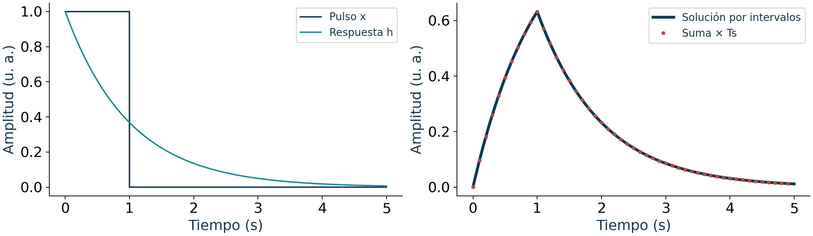
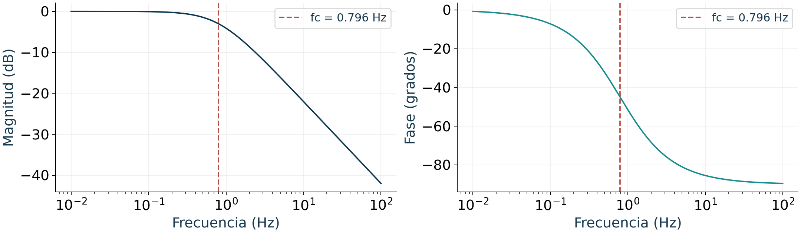

## Sistemas y Señales Biomédicos {.cover #d3-001}

**Semanas 11–15 · Dinámica, filtros y aplicaciones**

Ph. D. Pablo Eduardo Caicedo-Rodríguez

Material de clase y estudio · Ingeniería Biomédica

::: {.notes}
**Libro guía:** John Semmlow, *Circuits, Signals, and Systems for Bioengineers*, 3.ª ed., 2018.

§5.4, **Using The Impulse Response To Find A Systems Output To Any Input—Convolution** (página 219 del visor PDF); §6.4, **The Transfer Function** (página 255 del visor PDF); §7.4, **Nonzero Initial Conditions—Initial And Final Value Theorems** (página 326 del visor PDF); §8.4, **Linear Filters—Introduction** (página 358 del visor PDF).

**Correspondencia:** Síntesis o encuadre que reúne varias secciones; no corresponde a un único apartado del libro. Lectura principal: Semmlow (2018), tercera edición. La correspondencia usa la edición del archivo aportado, que difiere de la segunda edición de 2012 citada en el microcurrículo.

**Lectura:** use estas secciones como ruta de preparación y consulta. La bibliografía aparece al final del bloque.
:::

## Cómo estudiar las semanas 11–15 {.week-divider background-color="#0B3954" #d3-002}


::: {.notes}
**Libro guía:** John Semmlow, *Circuits, Signals, and Systems for Bioengineers*, 3.ª ed., 2018.

§5.4, **Using The Impulse Response To Find A Systems Output To Any Input—Convolution** (página 219 del visor PDF); §6.4, **The Transfer Function** (página 255 del visor PDF); §7.4, **Nonzero Initial Conditions—Initial And Final Value Theorems** (página 326 del visor PDF); §8.4, **Linear Filters—Introduction** (página 358 del visor PDF).

**Correspondencia:** Síntesis o encuadre que reúne varias secciones; no corresponde a un único apartado del libro.

**Lectura:** use estas secciones como ruta de preparación y consulta. La bibliografía aparece al final del bloque.
:::

## Del modelo LTI a representaciones para clasificación {#d3-003}

Al terminar la semana 15, el estudiante debe poder:

1. calcular y explicar convoluciones continuas y discretas;
2. analizar sistemas mediante respuesta frecuencial, Laplace y transformada Z;
3. diseñar y comparar filtros FIR e IIR;
4. interpretar wavelets y análisis multirresolución;
5. construir características con validación sin fuga de información.

::: {.callout-important}
## Idea conductora
Una transformación solo resulta útil cuando conserva la información fisiológica pertinente y hace explícitas sus hipótesis.
:::

::: {.notes}
**Libro guía:** John Semmlow, *Circuits, Signals, and Systems for Bioengineers*, 3.ª ed., 2018.

§5.4, **Using The Impulse Response To Find A Systems Output To Any Input—Convolution** (página 219 del visor PDF); §6.4, **The Transfer Function** (página 255 del visor PDF); §7.4, **Nonzero Initial Conditions—Initial And Final Value Theorems** (página 326 del visor PDF); §8.4, **Linear Filters—Introduction** (página 358 del visor PDF).

**Correspondencia:** Síntesis o encuadre que reúne varias secciones; no corresponde a un único apartado del libro.

**Lectura:** use estas secciones como ruta de preparación y consulta. La bibliografía aparece al final del bloque.
:::

## Mapa de las diez sesiones {#d3-004}

| Semana | Sesión 1 | Sesión 2 |
|---|---|---|
| 11 | Convolución: definición y cálculo | Suavizadores, diferenciadores y promedio móvil |
| 12 | Convolución en frecuencia | Laplace, ROC, polos y ceros |
| 13 | Condiciones iniciales e identificación | Transformada Z y diseño FIR |
| 14 | Diseño IIR y aplicaciones | Fundamentos de wavelets |
| 15 | Análisis multirresolución | Sistemas lineales para clasificación |

::: {.notes}
**Libro guía:** John Semmlow, *Circuits, Signals, and Systems for Bioengineers*, 3.ª ed., 2018.

§5.4, **Using The Impulse Response To Find A Systems Output To Any Input—Convolution** (página 219 del visor PDF); §6.4, **The Transfer Function** (página 255 del visor PDF); §7.4, **Nonzero Initial Conditions—Initial And Final Value Theorems** (página 326 del visor PDF); §8.4, **Linear Filters—Introduction** (página 358 del visor PDF).

**Correspondencia:** Síntesis o encuadre que reúne varias secciones; no corresponde a un único apartado del libro.

**Lectura:** use estas secciones como ruta de preparación y consulta. La bibliografía aparece al final del bloque.
:::

## Organización de cada sesión y trabajo independiente {#d3-005}

| Momento | Actividad | Tiempo |
|---|---|---:|
| Apertura | Lectura previa y predicción | 10 min |
| Fundamento | Ecuación, supuestos y ejemplo | 30 min |
| Aplicación | Cálculo o código en parejas | 30 min |
| Cierre | Comprobación individual y límites | 20 min |

::: {.callout-note}
Prepare la lectura en inglés indicada en las notas. Use las ampliaciones como consulta y trabajo independiente según los conocimientos previos del grupo.
:::

::: {.notes}
**Libro guía:** John Semmlow, *Circuits, Signals, and Systems for Bioengineers*, 3.ª ed., 2018.

§1.1.1, **Goals Of This Book** (página 10 del visor PDF).

**Correspondencia:** Organización docente basada en las actividades y RAE del microcurrículo. No corresponde a una sección temática del libro. Microcurrículo: actividades de aprendizaje y RAE, PDF 2–3. Distribución docente propuesta para las sesiones de 90 minutos.

**Lectura:** use estas secciones como ruta de preparación y consulta. La bibliografía aparece al final del bloque.
:::

## Evidencias de aprendizaje y criterios de revisión {#d3-006}

| Evidencia | Criterio observable |
|---|---|
| Lectura y explicación oral | Identifica el supuesto del texto y lo explica con sus palabras |
| Cálculo individual | Procedimiento correcto, unidades y caso límite |
| Cuaderno en parejas | Código reproducible, datos trazables y comprobación numérica |
| Informe breve | Interpreta el resultado, cita las fuentes y declara limitaciones |

::: {.callout-important}
Cada entrega debe permitir distinguir aportes individuales y trabajo conjunto. La corrección matemática y la justificación biomédica se revisan por separado. Los porcentajes de evaluación se rigen por el programa que confirme el profesor.
:::

::: {.notes}
**Libro guía:** John Semmlow, *Circuits, Signals, and Systems for Bioengineers*, 3.ª ed., 2018.

§1.1.1, **Goals Of This Book** (página 10 del visor PDF).

**Correspondencia:** Organización docente basada en las actividades y RAE del microcurrículo. No corresponde a una sección temática del libro. Microcurrículo: RAE y actividades de evaluación, PDF 2–3. No se resuelven aquí las inconsistencias administrativas del documento.

**Lectura:** use estas secciones como ruta de preparación y consulta. La bibliografía aparece al final del bloque.
:::

## Convenciones de los ejemplos en Python {#d3-007}

Los fragmentos que usan `x` y `fs` reciben una señal real, unidimensional, finita y uniformemente muestreada. En la actividad, documente unidades y metadatos antes de sustituirla.

```python
import numpy as np
fs = 256.0
t = np.arange(2048)/fs
x = np.cos(2*np.pi*10*t) + .3*np.sin(2*np.pi*23*t)
L, H, Nfft = 256, 128, 512
```

::: {.callout-note}
Este es un ejemplo sintético en unidades arbitrarias. Las variables específicas de una actividad (etiquetas, sujetos, umbrales, referencias) deben definirse para ese problema. Los casos reproducibles están en `codigo/ejemplos_verificados.py`.
:::

::: {.notes}
**Libro guía:** John Semmlow, *Circuits, Signals, and Systems for Bioengineers*, 3.ª ed., 2018.

§1.1.1, **Goals Of This Book** (página 10 del visor PDF).

**Correspondencia:** Ejemplo, figura o implementación de elaboración docente a partir de estos fundamentos. No es una transcripción del código MATLAB del libro. El lenguaje del microcurrículo suministrado es Python. El libro guía utiliza MATLAB; se conservan conceptos y se explicitan diferencias de convenciones.

**Lectura:** use estas secciones como ruta de preparación y consulta. La bibliografía aparece al final del bloque.
:::

## Continuidad con las semanas 6–10 {#d3-008}

La respuesta al impulso $h$ caracteriza un sistema LTI. Este bloque desarrolla cuatro preguntas:

- ¿cómo se calcula $y=x*h$?
- ¿qué revelan $H(j\omega)$, $H(s)$ y $H(z)$?
- ¿cómo se implementa un filtro estable?
- ¿cómo se convierten sus salidas en evidencia para clasificación?

::: {.callout-note}
## Convención
$f$ se expresa en Hz. En continuo, $\omega=2\pi f$ está en rad/s; en discreto, $\Omega=2\pi f/f_s$ está en rad/muestra. Usaremos $H(j\omega)$ para continuo y $H(e^{j\Omega})$ para discreto. $s=\sigma+j\omega$ tiene dimensión $\mathrm{s}^{-1}$.
:::

::: {.notes}
**Libro guía:** John Semmlow, *Circuits, Signals, and Systems for Bioengineers*, 3.ª ed., 2018.

§5.4, **Using The Impulse Response To Find A Systems Output To Any Input—Convolution** (página 219 del visor PDF); §6.4, **The Transfer Function** (página 255 del visor PDF); §7.4, **Nonzero Initial Conditions—Initial And Final Value Theorems** (página 326 del visor PDF); §8.4, **Linear Filters—Introduction** (página 358 del visor PDF).

**Correspondencia:** Síntesis o encuadre que reúne varias secciones; no corresponde a un único apartado del libro.

**Lectura:** use estas secciones como ruta de preparación y consulta. La bibliografía aparece al final del bloque.
:::

## Ruta de comprobación {#d3-009}

| Nivel | Pregunta |
|---|---|
| Matemático | ¿La ecuación y sus condiciones son correctas? |
| Numérico | ¿La implementación reproduce un caso conocido? |
| Fisiológico | ¿La transformación conserva el fenómeno de interés? |
| Inferencial | ¿La validación evita contaminación entre conjuntos? |

::: {.notes}
**Libro guía:** John Semmlow, *Circuits, Signals, and Systems for Bioengineers*, 3.ª ed., 2018.

§5.4, **Using The Impulse Response To Find A Systems Output To Any Input—Convolution** (página 219 del visor PDF); §6.4, **The Transfer Function** (página 255 del visor PDF); §7.4, **Nonzero Initial Conditions—Initial And Final Value Theorems** (página 326 del visor PDF); §8.4, **Linear Filters—Introduction** (página 358 del visor PDF).

**Correspondencia:** Síntesis o encuadre que reúne varias secciones; no corresponde a un único apartado del libro.

**Lectura:** use estas secciones como ruta de preparación y consulta. La bibliografía aparece al final del bloque.
:::

## Semana 11 · Convolución en tiempo y sistemas aplicados {.week-divider background-color="#0B3954" #d3-010}


::: {.notes}
**Libro guía:** John Semmlow, *Circuits, Signals, and Systems for Bioengineers*, 3.ª ed., 2018.

§5.4, **Using The Impulse Response To Find A Systems Output To Any Input—Convolution** (página 219 del visor PDF); §6.4, **The Transfer Function** (página 255 del visor PDF); §7.4, **Nonzero Initial Conditions—Initial And Final Value Theorems** (página 326 del visor PDF); §8.4, **Linear Filters—Introduction** (página 358 del visor PDF).

**Correspondencia:** Síntesis o encuadre que reúne varias secciones; no corresponde a un único apartado del libro.

**Lectura:** use estas secciones como ruta de preparación y consulta. La bibliografía aparece al final del bloque.
:::

## Sesión 21 · Cálculo de la convolución {#d3-011}

::: {.callout-important}
## Propósito de aprendizaje
Calcular la salida de un sistema LTI y explicar cada etapa del procedimiento gráfico y algebraico.
:::

::: {.notes}
**Libro guía:** John Semmlow, *Circuits, Signals, and Systems for Bioengineers*, 3.ª ed., 2018.

§5.4, **Using The Impulse Response To Find A Systems Output To Any Input—Convolution** (página 219 del visor PDF).

**Correspondencia:** El tema se desarrolla en las secciones indicadas. La redacción es una síntesis docente.

**Microcurrículo:** semana 11, sesión 1 (sesión global 21). Los numerales del cronograma son identificadores curriculares; no son los apartados del libro citados arriba.
:::

## Preguntas que orientan la sesión {#d3-012}

¿En qué instantes empieza y termina el solapamiento? ¿Qué términos aportan a cada muestra?

::: {.notes}
**Libro guía:** John Semmlow, *Circuits, Signals, and Systems for Bioengineers*, 3.ª ed., 2018.

§5.4, **Using The Impulse Response To Find A Systems Output To Any Input—Convolution** (página 219 del visor PDF).

**Correspondencia:** El tema se desarrolla en las secciones indicadas. La redacción es una síntesis docente.

**Microcurrículo:** semana 11, sesión 1 (sesión global 21). Los numerales del cronograma son identificadores curriculares; no son los apartados del libro citados arriba.
:::

## Vocabulario mínimo {#d3-013}

| Concepto | Significado operativo |
|---|---|
| **Convolución** | Superposición ponderada de copias desplazadas de la respuesta al impulso. |
| **Variable muda** | $k$ o $\tau$ desaparece después de sumar o integrar. |
| **Memoria** | La salida depende de valores de entrada distintos al instante actual. |
| **Soporte** | Determina dónde existe solapamiento y, por tanto, salida no nula. |

::: {.notes}
**Libro guía:** John Semmlow, *Circuits, Signals, and Systems for Bioengineers*, 3.ª ed., 2018.

§5.4, **Using The Impulse Response To Find A Systems Output To Any Input—Convolution** (página 219 del visor PDF).

**Correspondencia:** El tema se desarrolla en las secciones indicadas. La redacción es una síntesis docente.

**Microcurrículo:** semana 11, sesión 1 (sesión global 21). Los numerales del cronograma son identificadores curriculares; no son los apartados del libro citados arriba.
:::

## Relaciones matemáticas centrales {#d3-014}

$$y(t)=x(t)*h(t)=\int_{-\infty}^{\infty}x(\tau)h(t-\tau)\,d\tau$$

$$y[n]=x[n]*h[n]=\sum_{k=-\infty}^{\infty}x[k]h[n-k]$$

$$\delta[n]*x[n]=x[n]$$

::: {.callout-note}
## Lectura de las ecuaciones
Cada muestra de entrada excita una copia desplazada de $h$. La amplitud de la muestra escala esa copia y la suma reúne todas las contribuciones.
:::

::: {.notes}
**Libro guía:** John Semmlow, *Circuits, Signals, and Systems for Bioengineers*, 3.ª ed., 2018.

§5.4, **Using The Impulse Response To Find A Systems Output To Any Input—Convolution** (página 219 del visor PDF).

**Correspondencia:** El tema se desarrolla en las secciones indicadas. La redacción es una síntesis docente.

**Microcurrículo:** semana 11, sesión 1 (sesión global 21). Los numerales del cronograma son identificadores curriculares; no son los apartados del libro citados arriba.
:::

## Convolución continua: un caso por intervalos {#d3-015}

Sean $x(t)=u(t)-u(t-1)$ y $h(t)=e^{-t}u(t)$, en un ejemplo adimensional con tiempo en segundos.

$$y(t)=\int_0^1 e^{-(t-\tau)}u(t-\tau)\,d\tau
=\begin{cases}
0,&t<0,\\
1-e^{-t},&0\le t<1,\\
(e-1)e^{-t},&t\ge1.
\end{cases}$$

::: {.callout-tip}
Compruebe continuidad en $t=1$, soporte de la entrada y decaimiento posterior. La salida persiste después de terminar el pulso debido a la memoria del sistema.
:::

::: {.notes}
**Libro guía:** John Semmlow, *Circuits, Signals, and Systems for Bioengineers*, 3.ª ed., 2018.

§5.4, **Using The Impulse Response To Find A Systems Output To Any Input—Convolution** (página 219 del visor PDF).

**Correspondencia:** Ejemplo, figura o implementación de elaboración docente a partir de estos fundamentos. No es una transcripción del código MATLAB del libro. Desarrollo didáctico original para el cálculo por intervalos.

**Microcurrículo:** semana 11, sesión 1 (sesión global 21). Los numerales del cronograma son identificadores curriculares; no son los apartados del libro citados arriba.
:::

## Procedimiento de análisis {#d3-016}

1. Identificar los soportes de $x$ y $h$.
2. Invertir una de las señales respecto a su variable.
3. Desplazarla hasta el instante de salida.
4. Multiplicar donde existe solapamiento y sumar.

::: {.callout-important}
## Criterio de calidad
Soporte, valores muestra a muestra y propiedad de la suma.
:::

::: {.notes}
**Libro guía:** John Semmlow, *Circuits, Signals, and Systems for Bioengineers*, 3.ª ed., 2018.

§5.4, **Using The Impulse Response To Find A Systems Output To Any Input—Convolution** (página 219 del visor PDF).

**Correspondencia:** El tema se desarrolla en las secciones indicadas. La redacción es una síntesis docente.

**Microcurrículo:** semana 11, sesión 1 (sesión global 21). Los numerales del cronograma son identificadores curriculares; no son los apartados del libro citados arriba.
:::

## Ejemplo biomédico {#d3-017}

Un bolo idealizado $x(t)$ atraviesa un compartimento cuya respuesta $h(t)$ decae exponencialmente. La concentración medida combina aportes pasados y el decaimiento del sistema.

::: {.callout-warning}
## Alcance
El ejemplo ilustra procesamiento de señales. No establece por sí mismo una interpretación diagnóstica.
:::

::: {.notes}
**Libro guía:** John Semmlow, *Circuits, Signals, and Systems for Bioengineers*, 3.ª ed., 2018.

§5.4, **Using The Impulse Response To Find A Systems Output To Any Input—Convolution** (página 219 del visor PDF); §1.4.5, **Biosystems Modeling** (página 46 del visor PDF).

**Correspondencia:** Actividad o interpretación biomédica de elaboración docente apoyada en las secciones indicadas.

**Microcurrículo:** semana 11, sesión 1 (sesión global 21). Los numerales del cronograma son identificadores curriculares; no son los apartados del libro citados arriba.
:::

## Implementación mínima en Python {#d3-018}

```python
import numpy as np
x = np.array([1., 2., 1.])
h = np.array([0.5, 0.3, 0.2])
y = np.convolve(x, h, mode="full")
print(y)  # [0.5, 1.3, 1.3, 0.7, 0.2]
```

::: {.notes}
**Libro guía:** John Semmlow, *Circuits, Signals, and Systems for Bioengineers*, 3.ª ed., 2018.

§5.4.2, **Matlab Implementation** (página 229 del visor PDF).

**Correspondencia:** Ejemplo, figura o implementación de elaboración docente a partir de estos fundamentos. No es una transcripción del código MATLAB del libro.

**Microcurrículo:** semana 11, sesión 1 (sesión global 21). Los numerales del cronograma son identificadores curriculares; no son los apartados del libro citados arriba.
:::

## Convolución continua aproximada con muestras {#d3-019}

Con paso $T_s$ y una respuesta continua muestreada $h_c[n]=h(nT_s)$:

$$y(nT_s)\approx T_s\sum_kx(kT_s)h((n-k)T_s).$$

```python
dt = 0.001
t_sim = np.arange(0, 5, dt)
x_sim = ((t_sim >= 0) & (t_sim < 1)).astype(float)
h_sim = np.exp(-t_sim)
y_sim = dt*np.convolve(x_sim, h_sim)[:len(t_sim)]
```

::: {.callout-warning}
El factor $T_s$ aproxima la integral. No se multiplica otra vez si $h[n]$ ya contiene coeficientes de un filtro discreto diseñado para la suma de convolución.
:::

::: {.notes}
**Libro guía:** John Semmlow, *Circuits, Signals, and Systems for Bioengineers*, 3.ª ed., 2018.

§5.4, **Using The Impulse Response To Find A Systems Output To Any Input—Convolution** (página 219 del visor PDF); §5.4.2, **Matlab Implementation** (página 229 del visor PDF).

**Correspondencia:** Ejemplo, figura o implementación de elaboración docente a partir de estos fundamentos. No es una transcripción del código MATLAB del libro.

**Microcurrículo:** semana 11, sesión 1 (sesión global 21). Los numerales del cronograma son identificadores curriculares; no son los apartados del libro citados arriba.
:::

## Convolución: solución y aproximación {#d3-020}

{width=95%}

::: {.notes}
**Libro guía:** John Semmlow, *Circuits, Signals, and Systems for Bioengineers*, 3.ª ed., 2018.

§5.4, **Using The Impulse Response To Find A Systems Output To Any Input—Convolution** (página 219 del visor PDF); §5.4.2, **Matlab Implementation** (página 229 del visor PDF).

**Correspondencia:** Ejemplo, figura o implementación de elaboración docente a partir de estos fundamentos. No es una transcripción del código MATLAB del libro. Figura de cálculo propio con señales sintéticas. Código reproducible: codigo/ejemplos_verificados.py.

**Microcurrículo:** semana 11, sesión 1 (sesión global 21). Los numerales del cronograma son identificadores curriculares; no son los apartados del libro citados arriba.
:::

## Verificaciones antes de interpretar {#d3-021}

- La longitud completa es $N_x+N_h-1$.
- La convolución con un impulso reproduce la señal.
- La suma de la salida cumple $\sum y=(\sum x)(\sum h)$ cuando las sumas existen.

::: {.notes}
**Libro guía:** John Semmlow, *Circuits, Signals, and Systems for Bioengineers*, 3.ª ed., 2018.

§5.4, **Using The Impulse Response To Find A Systems Output To Any Input—Convolution** (página 219 del visor PDF).

**Correspondencia:** El tema se desarrolla en las secciones indicadas. La redacción es una síntesis docente.

**Microcurrículo:** semana 11, sesión 1 (sesión global 21). Los numerales del cronograma son identificadores curriculares; no son los apartados del libro citados arriba.
:::

## Errores frecuentes {#d3-022}

- Confundir convolución con multiplicación muestra a muestra.
- Olvidar la inversión de $h[k]$ antes del desplazamiento.
- Comparar resultados `same` y `full` sin declarar el modo.


::: {.notes}
**Libro guía:** John Semmlow, *Circuits, Signals, and Systems for Bioengineers*, 3.ª ed., 2018.

§5.4, **Using The Impulse Response To Find A Systems Output To Any Input—Convolution** (página 219 del visor PDF).

**Correspondencia:** El tema se desarrolla en las secciones indicadas. La redacción es una síntesis docente.

**Microcurrículo:** semana 11, sesión 1 (sesión global 21). Los numerales del cronograma son identificadores curriculares; no son los apartados del libro citados arriba.
:::

## Actividad guiada {#d3-023}

1. Calcule $[1,2,1]*[1,-1]$.
2. Marque qué muestras dependen de condiciones de borde.
3. Interprete el segundo núcleo como diferenciador simple.

**Producto:** cálculo, figura rotulada y explicación de máximo 120 palabras.

::: {.notes}
**Libro guía:** John Semmlow, *Circuits, Signals, and Systems for Bioengineers*, 3.ª ed., 2018.

§5.4, **Using The Impulse Response To Find A Systems Output To Any Input—Convolution** (página 219 del visor PDF).

**Correspondencia:** El tema se desarrolla en las secciones indicadas. La redacción es una síntesis docente.

**Microcurrículo:** semana 11, sesión 1 (sesión global 21). Los numerales del cronograma son identificadores curriculares; no son los apartados del libro citados arriba.
:::

## Pregunta de comprobación {#d3-024}

Para $x=[1,2,1]$ y $h=[1,-1]$, explique por qué la salida tiene cuatro muestras y verifique su suma.

::: {.callout-tip}
**Evidencia esperada:** Soporte, valores muestra a muestra y propiedad de la suma.
:::

::: {.notes}
**Libro guía:** John Semmlow, *Circuits, Signals, and Systems for Bioengineers*, 3.ª ed., 2018.

§5.4, **Using The Impulse Response To Find A Systems Output To Any Input—Convolution** (página 219 del visor PDF).

**Correspondencia:** El tema se desarrolla en las secciones indicadas. La redacción es una síntesis docente.

**Microcurrículo:** semana 11, sesión 1 (sesión global 21). Los numerales del cronograma son identificadores curriculares; no son los apartados del libro citados arriba.
:::

## Síntesis de la sesión {#d3-025}

- La convolución construye la respuesta de cualquier sistema LTI.
- El soporte anticipa la duración de la salida.
- Los bordes forman parte del modelo computacional.

::: {.callout-important}
## Criterio de dominio
Soporte, valores muestra a muestra y propiedad de la suma.
:::

::: {.notes}
**Libro guía:** John Semmlow, *Circuits, Signals, and Systems for Bioengineers*, 3.ª ed., 2018.

§5.4, **Using The Impulse Response To Find A Systems Output To Any Input—Convolution** (página 219 del visor PDF).

**Correspondencia:** El tema se desarrolla en las secciones indicadas. La redacción es una síntesis docente.

**Microcurrículo:** semana 11, sesión 1 (sesión global 21). Los numerales del cronograma son identificadores curriculares; no son los apartados del libro citados arriba.
:::

## Sesión 22 · Convolución aplicada: suavizado, diferenciación y promedio móvil {#d3-026}

::: {.callout-important}
## Propósito de aprendizaje
Relacionar la forma del núcleo con el efecto del sistema sobre una bioseñal.
:::

::: {.notes}
**Libro guía:** John Semmlow, *Circuits, Signals, and Systems for Bioengineers*, 3.ª ed., 2018.

§5.5, **Applied Convolution—Basic Filters** (página 231 del visor PDF); §8.5.1, **Derivative Filters—The Two-Point Central Difference Algorithm** (página 377 del visor PDF).

**Correspondencia:** El tema se desarrolla en las secciones indicadas. La redacción es una síntesis docente.

**Microcurrículo:** semana 11, sesión 2 (sesión global 22). Los numerales del cronograma son identificadores curriculares; no son los apartados del libro citados arriba.
:::

## Preguntas que orientan la sesión {#d3-027}

¿Cuánto retardo añade la ventana elegida? ¿Qué unidad tiene una diferencia temporal?

::: {.notes}
**Libro guía:** John Semmlow, *Circuits, Signals, and Systems for Bioengineers*, 3.ª ed., 2018.

§5.5, **Applied Convolution—Basic Filters** (página 231 del visor PDF); §8.5.1, **Derivative Filters—The Two-Point Central Difference Algorithm** (página 377 del visor PDF).

**Correspondencia:** El tema se desarrolla en las secciones indicadas. La redacción es una síntesis docente.

**Microcurrículo:** semana 11, sesión 2 (sesión global 22). Los numerales del cronograma son identificadores curriculares; no son los apartados del libro citados arriba.
:::

## Vocabulario mínimo {#d3-028}

| Concepto | Significado operativo |
|---|---|
| **Promedio móvil** | Núcleo FIR que reduce fluctuaciones rápidas. |
| **Diferenciador** | Resalta cambios entre muestras vecinas. |
| **Ganancia DC** | $H(0)=\sum h[n]$ mide la respuesta a una constante. |
| **Retardo de grupo** | $-d\arg H(e^{j\Omega})/d\Omega$, en muestras. |

::: {.notes}
**Libro guía:** John Semmlow, *Circuits, Signals, and Systems for Bioengineers*, 3.ª ed., 2018.

§5.5, **Applied Convolution—Basic Filters** (página 231 del visor PDF); §8.5.1, **Derivative Filters—The Two-Point Central Difference Algorithm** (página 377 del visor PDF).

**Correspondencia:** El tema se desarrolla en las secciones indicadas. La redacción es una síntesis docente.

**Microcurrículo:** semana 11, sesión 2 (sesión global 22). Los numerales del cronograma son identificadores curriculares; no son los apartados del libro citados arriba.
:::

## Relaciones matemáticas centrales {#d3-029}

$$h_M[n]=\frac{1}{M},\quad 0\le n<M$$

$$y[n]=\frac{1}{M}\sum_{k=0}^{M-1}x[n-k]$$

$$h_d[n]=\delta[n]-\delta[n-1]\quad\Rightarrow\quad y[n]=x[n]-x[n-1]$$

::: {.callout-note}
## Lectura de las ecuaciones
La diferencia conserva unidades de $x$. Para aproximar $dx/dt$, divida por $T_s$: $\dot x[n]\approx f_s(x[n]-x[n-1])$. El promedio móvil causal tiene retardo $(M-1)/2$ muestras donde la fase está definida.
:::

::: {.notes}
**Libro guía:** John Semmlow, *Circuits, Signals, and Systems for Bioengineers*, 3.ª ed., 2018.

§5.5, **Applied Convolution—Basic Filters** (página 231 del visor PDF); §8.5.1, **Derivative Filters—The Two-Point Central Difference Algorithm** (página 377 del visor PDF).

**Correspondencia:** El tema se desarrolla en las secciones indicadas. La redacción es una síntesis docente.

**Microcurrículo:** semana 11, sesión 2 (sesión global 22). Los numerales del cronograma son identificadores curriculares; no son los apartados del libro citados arriba.
:::

## Procedimiento de análisis {#d3-030}

1. Definir el objetivo fisiológico.
2. Convertir la escala temporal a número de muestras.
3. Revisar ganancia, retardo y bordes.
4. Comparar la salida con eventos anotados.

::: {.callout-important}
## Criterio de calidad
Conversión a milisegundos, ganancia DC y transitorio de inicialización.
:::

::: {.notes}
**Libro guía:** John Semmlow, *Circuits, Signals, and Systems for Bioengineers*, 3.ª ed., 2018.

§5.5, **Applied Convolution—Basic Filters** (página 231 del visor PDF); §8.5.1, **Derivative Filters—The Two-Point Central Difference Algorithm** (página 377 del visor PDF).

**Correspondencia:** El tema se desarrolla en las secciones indicadas. La redacción es una síntesis docente.

**Microcurrículo:** semana 11, sesión 2 (sesión global 22). Los numerales del cronograma son identificadores curriculares; no son los apartados del libro citados arriba.
:::

## Ejemplo biomédico {#d3-031}

Para una envolvente EMG muestreada a 1000 Hz, una ventana de 100 ms contiene 100 muestras. El promedio reduce variabilidad rápida, aunque puede desplazar el inicio aparente de activación.

::: {.callout-warning}
## Alcance
El ejemplo ilustra procesamiento de señales. No establece por sí mismo una interpretación diagnóstica.
:::

::: {.notes}
**Libro guía:** John Semmlow, *Circuits, Signals, and Systems for Bioengineers*, 3.ª ed., 2018.

§5.5, **Applied Convolution—Basic Filters** (página 231 del visor PDF).

**Correspondencia:** Actividad o interpretación biomédica de elaboración docente apoyada en las secciones indicadas.

**Microcurrículo:** semana 11, sesión 2 (sesión global 22). Los numerales del cronograma son identificadores curriculares; no son los apartados del libro citados arriba.
:::

## Implementación mínima en Python {#d3-032}

```python
import numpy as np
from scipy.signal import lfilter
fs = 1000
M = round(0.100 * fs)
h = np.ones(M) / M
y = lfilter(h, [1.0], x)  # causal, estado inicial cero
```

::: {.notes}
**Libro guía:** John Semmlow, *Circuits, Signals, and Systems for Bioengineers*, 3.ª ed., 2018.

§5.5, **Applied Convolution—Basic Filters** (página 231 del visor PDF).

**Correspondencia:** Ejemplo, figura o implementación de elaboración docente a partir de estos fundamentos. No es una transcripción del código MATLAB del libro.

**Microcurrículo:** semana 11, sesión 2 (sesión global 22). Los numerales del cronograma son identificadores curriculares; no son los apartados del libro citados arriba.
:::

## Verificaciones antes de interpretar {#d3-033}

- La suma del promedio móvil debe valer uno.
- Una entrada constante conserva su nivel después del transitorio inicial, bajo extensión compatible.
- El retardo de grupo en las bandas de fase definida es $(M-1)/2$ muestras.

::: {.notes}
**Libro guía:** John Semmlow, *Circuits, Signals, and Systems for Bioengineers*, 3.ª ed., 2018.

§5.5, **Applied Convolution—Basic Filters** (página 231 del visor PDF); §8.5.1, **Derivative Filters—The Two-Point Central Difference Algorithm** (página 377 del visor PDF).

**Correspondencia:** El tema se desarrolla en las secciones indicadas. La redacción es una síntesis docente.

**Microcurrículo:** semana 11, sesión 2 (sesión global 22). Los numerales del cronograma son identificadores curriculares; no son los apartados del libro citados arriba.
:::

## Errores frecuentes {#d3-034}

- Elegir $M$ sin convertir milisegundos a muestras.
- Interpretar el suavizado como eliminación completa del ruido.
- Usar diferencias sin revisar la amplificación de ruido.


::: {.notes}
**Libro guía:** John Semmlow, *Circuits, Signals, and Systems for Bioengineers*, 3.ª ed., 2018.

§5.5, **Applied Convolution—Basic Filters** (página 231 del visor PDF); §8.5.1, **Derivative Filters—The Two-Point Central Difference Algorithm** (página 377 del visor PDF).

**Correspondencia:** El tema se desarrolla en las secciones indicadas. La redacción es una síntesis docente.

**Microcurrículo:** semana 11, sesión 2 (sesión global 22). Los numerales del cronograma son identificadores curriculares; no son los apartados del libro citados arriba.
:::

## Actividad guiada {#d3-035}

1. Compare ventanas de 20, 100 y 250 ms.
2. Mida cuánto cambia el tiempo del máximo.
3. Explique cuál ventana conserva mejor una activación breve.

**Producto:** cálculo, figura rotulada y explicación de máximo 120 palabras.

::: {.notes}
**Libro guía:** John Semmlow, *Circuits, Signals, and Systems for Bioengineers*, 3.ª ed., 2018.

§5.5, **Applied Convolution—Basic Filters** (página 231 del visor PDF); §8.5.1, **Derivative Filters—The Two-Point Central Difference Algorithm** (página 377 del visor PDF).

**Correspondencia:** El tema se desarrolla en las secciones indicadas. La redacción es una síntesis docente.

**Microcurrículo:** semana 11, sesión 2 (sesión global 22). Los numerales del cronograma son identificadores curriculares; no son los apartados del libro citados arriba.
:::

## Pregunta de comprobación {#d3-036}

Con $M=101$ y $f_s=1000$ Hz, obtenga el retardo y explique qué ocurre en las primeras $M-1$ muestras.

::: {.callout-tip}
**Evidencia esperada:** Conversión a milisegundos, ganancia DC y transitorio de inicialización.
:::

::: {.notes}
**Libro guía:** John Semmlow, *Circuits, Signals, and Systems for Bioengineers*, 3.ª ed., 2018.

§5.5, **Applied Convolution—Basic Filters** (página 231 del visor PDF); §8.5.1, **Derivative Filters—The Two-Point Central Difference Algorithm** (página 377 del visor PDF).

**Correspondencia:** El tema se desarrolla en las secciones indicadas. La redacción es una síntesis docente.

**Microcurrículo:** semana 11, sesión 2 (sesión global 22). Los numerales del cronograma son identificadores curriculares; no son los apartados del libro citados arriba.
:::

## Síntesis de la sesión {#d3-037}

- El núcleo codifica el comportamiento del filtro.
- Suavizado y resolución temporal compiten.
- La validación debe conservar variables fisiológicas relevantes.

::: {.callout-important}
## Criterio de dominio
Conversión a milisegundos, ganancia DC y transitorio de inicialización.
:::

::: {.notes}
**Libro guía:** John Semmlow, *Circuits, Signals, and Systems for Bioengineers*, 3.ª ed., 2018.

§5.5, **Applied Convolution—Basic Filters** (página 231 del visor PDF); §8.5.1, **Derivative Filters—The Two-Point Central Difference Algorithm** (página 377 del visor PDF).

**Correspondencia:** El tema se desarrolla en las secciones indicadas. La redacción es una síntesis docente.

**Microcurrículo:** semana 11, sesión 2 (sesión global 22). Los numerales del cronograma son identificadores curriculares; no son los apartados del libro citados arriba.
:::

## Semana 12 · Respuesta frecuencial y transformada de Laplace {.week-divider background-color="#0B3954" #d3-038}


::: {.notes}
**Libro guía:** John Semmlow, *Circuits, Signals, and Systems for Bioengineers*, 3.ª ed., 2018.

§5.4, **Using The Impulse Response To Find A Systems Output To Any Input—Convolution** (página 219 del visor PDF); §6.4, **The Transfer Function** (página 255 del visor PDF); §7.4, **Nonzero Initial Conditions—Initial And Final Value Theorems** (página 326 del visor PDF); §8.4, **Linear Filters—Introduction** (página 358 del visor PDF).

**Correspondencia:** Síntesis o encuadre que reúne varias secciones; no corresponde a un único apartado del libro.

**Lectura:** use estas secciones como ruta de preparación y consulta. La bibliografía aparece al final del bloque.
:::

## Sesión 23 · Convolución en frecuencia y respuesta del sistema {#d3-039}

::: {.callout-important}
## Propósito de aprendizaje
Usar la función de transferencia frecuencial para predecir amplitud y fase de la salida.
:::

::: {.notes}
**Libro guía:** John Semmlow, *Circuits, Signals, and Systems for Bioengineers*, 3.ª ed., 2018.

§5.6, **Convolution In The Frequency Domain** (página 237 del visor PDF); §6.4, **The Transfer Function** (página 255 del visor PDF); §6.7, **The Transfer Function And The Fourier Transform** (página 287 del visor PDF).

**Correspondencia:** El tema se desarrolla en las secciones indicadas. La redacción es una síntesis docente.

**Microcurrículo:** semana 12, sesión 1 (sesión global 23). Los numerales del cronograma son identificadores curriculares; no son los apartados del libro citados arriba.
:::

## Preguntas que orientan la sesión {#d3-040}

¿Qué frecuencia atenúa el sistema? ¿La fase conserva la forma de la señal?

::: {.notes}
**Libro guía:** John Semmlow, *Circuits, Signals, and Systems for Bioengineers*, 3.ª ed., 2018.

§5.6, **Convolution In The Frequency Domain** (página 237 del visor PDF); §6.4, **The Transfer Function** (página 255 del visor PDF); §6.7, **The Transfer Function And The Fourier Transform** (página 287 del visor PDF).

**Correspondencia:** El tema se desarrolla en las secciones indicadas. La redacción es una síntesis docente.

**Microcurrículo:** semana 12, sesión 1 (sesión global 23). Los numerales del cronograma son identificadores curriculares; no son los apartados del libro citados arriba.
:::

## Vocabulario mínimo {#d3-041}

| Concepto | Significado operativo |
|---|---|
| **Respuesta frecuencial** | $H(e^{j\Omega})$ describe la acción sobre cada frecuencia. |
| **Magnitud** | Indica cuánto amplifica o atenúa. |
| **Fase** | Determina el desplazamiento relativo de componentes. |
| **Convolución** | En tiempo equivale a multiplicación en frecuencia. |

::: {.notes}
**Libro guía:** John Semmlow, *Circuits, Signals, and Systems for Bioengineers*, 3.ª ed., 2018.

§6.4, **The Transfer Function** (página 255 del visor PDF); §8.2.3, **Transformation From The Z-Domain To The Frequency Domain** (página 353 del visor PDF).

**Correspondencia:** El tema se desarrolla en las secciones indicadas. La redacción es una síntesis docente.

**Microcurrículo:** semana 12, sesión 1 (sesión global 23). Los numerales del cronograma son identificadores curriculares; no son los apartados del libro citados arriba.
:::

## Relaciones matemáticas centrales {#d3-042}

$$y[n]=x[n]*h[n]\Longleftrightarrow Y(e^{j\Omega})=X(e^{j\Omega})H(e^{j\Omega})$$

$$|Y|=|X||H|$$

$$\angle Y=\angle X+\angle H$$

::: {.callout-note}
## Lectura de las ecuaciones
Para respuesta de estado cero, un LTI no crea frecuencias nuevas. Solo los ceros situados en el eje de evaluación ($j\omega$ o círculo unitario) anulan una frecuencia real exacta.
:::

::: {.notes}
**Libro guía:** John Semmlow, *Circuits, Signals, and Systems for Bioengineers*, 3.ª ed., 2018.

§5.6, **Convolution In The Frequency Domain** (página 237 del visor PDF); §6.4, **The Transfer Function** (página 255 del visor PDF); §6.7, **The Transfer Function And The Fourier Transform** (página 287 del visor PDF).

**Correspondencia:** El tema se desarrolla en las secciones indicadas. La redacción es una síntesis docente.

**Microcurrículo:** semana 12, sesión 1 (sesión global 23). Los numerales del cronograma son identificadores curriculares; no son los apartados del libro citados arriba.
:::

## Modelos de sistemas y conexiones {#d3-043}

Para sistemas lineales compatibles y respuesta de estado cero:

| Conexión | Transferencia equivalente |
|---|---|
| Cascada | $H_1H_2$ |
| Paralelo | $H_1+H_2$ |
| Realimentación negativa | $G/(1+GF)$ |

::: {.callout-important}
En realimentación, $G$ describe la trayectoria directa y $F$ la medición de retorno. La estructura y el signo determinan la ecuación característica. Debe comprobarse estabilidad de la conexión.
:::

**Aplicación:** un modelo de regulación pupilar distingue estímulo, salida medida y mecanismo de realimentación.

::: {.notes}
**Libro guía:** John Semmlow, *Circuits, Signals, and Systems for Bioengineers*, 3.ª ed., 2018.

§6.2, **Systems Analysis Models** (página 248 del visor PDF); §1.4.5, **Biosystems Modeling** (página 46 del visor PDF).

**Correspondencia:** El tema se desarrolla en las secciones indicadas. La redacción es una síntesis docente.

**Microcurrículo:** semana 12, sesión 1 (sesión global 23). Los numerales del cronograma son identificadores curriculares; no son los apartados del libro citados arriba.
:::

## Respuesta sinusoidal y fasores {#d3-044}

Para una entrada $x(t)=A\cos(\omega t+\phi)$ y un LTI estable:

$$y_{ss}(t)=A|H(j\omega)|\cos\big(\omega t+\phi+\arg H(j\omega)\big).$$

El fasor de entrada es $\tilde X=Ae^{j\phi}$ y $\tilde Y=H(j\omega)\tilde X$.

::: {.callout-important}
Esta expresión describe régimen permanente. La respuesta total puede incluir un transitorio debido al inicio de la excitación o a condiciones iniciales.
:::

::: {.notes}
**Libro guía:** John Semmlow, *Circuits, Signals, and Systems for Bioengineers*, 3.ª ed., 2018.

§6.3, **The Response Of System Elements To Sinusoidal Inputs: Phasor Analysis** (página 251 del visor PDF); §6.4, **The Transfer Function** (página 255 del visor PDF).

**Correspondencia:** El tema se desarrolla en las secciones indicadas. La redacción es una síntesis docente.

**Microcurrículo:** semana 12, sesión 1 (sesión global 23). Los numerales del cronograma son identificadores curriculares; no son los apartados del libro citados arriba.
:::

## Bode de un sistema de primer orden {#d3-045}

Para $H(j\omega)=K/(1+j\omega\tau)$, con $K>0$:

$$|H|=\frac{K}{\sqrt{1+(\omega\tau)^2}},\qquad
\arg H=-\arctan(\omega\tau).$$

- Frecuencia de corte: $f_c=1/(2\pi\tau)$.
- En $f_c$: magnitud $K/\sqrt2$ y fase $-45^\circ$.
- Para $f\gg f_c$: pendiente aproximada de $-20$ dB/década.

::: {.callout-note}
Para una transferencia con unidades físicas, los dB requieren una referencia de ganancia con las mismas unidades. Aquí se supone entrada y salida de la misma magnitud.
:::

::: {.notes}
**Libro guía:** John Semmlow, *Circuits, Signals, and Systems for Bioengineers*, 3.ª ed., 2018.

§6.5.4, **First-Order Element** (página 266 del visor PDF).

**Correspondencia:** El tema se desarrolla en las secciones indicadas. La redacción es una síntesis docente.

**Microcurrículo:** semana 12, sesión 1 (sesión global 23). Los numerales del cronograma son identificadores curriculares; no son los apartados del libro citados arriba.
:::

## Magnitud y fase de un primer orden {#d3-046}

{width=95%}

::: {.notes}
**Libro guía:** John Semmlow, *Circuits, Signals, and Systems for Bioengineers*, 3.ª ed., 2018.

§6.5.4, **First-Order Element** (página 266 del visor PDF).

**Correspondencia:** Ejemplo, figura o implementación de elaboración docente a partir de estos fundamentos. No es una transcripción del código MATLAB del libro. Figura de cálculo propio con señales sintéticas. Código reproducible: codigo/ejemplos_verificados.py.

**Microcurrículo:** semana 12, sesión 1 (sesión global 23). Los numerales del cronograma son identificadores curriculares; no son los apartados del libro citados arriba.
:::

## Segundo orden, amortiguamiento y resonancia {#d3-047}

$$H(s)=\frac{K\omega_n^2}{s^2+2\zeta\omega_ns+\omega_n^2}.$$

Para $0<\zeta<1$:

$$p_{1,2}=-\zeta\omega_n\pm j\omega_n\sqrt{1-\zeta^2}.$$

::: {.callout-important}
La frecuencia natural $\omega_n$ y la frecuencia de oscilación amortiguada son distintas. En este pasa bajas de segundo orden aparece pico resonante cuando $\zeta<1/\sqrt2$.
:::

Un modo poco amortiguado puede producir oscilaciones posteriores a un transitorio. No atribuya esas oscilaciones al organismo sin revisar la dinámica instrumental.

::: {.notes}
**Libro guía:** John Semmlow, *Circuits, Signals, and Systems for Bioengineers*, 3.ª ed., 2018.

§6.5.5, **Second-Order Element** (página 271 del visor PDF); §7.3.6, **Second-Order Element** (página 314 del visor PDF).

**Correspondencia:** El tema se desarrolla en las secciones indicadas. La redacción es una síntesis docente.

**Microcurrículo:** semana 12, sesión 1 (sesión global 23). Los numerales del cronograma son identificadores curriculares; no son los apartados del libro citados arriba.
:::

## Composición de Bode y reconocimiento de dinámica {#d3-048}

En cascada, $H=H_1H_2$:

$$20\log_{10}|H|=20\log_{10}|H_1|+20\log_{10}|H_2|,$$
$$\arg H=\arg H_1+\arg H_2\quad(\bmod\ 2\pi).$$

| Elemento | Pendiente asintótica de magnitud |
|---|---|
| Ganancia constante | 0 dB/década |
| Integrador | $-20$ dB/década |
| Diferenciador | $+20$ dB/década |
| Polo real de primer orden | cambio de $-20$ dB/década |

Las pendientes orientan la identificación, pero no prueban un modelo único. El ruido y la banda de excitación limitan la inferencia.

::: {.notes}
**Libro guía:** John Semmlow, *Circuits, Signals, and Systems for Bioengineers*, 3.ª ed., 2018.

§6.5.1, **Constant Gain Element** (página 264 del visor PDF); §6.5.2, **Derivative Element** (página 264 del visor PDF); §6.5.3, **Integrator Element** (página 266 del visor PDF); §6.6, **Bode Plots Combining Multiple Elements** (página 277 del visor PDF); §6.6.1, **Constructing The Transfer Function From The System Spectrum** (página 286 del visor PDF).

**Correspondencia:** El tema se desarrolla en las secciones indicadas. La redacción es una síntesis docente.

**Microcurrículo:** semana 12, sesión 1 (sesión global 23). Los numerales del cronograma son identificadores curriculares; no son los apartados del libro citados arriba.
:::

## Procedimiento de análisis {#d3-049}

1. Estimar o calcular $H$.
2. Examinar magnitud en la banda fisiológica.
3. Revisar fase o retardo de grupo.
4. Predecir distorsión antes de filtrar.

::: {.callout-important}
## Criterio de calidad
Magnitud, decibelios, fase y conexión con la frecuencia de corte.
:::

::: {.notes}
**Libro guía:** John Semmlow, *Circuits, Signals, and Systems for Bioengineers*, 3.ª ed., 2018.

§5.6, **Convolution In The Frequency Domain** (página 237 del visor PDF); §6.4, **The Transfer Function** (página 255 del visor PDF); §6.7, **The Transfer Function And The Fourier Transform** (página 287 del visor PDF).

**Correspondencia:** El tema se desarrolla en las secciones indicadas. La redacción es una síntesis docente.

**Microcurrículo:** semana 12, sesión 1 (sesión global 23). Los numerales del cronograma son identificadores curriculares; no son los apartados del libro citados arriba.
:::

## Ejemplo biomédico {#d3-050}

Un suavizador aplicado a ECG puede atenuar interferencia rápida, pero también reducir la pendiente del QRS si su banda de paso es insuficiente.

::: {.callout-warning}
## Alcance
El ejemplo ilustra procesamiento de señales. No establece por sí mismo una interpretación diagnóstica.
:::

::: {.notes}
**Libro guía:** John Semmlow, *Circuits, Signals, and Systems for Bioengineers*, 3.ª ed., 2018.

§5.6, **Convolution In The Frequency Domain** (página 237 del visor PDF); §6.4, **The Transfer Function** (página 255 del visor PDF); §6.7, **The Transfer Function And The Fourier Transform** (página 287 del visor PDF).

**Correspondencia:** El tema se desarrolla en las secciones indicadas. La redacción es una síntesis docente.

**Microcurrículo:** semana 12, sesión 1 (sesión global 23). Los numerales del cronograma son identificadores curriculares; no son los apartados del libro citados arriba.
:::

## Implementación mínima en Python {#d3-051}

```python
import numpy as np
from scipy.signal import freqz
h = np.ones(11) / 11
f, H = freqz(h, worN=2048, fs=500)
mag_db = 20*np.log10(np.maximum(np.abs(H), 1e-12))
```

::: {.notes}
**Libro guía:** John Semmlow, *Circuits, Signals, and Systems for Bioengineers*, 3.ª ed., 2018.

§8.4.1, **Filter Properties** (página 360 del visor PDF).

**Correspondencia:** Ejemplo, figura o implementación de elaboración docente a partir de estos fundamentos. No es una transcripción del código MATLAB del libro.

**Microcurrículo:** semana 12, sesión 1 (sesión global 23). Los numerales del cronograma son identificadores curriculares; no son los apartados del libro citados arriba.
:::

## Verificaciones antes de interpretar {#d3-052}

- $H(0)$ coincide con la suma de coeficientes.
- Una convolución temporal y una multiplicación FFT deben concordar si se usa relleno suficiente.
- La fase debe desenvolverse antes de calcular su pendiente.

::: {.notes}
**Libro guía:** John Semmlow, *Circuits, Signals, and Systems for Bioengineers*, 3.ª ed., 2018.

§5.6, **Convolution In The Frequency Domain** (página 237 del visor PDF); §6.4, **The Transfer Function** (página 255 del visor PDF); §6.7, **The Transfer Function And The Fourier Transform** (página 287 del visor PDF).

**Correspondencia:** El tema se desarrolla en las secciones indicadas. La redacción es una síntesis docente.

**Microcurrículo:** semana 12, sesión 1 (sesión global 23). Los numerales del cronograma son identificadores curriculares; no son los apartados del libro citados arriba.
:::

## Errores frecuentes {#d3-053}

- Usar FFT circular cuando se necesita convolución lineal.
- Ignorar la fase porque la magnitud luce adecuada.
- Expresar frecuencia normalizada sin indicar su referencia.


::: {.notes}
**Libro guía:** John Semmlow, *Circuits, Signals, and Systems for Bioengineers*, 3.ª ed., 2018.

§5.6, **Convolution In The Frequency Domain** (página 237 del visor PDF); §6.4, **The Transfer Function** (página 255 del visor PDF); §6.7, **The Transfer Function And The Fourier Transform** (página 287 del visor PDF).

**Correspondencia:** El tema se desarrolla en las secciones indicadas. La redacción es una síntesis docente.

**Microcurrículo:** semana 12, sesión 1 (sesión global 23). Los numerales del cronograma son identificadores curriculares; no son los apartados del libro citados arriba.
:::

## Actividad guiada {#d3-054}

1. Prediga la salida para una suma de 5 y 60 Hz.
2. Localice la primera anulación del promedio móvil.
3. Explique por qué el relleno evita aliasing circular.

**Producto:** cálculo, figura rotulada y explicación de máximo 120 palabras.

::: {.notes}
**Libro guía:** John Semmlow, *Circuits, Signals, and Systems for Bioengineers*, 3.ª ed., 2018.

§5.6, **Convolution In The Frequency Domain** (página 237 del visor PDF); §6.4, **The Transfer Function** (página 255 del visor PDF); §6.7, **The Transfer Function And The Fourier Transform** (página 287 del visor PDF).

**Correspondencia:** El tema se desarrolla en las secciones indicadas. La redacción es una síntesis docente.

**Microcurrículo:** semana 12, sesión 1 (sesión global 23). Los numerales del cronograma son identificadores curriculares; no son los apartados del libro citados arriba.
:::

## Pregunta de comprobación {#d3-055}

Para $H(j\omega)=1/(1+j\omega\tau)$, evalúe magnitud y fase cuando $\omega\tau=1$.

::: {.callout-tip}
**Evidencia esperada:** Magnitud, decibelios, fase y conexión con la frecuencia de corte.
:::

::: {.notes}
**Libro guía:** John Semmlow, *Circuits, Signals, and Systems for Bioengineers*, 3.ª ed., 2018.

§5.6, **Convolution In The Frequency Domain** (página 237 del visor PDF); §6.4, **The Transfer Function** (página 255 del visor PDF); §6.7, **The Transfer Function And The Fourier Transform** (página 287 del visor PDF).

**Correspondencia:** El tema se desarrolla en las secciones indicadas. La redacción es una síntesis docente.

**Microcurrículo:** semana 12, sesión 1 (sesión global 23). Los numerales del cronograma son identificadores curriculares; no son los apartados del libro citados arriba.
:::

## Síntesis de la sesión {#d3-056}

- La función de transferencia resume la acción LTI.
- Magnitud y fase forman una descripción conjunta.
- La banda útil depende de la variable biomédica.

::: {.callout-important}
## Criterio de dominio
Magnitud, decibelios, fase y conexión con la frecuencia de corte.
:::

::: {.notes}
**Libro guía:** John Semmlow, *Circuits, Signals, and Systems for Bioengineers*, 3.ª ed., 2018.

§5.6, **Convolution In The Frequency Domain** (página 237 del visor PDF); §6.4, **The Transfer Function** (página 255 del visor PDF); §6.7, **The Transfer Function And The Fourier Transform** (página 287 del visor PDF).

**Correspondencia:** El tema se desarrolla en las secciones indicadas. La redacción es una síntesis docente.

**Microcurrículo:** semana 12, sesión 1 (sesión global 23). Los numerales del cronograma son identificadores curriculares; no son los apartados del libro citados arriba.
:::

## Sesión 24 · Transformada de Laplace, región de convergencia y función de transferencia {#d3-057}

::: {.callout-important}
## Propósito de aprendizaje
Representar sistemas continuos mediante polos y ceros, incorporando causalidad y estabilidad.
:::

::: {.notes}
**Libro guía:** John Semmlow, *Circuits, Signals, and Systems for Bioengineers*, 3.ª ed., 2018.

§7.2, **The Laplace Transform** (página 299 del visor PDF); §7.3, **The Laplace Domain Transfer Function** (página 304 del visor PDF).

**Correspondencia:** El tema se desarrolla en las secciones indicadas. La redacción es una síntesis docente.

**Microcurrículo:** semana 12, sesión 2 (sesión global 24). Los numerales del cronograma son identificadores curriculares; no son los apartados del libro citados arriba.
:::

## Preguntas que orientan la sesión {#d3-058}

¿Qué variable física relaciona la transferencia? ¿Qué ROC corresponde al sistema causal?

::: {.notes}
**Libro guía:** John Semmlow, *Circuits, Signals, and Systems for Bioengineers*, 3.ª ed., 2018.

§7.2, **The Laplace Transform** (página 299 del visor PDF); §7.3, **The Laplace Domain Transfer Function** (página 304 del visor PDF).

**Correspondencia:** El tema se desarrolla en las secciones indicadas. La redacción es una síntesis docente.

**Microcurrículo:** semana 12, sesión 2 (sesión global 24). Los numerales del cronograma son identificadores curriculares; no son los apartados del libro citados arriba.
:::

## Vocabulario mínimo {#d3-059}

| Concepto | Significado operativo |
|---|---|
| **Variable compleja** | $s=\sigma+j\omega$ combina crecimiento y oscilación. |
| **ROC** | Valores de $s$ para los que converge la integral. |
| **Polo** | Singularidad de la expresión racional irreducible de la transformada. |
| **Cero** | Valor donde la transformada se anula. |

::: {.notes}
**Libro guía:** John Semmlow, *Circuits, Signals, and Systems for Bioengineers*, 3.ª ed., 2018.

§7.2.1, **Definition Of The Laplace Transform** (página 299 del visor PDF); §7.3, **The Laplace Domain Transfer Function** (página 304 del visor PDF).

**Correspondencia:** Las secciones aportan el fundamento. La diapositiva amplía la formulación o precisa condiciones que no se presentan con idéntica notación en el libro.

**Microcurrículo:** semana 12, sesión 2 (sesión global 24). Los numerales del cronograma son identificadores curriculares; no son los apartados del libro citados arriba.
:::

## Relaciones matemáticas centrales {#d3-060}

$$X(s)=\int_{-\infty}^{\infty}x(t)e^{-st}\,dt$$

$$H(s)=\frac{Y(s)}{X(s)}\Big|_{\text{condiciones iniciales nulas}}$$

$$H(s)=K\frac{\prod_m(s-z_m)}{\prod_r(s-p_r)}$$

::: {.callout-note}
## Lectura de las ecuaciones
Polos y ceros no bastan sin la región de convergencia. Una misma expresión algebraica puede corresponder a señales causales o anticausales distintas.
:::

::: {.notes}
**Libro guía:** John Semmlow, *Circuits, Signals, and Systems for Bioengineers*, 3.ª ed., 2018.

§7.2.1, **Definition Of The Laplace Transform** (página 299 del visor PDF); §7.3, **The Laplace Domain Transfer Function** (página 304 del visor PDF).

**Correspondencia:** Las secciones aportan el fundamento. La diapositiva amplía la formulación o precisa condiciones que no se presentan con idéntica notación en el libro. La definición bilateral y la ROC amplían el tratamiento unilateral del libro. Véase la distinción explícita añadida en esta sesión.

**Microcurrículo:** semana 12, sesión 2 (sesión global 24). Los numerales del cronograma son identificadores curriculares; no son los apartados del libro citados arriba.
:::

## Laplace bilateral y unilateral {#d3-061}

La definición bilateral describe también señales para $t<0$ y permite estudiar la ROC.

Para condiciones iniciales se usa la unilateral:

$$X_+(s)=\int_{0^-}^{\infty}x(t)e^{-st}dt,\qquad
\mathcal L_+\{\dot x\}=sX_+(s)-x(0^-).$$

::: {.callout-important}
El libro desarrolla principalmente la forma unilateral. La bilateral se conserva como ampliación para estudiar causalidad y ROC. No transfiera las fórmulas de condiciones iniciales a una definición bilateral sin justificarlas.
:::

::: {.notes}
**Libro guía:** John Semmlow, *Circuits, Signals, and Systems for Bioengineers*, 3.ª ed., 2018.

§7.2.1, **Definition Of The Laplace Transform** (página 299 del visor PDF); §7.2.2, **Calculus Operations In The Laplace Domain** (página 301 del visor PDF); §7.4.1, **Nonzero Initial Conditions** (página 326 del visor PDF).

**Correspondencia:** Las secciones aportan el fundamento. La diapositiva amplía la formulación o precisa condiciones que no se presentan con idéntica notación en el libro.

**Microcurrículo:** semana 12, sesión 2 (sesión global 24). Los numerales del cronograma son identificadores curriculares; no son los apartados del libro citados arriba.
:::

## La misma expresión, dos regiones de convergencia {#d3-062}

$$\frac1{s+a}\quad(a>0)$$

| Señal bilateral | ROC | Interpretación |
|---|---|---|
| $e^{-at}u(t)$ | $\Re(s)>-a$ | causal, absolutamente integrable |
| $-e^{-at}u(-t)$ | $\Re(s)<-a$ | anticausal, no absolutamente integrable |

::: {.callout-important}
En el primer caso la ROC incluye el eje $j\omega$ y existe Fourier ordinaria. La fracción racional sola no determina soporte ni estabilidad.
:::

::: {.notes}
**Libro guía:** John Semmlow, *Circuits, Signals, and Systems for Bioengineers*, 3.ª ed., 2018.

§7.2.1, **Definition Of The Laplace Transform** (página 299 del visor PDF); §7.2.4, **Converting The Laplace Transform To The Frequency Domain** (página 303 del visor PDF); §7.5, **The Laplace Domain, The Frequency Domain, And The Time Domain** (página 330 del visor PDF).

**Correspondencia:** Las secciones aportan el fundamento. La diapositiva amplía la formulación o precisa condiciones que no se presentan con idéntica notación en el libro. La ROC bilateral es una extensión matemática respecto al tratamiento unilateral del libro.

**Microcurrículo:** semana 12, sesión 2 (sesión global 24). Los numerales del cronograma son identificadores curriculares; no son los apartados del libro citados arriba.
:::

## Procedimiento de análisis {#d3-063}

1. Obtener la ecuación diferencial.
2. Aplicar Laplace con condiciones iniciales nulas para $H(s)$.
3. Factorizar numerador y denominador.
4. Relacionar polos con modos temporales.

::: {.callout-important}
## Criterio de calidad
Inversa, soporte temporal e inclusión del eje imaginario en la ROC.
:::

::: {.notes}
**Libro guía:** John Semmlow, *Circuits, Signals, and Systems for Bioengineers*, 3.ª ed., 2018.

§7.2, **The Laplace Transform** (página 299 del visor PDF); §7.3, **The Laplace Domain Transfer Function** (página 304 del visor PDF).

**Correspondencia:** El tema se desarrolla en las secciones indicadas. La redacción es una síntesis docente.

**Microcurrículo:** semana 12, sesión 2 (sesión global 24). Los numerales del cronograma son identificadores curriculares; no son los apartados del libro citados arriba.
:::

## Ejemplo biomédico {#d3-064}

Un circuito RC con entrada de voltaje y salida sobre el capacitor tiene $H(s)=1/(1+s\tau)$, con $\tau=RC$. Si una membrana pasiva recibe corriente $I$ y se observa voltaje $V$, entonces $V(s)/I(s)=R/(1+sRC)$, en ohmios.

::: {.callout-warning}
## Alcance
El ejemplo ilustra procesamiento de señales. No establece por sí mismo una interpretación diagnóstica.
:::

::: {.notes}
**Libro guía:** John Semmlow, *Circuits, Signals, and Systems for Bioengineers*, 3.ª ed., 2018.

§7.3.5, **First-Order Element** (página 310 del visor PDF); §12.6.1, **Electrical Elements With Zero Initial Conditions** (página 552 del visor PDF).

**Correspondencia:** Actividad o interpretación biomédica de elaboración docente apoyada en las secciones indicadas.

**Microcurrículo:** semana 12, sesión 2 (sesión global 24). Los numerales del cronograma son identificadores curriculares; no son los apartados del libro citados arriba.
:::

## Implementación mínima en Python {#d3-065}

```python
import numpy as np
from scipy.signal import TransferFunction, step
tau = 0.2
sys = TransferFunction([1], [tau, 1])
t, y = step(sys)
print(sys.poles)
```

::: {.notes}
**Libro guía:** John Semmlow, *Circuits, Signals, and Systems for Bioengineers*, 3.ª ed., 2018.

§7.3.5, **First-Order Element** (página 310 del visor PDF).

**Correspondencia:** Ejemplo, figura o implementación de elaboración docente a partir de estos fundamentos. No es una transcripción del código MATLAB del libro.

**Microcurrículo:** semana 12, sesión 2 (sesión global 24). Los numerales del cronograma son identificadores curriculares; no son los apartados del libro citados arriba.
:::

## Verificaciones antes de interpretar {#d3-066}

- Un sistema causal, racional y propio es BIBO estable si los polos de su transferencia irreducible están estrictamente en el semiplano izquierdo.
- La dimensión de $s$ y de sus polos es $\mathrm{s}^{-1}$. Su parte real es tasa de crecimiento/decaimiento y la imaginaria es frecuencia angular en rad/s.
- La respuesta DC resulta de $H(0)$ cuando existe.

::: {.notes}
**Libro guía:** John Semmlow, *Circuits, Signals, and Systems for Bioengineers*, 3.ª ed., 2018.

§7.5, **The Laplace Domain, The Frequency Domain, And The Time Domain** (página 330 del visor PDF).

**Correspondencia:** Las secciones aportan el fundamento. La diapositiva amplía la formulación o precisa condiciones que no se presentan con idéntica notación en el libro.

**Microcurrículo:** semana 12, sesión 2 (sesión global 24). Los numerales del cronograma son identificadores curriculares; no son los apartados del libro citados arriba.
:::

## Errores frecuentes {#d3-067}

- Confundir ROC con el plano completo salvo polos.
- Definir $H(s)$ usando condiciones iniciales no nulas.
- Interpretar un polo cercano al eje imaginario como respuesta rápida.


::: {.notes}
**Libro guía:** John Semmlow, *Circuits, Signals, and Systems for Bioengineers*, 3.ª ed., 2018.

§7.2, **The Laplace Transform** (página 299 del visor PDF); §7.3, **The Laplace Domain Transfer Function** (página 304 del visor PDF).

**Correspondencia:** El tema se desarrolla en las secciones indicadas. La redacción es una síntesis docente.

**Microcurrículo:** semana 12, sesión 2 (sesión global 24). Los numerales del cronograma son identificadores curriculares; no son los apartados del libro citados arriba.
:::

## Actividad guiada {#d3-068}

1. Determine polo, constante de tiempo y ganancia DC de $5/(s+10)$.
2. Prediga qué ocurre al acercar el polo al origen.
3. Compruebe la respuesta al escalón en Python.

**Producto:** cálculo, figura rotulada y explicación de máximo 120 palabras.

::: {.notes}
**Libro guía:** John Semmlow, *Circuits, Signals, and Systems for Bioengineers*, 3.ª ed., 2018.

§7.2, **The Laplace Transform** (página 299 del visor PDF); §7.3, **The Laplace Domain Transfer Function** (página 304 del visor PDF).

**Correspondencia:** El tema se desarrolla en las secciones indicadas. La redacción es una síntesis docente.

**Microcurrículo:** semana 12, sesión 2 (sesión global 24). Los numerales del cronograma son identificadores curriculares; no son los apartados del libro citados arriba.
:::

## Pregunta de comprobación {#d3-069}

Compare $1/(s+2)$ con ROC $\Re(s)>-2$ y con ROC $\Re(s)<-2$: ¿cuál es causal y cuál es BIBO estable?

::: {.callout-tip}
**Evidencia esperada:** Inversa, soporte temporal e inclusión del eje imaginario en la ROC.
:::

::: {.notes}
**Libro guía:** John Semmlow, *Circuits, Signals, and Systems for Bioengineers*, 3.ª ed., 2018.

§7.2, **The Laplace Transform** (página 299 del visor PDF); §7.3, **The Laplace Domain Transfer Function** (página 304 del visor PDF).

**Correspondencia:** El tema se desarrolla en las secciones indicadas. La redacción es una síntesis docente.

**Microcurrículo:** semana 12, sesión 2 (sesión global 24). Los numerales del cronograma son identificadores curriculares; no son los apartados del libro citados arriba.
:::

## Síntesis de la sesión {#d3-070}

- Laplace conecta ecuaciones diferenciales y comportamiento dinámico.
- La ROC aporta causalidad y estabilidad.
- Los polos dominantes controlan el transitorio.

::: {.callout-important}
## Criterio de dominio
Inversa, soporte temporal e inclusión del eje imaginario en la ROC.
:::

::: {.notes}
**Libro guía:** John Semmlow, *Circuits, Signals, and Systems for Bioengineers*, 3.ª ed., 2018.

§7.2, **The Laplace Transform** (página 299 del visor PDF); §7.3, **The Laplace Domain Transfer Function** (página 304 del visor PDF).

**Correspondencia:** El tema se desarrolla en las secciones indicadas. La redacción es una síntesis docente.

**Microcurrículo:** semana 12, sesión 2 (sesión global 24). Los numerales del cronograma son identificadores curriculares; no son los apartados del libro citados arriba.
:::

## Semana 13 · Dinámica, transformada Z y diseño FIR {.week-divider background-color="#0B3954" #d3-071}


::: {.notes}
**Libro guía:** John Semmlow, *Circuits, Signals, and Systems for Bioengineers*, 3.ª ed., 2018.

§5.4, **Using The Impulse Response To Find A Systems Output To Any Input—Convolution** (página 219 del visor PDF); §6.4, **The Transfer Function** (página 255 del visor PDF); §7.4, **Nonzero Initial Conditions—Initial And Final Value Theorems** (página 326 del visor PDF); §8.4, **Linear Filters—Introduction** (página 358 del visor PDF).

**Correspondencia:** Síntesis o encuadre que reúne varias secciones; no corresponde a un único apartado del libro.

**Lectura:** use estas secciones como ruta de preparación y consulta. La bibliografía aparece al final del bloque.
:::

## Sesión 25 · Condiciones iniciales, valores límite e identificación de sistemas {#d3-072}

::: {.callout-important}
## Propósito de aprendizaje
Distinguir respuesta libre y forzada, y estimar parámetros dinámicos a partir de datos.
:::

::: {.notes}
**Libro guía:** John Semmlow, *Circuits, Signals, and Systems for Bioengineers*, 3.ª ed., 2018.

§7.4.1, **Nonzero Initial Conditions** (página 326 del visor PDF); §7.4.2, **Initial And Final Value Theorems** (página 328 del visor PDF).

**Correspondencia:** El tema se desarrolla en las secciones indicadas. La redacción es una síntesis docente.

**Microcurrículo:** semana 13, sesión 1 (sesión global 25). Los numerales del cronograma son identificadores curriculares; no son los apartados del libro citados arriba.
:::

## Preguntas que orientan la sesión {#d3-073}

¿Qué parte de la salida proviene de la entrada y qué parte del estado inicial?

::: {.notes}
**Libro guía:** John Semmlow, *Circuits, Signals, and Systems for Bioengineers*, 3.ª ed., 2018.

§7.4.1, **Nonzero Initial Conditions** (página 326 del visor PDF); §7.4.2, **Initial And Final Value Theorems** (página 328 del visor PDF).

**Correspondencia:** El tema se desarrolla en las secciones indicadas. La redacción es una síntesis docente.

**Microcurrículo:** semana 13, sesión 1 (sesión global 25). Los numerales del cronograma son identificadores curriculares; no son los apartados del libro citados arriba.
:::

## Vocabulario mínimo {#d3-074}

| Concepto | Significado operativo |
|---|---|
| **Respuesta de estado cero** | Proviene de la entrada con estado inicial nulo. |
| **Respuesta de entrada cero** | Proviene de la energía almacenada inicialmente. |
| **Valor inicial** | Relaciona el límite temporal con el comportamiento de $sX(s)$. |
| **Identificación** | Estima un modelo y cuantifica su incertidumbre. |

::: {.notes}
**Libro guía:** John Semmlow, *Circuits, Signals, and Systems for Bioengineers*, 3.ª ed., 2018.

§7.4.1, **Nonzero Initial Conditions** (página 326 del visor PDF); §7.4.2, **Initial And Final Value Theorems** (página 328 del visor PDF).

**Correspondencia:** El tema se desarrolla en las secciones indicadas. La redacción es una síntesis docente.

**Microcurrículo:** semana 13, sesión 1 (sesión global 25). Los numerales del cronograma son identificadores curriculares; no son los apartados del libro citados arriba.
:::

## Relaciones matemáticas centrales {#d3-075}

Use la transformada **unilateral** $X_+(s)=\int_{0^-}^{\infty}x(t)e^{-st}dt$:

$$y(t)=y_{zi}(t)+y_{zs}(t).$$

Si $x(0^+)$ es finito, no contiene un impulso en el origen y cumple las condiciones usuales de Laplace:

$$x(0^+)=\lim_{s\to+\infty}sX_+(s).$$

::: {.callout-important}
El valor inicial describe el inicio de la respuesta. La estabilidad asintótica es relevante para el valor final, no un requisito general del teorema del valor inicial.
:::

::: {.notes}
**Libro guía:** John Semmlow, *Circuits, Signals, and Systems for Bioengineers*, 3.ª ed., 2018.

§7.4.1, **Nonzero Initial Conditions** (página 326 del visor PDF); §7.4.2, **Initial And Final Value Theorems** (página 328 del visor PDF).

**Correspondencia:** El tema se desarrolla en las secciones indicadas. La redacción es una síntesis docente.

**Microcurrículo:** semana 13, sesión 1 (sesión global 25). Los numerales del cronograma son identificadores curriculares; no son los apartados del libro citados arriba.
:::

## Teorema del valor final y contraejemplo {#d3-076}

Para $X_+(s)$ racional, si todos los polos de $sX_+(s)$ están estrictamente en $\Re(s)<0$:

$$\lim_{t\to\infty}x(t)=\lim_{s\to0}sX_+(s).$$

Para $x(t)=\sin t$, $X_+(s)=1/(s^2+1)$. El límite algebraico da cero, pero $sX_+(s)$ tiene polos $\pm j$ y la señal no converge.

::: {.callout-warning}
Calcule primero los polos de $sX_+(s)$ y compruebe las condiciones. Un valor numérico finito del límite en $s$ no demuestra que exista límite temporal.
:::

::: {.notes}
**Libro guía:** John Semmlow, *Circuits, Signals, and Systems for Bioengineers*, 3.ª ed., 2018.

§7.4.2, **Initial And Final Value Theorems** (página 328 del visor PDF).

**Correspondencia:** El tema se desarrolla en las secciones indicadas. La redacción es una síntesis docente.

**Microcurrículo:** semana 13, sesión 1 (sesión global 25). Los numerales del cronograma son identificadores curriculares; no son los apartados del libro citados arriba.
:::

## Respuesta con estado inicial: desarrollo completo {#d3-077}

Para $\tau\dot y+y=Kx$, $y(0^-)=y_0$ y entrada constante $x(t)=A u(t)$:

$$\tau[sY_+(s)-y_0]+Y_+(s)=\frac{KA}{s},$$
$$Y_+(s)=\frac{KA}{s(\tau s+1)}+\frac{\tau y_0}{\tau s+1}.$$

Para $t\ge0$, con $\tau>0$:

$$y(t)=\underbrace{KA(1-e^{-t/\tau})}_{\text{estado cero}}
+\underbrace{y_0e^{-t/\tau}}_{\text{entrada cero}}.$$

Comprobaciones: $y(0^+)=y_0$ y $y(\infty)=KA$.

::: {.notes}
**Libro guía:** John Semmlow, *Circuits, Signals, and Systems for Bioengineers*, 3.ª ed., 2018.

§7.3.5, **First-Order Element** (página 310 del visor PDF); §7.4.1, **Nonzero Initial Conditions** (página 326 del visor PDF); §7.4.2, **Initial And Final Value Theorems** (página 328 del visor PDF).

**Correspondencia:** Ejemplo, figura o implementación de elaboración docente a partir de estos fundamentos. No es una transcripción del código MATLAB del libro.

**Microcurrículo:** semana 13, sesión 1 (sesión global 25). Los numerales del cronograma son identificadores curriculares; no son los apartados del libro citados arriba.
:::

## Procedimiento de análisis {#d3-078}

1. Definir entrada y salida observables.
2. Seleccionar una estructura de modelo parsimoniosa.
3. Estimar parámetros con datos de entrenamiento.
4. Validar residuos y capacidad predictiva en otro segmento.

::: {.callout-important}
## Criterio de calidad
Identificación de los polos de sX y ausencia de límite temporal.
:::

::: {.notes}
**Libro guía:** John Semmlow, *Circuits, Signals, and Systems for Bioengineers*, 3.ª ed., 2018.

§7.6, **System Identification** (página 333 del visor PDF).

**Correspondencia:** El tema se desarrolla en las secciones indicadas. La redacción es una síntesis docente.

**Microcurrículo:** semana 13, sesión 1 (sesión global 25). Los numerales del cronograma son identificadores curriculares; no son los apartados del libro citados arriba.
:::

## Ejemplo biomédico {#d3-079}

En una señal fotopletismográfica, una respuesta lenta del sensor puede aproximarse con un sistema de primer orden. La constante de tiempo se estima usando una transición controlada.

::: {.callout-warning}
## Alcance
El ejemplo ilustra procesamiento de señales. No establece por sí mismo una interpretación diagnóstica.
:::

::: {.notes}
**Libro guía:** John Semmlow, *Circuits, Signals, and Systems for Bioengineers*, 3.ª ed., 2018.

§7.6, **System Identification** (página 333 del visor PDF).

**Correspondencia:** El tema se desarrolla en las secciones indicadas. La redacción es una síntesis docente.

**Microcurrículo:** semana 13, sesión 1 (sesión global 25). Los numerales del cronograma son identificadores curriculares; no son los apartados del libro citados arriba.
:::

## Implementación mínima en Python {#d3-080}

```python
import numpy as np
from scipy.optimize import curve_fit
def step1(t, K, tau):
    return K*(1-np.exp(-t/tau))
(K_hat, tau_hat), cov = curve_fit(
    step1, t, y, p0=(1, .2),
    bounds=([0., 1e-6], [np.inf, np.inf]))
```

::: {.notes}
**Libro guía:** John Semmlow, *Circuits, Signals, and Systems for Bioengineers*, 3.ª ed., 2018.

§7.6, **System Identification** (página 333 del visor PDF).

**Correspondencia:** Ejemplo, figura o implementación de elaboración docente a partir de estos fundamentos. No es una transcripción del código MATLAB del libro.

**Microcurrículo:** semana 13, sesión 1 (sesión global 25). Los numerales del cronograma son identificadores curriculares; no son los apartados del libro citados arriba.
:::

## Verificaciones antes de interpretar {#d3-081}

- Los residuos deben carecer de estructura temporal dominante.
- Los parámetros deben conservar unidades y valores físicamente plausibles.
- La validación usa datos no empleados en el ajuste.

::: {.notes}
**Libro guía:** John Semmlow, *Circuits, Signals, and Systems for Bioengineers*, 3.ª ed., 2018.

§7.6, **System Identification** (página 333 del visor PDF).

**Correspondencia:** El tema se desarrolla en las secciones indicadas. La redacción es una síntesis docente.

**Microcurrículo:** semana 13, sesión 1 (sesión global 25). Los numerales del cronograma son identificadores curriculares; no son los apartados del libro citados arriba.
:::

## Errores frecuentes {#d3-082}

- Aceptar buen ajuste sin revisar residuos.
- Usar el teorema del valor final fuera de sus condiciones.
- Confundir correlación entrada-salida con identificación causal.


::: {.notes}
**Libro guía:** John Semmlow, *Circuits, Signals, and Systems for Bioengineers*, 3.ª ed., 2018.

§7.6, **System Identification** (página 333 del visor PDF).

**Correspondencia:** El tema se desarrolla en las secciones indicadas. La redacción es una síntesis docente.

**Microcurrículo:** semana 13, sesión 1 (sesión global 25). Los numerales del cronograma son identificadores curriculares; no son los apartados del libro citados arriba.
:::

## Actividad guiada {#d3-083}

1. Separe respuesta libre y forzada en un sistema de primer orden.
2. Verifique los teoremas para $1/(s+2)$.
3. Proponga una señal de excitación que revele la dinámica.

**Producto:** cálculo, figura rotulada y explicación de máximo 120 palabras.

::: {.notes}
**Libro guía:** John Semmlow, *Circuits, Signals, and Systems for Bioengineers*, 3.ª ed., 2018.

§7.4, **Nonzero Initial Conditions—Initial And Final Value Theorems** (página 326 del visor PDF); §7.6, **System Identification** (página 333 del visor PDF).

**Correspondencia:** Actividad o interpretación biomédica de elaboración docente apoyada en las secciones indicadas.

**Microcurrículo:** semana 13, sesión 1 (sesión global 25). Los numerales del cronograma son identificadores curriculares; no son los apartados del libro citados arriba.
:::

## Pregunta de comprobación {#d3-084}

Para $X_+(s)=1/(s^2+1)$, el cálculo $\lim_{s\to0}sX_+(s)$ da cero. Explique por qué no permite afirmar que $\sin t$ converge.

::: {.callout-tip}
**Evidencia esperada:** Identificación de los polos de sX y ausencia de límite temporal.
:::

::: {.notes}
**Libro guía:** John Semmlow, *Circuits, Signals, and Systems for Bioengineers*, 3.ª ed., 2018.

§7.4.2, **Initial And Final Value Theorems** (página 328 del visor PDF); §7.6, **System Identification** (página 333 del visor PDF).

**Correspondencia:** El tema se desarrolla en las secciones indicadas. La redacción es una síntesis docente.

**Microcurrículo:** semana 13, sesión 1 (sesión global 25). Los numerales del cronograma son identificadores curriculares; no son los apartados del libro citados arriba.
:::

## Síntesis de la sesión {#d3-085}

- Las condiciones iniciales también generan salida.
- El valor inicial y el final tienen condiciones de aplicación diferentes.
- Un modelo útil debe validarse fuera del ajuste.

::: {.callout-important}
## Criterio de dominio
Identificación de los polos de sX y ausencia de límite temporal.
:::

::: {.notes}
**Libro guía:** John Semmlow, *Circuits, Signals, and Systems for Bioengineers*, 3.ª ed., 2018.

§7.4.2, **Initial And Final Value Theorems** (página 328 del visor PDF); §7.6, **System Identification** (página 333 del visor PDF).

**Correspondencia:** El tema se desarrolla en las secciones indicadas. La redacción es una síntesis docente.

**Microcurrículo:** semana 13, sesión 1 (sesión global 25). Los numerales del cronograma son identificadores curriculares; no son los apartados del libro citados arriba.
:::

## Sesión 26 · Transformada Z, ecuaciones en diferencias y filtros FIR {#d3-086}

::: {.callout-important}
## Propósito de aprendizaje
Analizar sistemas discretos y diseñar un FIR simple con especificaciones explícitas.
:::

::: {.notes}
**Libro guía:** John Semmlow, *Circuits, Signals, and Systems for Bioengineers*, 3.ª ed., 2018.

§8.2, **The Z-Transform** (página 349 del visor PDF); §8.3, **Difference Equations** (página 355 del visor PDF); §8.5, **Design Of Finite Impulse Response Filters** (página 366 del visor PDF).

**Correspondencia:** El tema se desarrolla en las secciones indicadas. La redacción es una síntesis docente.

**Microcurrículo:** semana 13, sesión 2 (sesión global 26). Los numerales del cronograma son identificadores curriculares; no son los apartados del libro citados arriba.
:::

## Preguntas que orientan la sesión {#d3-087}

¿Dónde están los polos? ¿Qué longitud cumple banda y retardo?

::: {.notes}
**Libro guía:** John Semmlow, *Circuits, Signals, and Systems for Bioengineers*, 3.ª ed., 2018.

§8.2, **The Z-Transform** (página 349 del visor PDF); §8.3, **Difference Equations** (página 355 del visor PDF); §8.5, **Design Of Finite Impulse Response Filters** (página 366 del visor PDF).

**Correspondencia:** El tema se desarrolla en las secciones indicadas. La redacción es una síntesis docente.

**Microcurrículo:** semana 13, sesión 2 (sesión global 26). Los numerales del cronograma son identificadores curriculares; no son los apartados del libro citados arriba.
:::

## Vocabulario mínimo {#d3-088}

| Concepto | Significado operativo |
|---|---|
| **Transformada Z** | Representación compleja de secuencias discretas. |
| **Círculo unitario** | Conecta la transformada Z con la respuesta frecuencial. |
| **Ecuación en diferencias** | Describe la relación recursiva o no recursiva. |
| **FIR** | Tiene respuesta al impulso finita y puede lograr fase lineal. |

::: {.notes}
**Libro guía:** John Semmlow, *Circuits, Signals, and Systems for Bioengineers*, 3.ª ed., 2018.

§8.2, **The Z-Transform** (página 349 del visor PDF); §8.4.2, **Finite Impulse Response Versus Infinite Impulse Response Filter Characteristics** (página 363 del visor PDF).

**Correspondencia:** El tema se desarrolla en las secciones indicadas. La redacción es una síntesis docente.

**Microcurrículo:** semana 13, sesión 2 (sesión global 26). Los numerales del cronograma son identificadores curriculares; no son los apartados del libro citados arriba.
:::

## Relaciones matemáticas centrales {#d3-089}

$$X(z)=\sum_{n=-\infty}^{\infty}x[n]z^{-n}$$

$$H(z)=\frac{\sum_{k=0}^{M}b_kz^{-k}}{1+\sum_{k=1}^{N}a_kz^{-k}}$$

$$H(e^{j\Omega})=H(z)|_{z=e^{j\Omega}}$$

::: {.callout-note}
## Lectura de las ecuaciones
La ROC de un sistema causal se extiende hacia afuera del polo de mayor magnitud. La estabilidad exige que el círculo unitario pertenezca a la ROC.
:::

::: {.notes}
**Libro guía:** John Semmlow, *Circuits, Signals, and Systems for Bioengineers*, 3.ª ed., 2018.

§8.2.2, **The Digital Transfer Function** (página 351 del visor PDF); §8.2.3, **Transformation From The Z-Domain To The Frequency Domain** (página 353 del visor PDF); §8.3, **Difference Equations** (página 355 del visor PDF).

**Correspondencia:** Las secciones aportan el fundamento. La diapositiva amplía la formulación o precisa condiciones que no se presentan con idéntica notación en el libro.

**Microcurrículo:** semana 13, sesión 2 (sesión global 26). Los numerales del cronograma son identificadores curriculares; no son los apartados del libro citados arriba.
:::

## Ecuación en diferencias y transferencia {#d3-090}

Con condiciones iniciales nulas:

$$y[n]-0.8y[n-1]=0.2x[n]$$
$$Y(z)(1-0.8z^{-1})=0.2X(z),\qquad
H(z)=\frac{0.2}{1-0.8z^{-1}}.$$

La realización causal tiene:

$$h[n]=0.2(0.8)^nu[n],\quad |z|>0.8,\quad H(1)=1.$$

::: {.callout-tip}
El polo $0.8$ está dentro del círculo unitario. La suma absoluta de $h[n]$ converge y el sistema causal es BIBO estable. La memoria no desaparece tras un número finito de muestras.
:::

::: {.notes}
**Libro guía:** John Semmlow, *Circuits, Signals, and Systems for Bioengineers*, 3.ª ed., 2018.

§8.2.2, **The Digital Transfer Function** (página 351 del visor PDF); §8.2.3, **Transformation From The Z-Domain To The Frequency Domain** (página 353 del visor PDF); §8.3, **Difference Equations** (página 355 del visor PDF).

**Correspondencia:** Ejemplo, figura o implementación de elaboración docente a partir de estos fundamentos. No es una transcripción del código MATLAB del libro.

**Microcurrículo:** semana 13, sesión 2 (sesión global 26). Los numerales del cronograma son identificadores curriculares; no son los apartados del libro citados arriba.
:::

## Procedimiento de análisis {#d3-091}

1. Traducir la necesidad biomédica a bandas y tolerancias.
2. Declarar Hz con `fs=fs`, o normalizar respecto a Nyquist si la función lo exige. No aplicar ambas conversiones.
3. Elegir longitud y ventana.
4. Revisar magnitud, fase, retardo y respuesta transitoria.

::: {.callout-important}
## Criterio de calidad
Retardo en muestras y segundos, banda normalizada y especificaciones.
:::

::: {.notes}
**Libro guía:** John Semmlow, *Circuits, Signals, and Systems for Bioengineers*, 3.ª ed., 2018.

§8.5, **Design Of Finite Impulse Response Filters** (página 366 del visor PDF); §8.6.1, **Finite Impulse Response Filter Design** (página 384 del visor PDF).

**Correspondencia:** El tema se desarrolla en las secciones indicadas. La redacción es una síntesis docente.

**Microcurrículo:** semana 13, sesión 2 (sesión global 26). Los numerales del cronograma son identificadores curriculares; no son los apartados del libro citados arriba.
:::

## Ejemplo biomédico {#d3-092}

Como ejemplo didáctico, se diseña un FIR con frecuencias de corte de 20 y 450 Hz a $f_s=2000$ Hz. Estas frecuencias no definen por sí solas una banda de paso plana: deben comprobarse transición, rizado y respuesta fisiológica relevante.

::: {.callout-warning}
## Alcance
El ejemplo ilustra procesamiento de señales. No establece por sí mismo una interpretación diagnóstica.
:::

::: {.notes}
**Libro guía:** John Semmlow, *Circuits, Signals, and Systems for Bioengineers*, 3.ª ed., 2018.

§8.5, **Design Of Finite Impulse Response Filters** (página 366 del visor PDF); §8.6.1, **Finite Impulse Response Filter Design** (página 384 del visor PDF).

**Correspondencia:** El tema se desarrolla en las secciones indicadas. La redacción es una síntesis docente.

**Microcurrículo:** semana 13, sesión 2 (sesión global 26). Los numerales del cronograma son identificadores curriculares; no son los apartados del libro citados arriba.
:::

## Implementación mínima en Python {#d3-093}

```python
from scipy.signal import firwin, freqz
fs = 2000
b = firwin(numtaps=201, cutoff=[20, 450],
           pass_zero=False, fs=fs, window="hamming")
f, H = freqz(b, worN=4096, fs=fs)
```

::: {.notes}
**Libro guía:** John Semmlow, *Circuits, Signals, and Systems for Bioengineers*, 3.ª ed., 2018.

§8.6.1, **Finite Impulse Response Filter Design** (página 384 del visor PDF).

**Correspondencia:** Ejemplo, figura o implementación de elaboración docente a partir de estos fundamentos. No es una transcripción del código MATLAB del libro.

**Microcurrículo:** semana 13, sesión 2 (sesión global 26). Los numerales del cronograma son identificadores curriculares; no son los apartados del libro citados arriba.

**Implementación:** [SciPy: firwin y frecuencia de media amplitud](https://docs.scipy.org/doc/scipy/reference/generated/scipy.signal.firwin.html).
:::

## Especificaciones de un FIR: más que un corte {#d3-094}

Antes de seleccionar coeficientes, defina $f_p$ (fin de paso), $f_r$ (inicio de rechazo), rizado y atenuación.

Para pasa bajas ideal, $\Omega_c=2\pi f_c/f_s$ y retardo $\alpha=(L-1)/2$:

$$h_d[n]=\begin{cases}
\dfrac{\sin[\Omega_c(n-\alpha)]}{\pi(n-\alpha)},&n\ne\alpha,\\
\Omega_c/\pi,&n=\alpha.
\end{cases}\qquad b[n]=h_d[n]w[n].$$

::: {.callout-important}
En `firwin`, `cutoff` corresponde aproximadamente a media amplitud ($-6$ dB), no al borde de una banda de paso sin atenuación. Verifique el diseño con `freqz` frente a las especificaciones.
:::

::: {.notes}
**Libro guía:** John Semmlow, *Circuits, Signals, and Systems for Bioengineers*, 3.ª ed., 2018.

§8.5, **Design Of Finite Impulse Response Filters** (página 366 del visor PDF); §8.6.1, **Finite Impulse Response Filter Design** (página 384 del visor PDF).

**Correspondencia:** Ejemplo, figura o implementación de elaboración docente a partir de estos fundamentos. No es una transcripción del código MATLAB del libro.

**Microcurrículo:** semana 13, sesión 2 (sesión global 26). Los numerales del cronograma son identificadores curriculares; no son los apartados del libro citados arriba.

**Implementación:** [SciPy: firwin y frecuencia de media amplitud](https://docs.scipy.org/doc/scipy/reference/generated/scipy.signal.firwin.html).
:::

## Verificaciones antes de interpretar {#d3-095}

- Un FIR causal tiene polos triviales en el origen según la representación elegida.
- Coeficientes simétricos producen fase lineal en los tipos compatibles.
- El retardo nominal es $(L-1)/2$ muestras.

::: {.notes}
**Libro guía:** John Semmlow, *Circuits, Signals, and Systems for Bioengineers*, 3.ª ed., 2018.

§8.4.1, **Filter Properties** (página 360 del visor PDF); §8.5, **Design Of Finite Impulse Response Filters** (página 366 del visor PDF).

**Correspondencia:** Actividad o interpretación biomédica de elaboración docente apoyada en las secciones indicadas.

**Microcurrículo:** semana 13, sesión 2 (sesión global 26). Los numerales del cronograma son identificadores curriculares; no son los apartados del libro citados arriba.
:::

## Errores frecuentes {#d3-096}

- Usar frecuencias en Hz donde la función espera frecuencia normalizada.
- Elegir muy pocos coeficientes para una transición estrecha.
- Eliminar el retardo sin documentar el alineamiento.


::: {.notes}
**Libro guía:** John Semmlow, *Circuits, Signals, and Systems for Bioengineers*, 3.ª ed., 2018.

§8.4.1, **Filter Properties** (página 360 del visor PDF); §8.5, **Design Of Finite Impulse Response Filters** (página 366 del visor PDF).

**Correspondencia:** Actividad o interpretación biomédica de elaboración docente apoyada en las secciones indicadas.

**Microcurrículo:** semana 13, sesión 2 (sesión global 26). Los numerales del cronograma son identificadores curriculares; no son los apartados del libro citados arriba.
:::

## Actividad guiada {#d3-097}

1. Diseñe un pasa bajas de 40 Hz para ECG a 500 Hz.
2. Compare 51 y 201 coeficientes.
3. Mida transición, rizado y retardo.

**Producto:** cálculo, figura rotulada y explicación de máximo 120 palabras.

::: {.notes}
**Libro guía:** John Semmlow, *Circuits, Signals, and Systems for Bioengineers*, 3.ª ed., 2018.

§8.4.1, **Filter Properties** (página 360 del visor PDF); §8.5, **Design Of Finite Impulse Response Filters** (página 366 del visor PDF).

**Correspondencia:** Actividad o interpretación biomédica de elaboración docente apoyada en las secciones indicadas.

**Microcurrículo:** semana 13, sesión 2 (sesión global 26). Los numerales del cronograma son identificadores curriculares; no son los apartados del libro citados arriba.
:::

## Pregunta de comprobación {#d3-098}

Un FIR simétrico de 201 coeficientes a 2000 Hz: calcule retardo, indique qué ocurre al duplicar $f_s$ y mantenga distintas Hz y rad/muestra.

::: {.callout-tip}
**Evidencia esperada:** Retardo en muestras y segundos, banda normalizada y especificaciones.
:::

::: {.notes}
**Libro guía:** John Semmlow, *Circuits, Signals, and Systems for Bioengineers*, 3.ª ed., 2018.

§8.4.1, **Filter Properties** (página 360 del visor PDF); §8.5, **Design Of Finite Impulse Response Filters** (página 366 del visor PDF).

**Correspondencia:** Actividad o interpretación biomédica de elaboración docente apoyada en las secciones indicadas.

**Microcurrículo:** semana 13, sesión 2 (sesión global 26). Los numerales del cronograma son identificadores curriculares; no son los apartados del libro citados arriba.
:::

## Síntesis de la sesión {#d3-099}

- La transformada Z organiza el análisis discreto.
- FIR ofrece estabilidad estructural y fase lineal posible.
- La longitud controla costo y selectividad.

::: {.callout-important}
## Criterio de dominio
Retardo en muestras y segundos, banda normalizada y especificaciones.
:::

::: {.notes}
**Libro guía:** John Semmlow, *Circuits, Signals, and Systems for Bioengineers*, 3.ª ed., 2018.

§8.2, **The Z-Transform** (página 349 del visor PDF); §8.5, **Design Of Finite Impulse Response Filters** (página 366 del visor PDF).

**Correspondencia:** Síntesis o encuadre que reúne varias secciones; no corresponde a un único apartado del libro.

**Microcurrículo:** semana 13, sesión 2 (sesión global 26). Los numerales del cronograma son identificadores curriculares; no son los apartados del libro citados arriba.
:::

## Semana 14 · Filtros IIR y fundamentos de wavelets {.week-divider background-color="#0B3954" #d3-100}


::: {.notes}
**Libro guía:** John Semmlow, *Circuits, Signals, and Systems for Bioengineers*, 3.ª ed., 2018.

§5.4, **Using The Impulse Response To Find A Systems Output To Any Input—Convolution** (página 219 del visor PDF); §6.4, **The Transfer Function** (página 255 del visor PDF); §7.4, **Nonzero Initial Conditions—Initial And Final Value Theorems** (página 326 del visor PDF); §8.4, **Linear Filters—Introduction** (página 358 del visor PDF).

**Correspondencia:** Síntesis o encuadre que reúne varias secciones; no corresponde a un único apartado del libro.

**Lectura:** use estas secciones como ruta de preparación y consulta. La bibliografía aparece al final del bloque.
:::

## Sesión 27 · Filtros IIR: diseño, estabilidad, fase y aplicaciones {#d3-101}

::: {.callout-important}
## Propósito de aprendizaje
Seleccionar entre FIR e IIR según estabilidad, costo, fase y requisitos biomédicos.
:::

::: {.notes}
**Libro guía:** John Semmlow, *Circuits, Signals, and Systems for Bioengineers*, 3.ª ed., 2018.

§8.4.2, **Finite Impulse Response Versus Infinite Impulse Response Filter Characteristics** (página 363 del visor PDF); §8.4.3, **Causal And Noncausal Filters** (página 365 del visor PDF); §8.6.2, **Designing Infinite Impulse Response Filters** (página 387 del visor PDF).

**Correspondencia:** El tema se desarrolla en las secciones indicadas. La redacción es una síntesis docente.

**Microcurrículo:** semana 14, sesión 1 (sesión global 27). Los numerales del cronograma son identificadores curriculares; no son los apartados del libro citados arriba.
:::

## Preguntas que orientan la sesión {#d3-102}

¿El filtro funcionará en tiempo real? ¿Se verificó la respuesta de una o dos pasadas?

::: {.notes}
**Libro guía:** John Semmlow, *Circuits, Signals, and Systems for Bioengineers*, 3.ª ed., 2018.

§8.4.2, **Finite Impulse Response Versus Infinite Impulse Response Filter Characteristics** (página 363 del visor PDF); §8.4.3, **Causal And Noncausal Filters** (página 365 del visor PDF); §8.6.2, **Designing Infinite Impulse Response Filters** (página 387 del visor PDF).

**Correspondencia:** El tema se desarrolla en las secciones indicadas. La redacción es una síntesis docente.

**Microcurrículo:** semana 14, sesión 1 (sesión global 27). Los numerales del cronograma son identificadores curriculares; no son los apartados del libro citados arriba.
:::

## Vocabulario mínimo {#d3-103}

| Concepto | Significado operativo |
|---|---|
| **IIR** | Usa realimentación y una respuesta al impulso potencialmente infinita. |
| **Estabilidad** | En un sistema causal exige polos dentro del círculo unitario. |
| **Orden** | Controla selectividad y costo computacional. |
| **Secciones de segundo orden** | Reducen sensibilidad numérica frente a una forma polinómica larga. |

::: {.notes}
**Libro guía:** John Semmlow, *Circuits, Signals, and Systems for Bioengineers*, 3.ª ed., 2018.

§8.4.2, **Finite Impulse Response Versus Infinite Impulse Response Filter Characteristics** (página 363 del visor PDF); §8.4.3, **Causal And Noncausal Filters** (página 365 del visor PDF); §8.6.2, **Designing Infinite Impulse Response Filters** (página 387 del visor PDF).

**Correspondencia:** El tema se desarrolla en las secciones indicadas. La redacción es una síntesis docente.

**Microcurrículo:** semana 14, sesión 1 (sesión global 27). Los numerales del cronograma son identificadores curriculares; no son los apartados del libro citados arriba.
:::

## Relaciones matemáticas centrales {#d3-104}

$$y[n]=\sum_{k=0}^{M}b_kx[n-k]-\sum_{k=1}^{N}a_ky[n-k]$$

$$H(z)=\frac{B(z)}{A(z)}$$

$$|p_i|<1\quad\text{para estabilidad causal BIBO}$$

::: {.callout-note}
## Lectura de las ecuaciones
En familias habituales, IIR logra selectividad con menos coeficientes. Para coeficientes reales y lejos de los bordes, el filtrado adelante–atrás tiene respuesta $|H(e^{j\Omega})|^2$: elimina fase neta y también modifica magnitud y orden efectivo.
:::

::: {.notes}
**Libro guía:** John Semmlow, *Circuits, Signals, and Systems for Bioengineers*, 3.ª ed., 2018.

§8.3, **Difference Equations** (página 355 del visor PDF); §8.4.3, **Causal And Noncausal Filters** (página 365 del visor PDF).

**Correspondencia:** Las secciones aportan el fundamento. La diapositiva amplía la formulación o precisa condiciones que no se presentan con idéntica notación en el libro.

**Microcurrículo:** semana 14, sesión 1 (sesión global 27). Los numerales del cronograma son identificadores curriculares; no son los apartados del libro citados arriba.

**Implementación:** [SciPy: filtfilt](https://docs.scipy.org/doc/scipy/reference/generated/scipy.signal.filtfilt.html).
:::

## Procedimiento de análisis {#d3-105}

1. Fijar bandas, rizado y atenuación.
2. Comparar familias Butterworth, Chebyshev y elíptica.
3. Diseñar en secciones de segundo orden.
4. Validar respuesta, transitorios y precisión numérica.

::: {.callout-important}
## Criterio de calidad
Magnitud al cuadrado, decibelios y causalidad.
:::

::: {.notes}
**Libro guía:** John Semmlow, *Circuits, Signals, and Systems for Bioengineers*, 3.ª ed., 2018.

§8.4.2, **Finite Impulse Response Versus Infinite Impulse Response Filter Characteristics** (página 363 del visor PDF); §8.4.3, **Causal And Noncausal Filters** (página 365 del visor PDF); §8.6.2, **Designing Infinite Impulse Response Filters** (página 387 del visor PDF).

**Correspondencia:** El tema se desarrolla en las secciones indicadas. La redacción es una síntesis docente.

**Microcurrículo:** semana 14, sesión 1 (sesión global 27). Los numerales del cronograma son identificadores curriculares; no son los apartados del libro citados arriba.
:::

## Ejemplo biomédico {#d3-106}

Para retirar deriva de ECG, un pasa altas causal altera el segmento inicial. En análisis fuera de línea puede usarse filtrado de fase cero, siempre documentando el tratamiento de bordes.

::: {.callout-warning}
## Alcance
El ejemplo ilustra procesamiento de señales. No establece por sí mismo una interpretación diagnóstica.
:::

::: {.notes}
**Libro guía:** John Semmlow, *Circuits, Signals, and Systems for Bioengineers*, 3.ª ed., 2018.

§8.4.2, **Finite Impulse Response Versus Infinite Impulse Response Filter Characteristics** (página 363 del visor PDF); §8.4.3, **Causal And Noncausal Filters** (página 365 del visor PDF); §8.6.2, **Designing Infinite Impulse Response Filters** (página 387 del visor PDF).

**Correspondencia:** El tema se desarrolla en las secciones indicadas. La redacción es una síntesis docente.

**Microcurrículo:** semana 14, sesión 1 (sesión global 27). Los numerales del cronograma son identificadores curriculares; no son los apartados del libro citados arriba.
:::

## Implementación mínima en Python {#d3-107}

```python
from scipy.signal import butter, sosfiltfilt, sosfreqz
sos = butter(4, 0.5, btype="highpass", fs=500, output="sos")
y = sosfiltfilt(sos, x)
f, H = sosfreqz(sos, worN=4096, fs=500)
mag_aplicada = abs(H)**2  # ideal adelante-atrás
```

::: {.notes}
**Libro guía:** John Semmlow, *Circuits, Signals, and Systems for Bioengineers*, 3.ª ed., 2018.

§8.4.3, **Causal And Noncausal Filters** (página 365 del visor PDF); §8.6.2, **Designing Infinite Impulse Response Filters** (página 387 del visor PDF).

**Correspondencia:** Ejemplo, figura o implementación de elaboración docente a partir de estos fundamentos. No es una transcripción del código MATLAB del libro.

**Microcurrículo:** semana 14, sesión 1 (sesión global 27). Los numerales del cronograma son identificadores curriculares; no son los apartados del libro citados arriba.

**Implementación:** [SciPy: filtfilt](https://docs.scipy.org/doc/scipy/reference/generated/scipy.signal.filtfilt.html).
:::

## Verificaciones antes de interpretar {#d3-108}

- Todos los polos deben quedar dentro del círculo unitario.
- La señal filtrada debe conservar amplitudes y tiempos clínicamente relevantes.
- Las condiciones de borde requieren inspección específica.

::: {.notes}
**Libro guía:** John Semmlow, *Circuits, Signals, and Systems for Bioengineers*, 3.ª ed., 2018.

§8.4.1, **Filter Properties** (página 360 del visor PDF); §8.6.2, **Designing Infinite Impulse Response Filters** (página 387 del visor PDF).

**Correspondencia:** Actividad o interpretación biomédica de elaboración docente apoyada en las secciones indicadas.

**Microcurrículo:** semana 14, sesión 1 (sesión global 27). Los numerales del cronograma son identificadores curriculares; no son los apartados del libro citados arriba.
:::

## Errores frecuentes {#d3-109}

- Aplicar `filtfilt` y describir el sistema como causal.
- Implementar un orden alto en forma directa.
- Evaluar solo la atenuación de la interferencia.


::: {.notes}
**Libro guía:** John Semmlow, *Circuits, Signals, and Systems for Bioengineers*, 3.ª ed., 2018.

§8.4.2, **Finite Impulse Response Versus Infinite Impulse Response Filter Characteristics** (página 363 del visor PDF); §8.4.3, **Causal And Noncausal Filters** (página 365 del visor PDF); §8.6.2, **Designing Infinite Impulse Response Filters** (página 387 del visor PDF).

**Correspondencia:** El tema se desarrolla en las secciones indicadas. La redacción es una síntesis docente.

**Microcurrículo:** semana 14, sesión 1 (sesión global 27). Los numerales del cronograma son identificadores curriculares; no son los apartados del libro citados arriba.
:::

## Actividad guiada {#d3-110}

1. Compare un FIR y un IIR para el mismo pasa bajas.
2. Calcule orden, retardo y tiempo de ejecución.
3. Justifique la opción para tiempo real y para análisis retrospectivo.

**Producto:** cálculo, figura rotulada y explicación de máximo 120 palabras.

::: {.notes}
**Libro guía:** John Semmlow, *Circuits, Signals, and Systems for Bioengineers*, 3.ª ed., 2018.

§8.4.2, **Finite Impulse Response Versus Infinite Impulse Response Filter Characteristics** (página 363 del visor PDF); §8.4.3, **Causal And Noncausal Filters** (página 365 del visor PDF); §8.6.2, **Designing Infinite Impulse Response Filters** (página 387 del visor PDF).

**Correspondencia:** El tema se desarrolla en las secciones indicadas. La redacción es una síntesis docente.

**Microcurrículo:** semana 14, sesión 1 (sesión global 27). Los numerales del cronograma son identificadores curriculares; no son los apartados del libro citados arriba.
:::

## Pregunta de comprobación {#d3-111}

Si una pasada atenúa $-3$ dB en un borde, ¿cuánto atenúa el filtrado adelante–atrás ideal? ¿Puede conservar el mismo corte?

::: {.callout-tip}
**Evidencia esperada:** Magnitud al cuadrado, decibelios y causalidad.
:::

::: {.notes}
**Libro guía:** John Semmlow, *Circuits, Signals, and Systems for Bioengineers*, 3.ª ed., 2018.

§8.4.2, **Finite Impulse Response Versus Infinite Impulse Response Filter Characteristics** (página 363 del visor PDF); §8.4.3, **Causal And Noncausal Filters** (página 365 del visor PDF); §8.6.2, **Designing Infinite Impulse Response Filters** (página 387 del visor PDF).

**Correspondencia:** El tema se desarrolla en las secciones indicadas. La redacción es una síntesis docente.

**Microcurrículo:** semana 14, sesión 1 (sesión global 27). Los numerales del cronograma son identificadores curriculares; no son los apartados del libro citados arriba.

**Implementación:** [SciPy: filtfilt](https://docs.scipy.org/doc/scipy/reference/generated/scipy.signal.filtfilt.html).
:::

## Síntesis de la sesión {#d3-112}

- IIR reduce el orden necesario.
- La fase y el transitorio pueden afectar biomarcadores.
- La implementación SOS mejora robustez numérica.

::: {.callout-important}
## Criterio de dominio
Magnitud al cuadrado, decibelios y causalidad.
:::

::: {.notes}
**Libro guía:** John Semmlow, *Circuits, Signals, and Systems for Bioengineers*, 3.ª ed., 2018.

§8.4.2, **Finite Impulse Response Versus Infinite Impulse Response Filter Characteristics** (página 363 del visor PDF); §8.4.3, **Causal And Noncausal Filters** (página 365 del visor PDF); §8.6.2, **Designing Infinite Impulse Response Filters** (página 387 del visor PDF).

**Correspondencia:** El tema se desarrolla en las secciones indicadas. La redacción es una síntesis docente.

**Microcurrículo:** semana 14, sesión 1 (sesión global 27). Los numerales del cronograma son identificadores curriculares; no son los apartados del libro citados arriba.
:::

## Sesión 28 · Fundamentos de wavelets {#d3-113}

::: {.callout-important}
## Propósito de aprendizaje
Explicar escala, traslación y localización de una wavelet en relación con eventos transitorios.
:::

::: {.notes}
**Libro guía:** John Semmlow, *Circuits, Signals, and Systems for Bioengineers*, 3.ª ed., 2018.

§4.6, **Time–Frequency Analysis** (página 205 del visor PDF).

**Correspondencia:** No existe una sección específica del libro guía para el tema completo de esta diapositiva. Las secciones anteriores son antecedentes, no referencias directas. Complemento directo: Semmlow y Griffel (2014), §7.1–7.2.2 (Wavelet Analysis; Continuous Wavelet Transform y características tiempo–frecuencia). Python: Esakkirajan et al. (2024), §5.7.

**Microcurrículo:** semana 14, sesión 2 (sesión global 28). Los numerales del cronograma son identificadores curriculares; no son los apartados del libro citados arriba.
:::

## Preguntas que orientan la sesión {#d3-114}

¿Qué pseudofrecuencia corresponde a cada escala? ¿Qué parte del registro sufre borde?

::: {.notes}
**Libro guía:** John Semmlow, *Circuits, Signals, and Systems for Bioengineers*, 3.ª ed., 2018.

§4.6, **Time–Frequency Analysis** (página 205 del visor PDF).

**Correspondencia:** No existe una sección específica del libro guía para el tema completo de esta diapositiva. Las secciones anteriores son antecedentes, no referencias directas. Complemento directo: Semmlow y Griffel (2014), §7.1–7.2.2 (Wavelet Analysis; Continuous Wavelet Transform y características tiempo–frecuencia). Python: Esakkirajan et al. (2024), §5.7.

**Microcurrículo:** semana 14, sesión 2 (sesión global 28). Los numerales del cronograma son identificadores curriculares; no son los apartados del libro citados arriba.
:::

## Vocabulario mínimo {#d3-115}

| Concepto | Significado operativo |
|---|---|
| **Wavelet madre** | Función localizada que genera una familia por escala y traslación. |
| **Escala** | Controla duración y frecuencia característica. |
| **Traslación** | Ubica el análisis sobre el tiempo. |
| **Admisibilidad** | Exige una integral espectral finita; bajo regularidad implica media nula. Media nula sola no basta. |

::: {.notes}
**Libro guía:** John Semmlow, *Circuits, Signals, and Systems for Bioengineers*, 3.ª ed., 2018.

§4.6, **Time–Frequency Analysis** (página 205 del visor PDF).

**Correspondencia:** No existe una sección específica del libro guía para el tema completo de esta diapositiva. Las secciones anteriores son antecedentes, no referencias directas. Complemento directo: Semmlow y Griffel (2014), §7.1–7.2.2 (Wavelet Analysis; Continuous Wavelet Transform y características tiempo–frecuencia). Python: Esakkirajan et al. (2024), §5.7.

**Microcurrículo:** semana 14, sesión 2 (sesión global 28). Los numerales del cronograma son identificadores curriculares; no son los apartados del libro citados arriba.
:::

## Relaciones matemáticas centrales {#d3-116}

$$\psi_{a,b}(t)=\frac{1}{\sqrt{|a|}}\psi\left(\frac{t-b}{a}\right)$$

$$W_x(a,b)=\int x(t)\psi_{a,b}^{*}(t)\,dt$$

$$a\uparrow\Rightarrow\text{evento más ancho y frecuencia menor}$$

::: {.callout-note}
## Lectura de las ecuaciones
La CWT compara la señal con versiones escaladas de una forma prototipo. Sus coeficientes altos indican semejanza local, no energía fisiológica directa sin normalización.
:::

::: {.notes}
**Libro guía:** John Semmlow, *Circuits, Signals, and Systems for Bioengineers*, 3.ª ed., 2018.

§4.6, **Time–Frequency Analysis** (página 205 del visor PDF).

**Correspondencia:** No existe una sección específica del libro guía para el tema completo de esta diapositiva. Las secciones anteriores son antecedentes, no referencias directas. Complemento directo: Semmlow y Griffel (2014), §7.1–7.2.2 (Wavelet Analysis; Continuous Wavelet Transform y características tiempo–frecuencia). Python: Esakkirajan et al. (2024), §5.7.

**Microcurrículo:** semana 14, sesión 2 (sesión global 28). Los numerales del cronograma son identificadores curriculares; no son los apartados del libro citados arriba.
:::

## Procedimiento de análisis {#d3-117}

1. Definir el tipo y duración de los eventos.
2. Elegir una wavelet compatible con su morfología.
3. Convertir escalas a pseudofrecuencias.
4. Comprobar resultados con señales sintéticas y anotaciones.

::: {.callout-important}
## Criterio de calidad
Conversión escala–frecuencia, aliasing y margen de banda de la wavelet.
:::

::: {.notes}
**Libro guía:** John Semmlow, *Circuits, Signals, and Systems for Bioengineers*, 3.ª ed., 2018.

§4.6, **Time–Frequency Analysis** (página 205 del visor PDF).

**Correspondencia:** No existe una sección específica del libro guía para el tema completo de esta diapositiva. Las secciones anteriores son antecedentes, no referencias directas. Complemento directo: Semmlow y Griffel (2014), §7.1–7.2.2 (Wavelet Analysis; Continuous Wavelet Transform y características tiempo–frecuencia). Python: Esakkirajan et al. (2024), §5.7.

**Microcurrículo:** semana 14, sesión 2 (sesión global 28). Los numerales del cronograma son identificadores curriculares; no son los apartados del libro citados arriba.
:::

## Ejemplo biomédico {#d3-118}

Una wavelet tipo Morlet permite explorar ráfagas oscilatorias en EEG. Una wavelet compacta puede localizar cambios abruptos en ECG o señales de movimiento.

::: {.callout-warning}
## Alcance
El ejemplo ilustra procesamiento de señales. No establece por sí mismo una interpretación diagnóstica.
:::

::: {.notes}
**Libro guía:** John Semmlow, *Circuits, Signals, and Systems for Bioengineers*, 3.ª ed., 2018.

§4.6, **Time–Frequency Analysis** (página 205 del visor PDF).

**Correspondencia:** No existe una sección específica del libro guía para el tema completo de esta diapositiva. Las secciones anteriores son antecedentes, no referencias directas. Complemento directo: Semmlow y Griffel (2014), §7.1–7.2.2 (Wavelet Analysis; Continuous Wavelet Transform y características tiempo–frecuencia). Python: Esakkirajan et al. (2024), §5.7.

**Microcurrículo:** semana 14, sesión 2 (sesión global 28). Los numerales del cronograma son identificadores curriculares; no son los apartados del libro citados arriba.
:::

## Implementación mínima en Python {#d3-119}

```python
import numpy as np
import pywt
wavelet = "cmor1.5-1.0"
freq_obj = np.geomspace(4, min(40, fs/4), 64)
scales = pywt.frequency2scale(wavelet, freq_obj/fs)
coef, freq = pywt.cwt(x, scales, wavelet,
                      sampling_period=1/fs)
power = np.abs(coef)**2
```

::: {.callout-warning}
Ejemplo para $f_s>16$ Hz y un segmento suficientemente largo. Excluye las escalas 1–2 del ejemplo original, propensas a aliasing con esta wavelet. $|W|^2$ es un escalograma sin unidades de PSD por defecto.
:::

::: {.notes}
**Libro guía:** John Semmlow, *Circuits, Signals, and Systems for Bioengineers*, 3.ª ed., 2018.

§4.6, **Time–Frequency Analysis** (página 205 del visor PDF).

**Correspondencia:** No existe una sección específica del libro guía para el tema completo de esta diapositiva. Las secciones anteriores son antecedentes, no referencias directas. Complemento directo: Semmlow y Griffel (2014), §7.1–7.2.2 (Wavelet Analysis; Continuous Wavelet Transform y características tiempo–frecuencia). Python: Esakkirajan et al. (2024), §5.7.

**Microcurrículo:** semana 14, sesión 2 (sesión global 28). Los numerales del cronograma son identificadores curriculares; no son los apartados del libro citados arriba.

**Implementación:** [PyWavelets: transformadas y convenciones](https://pywavelets.readthedocs.io/en/latest/ref/index.html).
:::

## Admisibilidad y escala física {#d3-120}

Una condición para reconstrucción de la CWT es:

$$0<C_\psi=\int_{-\infty}^{\infty}\frac{|\Psi(f)|^2}{|f|}\,df<\infty.$$

Bajo regularidad suficiente, implica $\Psi(0)=0$ y media nula. En una implementación muestreada:

$$f_{pseudo}=\frac{f_{c,\psi}}{aT_s}.$$

::: {.callout-warning}
$f_{c,\psi}$ depende de la wavelet y su convención. La Morlet compleja sin corrección de media es aproximadamente admisible, no exactamente de media cero. Para escalas pequeñas debe revisarse toda su banda respecto de Nyquist.
:::

::: {.notes}
**Libro guía:** John Semmlow, *Circuits, Signals, and Systems for Bioengineers*, 3.ª ed., 2018.

§4.6, **Time–Frequency Analysis** (página 205 del visor PDF).

**Correspondencia:** No existe una sección específica del libro guía para el tema completo de esta diapositiva. Las secciones anteriores son antecedentes, no referencias directas. Complemento directo: Semmlow y Griffel (2014), §7.2 y §7.2.1, PDF 242 y 244. Implementación: documentación CWT de PyWavelets. Complemento directo: Semmlow y Griffel (2014), §7.1–7.2.2 (Wavelet Analysis; Continuous Wavelet Transform y características tiempo–frecuencia). Python: Esakkirajan et al. (2024), §5.7.

**Microcurrículo:** semana 14, sesión 2 (sesión global 28). Los numerales del cronograma son identificadores curriculares; no son los apartados del libro citados arriba.
:::

## Verificaciones antes de interpretar {#d3-121}

- El eje de frecuencia debe corresponder a $f_s$ y a la wavelet elegida.
- Los bordes deben señalarse mediante el cono de influencia o una región descartada.
- La reconstrucción requiere la normalización correcta.

::: {.notes}
**Libro guía:** John Semmlow, *Circuits, Signals, and Systems for Bioengineers*, 3.ª ed., 2018.

§4.6, **Time–Frequency Analysis** (página 205 del visor PDF).

**Correspondencia:** No existe una sección específica del libro guía para el tema completo de esta diapositiva. Las secciones anteriores son antecedentes, no referencias directas. Complemento directo: Semmlow y Griffel (2014), §7.1–7.2.2 (Wavelet Analysis; Continuous Wavelet Transform y características tiempo–frecuencia). Python: Esakkirajan et al. (2024), §5.7.

**Microcurrículo:** semana 14, sesión 2 (sesión global 28). Los numerales del cronograma son identificadores curriculares; no son los apartados del libro citados arriba.
:::

## Errores frecuentes {#d3-122}

- Leer escala como frecuencia sin conversión.
- Comparar coeficientes de distintas escalas sin revisar normalización.
- Interpretar artefactos de borde como eventos.


::: {.notes}
**Libro guía:** John Semmlow, *Circuits, Signals, and Systems for Bioengineers*, 3.ª ed., 2018.

§4.6, **Time–Frequency Analysis** (página 205 del visor PDF).

**Correspondencia:** No existe una sección específica del libro guía para el tema completo de esta diapositiva. Las secciones anteriores son antecedentes, no referencias directas. Complemento directo: Semmlow y Griffel (2014), §7.1–7.2.2 (Wavelet Analysis; Continuous Wavelet Transform y características tiempo–frecuencia). Python: Esakkirajan et al. (2024), §5.7.

**Microcurrículo:** semana 14, sesión 2 (sesión global 28). Los numerales del cronograma son identificadores curriculares; no son los apartados del libro citados arriba.
:::

## Actividad guiada {#d3-123}

1. Genere una ráfaga de 10 Hz de duración conocida.
2. Compare Morlet y Mexican hat.
3. Explique cuál representa mejor la morfología del evento.

**Producto:** cálculo, figura rotulada y explicación de máximo 120 palabras.

::: {.notes}
**Libro guía:** John Semmlow, *Circuits, Signals, and Systems for Bioengineers*, 3.ª ed., 2018.

§4.6, **Time–Frequency Analysis** (página 205 del visor PDF).

**Correspondencia:** No existe una sección específica del libro guía para el tema completo de esta diapositiva. Las secciones anteriores son antecedentes, no referencias directas. Complemento directo: Semmlow y Griffel (2014), §7.1–7.2.2 (Wavelet Analysis; Continuous Wavelet Transform y características tiempo–frecuencia). Python: Esakkirajan et al. (2024), §5.7.

**Microcurrículo:** semana 14, sesión 2 (sesión global 28). Los numerales del cronograma son identificadores curriculares; no son los apartados del libro citados arriba.
:::

## Pregunta de comprobación {#d3-124}

En cmor1.5-1.0 a 256 Hz, compare escalas 1, 8 y 32 y argumente cuál puede violar Nyquist.

::: {.callout-tip}
**Evidencia esperada:** Conversión escala–frecuencia, aliasing y margen de banda de la wavelet.
:::

::: {.notes}
**Libro guía:** John Semmlow, *Circuits, Signals, and Systems for Bioengineers*, 3.ª ed., 2018.

§4.6, **Time–Frequency Analysis** (página 205 del visor PDF).

**Correspondencia:** No existe una sección específica del libro guía para el tema completo de esta diapositiva. Las secciones anteriores son antecedentes, no referencias directas. Complemento directo: Semmlow y Griffel (2014), §7.1–7.2.2 (Wavelet Analysis; Continuous Wavelet Transform y características tiempo–frecuencia). Python: Esakkirajan et al. (2024), §5.7.

**Microcurrículo:** semana 14, sesión 2 (sesión global 28). Los numerales del cronograma son identificadores curriculares; no son los apartados del libro citados arriba.
:::

## Síntesis de la sesión {#d3-125}

- Wavelets ofrecen resolución dependiente de escala.
- La forma de la wavelet expresa una hipótesis sobre el evento.
- Los bordes limitan la interpretación.

::: {.callout-important}
## Criterio de dominio
Conversión escala–frecuencia, aliasing y margen de banda de la wavelet.
:::

::: {.notes}
**Libro guía:** John Semmlow, *Circuits, Signals, and Systems for Bioengineers*, 3.ª ed., 2018.

§4.6, **Time–Frequency Analysis** (página 205 del visor PDF).

**Correspondencia:** No existe una sección específica del libro guía para el tema completo de esta diapositiva. Las secciones anteriores son antecedentes, no referencias directas. Complemento directo: Semmlow y Griffel (2014), §7.1–7.2.2 (Wavelet Analysis; Continuous Wavelet Transform y características tiempo–frecuencia). Python: Esakkirajan et al. (2024), §5.7.

**Microcurrículo:** semana 14, sesión 2 (sesión global 28). Los numerales del cronograma son identificadores curriculares; no son los apartados del libro citados arriba.
:::

## Semana 15 · Multirresolución y clasificación {.week-divider background-color="#0B3954" #d3-126}


::: {.notes}
**Libro guía:** John Semmlow, *Circuits, Signals, and Systems for Bioengineers*, 3.ª ed., 2018.

§5.4, **Using The Impulse Response To Find A Systems Output To Any Input—Convolution** (página 219 del visor PDF); §6.4, **The Transfer Function** (página 255 del visor PDF); §7.4, **Nonzero Initial Conditions—Initial And Final Value Theorems** (página 326 del visor PDF); §8.4, **Linear Filters—Introduction** (página 358 del visor PDF).

**Correspondencia:** Síntesis o encuadre que reúne varias secciones; no corresponde a un único apartado del libro.

**Lectura:** use estas secciones como ruta de preparación y consulta. La bibliografía aparece al final del bloque.
:::

## Sesión 29 · Análisis multirresolución y por bandas {#d3-127}

::: {.callout-important}
## Propósito de aprendizaje
Descomponer una señal en aproximaciones y detalles, y vincular niveles con bandas físicas.
:::

::: {.notes}
**Libro guía:** John Semmlow, *Circuits, Signals, and Systems for Bioengineers*, 3.ª ed., 2018.

§8.4, **Linear Filters—Introduction** (página 358 del visor PDF); §8.5, **Design Of Finite Impulse Response Filters** (página 366 del visor PDF).

**Correspondencia:** No existe una sección específica del libro guía para el tema completo de esta diapositiva. Las secciones anteriores son antecedentes, no referencias directas. Complemento directo: Semmlow y Griffel (2014), §7.3–7.3.2 (Discrete Wavelet Transform; Filter Banks). Python: Esakkirajan et al. (2024), §5.8.

**Microcurrículo:** semana 15, sesión 1 (sesión global 29). Los numerales del cronograma son identificadores curriculares; no son los apartados del libro citados arriba.
:::

## Preguntas que orientan la sesión {#d3-128}

¿Qué banda corresponde a cada detalle? ¿Qué convenciones permiten reconstruir?

::: {.notes}
**Libro guía:** John Semmlow, *Circuits, Signals, and Systems for Bioengineers*, 3.ª ed., 2018.

§8.4, **Linear Filters—Introduction** (página 358 del visor PDF); §8.5, **Design Of Finite Impulse Response Filters** (página 366 del visor PDF).

**Correspondencia:** No existe una sección específica del libro guía para el tema completo de esta diapositiva. Las secciones anteriores son antecedentes, no referencias directas. Complemento directo: Semmlow y Griffel (2014), §7.3–7.3.2 (Discrete Wavelet Transform; Filter Banks). Python: Esakkirajan et al. (2024), §5.8.

**Microcurrículo:** semana 15, sesión 1 (sesión global 29). Los numerales del cronograma son identificadores curriculares; no son los apartados del libro citados arriba.
:::

## Vocabulario mínimo {#d3-129}

| Concepto | Significado operativo |
|---|---|
| **Banco de filtros** | Pasa bajas y pasa altas seguidos de submuestreo. |
| **Aproximación** | Resume el contenido de menor frecuencia. |
| **Detalle** | Contiene cambios más rápidos en cada nivel. |
| **Nivel** | Duplica la escala temporal respecto al nivel anterior. |

::: {.notes}
**Libro guía:** John Semmlow, *Circuits, Signals, and Systems for Bioengineers*, 3.ª ed., 2018.

§8.4, **Linear Filters—Introduction** (página 358 del visor PDF); §8.5, **Design Of Finite Impulse Response Filters** (página 366 del visor PDF).

**Correspondencia:** No existe una sección específica del libro guía para el tema completo de esta diapositiva. Las secciones anteriores son antecedentes, no referencias directas. Complemento directo: Semmlow y Griffel (2014), §7.3–7.3.2 (Discrete Wavelet Transform; Filter Banks). Python: Esakkirajan et al. (2024), §5.8.

**Microcurrículo:** semana 15, sesión 1 (sesión global 29). Los numerales del cronograma son identificadores curriculares; no son los apartados del libro citados arriba.
:::

## Relaciones matemáticas centrales {#d3-130}

Con $a_0[n]=x[n]$, filtros de análisis $h_a,g_a$ y diezmado por dos:

$$a_{j+1}[k]=\sum_n h_a[2k-n]a_j[n],$$
$$d_{j+1}[k]=\sum_n g_a[2k-n]a_j[n].$$

Para $j\ge1$:

$$\operatorname{banda}(d_j)\approx[f_s/2^{j+1},\ f_s/2^j].$$

::: {.callout-note}
Esta convención es convolución seguida de diezmado. Algunas formulaciones usan correlación con filtros invertidos. La DWT críticamente muestreada depende del desplazamiento y de la extensión en los bordes.
:::

::: {.notes}
**Libro guía:** John Semmlow, *Circuits, Signals, and Systems for Bioengineers*, 3.ª ed., 2018.

§8.4, **Linear Filters—Introduction** (página 358 del visor PDF); §8.5, **Design Of Finite Impulse Response Filters** (página 366 del visor PDF).

**Correspondencia:** No existe una sección específica del libro guía para el tema completo de esta diapositiva. Las secciones anteriores son antecedentes, no referencias directas. Complemento directo: Semmlow y Griffel (2014), §7.3–7.3.2 (Discrete Wavelet Transform; Filter Banks). Python: Esakkirajan et al. (2024), §5.8.

**Microcurrículo:** semana 15, sesión 1 (sesión global 29). Los numerales del cronograma son identificadores curriculares; no son los apartados del libro citados arriba.
:::

## Procedimiento de análisis {#d3-131}

1. Elegir wavelet y máximo nivel válido.
2. Calcular bandas nominales de cada detalle.
3. Inspeccionar energía y morfología por nivel.
4. Reconstruir bandas y medir el error.

::: {.callout-important}
## Criterio de calidad
Bandas nominales, tasas distintas y filtros de síntesis.
:::

::: {.notes}
**Libro guía:** John Semmlow, *Circuits, Signals, and Systems for Bioengineers*, 3.ª ed., 2018.

§8.4, **Linear Filters—Introduction** (página 358 del visor PDF); §8.5, **Design Of Finite Impulse Response Filters** (página 366 del visor PDF).

**Correspondencia:** No existe una sección específica del libro guía para el tema completo de esta diapositiva. Las secciones anteriores son antecedentes, no referencias directas. Complemento directo: Semmlow y Griffel (2014), §7.3–7.3.2 (Discrete Wavelet Transform; Filter Banks). Python: Esakkirajan et al. (2024), §5.8.

**Microcurrículo:** semana 15, sesión 1 (sesión global 29). Los numerales del cronograma son identificadores curriculares; no son los apartados del libro citados arriba.
:::

## Ejemplo biomédico {#d3-132}

A 256 Hz, los detalles nominales $d_4$ y $d_5$ cubren aproximadamente 8–16 Hz y 4–8 Hz. Estas bandas se relacionan con ritmos EEG, aunque los filtros reales presentan transición.

::: {.callout-warning}
## Alcance
El ejemplo ilustra procesamiento de señales. No establece por sí mismo una interpretación diagnóstica.
:::

::: {.notes}
**Libro guía:** John Semmlow, *Circuits, Signals, and Systems for Bioengineers*, 3.ª ed., 2018.

§8.4, **Linear Filters—Introduction** (página 358 del visor PDF); §8.5, **Design Of Finite Impulse Response Filters** (página 366 del visor PDF).

**Correspondencia:** No existe una sección específica del libro guía para el tema completo de esta diapositiva. Las secciones anteriores son antecedentes, no referencias directas. Complemento directo: Semmlow y Griffel (2014), §7.3–7.3.2 (Discrete Wavelet Transform; Filter Banks). Python: Esakkirajan et al. (2024), §5.8.

**Microcurrículo:** semana 15, sesión 1 (sesión global 29). Los numerales del cronograma son identificadores curriculares; no son los apartados del libro citados arriba.
:::

## Implementación mínima en Python {#d3-133}

```python
import pywt, numpy as np
wavelet = pywt.Wavelet("db4")
Jmax = pywt.dwt_max_level(len(x), wavelet.dec_len)
if Jmax < 5:
    raise ValueError("Registro insuficiente para cinco niveles")
coeffs = pywt.wavedec(x, wavelet, level=5, mode="symmetric")
energy = [np.sum(np.abs(c)**2) for c in coeffs]
x_rec = pywt.waverec(coeffs, wavelet, mode="symmetric")[:len(x)]
error_rel = np.linalg.norm(x_rec-x)/max(np.linalg.norm(x), 1e-12)
```

Orden de salida: `[cA5, cD5, cD4, cD3, cD2, cD1]`. Las energías de coeficientes no se igualan automáticamente a potencias físicas por banda.

::: {.notes}
**Libro guía:** John Semmlow, *Circuits, Signals, and Systems for Bioengineers*, 3.ª ed., 2018.

§8.4, **Linear Filters—Introduction** (página 358 del visor PDF); §8.5, **Design Of Finite Impulse Response Filters** (página 366 del visor PDF).

**Correspondencia:** No existe una sección específica del libro guía para el tema completo de esta diapositiva. Las secciones anteriores son antecedentes, no referencias directas. Complemento directo: Semmlow y Griffel (2014), §7.3–7.3.2 (Discrete Wavelet Transform; Filter Banks). Python: Esakkirajan et al. (2024), §5.8.

**Microcurrículo:** semana 15, sesión 1 (sesión global 29). Los numerales del cronograma son identificadores curriculares; no son los apartados del libro citados arriba.

**Implementación:** [PyWavelets: transformadas y convenciones](https://pywavelets.readthedocs.io/en/latest/ref/index.html).
:::

## Reconstrucción de detalles a la tasa original {#d3-134}

```python
solo_d4_d5 = [np.zeros_like(c) for c in coeffs]
solo_d4_d5[1] = coeffs[1]  # cD5
solo_d4_d5[2] = coeffs[2]  # cD4
x_d4_d5 = pywt.waverec(solo_d4_d5, wavelet,
                       mode="symmetric")[:len(x)]
```

::: {.callout-important}
La síntesis interpola y filtra cada rama antes de sumarla. Los coeficientes de niveles distintos tienen tasas diferentes y no se suman directamente como muestras de una misma señal.
:::

Compare la reconstrucción con el segmento original. Las bandas nominales se solapan durante las transiciones de filtros reales.

::: {.notes}
**Libro guía:** John Semmlow, *Circuits, Signals, and Systems for Bioengineers*, 3.ª ed., 2018.

§8.3, **Difference Equations** (página 355 del visor PDF); §8.4, **Linear Filters—Introduction** (página 358 del visor PDF).

**Correspondencia:** No existe una sección específica del libro guía para el tema completo de esta diapositiva. Las secciones anteriores son antecedentes, no referencias directas. Complemento directo: Semmlow y Griffel (2014), §7.3.1 y §7.3.2, PDF 249 y 254. Complemento directo: Semmlow y Griffel (2014), §7.3–7.3.2 (Discrete Wavelet Transform; Filter Banks). Python: Esakkirajan et al. (2024), §5.8.

**Microcurrículo:** semana 15, sesión 1 (sesión global 29). Los numerales del cronograma son identificadores curriculares; no son los apartados del libro citados arriba.

**Implementación:** [PyWavelets: transformadas y convenciones](https://pywavelets.readthedocs.io/en/latest/ref/index.html).
:::

## Verificaciones antes de interpretar {#d3-135}

- La longitud reconstruida puede requerir recorte al tamaño original.
- La suma de energías depende de ortogonalidad y tratamiento de bordes.
- Las bandas nominales no sustituyen la respuesta real de filtros.

::: {.notes}
**Libro guía:** John Semmlow, *Circuits, Signals, and Systems for Bioengineers*, 3.ª ed., 2018.

§8.4, **Linear Filters—Introduction** (página 358 del visor PDF); §8.5, **Design Of Finite Impulse Response Filters** (página 366 del visor PDF).

**Correspondencia:** No existe una sección específica del libro guía para el tema completo de esta diapositiva. Las secciones anteriores son antecedentes, no referencias directas. Complemento directo: Semmlow y Griffel (2014), §7.3–7.3.2 (Discrete Wavelet Transform; Filter Banks). Python: Esakkirajan et al. (2024), §5.8.

**Microcurrículo:** semana 15, sesión 1 (sesión global 29). Los numerales del cronograma son identificadores curriculares; no son los apartados del libro citados arriba.
:::

## Errores frecuentes {#d3-136}

- Asignar nombres fisiológicos a niveles sin calcular sus bandas.
- Elegir más niveles de los admitidos por longitud y filtro.
- Eliminar coeficientes sin medir distorsión temporal.


::: {.notes}
**Libro guía:** John Semmlow, *Circuits, Signals, and Systems for Bioengineers*, 3.ª ed., 2018.

§8.4, **Linear Filters—Introduction** (página 358 del visor PDF); §8.5, **Design Of Finite Impulse Response Filters** (página 366 del visor PDF).

**Correspondencia:** No existe una sección específica del libro guía para el tema completo de esta diapositiva. Las secciones anteriores son antecedentes, no referencias directas. Complemento directo: Semmlow y Griffel (2014), §7.3–7.3.2 (Discrete Wavelet Transform; Filter Banks). Python: Esakkirajan et al. (2024), §5.8.

**Microcurrículo:** semana 15, sesión 1 (sesión global 29). Los numerales del cronograma son identificadores curriculares; no son los apartados del libro citados arriba.
:::

## Actividad guiada {#d3-137}

1. Descomponga una señal a 256 Hz en cinco niveles.
2. Reconstruya solo $d_4$ y $d_5$.
3. Compare energía por banda antes y después de un evento.

**Producto:** cálculo, figura rotulada y explicación de máximo 120 palabras.

::: {.notes}
**Libro guía:** John Semmlow, *Circuits, Signals, and Systems for Bioengineers*, 3.ª ed., 2018.

§8.4, **Linear Filters—Introduction** (página 358 del visor PDF); §8.5, **Design Of Finite Impulse Response Filters** (página 366 del visor PDF).

**Correspondencia:** No existe una sección específica del libro guía para el tema completo de esta diapositiva. Las secciones anteriores son antecedentes, no referencias directas. Complemento directo: Semmlow y Griffel (2014), §7.3–7.3.2 (Discrete Wavelet Transform; Filter Banks). Python: Esakkirajan et al. (2024), §5.8.

**Microcurrículo:** semana 15, sesión 1 (sesión global 29). Los numerales del cronograma son identificadores curriculares; no son los apartados del libro citados arriba.
:::

## Pregunta de comprobación {#d3-138}

A 256 Hz, identifique d4 y d5 y explique por qué sumar sus coeficientes directamente no reconstruye una señal a 256 Hz.

::: {.callout-tip}
**Evidencia esperada:** Bandas nominales, tasas distintas y filtros de síntesis.
:::

::: {.notes}
**Libro guía:** John Semmlow, *Circuits, Signals, and Systems for Bioengineers*, 3.ª ed., 2018.

§8.4, **Linear Filters—Introduction** (página 358 del visor PDF); §8.5, **Design Of Finite Impulse Response Filters** (página 366 del visor PDF).

**Correspondencia:** No existe una sección específica del libro guía para el tema completo de esta diapositiva. Las secciones anteriores son antecedentes, no referencias directas. Complemento directo: Semmlow y Griffel (2014), §7.3–7.3.2 (Discrete Wavelet Transform; Filter Banks). Python: Esakkirajan et al. (2024), §5.8.

**Microcurrículo:** semana 15, sesión 1 (sesión global 29). Los numerales del cronograma son identificadores curriculares; no son los apartados del libro citados arriba.
:::

## Síntesis de la sesión {#d3-139}

- La DWT implementa un banco de filtros jerárquico.
- Cada nivel debe traducirse a Hz.
- La reconstrucción valida la coherencia de la descomposición.

::: {.callout-important}
## Criterio de dominio
Bandas nominales, tasas distintas y filtros de síntesis.
:::

::: {.notes}
**Libro guía:** John Semmlow, *Circuits, Signals, and Systems for Bioengineers*, 3.ª ed., 2018.

§8.4, **Linear Filters—Introduction** (página 358 del visor PDF); §8.5, **Design Of Finite Impulse Response Filters** (página 366 del visor PDF).

**Correspondencia:** No existe una sección específica del libro guía para el tema completo de esta diapositiva. Las secciones anteriores son antecedentes, no referencias directas. Complemento directo: Semmlow y Griffel (2014), §7.3–7.3.2 (Discrete Wavelet Transform; Filter Banks). Python: Esakkirajan et al. (2024), §5.8.

**Microcurrículo:** semana 15, sesión 1 (sesión global 29). Los numerales del cronograma son identificadores curriculares; no son los apartados del libro citados arriba.
:::

## Sesión 30 · Sistemas lineales para clasificación {#d3-140}

::: {.callout-important}
## Propósito de aprendizaje
Construir características reproducibles a partir de salidas lineales sin confundir filtrado con decisión clínica.
:::

::: {.notes}
**Libro guía:** John Semmlow, *Circuits, Signals, and Systems for Bioengineers*, 3.ª ed., 2018.

§1.4.4, **Linear Versus Nonlinear Signals And Systems** (página 44 del visor PDF); §8.4, **Linear Filters—Introduction** (página 358 del visor PDF).

**Correspondencia:** No existe una sección específica del libro guía para el tema completo de esta diapositiva. Las secciones anteriores son antecedentes, no referencias directas. Complemento: Semmlow y Griffel (2014), §16.2 (Linear Discriminators), §16.3 (Evaluating Classifier Performance) y §16.6 (capacidad y sobreajuste). La partición por sujeto es una ampliación metodológica docente.

**Microcurrículo:** semana 15, sesión 2 (sesión global 30). Los numerales del cronograma son identificadores curriculares; no son los apartados del libro citados arriba.
:::

## Preguntas que orientan la sesión {#d3-141}

¿Cuál es la unidad independiente? ¿Qué transformaciones aprenden de los datos?

::: {.notes}
**Libro guía:** John Semmlow, *Circuits, Signals, and Systems for Bioengineers*, 3.ª ed., 2018.

§1.4.4, **Linear Versus Nonlinear Signals And Systems** (página 44 del visor PDF); §8.4, **Linear Filters—Introduction** (página 358 del visor PDF).

**Correspondencia:** No existe una sección específica del libro guía para el tema completo de esta diapositiva. Las secciones anteriores son antecedentes, no referencias directas. Complemento: Semmlow y Griffel (2014), §16.2 (Linear Discriminators), §16.3 (Evaluating Classifier Performance) y §16.6 (capacidad y sobreajuste). La partición por sujeto es una ampliación metodológica docente.

**Microcurrículo:** semana 15, sesión 2 (sesión global 30). Los numerales del cronograma son identificadores curriculares; no son los apartados del libro citados arriba.
:::

## Vocabulario mínimo {#d3-142}

| Concepto | Significado operativo |
|---|---|
| **Operador lineal** | Transforma señales mediante filtros o proyecciones. |
| **Característica** | Resumen numérico calculado con una definición fija. |
| **Clasificador lineal** | Usa una puntuación afín $w^T\phi+b$ y una regla de decisión posterior. |
| **Validación por sujeto** | Evita compartir información de una persona entre entrenamiento y prueba. |

::: {.notes}
**Libro guía:** John Semmlow, *Circuits, Signals, and Systems for Bioengineers*, 3.ª ed., 2018.

§1.4.4, **Linear Versus Nonlinear Signals And Systems** (página 44 del visor PDF); §8.4, **Linear Filters—Introduction** (página 358 del visor PDF).

**Correspondencia:** No existe una sección específica del libro guía para el tema completo de esta diapositiva. Las secciones anteriores son antecedentes, no referencias directas. Complemento: Semmlow y Griffel (2014), §16.2 (Linear Discriminators), §16.3 (Evaluating Classifier Performance) y §16.6 (capacidad y sobreajuste). La partición por sujeto es una ampliación metodológica docente.

**Microcurrículo:** semana 15, sesión 2 (sesión global 30). Los numerales del cronograma son identificadores curriculares; no son los apartados del libro citados arriba.
:::

## Relaciones matemáticas centrales {#d3-143}

$$z_m[n]=x[n]*h_m[n]$$

$$P_m=\frac1N\sum_n|z_m[n]|^2,\qquad\phi_m=\log(\varepsilon+P_m/P_{ref})$$

$$\hat y=\operatorname{sign}(w^T\phi+b)$$

::: {.callout-note}
## Lectura de las ecuaciones
$P_{ref}>0$ tiene las mismas unidades que $P_m$ y $\varepsilon$ es adimensional. El logaritmo recibe un cociente sin unidades. El banco puede ser LTI; potencia, logaritmo y decisión son no lineales.
:::

::: {.notes}
**Libro guía:** John Semmlow, *Circuits, Signals, and Systems for Bioengineers*, 3.ª ed., 2018.

§1.4.4, **Linear Versus Nonlinear Signals And Systems** (página 44 del visor PDF); §8.4, **Linear Filters—Introduction** (página 358 del visor PDF).

**Correspondencia:** No existe una sección específica del libro guía para el tema completo de esta diapositiva. Las secciones anteriores son antecedentes, no referencias directas. Complemento: Semmlow y Griffel (2014), §16.2 (Linear Discriminators), §16.3 (Evaluating Classifier Performance) y §16.6 (capacidad y sobreajuste). La partición por sujeto es una ampliación metodológica docente.

**Microcurrículo:** semana 15, sesión 2 (sesión global 30). Los numerales del cronograma son identificadores curriculares; no son los apartados del libro citados arriba.
:::

## Discriminante lineal: alcance del modelo {#d3-144}

LDA supone, en su formulación generativa, clases con distribuciones gaussianas y covarianza común $\Sigma$:

$$g_c(\phi)=\phi^T\Sigma^{-1}\mu_c
-\frac12\mu_c^T\Sigma^{-1}\mu_c+\log\pi_c.$$

La predicción elige la clase con mayor puntuación. La frontera entre dos clases es afín.

::: {.callout-important}
La linealidad de la frontera no convierte la cadena de clasificación en un sistema LTI. Compruebe los supuestos, la estabilidad de la covarianza y la generalización a sujetos nuevos.
:::

::: {.notes}
**Libro guía:** John Semmlow, *Circuits, Signals, and Systems for Bioengineers*, 3.ª ed., 2018.

§8.4, **Linear Filters—Introduction** (página 358 del visor PDF).

**Correspondencia:** No existe una sección específica del libro guía para el tema completo de esta diapositiva. Las secciones anteriores son antecedentes, no referencias directas. Complemento directo: Semmlow y Griffel (2014), §16.2. La aplicación y la partición por sujeto son desarrollo docente. Complemento: Semmlow y Griffel (2014), §16.2 (Linear Discriminators), §16.3 (Evaluating Classifier Performance) y §16.6 (capacidad y sobreajuste). La partición por sujeto es una ampliación metodológica docente.

**Microcurrículo:** semana 15, sesión 2 (sesión global 30). Los numerales del cronograma son identificadores curriculares; no son los apartados del libro citados arriba.

**Ampliación específica de LDA:** [scikit-learn: derivación y supuestos de LDA](https://scikit-learn.org/stable/modules/lda_qda.html). El §16.2 del complemento introduce discriminadores lineales y desarrolla otro ajuste; no se atribuye a ese apartado esta derivación generativa exacta.
:::

## Procedimiento de análisis {#d3-145}

1. Definir la unidad de análisis y la etiqueta.
2. Ajustar preprocesamiento solo con entrenamiento.
3. Extraer características con unidades claras.
4. Validar por sujeto y reportar incertidumbre.

::: {.callout-important}
## Criterio de calidad
Unidad de análisis, dependencia, partición y alcance de la inferencia.
:::

::: {.notes}
**Libro guía:** John Semmlow, *Circuits, Signals, and Systems for Bioengineers*, 3.ª ed., 2018.

§1.4.4, **Linear Versus Nonlinear Signals And Systems** (página 44 del visor PDF); §8.4, **Linear Filters—Introduction** (página 358 del visor PDF).

**Correspondencia:** No existe una sección específica del libro guía para el tema completo de esta diapositiva. Las secciones anteriores son antecedentes, no referencias directas. Complemento: Semmlow y Griffel (2014), §16.2 (Linear Discriminators), §16.3 (Evaluating Classifier Performance) y §16.6 (capacidad y sobreajuste). La partición por sujeto es una ampliación metodológica docente.

**Microcurrículo:** semana 15, sesión 2 (sesión global 30). Los numerales del cronograma son identificadores curriculares; no son los apartados del libro citados arriba.
:::

## Ejemplo biomédico {#d3-146}

Para distinguir dos estados motores con EEG, un banco de filtros produce energía por banda. El clasificador aprende una frontera, pero el desempeño puede caer al evaluar sujetos no observados.

::: {.callout-warning}
## Alcance
El ejemplo ilustra procesamiento de señales. No establece por sí mismo una interpretación diagnóstica.
:::

::: {.notes}
**Libro guía:** John Semmlow, *Circuits, Signals, and Systems for Bioengineers*, 3.ª ed., 2018.

§1.4.4, **Linear Versus Nonlinear Signals And Systems** (página 44 del visor PDF); §8.4, **Linear Filters—Introduction** (página 358 del visor PDF).

**Correspondencia:** No existe una sección específica del libro guía para el tema completo de esta diapositiva. Las secciones anteriores son antecedentes, no referencias directas. Complemento: Semmlow y Griffel (2014), §16.2 (Linear Discriminators), §16.3 (Evaluating Classifier Performance) y §16.6 (capacidad y sobreajuste). La partición por sujeto es una ampliación metodológica docente.

**Microcurrículo:** semana 15, sesión 2 (sesión global 30). Los numerales del cronograma son identificadores curriculares; no son los apartados del libro citados arriba.
:::

## Implementación mínima en Python {#d3-147}

```python
from sklearn.model_selection import GroupShuffleSplit
from sklearn.pipeline import make_pipeline
from sklearn.preprocessing import StandardScaler
from sklearn.discriminant_analysis import LinearDiscriminantAnalysis
split = GroupShuffleSplit(n_splits=1, test_size=.25, random_state=7)
itr, ite = next(split.split(X, etiquetas, groups=sujetos))
model = make_pipeline(StandardScaler(),
                     LinearDiscriminantAnalysis())
model.fit(X[itr], etiquetas[itr])
pred = model.predict(X[ite])
```

`X`: características por segmento; `sujetos`: grupo independiente. Compruebe presencia de ambas clases en cada partición y número suficiente de sujetos. La selección de características también pertenece al entrenamiento.

::: {.notes}
**Libro guía:** John Semmlow, *Circuits, Signals, and Systems for Bioengineers*, 3.ª ed., 2018.

§1.4.4, **Linear Versus Nonlinear Signals And Systems** (página 44 del visor PDF); §8.4, **Linear Filters—Introduction** (página 358 del visor PDF).

**Correspondencia:** No existe una sección específica del libro guía para el tema completo de esta diapositiva. Las secciones anteriores son antecedentes, no referencias directas. Complemento: Semmlow y Griffel (2014), §16.2 (Linear Discriminators), §16.3 (Evaluating Classifier Performance) y §16.6 (capacidad y sobreajuste). La partición por sujeto es una ampliación metodológica docente.

**Microcurrículo:** semana 15, sesión 2 (sesión global 30). Los numerales del cronograma son identificadores curriculares; no son los apartados del libro citados arriba.

**Ampliación específica de LDA:** [scikit-learn: derivación y supuestos de LDA](https://scikit-learn.org/stable/modules/lda_qda.html). El §16.2 del complemento introduce discriminadores lineales y desarrolla otro ajuste; no se atribuye a ese apartado esta derivación generativa exacta.
:::

## Verificaciones antes de interpretar {#d3-148}

- Toda transformación aprendida se ajusta dentro de cada partición de entrenamiento.
- La partición mantiene sujetos independientes.
- Se reportan sensibilidad, especificidad y matriz de confusión, no solo exactitud.

::: {.notes}
**Libro guía:** John Semmlow, *Circuits, Signals, and Systems for Bioengineers*, 3.ª ed., 2018.

§1.4.4, **Linear Versus Nonlinear Signals And Systems** (página 44 del visor PDF); §8.4, **Linear Filters—Introduction** (página 358 del visor PDF).

**Correspondencia:** No existe una sección específica del libro guía para el tema completo de esta diapositiva. Las secciones anteriores son antecedentes, no referencias directas. Complemento: Semmlow y Griffel (2014), §16.2 (Linear Discriminators), §16.3 (Evaluating Classifier Performance) y §16.6 (capacidad y sobreajuste). La partición por sujeto es una ampliación metodológica docente.

**Microcurrículo:** semana 15, sesión 2 (sesión global 30). Los numerales del cronograma son identificadores curriculares; no son los apartados del libro citados arriba.
:::

## Errores frecuentes {#d3-149}

- Segmentar primero y repartir ventanas del mismo sujeto entre conjuntos.
- Seleccionar bandas usando todo el conjunto.
- Interpretar una asociación predictiva como mecanismo fisiológico.


::: {.notes}
**Libro guía:** John Semmlow, *Circuits, Signals, and Systems for Bioengineers*, 3.ª ed., 2018.

§1.4.4, **Linear Versus Nonlinear Signals And Systems** (página 44 del visor PDF); §8.4, **Linear Filters—Introduction** (página 358 del visor PDF).

**Correspondencia:** No existe una sección específica del libro guía para el tema completo de esta diapositiva. Las secciones anteriores son antecedentes, no referencias directas. Complemento: Semmlow y Griffel (2014), §16.2 (Linear Discriminators), §16.3 (Evaluating Classifier Performance) y §16.6 (capacidad y sobreajuste). La partición por sujeto es una ampliación metodológica docente.

**Microcurrículo:** semana 15, sesión 2 (sesión global 30). Los numerales del cronograma son identificadores curriculares; no son los apartados del libro citados arriba.
:::

## Actividad guiada {#d3-150}

1. Diseñe cinco características de un banco de filtros.
2. Proponga una validación por grupos.
3. Identifique dos fuentes de fuga de información.

**Producto:** cálculo, figura rotulada y explicación de máximo 120 palabras.

::: {.notes}
**Libro guía:** John Semmlow, *Circuits, Signals, and Systems for Bioengineers*, 3.ª ed., 2018.

§1.4.4, **Linear Versus Nonlinear Signals And Systems** (página 44 del visor PDF); §8.4, **Linear Filters—Introduction** (página 358 del visor PDF).

**Correspondencia:** No existe una sección específica del libro guía para el tema completo de esta diapositiva. Las secciones anteriores son antecedentes, no referencias directas. Complemento: Semmlow y Griffel (2014), §16.2 (Linear Discriminators), §16.3 (Evaluating Classifier Performance) y §16.6 (capacidad y sobreajuste). La partición por sujeto es una ampliación metodológica docente.

**Microcurrículo:** semana 15, sesión 2 (sesión global 30). Los numerales del cronograma son identificadores curriculares; no son los apartados del libro citados arriba.
:::

## Pregunta de comprobación {#d3-151}

Un sujeto aporta 100 ventanas. Explique por qué repartir 75 para entrenar y 25 para probar no evalúa generalización a nuevos sujetos.

::: {.callout-tip}
**Evidencia esperada:** Unidad de análisis, dependencia, partición y alcance de la inferencia.
:::

::: {.notes}
**Libro guía:** John Semmlow, *Circuits, Signals, and Systems for Bioengineers*, 3.ª ed., 2018.

§1.4.4, **Linear Versus Nonlinear Signals And Systems** (página 44 del visor PDF); §8.4, **Linear Filters—Introduction** (página 358 del visor PDF).

**Correspondencia:** No existe una sección específica del libro guía para el tema completo de esta diapositiva. Las secciones anteriores son antecedentes, no referencias directas. Complemento: Semmlow y Griffel (2014), §16.2 (Linear Discriminators), §16.3 (Evaluating Classifier Performance) y §16.6 (capacidad y sobreajuste). La partición por sujeto es una ampliación metodológica docente.

**Microcurrículo:** semana 15, sesión 2 (sesión global 30). Los numerales del cronograma son identificadores curriculares; no son los apartados del libro citados arriba.
:::

## Síntesis de la sesión {#d3-152}

- Los sistemas lineales producen representaciones útiles.
- La clasificación añade etapas no lineales y decisiones estadísticas.
- La independencia por sujeto define una evaluación creíble.

::: {.callout-important}
## Criterio de dominio
Unidad de análisis, dependencia, partición y alcance de la inferencia.
:::

::: {.notes}
**Libro guía:** John Semmlow, *Circuits, Signals, and Systems for Bioengineers*, 3.ª ed., 2018.

§1.4.4, **Linear Versus Nonlinear Signals And Systems** (página 44 del visor PDF); §8.4, **Linear Filters—Introduction** (página 358 del visor PDF).

**Correspondencia:** No existe una sección específica del libro guía para el tema completo de esta diapositiva. Las secciones anteriores son antecedentes, no referencias directas. Complemento: Semmlow y Griffel (2014), §16.2 (Linear Discriminators), §16.3 (Evaluating Classifier Performance) y §16.6 (capacidad y sobreajuste). La partición por sujeto es una ampliación metodológica docente.

**Microcurrículo:** semana 15, sesión 2 (sesión global 30). Los numerales del cronograma son identificadores curriculares; no son los apartados del libro citados arriba.
:::

## Síntesis y estudio autónomo {.week-divider background-color="#0B3954" #d3-153}


::: {.notes}
**Libro guía:** John Semmlow, *Circuits, Signals, and Systems for Bioengineers*, 3.ª ed., 2018.

§5.4, **Using The Impulse Response To Find A Systems Output To Any Input—Convolution** (página 219 del visor PDF); §6.4, **The Transfer Function** (página 255 del visor PDF); §7.4, **Nonzero Initial Conditions—Initial And Final Value Theorems** (página 326 del visor PDF); §8.4, **Linear Filters—Introduction** (página 358 del visor PDF).

**Correspondencia:** Síntesis o encuadre que reúne varias secciones; no corresponde a un único apartado del libro.

**Lectura:** use estas secciones como ruta de preparación y consulta. La bibliografía aparece al final del bloque.
:::

## Un mismo sistema, cuatro representaciones {#d3-154}

| Dominio | Objeto | Pregunta principal |
|---|---|---|
| Tiempo | $h(t)$ o $h[n]$ | ¿Cómo responde a cada entrada elemental? |
| Fourier | $H(j\omega)$ o $H(e^{j\Omega})$ | ¿Cómo modifica amplitud y fase? |
| Laplace | $H(s)$ y ROC | ¿Qué dinámica, causalidad y estabilidad posee? |
| Z | $H(z)$ y ROC | ¿Cómo se comporta la implementación discreta? |

::: {.callout-important}
## Conexión central
Las representaciones describen el mismo sistema desde preguntas distintas. Una conclusión sólida coincide entre dominios.
:::

::: {.notes}
**Libro guía:** John Semmlow, *Circuits, Signals, and Systems for Bioengineers*, 3.ª ed., 2018.

§5.4, **Using The Impulse Response To Find A Systems Output To Any Input—Convolution** (página 219 del visor PDF); §6.7, **The Transfer Function And The Fourier Transform** (página 287 del visor PDF); §7.5, **The Laplace Domain, The Frequency Domain, And The Time Domain** (página 330 del visor PDF); §8.2.3, **Transformation From The Z-Domain To The Frequency Domain** (página 353 del visor PDF).

**Correspondencia:** Síntesis o encuadre que reúne varias secciones; no corresponde a un único apartado del libro.

**Lectura:** use estas secciones como ruta de preparación y consulta. La bibliografía aparece al final del bloque.
:::

## Matriz de selección {#d3-155}

| Necesidad | Herramienta inicial | Verificación mínima |
|---|---|---|
| Salida temporal | Convolución | caso impulso y longitud |
| Dinámica continua | Laplace | polos, ROC y unidades |
| Filtro discreto | Transformada Z | polos y respuesta frecuencial |
| Evento transitorio | Wavelet | escala, borde y reconstrucción |
| Clasificación | banco de filtros | partición por sujeto |

::: {.notes}
**Libro guía:** John Semmlow, *Circuits, Signals, and Systems for Bioengineers*, 3.ª ed., 2018.

§5.4, **Using The Impulse Response To Find A Systems Output To Any Input—Convolution** (página 219 del visor PDF); §7.5, **The Laplace Domain, The Frequency Domain, And The Time Domain** (página 330 del visor PDF); §8.4, **Linear Filters—Introduction** (página 358 del visor PDF).

**Correspondencia:** Síntesis o encuadre que reúne varias secciones; no corresponde a un único apartado del libro.

**Lectura:** use estas secciones como ruta de preparación y consulta. La bibliografía aparece al final del bloque.
:::

## Lista de control para filtros {#d3-156}

- Especificaciones expresadas en Hz y dB.
- Frecuencia de muestreo y bandas compatibles.
- Magnitud, fase y retardo revisados.
- Transitorios y bordes delimitados.
- Biomarcadores comparados antes y después.
- Código, parámetros y versiones documentados.

::: {.notes}
**Libro guía:** John Semmlow, *Circuits, Signals, and Systems for Bioengineers*, 3.ª ed., 2018.

§8.4.1, **Filter Properties** (página 360 del visor PDF); §8.4.2, **Finite Impulse Response Versus Infinite Impulse Response Filter Characteristics** (página 363 del visor PDF).

**Correspondencia:** Síntesis o encuadre que reúne varias secciones; no corresponde a un único apartado del libro.

**Lectura:** use estas secciones como ruta de preparación y consulta. La bibliografía aparece al final del bloque.
:::

## Lista de control para wavelets {#d3-157}

- Wavelet elegida por morfología y objetivo.
- Escalas convertidas a frecuencia física.
- Nivel máximo compatible con longitud y filtro.
- Bordes tratados y señalados.
- Reconstrucción y error cuantificados.

::: {.notes}
**Libro guía:** John Semmlow, *Circuits, Signals, and Systems for Bioengineers*, 3.ª ed., 2018.

§4.6, **Time–Frequency Analysis** (página 205 del visor PDF); §8.4, **Linear Filters—Introduction** (página 358 del visor PDF).

**Correspondencia:** No existe una sección específica del libro guía para el tema completo de esta diapositiva. Las secciones anteriores son antecedentes, no referencias directas. Complemento directo: Semmlow y Griffel (2014), §7.2 y §7.3.

**Lectura:** use estas secciones como ruta de preparación y consulta. La bibliografía aparece al final del bloque.
:::

## Lista de control para clasificación {#d3-158}

- Etiqueta y unidad de análisis definidas antes de modelar.
- Separación por sujeto o grupo independiente.
- Preprocesamiento ajustado solo con entrenamiento.
- Métricas acordes con balance y costo del error.
- Incertidumbre y límites de generalización reportados.

::: {.notes}
**Libro guía:** John Semmlow, *Circuits, Signals, and Systems for Bioengineers*, 3.ª ed., 2018.

§1.4.4, **Linear Versus Nonlinear Signals And Systems** (página 44 del visor PDF); §8.4, **Linear Filters—Introduction** (página 358 del visor PDF).

**Correspondencia:** No existe una sección específica del libro guía para el tema completo de esta diapositiva. Las secciones anteriores son antecedentes, no referencias directas. Complemento: Semmlow y Griffel (2014), §16.2–16.3 y §16.6. La independencia por sujeto es una ampliación docente.

**Lectura:** use estas secciones como ruta de preparación y consulta. La bibliografía aparece al final del bloque.
:::

## Problema integrador {#d3-159}

Una señal biomédica contiene deriva, interferencia de red y eventos transitorios. Diseñe una ruta que incluya:

1. especificaciones del sistema;
2. filtro FIR o IIR justificado;
3. representación wavelet del evento;
4. características reproducibles;
5. validación que mantenga sujetos independientes.

::: {.callout-warning}
## Restricción
No se acepta una cadena de funciones sin explicación. Cada etapa debe indicar qué información conserva, qué puede distorsionar y cómo se verificó.
:::

::: {.notes}
**Libro guía:** John Semmlow, *Circuits, Signals, and Systems for Bioengineers*, 3.ª ed., 2018.

§5.5, **Applied Convolution—Basic Filters** (página 231 del visor PDF); §8.4, **Linear Filters—Introduction** (página 358 del visor PDF); §8.6, **Finite Impulse Response And Infinite Impulse Response Filter Design Using The Signal Processing Toolbox** (página 382 del visor PDF).

**Correspondencia:** Síntesis o encuadre que reúne varias secciones; no corresponde a un único apartado del libro. La parte wavelet se apoya en Semmlow y Griffel (2014), §7.2–7.3; clasificación, §16.2–16.3.

**Lectura:** use estas secciones como ruta de preparación y consulta. La bibliografía aparece al final del bloque.
:::

## Referencias y alcance {#d3-160}

La programación de semanas 11–15: convolución, dinámica y filtros se contrasta con el microcurrículo suministrado. El texto principal es **Semmlow, 3.ª edición (2018)** [@semmlow2018].

Las notas distinguen correspondencia directa, adaptación computacional y ampliación. Los números del cronograma son identificadores curriculares y no se usan como secciones del libro.

Complementos: Semmlow y Griffel (2014), para wavelets y clasificación [@semmlowgriffel2014], y Esakkirajan, Veerakumar y Subudhi (2024), para DSP con Python [@esakkirajan2024].

::: {.notes}
**Libro guía:** John Semmlow, *Circuits, Signals, and Systems for Bioengineers*, 3.ª ed., 2018.

§5.4, **Using The Impulse Response To Find A Systems Output To Any Input—Convolution** (página 219 del visor PDF); §6.4, **The Transfer Function** (página 255 del visor PDF); §7.4, **Nonzero Initial Conditions—Initial And Final Value Theorems** (página 326 del visor PDF); §8.4, **Linear Filters—Introduction** (página 358 del visor PDF).

**Correspondencia:** Síntesis o encuadre que reúne varias secciones; no corresponde a un único apartado del libro.

**Lectura:** use estas secciones como ruta de preparación y consulta. La bibliografía aparece al final del bloque.
:::

## Cierre: criterio de dominio {#d3-161}

El estudiante debe sostener esta afirmación con evidencia:

> Una señal procesada es el resultado conjunto del fenómeno, el sistema de adquisición y las decisiones matemáticas del análisis.

::: {.callout-important}
## Evidencia esperada
Una conclusión debe poder rastrearse hasta los datos, las unidades, los parámetros, los supuestos y la estrategia de validación.
:::

::: {.notes}
**Libro guía:** John Semmlow, *Circuits, Signals, and Systems for Bioengineers*, 3.ª ed., 2018.

§5.4, **Using The Impulse Response To Find A Systems Output To Any Input—Convolution** (página 219 del visor PDF); §6.4, **The Transfer Function** (página 255 del visor PDF); §7.4, **Nonzero Initial Conditions—Initial And Final Value Theorems** (página 326 del visor PDF); §8.4, **Linear Filters—Introduction** (página 358 del visor PDF).

**Correspondencia:** Síntesis o encuadre que reúne varias secciones; no corresponde a un único apartado del libro.

**Lectura:** use estas secciones como ruta de preparación y consulta. La bibliografía aparece al final del bloque.
:::

## Referencias {.allowframebreaks #d3-162}

::: {#refs}
:::

::: {.notes}
**Libro guía:** John Semmlow, *Circuits, Signals, and Systems for Bioengineers*, 3.ª ed., 2018.

§5.4, **Using The Impulse Response To Find A Systems Output To Any Input—Convolution** (página 219 del visor PDF); §6.4, **The Transfer Function** (página 255 del visor PDF); §7.4, **Nonzero Initial Conditions—Initial And Final Value Theorems** (página 326 del visor PDF); §8.4, **Linear Filters—Introduction** (página 358 del visor PDF).

**Correspondencia:** Síntesis o encuadre que reúne varias secciones; no corresponde a un único apartado del libro.

**Lectura:** use estas secciones como ruta de preparación y consulta. La bibliografía aparece al final del bloque.
:::
