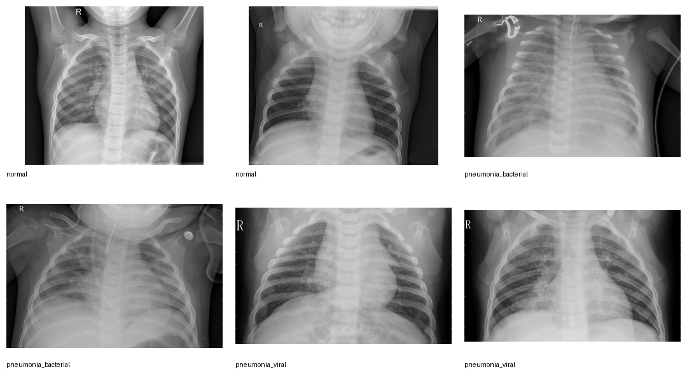
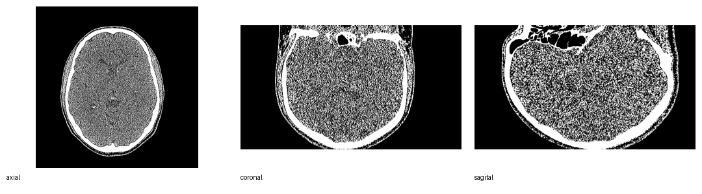
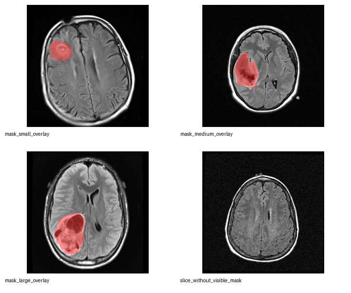
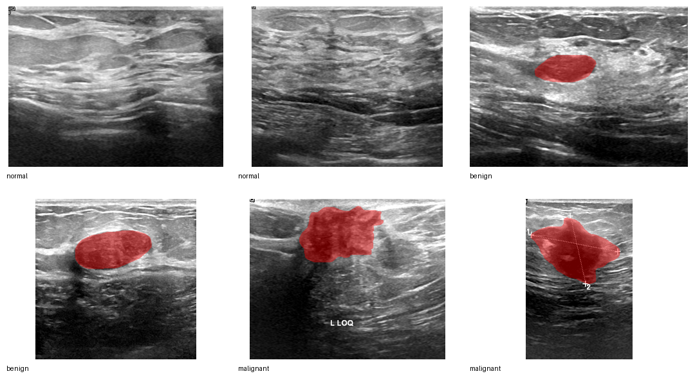
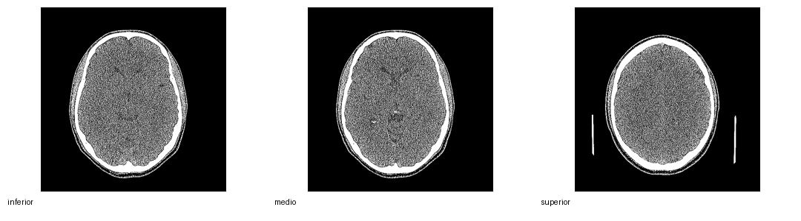
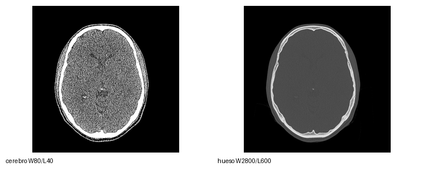

---

## Propósito de la sesión

Entender imágenes médicas sin convertirnos en radiólogos

Al terminar podremos responder:

1. ¿Por qué una imagen médica **no es una fotografía común**?
2. ¿Qué miden RX, CT, MRI y ultrasonido?
3. ¿Qué significan píxel, vóxel, contraste, ruido y máscara?
4. ¿Por qué el contexto clínico sigue siendo indispensable?

::: notes
Enfatizar desde el principio que la clase es divulgativa. No se hará diagnóstico ni entrenamiento clínico.
:::

## Acuerdo de seguridad

Esta clase usa imágenes reales, pero con fin **educativo**.

- No se diagnostica a partir de estas diapositivas.
- No se comparan pacientes reales.
- No se concluye gravedad clínica.
- No se reemplaza criterio médico.
- Las máscaras se usan para explicar **segmentación**, no para enseñar oncología.

> Una imagen médica es una medición visualizable; su interpretación clínica requiere historia, examen físico, protocolo de adquisición y experiencia profesional.

## La idea central

::: {.center}
<span class="huge">El cuerpo no “aparece” en la imagen.</span>

<span class="huge">El cuerpo **produce una señal** que el equipo transforma.</span>
:::

```{dot}
digraph G {
  graph [rankdir=LR, bgcolor="transparent"];
  node [shape=box, style="rounded,filled", fillcolor="#F4F7FA", color="#52616b", fontname="Arial", fontsize=20];
  edge [color="#52616b", arrowsize=0.8, penwidth=1.5];

  A [label="Cuerpo"];
  B [label="Fenómeno\nfísico"];
  C [label="Sensor"];
  D [label="Datos"];
  E [label="Imagen"];
  F [label="Interpretación\ncon contexto"];

  A -> B -> C -> D -> E -> F;
}
```

## El dataset docente

Usaremos cuatro grupos de imágenes reales ya preparadas para enseñanza:

::::{.columns}

::: {.column width='45%'}

{fig-align="center"}

:::

::: {.column width='45%'}

{fig-align="center"}

:::
::::


## El dataset docente

::::{.columns}

::: {.column width='45%'}

{fig-align="center"}

:::

::: {.column width='45%'}

{fig-align="center"}

:::
::::

::: {.caption}
Las imágenes vienen de datasets Kaggle y fueron convertidas a PNG para fines educativos. No se usan para diagnóstico clínico.
:::

::: notes
Si alguna imagen no aparece, verificar que el script se haya ejecutado y que la carpeta `teaching_dataset/` esté junto al archivo `.qmd`.
:::


## ¿Qué contiene cada grupo?

::: {.table-small}

| Grupo | Modalidad | Qué permite explicar | Archivo/mosaico clave |
|---|---|---|---|
| RX | Radiografía de tórax | Absorción, superposición, contraste | `xray_overview.png` |
| CT | Tomografía craneal | Cortes, vóxeles, ventana/nivel, DICOM | `ct_planes.png` |
| MRI | Resonancia FLAIR | Contraste de tejidos, máscara, segmentación | `mri_overview.png` |
| US | Ultrasonido mamario | Ecos, textura, speckle, segmentación | `ultrasound_overview.png` |

:::

::: notes
La tabla no debe convertirse en una explicación técnica larga. Sirve para que el público ubique qué verá durante la clase.
:::

# Parte 1 — Una imagen médica es una señal convertida en imagen

## Cuatro formas de mirar el cuerpo

```{dot}
digraph G {
  graph [rankdir=LR, bgcolor="transparent"];
  node [shape=box, style="rounded,filled", fillcolor="#F4F7FA", color="#52616b", fontname="Arial", fontsize=19];
  edge [color="#52616b", arrowsize=0.8, penwidth=1.4];

  X [label="Rayos X\natraviesan"];
  CT [label="Rayos X\ndesde muchos ángulos"];
  MR [label="Protones\nresponden al campo"];
  US [label="Ecos\nde sonido"];

  IX [label="Radiografía"];
  ICT [label="CT"];
  IMR [label="MRI"];
  IUS [label="Ultrasonido"];

  X -> IX;
  CT -> ICT;
  MR -> IMR;
  US -> IUS;
}
```

::: {.center}
<span class="question">La misma anatomía puede verse diferente porque la señal medida es diferente.</span>
:::

## Pregunta para el público

::: {.center}
<span class="huge">Cuando una zona se ve blanca, ¿significa siempre lo mismo?</span>
:::

Respuesta corta:

::: {.center}
<span class="huge"><strong>No.</strong></span>
:::

El brillo depende de la modalidad, del protocolo, del procesamiento y de la forma de visualizar la imagen.

::: notes
Pedir respuestas antes de avanzar. Lo normal es que el público piense “blanco = hueso” por experiencia con RX. Esa intuición no se transfiere directamente a MRI o ultrasonido.
:::

## De la señal al píxel

Una imagen digital está hecha de **píxeles**.

Cada píxel contiene un número.

```{dot}
digraph G {
  graph [rankdir=LR, bgcolor="transparent"];
  node [shape=box, style="rounded,filled", fillcolor="#F4F7FA", color="#52616b", fontname="Arial", fontsize=20];
  edge [color="#52616b", arrowsize=0.8, penwidth=1.5];

  A [label="Señal física"];
  B [label="Medición"];
  C [label="Número"];
  D [label="Píxel"];
  E [label="Imagen visible"];

  A -> B -> C -> D -> E;
}
```

::: {.center}
<span class="question">Ver una imagen médica es ver números convertidos en grises.</span>
:::

## Píxel y vóxel

::: {.grid2}


<div>

**Píxel**  
Elemento pequeño de una imagen 2D.

**Vóxel**  
Elemento pequeño de un volumen 3D.

**Corte**  
Plano extraído de un volumen.

**Volumen**  
Conjunto ordenado de cortes.

</div>

:::

::: notes
Aprovechar los planos CT para explicar que el cuerpo se puede representar como un bloque de pequeños cubos; un corte es una lámina dentro del bloque.
:::

# Parte 2 — Radiografía: una sombra útil

## Radiografía: primera observación

::: {.grid2}


<div>

Preguntas guía:

- ¿Qué zonas parecen más oscuras?
- ¿Qué estructuras parecen más claras?
- ¿Qué se superpone?
- ¿Qué no podríamos afirmar sin contexto clínico?

<span class="warn">No diagnosticar.</span> Observar solo propiedades visuales.

</div>

:::

## Radiografía: la lógica física

```{dot}
digraph G {
  graph [rankdir=LR, bgcolor="transparent"];
  node [shape=box, style="rounded,filled", fillcolor="#F4F7FA", color="#52616b", fontname="Arial", fontsize=20];
  edge [color="#52616b", arrowsize=0.8, penwidth=1.5];

  X [label="Fuente\nde rayos X"];
  C [label="Cuerpo\natenua diferente"];
  D [label="Detector"];
  I [label="Imagen\ntipo sombra"];

  X -> C -> D -> I;
}
```

- Aire: menor atenuación.
- Hueso: mayor atenuación.
- Tejidos blandos: atenuación intermedia.

## Radiografía: lo que se gana y lo que se pierde

::: {.grid2}

<div>

**Ventajas**

- Rápida.
- Económica.
- Útil para tórax y hueso.
- Fácil de transportar y almacenar.

</div>

<div>

**Limitaciones**

- Proyecta 3D en 2D.
- Superpone estructuras.
- Usa radiación ionizante.
- El hallazgo visual necesita contexto.

</div>

:::

::: notes
Explicar “proyección” con una sombra de la mano: muchas profundidades caen en una sola imagen.
:::

## Actividad breve: lectura sin diagnóstico

En parejas, observen el mosaico RX durante 2 minutos.

Completen verbalmente:

1. Una característica de contraste.
2. Una estructura que se superpone.
3. Una cosa que **no** se debería concluir solo con la imagen.

::: {.center}
<span class="question">La meta es describir, no diagnosticar.</span>
:::

# Parte 3 — CT: de muchas sombras a cortes

## CT: cortes desde una serie DICOM

::: {.grid2}



<div>

La CT también usa rayos X, pero no entrega una sola sombra.

El equipo mide desde muchos ángulos y el computador reconstruye cortes.

Esto permite mirar el cuerpo por secciones.

</div>

:::

## CT: reconstrucción conceptual

```{dot}
digraph G {
  graph [rankdir=LR, bgcolor="transparent"];
  node [shape=box, style="rounded,filled", fillcolor="#F4F7FA", color="#52616b", fontname="Arial", fontsize=19];
  edge [color="#52616b", arrowsize=0.8, penwidth=1.4];

  P1 [label="Proyección\n0°"];
  P2 [label="Proyección\n45°"];
  P3 [label="Proyección\n90°"];
  P4 [label="Muchas\nproyecciones"];
  R [label="Reconstrucción\ncomputacional"];
  V [label="Volumen\n3D"];
  S [label="Cortes"];

  P1 -> R;
  P2 -> R;
  P3 -> R;
  P4 -> R;
  R -> V -> S;
}
```

## CT: axial, coronal y sagital

::: {.center}

:::

::: {.caption}
Tres formas de cortar el mismo volumen: axial, coronal y sagital.
:::

::: notes
Usar el cuerpo propio como referencia: axial como rebanadas de arriba hacia abajo, coronal como de frente a espalda, sagital como izquierda-derecha.
:::

## CT: la ventana cambia lo que vemos

::: {.grid2}



<div>

La CT conserva números asociados a atenuación.

Pero la pantalla no puede mostrar todos los matices a la vez.

Por eso se elige una **ventana**:

- una para cerebro;
- otra para hueso;
- otra para pulmón;
- otra para abdomen.

</div>

:::

::: {.center}
<span class="question">Cambiar la ventana cambia la visualización, no el cuerpo ni el dato original.</span>
:::

## Actividad: misma imagen, otra pregunta

Miren el mosaico de ventana CT.

::: {.center}

:::

Discusión:

- ¿Qué imagen permite ver mejor estructuras óseas?
- ¿Qué imagen permite ver mejor tejidos blandos?
- ¿Por qué sería un error decir que una de las dos es “más real”?

# Parte 4 — MRI: una imagen sensible al tejido

## MRI: observar tejidos blandos

::: {.grid2}


<div>

La resonancia magnética no usa rayos X.

Mide señales relacionadas con protones de hidrógeno y su comportamiento en un campo magnético.

En esta clase usamos imágenes **FLAIR** del dataset docente.

</div>

:::

::: notes
FLAIR no se explica con física avanzada. Basta decir: es una forma de adquirir MRI que puede resaltar ciertos cambios en tejido cerebral al suprimir parte de la señal del líquido.
:::

## MRI: no existe una única “foto”

En MRI, el contraste depende de cómo se adquiere la señal.

La misma región puede cambiar de apariencia según la secuencia.

::: {.center}
<span class="tag">T1</span>
<span class="tag">T2</span>
<span class="tag">FLAIR</span>
<span class="tag">Difusión</span>
<span class="tag">Contraste</span>
:::

Para público general:

> La MRI no pregunta solo “¿qué forma tiene?”, sino también “¿cómo se comporta este tejido bajo esta medición?”.

## MRI y segmentación

::: {.grid2}


<div>

El dataset docente incluye:

- imagen MRI;
- máscara manual;
- overlay pedagógico.

La **máscara** indica una región marcada para análisis.

No es una etiqueta que deba interpretarse sin contexto clínico.

</div>

:::

## ¿Qué es una máscara?

```{dot}
digraph G {
  graph [rankdir=LR, bgcolor="transparent"];
  node [shape=box, style="rounded,filled", fillcolor="#F4F7FA", color="#52616b", fontname="Arial", fontsize=20];
  edge [color="#52616b", arrowsize=0.8, penwidth=1.5];

  I [label="Imagen"];
  M [label="Máscara\n0 = fuera\n1 = dentro"];
  O [label="Overlay"];
  A [label="Medición\nde área, forma\no volumen"];

  I -> O;
  M -> O;
  O -> A;
}
```

::: {.center}
<span class="question">Segmentar es separar una región de interés del resto de la imagen.</span>
:::

# Parte 5 — Ultrasonido: imágenes hechas con ecos

## Ultrasonido: textura y ecos

::: {.grid2}


<div>

El ultrasonido envía ondas sonoras de alta frecuencia.

El equipo escucha ecos producidos por cambios entre tejidos.

Por eso su apariencia suele ser granular y dependiente del operador, del ángulo y del tejido.

</div>

:::

## Ultrasonido: idea física

```{dot}
digraph G {
  graph [rankdir=LR, bgcolor="transparent"];
  node [shape=box, style="rounded,filled", fillcolor="#F4F7FA", color="#52616b", fontname="Arial", fontsize=20];
  edge [color="#52616b", arrowsize=0.8, penwidth=1.5];

  T [label="Transductor"];
  W [label="Onda\nsonora"];
  E [label="Ecos\nen tejidos"];
  S [label="Señal\nrecibida"];
  I [label="Imagen\nB-mode"];

  T -> W -> E -> S -> I;
}
```

## Speckle: textura, no “suciedad”

El ultrasonido suele tener una textura granular llamada **speckle**.

Puede parecer ruido, pero está relacionada con la forma en que muchas pequeñas reflexiones se combinan.

::: {.center}

:::

Pregunta:

::: {.center}
<span class="question">¿Qué parte parece estructura y qué parte parece textura?</span>
:::

## Ultrasonido y máscaras

El dataset docente incluye imágenes normales, benignas y malignas según la estructura original del dataset.

Para enseñanza, las máscaras se usan para explicar:

- región de interés;
- contorno;
- área;
- superposición imagen–máscara;
- análisis computacional posterior.

::: {.center}
<span class="warn">No usamos estas imágenes para entrenar diagnóstico clínico en esta clase.</span>
:::

# Parte 6 — Calidad de imagen

## La pregunta correcta no es “¿se ve bonito?”

::: {.center}
<span class="huge">La pregunta correcta es:</span>

<span class="huge"><strong>¿sirve para responder una pregunta médica concreta?</strong></span>
:::

Una imagen puede verse limpia y aun así no ser suficiente.

También puede verse ruidosa, pero contener información útil para un experto.

## Cuatro conceptos de calidad

::: {.grid2}

<div>

**Contraste**  
Diferencia visible entre regiones.

**Resolución**  
Capacidad de separar detalles pequeños.

</div>

<div>

**Ruido**  
Variación no deseada o aleatoria.

**Artefacto**  
Apariencia causada por el sistema, no por el cuerpo.

</div>

:::

```{dot}
digraph G {
  graph [rankdir=LR, bgcolor="transparent"];
  node [shape=box, style="rounded,filled", fillcolor="#F4F7FA", color="#52616b", fontname="Arial", fontsize=20];
  edge [color="#52616b", arrowsize=0.8, penwidth=1.3];

  Q [label="Calidad\nde imagen"];
  C [label="Contraste"];
  R [label="Resolución"];
  N [label="Ruido"];
  A [label="Artefactos"];

  Q -> C;
  Q -> R;
  Q -> N;
  Q -> A;
}
```

## Contraste

::: {.grid2}


<div>

El contraste no es solo una propiedad del cuerpo.

También depende de:

- modalidad;
- adquisición;
- ventana de visualización;
- procesamiento;
- tejido de interés.

</div>

:::

## Resolución

::: {.grid2}


<div>

Resolución significa capacidad para distinguir detalle.

En una imagen digital depende de:

- tamaño de píxel o vóxel;
- resolución física del sistema;
- movimiento;
- reconstrucción;
- visualización.

</div>

:::

## Ruido y artefactos

::: {.grid2}


<div>

En imágenes médicas hay patrones que no siempre vienen directamente de una estructura anatómica.

Ejemplos:

- ruido;
- speckle;
- movimiento;
- mala ventana;
- aliasing;
- reconstrucción imperfecta.

</div>

:::

## Del original al derivado docente

El dataset de enseñanza conserva los datos originales separados de los derivados.

```{dot}
digraph G {
  graph [rankdir=LR, bgcolor="transparent"];
  node [shape=box, style="rounded,filled", fillcolor="#F4F7FA", color="#52616b", fontname="Arial", fontsize=19];
  edge [color="#52616b", arrowsize=0.8, penwidth=1.4];

  A [label="Dataset Kaggle\noriginal"];
  B [label="Selección\ndidáctica"];
  C [label="Conversión\na PNG"];
  D [label="Mosaicos\npara clase"];
  E [label="Manifest\ntrazabilidad"];

  A -> B -> C -> D;
  B -> E;
  C -> E;
}
```

::: {.center}
<span class="ok">Regla: los datos originales no se modifican.</span>
:::

# Parte 7 — Procesamiento e inteligencia artificial

## ¿Dónde entra el procesamiento de imágenes?

```{dot}
digraph G {
  graph [rankdir=LR, bgcolor="transparent"];
  node [shape=box, style="rounded,filled", fillcolor="#F4F7FA", color="#52616b", fontname="Arial", fontsize=18];
  edge [color="#52616b", arrowsize=0.8, penwidth=1.4];

  I [label="Imagen"];
  P [label="Preprocesamiento"];
  S [label="Segmentación"];
  M [label="Medición"];
  C [label="Clasificación\no apoyo"];
  H [label="Revisión\nhumana"];

  I -> P -> S -> M -> C -> H;
}
```

Ejemplos simples:

- ajustar contraste;
- reducir ruido;
- segmentar una región;
- medir área;
- comparar casos.

## Imagen + máscara = medición

::: {.grid2}


<div>

Una máscara permite pasar de “ver” a “medir”.

Podemos calcular:

- área;
- forma;
- textura;
- volumen;
- cambio temporal.

Pero medir no equivale automáticamente a diagnosticar.

</div>

:::

## IA médica: no ve como una persona

::: {.center}
<span class="huge">Un modelo no ve anatomía.</span>

<span class="huge">Procesa arreglos de números.</span>
:::

```{dot}
digraph G {
  graph [rankdir=LR, bgcolor="transparent"];
  node [shape=box, style="rounded,filled", fillcolor="#F4F7FA", color="#52616b", fontname="Arial", fontsize=18];
  edge [color="#52616b", arrowsize=0.8, penwidth=1.4];

  I [label="Imagen\ncomo matriz"];
  L [label="Etiqueta\no máscara"];
  T [label="Entrenamiento"];
  M [label="Modelo"];
  O [label="Predicción"];
  V [label="Validación\nclínica"];

  I -> T;
  L -> T;
  T -> M -> O -> V;
}
```

## ¿Qué puede salir mal con IA?

- Entrenar con imágenes de un solo hospital.
- Confundir marcas, bordes o artefactos con enfermedad.
- Usar etiquetas incompletas.
- Evaluar sin población externa.
- Ignorar protocolo de adquisición.
- Mostrar resultados sin incertidumbre.

::: {.center}
<span class="question">La IA puede ayudar, pero no elimina la necesidad de criterio, validación y responsabilidad.</span>
:::

# Cierre

## Actividad final: mapa de modalidad

En grupos, elijan una imagen del dataset docente y respondan:

::: {.table-small}

| Pregunta | Respuesta esperada |
|---|---|
| ¿Qué modalidad parece ser? | RX, CT, MRI o US |
| ¿Qué fenómeno físico se mide? | Atenuación, ecos, señal magnética... |
| ¿Qué representa el brillo? | Depende de la modalidad |
| ¿Qué limitación visual tiene? | Ruido, superposición, ventana, máscara... |
| ¿Qué NO se puede concluir solo con la imagen? | Diagnóstico, gravedad, evolución... |

:::

## Tres ideas que deben quedar

::: {.center}
<span class="huge">1. Una imagen médica es una medición transformada.</span>

<span class="huge">2. El brillo no significa lo mismo en todas las modalidades.</span>

<span class="huge">3. La imagen necesita contexto clínico y técnico.</span>
:::

## Checklist de comprensión

Al final, cada persona debería poder explicar:

- qué es un píxel;
- qué es un vóxel;
- por qué RX y CT usan rayos X, pero no producen el mismo tipo de imagen;
- por qué MRI puede cambiar según la secuencia;
- por qué el ultrasonido tiene textura granular;
- qué es una máscara;
- por qué IA médica requiere validación.
- [Apendice](./diapositivas_respaldo_reconstruccion_imagenes_medicas.qmd)
- [Código](./pipeline_preprocesamiento_mri_teaching.ipynb)

## Fuentes conceptuales y datos

**Base conceptual**

- Prince, J. L. & Links, J. M. *Medical Imaging: Signals and Systems*, 2nd ed.
- Dougherty, G. *Digital Image Processing for Medical Applications*.

**Datasets Kaggle usados para el dataset docente**

- Chest X-Ray Images (Pneumonia): <https://www.kaggle.com/datasets/paultimothymooney/chest-xray-pneumonia>
- Cranial CT: <https://www.kaggle.com/datasets/abbymorgan/cranial-ct>
- Brain MRI segmentation: <https://www.kaggle.com/datasets/mateuszbuda/lgg-mri-segmentation>
- Breast Ultrasound Images Dataset: <https://www.kaggle.com/datasets/aryashah2k/breast-ultrasound-images-dataset>

::: {.footer-note}
Uso educativo. No utilizar este material para diagnóstico, triaje o toma de decisiones clínicas.
:::
```{=html}
<script>
document.addEventListener("DOMContentLoaded", function () {

  const titleSlide = document.querySelector("#title-slide");

  if (!titleSlide) {
    return;
  }

  const logos = document.createElement("div");
  logos.className = "title-logos";

  logos.innerHTML = `
    

    
  `;

  titleSlide.appendChild(logos);

});
</script>
```