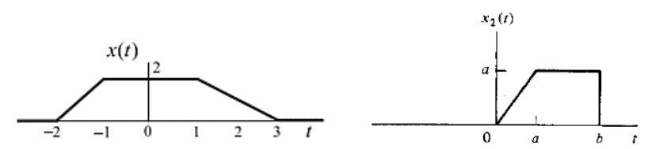
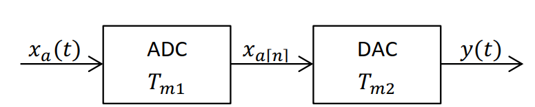

::: {.cell}

:::

::: {.cell}

:::

## Descripción  
A través de este taller se reforzarán los conocimientos en: señales, transformaciones de la 
variable independiente, clasificación de señales, ADC y DAC.  

## Procedimiento  
Explique detalladamente el procedimiento para cada uno de los puntos enunciados a continuación.  

### 1. Considere la señal
$$x(t) = \begin{cases} 
  t + 1, & -1 \leq t \leq 0 \\ 
  2, & 0 < t \leq 2 \\ 
  1, & 2 < t \leq 3 \\ 
  0, & \text{en otro caso} 
 \end{cases}$$

Dibuje:

- $x(t)$
- $x(t - 2)$
- $x(2t + 1)$
- $x(-3t)$

### 2. Determine si las siguientes señales son periódicas y encuentre su periodo  

a) $x(t) = \cos(2t) + \cos(\pi t)$  
b) $x(t) = e^{-j(\frac{4\pi}{3})t} + e^{j(\frac{2\pi}{5})t}$  
c) $x(n) = \cos(n/8) \cos(\pi n/8)$  
d) $x(n) = \cos(3\pi n/2) - \sin(\frac{\pi n}{8}) + 3\cos(\frac{\pi n}{4} + \frac{\pi}{3})$  

### 3. Demuestre que si $x(t)$ y $y(t)$ son señales impares, entonces:  

a) $z(t) = x(t)y(t)$ es una señal par  
b) $g(t) = x(t) + y(t)$ es una señal impar.  
c) Siendo $x(t) = \sin(t)$ y $y(t) = t$, grafique en Python $z(t)$ y $g(t)$. ¿Se cumple lo indicado en los numerales a y b?  

### 4. Encuentre la expresión analítica de las señales mostradas a continuación utilizando funciones $u(t)$ y $r(t)$ (escalón unitario y rampa).  

### 5. Para una señal análoga $x_a(t) = \sin(600\pi t) + 3\sin(480\pi t)$, encontrar:

a) Indique si la señal $x_a(t)$ es una señal periódica, en caso afirmativo, indique el periodo de la señal.  
b) Frecuencia de muestreo que cumpla con el teorema de Nyquist.  
c) Encontrar $x_a[n]$ con la frecuencia de muestreo encontrada en el punto anterior.  
d) Indique si la señal $x_a[n]$ es una señal periódica, en caso afirmativo, indique el periodo de la señal.  

### 6. Considere el sistema de procesamiento de señales mostrado en la figura:

Si la entrada es $x_a(t) = 2 \sin(720\pi t) + 2$, encontrar:  

a) La salida $x_a[n]$ si $T_{m1} = 12.5ms$. ¿Con esta frecuencia se puede reconstruir la señal $x_a(t)$ en $y(t)$ si $T_{m2} = T_{m1}$? Justifique su respuesta.  
b) La salida $x_a[n]$ si la frecuencia de muestreo del ADC es 8 veces la frecuencia de Nyquist. ¿La señal es periódica en tiempo discreto? Justifique su respuesta.  
c) Para la señal del punto b, encontrar la señal cuantizada de un ciclo de la señal si el tamaño del registro es de 4 bits y el rango de valores que maneja a la entrada es de 0 a 5.  
