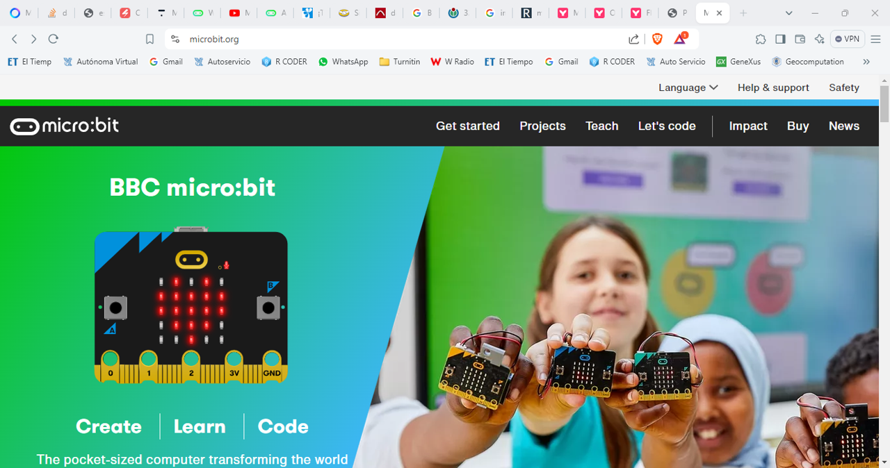
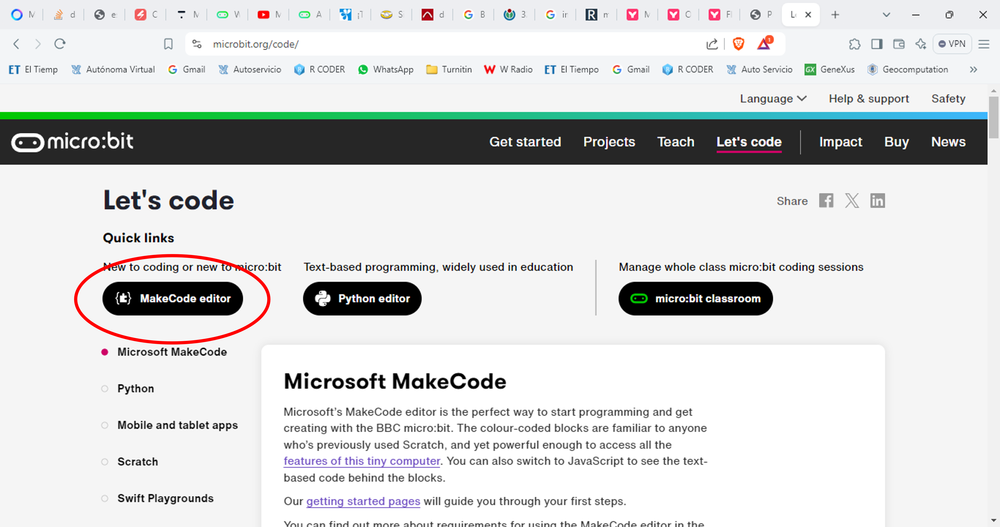

::: {.cell}

:::

::: {.cell}

:::


# ¿Que es la microbit?

## Que es Microbit

:::: {.columns}

::: {.column width="45%"}

{width=60%}

:::

::: {.column width="45%"}

* Es una computadora portátil y programable
* Enfocada en inspirar y desarrollar habilidades técnicas básicas en el campo STEM
  
{width=60%}

:::
::::

## Que es Microbit

:::: {.columns}

::: {.column width="45%"}

{width=60%}

:::

::: {.column width="45%"}

* Creada en el 2012 con el objetivo de democratizar la educación en computación.
* Entre 2012 y 2015, se unieron 29 socios clave entre los cuales están a ARM, Barclays, element14, Freescale, Universidad de Lancaster, Microsoft, Nordic Semiconductor, Samsung y ScienceScope.

:::
::::

## Que es Microbit

:::: {.columns}

::: {.column width="45%"}

{width=60%}

:::

::: {.column width="45%"}

* Lanzamiento (2015): La Microbit se lanzó como parte de la iniciativa "Make it Digital" de la BBC, con el objetivo de introducir la codificación y la ciencia computacional en colegios del Reino Unido. 

:::
::::

## Componentes


## Como la puedo programar?

## Que es Microbit

:::: {.columns}

::: {.column width="45%"}

{width=60%}

:::

::: {.column width="45%"}

* MicroPython
* JavaScript
* Editor de bloques visuales
* Lenguaje de programación C

:::
::::

## Distribución e impacto

* Distribución: La Microbit se distribuyó de forma gratuita a todos los niños de 12-13 años (Year 7) en todo el Reino Unido, con el objetivo de llegar a más de 1 millón de niños.

* Impacto: En su primer año, la Microbit mostró un impacto positivo significativo en los estudiantes y docentes del Reino Unido, con el 90% de los estudiantes informando que les ayudó a entender que cualquiera puede programar.


# Programemos en la microbit

## Problema

:::: {.columns}

::: {.column width="45%"}

::: {.callout-note title="Algoritmo basico"}

1. Inicializar una variable en 0.
2. Mostrar el número en la pantalla de leds.
3. Contar hasta 9 y repetir indefinidamente.
4. Si en la variable, el número es igual a 7, entonces mostrar un emoji de cara feliz.

:::


:::


::: {.column width="45%"}


::: {.cell}
::: {.cell-output-display}


```{=html}
<div class="DiagrammeR html-widget html-fill-item" id="htmlwidget-1795148c3be929b0f0b5" style="width:960px;height:480px;"></div>
<script type="application/json" data-for="htmlwidget-1795148c3be929b0f0b5">{"x":{"diagram":"\ngraph TB\nA[Iniciar] -->|Inicio| B[Inicializar variable en 0]\nB --> C[Mostrar número en pantalla de LEDs]\nC --> D[Contar hasta 9]\nD --> E[Variable == 7]\nE -->|Sí| F[Mostrar emoji de cara feliz]\nE -->|No| G[Continuar contando]\nF --> G\nG --> H[Variable < 9]\nH -->|Sí| D\nH -->|No| I[Reiniciar conteo]\nI --> B\n"},"evals":[],"jsHooks":[]}</script>
```


:::
:::


:::
::::

# Como programar

## [https://microbit.org/](https://microbit.org/)



## Let's Code


## Editor



## Un problema de IA

::: {.callout-note title="Algoritmo basico"}

1. Inicializar una variable con el número a **adivinar** de forma aleatoria entre  0-100.
2. Inicializar el acumulador en 0
3. Si acumulador es mayor que adivinar entonces disminuir acumulador en uno.
4. Si acumulador es mucho mayor que adivinar entonces disminuir acumulador en 10.
5. Si en la variable, el número es igual a 7, entonces mostrar un emoji de cara feliz.
6. Si acumulador es menor que adivinar entonces aumentar acumulador en uno.
7. Si acumulador es mucho menor que adivinar entonces aumentar acumulador en 10.

:::