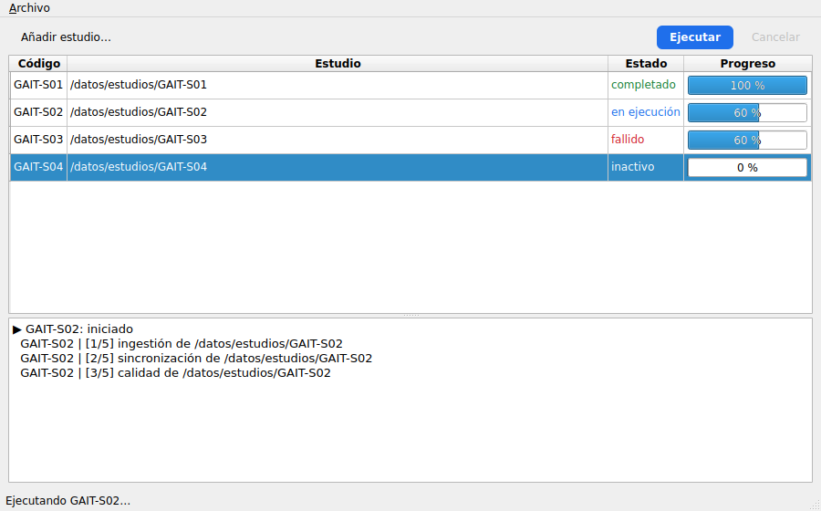

# Introducción {#sec-intro}

PySide6 es el enlace oficial de Python para **Qt 6**, el framework de interfaces
de escritorio que mantiene The Qt Company. Con él se escriben aplicaciones
nativas para Windows, macOS y Linux desde un único código Python.

Este tutorial tiene dos objetivos:

1. Entender **cómo funciona Qt por dentro** (objetos, bucle de eventos, señales,
   Model/View, hilos), porque casi todos los errores difíciles de PySide6
   vienen de no tener ese modelo mental.
2. Establecer una **arquitectura y un flujo de desarrollo** concretos para la
   interfaz de escritorio de BioForge: estructura de carpetas, separación de
   responsabilidades, pruebas automáticas, CI y empaquetado.

Todo se aterriza en una aplicación real, **BioForge Launcher**, que lista
estudios, lanza `bioforge run` como proceso externo, muestra el progreso y el
registro en vivo, permite cancelar y calcula huellas SHA-256 sin congelar la
interfaz.

{#fig-launcher width=90%}

::: {.callout-note}
## Cómo leer este documento
- La @sec-arquitectura-qt construye el **modelo mental de Qt**. Léela entera aunque tengas prisa.
- Las secciones @sec-widgets a @sec-concurrencia cubren las piezas: widgets, Model/View y concurrencia.
- La @sec-arquitectura-app propone la **arquitectura de la aplicación** BioForge.
- La @sec-flujo describe el **flujo de desarrollo**: entorno, Designer, calidad, pruebas, CI y empaquetado.
- La @sec-laboratorio es el código completo de BioForge Launcher, listo para copiar.
- Las secciones finales son errores comunes y una **hoja de trucos**.
:::

::: {.callout-tip}
## Código verificado
Todos los programas de este documento se ejecutaron con **PySide6 6.11 y
Python 3.11**. La aplicación de ejemplo pasa sus 8 pruebas con `pytest-qt`,
`ruff check` y `mypy --strict`. Los archivos están junto a este tutorial en
`ejemplo/bioforge-launcher/` (aplicación) y `ejemplo/fragmentos/` (ejemplos
cortos numerados).
:::

## ¿Por qué PySide6 para BioForge?

BioForge Experiment OS es hoy un **monolito modular local** con una CLI Typer
(`bioforge.cli`) como única entrada. El documento de arquitectura destaca que la
CLI no contiene lógica científica, lo que permite que *otra interfaz* reutilice
las mismas funciones de aplicación. Una app de escritorio encaja con esa
decisión:

- Se ejecuta en el mismo computador que los datos, sin servidor ni red.
- Puede lanzar la CLI existente como proceso hijo (sin tocar el núcleo) o
  llamar a las funciones de aplicación directamente cuando maduren.
- Ofrece tablas, formularios y visualización de progreso que en la terminal son
  incómodos para personal de laboratorio.

| Opción | Licencia | Mantenedor | Comentario |
|---|---|---|---|
| **PySide6** | LGPLv3 / comercial | The Qt Company (oficial) | Permite distribuir apps propietarias cumpliendo LGPL. **Elegida.** |
| PyQt6 | GPLv3 / comercial | Riverbank Computing | API casi idéntica; GPL obliga a liberar el código o comprar licencia. |
| Tkinter | PSF | CPython | Incluido en Python, pero con widgets limitados y sin Model/View real. |
| Web local (FastAPI + navegador) | — | — | Ya diferido en el ADR 0001; más piezas que operar. |

: Alternativas para una interfaz de escritorio en Python {#tbl-alternativas}

## Instalación

Se recomienda `uv`, el mismo gestor que ya usa BioForge:

```bash
uv add pyside6                      # dependencia de ejecución
uv add --group dev pytest pytest-qt # dependencias de desarrollo
uv run python -c "import PySide6; print(PySide6.__version__)"
```

El paquete `PySide6` es un metapaquete que instala `PySide6-Essentials`
(QtCore, QtGui, QtWidgets…) y `PySide6-Addons` (QtCharts, QtMultimedia,
Qt3D…). Si el tamaño importa, depende solo de `PySide6-Essentials`.

La instalación trae herramientas de línea de comandos:

| Herramienta | Para qué sirve |
|---|---|
| `pyside6-designer` | Editor visual de interfaces (`.ui`). |
| `pyside6-uic` | Convierte un `.ui` en código Python. |
| `pyside6-rcc` | Compila recursos (`.qrc`: iconos, imágenes) a un módulo Python. |
| `pyside6-deploy` | Empaqueta la aplicación como ejecutable (usa Nuitka). |
| `pyside6-lupdate` / `pyside6-lrelease` | Extraen y compilan traducciones. |
| `pyside6-qml` | Ejecuta un archivo QML directamente. |

::: {.callout-warning}
## Linux sin escritorio (servidores, contenedores, CI)
Qt necesita algunas bibliotecas del sistema aunque no haya pantalla. Si al
importar `PySide6.QtGui` aparece `ImportError: libEGL.so.1`, instala:
`sudo apt-get install libegl1 libgl1 libxkbcommon0 libfontconfig1 libdbus-1-3`.
Para ejecutar sin pantalla usa `QT_QPA_PLATFORM=offscreen`.
:::

## Hola mundo, línea por línea

```{.python filename="fragmentos/01_hola.py"}
import sys

from PySide6.QtWidgets import QApplication, QLabel, QPushButton, QVBoxLayout, QWidget

app = QApplication(sys.argv)  # 1. exactamente una por proceso, antes de cualquier widget

window = QWidget()  # 2. un widget sin padre es una ventana
window.setWindowTitle("Hola, BioForge")
label = QLabel("Ningún experimento en curso")
button = QPushButton("Iniciar")

layout = QVBoxLayout(window)  # 3. el layout reparte el espacio y adopta los widgets
layout.addWidget(label)
layout.addWidget(button)

button.clicked.connect(lambda: label.setText("Experimento iniciado"))  # 4. señal -> slot

window.show()
sys.exit(app.exec())  # 5. bucle de eventos: bloquea hasta cerrar la última ventana
```

Las cinco piezas numeradas aparecen en **toda** aplicación Qt:

1. `QApplication` inicializa Qt (plataforma gráfica, fuentes, estilo). Debe
   existir una sola y antes de crear cualquier widget.
2. Un widget sin padre se convierte en ventana de nivel superior.
3. Los *layouts* calculan posiciones y tamaños; nunca se posiciona con
   coordenadas fijas.
4. `clicked` es una **señal**; la función conectada es un **slot**.
5. `app.exec()` entrega el control al **bucle de eventos**. A partir de aquí tu
   código solo se ejecuta como reacción a eventos.

# Arquitectura de Qt y PySide6 {#sec-arquitectura-qt}

## Capas: de C++ a Python

PySide6 no reimplementa Qt: **envuelve** la biblioteca C++ mediante
*Shiboken*, un generador de enlaces. Cada objeto Python de PySide6 (un
*wrapper*) apunta a un objeto C++ real.

```{mermaid}
%%| label: fig-capas
%%| fig-cap: "Capas de una aplicación PySide6."
flowchart TB
  A["Tu aplicación Python<br/>(vistas, presentadores, servicios)"]
  B["Módulos PySide6<br/>QtCore · QtGui · QtWidgets · QtQml · QtCharts …"]
  C["Shiboken6<br/>wrappers Python ⇄ C++, conversión de tipos, propiedad de memoria"]
  D["Qt 6 (C++)<br/>bucle de eventos, widgets, render, red, hilos"]
  E["Plataforma (QPA)<br/>Windows · Cocoa · xcb/Wayland · offscreen"]
  A --> B --> C --> D --> E
```

Dos consecuencias prácticas:

- El trabajo pesado (dibujar, maquetar, gestionar eventos) ocurre en C++ y es
  rápido. Lo lento es el **código Python** que pongas en los slots.
- Existen **dos vidas** por objeto: la del wrapper Python y la del objeto C++.
  Si el C++ se destruye y conservas el wrapper, obtienes
  `RuntimeError: Internal C++ object … already deleted`.

## Módulos principales

| Módulo | Contenido | ¿Lo usa BioForge Launcher? |
|---|---|---|
| `QtCore` | `QObject`, señales, bucle de eventos, `QTimer`, `QThread`, `QProcess`, `QSettings`, modelos abstractos | Sí, en todas las capas no visuales |
| `QtGui` | Colores, fuentes, iconos, `QAction`, pintura, `QStandardItemModel` | Sí |
| `QtWidgets` | Ventanas, botones, tablas, diálogos, layouts | Sí, solo en `views/` |
| `QtTest` | `QTest`, `QAbstractItemModelTester` | En pruebas |
| `QtUiTools` | `QUiLoader` para cargar `.ui` en tiempo de ejecución | Opcional |
| `QtCharts` / `QtGraphs` | Gráficas 2D/3D | Futuro: señales y curvas de calidad |
| `QtQml` / `QtQuick` | Interfaces declarativas QML | No (ver @sec-widgets-vs-qml) |
| `QtSql` | Acceso a SQLite y otros motores | No: el núcleo ya gestiona SQLite |

: Módulos de PySide6 más usados {#tbl-modulos}

## QObject: el árbol de objetos

`QObject` es la clase base de casi todo en Qt. Aporta cuatro capacidades:

1. **Señales y slots** (@sec-senales).
2. **Árbol de padres e hijos**: cada `QObject` puede tener un padre; al
   destruirse el padre, destruye a todos sus hijos.
3. **Propiedades dinámicas** y nombre de objeto (`setObjectName`).
4. **Afinidad de hilo**: cada `QObject` "pertenece" a un hilo (@sec-concurrencia).

```{.python filename="fragmentos/03_arbol_objetos.py"}
"""El árbol de padres e hijos decide cuándo se libera la memoria en C++."""

from PySide6.QtCore import QObject
from PySide6.QtWidgets import QApplication, QPushButton, QWidget

app = QApplication([])

study = QObject()
study.setObjectName("estudio")
session = QObject(study)  # hijo de `study`
session.setObjectName("sesion-01")
QObject(session).setObjectName("prueba-01")  # sin referencia en Python: vive igual

print([c.objectName() for c in study.findChildren(QObject)])
# ['sesion-01', 'prueba-01']

del study  # el padre se destruye y arrastra a todos sus hijos
try:
    session.objectName()
except RuntimeError as exc:
    print("Error:", exc)  # Internal C++ object (PySide6.QtCore.QObject) already deleted.

# Lo mismo con widgets: un layout reparenta los widgets a su contenedor.
window = QWidget()
button = QPushButton("OK", window)
print(button.parent() is window)  # True
```

```{mermaid}
%%| label: fig-arbol
%%| fig-cap: "Árbol de objetos de la ventana principal de BioForge Launcher. Destruir MainWindow destruye todo el árbol."
flowchart TD
  W[MainWindow] --> P[MainPresenter]
  W --> R[ExperimentRunner]
  R --> Q1[QProcess S01]
  R --> Q2[QProcess S02]
  W --> C[central QWidget]
  C --> S[QSplitter]
  S --> T[QTableView]
  T --> D[ProgressDelegate]
  S --> L[QPlainTextEdit]
```

::: {.callout-important}
## Regla de propiedad
- Un `QObject` **con padre** lo libera Qt cuando muere el padre. No necesitas
  guardar referencia en Python.
- Un `QObject` **sin padre** vive mientras exista una referencia Python. Si es
  una variable local, morirá al terminar la función, y con él la ventana o el
  temporizador que creaste.
- Para destruir un objeto mientras se está ejecutando uno de sus slots o
  señales, usa `obj.deleteLater()`: Qt lo borra cuando el bucle de eventos
  quede libre.
:::

## El bucle de eventos {#sec-bucle}

`app.exec()` ejecuta un bucle que, en cada vuelta, recoge eventos del sistema
operativo (ratón, teclado, repintado, temporizadores, procesos, sockets) y los
despacha al objeto correspondiente. Las señales conectadas se ejecutan como
parte de ese despacho.

```{mermaid}
%%| label: fig-bucle
%%| fig-cap: "Un clic recorre el bucle de eventos hasta tu slot. Mientras el slot se ejecuta, no se procesa ningún otro evento."
sequenceDiagram
  participant SO as Sistema operativo
  participant EL as Bucle de eventos (hilo GUI)
  participant B as QPushButton
  participant S as Tu slot (Python)
  SO->>EL: evento de ratón
  EL->>B: mousePressEvent / mouseReleaseEvent
  B->>S: emite clicked → llama al slot
  Note over S: si tarda 10 s,<br/>la ventana se congela 10 s
  S-->>EL: retorna
  EL->>B: paintEvent (repintado)
```

La consecuencia más importante de todo el tutorial:

::: {.callout-warning}
## Nunca bloquees el hilo de la interfaz
Un `time.sleep()`, una lectura grande de disco, un cálculo de SHA-256 o un
`subprocess.run()` dentro de un slot **congela la ventana** (deja de
repintarse y el sistema la marca como "no responde"). Todo trabajo de más de
unos ~50 ms va a un proceso o un hilo (@sec-concurrencia).
:::

## Señales y slots {#sec-senales}

Una **señal** es un aviso de que algo ocurrió; un **slot** es cualquier
función que reacciona. El emisor no conoce a sus receptores: eso permite
construir componentes desacoplados (un sensor no sabe que existe una etiqueta
que muestra su valor).

```{.python filename="fragmentos/02_senales.py"}
"""Señales propias, slots y conexión entre objetos que no se conocen."""

import sys

from PySide6.QtCore import QObject, QTimer, Signal, Slot
from PySide6.QtWidgets import QApplication, QLabel


class Acquisition(QObject):
    """Simula un sensor: no sabe nada de la interfaz, solo emite señales."""

    sample_received = Signal(float)  # firma: un float
    stopped = Signal()

    def __init__(self, parent: QObject | None = None) -> None:
        super().__init__(parent)
        self._n = 0
        self._timer = QTimer(self)  # hijo: se destruye con la adquisición
        self._timer.setInterval(200)
        self._timer.timeout.connect(self._tick)

    @Slot()
    def start(self) -> None:
        self._timer.start()

    @Slot()
    def _tick(self) -> None:
        self._n += 1
        self.sample_received.emit(36.5 + self._n / 10)
        if self._n == 10:
            self._timer.stop()
            self.stopped.emit()


class Display(QLabel):
    @Slot(float)
    def show_sample(self, value: float) -> None:
        self.setText(f"Temperatura: {value:.1f} °C")


app = QApplication(sys.argv)
acq = Acquisition()
display = Display("Esperando muestras…")
display.resize(300, 80)

acq.sample_received.connect(display.show_sample)  # emisor y receptor desacoplados
acq.stopped.connect(lambda: display.setText(display.text() + "  (fin)"))
acq.stopped.connect(app.quit)  # una señal puede tener varios receptores

display.show()
acq.start()
sys.exit(app.exec())
```

Puntos clave:

- Las señales se declaran como **atributos de clase** (`Signal(float)`), nunca
  en `__init__`. Al acceder desde una instancia se obtiene un objeto
  *conectable*.
- `@Slot(tipos)` es opcional, pero recomendable: documenta la firma, registra
  el método en el sistema de metaobjetos (algo más rápido y con menos memoria)
  y deja claro qué métodos están pensados como receptores, sobre todo cuando
  la señal llega desde otro hilo.
- Una señal puede conectarse a varios slots y a otras señales.
- `connect()` devuelve una conexión que se puede cortar con
  `signal.disconnect(slot)`.

### Tipos de conexión

| Tipo | Qué hace | Cuándo |
|---|---|---|
| `AutoConnection` (por defecto) | *Direct* si emisor y receptor están en el mismo hilo; *Queued* si no | Casi siempre |
| `DirectConnection` | Llama al slot inmediatamente, en el hilo que emite | Mismo hilo, máxima inmediatez |
| `QueuedConnection` | Encola un evento; el slot se ejecuta en el hilo del receptor | Comunicar un hilo trabajador con la GUI |
| `BlockingQueuedConnection` | Como *Queued* pero el emisor espera | Raro; riesgo de bloqueo mutuo |
| `UniqueConnection` | Evita conectar dos veces lo mismo | Conexiones que se rehacen |

: Tipos de conexión de señales {#tbl-conexiones}

La conexión *Queued* es lo que hace **seguro** emitir una señal desde un hilo
trabajador y actualizar un widget en el receptor: Qt copia los argumentos y
ejecuta el slot en el hilo GUI.

::: {.callout-caution}
## Lambdas en conexiones: úsalas con cuidado
Las `lambda` son cómodas para conexiones triviales dentro de la GUI
(`button.clicked.connect(lambda: label.setText("…"))`). Evítalas en dos
casos, ambos observados al escribir este tutorial:

1. **Una lambda que captura `self`, conectada a una señal de un hijo de
   `self`** (por ejemplo, un `QProcess` creado con `QProcess(self)`). Se
   forma un ciclo que PySide puede liberar en mal orden al destruir el padre,
   con un *crash* nativo (`malloc_consolidate`, *bus error*). Usa un método
   enlazado y `self.sender()`, como hace `ExperimentRunner` (@sec-qprocess).
2. **Señales emitidas desde otro hilo.** Una lambda no tiene afinidad de hilo,
   así que se ejecuta en el hilo que emite. Conecta a un **método de un
   `QObject`** que viva en el hilo GUI.
:::

## Propiedades Qt

`Property` expone atributos al sistema de metaobjetos (QML, Designer,
animaciones, `QDataWidgetMapper`). En aplicaciones de widgets puras casi no se
necesitan, pero conviene reconocerlas:

```python
from PySide6.QtCore import Property, QObject, Signal


class Sample(QObject):
    rateChanged = Signal(float)

    def __init__(self) -> None:
        super().__init__()
        self._rate = 100.0

    def _get_rate(self) -> float:
        return self._rate

    def _set_rate(self, value: float) -> None:
        if value != self._rate:
            self._rate = value
            self.rateChanged.emit(value)

    rate = Property(float, _get_rate, _set_rate, notify=rateChanged)
```

## Widgets o Qt Quick (QML) {#sec-widgets-vs-qml}

Qt ofrece dos tecnologías de interfaz:

| Criterio | Qt Widgets | Qt Quick / QML |
|---|---|---|
| Estilo | Aspecto nativo de escritorio | Interfaz fluida, animada, táctil |
| Lenguaje de la vista | Python (o `.ui` de Designer) | QML (declarativo, tipo JSON + JavaScript) |
| Tablas, árboles, formularios densos | Excelente (`QTableView`, `QTreeView`) | Posible, más trabajo |
| Curva de aprendizaje desde Python | Baja | Media: dos lenguajes y un puente |
| Pruebas con pytest | Directas (`pytest-qt`) | Más indirectas |
| Caso típico | Herramientas internas, laboratorio, ingeniería | Kioscos, móviles, paneles embebidos |

: Qt Widgets frente a Qt Quick {#tbl-widgets-qml}

**Para BioForge se eligen Qt Widgets**: la interfaz es una herramienta de
laboratorio basada en tablas de estudios, formularios y registros, que debe
ser fácil de probar y mantener por un equipo Python. El resto del tutorial usa
Widgets; la arquitectura de la @sec-arquitectura-app se mantendría si en el
futuro alguna vista se reescribiera en QML.

# Construir interfaces con Widgets {#sec-widgets}

## Anatomía de `QMainWindow`

`QMainWindow` es la ventana principal con zonas predefinidas. Solo el widget
central es obligatorio.

```{mermaid}
%%| label: fig-mainwindow
%%| fig-cap: "Zonas de QMainWindow."
flowchart TB
  M["Barra de menús — menuBar()"]
  T["Barras de herramientas — addToolBar()"]
  subgraph medio [" "]
    direction LR
    DL["Dock izquierdo<br/>addDockWidget()"]
    C["Widget central<br/>setCentralWidget()"]
    DR["Dock derecho"]
  end
  S["Barra de estado — statusBar()"]
  M --> T --> medio --> S
```

## Layouts

Los layouts deciden posición y tamaño de los widgets y se adaptan al
redimensionar, al cambiar de idioma o de escala de pantalla.

| Layout | Organización | Uso típico |
|---|---|---|
| `QVBoxLayout` / `QHBoxLayout` | Columna / fila | Casi todo; se anidan |
| `QGridLayout` | Rejilla fila × columna | Paneles de parámetros |
| `QFormLayout` | Pares etiqueta–campo | Formularios (alinea según la plataforma) |
| `QStackedLayout` | Una página visible a la vez | Asistentes, pestañas propias |
| `QSplitter` (widget) | Paneles redimensionables por el usuario | Tabla arriba, registro abajo |

: Layouts principales {#tbl-layouts}

Herramientas para ajustar el reparto de espacio:

- `layout.addStretch()` inserta un muelle que empuja los widgets.
- `layout.addWidget(w, stretch=2)` da más espacio relativo a un widget.
- `widget.setSizePolicy(...)` indica si un widget prefiere crecer, encogerse o
  mantener su tamaño.
- `layout.setContentsMargins(0, 0, 0, 0)` y `setSpacing()` controlan los
  márgenes.

## Widgets más usados

| Necesidad | Widget |
|---|---|
| Texto corto / largo | `QLineEdit` / `QPlainTextEdit` (registro) / `QTextEdit` (texto enriquecido) |
| Números | `QSpinBox`, `QDoubleSpinBox`, `QSlider` |
| Elegir una opción | `QComboBox`, `QRadioButton` dentro de `QButtonGroup` |
| Sí/no | `QCheckBox` |
| Fechas | `QDateEdit`, `QDateTimeEdit` (con `setCalendarPopup(True)`) |
| Progreso | `QProgressBar` |
| Datos tabulares | `QTableView` + modelo (@sec-modelview) |
| Agrupar | `QGroupBox`, `QTabWidget`, `QScrollArea` |

: Widgets habituales {#tbl-widgets}

## Acciones, menús y atajos

Una `QAction` representa un comando que puede aparecer en un menú, en una
barra de herramientas y tener atajo, todo a la vez y con un solo estado
(habilitado, marcado):

```python
from PySide6.QtGui import QAction, QIcon, QKeySequence

run_action = QAction(QIcon.fromTheme("media-playback-start"), "Ejecutar", self)
run_action.setShortcut(QKeySequence("Ctrl+R"))
run_action.setStatusTip("Ejecuta el pipeline del estudio seleccionado")
run_action.triggered.connect(self._on_run_clicked)

self.menuBar().addMenu("&Experimento").addAction(run_action)
self.addToolBar("Principal").addAction(run_action)
run_action.setEnabled(False)  # se deshabilita en el menú y en la barra a la vez
```

Usa `QKeySequence.StandardKey` (`Quit`, `Open`, `Save`…) para que los atajos
sigan las convenciones de cada sistema operativo.

## Diálogos

Los diálogos estándar cubren la mayoría de los casos:
`QFileDialog.getExistingDirectory()`, `QFileDialog.getOpenFileName()`,
`QMessageBox.question()`, `QMessageBox.critical()`, `QInputDialog.getText()`.

Para formularios propios se hereda de `QDialog`. El siguiente ejemplo valida el
código del estudio con una expresión regular (las mismas reglas que el modelo
`Project` del dominio: 1–80 caracteres) y devuelve un objeto tipado:

```{.python filename="fragmentos/04_dialogo.py"}
"""Diálogo modal con formulario, validación y resultado tipado."""

import sys
from dataclasses import dataclass

from PySide6.QtCore import QRegularExpression
from PySide6.QtGui import QRegularExpressionValidator
from PySide6.QtWidgets import (
    QApplication,
    QComboBox,
    QDialog,
    QDialogButtonBox,
    QFormLayout,
    QLineEdit,
    QSpinBox,
)


@dataclass
class NewStudy:
    code: str
    template: str
    participants: int


class NewStudyDialog(QDialog):
    def __init__(self, parent=None) -> None:
        super().__init__(parent)
        self.setWindowTitle("Nuevo estudio")

        self.code = QLineEdit(placeholderText="GAIT-2026")
        # Solo mayúsculas, dígitos y guiones; entre 3 y 80 caracteres
        pattern = QRegularExpression(r"[A-Z0-9-]{3,80}")
        self.code.setValidator(QRegularExpressionValidator(pattern, self))
        self.template = QComboBox()
        self.template.addItems(["gait-fall-risk", "balance", "emg-basic"])
        self.participants = QSpinBox(minimum=1, maximum=500, value=20)

        self.buttons = QDialogButtonBox(
            QDialogButtonBox.StandardButton.Ok | QDialogButtonBox.StandardButton.Cancel
        )
        self.buttons.accepted.connect(self.accept)
        self.buttons.rejected.connect(self.reject)

        form = QFormLayout(self)
        form.addRow("Código:", self.code)
        form.addRow("Plantilla:", self.template)
        form.addRow("Participantes:", self.participants)
        form.addRow(self.buttons)

        self.code.textChanged.connect(self._validate)
        self._validate()

    def _validate(self) -> None:
        ok_button = self.buttons.button(QDialogButtonBox.StandardButton.Ok)
        ok_button.setEnabled(self.code.hasAcceptableInput())

    def result_value(self) -> NewStudy:
        return NewStudy(
            self.code.text(), self.template.currentText(), self.participants.value()
        )


if __name__ == "__main__":
    app = QApplication(sys.argv)
    dialog = NewStudyDialog()
    if dialog.exec() == QDialog.DialogCode.Accepted:  # exec() abre un bucle local
        print(dialog.result_value())
```

`dialog.exec()` abre un bucle de eventos local y devuelve cuando el usuario
acepta o cancela. Es la forma más simple de diálogo modal. Para diálogos no
modales usa `dialog.open()` o `dialog.show()` y conecta `accepted`/`finished`.

## Qt Designer {#sec-designer}

Qt Designer (`pyside6-designer`) permite dibujar la interfaz y guardarla como
`.ui` (XML). Hay dos formas de usar ese archivo desde Python:

| | `pyside6-uic` (compilar) | `QUiLoader` (cargar en ejecución) |
|---|---|---|
| Resultado | Clase Python `Ui_Nombre` | Widget genérico |
| Autocompletado y mypy | Sí | No (búsqueda por nombre) |
| Paso extra en el flujo | Regenerar al cambiar el `.ui` | Ninguno |
| Errores de nombres | Al importar | En ejecución |
| **Recomendación** | **Sí, para BioForge** | Prototipos rápidos |

: Dos formas de usar archivos .ui {#tbl-designer}

```bash
pyside6-uic nuevo_estudio.ui -o ui_nuevo_estudio.py
```

```{.python filename="fragmentos/05_designer_uic.py"}
"""Usar un .ui de Qt Designer compilado con pyside6-uic (opción recomendada).

Generar antes:  pyside6-uic nuevo_estudio.ui -o ui_nuevo_estudio.py
"""

import sys

from PySide6.QtWidgets import QApplication, QWidget

from ui_nuevo_estudio import Ui_NewStudyForm  # archivo generado: no editarlo a mano


class NewStudyForm(QWidget):
    """Composición: la clase generada solo construye widgets; la lógica vive aquí."""

    def __init__(self) -> None:
        super().__init__()
        self.ui = Ui_NewStudyForm()
        self.ui.setupUi(self)  # crea self.ui.codeEdit, self.ui.createButton, ...
        self.ui.createButton.clicked.connect(self._create)

    def _create(self) -> None:
        print("Crear estudio", self.ui.codeEdit.text())


if __name__ == "__main__":
    app = QApplication(sys.argv)
    form = NewStudyForm()
    form.show()
    sys.exit(app.exec())
```

```{.python filename="fragmentos/06_designer_loader.py"}
"""Cargar un .ui en tiempo de ejecución con QUiLoader (sin paso de compilación)."""

import sys
from pathlib import Path

from PySide6.QtUiTools import QUiLoader
from PySide6.QtWidgets import QApplication, QLineEdit, QPushButton

app = QApplication(sys.argv)
form = QUiLoader().load(str(Path(__file__).with_name("nuevo_estudio.ui")))
# Sin clase generada: los widgets se buscan por objectName y no hay autocompletado
code_edit = form.findChild(QLineEdit, "codeEdit")
form.findChild(QPushButton, "createButton").clicked.connect(
    lambda: print("Crear estudio", code_edit.text())
)
form.show()
sys.exit(app.exec())
```

::: {.callout-tip}
## Designer sin perder el control
- Usa **composición** (`self.ui = Ui_X(); self.ui.setupUi(self)`): el archivo
  generado se puede regenerar sin perder lógica.
- Nunca edites a mano los `ui_*.py`. Añade al `README` el comando para
  regenerarlos o un paso en `pyproject` / `Makefile`.
- Pon nombres significativos (`codeEdit`, `runButton`) en Designer: serán los
  atributos en Python.
- Designer es ideal para formularios y diálogos estáticos. Las partes
  dinámicas (tablas con modelos, widgets creados según datos) se construyen en
  código.
:::

## Recursos, estilos y escalado

**Recursos.** Para iconos e imágenes, lo más simple en Python es empaquetarlos
dentro del paquete y leerlos con `importlib.resources` (así se carga
`style.qss` en BioForge Launcher). La alternativa clásica de Qt es un `.qrc`
compilado con `pyside6-rcc`, que permite rutas `":/iconos/run.svg"`.

**Estilos.** Qt dibuja con el estilo nativo de cada plataforma. Para un aspecto
uniforme entre sistemas usa el estilo `Fusion` (`app.setStyle("Fusion")`), y
ajusta detalles con **hojas de estilo Qt** (QSS), de sintaxis parecida a CSS:

```{.css filename="src/bioforge_gui/style.qss"}
/* Hoja de estilos Qt (sintaxis tipo CSS). Se carga en app.py. */
QPushButton {
    padding: 6px 14px;
    border-radius: 6px;
}
QPushButton#primary {
    background: #1f6feb;
    color: white;
    font-weight: bold;
}
QPushButton#primary:disabled {
    background: #8bb3f0;
}
QPlainTextEdit {
    font-family: "JetBrains Mono", "Consolas", monospace;
    font-size: 10pt;
}
```

Los selectores admiten clase (`QPushButton`), nombre de objeto
(`#primary`, asignado con `setObjectName`) y estados (`:hover`,
`:disabled`, `:checked`).

**Modo oscuro.** Desde Qt 6.5, `QGuiApplication.styleHints().colorScheme()`
informa del esquema del sistema y la señal `colorSchemeChanged` avisa de
cambios. En Windows y macOS, el estilo Fusion adopta la paleta oscura del
sistema; en Linux depende del tema del escritorio. Si usas QSS, define colores
para ambos esquemas o evita fijar colores de fondo.

**Pantallas de alta densidad.** Qt 6 escala automáticamente en pantallas HiDPI;
ya no hacen falta los atributos `AA_EnableHighDpiScaling` de Qt 5. Prefiere
iconos SVG.

# Model/View: datos fuera de los widgets {#sec-modelview}

## La idea

Qt separa **qué datos hay** (modelo) de **cómo se muestran** (vista) y **cómo
se dibuja o edita cada celda** (delegado). Una misma lista de experimentos
puede mostrarse en una tabla, un combo y un árbol a la vez, y todas las vistas
se actualizan solas cuando el modelo avisa de un cambio.

```{mermaid}
%%| label: fig-modelview
%%| fig-cap: "Arquitectura Model/View. Las vistas preguntan al modelo por índice y rol; el modelo avisa con señales."
flowchart LR
  D[("Datos del dominio<br/>list[Experiment]")] --- M
  M["Modelo<br/>QAbstractTableModel"] -- "data(index, rol)" --> V["Vista<br/>QTableView"]
  M -- "dataChanged / rowsInserted" --> V
  V --> DG["Delegado<br/>pinta y edita celdas"]
  P["Proxy<br/>QSortFilterProxyModel"] -.->|"opcional: filtra y ordena"| V
  M -.-> P
  V --> SM["Modelo de selección<br/>QItemSelectionModel"]
```

Conceptos:

- **Índice** (`QModelIndex`): dirección de una celda (fila, columna, padre).
  Es temporal; no lo guardes. Si necesitas recordar una celda, usa
  `QPersistentModelIndex`.
- **Rol**: qué aspecto de la celda se pide. `DisplayRole` (texto),
  `ToolTipRole`, `ForegroundRole` (color), `DecorationRole` (icono),
  `EditRole`, y roles propios a partir de `Qt.ItemDataRole.UserRole`.
- **Widgets de conveniencia** (`QTableWidget`, `QListWidget`) traen un modelo
  interno. Sirven para listas pequeñas y estáticas; en cuanto los datos vienen
  del dominio, usa `QTableView` con tu propio modelo.

## Un modelo de tabla propio

El modelo de BioForge Launcher adapta una `list[Experiment]` (clase de
dominio en Python puro) a la API de Qt:

```{.python filename="src/bioforge_gui/models/experiment_table.py"}
"""Modelo de tabla: adapta una lista de Experiment a la API Model/View de Qt."""

from __future__ import annotations

from typing import Any

from PySide6.QtCore import QAbstractTableModel, QModelIndex, QPersistentModelIndex, Qt
from PySide6.QtGui import QColor

from bioforge_gui.domain import Experiment, RunState

Index = QModelIndex | QPersistentModelIndex

COLUMNS = ("Código", "Estudio", "Estado", "Progreso")
COL_CODE, COL_STUDY, COL_STATE, COL_PROGRESS = range(len(COLUMNS))

STATE_COLORS = {
    RunState.RUNNING: QColor("#1f6feb"),
    RunState.SUCCEEDED: QColor("#1a7f37"),
    RunState.FAILED: QColor("#cf222e"),
    RunState.CANCELLED: QColor("#9a6700"),
}

# Rol propio para entregar el objeto de dominio completo a delegados y presentadores.
ExperimentRole = Qt.ItemDataRole.UserRole + 1


class ExperimentTableModel(QAbstractTableModel):
    def __init__(self, experiments: list[Experiment] | None = None) -> None:
        super().__init__()
        self._rows: list[Experiment] = list(experiments or [])

    # --- API obligatoria de QAbstractTableModel -------------------------
    def rowCount(self, parent: Index = QModelIndex()) -> int:  # noqa: B008
        return 0 if parent.isValid() else len(self._rows)

    def columnCount(self, parent: Index = QModelIndex()) -> int:  # noqa: B008
        return 0 if parent.isValid() else len(COLUMNS)

    def data(self, index: Index, role: int = Qt.ItemDataRole.DisplayRole) -> Any:
        if not index.isValid():
            return None
        exp = self._rows[index.row()]
        col = index.column()

        if role == Qt.ItemDataRole.DisplayRole:
            return (exp.code, str(exp.study_dir), exp.state.value, f"{exp.progress} %")[col]
        if role == Qt.ItemDataRole.ForegroundRole and col == COL_STATE:
            return STATE_COLORS.get(exp.state)
        if role == Qt.ItemDataRole.ToolTipRole and col == COL_STUDY:
            return str(exp.study_dir)
        if role == ExperimentRole:
            return exp
        return None

    def headerData(
        self, section: int, orientation: Qt.Orientation, role: int = Qt.ItemDataRole.DisplayRole
    ) -> Any:
        if role == Qt.ItemDataRole.DisplayRole and orientation == Qt.Orientation.Horizontal:
            return COLUMNS[section]
        return None

    # --- API propia -----------------------------------------------------
    def add(self, exp: Experiment) -> None:
        row = len(self._rows)
        self.beginInsertRows(QModelIndex(), row, row)
        self._rows.append(exp)
        self.endInsertRows()

    def experiment_at(self, row: int) -> Experiment:
        return self._rows[row]

    def find(self, code: str) -> int:
        return next((i for i, e in enumerate(self._rows) if e.code == code), -1)

    def update(
        self, code: str, *, state: RunState | None = None, progress: int | None = None
    ) -> None:
        row = self.find(code)
        if row < 0:
            return
        exp = self._rows[row]
        if state is not None:
            exp.state = state
        if progress is not None:
            exp.progress = progress
        # Avisar a las vistas: solo se repinta la fila afectada.
        self.dataChanged.emit(self.index(row, 0), self.index(row, len(COLUMNS) - 1))
```

Reglas que **no** se pueden saltar:

| Operación | Obligatorio |
|---|---|
| Añadir filas | `beginInsertRows(parent, primera, última)` → modificar → `endInsertRows()` |
| Quitar filas | `beginRemoveRows(...)` → modificar → `endRemoveRows()` |
| Cambiar valores | modificar → `dataChanged.emit(arriba_izq, abajo_der, [roles])` |
| Reemplazar todo | `beginResetModel()` → modificar → `endResetModel()` |
| Celdas editables | `flags()` con `ItemIsEditable` y `setData()` que emita `dataChanged` |

: Contrato de notificación de un modelo {#tbl-contrato-modelo}

Si te saltas un `begin…/end…`, la vista mostrará filas fantasma, selecciones
incorrectas o se cerrará la aplicación. `QAbstractItemModelTester` (en las
pruebas, @sec-pruebas) detecta estos errores automáticamente.

## Filtrar y ordenar con un proxy

`QSortFilterProxyModel` se coloca entre el modelo y la vista. No copia datos:
traduce índices.

```{.python filename="fragmentos/07_filtro_proxy.py"}
"""Filtrar y ordenar sin tocar el modelo original: QSortFilterProxyModel."""

import sys

from PySide6.QtCore import QSortFilterProxyModel, Qt
from PySide6.QtGui import QStandardItem, QStandardItemModel
from PySide6.QtWidgets import QApplication, QLineEdit, QTableView, QVBoxLayout, QWidget

app = QApplication(sys.argv)

source = QStandardItemModel(0, 2)
source.setHorizontalHeaderLabels(["Sesión", "Modalidad"])
for session, modality in [("S01", "EMG"), ("S02", "IMU"), ("S03", "C3D"), ("S04", "EMG")]:
    source.appendRow([QStandardItem(session), QStandardItem(modality)])

proxy = QSortFilterProxyModel()
proxy.setSourceModel(source)
proxy.setFilterKeyColumn(-1)  # buscar en todas las columnas
proxy.setFilterCaseSensitivity(Qt.CaseSensitivity.CaseInsensitive)

search = QLineEdit(placeholderText="Filtrar…")
search.textChanged.connect(proxy.setFilterFixedString)
view = QTableView()
view.setModel(proxy)  # la vista ve el proxy, no el modelo fuente
view.setSortingEnabled(True)

window = QWidget()
layout = QVBoxLayout(window)
layout.addWidget(search)
layout.addWidget(view)
window.show()
sys.exit(app.exec())
```

::: {.callout-note}
## Índices del proxy ≠ índices del modelo
Con un proxy, la fila 0 de la vista puede ser la fila 7 del modelo. Antes de
pedir el experimento al modelo fuente, convierte:
`source_index = proxy.mapToSource(view_index)`.
:::

## Delegados

Un delegado controla cómo se pinta y se edita una celda. BioForge Launcher usa
uno para dibujar una barra de progreso con el estilo de la plataforma:

```{.python filename="src/bioforge_gui/views/progress_delegate.py"}
"""Delegado que dibuja una barra de progreso dentro de una celda."""

from __future__ import annotations

from PySide6.QtCore import QModelIndex, QPersistentModelIndex
from PySide6.QtGui import QPainter
from PySide6.QtWidgets import (
    QApplication,
    QStyle,
    QStyledItemDelegate,
    QStyleOptionProgressBar,
    QStyleOptionViewItem,
)

from bioforge_gui.models.experiment_table import ExperimentRole


class ProgressDelegate(QStyledItemDelegate):
    def paint(
        self,
        painter: QPainter,
        option: QStyleOptionViewItem,
        index: QModelIndex | QPersistentModelIndex,
    ) -> None:
        exp = index.data(ExperimentRole)
        bar = QStyleOptionProgressBar()
        bar.rect = option.rect.adjusted(4, 4, -4, -4)
        bar.minimum, bar.maximum = 0, 100
        bar.progress = exp.progress
        bar.text = f"{exp.progress} %"
        bar.textVisible = True
        style = option.widget.style() if option.widget else QApplication.style()
        style.drawControl(QStyle.ControlElement.CE_ProgressBar, bar, painter)
```

Se asigna por columna: `table.setItemDelegateForColumn(COL_PROGRESS,
ProgressDelegate(table))`. Para edición propia (por ejemplo, un `QComboBox`
con modalidades) se implementan `createEditor`, `setEditorData` y
`setModelData`.

# Concurrencia: una interfaz que no se congela {#sec-concurrencia}

## La regla de oro

**Los widgets solo se tocan desde el hilo principal (hilo GUI).** Todo trabajo
lento va a otro proceso o hilo, y los resultados vuelven al hilo GUI **por
señales**.

| Herramienta | Cuándo usarla en BioForge | Ejemplo |
|---|---|---|
| `QProcess` | Ejecutar un programa externo: la CLI `bioforge` | Lanzar `bioforge run <estudio>` |
| `QThreadPool` + `QRunnable` | Tareas cortas e independientes, muchas a la vez | SHA-256 de originales |
| `QObject` + `QThread` (`moveToThread`) | Trabajador de larga vida, con estado, progreso y cancelación | Sincronizar señales por bloques |
| `QTimer` | Tareas periódicas cortas en el hilo GUI | Refrescar la lista de estudios |
| `QtAsyncio` | Integrar código `asyncio` | Clientes de red asíncronos (todavía con limitaciones) |

: Opciones de concurrencia {#tbl-concurrencia}

::: {.callout-important}
## El GIL y la elección entre hilo y proceso
Los hilos de Python comparten el GIL: un cálculo **en Python puro** dentro de
un `QThread` no corre en paralelo con la GUI, pero sí la deja respirar entre
instrucciones. Las operaciones de E/S y las bibliotecas que liberan el GIL
(`hashlib`, NumPy, lectura de archivos) sí aprovechan el hilo. Para cálculo
científico pesado, la opción robusta es un **proceso** separado: además, si
falla, no tumba la interfaz.
:::

## QProcess: lanzar la CLI de BioForge {#sec-qprocess}

`QProcess` ejecuta un programa externo de forma **asíncrona**: `start()`
retorna enseguida y el proceso avisa con señales (`readyReadStandardOutput`,
`finished`, `errorOccurred`). Es el puente natural entre la GUI y la CLI
existente, porque no exige tocar el núcleo de BioForge.

```{.python filename="src/bioforge_gui/services/runner.py"}
"""Lanza y controla procesos de experimento con QProcess (sin bloquear la GUI)."""

from __future__ import annotations

import re
import sys
from collections.abc import Callable
from pathlib import Path

from PySide6.QtCore import QObject, QProcess, QTimer, Signal, Slot

from bioforge_gui import fake_cli
from bioforge_gui.domain import Experiment, RunState

# Recibe un experimento y devuelve (programa, argumentos).
CommandBuilder = Callable[[Experiment], tuple[str, list[str]]]

PROGRESS_RE = re.compile(r"^\[(\d+)/(\d+)\]")


def fake_command(exp: Experiment) -> tuple[str, list[str]]:
    """Ejecuta el simulador incluido en este paquete."""
    return sys.executable, [str(Path(fake_cli.__file__)), "run", str(exp.study_dir)]


def bioforge_command(exp: Experiment) -> tuple[str, list[str]]:
    """Ejecuta la CLI real. Ajusta los argumentos a la firma de tu `bioforge run`."""
    return "uv", ["run", "bioforge", "run", str(exp.study_dir)]


class ExperimentRunner(QObject):
    """Un QProcess por experimento. Toda la comunicación sale por señales."""

    started = Signal(str)  # código
    output = Signal(str, str)  # código, línea
    progress = Signal(str, int)  # código, porcentaje
    finished = Signal(str, object)  # código, RunState

    def __init__(
        self,
        command_builder: CommandBuilder = fake_command,
        kill_timeout_ms: int = 3000,
        parent: QObject | None = None,
    ) -> None:
        super().__init__(parent)
        self._build_command = command_builder
        self._kill_timeout_ms = kill_timeout_ms
        self._processes: dict[str, QProcess] = {}
        self._buffers: dict[str, str] = {}
        self._cancelled: set[str] = set()

    def is_running(self, code: str) -> bool:
        return code in self._processes

    def start(self, exp: Experiment) -> None:
        if self.is_running(exp.code):
            return
        program, args = self._build_command(exp)

        proc = QProcess(self)  # el runner es el padre: Qt libera el proceso
        proc.setObjectName(exp.code)  # así los slots saben a qué experimento pertenece
        proc.setProgram(program)
        proc.setArguments(args)
        proc.setWorkingDirectory(str(exp.study_dir))
        proc.setProcessChannelMode(QProcess.ProcessChannelMode.MergedChannels)

        # Métodos enlazados, no lambdas: una lambda que captura `self` conectada a un
        # hijo de `self` crea un ciclo que PySide puede liberar en mal orden (crash).
        proc.readyReadStandardOutput.connect(self._on_ready_read)
        proc.finished.connect(self._on_finished)
        proc.errorOccurred.connect(self._on_error)

        self._processes[exp.code] = proc
        self._buffers[exp.code] = ""
        proc.start()
        self.started.emit(exp.code)

    def cancel(self, code: str) -> None:
        if code not in self._processes:
            return
        self._cancelled.add(code)
        self._processes[code].terminate()  # SIGTERM: deja al proceso cerrar limpio
        # Si no termina a tiempo, se fuerza. Para entonces el QProcess pudo haberse
        # destruido (deleteLater), así que se busca de nuevo por código.
        QTimer.singleShot(self._kill_timeout_ms, self, lambda: self._force_kill(code))

    def cancel_all(self) -> None:
        for code in list(self._processes):
            self.cancel(code)

    # --- slots privados -------------------------------------------------
    def _sender_process(self) -> QProcess:
        proc = self.sender()
        assert isinstance(proc, QProcess)
        return proc

    def _force_kill(self, code: str) -> None:
        if code in self._cancelled and (proc := self._processes.get(code)):
            proc.kill()

    @Slot()
    def _on_ready_read(self) -> None:
        proc = self._sender_process()
        code = proc.objectName()
        data = bytes(proc.readAllStandardOutput().data()).decode("utf-8", errors="replace")
        buffer = self._buffers[code] + data
        *lines, self._buffers[code] = buffer.split("\n")  # la última puede estar incompleta
        for line in lines:
            self._emit_line(code, line.rstrip("\r"))

    def _emit_line(self, code: str, line: str) -> None:
        self.output.emit(code, line)
        if match := PROGRESS_RE.match(line):
            done, total = int(match[1]), int(match[2])
            self.progress.emit(code, round(100 * done / total))

    @Slot(int, QProcess.ExitStatus)
    def _on_finished(self, exit_code: int, status: QProcess.ExitStatus) -> None:
        proc = self._sender_process()
        code = proc.objectName()
        if rest := self._buffers.pop(code, ""):
            self._emit_line(code, rest)
        self._processes.pop(code, None)
        proc.deleteLater()  # nunca `del` ni destruir dentro de su propia señal

        if code in self._cancelled:
            self._cancelled.discard(code)
            state = RunState.CANCELLED
        elif status == QProcess.ExitStatus.NormalExit and exit_code == 0:
            state = RunState.SUCCEEDED
        else:
            state = RunState.FAILED
        self.finished.emit(code, state)

    @Slot(QProcess.ProcessError)
    def _on_error(self, error: QProcess.ProcessError) -> None:
        # FailedToStart no emite `finished`: hay que cerrar el ciclo aquí.
        proc = self._sender_process()
        code = proc.objectName()
        if error == QProcess.ProcessError.FailedToStart and code in self._processes:
            self._processes.pop(code)
            self._buffers.pop(code, None)
            self.output.emit(code, f"No se pudo iniciar: {proc.errorString()}")
            proc.deleteLater()
            self.finished.emit(code, RunState.FAILED)
```

Decisiones de diseño a destacar:

- **El comando se inyecta** (`command_builder`). En desarrollo y pruebas se
  usa un simulador (`fake_cli.py`); en producción, `uv run bioforge run`. La
  GUI no sabe cuál está usando.
- **La salida se lee por líneas con búfer.** `readAllStandardOutput()` puede
  devolver media línea; se guarda el resto hasta la siguiente lectura.
- **Protocolo de progreso por texto.** Las líneas `[i/N] etapa` se convierten
  en porcentaje. Cuando la CLI real madure, conviene que emita progreso en un
  formato estable (por ejemplo, JSON por línea con `--progress=json`).
- **Cancelación en dos fases**: `terminate()` y, si el proceso no termina,
  `kill()` tras un plazo.
- **`FailedToStart` no emite `finished`**: hay que cerrar el ciclo en
  `errorOccurred`, o el experimento se queda "en ejecución" para siempre.

## QThreadPool y QRunnable: tareas cortas

`QRunnable` no es un `QObject`, así que no puede tener señales propias: se le
adjunta un objeto de señales.

```{.python filename="src/bioforge_gui/services/checksum.py"}
"""Cálculo de SHA-256 en el pool de hilos de Qt (trabajo de CPU/disco fuera de la GUI)."""

from __future__ import annotations

import hashlib
from pathlib import Path

from PySide6.QtCore import QObject, QRunnable, Signal


class ChecksumSignals(QObject):
    # QRunnable no es QObject: las señales viven en un objeto aparte.
    done = Signal(str, str)  # ruta, sha256
    failed = Signal(str, str)  # ruta, mensaje


class ChecksumTask(QRunnable):
    def __init__(self, path: Path, chunk_size: int = 1 << 20) -> None:
        super().__init__()
        self.path = path
        self.chunk_size = chunk_size
        self.signals = ChecksumSignals()

    def run(self) -> None:  # se ejecuta en un hilo del QThreadPool
        try:
            digest = hashlib.sha256()
            with self.path.open("rb") as fh:
                while chunk := fh.read(self.chunk_size):
                    digest.update(chunk)
        except OSError as exc:
            self.signals.failed.emit(str(self.path), str(exc))
        else:
            self.signals.done.emit(str(self.path), digest.hexdigest())
```

Se lanza con `QThreadPool.globalInstance().start(task)`. El pool reutiliza
hilos (por defecto, tantos como núcleos) y encola el resto.

## QThread con trabajador: tareas largas con estado

El patrón recomendado **no** hereda de `QThread`: crea un `QObject`
trabajador y lo **mueve** a un hilo. Así sus slots se ejecutan en ese hilo y
sus señales llegan a la GUI con conexión en cola.

```{.python filename="fragmentos/08_qthread_worker.py"}
"""Trabajador de larga duración en un QThread, con progreso y cancelación."""

import sys
import time

from PySide6.QtCore import QObject, QThread, Signal, Slot
from PySide6.QtWidgets import (
    QApplication,
    QProgressBar,
    QPushButton,
    QVBoxLayout,
    QWidget,
)


class SyncWorker(QObject):
    """No hereda de QThread: es un QObject normal que se *mueve* a un hilo."""

    progress = Signal(int)
    finished = Signal(bool)  # True si terminó, False si se canceló

    def __init__(self, n_blocks: int) -> None:
        super().__init__()  # ¡sin padre! moveToThread no admite objetos con padre
        self.n_blocks = n_blocks

    @Slot()
    def run(self) -> None:  # se ejecuta en el hilo trabajador
        thread = QThread.currentThread()
        for i in range(1, self.n_blocks + 1):
            if thread.isInterruptionRequested():  # cancelación cooperativa
                self.finished.emit(False)
                return
            time.sleep(0.05)  # aquí iría la alineación temporal de un bloque
            self.progress.emit(round(100 * i / self.n_blocks))
        self.finished.emit(True)


class Window(QWidget):
    def __init__(self) -> None:
        super().__init__()
        self.bar = QProgressBar()
        self.start_button = QPushButton("Sincronizar")
        self.cancel_button = QPushButton("Cancelar", enabled=False)
        layout = QVBoxLayout(self)
        for w in (self.bar, self.start_button, self.cancel_button):
            layout.addWidget(w)
        self.start_button.clicked.connect(self.start)
        self.cancel_button.clicked.connect(self.cancel)
        # No llamarlo `self.thread`: ocultaría el método QObject.thread()
        self.worker_thread: QThread | None = None

    @Slot()
    def start(self) -> None:
        self.worker_thread = QThread(self)
        self.worker = SyncWorker(n_blocks=60)
        self.worker.moveToThread(self.worker_thread)

        self.worker_thread.started.connect(self.worker.run)  # run() arranca en el hilo nuevo
        self.worker.progress.connect(self.bar.setValue)  # conexión en cola: hilo seguro
        self.worker.finished.connect(self.on_finished)
        self.worker.finished.connect(self.worker_thread.quit)
        self.worker_thread.finished.connect(self.worker.deleteLater)

        self.start_button.setEnabled(False)
        self.cancel_button.setEnabled(True)
        self.worker_thread.start()

    @Slot()
    def cancel(self) -> None:
        # Se ejecuta en el hilo GUI. requestInterruption() es seguro entre hilos.
        if self.worker_thread:
            self.worker_thread.requestInterruption()

    @Slot(bool)
    def on_finished(self, completed: bool) -> None:
        self.setWindowTitle("Completado" if completed else "Cancelado")
        self.start_button.setEnabled(True)
        self.cancel_button.setEnabled(False)

    def closeEvent(self, event) -> None:
        if self.worker_thread and self.worker_thread.isRunning():
            self.worker_thread.requestInterruption()
            self.worker_thread.quit()
            self.worker_thread.wait()  # nunca destruir un QThread en marcha
        super().closeEvent(event)


if __name__ == "__main__":
    app = QApplication(sys.argv)
    w = Window()
    w.show()
    sys.exit(app.exec())
```

```{mermaid}
%%| label: fig-hilos
%%| fig-cap: "Comunicación entre el hilo GUI y un trabajador. Las flechas que cruzan hilos son conexiones en cola."
sequenceDiagram
  participant G as Hilo GUI
  participant T as QThread
  participant W as SyncWorker (en hilo T)
  G->>T: start()
  T->>W: started → run()
  loop por bloque
    W-->>G: progress(int) [en cola]
    G->>G: bar.setValue()
  end
  G->>T: requestInterruption() (Cancelar)
  W-->>G: finished(False) [en cola]
  W->>T: quit()
  T->>W: finished → deleteLater()
```

::: {.callout-warning}
## Trampas al usar hilos
- **Cancelar llamando a un método del trabajador desde un botón no funciona**
  si se conecta como slot: el trabajador vive en el otro hilo, la llamada se
  encola, y ese hilo está ocupado en `run()`. Usa
  `QThread.requestInterruption()` / `isInterruptionRequested()`, o un
  `threading.Event`.
- No llames `self.thread` a un atributo: oculta el método `QObject.thread()`.
- `moveToThread` falla si el objeto tiene padre.
- Antes de cerrar la ventana, pide la interrupción y espera con `wait()`;
  destruir un `QThread` en marcha aborta el programa.
- Nunca toques widgets desde `run()`: emite una señal.
:::

# Arquitectura de una aplicación PySide6 {#sec-arquitectura-app}

## Principios

Un tutorial de widgets suele terminar con una clase `MainWindow` de 2000 líneas
que mezcla botones, lógica, procesos y archivos. Eso es imposible de probar.
La arquitectura propuesta aplica a la GUI los mismos principios que ya
gobiernan BioForge (módulos con límites claros, dominio independiente de
frameworks, infraestructura sustituible):

1. **El dominio no importa Qt.** `Experiment` y `RunState` son Python puro: se
   pueden probar sin pantalla y reutilizar desde la CLI.
2. **Vista pasiva.** La ventana crea widgets, muestra lo que le dicen y emite
   *intenciones* del usuario como señales (`run_requested(fila)`). No decide
   nada.
3. **Presentador con la lógica de interacción.** Responde a "¿qué pasa cuando
   el usuario pulsa Ejecutar?": consulta el modelo, llama al servicio y ordena
   a la vista qué mostrar.
4. **Servicios para la infraestructura.** Procesos, hilos, archivos y, en el
   futuro, llamadas al núcleo `bioforge`. Exponen señales, no widgets.
5. **Una raíz de composición.** Solo `app.py` crea y conecta las piezas; por
   eso las pruebas pueden sustituir cualquiera (por ejemplo, el comando real
   por el simulador).

```{mermaid}
%%| label: fig-capas-app
%%| fig-cap: "Capas de la interfaz y su relación con el núcleo existente. Las flechas indican dependencia (quién importa a quién)."
flowchart TB
  subgraph gui ["bioforge_gui (PySide6)"]
    APP["app.py<br/>raíz de composición"]
    V["views/<br/>MainWindow, delegados"]
    P["presenters/<br/>MainPresenter"]
    M["models/<br/>ExperimentTableModel"]
    S["services/<br/>ExperimentRunner (QProcess)<br/>ChecksumTask (QThreadPool)"]
    DOM["domain.py<br/>Experiment, RunState<br/>(sin Qt)"]
  end
  subgraph core ["bioforge (núcleo actual)"]
    CLI["cli.py (Typer)"]
    APPF["storage · pipelines · quality · reporting"]
  end
  APP --> V & P & M & S
  P --> V & M & S & DOM
  M --> DOM
  S --> DOM
  S -. "proceso hijo: bioforge run" .-> CLI
  S -. "futuro: llamada directa" .-> APPF
  CLI --> APPF
```

## MVP en Qt: quién hace qué

| Capa | Responsabilidad | Puede importar | No debe |
|---|---|---|---|
| `domain` | Tipos y reglas del negocio | Biblioteca estándar, Pydantic | Importar `PySide6` |
| `models` | Adaptar datos de dominio a Model/View | `QtCore`, `QtGui`, `domain` | Crear widgets, lanzar procesos |
| `views` | Widgets, maquetación, diálogos | `QtWidgets`, `models` (constantes) | Contener reglas, llamar servicios |
| `presenters` | Lógica de interacción, casos de uso | Todo lo anterior y `services` | Crear widgets |
| `services` | Procesos, hilos, E/S, núcleo `bioforge` | `QtCore`, `domain` | Importar `QtWidgets` |
| `app.py` | Crear objetos y conectarlos | Todo | Contener lógica |

: Responsabilidades por capa {#tbl-capas}

::: {.callout-note}
## ¿MVP o MVVM?
Con **QML** el patrón natural es MVVM: la vista declarativa se enlaza a
propiedades (`Property` con `notify`) de un *ViewModel*. Con **Widgets** no
hay enlace declarativo de datos, así que el presentador que llama a métodos de
la vista (MVP, variante *vista pasiva*) resulta más simple y explícito. Esta
guía usa MVP.
:::

## Flujo de un caso de uso

```{mermaid}
%%| label: fig-flujo-ejecutar
%%| fig-cap: "Qué ocurre al pulsar Ejecutar."
sequenceDiagram
  actor U as Usuario
  participant V as MainWindow
  participant P as MainPresenter
  participant M as ExperimentTableModel
  participant R as ExperimentRunner
  participant Q as QProcess (bioforge run)
  U->>V: clic en Ejecutar
  V->>P: run_requested(fila)
  P->>M: update(estado=en ejecución)
  M-->>V: dataChanged → repinta la fila
  P->>R: start(experimento)
  R->>Q: start()
  loop mientras corre
    Q-->>R: readyReadStandardOutput
    R-->>P: output(código, línea) / progress(código, %)
    P->>V: append_log(...)
    P->>M: update(progreso=%)
  end
  Q-->>R: finished(exit_code)
  R-->>P: finished(código, RunState)
  P->>M: update(estado=completado)
  P->>V: show_status(...), habilitar botones
```

## Estructura de carpetas

Para el ejemplo se usa un paquete independiente. Dentro del repositorio de
BioForge se recomienda un subpaquete con dependencia **opcional**, para que
quien solo usa la CLI no tenga que instalar Qt:

::: {.columns}
::: {.column width="50%"}
**Ejemplo autónomo**

```text
bioforge-launcher/
├── pyproject.toml
├── README.md
├── .github/workflows/ci.yml
├── src/bioforge_gui/
│   ├── __init__.py
│   ├── __main__.py
│   ├── app.py
│   ├── domain.py
│   ├── fake_cli.py
│   ├── style.qss
│   ├── models/
│   │   └── experiment_table.py
│   ├── views/
│   │   ├── main_window.py
│   │   └── progress_delegate.py
│   ├── presenters/
│   │   └── main_presenter.py
│   └── services/
│       ├── runner.py
│       └── checksum.py
└── tests/
    ├── conftest.py
    ├── test_domain.py
    ├── test_table_model.py
    ├── test_runner.py
    └── test_main_window.py
```
:::
::: {.column width="50%"}
**Integrado en BioForge**

```text
src/bioforge/
├── cli.py
├── config.py
├── domain/ ...
├── storage/ ...
├── pipelines/ ...
└── gui/            # nuevo
    ├── app.py
    ├── models/
    ├── views/
    │   └── ui/     # .ui de Designer
    ├── presenters/
    └── services/
tests/
└── gui/
```

```toml
# pyproject.toml
[project.optional-dependencies]
gui = ["PySide6>=6.8"]

[project.scripts]
bioforge = "bioforge.cli:app"
bioforge-gui = "bioforge.gui.app:main"
```

Instalación: `uv sync --extra gui`.
:::
:::

## La vista pasiva

```{.python filename="src/bioforge_gui/views/main_window.py"}
"""Ventana principal. Vista pasiva: muestra datos y emite intenciones del usuario.

No sabe lanzar procesos ni calcular nada; eso lo decide el presentador.
"""

from __future__ import annotations

from pathlib import Path

from PySide6.QtCore import QAbstractItemModel, QByteArray, QSettings, Qt, Signal
from PySide6.QtGui import QAction, QCloseEvent, QKeySequence
from PySide6.QtWidgets import (
    QAbstractItemView,
    QFileDialog,
    QHBoxLayout,
    QHeaderView,
    QMainWindow,
    QMessageBox,
    QPlainTextEdit,
    QPushButton,
    QSplitter,
    QTableView,
    QVBoxLayout,
    QWidget,
)

from bioforge_gui.models.experiment_table import COL_PROGRESS, COL_STUDY
from bioforge_gui.views.progress_delegate import ProgressDelegate


class MainWindow(QMainWindow):
    # Intenciones del usuario (la vista no decide qué hacer con ellas)
    add_requested = Signal(Path)
    run_requested = Signal(int)  # fila
    cancel_requested = Signal(int)  # fila
    checksum_requested = Signal(Path)
    selection_changed = Signal(int)  # fila o -1
    close_requested = Signal()

    def __init__(self, parent: QWidget | None = None) -> None:
        super().__init__(parent)
        self.setWindowTitle("BioForge Launcher")
        self.resize(900, 600)

        # --- widgets ----------------------------------------------------
        self.table = QTableView()
        self.table.setSelectionBehavior(QAbstractItemView.SelectionBehavior.SelectRows)
        self.table.setSelectionMode(QAbstractItemView.SelectionMode.SingleSelection)
        self.table.setItemDelegateForColumn(COL_PROGRESS, ProgressDelegate(self.table))

        self.add_button = QPushButton("Añadir estudio…")
        self.run_button = QPushButton("Ejecutar")
        self.cancel_button = QPushButton("Cancelar")
        self.run_button.setObjectName("primary")  # para la hoja de estilos

        self.log = QPlainTextEdit(readOnly=True)
        self.log.setMaximumBlockCount(5000)  # evita crecer sin límite

        # --- layouts ----------------------------------------------------
        buttons = QHBoxLayout()
        buttons.addWidget(self.add_button)
        buttons.addStretch()
        buttons.addWidget(self.run_button)
        buttons.addWidget(self.cancel_button)

        top = QWidget()
        top_layout = QVBoxLayout(top)
        top_layout.setContentsMargins(0, 0, 0, 0)
        top_layout.addLayout(buttons)
        top_layout.addWidget(self.table)

        self.splitter = QSplitter(Qt.Orientation.Vertical)
        self.splitter.addWidget(top)
        self.splitter.addWidget(self.log)
        self.splitter.setStretchFactor(0, 3)
        self.splitter.setStretchFactor(1, 2)

        central = QWidget()
        layout = QVBoxLayout(central)
        layout.addWidget(self.splitter)
        self.setCentralWidget(central)

        # --- menú y acciones -------------------------------------------
        checksum_action = QAction("Calcular SHA-256…", self)
        checksum_action.setShortcut(QKeySequence("Ctrl+H"))
        checksum_action.triggered.connect(self._ask_checksum_file)
        quit_action = QAction("Salir", self)
        quit_action.setShortcut(QKeySequence.StandardKey.Quit)
        quit_action.triggered.connect(self.close)

        file_menu = self.menuBar().addMenu("&Archivo")
        file_menu.addAction(checksum_action)
        file_menu.addSeparator()
        file_menu.addAction(quit_action)

        # --- conexiones internas (widget -> intención) -----------------
        self.add_button.clicked.connect(self._ask_study_dir)
        self.run_button.clicked.connect(self._on_run_clicked)
        self.cancel_button.clicked.connect(self._on_cancel_clicked)

        self.statusBar().showMessage("Listo")
        self._restore_settings()

    # --- API pública usada por el presentador ---------------------------
    def set_model(self, model: QAbstractItemModel) -> None:
        self.table.setModel(model)
        header = self.table.horizontalHeader()
        header.setSectionResizeMode(QHeaderView.ResizeMode.ResizeToContents)
        header.setSectionResizeMode(COL_STUDY, QHeaderView.ResizeMode.Stretch)
        header.setSectionResizeMode(COL_PROGRESS, QHeaderView.ResizeMode.Fixed)
        self.table.setColumnWidth(COL_PROGRESS, 140)
        # La selección cambia -> el presentador recalcula botones
        self.table.selectionModel().selectionChanged.connect(self._on_selection_changed)

    def selected_row(self) -> int:
        rows = self.table.selectionModel().selectedRows()
        return rows[0].row() if rows else -1

    def select_row(self, row: int) -> None:
        self.table.selectRow(row)

    def set_actions_enabled(self, *, can_run: bool, can_cancel: bool) -> None:
        self.run_button.setEnabled(can_run)
        self.cancel_button.setEnabled(can_cancel)

    def append_log(self, text: str) -> None:
        self.log.appendPlainText(text)

    def show_status(self, text: str, timeout_ms: int = 0) -> None:
        self.statusBar().showMessage(text, timeout_ms)

    def show_error(self, title: str, text: str) -> None:
        QMessageBox.critical(self, title, text)

    def confirm(self, title: str, text: str) -> bool:
        answer = QMessageBox.question(self, title, text)
        return answer == QMessageBox.StandardButton.Yes

    # --- privados -------------------------------------------------------
    def _ask_study_dir(self) -> None:
        path = QFileDialog.getExistingDirectory(self, "Selecciona la carpeta del estudio")
        if path:
            self.add_requested.emit(Path(path))

    def _ask_checksum_file(self) -> None:
        path, _ = QFileDialog.getOpenFileName(self, "Archivo a verificar")
        if path:
            self.checksum_requested.emit(Path(path))

    def _on_run_clicked(self) -> None:
        if (row := self.selected_row()) >= 0:
            self.run_requested.emit(row)

    def _on_cancel_clicked(self) -> None:
        if (row := self.selected_row()) >= 0:
            self.cancel_requested.emit(row)

    def _on_selection_changed(self) -> None:
        self.selection_changed.emit(self.selected_row())

    def _restore_settings(self) -> None:
        settings = QSettings()
        geometry = settings.value("main_window/geometry")
        if isinstance(geometry, QByteArray):
            self.restoreGeometry(geometry)
        splitter = settings.value("main_window/splitter")
        if isinstance(splitter, QByteArray):
            self.splitter.restoreState(splitter)

    def closeEvent(self, event: QCloseEvent) -> None:
        settings = QSettings()
        settings.setValue("main_window/geometry", self.saveGeometry())
        settings.setValue("main_window/splitter", self.splitter.saveState())
        self.close_requested.emit()
        super().closeEvent(event)
```

Observa que la vista **no importa** el runner, ni el presentador, ni el
dominio. Sus métodos públicos (`append_log`, `set_actions_enabled`,
`show_error`…) son el contrato con el presentador.

## El presentador

```{.python filename="src/bioforge_gui/presenters/main_presenter.py"}
"""Presentador: conecta la vista con el modelo y los servicios.

Aquí vive la lógica de interacción ("¿qué pasa cuando el usuario pulsa Ejecutar?").
No crea widgets: habla con la vista solo a través de su API pública y sus señales.
"""

from __future__ import annotations

from pathlib import Path

from PySide6.QtCore import QObject, QThreadPool, Slot

from bioforge_gui.domain import Experiment, RunState
from bioforge_gui.models.experiment_table import ExperimentTableModel
from bioforge_gui.services.checksum import ChecksumTask
from bioforge_gui.services.runner import ExperimentRunner
from bioforge_gui.views.main_window import MainWindow


class MainPresenter(QObject):
    def __init__(
        self,
        view: MainWindow,
        model: ExperimentTableModel,
        runner: ExperimentRunner,
        pool: QThreadPool | None = None,
    ) -> None:
        super().__init__(view)  # la vista es el padre: el presentador vive lo que ella
        self.view = view
        self.model = model
        self.runner = runner
        self.pool = pool or QThreadPool.globalInstance()

        view.set_model(model)

        # vista -> presentador
        view.add_requested.connect(self.add_study)
        view.run_requested.connect(self.run_row)
        view.cancel_requested.connect(self.cancel_row)
        view.checksum_requested.connect(self.compute_checksum)
        view.selection_changed.connect(self._refresh_actions)
        view.close_requested.connect(runner.cancel_all)

        # servicio -> presentador
        runner.started.connect(self._on_started)
        runner.output.connect(self._on_output)
        runner.progress.connect(self._on_progress)
        runner.finished.connect(self._on_finished)

        self._refresh_actions()

    # --- casos de uso ---------------------------------------------------
    @Slot(Path)
    def add_study(self, study_dir: Path) -> None:
        code = study_dir.name
        if self.model.find(code) >= 0:
            self.view.show_error("Estudio duplicado", f"Ya existe un estudio con código {code}.")
            return
        self.model.add(Experiment(code=code, study_dir=study_dir))
        self.view.select_row(self.model.rowCount() - 1)

    @Slot(int)
    def run_row(self, row: int) -> None:
        exp = self.model.experiment_at(row)
        if exp.state == RunState.RUNNING:
            return
        self.model.update(exp.code, state=RunState.RUNNING, progress=0)
        self.runner.start(exp)
        self._refresh_actions()

    @Slot(int)
    def cancel_row(self, row: int) -> None:
        self.runner.cancel(self.model.experiment_at(row).code)

    @Slot(Path)
    def compute_checksum(self, path: Path) -> None:
        task = ChecksumTask(path)
        task.signals.done.connect(self._on_checksum_done)
        task.signals.failed.connect(self._on_checksum_failed)
        self.view.show_status(f"Calculando SHA-256 de {path.name}…")
        self.pool.start(task)

    # --- reacciones a servicios ----------------------------------------
    @Slot(str)
    def _on_started(self, code: str) -> None:
        self.view.append_log(f"▶ {code}: iniciado")
        self.view.show_status(f"Ejecutando {code}…")

    @Slot(str, str)
    def _on_output(self, code: str, line: str) -> None:
        self.view.append_log(f"  {code} | {line}")

    @Slot(str, int)
    def _on_progress(self, code: str, percent: int) -> None:
        self.model.update(code, progress=percent)

    @Slot(str, object)
    def _on_finished(self, code: str, state: RunState) -> None:
        progress = 100 if state == RunState.SUCCEEDED else None
        self.model.update(code, state=state, progress=progress)
        self.view.append_log(f"■ {code}: {state.value}")
        self.view.show_status(f"{code}: {state.value}", 5000)
        self._refresh_actions()

    @Slot(str, str)
    def _on_checksum_done(self, path: str, digest: str) -> None:
        self.view.append_log(f"SHA-256 {Path(path).name}: {digest}")
        self.view.show_status("Checksum calculado", 5000)

    @Slot(str, str)
    def _on_checksum_failed(self, path: str, message: str) -> None:
        self.view.show_error("Error al leer el archivo", f"{path}\n\n{message}")

    def _refresh_actions(self, *_: object) -> None:
        row = self.view.selected_row()
        running = row >= 0 and self.runner.is_running(self.model.experiment_at(row).code)
        self.view.set_actions_enabled(can_run=row >= 0 and not running, can_cancel=running)
```

## La raíz de composición

```{.python filename="src/bioforge_gui/app.py"}
"""Raíz de composición: el único lugar donde se crean y conectan las piezas."""

from __future__ import annotations

import argparse
import sys
from importlib.resources import files

from PySide6.QtWidgets import QApplication

from bioforge_gui import __version__
from bioforge_gui.models.experiment_table import ExperimentTableModel
from bioforge_gui.presenters.main_presenter import MainPresenter
from bioforge_gui.services.runner import ExperimentRunner, bioforge_command, fake_command
from bioforge_gui.views.main_window import MainWindow


def main(argv: list[str] | None = None) -> int:
    argv = sys.argv if argv is None else argv
    parser = argparse.ArgumentParser(prog="bioforge-gui")
    parser.add_argument("--real", action="store_true", help="usar la CLI bioforge real")
    # parse_known_args deja pasar las opciones propias de Qt (-style, -platform...)
    args, qt_args = parser.parse_known_args(argv[1:])

    app = QApplication([argv[0], *qt_args])
    app.setOrganizationName("BioForge")  # QSettings usa estos dos nombres
    app.setApplicationName("BioForge Launcher")
    app.setApplicationVersion(__version__)
    app.setStyleSheet(files("bioforge_gui").joinpath("style.qss").read_text(encoding="utf-8"))

    runner = ExperimentRunner(bioforge_command if args.real else fake_command)
    model = ExperimentTableModel()
    window = MainWindow()
    runner.setParent(window)
    MainPresenter(window, model, runner)  # queda vivo como hijo de window

    window.show()
    return app.exec()
```

`parse_known_args` separa las opciones propias de la aplicación (`--real`) de
las de Qt (`-style fusion`, `-platform offscreen`), que se pasan a
`QApplication`.

## Configuración, registro y errores

**Preferencias de la interfaz: `QSettings`.** Guarda geometría de ventanas,
últimas carpetas usadas o columnas visibles en el lugar estándar de cada
sistema (registro de Windows, `~/Library/Preferences` en macOS,
`~/.config` en Linux). Requiere `setOrganizationName` y
`setApplicationName`. La **configuración científica** (workspace, URL de
SQLite) sigue en `bioforge.config.Settings` (Pydantic y variables
`BIOFORGE_`): no la dupliques en `QSettings`.

**Registro.** Usa `logging` como el resto de BioForge y, si quieres verlo en la
interfaz, añade un *handler* que emita una señal (seguro entre hilos):

```{.python filename="fragmentos/09_logging_qt.py"}
"""Redirigir `logging` a un widget, de forma segura desde cualquier hilo."""

import logging
import sys

from PySide6.QtCore import QObject, Signal
from PySide6.QtWidgets import QApplication, QPlainTextEdit


class _Bridge(QObject):
    message = Signal(str)


class QtLogHandler(logging.Handler):
    """Handler de logging que emite una señal; la conexión en cola cruza hilos."""

    def __init__(self) -> None:
        super().__init__()
        self.bridge = _Bridge()

    def emit(self, record: logging.LogRecord) -> None:
        self.bridge.message.emit(self.format(record))


if __name__ == "__main__":
    app = QApplication(sys.argv)
    console = QPlainTextEdit(readOnly=True)

    handler = QtLogHandler()
    handler.setFormatter(logging.Formatter("%(asctime)s %(levelname)s %(name)s: %(message)s"))
    handler.bridge.message.connect(console.appendPlainText)
    logging.basicConfig(level=logging.INFO, handlers=[handler, logging.StreamHandler()])

    logging.getLogger("bioforge.gui").info("Interfaz iniciada")
    console.show()
    sys.exit(app.exec())
```

**Errores no capturados.** Una excepción dentro de un slot no cierra la
aplicación: PySide6 la imprime en la consola y sigue. En un ejecutable sin
consola, el usuario no verá nada. Instala un `sys.excepthook` que la registre
y la muestre:

```{.python filename="fragmentos/10_excepthook.py"}
"""Mostrar errores no capturados en un diálogo en lugar de perderlos en la consola."""

import logging
import sys
import traceback

from PySide6.QtWidgets import QApplication, QMessageBox, QPushButton

log = logging.getLogger("bioforge.gui")


def install_excepthook() -> None:
    def hook(exc_type, exc, tb) -> None:
        text = "".join(traceback.format_exception(exc_type, exc, tb))
        log.error("Excepción no capturada\n%s", text)
        if QApplication.instance() is not None:
            box = QMessageBox(QMessageBox.Icon.Critical, "Error inesperado", str(exc))
            box.setDetailedText(text)
            box.exec()

    sys.excepthook = hook


if __name__ == "__main__":
    app = QApplication(sys.argv)
    install_excepthook()
    button = QPushButton("Provocar un error")
    button.clicked.connect(lambda: 1 / 0)  # ZeroDivisionError dentro de un slot
    button.show()
    sys.exit(app.exec())
```

# Flujo de desarrollo {#sec-flujo}

## El ciclo completo

```{mermaid}
%%| label: fig-ciclo
%%| fig-cap: "Ciclo de desarrollo de una funcionalidad de la interfaz."
flowchart LR
  A["1 · Rama<br/>feature/gui-…"] --> B["2 · Dominio y servicio<br/>+ pruebas sin GUI"]
  B --> C["3 · Modelo<br/>+ QAbstractItemModelTester"]
  C --> D["4 · Vista<br/>código o Designer"]
  D --> E["5 · Presentador<br/>+ prueba con qtbot"]
  E --> F["6 · Probar a mano<br/>uv run bioforge-gui"]
  F --> G["7 · ruff · mypy · pytest"]
  G --> H["8 · PR + CI"]
  H --> I["9 · Empaquetar<br/>(release)"]
```

El orden importa: se avanza **de dentro hacia fuera**. El dominio y los
servicios se prueban sin ventana; la vista llega casi al final, cuando el
comportamiento ya está fijado por pruebas.

## Preparar el entorno

```bash
git clone <repo> && cd bioforge-launcher
uv sync --group dev            # crea .venv con PySide6, pytest-qt, ruff, mypy
uv run bioforge-gui            # simulador
uv run bioforge-gui --real     # CLI real (requiere bioforge instalado)
uv run python -m bioforge_gui  # equivalente, vía __main__.py
```

El `pyproject.toml` del ejemplo declara dependencias, el *entry point*
`bioforge-gui` y la configuración de pytest, ruff y mypy:

```{.toml filename="pyproject.toml"}
[project]
name = "bioforge-gui"
version = "0.1.0"
description = "Interfaz de escritorio (PySide6) para lanzar y controlar experimentos de BioForge"
requires-python = ">=3.11"
dependencies = [
    "PySide6>=6.8",
]

[project.scripts]
bioforge-gui = "bioforge_gui.app:main"

[dependency-groups]
dev = [
    "pytest>=8",
    "pytest-qt>=4.4",
    "ruff>=0.6",
    "mypy>=1.11",
]

[build-system]
requires = ["hatchling"]
build-backend = "hatchling.build"

[tool.hatch.build.targets.wheel]
packages = ["src/bioforge_gui"]

[tool.pytest.ini_options]
testpaths = ["tests"]
qt_api = "pyside6"

[tool.ruff]
line-length = 100
src = ["src"]

[tool.ruff.lint]
select = ["E", "F", "I", "UP", "B"]

[tool.mypy]
strict = true
files = ["src"]
```

## Ejecutar y depurar

| Necesidad | Cómo |
|---|---|
| Ver por qué no carga la plataforma gráfica | `QT_DEBUG_PLUGINS=1 uv run bioforge-gui` |
| Ejecutar sin pantalla | `QT_QPA_PLATFORM=offscreen` |
| Probar otro estilo | `uv run bioforge-gui -style fusion` |
| Simular escala HiDPI | `QT_SCALE_FACTOR=1.5 uv run bioforge-gui` |
| Depurar con VS Code | Configuración `"module": "bioforge_gui"` en `launch.json`; los *breakpoints* funcionan en slots |
| Depurar dentro de un `QThread` | Llama a `debugpy.debug_this_thread()` al inicio de `run()` |
| Inspeccionar la jerarquía de widgets | `print(window.findChildren(QWidget))`, o `GammaRay` (herramienta externa de KDAB) |

: Ejecutar y depurar {#tbl-depurar}

```json
// .vscode/launch.json
{
  "version": "0.2.0",
  "configurations": [
    {
      "name": "BioForge GUI",
      "type": "debugpy",
      "request": "launch",
      "module": "bioforge_gui",
      "justMyCode": true
    }
  ]
}
```

## Flujo con Qt Designer

```bash
uv run pyside6-designer src/bioforge_gui/views/ui/nuevo_estudio.ui   # editar
uv run pyside6-uic src/bioforge_gui/views/ui/nuevo_estudio.ui \
    -o src/bioforge_gui/views/ui_nuevo_estudio.py                     # regenerar
```

Decide en equipo si los `ui_*.py` generados se **versionan** (más simple: se
instalan sin herramientas extra) o se generan en la construcción (sin
archivos duplicados). Para un equipo pequeño se recomienda versionarlos y
añadir una comprobación en CI que regenere y falle si hay diferencias:

```bash
for f in src/bioforge_gui/views/ui/*.ui; do
  out="src/bioforge_gui/views/ui_$(basename "${f%.ui}").py"
  uv run pyside6-uic "$f" -o "$out"
done
git diff --exit-code  # falla si alguien olvidó regenerar
```

Excluye los generados de ruff y mypy (`extend-exclude = ["**/ui_*.py"]`).

## Calidad de código: ruff y mypy

PySide6 incluye *stubs* de tipos, así que `mypy --strict` funciona y detecta
errores reales (un `Signal` con firma equivocada, un `None` sin comprobar).
Algunas particularidades:

- Qt usa `camelCase` para los métodos que sobrescribes (`rowCount`,
  `closeEvent`, `paintEvent`). Si activas la regla de nombres de ruff (`N`),
  ignora `N802` en esas líneas.
- Los parámetros por defecto `parent=QModelIndex()` activan la regla `B008`
  de ruff; es un patrón seguro en Qt (el índice es inmutable), márcalo con
  `# noqa: B008`.
- Con `mypy --strict`, los enums de Qt van con su nombre completo:
  `Qt.ItemDataRole.DisplayRole`, `QProcess.ExitStatus.NormalExit`. El estilo
  corto de Qt 5 (`Qt.DisplayRole`) funciona en ejecución, pero los stubs no lo
  conocen.

## Pruebas automáticas {#sec-pruebas}

```{mermaid}
%%| label: fig-piramide
%%| fig-cap: "Pirámide de pruebas de la interfaz: muchas pruebas rápidas abajo, pocas de interfaz completa arriba."
flowchart TB
  E2E["Interfaz completa (pocas)<br/>qtbot.mouseClick → presentador → servicio"]
  SRV["Servicios y modelos<br/>qtbot.waitSignal, QAbstractItemModelTester"]
  DOM["Dominio (muchas)<br/>pytest puro, sin Qt"]
  E2E --- SRV --- DOM
```

`pytest-qt` aporta el *fixture* `qtbot`, que crea la `QApplication`, espera
señales y simula ratón y teclado. Ajusta `qt_api = "pyside6"` en
`pyproject.toml` y fuerza la plataforma sin pantalla en `conftest.py`:

```{.python filename="tests/conftest.py"}
import os

# Sin pantalla (CI, contenedores): Qt dibuja en memoria.
os.environ.setdefault("QT_QPA_PLATFORM", "offscreen")
```

**Modelo**: `QAbstractItemModelTester` verifica decenas de invariantes del
contrato Model/View mientras manipulas el modelo.

```{.python filename="tests/test_table_model.py"}
from pathlib import Path

from PySide6.QtCore import Qt
from PySide6.QtTest import QAbstractItemModelTester

from bioforge_gui.domain import Experiment, RunState
from bioforge_gui.models.experiment_table import COL_STATE, ExperimentTableModel


def make_model() -> ExperimentTableModel:
    return ExperimentTableModel([Experiment("S01", Path("/tmp/S01"))])


def test_model_contract(qtbot) -> None:
    model = make_model()
    # Verifica decenas de invariantes de la API Model/View y falla si se rompe alguno
    QAbstractItemModelTester(model, QAbstractItemModelTester.FailureReportingMode.Fatal)
    model.add(Experiment("S02", Path("/tmp/S02")))
    assert model.rowCount() == 2


def test_update_emits_data_changed(qtbot) -> None:
    model = make_model()
    with qtbot.waitSignal(model.dataChanged, timeout=1000):
        model.update("S01", state=RunState.RUNNING)
    index = model.index(0, COL_STATE)
    assert index.data(Qt.ItemDataRole.DisplayRole) == "en ejecución"
```

**Servicio**: `qtbot.waitSignal` ejecuta el bucle de eventos hasta que llega
la señal (o vence el plazo) y expone sus argumentos. Aquí se prueban el
éxito, el fallo, la cancelación y un programa inexistente, con el simulador
acelerado:

```{.python filename="tests/test_runner.py"}
import sys
from pathlib import Path

from bioforge_gui import fake_cli
from bioforge_gui.domain import Experiment, RunState
from bioforge_gui.services.runner import ExperimentRunner


def fast(exp: Experiment, *extra: str) -> tuple[str, list[str]]:
    script = str(Path(fake_cli.__file__))
    return sys.executable, [script, "run", str(exp.study_dir), "--delay", "0.05", *extra]


def test_successful_run_reports_progress(qtbot, tmp_path) -> None:
    runner = ExperimentRunner(fast)
    progress: list[int] = []
    runner.progress.connect(lambda _code, p: progress.append(p))

    with qtbot.waitSignal(runner.finished, timeout=10_000) as blocker:
        runner.start(Experiment("S01", tmp_path))

    assert blocker.args == ["S01", RunState.SUCCEEDED]
    assert progress == [20, 40, 60, 80, 100]


def test_failed_run(qtbot, tmp_path) -> None:
    runner = ExperimentRunner(lambda e: fast(e, "--fail"))
    with qtbot.waitSignal(runner.finished, timeout=10_000) as blocker:
        runner.start(Experiment("S01", tmp_path))
    assert blocker.args[1] == RunState.FAILED


def test_cancel(qtbot, tmp_path) -> None:
    runner = ExperimentRunner(lambda e: fast(e, "--delay", "5"))
    with qtbot.waitSignal(runner.started, timeout=5_000):
        runner.start(Experiment("S01", tmp_path))
    with qtbot.waitSignal(runner.finished, timeout=10_000) as blocker:
        runner.cancel("S01")
    assert blocker.args[1] == RunState.CANCELLED
    assert not runner.is_running("S01")


def test_missing_program_fails_cleanly(qtbot, tmp_path) -> None:
    runner = ExperimentRunner(lambda e: ("programa-que-no-existe", []))
    with qtbot.waitSignal(runner.finished, timeout=5_000) as blocker:
        runner.start(Experiment("S01", tmp_path))
    assert blocker.args[1] == RunState.FAILED
```

**Interfaz completa**: se monta la ventana real con el presentador y se pulsa
el botón como lo haría una persona.

```{.python filename="tests/test_main_window.py"}
import sys
from pathlib import Path

from PySide6.QtCore import Qt

from bioforge_gui import fake_cli
from bioforge_gui.domain import Experiment, RunState
from bioforge_gui.models.experiment_table import ExperimentTableModel
from bioforge_gui.presenters.main_presenter import MainPresenter
from bioforge_gui.services.runner import ExperimentRunner
from bioforge_gui.views.main_window import MainWindow


def fast(exp: Experiment) -> tuple[str, list[str]]:
    script = str(Path(fake_cli.__file__))
    return sys.executable, [script, "run", str(exp.study_dir), "--delay", "0.05"]


def test_click_run_completes_experiment(qtbot, tmp_path) -> None:
    window = MainWindow()
    qtbot.addWidget(window)  # pytest-qt cierra y destruye el widget al final
    model = ExperimentTableModel()
    runner = ExperimentRunner(fast, parent=window)
    MainPresenter(window, model, runner)

    window.add_requested.emit(tmp_path)  # equivalente a elegir carpeta en el diálogo
    assert model.rowCount() == 1
    assert window.run_button.isEnabled()

    with qtbot.waitSignal(runner.finished, timeout=10_000):
        qtbot.mouseClick(window.run_button, Qt.MouseButton.LeftButton)

    exp = model.experiment_at(0)
    assert exp.state == RunState.SUCCEEDED
    assert exp.progress == 100
    assert "completado" in window.log.toPlainText()
    assert not window.cancel_button.isEnabled()
```

```bash
$ QT_QPA_PLATFORM=offscreen uv run pytest -v
tests/test_domain.py::test_terminal_states PASSED
tests/test_main_window.py::test_click_run_completes_experiment PASSED
tests/test_runner.py::test_successful_run_reports_progress PASSED
tests/test_runner.py::test_failed_run PASSED
tests/test_runner.py::test_cancel PASSED
tests/test_runner.py::test_missing_program_fails_cleanly PASSED
tests/test_table_model.py::test_model_contract PASSED
tests/test_table_model.py::test_update_emits_data_changed PASSED
8 passed in 0.92s
```

::: {.callout-tip}
## Qué probar y qué no
- Prueba **comportamiento** (estado del modelo, botones habilitados, texto
  del registro), no píxeles.
- Los diálogos modales (`QFileDialog`, `QMessageBox`) bloquean la prueba. Por
  eso la vista los encapsula en métodos privados y emite señales con el
  resultado: la prueba emite `add_requested` directamente.
- `qtbot.addWidget(w)` garantiza que el widget se cierre al terminar.
:::

## Integración continua

En Linux, Qt necesita algunas bibliotecas del sistema incluso sin pantalla.
Este flujo de GitHub Actions instala lo necesario y ejecuta las mismas
comprobaciones que en local:

```{.yaml filename=".github/workflows/ci.yml"}
name: CI

on:
  pull_request:
  push:
    branches: [main]

jobs:
  test:
    runs-on: ubuntu-latest
    env:
      QT_QPA_PLATFORM: offscreen  # Qt sin pantalla
    steps:
      - uses: actions/checkout@v4
      - uses: astral-sh/setup-uv@v6
      - name: Bibliotecas del sistema que Qt necesita en Linux
        run: |
          sudo apt-get update
          sudo apt-get install -y libegl1 libgl1 libxkbcommon0 libfontconfig1 libdbus-1-3
      - run: uv sync --group dev
      - run: uv run ruff check .
      - run: uv run ruff format --check .
      - run: uv run mypy
      - run: uv run pytest -v
```

## Ramas, commits y revisiones

Aplica el flujo del tutorial *Git + GitHub avanzado* del proyecto (GitHub
Flow con PR obligatorio). Convenciones sugeridas para la GUI:

- Ramas `feature/gui-<tema>` (`feature/gui-run-cancel`), `fix/gui-<tema>`.
- Commits que separen **vista** y **lógica** cuando sea posible: facilitan la
  revisión.
- En el PR, adjunta una **captura de pantalla** si cambia algo visible
  (`window.grab().save("captura.png")` funciona incluso con
  `QT_QPA_PLATFORM=offscreen`; así se generó la @fig-launcher).
- Lista de revisión: ¿algún slot bloquea? ¿algún widget se toca desde otro
  hilo? ¿los objetos nuevos tienen padre o referencia? ¿el modelo usa
  `begin…/end…`?

## Empaquetado y distribución

| Herramienta | Resultado | Ventajas | Inconvenientes |
|---|---|---|---|
| `pyside6-deploy` | Ejecutable con Nuitka (compila Python a C) | Oficial de Qt; arranque rápido; configura solo los plugins Qt | Compilación lenta; requiere compilador C |
| PyInstaller | Carpeta o archivo único | Muy usado y documentado | Ejecutable grande; falsos positivos de antivirus en Windows |
| Rueda (`uv build`) | Paquete Python | Ideal para usuarios técnicos con `uv tool install` | El usuario necesita Python |

: Opciones de empaquetado {#tbl-empaquetado}

```bash
# Rueda: la forma más simple dentro de un laboratorio con Python
uv build
uv tool install dist/bioforge_gui-0.1.0-py3-none-any.whl

# Ejecutable nativo (desde la raíz del proyecto)
uv run pyside6-deploy src/bioforge_gui/__main__.py --name "BioForge Launcher"
# genera pysidedeploy.spec: edítalo y versiónalo para builds reproducibles
```

Hay que construir en cada sistema operativo de destino (no hay compilación
cruzada): usa una matriz `windows-latest` / `macos-latest` /
`ubuntu-latest` en GitHub Actions para generar los tres ejecutables al crear
una etiqueta `v*`.

::: {.callout-note}
## Licencia LGPL de PySide6
Puedes distribuir una aplicación propietaria con PySide6 bajo LGPLv3 si
enlazas Qt **dinámicamente** (lo normal con PyInstaller y `pyside6-deploy`),
incluyes el aviso de licencia de Qt y permites que el usuario sustituya las
bibliotecas Qt. Si BioForge se distribuye fuera de la institución, valídalo
con el área jurídica.
:::

# Laboratorio: BioForge Launcher completo {#sec-laboratorio}

Las secciones anteriores ya mostraron el modelo, el delegado, el runner, la
tarea de checksum, la vista, el presentador, la raíz de composición y las
pruebas. Aquí están las piezas restantes y los pasos para ponerlo todo en
marcha desde cero.

## Paso a paso

```bash
# 1. Crear el proyecto
uv init --package bioforge-launcher && cd bioforge-launcher
mkdir -p src/bioforge_gui/{models,views,presenters,services} tests
touch src/bioforge_gui/{models,views,presenters,services}/__init__.py

# 2. Copiar los archivos de este tutorial (o los de ejemplo/bioforge-launcher/)

# 3. Instalar y comprobar
uv sync --group dev
QT_QPA_PLATFORM=offscreen uv run pytest
uv run ruff check . && uv run mypy

# 4. Abrir la aplicación
uv run bioforge-gui
```

## Archivos restantes

```{.python filename="src/bioforge_gui/__init__.py"}
"""Interfaz de escritorio de BioForge Experiment OS."""

__version__ = "0.1.0"
```

```{.python filename="src/bioforge_gui/__main__.py"}
import sys

from bioforge_gui.app import main

sys.exit(main())
```

```{.python filename="src/bioforge_gui/domain.py"}
"""Tipos del dominio de la GUI. Python puro: este módulo NO importa Qt."""

from __future__ import annotations

from dataclasses import dataclass
from enum import StrEnum
from pathlib import Path


class RunState(StrEnum):
    IDLE = "inactivo"
    RUNNING = "en ejecución"
    SUCCEEDED = "completado"
    FAILED = "fallido"
    CANCELLED = "cancelado"

    @property
    def is_terminal(self) -> bool:
        return self in {RunState.SUCCEEDED, RunState.FAILED, RunState.CANCELLED}


@dataclass
class Experiment:
    code: str
    study_dir: Path
    state: RunState = RunState.IDLE
    progress: int = 0  # 0-100
```

El simulador reproduce el contrato de salida que la GUI espera de
`bioforge run`, para desarrollar la interfaz sin depender del pipeline real:

```{.python filename="src/bioforge_gui/fake_cli.py"}
"""Simulador de `bioforge run` para desarrollar la GUI sin el pipeline real.

Imprime líneas con el formato "[i/N] etapa" que la GUI interpreta como progreso.
Uso: python fake_cli.py run <ruta-estudio> [--fail] [--delay 0.3]
"""

from __future__ import annotations

import argparse
import sys
import time

STAGES = ["ingestión", "sincronización", "calidad", "análisis", "reporte"]


def main(argv: list[str] | None = None) -> int:
    parser = argparse.ArgumentParser(prog="fake-bioforge")
    sub = parser.add_subparsers(dest="command", required=True)
    run = sub.add_parser("run")
    run.add_argument("study_dir")
    run.add_argument("--fail", action="store_true")
    run.add_argument("--delay", type=float, default=0.3)
    args = parser.parse_args(argv)

    total = len(STAGES)
    for i, stage in enumerate(STAGES, start=1):
        print(f"[{i}/{total}] {stage} de {args.study_dir}", flush=True)
        time.sleep(args.delay)
        if args.fail and stage == "calidad":
            print("ERROR: la puerta de calidad rechazó la sesión", file=sys.stderr, flush=True)
            return 2
    print("Manifiesto escrito en evidence/manifest.json", flush=True)
    return 0


if __name__ == "__main__":
    sys.exit(main())
```

```{.python filename="tests/test_domain.py"}
from bioforge_gui.domain import RunState


def test_terminal_states() -> None:
    assert RunState.SUCCEEDED.is_terminal
    assert not RunState.RUNNING.is_terminal
```

## Ejercicios propuestos

1. **Filtro de estudios.** Inserta un `QSortFilterProxyModel` entre el modelo
   y la tabla y un `QLineEdit` de búsqueda. Recuerda convertir índices con
   `mapToSource` en `MainWindow.selected_row()`.
2. **Persistir la lista.** Guarda las rutas de estudios en `QSettings` al
   cerrar y recárgalas al abrir. ¿Quién debe hacerlo: la vista, el
   presentador o un servicio? (Pista: no la vista.)
3. **Diálogo de nuevo estudio.** Integra `NewStudyDialog` (@sec-widgets) y un
   servicio que ejecute `bioforge init-study` con `QProcess`.
4. **Verificar originales.** Añade un botón que calcule el SHA-256 de todos
   los archivos de `raw/` del estudio con `QThreadPool` y compare contra el
   manifiesto. Muestra un resumen al terminar todas las tareas.
5. **Ejecuciones concurrentes limitadas.** Permite como máximo dos procesos a
   la vez y encola el resto, mostrando el estado "en cola".
6. **Progreso estructurado.** Cambia el simulador para que emita JSON por
   línea (`{"stage": "calidad", "done": 3, "total": 5}`) y adapta
   `_emit_line`. Es el formato que convendría pedirle a la CLI real.

# Errores comunes {#sec-errores}

| Síntoma | Causa probable | Solución |
|---|---|---|
| La ventana aparece y desaparece al instante | Variable local sin padre recolectada por Python | Guarda la referencia (`self.dialog = …`) o asigna padre |
| `RuntimeError: Internal C++ object … already deleted` | El objeto C++ se destruyó (murió su padre) y usas el wrapper | Revisa la propiedad; usa `deleteLater` y desconecta señales |
| La ventana "no responde" | Trabajo lento dentro de un slot | `QProcess`, `QThreadPool` o `QThread` (@sec-concurrencia) |
| `QObject::setParent: Cannot set parent, new parent is in a different thread` | Se creó un objeto Qt en un hilo y se le dio padre del otro | Crea los objetos en el hilo donde vivirán; comunica por señales |
| *Crash* nativo al cerrar o al terminar una prueba | Lambda que captura `self` conectada a un hijo de `self`; `QThread` destruido en marcha | Métodos enlazados + `sender()`; `requestInterruption()` + `wait()` |
| Botón Cancelar no hace nada durante un trabajo en `QThread` | La llamada al trabajador se encola en su hilo ocupado | `QThread.requestInterruption()` o `threading.Event` |
| La tabla muestra filas fantasma o se cierra la app | Cambios al modelo sin `beginInsertRows`/`endInsertRows` | Respeta el contrato (@tbl-contrato-modelo) y usa `QAbstractItemModelTester` |
| La selección apunta a otro experimento | Uso de índices del proxy en el modelo fuente | `proxy.mapToSource(index)` |
| El proceso queda "en ejecución" para siempre | Programa inexistente: `FailedToStart` no emite `finished` | Manejar `errorOccurred` |
| La salida del proceso llega a trozos o al final | Búfer de stdout del hijo | En Python, `print(..., flush=True)` o `PYTHONUNBUFFERED=1` |
| `ImportError: libEGL.so.1` en Linux/CI | Faltan bibliotecas del sistema | `apt-get install libegl1 libgl1 libxkbcommon0 …` |
| `qt.qpa.plugin: Could not load the Qt platform plugin "xcb"` | Falta `libxcb-cursor0` u otra dependencia de X11 | `QT_DEBUG_PLUGINS=1` muestra qué falta; en CI usa `offscreen` |
| Una excepción en un slot no se ve | PySide6 la imprime en consola y continúa | `sys.excepthook` con diálogo y `logging` |

: Problemas frecuentes y soluciones {#tbl-errores}

# Hoja de trucos {#sec-trucos}

## Esqueleto mínimo

```python
import sys
from PySide6.QtWidgets import QApplication, QMainWindow

def main() -> int:
    app = QApplication(sys.argv)
    app.setOrganizationName("BioForge"); app.setApplicationName("App")
    w = QMainWindow(); w.show()
    return app.exec()

if __name__ == "__main__":
    sys.exit(main())
```

## Señales y slots

```python
class X(QObject):
    changed = Signal(str, int)          # declarar a nivel de clase
    @Slot(str, int)
    def on_changed(self, s, n): ...

x.changed.connect(y.on_changed)         # conectar
x.changed.connect(z.other, Qt.ConnectionType.QueuedConnection)
x.changed.emit("S01", 3)                # emitir
x.changed.disconnect(y.on_changed)      # desconectar
sender = self.sender()                  # dentro de un slot: quién emitió
QTimer.singleShot(0, fn)                # ejecutar fn en la próxima vuelta del bucle
QTimer.singleShot(3000, self, fn)       # …se cancela si `self` muere antes
```

## Objetos y memoria

```python
child = QObject(parent)                 # lo libera el padre
obj.deleteLater()                       # borrar con seguridad desde un slot
parent.findChild(QLineEdit, "codeEdit") # buscar por objectName
widget.setAttribute(Qt.WidgetAttribute.WA_DeleteOnClose)  # liberar al cerrar
```

## Layouts

```python
v = QVBoxLayout(parent_widget)          # el layout se instala en el widget
v.addWidget(w, stretch=1); v.addStretch(); v.addLayout(h)
form = QFormLayout(); form.addRow("Código:", QLineEdit())
splitter = QSplitter(Qt.Orientation.Vertical); splitter.addWidget(a); splitter.addWidget(b)
```

## Model/View

```python
class M(QAbstractTableModel):
    def rowCount(self, parent=QModelIndex()): ...
    def columnCount(self, parent=QModelIndex()): ...
    def data(self, index, role=Qt.ItemDataRole.DisplayRole): ...
    def headerData(self, section, orientation, role=Qt.ItemDataRole.DisplayRole): ...

self.beginInsertRows(QModelIndex(), row, row); ...; self.endInsertRows()
self.dataChanged.emit(self.index(r, 0), self.index(r, cols - 1))
self.beginResetModel(); ...; self.endResetModel()
view.setModel(model); view.setItemDelegateForColumn(c, delegate)
proxy = QSortFilterProxyModel(); proxy.setSourceModel(model)
model_index = proxy.mapToSource(view_index)
```

## Concurrencia

```python
# Proceso externo
p = QProcess(self); p.setProgram("uv"); p.setArguments(["run", "bioforge", "run", d])
p.setProcessChannelMode(QProcess.ProcessChannelMode.MergedChannels)
p.readyReadStandardOutput.connect(self.on_out); p.finished.connect(self.on_done)
p.start(); p.terminate(); p.kill()

# Tarea corta
QThreadPool.globalInstance().start(runnable)

# Trabajador largo
t = QThread(self); w = Worker(); w.moveToThread(t)
t.started.connect(w.run); w.finished.connect(t.quit); t.finished.connect(w.deleteLater)
t.start(); t.requestInterruption(); t.quit(); t.wait()
```

## Pruebas con pytest-qt

```python
def test_x(qtbot):
    w = MainWindow(); qtbot.addWidget(w)
    qtbot.mouseClick(w.run_button, Qt.MouseButton.LeftButton)
    qtbot.keyClicks(w.code_edit, "GAIT-01")
    with qtbot.waitSignal(runner.finished, timeout=5000) as blocker:
        runner.start(exp)
    assert blocker.args == ["S01", RunState.SUCCEEDED]
    qtbot.waitUntil(lambda: w.log.toPlainText() != "", timeout=2000)
```

## Herramientas y variables de entorno

```bash
pyside6-designer archivo.ui              # editor visual
pyside6-uic archivo.ui -o ui_archivo.py  # .ui → Python
pyside6-rcc recursos.qrc -o rc_recursos.py
pyside6-deploy main.py --name "App"      # ejecutable nativo
QT_QPA_PLATFORM=offscreen                # sin pantalla (CI, pruebas)
QT_DEBUG_PLUGINS=1                       # diagnóstico de plugins
QT_SCALE_FACTOR=1.5                      # simular HiDPI
```

## Reglas para recordar

1. Nada lento en el hilo GUI.
2. Los widgets solo se tocan desde el hilo GUI; los demás hilos emiten señales.
3. Todo `QObject` tiene padre o una referencia Python que lo mantenga vivo.
4. Los modelos avisan siempre de sus cambios (`begin…/end…`, `dataChanged`).
5. El dominio no importa Qt; la vista no decide; el presentador no crea widgets.
6. Se prueba de dentro hacia fuera, con `QT_QPA_PLATFORM=offscreen`.

# Referencias {#sec-referencias}

- Documentación oficial de Qt for Python: <https://doc.qt.io/qtforpython-6/>
- Tutoriales oficiales de PySide6: <https://doc.qt.io/qtforpython-6/tutorials/index.html>
- Programación Model/View en Qt: <https://doc.qt.io/qt-6/model-view-programming.html>
- Hilos y QObjects: <https://doc.qt.io/qt-6/threads-qobject.html>
- `pyside6-deploy`: <https://doc.qt.io/qtforpython-6/deployment/deployment-pyside6-deploy.html>
- pytest-qt: <https://pytest-qt.readthedocs.io/>
- Documentos del proyecto: *Arquitectura actual del scaffold BioForge Experiment OS 0.1.0* y el tutorial *Git + GitHub avanzado*.
