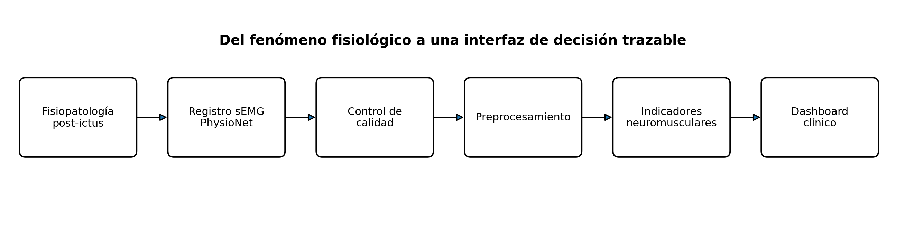

::: {.callout-note title="Solicitud clínica"}
Un médico fisiatra solicita una herramienta para \textbf{monitorear la actividad muscular de personas con antecedente de ictus isquémico}, con énfasis en hemiparesia y uso funcional del músculo durante actividades de la vida diaria. El médico no solicita un clasificador automático ni una herramienta de diagnóstico. Solicita un tablero que responda cuatro preguntas: \textbf{(1)} ¿hay actividad muscular registrable?, \textbf{(2)} ¿cómo se distribuye esa actividad en el tiempo?, \textbf{(3)} ¿la calidad del registro permite interpretar los indicadores con confianza?, y \textbf{(4)} en evaluaciones repetidas y estandarizadas, ¿existen cambios en la activación neuromuscular compatibles con evolución de la función motora post-ictus?
:::

# Propósito del tutorial

Este tutorial guía la construcción de un dashboard clínico a partir de **electromiografía de superficie (sEMG)**. El caso de estudio es el monitoreo post-ictus y el conjunto de datos base es **Cerebral Vasoregulation in Elderly with Stroke (CVES)** de PhysioNet [@physionet_cves].

El objetivo no es producir un biomarcador diagnóstico. El objetivo es diseñar una cadena reproducible que conecte:

1. fisiopatología post-ictus;
2. variable fisiológica observable;
3. señal bioeléctrica;
4. procesamiento digital;
5. indicador cuantitativo;
6. visualización clínicamente interpretable.

{width=96%}

Al finalizar, el estudiante debe poder justificar **por qué calcula cada indicador**, **qué supuestos necesita** y **qué no puede concluir** a partir de la señal.

## Resultado esperado

El producto final consta de dos artefactos:

- un **pipeline de procesamiento** de sEMG reproducible en Python;
- un **dashboard en Streamlit** que permita explorar segmentos del registro, visualizar señal cruda/filtrada/envolvente, inspeccionar indicadores y revisar la calidad de señal.

# 1. Del problema clínico a una variable medible

## 1.1 ¿Qué cambia después de un ictus?

Un ictus puede alterar la salida motora descendente y, con ello, la activación voluntaria del músculo. En rehabilitación post-ictus, la sEMG es útil porque ofrece información objetiva sobre **presencia, intensidad relativa y temporalidad de la activación muscular**, incluso cuando el movimiento visible es pequeño [@munoznovoa2022].

Para este tutorial nos interesan cuatro manifestaciones funcionales:

- reducción o intermitencia de la actividad muscular;
- menor tiempo de participación activa del músculo;
- organización temporal anormal de los episodios de activación;
- posible asimetría entre canales equivalentes, **solo si la identidad anatómica y la lateralidad de los canales están documentadas**.

::: {.callout-warning title="Advertencia metodológica"}
La sEMG \textbf{no mide fuerza directamente}. La amplitud depende, entre otros factores, del reclutamiento de unidades motoras, la posición del electrodo, la impedancia piel-electrodo, el tejido subcutáneo y la geometría del músculo. Por ello, una diferencia de amplitud entre sujetos no debe interpretarse automáticamente como una diferencia de fuerza.
:::

## 1.2 Cadena fisiología → ingeniería

| Nivel | Pregunta | Variable/decisión |
|---|---|---|
| Fisiología | ¿Existe activación neuromuscular? | Actividad eléctrica muscular registrable |
| Adquisición | ¿La señal contiene información interpretable? | sEMG en µV, frecuencia de muestreo, artefactos |
| Procesamiento | ¿Cómo se aísla la banda útil? | Filtrado, rectificación, RMS/envolvente |
| Indicador | ¿Cuánta actividad y durante cuánto tiempo? | RMS, porcentaje de tiempo activo, tasa y duración de episodios |
| Calidad | ¿Los indicadores son confiables? | Relación de ruido de red, artefacto de baja frecuencia, datos faltantes |
| Interfaz | ¿Puede el clínico comprenderlo? | Trazado + indicadores + contexto + advertencias |

# 2. Dataset: PhysioNet CVES

El recurso CVES contiene datos multimodales de adultos mayores con antecedente de ictus isquémico y controles [@novak2010; @physionet_cves]. Entre sus archivos existen registros de ECG, EMG y acelerometría de larga duración. PhysioNet documenta que los registros de 24 horas de ECG/EMG fueron adquiridos con un sistema **ME6000** a **1000 Hz** y se distribuyen en formato WFDB [@physionet_cves].

El sistema ME6000 está diseñado para adquisición de señales de EMG de superficie; por ello, este tutorial trata esos canales como sEMG. No obstante, la interpretación anatómica específica exige revisar la documentación de adquisición del estudio.

## 2.1 Por qué este dataset es útil para docencia

- contiene participantes con ictus y controles;
- el registro es suficientemente largo para estudiar actividad muscular cotidiana;
- el formato WFDB permite lectura parcial sin descargar decenas de gigabytes;
- el archivo `subjects.csv` incluye variables clínicas como grupo, lado del ictus, NIHSS, mRS y síntomas;
- algunos encabezados WFDB contienen cuatro canales `emg_0` a `emg_3`, además de ECG y acelerometría.

Como ejemplo didáctico, el sujeto **S0205** aparece como participante con ictus, con lateralidad derecha del evento, hemiparesia izquierda, NIHSS 10 y mRS 3 en la tabla de participantes. Un registro asociado es `s0205-05080904`.

::: {.callout-warning title="Advertencia metodológica"}
Los nombres \texttt{emg\_0}, \texttt{emg\_1}, etc. no identifican por sí mismos el músculo ni la lateralidad. Por tanto, el tutorial \textbf{no asigna nombres anatómicos inventados}. El dashboard mantiene el identificador original hasta que el estudiante verifique la correspondencia en el protocolo del estudio.
:::

## 2.2 Acceso reproducible

Instale Quarto, Python y `uv`. En la carpeta del proyecto:

```bash
uv init
uv add numpy pandas scipy plotly streamlit wfdb pyarrow
```

No descargue el conjunto completo. CVES supera ampliamente lo necesario para esta práctica. WFDB permite leer únicamente el intervalo solicitado.

# 3. Inspección del participante y del registro

Primero se inspeccionan metadatos. Esta etapa evita que la ingeniería pierda el contexto clínico.

```{python}
import pandas as pd

SUBJECTS_URL = "https://physionet.org/files/cves/1.0.0/subjects.csv"
subjects = pd.read_csv(SUBJECTS_URL)

subject_id = "S0205"
row = subjects.loc[subjects["subject_number"].eq(subject_id)].iloc[0]

cols = [
    "subject_number", "group", "age", "gender",
    "NIHSS", "MRS", "Stroke Side", "Symptoms"
]
print(row[cols])
```

Los metadatos observados son:

| Campo y valor | Explicación |
|:---|:---|
| **`subject_number`**: `S0205` | Identificador único del participante dentro del conjunto de datos. Permite relacionar sus datos clínicos con los registros fisiológicos sin utilizar directamente información personal identificable. |
| **`group`**: `STROKE` | Grupo clínico al que pertenece el participante. `STROKE` indica que corresponde al grupo de sujetos con antecedente de **ictus**. |
| **`age`**: `63` | Edad del participante, expresada en años. En este registro, el sujeto tiene **63 años**. |
| **`gender`**: `F` | Sexo codificado en el dataset. `F` corresponde a **Female**, es decir, mujer. |
| **`NIHSS`**: `10.0` | Puntaje en la **National Institutes of Health Stroke Scale (NIHSS)**. Esta escala cuantifica el déficit neurológico asociado al ictus. Debe considerarse una variable clínica externa y no una característica derivada de la sEMG. |
| **`MRS`**: `3.0` | Puntaje en la **modified Rankin Scale (mRS)**. Evalúa el nivel global de discapacidad o dependencia funcional después del ictus. Un valor de 3 corresponde a discapacidad moderada. |
| **`Stroke Side`**: `RIGHT` | Indica el lado reportado en el dataset como asociado al ictus. Es necesario verificar en la documentación si se refiere al **hemisferio cerebral afectado** o al **lado corporal comprometido** antes de utilizar esta variable en análisis de lateralidad de sEMG. |
| **`Symptoms`**: `L hemiparesis` | Síntoma clínico registrado. `L hemiparesis` significa **hemiparesia izquierda**, es decir, debilidad motora parcial del lado izquierdo del cuerpo. |
| **`Name`**: `47` | Índice de la fila en la estructura de datos de Pandas. **No corresponde a una variable clínica** del participante. |
| **`dtype`**: `object` | Tipo de dato de la `Series` de Pandas. **No corresponde a una variable clínica**. |

A continuación se inspecciona el encabezado del registro sin descargar el archivo completo:

```{python}
import wfdb

PN_DIR = "cves/1.0.0/data/24h-electromyography"
RECORD = "s0205-05080904"

header = wfdb.rdheader(RECORD, pn_dir=PN_DIR)
print("fs =", header.fs)
print("duración [h] =", header.sig_len / header.fs / 3600)
print("canales =", header.sig_name)
```

El estudiante debe verificar tres cosas antes de procesar:

1. frecuencia de muestreo;
2. unidades;
3. lista de canales disponibles.

::: {.callout-important title="Punto de verificación"}
Si el encabezado no contiene canales EMG o la unidad no es interpretable, el pipeline debe detenerse. Un dashboard no corrige un problema semántico de los datos.
:::

# 4. Selección eficiente de un segmento

Para una primera exploración no es necesario cargar horas de señal. Comience con 120 s.

```{python}
import numpy as np

START_S = 0
DURATION_S = 120

emg_idx = [
    i for i, name in enumerate(header.sig_name)
    if "emg" in name.lower()
]

record = wfdb.rdrecord(
    RECORD,
    pn_dir=PN_DIR,
    sampfrom=int(START_S * header.fs),
    sampto=int((START_S + DURATION_S) * header.fs),
    channels=emg_idx,
)

fs = float(record.fs)
x = record.p_signal
names = record.sig_name

print(x.shape)
print(names)
```

## 4.1 ¿Por qué trabajar por ventanas?

La sEMG de actividades diarias es no estacionaria. Un indicador global de varias horas puede ocultar episodios cortos de actividad. Por ello se combinan dos escalas:

- **escala de señal:** milisegundos a segundos, para filtrar y estimar amplitud;
- **escala funcional:** segundos a minutos, para resumir actividad y presentarla en el dashboard.

# 5. Control de calidad antes del indicador clínico

El error habitual es filtrar y calcular RMS sin preguntarse si la señal es confiable. El orden correcto es:

$$
\text{dato crudo} \rightarrow \text{calidad} \rightarrow \text{preprocesamiento} \rightarrow \text{indicador}
$$

## 5.1 Indicadores de calidad propuestos

### Potencia alrededor de la red eléctrica

En el contexto del registro realizado en Estados Unidos, 60 Hz es una frecuencia esperable de interferencia eléctrica. Se estima la fracción de potencia alrededor de 60 Hz respecto a la potencia total entre 20 y 450 Hz.

$$
Q_{60}=100\frac{\sum_{f\in[59,61]}P(f)}{\sum_{f\in[20,450]}P(f)}
$$

No existe un umbral universal. El valor se usa para **comparación interna y detección de segmentos sospechosos**, no como criterio clínico absoluto.

### Artefacto de baja frecuencia

Movimiento del electrodo y cambios de contacto pueden aumentar energía a muy baja frecuencia. Una razón exploratoria es:

$$
Q_{LF}=100\frac{\sum_{f\in[0.5,15]}P(f)}{\sum_{f\in[0.5,450]}P(f)}
$$

## 5.2 Implementación

```{python}
from scipy import signal


def band_power_ratio(x, fs, num_band, den_band):
    f, pxx = signal.welch(x, fs=fs, nperseg=min(len(x), int(4 * fs)))

    num = (f >= num_band[0]) & (f <= num_band[1])
    den = (f >= den_band[0]) & (f <= den_band[1])

    p_num = np.trapz(pxx[num], f[num])
    p_den = np.trapz(pxx[den], f[den])
    return np.nan if p_den <= 0 else 100 * p_num / p_den


quality = []
for j, name in enumerate(names):
    sig = x[:, j]
    quality.append({
        "channel": name,
        "line_noise_60_pct": band_power_ratio(sig, fs, (59, 61), (20, 450)),
        "low_freq_pct": band_power_ratio(sig, fs, (0.5, 15), (0.5, 450)),
        "missing_pct": 100 * np.mean(~np.isfinite(sig)),
    })

quality_df = pd.DataFrame(quality)
quality_df
```

# 6. Preprocesamiento de sEMG

## 6.1 Banda de interés

Para esta práctica se usa un filtro pasabanda **20--450 Hz**. La elección se justifica por dos razones:

- atenuar deriva y artefactos lentos;
- conservar la mayor parte del contenido útil de sEMG sin acercarse demasiado a Nyquist, que para 1000 Hz es 500 Hz.

El límite superior no es una propiedad universal del músculo. Depende del sistema de adquisición, frecuencia de muestreo y ancho de banda real del sensor.

## 6.2 ¿Rectificación o RMS?

La señal EMG bipolar oscila alrededor de cero. Para estimar magnitud de activación se usa una transformación no negativa. Dos opciones frecuentes son:

- rectificación + filtro pasa-bajas para envolvente;
- RMS en ventana móvil.

En este tutorial se conservan ambas porque responden preguntas diferentes: la envolvente es útil para visualizar el perfil temporal y RMS es conveniente para resumir magnitud local.

## 6.3 Código de procesamiento

```{python}
from scipy import signal
from scipy.ndimage import uniform_filter1d


def interpolate_nan(x):
    x = np.asarray(x, dtype=float)
    if np.all(np.isfinite(x)):
        return x
    idx = np.arange(len(x))
    good = np.isfinite(x)
    if good.sum() < 2:
        return np.full_like(x, np.nan)
    return np.interp(idx, idx[good], x[good])


def bandpass_semg(x, fs, low=20.0, high=450.0, order=4):
    x = interpolate_nan(x)
    sos = signal.butter(order, [low, high], btype="bandpass", fs=fs, output="sos")
    return signal.sosfiltfilt(sos, x)


def notch_if_needed(x, fs, f0=60.0, q=30.0):
    b, a = signal.iirnotch(f0, q, fs=fs)
    return signal.filtfilt(b, a, x)


def rms_envelope(x, fs, window_ms=250):
    n = max(3, int(window_ms / 1000 * fs))
    return np.sqrt(uniform_filter1d(x**2, size=n, mode="nearest"))


def linear_envelope(x, fs, cutoff=5.0):
    rect = np.abs(x)
    sos = signal.butter(4, cutoff, btype="lowpass", fs=fs, output="sos")
    return signal.sosfiltfilt(sos, rect)
```

::: {.callout-tip title="Decisión de ingeniería"}
No aplique el notch de 60 Hz automáticamente. Primero observe el espectro o el indicador de ruido. El filtrado excesivo puede modificar información útil y crear una falsa sensación de limpieza.
:::

# 7. De la señal a indicadores de monitoreo

## 7.1 Indicador 1: RMS local

Para una ventana de $N$ muestras:

$$
\mathrm{RMS}=\sqrt{\frac{1}{N}\sum_{n=1}^{N}x^2[n]}
$$

En sEMG, RMS resume la magnitud de la señal en una ventana local. En este tutorial se usa una ventana de **250 ms** para el tablero. Esa duración produce una curva más estable que la señal cruda y mantiene resolución suficiente para actividades cotidianas relativamente lentas.

**Interpretación:** mayor RMS significa mayor magnitud eléctrica registrada, no necesariamente mayor fuerza.

## 7.2 Indicador 2: fracción de tiempo activo

Se define un umbral interno sobre la serie RMS. Como el dataset no contiene una contracción voluntaria máxima estandarizada para normalización, se evita reportar `%MVC`.

Se usa un umbral robusto exploratorio:

1. tomar el 20 % de valores RMS más bajos;
2. estimar mediana y MAD;
3. definir $T=\mathrm{mediana}+3\,\mathrm{MAD}_{esc}$.

$$
\mathrm{MAD}_{esc}=1.4826\,\mathrm{median}(|x-\mathrm{median}(x)|)
$$

La fracción activa es:

$$
A=100\frac{N(RMS>T)}{N_{total}}
$$

Este indicador responde: **¿qué porcentaje del segmento presenta actividad por encima del nivel basal interno?**

## 7.3 Indicador 3: tasa de episodios de activación

Una transición de inactivo a activo inicia un episodio. Se reporta:

$$
R_b=\frac{N_{episodios}}{\text{duración en minutos}}
$$

Este indicador describe **fragmentación temporal** de la activación.

## 7.4 Indicador 4: duración mediana de episodios

La duración de cada episodio se calcula a partir de la señal binaria de actividad. Se reporta mediana, no media, porque los episodios largos pueden sesgar la distribución.

## 7.5 Indicador 5: cambio longitudinal de RMS durante actividad

Para seguimiento de rehabilitación interesa separar la **magnitud de activación durante los periodos realmente activos** de la cantidad de tiempo en que el músculo permanece inactivo. Para una sesión clínica $k$, se define primero:

$$
RMS_{act,k}=\operatorname{mediana}\{RMS[n]\;|\;RMS[n]>T_k\}
$$

donde $T_k$ es el umbral de actividad calculado con el mismo procedimiento en todas las visitas. Tomando la primera evaluación estandarizada como referencia:

$$
\Delta RMS_{rel,k}=100\frac{RMS_{act,k}-RMS_{act,0}}{RMS_{act,0}}
$$

Este indicador resume el **cambio porcentual de la magnitud eléctrica durante activaciones detectadas**. En un estudio piloto de seguimiento post-ictus, el RMS aumentó en la mayoría de los músculos paréticos después de rehabilitación, por lo que puede aportar información complementaria para monitorizar cambios neuromusculares [@zhu2020].

**Interpretación longitudinal:** un aumento de $\Delta RMS_{rel}$ puede ser compatible con mayor capacidad de activación/reclutamiento durante una tarea comparable, pero **no demuestra por sí solo recuperación neurológica ni aumento de fuerza**.

::: {.callout-warning title="Advertencia metodológica"}
El RMS entre visitas solo es interpretable si se controla el músculo registrado, posición de electrodos, preparación de piel, ganancia, tarea, postura, carga, ventana RMS y filtros. Si estas condiciones cambian, la variación instrumental puede ser del mismo orden o mayor que el cambio fisiológico.
:::

## 7.6 Indicador 6: distancia relativa de frecuencia mediana respecto al músculo contralateral

La **frecuencia mediana (MDF)** divide en dos partes iguales la potencia espectral dentro de la banda de análisis:

$$
\int_{f_L}^{MDF}P(f)\,df
=
\frac{1}{2}\int_{f_L}^{f_H}P(f)\,df
$$

con $f_L=20\,\mathrm{Hz}$ y $f_H=450\,\mathrm{Hz}$ en este tutorial. Cuando se dispone de un par de músculos homólogos paretico/contralateral correctamente identificado, se propone:

$$
D_{MDF,k}=100\frac{|MDF_{paretico,k}-MDF_{contra,k}|}{MDF_{contra,k}}
$$

El indicador no busca que MDF aumente o disminuya en una dirección universal; busca cuantificar **cuán distante está el patrón espectral del músculo parético respecto a una referencia contralateral del mismo sujeto**. En el seguimiento piloto de Zhu et al., la MDF del músculo parético tendió a aproximarse al valor contralateral durante la rehabilitación [@zhu2020]. Por tanto, una reducción de $D_{MDF}$, bajo un protocolo repetido y controlado, puede considerarse compatible con convergencia del comportamiento espectral.

::: {.callout-warning title="Advertencia metodológica"}
CVES es un estudio transversal y el registro de 24 h de EMG corresponde al día 1 [@physionet_cves]. Además, los canales aparecen como \texttt{emg\_0}, \texttt{emg\_1}, etc., sin identificación anatómica suficiente en el encabezado. En consecuencia, el dataset permite enseñar el cálculo de MDF por canal, pero \textbf{no permite afirmar una trayectoria de recuperación} ni calcular $D_{MDF}$ como indicador clínico hasta verificar músculo, lateralidad y disponer de visitas repetidas comparables.
:::

## 7.7 Indicadores que NO se calculan automáticamente

**Asimetría bilateral.** Solo es válida si existe certeza de que dos canales representan el mismo músculo en lados opuestos.

**Co-contracción agonista-antagonista.** Es relevante en alteración motora post-ictus [@wang2025], pero exige conocer exactamente qué músculos representan los canales. Sin esa información, calcular un índice de co-contracción sería metodológicamente incorrecto.

**Frecuencia mediana como fatiga.** Puede ser útil en contracciones relativamente estacionarias, pero un registro de vida diaria mezcla tareas, posturas y niveles de fuerza. No se usa como indicador primario en este dashboard.

# 8. Funciones para extraer los indicadores

```{python}
def robust_activity_threshold(rms):
    rms = np.asarray(rms, dtype=float)
    q20 = np.nanquantile(rms, 0.20)
    base = rms[rms <= q20]
    med = np.nanmedian(base)
    mad = 1.4826 * np.nanmedian(np.abs(base - med))
    return med + 3.0 * mad


def run_lengths(binary, fs):
    binary = np.asarray(binary, dtype=bool)
    starts = np.flatnonzero(np.diff(np.r_[False, binary].astype(int)) == 1)
    ends = np.flatnonzero(np.diff(np.r_[binary, False].astype(int)) == -1) + 1
    durations = (ends - starts) / fs
    return starts, ends, durations


def median_frequency(x, fs, band=(20.0, 450.0)):
    """Frecuencia mediana espectral dentro de una banda definida."""
    x = np.asarray(x, dtype=float)
    f, pxx = signal.welch(
        x,
        fs=fs,
        nperseg=min(len(x), max(256, int(4 * fs)))
    )

    mask = (f >= band[0]) & (f <= band[1])
    fb = f[mask]
    pb = pxx[mask]

    if len(fb) < 2 or np.nansum(pb) <= 0:
        return np.nan

    # Integral acumulada por trapecios, sin depender de scipy.integrate.
    df = np.diff(fb)
    areas = 0.5 * (pb[:-1] + pb[1:]) * df
    cumulative = np.r_[0.0, np.cumsum(areas)]
    half_power = 0.5 * cumulative[-1]
    idx = int(np.searchsorted(cumulative, half_power, side="left"))
    idx = min(idx, len(fb) - 1)
    return float(fb[idx])


def longitudinal_rms_change(current_active_rms, baseline_active_rms):
    """Cambio porcentual de RMS activo respecto a la visita basal."""
    if not np.isfinite(baseline_active_rms) or baseline_active_rms <= 0:
        return np.nan
    return 100.0 * (current_active_rms - baseline_active_rms) / baseline_active_rms


def mdf_distance_to_contralateral(mdf_paretic, mdf_contralateral):
    """Distancia relativa (%) entre MDF parética y contralateral."""
    if not np.isfinite(mdf_contralateral) or mdf_contralateral <= 0:
        return np.nan
    return 100.0 * abs(mdf_paretic - mdf_contralateral) / mdf_contralateral


def semg_metrics(filtered, fs):
    rms = rms_envelope(filtered, fs, window_ms=250)
    env = linear_envelope(filtered, fs, cutoff=5.0)
    thr = robust_activity_threshold(rms)
    active = rms > thr

    starts, ends, durations = run_lengths(active, fs)
    minutes = len(filtered) / fs / 60

    return {
        "rms": rms,
        "envelope": env,
        "threshold": thr,
        "active": active,
        "median_rms_uV": float(np.nanmedian(rms)),
        "active_rms_median_uV": (
            float(np.nanmedian(rms[active])) if np.any(active) else np.nan
        ),
        "mdf_hz": median_frequency(filtered, fs, band=(20.0, 450.0)),
        "active_time_pct": float(100 * np.nanmean(active)),
        "bursts_per_min": float(len(starts) / minutes) if minutes > 0 else np.nan,
        "median_burst_s": float(np.nanmedian(durations)) if len(durations) else 0.0,
    }
```

## 8.1 Cómo construir la comparación longitudinal

Los dos indicadores nuevos requieren **visitas clínicas repetidas**. La unidad de comparación no debe ser un segmento arbitrario de 24 horas, sino la misma tarea funcional bajo un protocolo equivalente. Para cada visita se almacenan, como mínimo:

- participante;
- fecha/visita;
- canal y músculo confirmado;
- lado paretico/contralateral;
- tarea, postura y carga;
- `active_rms_median_uV`;
- `mdf_hz`;
- escala clínica asociada, si está disponible (por ejemplo, FMA o NIHSS, sin convertirla automáticamente en etiqueta de EMG).

El cálculo longitudinal puede escribirse así:

```{python}
def longitudinal_pair_metrics(current, baseline, contralateral=None):
    out = {
        "delta_active_rms_pct": longitudinal_rms_change(
            current["active_rms_median_uV"],
            baseline["active_rms_median_uV"],
        )
    }

    if contralateral is not None:
        out["mdf_gap_pct"] = mdf_distance_to_contralateral(
            current["mdf_hz"],
            contralateral["mdf_hz"],
        )
    else:
        out["mdf_gap_pct"] = np.nan

    return out
```

::: {.callout-tip title="Decisión de ingeniería"}
Para el dashboard longitudinal, la visualización recomendada es una serie temporal por visita con dos paneles separados: $\Delta RMS_{rel}$ y $D_{MDF}$. No deben combinarse en un único "score de recuperación" porque miden dimensiones diferentes y no existe una ponderación clínica validada para este tutorial.
:::

# 9. Tabla de trazabilidad fisiológica

El dashboard debe mostrar únicamente métricas con una cadena de interpretación explícita.

| Indicador | Significado ingenieril | Relación funcional plausible | Riesgo de interpretación |
|---|---|---|---|
| RMS local | Magnitud de sEMG en ventana | Nivel relativo de activación | No equivale a fuerza; sensible a electrodos |
| Tiempo activo | Ocupación temporal sobre umbral | Participación muscular durante la tarea | Depende del umbral y del segmento |
| Episodios/min | Frecuencia de inicios de actividad | Fragmentación o recurrencia del uso muscular | Puede reflejar tarea, no patología |
| Duración mediana | Persistencia de episodios | Capacidad de sostener actividad | Requiere contexto de actividad |
| $\Delta RMS_{rel}$ | Cambio de RMS activo respecto a visita basal | Cambio longitudinal de magnitud de activación | Muy sensible a protocolo/electrodos; no equivale a fuerza |
| $D_{MDF}$ | Distancia espectral frente a músculo contralateral | Convergencia del patrón espectral bajo seguimiento | Requiere músculos homólogos, bilateralidad y tareas comparables |
| Ruido 60 Hz | Contaminación espectral | Ninguna; es calidad de señal | No es indicador clínico |
| Baja frecuencia | Artefacto lento/movimiento | Ninguna; es calidad de señal | Movimiento real y artefacto pueden coexistir |

# 10. Diseño del dashboard

El tablero se diseña para responder preguntas clínicas, no para mostrar todas las variables disponibles.

## 10.1 Jerarquía visual

**Nivel 1 — Contexto clínico**  
Participante, grupo, edad, lateralidad del ictus, NIHSS, mRS y síntomas disponibles.

**Nivel 2 — Señal**  
Trazado crudo, filtrado, envolvente y umbral.

**Nivel 3 — Indicadores**  
Tiempo activo, RMS mediana, episodios/min y duración mediana. En un protocolo longitudinal: cambio de RMS activo respecto a la visita basal y distancia relativa de MDF frente al músculo contralateral homólogo.

**Nivel 4 — Calidad**  
Ruido de red, energía de baja frecuencia y faltantes.

**Nivel 5 — Limitaciones**  
Mensaje visible indicando que el dashboard es exploratorio y no sustituye evaluación clínica.

## 10.2 Qué evitar

- semáforos rojo/verde sin umbrales clínicamente validados;
- un único “score de salud muscular” sin modelo validado;
- comparar amplitud absoluta entre pacientes como si fuese fuerza;
- ocultar los filtros aplicados;
- identificar músculos sin evidencia documental;
- convertir correlación en diagnóstico.

# 11. Aplicación completa en Streamlit

Guarde el siguiente código como `app_dashboard_semg.py`. Una copia separada se incluye junto con este tutorial.

```{python}
#| code-fold: false
#| code-overflow: wrap

# Véase el archivo app_dashboard_semg.py incluido con el tutorial.
# En clase se recomienda revisar ese archivo por bloques:
# 1) carga de metadatos;
# 2) lectura parcial WFDB;
# 3) control de calidad;
# 4) preprocesamiento;
# 5) indicadores;
# 6) visualización.
```

Ejecute:

```bash
uv run streamlit run app_dashboard_semg.py
```

# 12. Validación del pipeline

## 12.1 Validación técnica mínima

Antes de interpretar el dashboard, verifique:

- `fs` leído del encabezado y no escrito manualmente;
- unidades del canal;
- ausencia de `NaN` masivos;
- estabilidad del filtro;
- que el espectro post-filtrado no presente energía fuera de la banda esperada;
- que el umbral de actividad no marque casi todo el segmento activo o inactivo por un fallo numérico;
- que la duración de episodios tenga sentido respecto a la tarea observada;
- que el RMS longitudinal se compare únicamente bajo un protocolo de adquisición equivalente;
- que MDF se calcule sobre segmentos activos y suficientemente largos para una estimación espectral estable;
- que cualquier comparación paretico/contralateral use músculos homólogos identificados documentalmente.

## 12.2 Validación fisiológica

La pregunta no es “¿el gráfico se ve bien?”, sino:

> ¿El indicador conserva una interpretación fisiológica defendible después de cada transformación?

Ejemplo: si el RMS aumenta después de aplicar un filtro, esa diferencia debe explicarse por el cambio en contenido espectral, no asumirse como mayor activación biológica.

# 13. Actividad práctica propuesta

El estudiante debe seleccionar un participante con ictus y uno control, y para cada uno:

1. inspeccionar metadatos y encabezado WFDB;
2. seleccionar tres segmentos de al menos 120 s en momentos diferentes;
3. calcular métricas de calidad;
4. aplicar el mismo pipeline de preprocesamiento;
5. generar indicadores de actividad;
6. discutir qué diferencias son atribuibles al sujeto y cuáles pueden depender del contexto de registro;
7. documentar qué información faltante impide una conclusión clínica más fuerte.

No se exige concluir que el sujeto con ictus tiene “peor” señal. Se exige distinguir **dato**, **indicador** e **interpretación**.

# 14. Preguntas de verificación

1. ¿Por qué el RMS no debe interpretarse directamente como fuerza muscular?
2. ¿Qué efecto tendría reducir la ventana RMS de 250 ms a 50 ms?
3. ¿Por qué un notch de 60 Hz no debe aplicarse sin revisar primero la contaminación espectral?
4. ¿Qué información necesita para calcular una asimetría bilateral interpretable?
5. ¿Por qué la frecuencia mediana no es un indicador primario de fatiga en un registro de actividad diaria no controlada?
6. ¿Qué ventaja tiene separar indicadores de calidad de los indicadores funcionales?
7. ¿Qué cambia en la interpretación si el segmento corresponde a reposo, marcha o una tarea de miembro superior?
8. ¿Por qué un aumento de RMS entre visitas no puede interpretarse automáticamente como recuperación motora?
9. ¿Qué significa que $D_{MDF}$ disminuya y qué condiciones deben cumplirse antes de interpretarlo?
10. ¿Qué evidencia adicional necesitaría para convertir este dashboard en una herramienta clínica de seguimiento longitudinal?

# 15. Criterios de aprendizaje

Al terminar el tutorial, el estudiante demuestra logro si puede:

- conectar una alteración neuromuscular post-ictus con una variable observable en sEMG;
- justificar parámetros de filtrado y ventanas temporales;
- separar métricas de calidad de señal de indicadores fisiológicos;
- implementar lectura parcial de PhysioNet en WFDB;
- construir un dashboard cuyo orden visual siga preguntas clínicas;
- calcular e interpretar un cambio longitudinal de RMS bajo condiciones estandarizadas;
- calcular MDF y justificar cuándo puede compararse con el músculo contralateral;
- declarar explícitamente las limitaciones que impiden una inferencia diagnóstica.

# 16. Cierre

Un dashboard biomédico no es una colección de gráficas. Es una **interfaz de decisión** cuyo valor depende de la trazabilidad entre fisiología, adquisición, procesamiento e interpretación. En el caso post-ictus, la sEMG puede aportar una ventana objetiva a la actividad muscular [@munoznovoa2022], pero su utilidad depende de no confundir amplitud eléctrica con fuerza, no inventar la anatomía de los canales y no ocultar la incertidumbre asociada al registro.

La arquitectura desarrollada aquí puede ampliarse posteriormente con:

- anotaciones de actividad;
- acelerometría sincronizada;
- comparación longitudinal del mismo sujeto mediante $\Delta RMS_{rel}$ y, cuando exista mapeo bilateral confiable, $D_{MDF}$;
- índices bilaterales cuando la lateralidad esté documentada;
- coactivación agonista-antagonista cuando los músculos estén identificados;
- análisis por tarea en lugar de análisis por tiempo arbitrario.

# Referencias

::: {#refs}
:::
